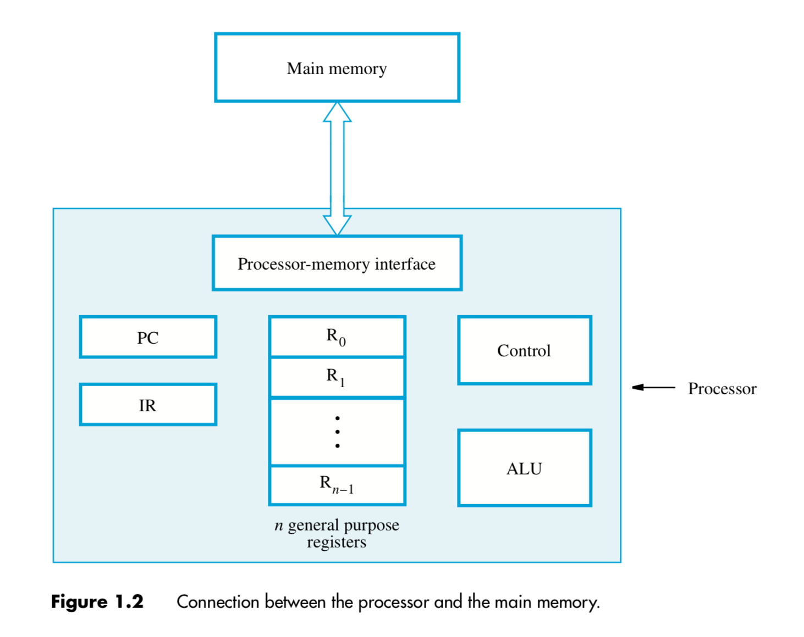

# CS 2115

#### Project (group - 4 person)

- report & presentation
- 5 bonus (up to 30%)

------

## Lecture 1

------

### 1. History:

- Analytical Engine
  - Charles Babbage
  - Made by mechanical
  - Started in 1833; never finished
- Turing machine (1937) => basis of modern computing
  - Theoretically, as poweful as other computers
  - Conceptually, a finite set of states, a finite alphabet and a finite set of instructions
  - Physically, it has a head (read&write), and move along an infinitely long tape that is divided into cells storing a letter
- Stored-program concept (1944 by John von Neumann and Alan Turing)
  - Store program and data in memory
  - A computer can read them form memory
  - Program can be altered
- Structure of von Neumann machine
  - Main Memory $\iff$ (CPU (CA and ALU))$\iff$ I/O
- Transistor(晶体管)
  - solid state device made from Silicon (sand)
  - Act as a variable value
- Integrated Circuit (1964)
  - Make computers smaller
  - Cost of a chip virtually unchanged with the growth in density
  - Components placed closer => faster to access
  - Reduction in power and cooling requirement
  - The interconnection is much more reliable than solder connections
- Moore's Law
  - The number of transistors that could be put on a single chip will be doubling every year (slows to 18 months in 70s(1970)) => speed of CPU also doubling
- The Gap between IC Capacity/ Design Productivity and Memory
  - Use **wide data buses** so we can retrieve more bits at the smae time when we read or write to memory
  - Include a cache(between CPU and memory) or hierarchical buffering scheme to make memory chip work more efficiently
    - Faster but size is small and expensive
    - Reduce miss match(memory输出速度跟不上CPU需求)
  - Put cache into processors (increasingly, processor design dedicates over 50% transistors for cache)
  - Use high-speed buses to interconnect processor and memory

------

### 2. Turing Machine

- Alan Turing : Father of Computer
  - Turing Machine
  - Cracking Nazi Enigma
  - Turing test
  - Turing Award
- Hierarchy of Machines : Combinational Logic $\in$ Finite-state machine $\in$ Push down automation $\in$ Turing machine
- A Thinking Machine
  - basic ideas
    - Compute anyting that a human can compute
    - Studied one of Hilbert's 10th mathematical conjecture on "Entscheidung problem"
    - Turing's machine is a thought experiement. Any algorithm can be carried
- Rule of addition (from lower bits)
  - If read 1, write 0, go right
  - If read 0, write 1
  - If read blank, write 1
- Rule of substraction
  - If read 1, write 0
  - If read 0, write1, go right

------

## Chapter 1

------

### 1.1 Organization And Architecture

- **Computer Architecture** : Refers to those attributes of a system visible to a programmer or, put another way, those attributes that have a direct impact on the logical execution of a program
- **Computer Organization** : Refers to the *operational units* and their *interconnections* that realize the architectural specifications (Same architecture may have different organizations)
- Organization attributes : Hardware details transparent to the programmer
  - Control signals
  - Interfaces between computers and peripherals
  - Memory technology used

------

### 1.2 Sturcture And Function

- Key of clearly describe millions of elementary electronic components : Recognize the hierarchical nature of most complex systems (Divide the system into different levels to implement)

- At each Level, the designer is concerned with structure and function

  - Structure : The way in which the components are interrelated
  - Function : The operation of each individual component as part of the structure

- Two choice to understand the Organization

  - Start at the bottom and building up a complete description
  - Beginning with a top view (Clearest and most effective)

- Function

  - Data processing
    - The data may take a wide variety of forms => range of processing requirements is broad
  - Data storage
    - Even if the computer is processing data on the fly (in and out immediately), the computer must temporarily store at least those pieces of data that are being worked on at any given moment => short-term data storage function (RAM)
    - Equally important, the computer performs a long-term data storage function (File of data are sotred on the computer for subsequent retrieval and update) => ROM
  - Data movement
    - **move data** between itself and outside world => I/O
    - Device to provide this function => **peripheral** (外设)
    - data moved over longer distances => *data communications*
  - Control
    - Within the computer, a control unit manages the computer's resources and orchestrates (编排) the performance of its functional parts in response to those instructions

  

- Structure : 

  - Out : All the linkages to the external environment can be classified as peripheral devices or communication lines

  - Internal: 

    - **Central processing unit (CPU)**: Controls the operation of the computer and performs its data processing functions; often simply referred to as **processor** (1 or more)
      - **Control unit**: Controls the operation of the CPU and hence the computer
        - Parts
          - Sequecing logic
          - Control unit registers and decoders
          - Control memory
        - Different implementations of Control unit
          - *microprogrammed* implementation : Operate by executing microinstructions that define the functionality of the control unit
      - **Arithmetic and logic unit (ALU)** : Performs the computer's data processing functions
      - **Registers** : Provides storage internal to the CPU
      - **CPU interconnection** : Some mechanism that provides for communication among the control unit, ALU and Registers
    - **Memory unit** : Stores data
      - **Primary memory** (Main memory): A fast memory that operates at electronic speeds, programs must be stored in this memory while they are being executed
        - Consist of  a large number of semiconductor storage cells, each capable of storing one bit of information. These cells are handled in group of fixed size called *words* instead of read or written individually
        - word length : number of bits in each word (16,32,64 bits)
        - *Address* : To provide easy access to any word in the memory, address is related with each word location
        - A memory in which any location can be accessed in a short and fixed amount of time after specifying its address is called ==*random-access-memory*==(RAM), the time required to access one word is called the ==*memory access time*==
      - **Cache Memory** : As an adjunct(附件) to the main memory, a smaller, faster RAM unit, called a *cache* => hold section of program that currently being executed, along with any associated data
      - **Secondary Storage** : When large amounts of data and many programs have to be stored, particularly for information that is accessed infrequently. (magnetic disks, optical disks(CD,DVD), flash memory devices)
    - **I/O**: Moves data between the computer and its external environment
    - **System interconnection**: Some mechanism that provides for communication among CPU, main memory, and **I/O**. A common example : **System bus**, consisting of a number of conducting wires to which all the other components attach.

    

    

---------------------

### 1.4 Number representation and arithmetic operations

#### LEC

* Decimal, Binary, Octal , Hexadecimal systems

  * Radix-R system

  $$
  N = (a_{n-1}a_{n-2}...a_1a_0.a_{-1}a_{-2}...a_{-m})_R
  $$

$$
  N = \sum_{i=-m}^{n-1}a_i*R^i(a_i={0,...,R-1})
$$

  * R = 2 binary, R = 8 Octal, R = 16 Hexadecimal

  * 10 to R (mod by R,divide by R each time)

  * for fractional number (multiple by 2 and record the integer part)

* Signed Number Representation

  * Sign Magnitude Number (0 for positive, 1 for negative) but:

    * Addition and subtraction need to consider sign and magnitude. 
    * Two representation of 0 
    * Complicate circuit and more computation time 

  * Two's Complement

  * Basic Rules:

    1. Positive numbers are represented in the same fashion as in sign magnitude numbers. 

    2. Negative numbers are represented as the complement of the corresponding positive numbers. 

  * Direct Method
    $$
    [N]_2(two's\ complement)=2^n-(N)_2
    $$

    * delete the first bits of $2^n$ it is 0, so we can maintain addition of (N) and (-N) is 0

  * Fast Method

    * Flit the bits and add 1

  * Conversion Between Lengths

    * Positive number pack with leading zeros
    * Negative numbers pack with leading ones
    * Reason : the sum is 0

  * Addition and Subtraction

    * Operation A-B by $(A)_2+[B]_2$ 
    * We only need a binary adder and do all the things

  * Range of Two's complement system : $-2^{n-1}\leq N\leq 2^{n-1}-1$

    * If after addition/substraction, the result is out of the range, it is called ==**overflow**==

  * Overflow Rule

    * All postive number with first bit 0, negative with first bit 1
    * If add 2 negative get a positive or 2 pos get 1 neg, overflow occurs

* Codebook Representation

  * Binary Floating-point

    * Method to record floating-point number => use a number multiply with $2^n$
    * first bits : sign 0(+) 1(-)
    * k bits bias exponent : record $(指数)_2+bias$ where bias is $(2^{k-1}-1)_2$ => to maintain $k$ digits
    * last digits to record the significant digit (小数点后)  => There is only one digit before the dot (scientific)

  * BInary Floating-point => decimal
    $$
    (N)_{10}={(-1)^s}(1+Significand)2^{(E)_2-127}
    $$

    * S : Sign Bit (0 + 1 -)

    $$
    Significand=s_1*2^{-1}+s_2*2^{-2}+...+s_n*2^{-n}
    $$

  * The Range of 32-bit Binary Floating Point number (8 exponent bits)

    * Biggest positive number : $(1+s_1*2^{-1}+s_2*2^{-2}+...+s_n*2^{-23})*2^{128}$
    * Smallest positive number : $(1)*2^{-127}$
    * Smallest negative number : $-(1+s_1*2^{-1}+s_2*2^{-2}+...+s_n*2^{-23})*2^{128}$
    * Biggest negative number : $-(1)*2^{-127}$

  * IEEE Standard for Binary Floating Point Numbers

    * Single format (1+8+23=32bits)
    * Double format (1+11+52=64bits)

* 