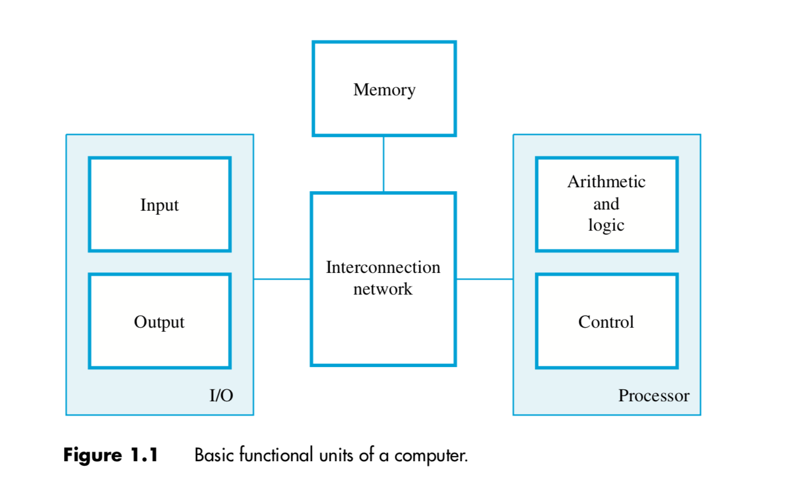

#  CS 2115

#### Project (group - 4 person)

- report & presentation
- 5 bonus (up to 30%)

------

## Lecture 1

------

### 1. History:

- Analytical Engine
  - Charles Babbage
  - Made by mechanical
  - Started in 1833; never finished
- Turing machine (1937) => basis of modern computing
  - Theoretically, as poweful as other computers
  - Conceptually, a finite set of states, a finite alphabet and a finite set of instructions
  - Physically, it has a head (read&write), and move along an infinitely long tape that is divided into cells storing a letter
- Stored-program concept (1944 by John von Neumann and Alan Turing)
  - Store program and data in memory
  - A computer can read them from memory
  - Program can be altered
- Structure of von Neumann machine
  - Main Memory $\iff$ (CPU (CA and ALU))$\iff$ I/O
- Transistor(晶体管)
  - solid state device made from Silicon (sand)
  - Act as a variable value
- Integrated Circuit (1964)
  - Make computers smaller
  - Cost of a chip virtually unchanged with the growth in density
  - Components placed closer => faster to access
  - Reduction in power and cooling requirement
  - The interconnection is much more reliable than solder connections
- Moore's Law
  - The number of transistors that could be put on a single chip will be doubling every year (slows to 18 months in 70s(1970)) => speed of CPU also doubling
- The Gap between IC Capacity/ Design Productivity and Memory
  - Use **wide data buses** so we can retrieve more bits at the same time when we read or write to memory
  - Include a cache(between CPU and memory) or hierarchical buffering scheme to make memory chip work more efficiently
    - Faster but size is small and expensive
    - Reduce miss match (memory输出速度跟不上CPU需求)
  - Put cache into processors (increasingly, processor design dedicates over 50% transistors for cache)
  - Use high-speed buses to interconnect processor and memory

------

### 2. Turing Machine

- Hierarchy of Machines : Combinational Logic $\in$ Finite-state machine $\in$ Push down automation $\in$ Turing machine
- A Thinking Machine
  - basic ideas
    - Compute anything that a human can compute
    - Studied one of Hilbert's 10th mathematical conjecture on "Entscheidung problem"
    - Turing's machine is a thought experiment. Any algorithm can be carried
  - Method
    - Imagine a computer that writes everything down in a form that is completely specified using one symbol at a time
    - The computer follows a finite set of rules that are referred to every time after a symbol is written down 
    - Rules are such that at any given time, only one rule is active so no ambiguity can arise 
    - Each rule activates another rule depending on ==what letter/number== is currently read.
- Rule of add 1 to a number (from lower bits)
  - If read 1, write 0, go right(the paper strip)
  - If read 0, write 1
  - If read blank, write 1
- Rule of substract 1 from a number
  - If read 1, write 0
  - If read 0, write 1, go right

------

## Chapter 1

------

### 1.1 Organization And Architecture

- **Computer Architecture** : Refers to those attributes of a system visible to a programmer or, put another way, those attributes that have a direct impact on the logical execution of a program
- **Computer Organization** : Refers to the *operational units* and their *interconnections* that realize the architectural specifications (Same architecture may have different organizations)
- Organization attributes : Hardware details transparent to the programmer
  - Control signals
  - Interfaces between computers and peripherals
  - Memory technology used

------

### 1.2 Sturcture And Function

- Key of clearly describe millions of elementary electronic components : Recognize the hierarchical nature of most complex systems (Divide the system into different levels to implement)

- At each Level, the designer is concerned with structure and function

  - Structure : The way in which the components are interrelated
  - Function : The operation of each individual component as part of the structure

- Two choice to understand the Organization

  - Start at the bottom and building up a complete description
  - Beginning with a top view (Clearest and most effective)

- Function

  - Data processing
    - The data may take a wide variety of forms => range of processing requirements is broad
  - Data storage
    - Even if the computer is processing data on the fly (in and out immediately), the computer must temporarily store at least those pieces of data that are being worked on at any given moment => short-term data storage function (RAM)
    - Equally important, the computer performs a long-term data storage function (File of data are sotred on the computer for subsequent retrieval and update) => ROM
  - Data movement
    - **move data** between itself and outside world => I/O
    - Device to provide this function => **peripheral** (外设)
    - data moved over longer distances => *data communications*
  - Control
    - Within the computer, a control unit manages the computer's resources and orchestrates (编排) the performance of its functional parts in response to those instructions

  

- Structure : 

  - Out : All the linkages to the external environment can be classified as peripheral devices or communication lines

  - Internal: 

    - **Central processing unit (CPU)**: Controls the operation of the computer and performs its data processing functions; often simply referred to as **processor** (1 or more)
      - **Control unit**: Controls the operation of the CPU and hence the computer
        - Parts
          - Sequecing logic
          - Control unit registers and decoders
          - Control memory
        - Different implementations of Control unit
          - *microprogrammed* implementation : Operate by executing microinstructions that define the functionality of the control unit
      - **Arithmetic and logic unit (ALU)** : Performs the computer's data processing functions
      - **Registers** : Provides storage internal to the CPU
      - **CPU interconnection** : Some mechanism that provides for communication among the control unit, ALU and Registers
    - **Memory unit** : Stores data
      - **Primary memory** (Main memory): A fast memory that operates at electronic speeds, programs must be stored in this memory while they are being executed
        - Consist of  a large number of semiconductor storage cells, each capable of storing one bit of information. These cells are handled in group of fixed size called *words* instead of read or written individually
        - word length : number of bits in each word (16,32,64 bits)
        - *Address* : To provide easy access to any word in the memory, address is related with each word location
        - A memory in which any location can be accessed in a short and fixed amount of time after specifying its address is called ==*random-access-memory*==(RAM), the time required to access one word is called the ==*memory access time*==
      - **Cache Memory** : As an adjunct(附件) to the main memory, a smaller, faster RAM unit, called a *cache* => hold section of program that currently being executed, along with any associated data
      - **Secondary Storage** : When large amounts of data and many programs have to be stored, particularly for information that is accessed infrequently. (magnetic disks, optical disks(CD,DVD), flash memory devices)
    - **I/O**: Moves data between the computer and its external environment
    - **System interconnection**: Some mechanism that provides for communication among CPU, main memory, and **I/O**. A common example : **System bus**, consisting of a number of conducting wires to which all the other components attach.

    

    

---------------------

### 1.4 Number representation and arithmetic operations

#### LEC

* Decimal, Binary, Octal , Hexadecimal systems

  * Radix-R system

  $$
  N = (a_{n-1}a_{n-2}...a_1a_0.a_{-1}a_{-2}...a_{-m})_R
  $$


$$
  N = \sum_{i=-m}^{n-1}a_i*R^i(a_i={0,...,R-1})
$$

  * R = 2 binary, R = 8 Octal, R = 16 Hexadecimal

    

  * 10 to R (mod by R,divide by R each time)

  * for fractional number (multiple by 2 and record the integer part)

* Signed Number Representation

  * Sign Magnitude Number (0 for positive, 1 for negative) but:

    * Addition and subtraction need to consider sign and magnitude. 
    * Two representation of 0 
    * Complicate circuit and more computation time 

  * Two's Complement

  * Basic Rules:

    1. Positive numbers are represented in the same fashion as in sign magnitude numbers. 

    2. Negative numbers are represented as the complement of the corresponding positive numbers. 

  * Direct Method
    $$
    [N]_2(two's\ complement)=2^n-(N)_2
    $$

    * delete the first bits of $2^n$ it is 0, so we can maintain addition of (N) and (-N) is 0

  * Fast Method

    * Flit the bits and add 1

  * Conversion Between Lengths

    * Positive number pack with leading zeros
    * Negative numbers pack with leading ones
    * Reason : the sum is 0

  * Addition and Subtraction

    * Operation A-B by $(A)_2+[B]_2$ 
    * We only need a binary adder and do all the things

  * Range of Two's complement system : $-2^{n-1}\leq N\leq 2^{n-1}-1$

    * If after addition/ substraction, the result is out of the range, it is called ==**overflow**==

  * Overflow Rule

    * All positive number with first bit 0, negative with first bit 1
    * If add 2 negative get a positive or 2 positive get 1 negative, overflow occurs

* Codebook Representation

  * Binary Floating-point

    * Method to record floating-point number => use a number multiply with $2^n$
    * first bits : sign 0(+) 1(-)
    * k bits bias exponent : record $(指数)_2+bias$ where bias is $(2^{k-1}-1)_2$ => to maintain $k$ digits
    * last digits to record the significant digit (小数点后)  => There is only one digit before the dot (scientific)

  * Binary Floating-point => decimal

    * when calculating convert the exponent to decimal first

    $$
    (N)_{10}={(-1)^s}(1+Significand)2^{(E)_2-127}
    $$

    * S : Sign Bit (0 + 1 -)

    $$
    Significand=s_1*2^{-1}+s_2*2^{-2}+...+s_n*2^{-n}
    $$

    

  * The Range of 32-bit Binary Floating Point number (8 exponent bits)

    * Biggest positive number : $(1+s_1*2^{-1}+s_2*2^{-2}+...+s_n*2^{-23})*2^{128}$
    * Smallest positive number : $(1)*2^{-127}$
    * Smallest negative number : $-(1+s_1*2^{-1}+s_2*2^{-2}+...+s_n*2^{-23})*2^{128}$
    * Biggest negative number : $-(1)*2^{-127}$

  * IEEE Standard for Binary Floating Point Numbers

    

    * Single format (1+8+23=32bits)
    * Double format (1+11+52=64bits)

  * Encode

    * BCD: each digits have it binary form

    * ASCII : use two one digit hexdecimal number

      * 0-9 $(30-39)_{16}$

    * Gray code

      * each two neighbor number different(hamming distance) is 1
      * Distance between two binary codewords is equal to the number of bits that these two codewords are different. 

      $$
      N_{Gray}={(N)_2}\ XOR \  {(N>>1)}_2
      $$


------------

## Lec 3 Fundamentals of Combinational Logic Circuits

---------

* Basics of Combinational Circuits 

  - Boolean Algebra 

  - Truth Table(Blueprint or your target) & Logic Gates 

    - And : 串联开关, in math multiplication (one zero cause all zero)

    - or ： 并联开关, in math add (if one none zero, add them get non zero)

      

    

* Given n boolean inputs, there are $2^{2^n}$ functions : 

  - $2^n$ combinations

  - 2 represents the output may has 2 values (True or False)

    

  

* Canonical Implementation (guess the function by in/output)

  - SOP(sum-of-products) （这样做才对）

    - minterm : to make it true

    - Find all true value(output)

    - find the minterm function to satisefy it

    - add them together (use or for each minterm)

      

  - POS (product-of-sum) (不这样做就对了)

    - Find all false vale (input)

    - find the minterm function to satisfy it (make it true)

    - get not of minterms

    - multiple them together

    - maxterm = NOT(minterm)， to make it wrong

      

* Circuit Simplification

  * One-bit Adder : need one bit (进位) , thus three value in total

    * A : input digit 1
    * B : input digit 2
    * C : 进位 from last digit
    * S : answer
    * Cout : this digit 进位
    * 逐位计算， 每一位运行一次下图

    

  * Karnaugh Map (K-map)

    - Often used to simplify logic problems with 2, 3 or 4 variables
    - \# of cell : $2^n$
    - use gray code to number the entries => to make it easy to absorb i.e. use (A+not A=1)
    - Now calculation of SOP is simplified 
      - fill the answer of truth table to the K-map
      - Use absorb

      

  * Half adder (C=0)

    * remove C 

    * $S = A\ XOR\ B$; $C_{out}=A\ AND\ B$  

      

    * Final Cout = Cout1 OR Cout2 OR ... 

      * what if 2 Cout equal to 1  => impossible because when Cout1 is 1, A HF B = 0, Cout2 is impossible to be 1

    * use 2 half adder to simplify the circuit

      

    * Use half adder to implement addition or subtraction(2's complement)

      

    * avoid overflow (judge)

      * Unsigned : check whether Cout is 1
      * Signed : check whether the value of last two digits equal to the output value 
        * [A(HA)S]\(FA\)[B(HA)S] output the carry bits (carry bits is the answer whether it is overflow)

  * Shannon's Expansion

    * keep going => there will be $2^n$ min-term

    

  * Binary Decision Diagram

    * Root is the variable => each root has 2 child represent root=0 and root = 1 respectively

    * child can be merged into parent if their values are same

      

    * Combinational Logic Flow Diagram

      * Has no loop : The graph is a $\color {red} {directed\ acyclic\ graph(DAG)}$
      * Given an input pattern, how to find the output ? => Use Topological sorting to find the correct path to go through from the input to the output (BFS)

      


  --------


## Lec 04 Sequential Logic Circuits 

--------

### Concept of sequential circuits

* Sequential Circuits : Every digital system is likely to have combinational circuits, most systems encountered in practice also include *storage elements*, which require that the system be described in term of *sequential logic* (The output of last operation will be the next input of the next operation). 

  

* Asynchronous vs. Synchronous(同步) Sequential Circuits

  * asynchronous : change its outputs and internal states at any instant of time (difficult to design large circuits)

  * synchronous : changes its outputs and internal states at discrete points of time  

  * classify : whether has clock (The Clock is a periodic external input to the circuit )

    

### Latches and flip-flops

* SR Latch with NAND gates

  * initially , set the S and R to be 1 => The circuit is balanced and not changed

  - Set *Reset value* to be 0 (push the reset button), Q becomes 0
  - Set *Set value* to be 0 (push the set button), Q becomes 1
  - push one button once will change the value, push twice continuously will just change the value once
  - in SR latch, the value of Q is always different with S


- SR Latch with NOR Gates

  

  - The Q always equals S
  - 0, 0 is the balance state; 1,1 is the undefined state

- Set control input

  

  - If not valid, keep the stable status of the SR latch
  - If valid, change s to not s, R to not R and run SR latch
    - now if S is 1 ,R is 0 then Q becomes 1
    - now if S is 0 ,R is 1 then Q becomes 0
    - Q equals S => The SR latch store the value of S

- D Latch => One way to eliminate the undesirable condition (0,0) , S and R cannot equal to 1 at the same time

  

  - reduce the indetermined states, and ==Store D as Q==

- Graphic Symbol

  

- Clock Response of D latch

  

  - when clock is true, Q will change with the input
  - find the intervals that C is true, draw down a line and move the input part to the output part, keep the value when CLK is 0

- Flip-Flops with Inverters

  

- Edge-Triggered D Flip-Flop

  

  - Just used to maintain at the time that CLK changed, Y will a valid value to change Q (but Y will not change because D is not valid now), implement the edge triggered property
  - In this case, Q only changes when the CLK turns to negative, and it will not change with D, because D is not effect now

- Representation

  - positive edge means Q will only change at the point CLK turns to 1
  - negative edge means Q will only change at the point CLK turns to 0

  

- Difference : 

  - Latch copy the data when Clock signal is 1

  - Flip-Flops just change the value when the Clock signal changed
    - Positive : change when the clock from 0 to 1
    - Negative : change when the clock from 1 to 0

  - Find the critical points and draw line, copy the initial value of the input as the value during the interval

    

- 

### Finite State Machine

* FSM => (external inputs, externally visible outputs, internal states)

  * output and next state depend on => inputs&present state

  


* State equation => use the circuit to summarize an equation

  * output = function1(present input, present state)
  * Next state = function2(present input, present state)

  

* State Table : Use the equation to draw a partial Truth table (partial because the input may not exist)

  

* State Diagram => use the table to draw the diagram (state in the circle, event is consist of input/output, event changes state)

  

  - Simplification (merge 3 states to a cluster, because when they are merged into 1 cluster, the behavior will be same) merge 01,11,10 to 1 => similar to combinational circuit

    - can be done when there are a lot of similar transitions

    

  - Draw a state graph

    

    

## Lec05 Computer Architecture Overview

---------

### Universal Computing Device

All computers, given enough time and memory, are capable of computing exactly the same things

* Turing machine : Mathmatical model of a device that can perform any computation （Turing's thesis : Every computation can be performed by some turing machine）
  * Tape => store a finite set of alphabets
  * Head => read and write from/to the tape, move left or right one cell at a time
  * state register => with a start state (and often accept state)
  * Finite table of instructions : given current state and the symbol read pointed by the head
    * Write/erase symbol
    * move head
    * state transition
  * ability to read/write symbols on an infinite "tape"
  * State transitions, based on current state

* Universal Turing machine (extends to Turing machine)

  

  * treat instructions at part of input data (command as Input)
  * can implement all Turing machines
  * Can be programmed (programmable)
  * Can be emulate by a computer

* Theory to practice : time, memory, cost, power.. are limited

-----------

### Transformations between layers

-----------


### Hardware: Microarchitecture

--------

* CPU : constructed from digital logic gates

  * CA : Central Arithmetic part
  * CC : Central Control part

* System bus

* Memory : store instructions as well as data

* Von Neumann Architecture

  * Components
    * Central Arithmetic part (CA)
    * Central Control part (CC)
    * Memory (M)
    * Input (I)
    * Output (O)
  * Use binary instead of decimal system
  * Single storage structure hold both instructions and data in binary form
  * Computer can fetch instructions and execute them automatically

  

  

* CPU Registers

  * MAR : Store the address to access memory
  * MBR : Store information that is being sent to, or received from, the memory along the bidirectional data bus
  * AC :  **Accumulator** used to store data that is being worked on by the ALU and is the key register in the data section of the CPU  (store some intermediate value of calculation) (memory cannot directly access, but can go through MBR)
  * PC : The **Program Counter** holds the address in memory of the next program ==instruction== (doesn't connect directly to memory but via MAR)(both a register and a counter(计数器))(send to memory)
  * IR (get from and send to memory): When memory is read, the data first goes to the MBR. If the data is an **instruction** it gets moved to the **Instruction Register** , has 2 parts
    * IR (opcode) : Store the most significant bits of instruction, tells CPU what to do (instruction here gets decoded and executed by the CU) => instruction part
    * IR (address) : Store the least significant bits  As the name suggests they usually form all or part of an address for later use in MAR => data part
  * SP : **Stack Pointer** connected to the internal address bus used to hold address of **special chunk of main memory** used for temp storage during program execution

  

* Instruction Cycle : Each instruction in an assembly-language program goes through two states

  * Fetch (Deliver the instruction stored at main memory to the CPU)
    * PC holds the address of next instruction to fetch
    * CPU fetches instruction from memory location pointed to by PC
    * Increment PC
    * Instruction loaded into IR
    * processor interprets instruction and performs required actions
  * Execute (Execute the fetched instruction in the CPU to completion)
    * Data transfer (load/store moving data from CPU to memory)
    * Data processing 
    * Control to modify program flow

  ```
  while(somecondition){
      fetch();
      execute();
  }
  ```

  

* Instruction Set Architecture

  * Operation Code 

  * Source Operand reference / Destination Operand reference / Next Instruction Reference

  * e.g.

    * add \$t1.\$t2,$t3 (\$ prefix denotes a register onboard the CPU)

    * Transfer data between registers and main memory:

      ```lw $t1, 0x12abcdef```     (in assembly language programming, ```lw``` means “load word” to transfer data)

    * Data movement between registers : ```mov $t1, $v0``` 

    * Flow control : ```jump loop1```   

    * Data movement between registers:  

      e.g., 

      mov

      $t1, $v0     (move data stored in register $v0 to register $t1)

      

      Program flow control: jump loop1 (branch to a label loop1 in program)

-------------

### Memory Hierarchy

-------

Large memories are slow (but cheap) and fast memories are small (but expensive) 

Target : large, cheap, fast

Thus exploiting memory hierarchy and principle of locality 


* Cache : A small amount of fast memory hardware component located physically near to the CPU and serves as a "middle man" 

  * When requesting contents from main memory, CPU first looks for the content in the 

    cache and, if content is present, retrieves it from the cache. Otherwise, the CPU accesses 

    the main memory directly to fetch the content, which is also placed on the cache.

-----------

## Lec 06 Instruction Set Architecture

--------

### ISA overview

---------

* A very important abstraction: 

  

  - interface between hardware and low-level software 
  - standardizes instructions, machine language bit patterns, etc. 
  - advantage: allows different implementations of the same architecture 
  - disadvantage: sometimes prevents adding new innovations (e.g. machine learning to use GPU)

* Interface Design

  * Completeness, orthogonality, regularity and simplicity, compactness 
  * portability, compatibility (lives long)
  * Provides convenient functionality to higher levels 
  * Permits an efficient implementation at lower levels 

---------------

### CISC vs. RISC

* CISC (Complex Instruction Set Computer)

* RISC (Reduced Instruction Set Computer)

  

* Pipeline : 

  

  * Divide a task into small pieces (data processing elements) connected in series, where output of one element is the input of the next one
  * Thus the elements of a pipeline are often executed in parallel (originally, the task is not divided, thus the used part of the elements cannot be used for next operation during the first operation is not finished)
  * More number of stages => Enhances parallelism and speeds up computation

* Analysis of Instruction Cycle Pipeline

  * The execution of an instruction cycle can be divided into several stages

    

    * Fetch Instruction (IF) 
    * Decode Instruction (ID) 
    * Execute Instruction (EX) 
    * Memory Operation (MEM) 
    * Write back result to registers/memories (WB) 

  * Suppose one clock cycle lasts τ seconds, there are K stages for every instruction and there are n instructions in total

    * Computer with pipeline : 
      $$
      T_{pipeline} = Kτ + (n-1) τ
      $$

    * Comupter without pipeline : 
      $$
      T_{non-pipeline} = Knτ
      $$

    * Speed Ration : 
      $$
      {T_{non-pipeline} \over T_{pipeline} } = {Kn \over K+n-1}  = {K\over{K-1\over n }+1}
      $$

      * As n goes to infinity, the value goes to K

    * Instruction Throughput of a computer with pipeline(average number of instructions per unit time): 
      $$
      {n\over (K+n-1)τ}  = {1\over ({K-1\over n }+1)τ}
      $$

      * as n goes to infinity, the value goes to $1\overτ$ 

* Pipeline Hazard: Situations whereby the next instruction should not be allowed to execute in the following clock cycle 

  * * *Control Hazards* : Dependency on the execution outcome of a previous instruction leads to uncertainty on what the next correct instruction should be (the results of last operation used)

    * Data Hazards: Dependency on shared data used by a previous instruction still in pipeline (shared data)

      

------------

### Registers

* Instructions : 
  * sub instruction means the second one minus the first one


* Stacks 

  

  * data has originally pushed into the stack
  * pros : 
    * good code density (implicit top of stack)
    * Low Hardware requirements (than memory-memory)
    * Easy to write compiler
  * Cons : 
    * must use stack
    * little ability for parallelism of pipelining
    * Data is not always at the memory block pointed by the TOS pointer => need additional instructions like TOP and SWAP
    * Difficult to write an ==optimizing== compiler

* Accumulator

  

  * Pros : 
    * low hardware requirments
    * Easy enough
  * Cons : 
    * must need accumulator
    * little ability for parallelism or pipelining
    * High memory traffic

* Memory-Memory

  

  * Data is store to the first one after the operator
  * pros :
    *  Requires fewer instructions
    * Easy to writer compiler
  * Cons : 
    * Very high memory traffic
    * Variable(可变的) number of clocks per instruction
    * With 2 operands, more data movements are required

* Register-Memory

  

  * Pros
    * Some data can be accessed without loading first 
    *  Instruction format easy to encode – Good code density 
  * Cons
    *  Operands are not equivalent 
    *  Variable number of clocks per instruction
    * May limit number of registers 

* Load-Store (Register-Register)

  

  * store the results to the available memory of register
  * Pros
    * Simple, fixed length instruction encodings 
    * Instructions take similar number of cycles
    * Relatively easy to pipeline and make superscalar 
  * Cons
    * Higher instruction count 
    * Not all instructions need three operands
    * Dependent on good compiler 

-----------

### Instruction types

* Three Basic Types of Instructions
  * Arithmetic and Logic : AND, ADD
  * Data Transfer : MOVE, LOAD, STORE
  * Program Control : BRANCH, JUMP, CALL

--------

### Addressing mode

------------

