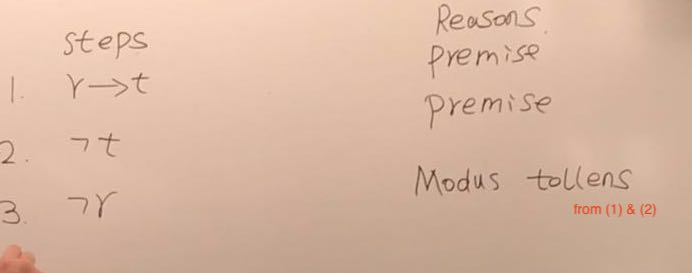

# MA 2185

---------

## Lec1

-------

### 1. proposition

* Defination A statement that is either true or false but not both

* 

  * For convenience, use letters (like p, q, e, s) to denote propositions. Then we call these letters as propositional variables
  * The truth value of a proposition P (true if it is true)

* Def: The negation of P is the statement  not P (opposite truth value)

* Def: let p,q two propositions. The conjunction of p,q is P and Q => only true and true is true

* Def: let p,q be two propositions The disjunction of p,q is the proposition P or Q 

* ```
  and : =IF(AND(A2=F1,B2=F1),"T","F")
  or : = IF(OR())
  ```

-------------

#### 2. Propositional formula : an expression with finitely many propositional variables and connectives

* output always true => **Tautology**
* output always false => **Contradiction**
* A compound proposition that is neither a tautology nor a contradiction is called a *contingency*
* Let A, B be propositional formulas, we say A, B are $\color {red}{logical\ equivalent}$ if A, B always have the same value.
  * A, B are logical equivalent if A $\iff$ B is a tautology
  * denote as A

-------------

#### 3. Predicates and Quantifiers

* P(x) and the truth value depends on x
  * What is the range of x
  * Are we talking about all values of x?
* Def : 
  * predicate is a statement incolcing in a cariable
  * Once are assign values for the variables it become a propostion
* Generally
  * Def: Let P be a predicate with variable x. The universal quantification of P(x) is the proposition P(x) is true for all values of x in the domain
  * read as for all x, P(x)...  or for every x, p(x)...
* Zoom out the domain
  - If the domain of $x​$ is larger than the domain you want to focus

  - denote the domain you want to focus as D(x), the property you want to find as P(x)

    - for e.g. D(x) =x is boys, P(x) = x is above 170, domain of x is the class

  - Any boy is above 170 $∀x(F(x)) $ 
    - $function = F(x_0)∧F(x_1)∧F(x_2)∧...∧F(x_n)$ 
    - In order to zoom out the domain to $D(x)$ , we need to discard the cases $¬D(x)$ . i.e.  erase it from the equation 
    - we know $P∧1=P​$ , 1 is erased from the equation, so we just need to satisefy when $¬D(x)​$ is true, make $F(x)​$ true, when $D(x)​$ is true , check $P(x)​$ 
    - Thus we use $D(x)→P(x)$ 

  - Similar principle for There exist a 170+ boy , but for exist, $function = F(x_0)∨F(x_1)∨F(x_2)∨...∨F(x_n)$  if we want to erase use $P∨0=P$  
    $$
    ∃x(¬P(x)∨ Q(x)) = ∃x(¬P(x)∨ (P(x)∧Q(x)))
    $$
    

------------

## Tutorial

-----------

* Recall => proposition
  * 1 : Declaratice (claim something)
  * 2 : True or False can be determined (Either true or false)

* Sufficient(充分) and necessary（必要）
  * sufficient  =>  necessary

* "Whenever" means "if"
  * i.e. whenever q then p => q -> p

* and conjunction or disjunction

* Translate these statements into English, where C(x) is “x is a comedian” and F(x) is “x is funny” and the domain consists of all people.  

  * ∀x(C(x) → F(x)) Any comedian is funny
  * ∀x(C(x)∧F(x)) Any people is comedian and is funny
  * ∃x(C(x)→F(x))  If there exist comedian in the group of peoples, there must be a funny comedian (There is someone if he is comedian then he is funny) C(x) 可以不存在
  * ∃x(C(x)∧F(x)) There is people who is a funny(must be at the same time) comedian 不可以不存在

*  Let P (x) be the statement “x can speak Russian” and let 

  Q(x) be the statement “x knows the computer language C++.” Express each of these sentences in terms of P (x), Q(x), quantifiers, and logical connectives. The domain for quantifiers consists of all students at your school. 

  1. a)  There is a student at your school who can speak Russian and who knows C++. 

      	∃x(P(x)∧Q(x)) 

  2. b)  There is a student at your school who can speak Russian but who doesn’t know C++. 

     ​	∃x(P(x)∧¬ Q(x)) 

  3. c)  Every student at your school either can speak Russian or knows C++. 

     ​	∀x(P(x)∨Q(x)) 

  4. d)  No student at your school can speak Russian or knows C++. 

     ​	∀x(¬P(x)∧¬Q(x)) 

-------------

## Lec2

---------

Discourse


Format : 



