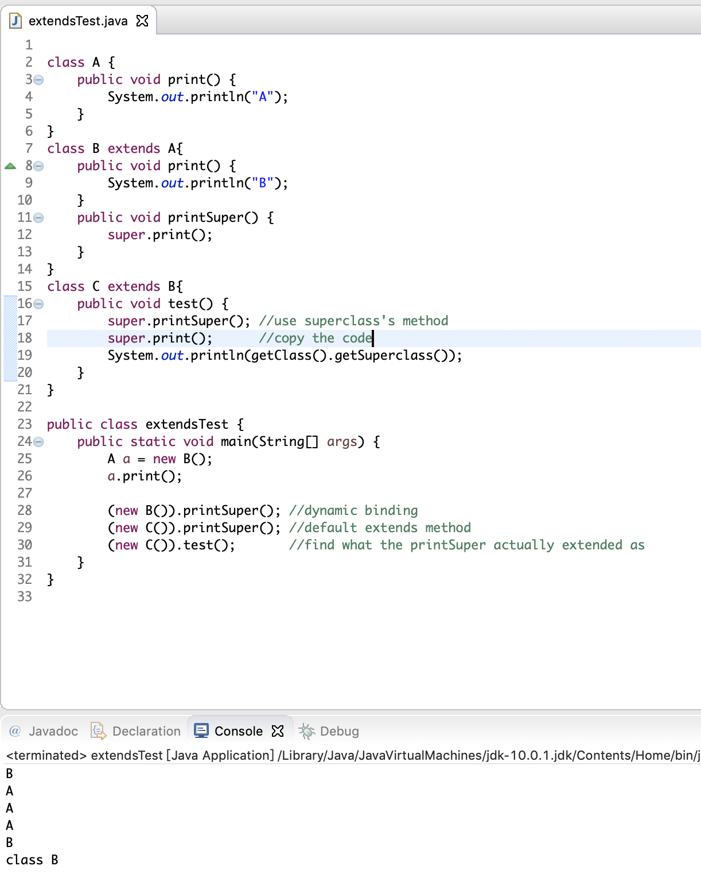

#  CS 2312

---------

## Lecture 1

------

### 1. Explanation of the Program

* Class name start with Uppercase, same as the file name
* static means we don't need to initialize object to run the main function
* ```args[]``` is an array of String (Strings after the command line run the java code)

### 2. Packages

* Groups of classes ```java.util.*``` where * represent all the class under the folder
* ```import static java.lang.math``` where static means if we use static methods in the imported class
* A class not grouped into package folder and has the packet statement
* Comment : /** */ for automatic documentation

### 3. Data types

* Division
  * 8 primitive types : boolean, byte, short, int, long, float, double, char
  * Reference type : 
    * Built-in Java classes : String, Math, Scanner
    * User-defined classes 
    * Ab array is also a object

* Integer types

  * java has no unsigned types (memory is not so precious now)
  * Long integer numbers have a suffix L (add L at the end of the number)
  * Similarly, provide in Binary add prefix '0b', provide in Hexadecimal, add prefix '0x'

* Floating point

  * Three special values to denote overflows and errors
    * Positive infinity
    * Negative infinity
    * NaN (not a number)
  * Float suffix 'F' double no suffix or add 'D' 
  * E+18 represent $*10^{18}$ 
  * can not get specific value during the calculation (Use the BigDecimal class)

* boolean type : cannot converted from integer

* char type: '\u+unicode' to get the char (covert at first even before "" and comment)

  ```java
  System.out.println("\u0022+\u0022"); // print nothing
  // \u00A0 is new line => syntax error
  // also
  $ javac test.java
  test.java:3: ▒▒▒▒: ▒Ƿ▒▒▒ Unicode ת▒▒
      // Look inside c:\users
                         ^
  1 ▒▒▒▒▒▒
  
  ```

* Big numbers : used when the integer and floating-point types is not sufficient

  * Turn into couple of handy classes in the ```java.math``` package: BigInteger and BigDecimal => manipulating numbers with an arbitrarily long sequence of digits

  * ```valueOf()``` method to turn an ordinary number(normal integer) into a big number

  * Cannot use + * ...

    ```java
    BigInteger a = BigInteger.valueOf(100);
    BigInteger c = a.add(b);
    BigInteger d = c.multiply(b.add(BigInteger.valueOf(2)))
    ```

* Constants

  * Java keyword is ```final``` , means the value cannot be changed any more

  * class constant : ```static final```

    ```java
    final double MAX;
    //in class
    public static final int MAX;
    ```

-----------

## Lec 3

--------

* INPUT

  ```java
  Scanner in = new Scanner(new File(filepath));
  in.next();		// 	read until meet white space
  in.nextline();	//	read the whole line of remain (if a string is read by in.next(), it is dropped from input stream)
  ```


### 1. Strings

* Sequence of unicode 

* Empty string : => different from null

  ```java
  str.length()==0;
  // or
  str.equals("");
  ```

  

* Declare

  ```java
  String s = new String("Hello")
  String s = "Hello";
  ```

* Length field : ```s.length()``` : the public method (**not field**)

  * "" is empty string different from null

  * to get the code unit length  use ```cnt=strobj.codePointCount(0,strobj.length())``` 

  * to get ith code point , do not use ```charAt()``` method

    ```java
    int index = greeting.offsetByCodePoints(0,i);
    int cp = greeting.codePointAt(index);
    ```

  * As usual it returns same value as length() method

    * when there is a character requires two code units in UTF-16

  ```java
  for(s!=null&&s.length()!=0)
  ```

* ```substring(i,j)``` method yields substrings from i-th(from 0) char to (j-1)-th char

* ```charAt(i)``` returns i-th char

* \+ 

  ```
  String greeting = "Hello"; String s;
  s = 1000 + " " + greeting; // "1000 Hello"
  s = 1000 + ' ' + greeting; // "1032Hello" ' '==32
  ```

* ```equals()``` use ```s.equals("somestring")``` cannot use ```==``` because it compare the Object ID

* Covert string to integer

```java
String input = "7";
int n = Integer.parseInt(input);
```

* Strings are immutable

  * No method can change a character in an existing string
  * To change the value of string is not convenient
  * substring() method actually create new object
  * garbage collection => useless object automatically distroyed
  * If you want to change a character in a string, use substring method

  ```java
  greeting = greeting.substring(1,3);	//"Hello" is deleted, "el" is the new one
  greeting = greeting.substring(0,3)+"p!"; 
  /* copy the substring add characters you want to change, assign the reference to the current object, finally get a new object, and the old one is deleted by garbage collection*/
  ```

### 2. StringBuilder (import java.util.StringBuilder)

* Used for concatenation and other operation which change the value of the string

  ```java
  StringBUilder sb = new StringBuilder();
  sb.append("Hello ");
  ```

### 3. Read Input

(1) Reading inpit from Console

* Construct

  ```java
  Scanner in = new Scanner(System.in)
  ```

* next(), nextline() => return a string

* Close: ```in.close()``` avoid some problems

(2) read from a file

```java
Scanner inFile = new Scanner(new File(fileName));
while (inFile.hasNext()) {
String line = inFile.nextLine();
..
}
inFile.close();
```

(3) Reading input from another string

```
String str;
Scanner in = new Scanner(str);
```

(4) print by line

```java
System.out.print("Enter a line of words: ");
Scanner scannerConsole = new Scanner(System.in);

while (scannerConsole.hasNext())
	System.out.println(scannerConsole.next());
scannerConsole.close();
```

* Scanner is not suitable for reading  password (java.io.Console)

  ```java
  Console cons = System.console();
  String username = cons.readLine("User name: ");
  char[] passwd = cons.readPassword("Password: ");
  ```

  

### 4. format output

* Using .print, .println for floating-point values (problem):

* Using .printf – formatted output (solution)

  | Conversion Character | Type                                           | Example         |
  | -------------------- | ---------------------------------------------- | --------------- |
  | d                    | Decimal number                                 | 159             |
  | x                    | Hexadecimal number                             | 9f              |
  | o                    | Octal number                                   | 237             |
  | f                    | Fixed-point floating-point                     | 15.9            |
  | e                    | Exponential floating-point                     | 1.59e+01        |
  | g                    | General floating-point(the shorter of e and f) | --              |
  | a                    | Hexadecimal floating-point                     | 0x1.fccdp3      |
  | s                    | String                                         | Hello           |
  | c                    | Character                                      | H               |
  | b                    | boolean                                        | true            |
  | h                    | Hash Code                                      | 4268b2          |
  | tx or Tx             | Date and time                                  | Java.time class |
  |                      |                                                |                 |

  

  ```java
  double x = 10000.0 / 3.0;
  System.out.printf("%8.2f", x);//prints 3333.33; 8 is width of integer, 2 is digits after the point
  System.out.printf("%,.2f",10000.0/3.0)	// 3,333.33
  ```

* Similar to create a string

  ```java
  String out = String.format(“Hi %s. Next year you'll be %d", name, age+1);
  ```

* File Input and Output

  * Construct a ```Scanner``` object like this

    ```java
    Scanner in = new Scanner(Paths.get("myfile.txt"),"UTF0-8");
    Scanner in = new Scanner(new File("myfile.txt"));
    //output i.e. write to a new file
    PrintWriter out = new PrintWriter("myfile.txt","UTF-8");
    // Error
    Scanner in = new Scanner("myfile.txt") // directly read the string
    ```

  * when using relative file name, such as "my file.txt" ==the file should be located at the same directory that JVM was started==

  * If you fail to do it  you should ```throws IOExpection``` 

### 5. Control Flow

* Control structures (similar to C++)

* Block Scope (compound statement inside{})

* Cannot declare identically named variables in 2 nested blocks (innerloop and outer)

* Break; and continue; => use them only to improve the coding quality

* Labeled break : 

  ```java
  //labeled break
  outer:
  while(...){
      for(...){
          break outer;
      }
  }
  ```

  

  ```java
  bFound=false;
  for (i=0;i<n;i++){
  	if (A[i]==x){
  		bFound=true;
  		break;
  	}
  }
  // use this one
  bFound = false;
  for(int i=0;i<n&&!bFound;i++)
  	if(A[i]==x)
          bFound = true;
  ```

### 6. Array

* An array is a collection of elemebnts of the same type

* As an object in java

* Autometically initial each entrie to 0 (boolean array initialize 'false', object array initialize null)

* size of an array is immutable

  ```java
  int[] arr; // int[] is the array type; arr is the array name
   // int arr[]; is also okay, but not welcome by Java fans
  arr = new int[5]; //create the array;
  arr[0] = 3;
  arr[1] = 25;
  for (int i=0;i<arr.length;i++) //use .length to tell the array size
   System.out.println(arr[i]);
  ```

* Styles of array declaration:

  ```java
  int[] arr;
  arr = new int[5];
  arr[0] = 3;
  arr[1] = 25;
  
  int[] arr = new int[5];
  arr[0] = 3;
  arr[1] = 25;
  
  int[] arr = {3,5,0,0,0};
  int[] arr = new int[]{3,5,0,0,0};
  ```

* For each loop : cannot used to initialize (for each 按值传递基本数据类型， 按地址传递object,并赋给variable)

  * when variable is primary type: the value of the copy changed
  * when variable is object : the reference of the variable changed to a new object, but the elements in the array has not been changed

  ```java
  for(variable:collection) 
  	statement;
  for(int item:arr)
      System.out.println(item);
  ```

* Array.toString(arr)

  ```java
  int[] arr = {3,5,0,0,0};
  System.out.println(Arrays.toString(arr)); 	//[3, 5, 0, 0, 0]
  ```

* Array.sort(arr)

  ```java
  Arrays.sort(arr);
  System.out.println(Arrays.toString(arr));
  ```

* Array.copyOf(arr,len) : return a new array copied number of len elements

  * the returned array points to a different new object as the original array
  * common use of this method : resizing array

  ```java
  arr = Arrays.copyOf(arr,arr.length*2);
  ```

* Multidimensional arrays

  ```java
  balances = new double[NYEARS][NRATES];
  int[][] magicSqr = {
      {1,2,3},
      {4,5,6},
      {7,8,9}
  };
  for(double[] row:arr)
      for(double value:row)
          // do something with value
  ```

  

### 7. class

* ```toString()``` is autometically called in ```System.out.println()```;

----------------

## 4 Introduction to OOP

--------

### 1. Relationships between Classes

* Dependence : ("use-a")

* Aggregation : ("has-a")

* Inheritance : ("is-a")

* Mutator : set(), Accessor: get()

* Initialize : to null or assign another object to it

* Swap(Obj 1, Obj 2) => 

  * Swap the reference (wrong) (can be done directly in main function)

    ```java
    Obj temp = 1;
    1 = 2;
    2 = temp;
    ```

    

  * Swap the value (right)

    ```java
    int temp = 1.val;
    1.val=2.val;
    2.val = temp
    ```

-------------

### 2. Initialize

* Default field

  * Number : 0
  * Truth value : false
  * object reference : null

  ```java
  public Employee(){
      name = null;
      salary = 0;
      hireDay = null;
  }
  ```

* Constructor : Constructors can only called by the ```new``` operator

  * Cannot construct an object without ```new``` operator like c++ 

    ```Employee number007("James Bond" , 100000, 1950,1,1);``` 

  * Can use another way to assignt value

    ```e = new Employee(){{name="MTChan";salary=100000000000;}};``` 

  * default constructor

    - If don't have constructor, java will provide a default constructor
    - If there is constructor, but no defult constructor, there will be complition error when you use the default constructor

  * Calling another constructor : parameters are part of the called constructor

    ```java
    
    public Employee(String name, double salary){
    	this.name = name;
        this.salary = salary;
    }
    public Employee(double salary){
    	this("Employee#"+nextId,salary);	// cannot be done by C++
        nextId++;
    }
    ```

* Initialization Blocks 

  * Ways to initialize fields

    * by setting a value in a constructor
    * by assigning a value in the declaration
    * by using an *initialization block*

  * The order : Whenever which kinds of constructor is used to construct an object, the initialization block runs first, then the body of the constructor runs

    * All data fields are initialized to their default values (0, false, or null)
    * runs static initialization(for static fields) : ```static{id = nextId;}``` => runs when the class is loaded
    * runs initialization block : ```{id = nextId;}``` 
    * Runs the constructor of its parent ```super()```
    * Runs the constructor called by current constructor
    * Other statements in the constructor(constructor body)

  * Notes : It is legal to set fields in initialization blocks even if they are only defined later in the class. However, it is not legal to ==read from== fields that are only initialized later. => always put the initialization blocks after the field definition

    ```java
    class Employee{
        private static int nextId;
        private int id;
        private String name;
        private double salary;
        
        {
            id = nexId; 
            /* 
            => id is not depends on the users' input (just increase by one 			each time)
            */
            nextId++;
        }
    }
    ```

    

------------

### 3 Methods

* Overloading methods

  - Signature : name and parameters

* accessors and mutators

  * Fields are set to be private => Encapsulation

  * Get and set methods help the user to access or change the value of the field

  * if any thing wrong, just need to debug the set or get methods

  * not to write accessor methods that return references to mutable objects i.e.

    ```java
    public Date getHireDay(){
        return (Date) hireDay.clone();
    }
    ```

* Class-Based Access Privileges

  *  Method can access the private data of the object on which it is invoked
  * Method can access other object of the class even it is not the current class

* private method => helper methods

* Method Parameters : call by value or call by reference in java

  - The Java programming language *always* use call by value => get a copy of all parameter values

  - 2 kinds of parameters:

    - primitive types : numbers, ```boolean``` values => get a copy of value

    - Object references => get a copy of reference => can be changed even if it is parameter

    - But for swap method: it does not work

      ```java
      public static void swap(Employee x, Employee y){
      	Employee temp = x;
          x = y;	// just swap the reference of x and y
          y = temp;
      }
      ```

      use array entry to swap for sorting algorithm

--------------

### 4 Important Keywords

* Final Instance Fields => must be initialized when the object constructed, and never be changed after that

  * Useful for the fields whose type is primitive or an *immutable class* 
  * final class means cannot be extended

* Static methods and fields : belongs to the class 

  * Factory methods : Used to construct objects, for e.g. 

    ```java
    NumberFormat currencyFormatter = NumberFormat.getCurrencyInstance();
    NumberFormat percentFormatter = NumberFormat.getPercentInstance();
    // return 2 different kinds of objects
    ```

  * Can't give name to constructor, but if we want two different names to get the currency instance and the percent instance 

  * Factory methods actually return objects of the class ```DecimalFormat```, a subclass that inherits from ```NumberFormat``` 

  * can be used in singleton

  * ```main``` is also a static function => entry of the program

* ```abstract``` keyword => likes an interface but different 

  * no need to write the code, just declare the head of method
  * must be extends by others
  * cannot be multi-extended (different with interface) 


--------

### 5 Destruction

* No destruction method in java => because of garbage collection system
* Sometimes, although the memory freed, but the resources (file opening or scanner used) => use the ```finalize``` method
  * called automatically before the garbage collection (only the reference is disappeared i.e. no one remembers it)

--------------

### 6 Packages

Reason to use : Main reason to use => Guarantee the uniqueness of class names

#### (1) Class Importation

```java
java.time.LocalDate today = java.time.LocalDate.now();
// or you can use
import java.util.*;	//star represents the all classes or package under the util
LocalDate today = LocalDate.now();
```

* import

  * You are allowed to not use import as shown below(different with C++, must use #include)

* static import : A form of the ```import``` statement permits the importing of static methods and fields, not just classes

  ```java
  import static java.lang.System.*;
  out.println("Goodbye, World!");
  exit(0);
  ```

* To place classes inside a package, you must put the name of the package at the top of your source file, *before* the code that defines the classes in the package. 

  * When compile:

    ```
    javac PackageTest.java
    java PackageTest
    // or
    javac com.mycompany.Employee.java //(or javac Employee.java)
    java com.mycompany.Employee
    ```

  * Javac can compile .java not in the current folder, but java cannot run in this case

* Package scope : If there are no access modifier (public or private)  =　can only be accessed in the same package

---------

### 7 The Class Path

* The java file is compiled to the .class file => classes are stored in subdirectories of the file system , **class path** is the path from java file to the class file which must matches the package name (folder under bin must match with the folder(package) under src)

* **jar** file contains multiple class files and subdirectories in a compressed format (JAR files use the ZIP format to organize files and subdirectories, thus any ZIP utility can be used to peek inside JAR files)

* Share classes among programs

  * Place your class files inside a directory, for e.g., ```/home/user/classdir``` .  Note that the path you choose at first is the *base* directory for the package tree

  * Place any JAR files inside a directory, for e.g. ```/home/user/archives``` 

  * set the class path => collection of all locations that can contain class files(share the classes region)

  * elements separated by semicolons in Windows, . represents the current path

    ```
    c:/classdir;.;c:/archives/archive.jar
    ```

* Search the class files

  * first search the jre/lib
  * If not found, turns to the class path

* Set the class path

  ```
  java -classpath c:/classdir;.;c:/archives/archive.jar
  ```

-----------

### 8 Documentation Comments

* /** produces professional-looking documentation (html based)

* {@code Card} is equal to \<code> Card \</code>

* Method comments

  * @param : variable description
  * @return : add "returns" section to the current method
  * @throws : adds a note that this method may throw an exception

* Others

  * @vesion : current version

  * @since : Any description of the version tht introduced this feature

  * @deprecated : suggest a replacement of the no longer used varaibles or methods

  * @see : Followed by reference to link to other java file or a online link \<a> 

    ```
    @see com.horstmann.corejava.Employee#raiseSalary(double)
    ```

    

----------

### 9 Class Design Hints

------

1. Always keep data private
2. Always initialize data : may not null for some object
3. Don't use too many basic types in a class
   * use another class to group the data
   * make the class easier to change
4. Not all fields need individual field accessors and mutators
5. Break up classes that have too many responsibilities
6. Make the names of your classes and methods reflect their responsibilities
7. Prefer immutable classes
   * Data cannot be changed after initializing
   * return a new object once need change
   * Reason
     * Two threads try to update an object at the same time

---------------

## Chapter 5 Inherance

--------

### 5.1 Classes, Superclasses , and subclasses

------

#### 5.1.1 Defining Subclasses

```java
public class Manager extends Employee{
	// added methods and fields
}
```

* extends means generate a new class from existing class
  * old one : super class
  * new one : subclass
  * subclass has more functions than super class
  * super and sub come from the language of sets used in math
  * When defining a subclass by extending its superclass, you only need to indicate the *difference* 

#### 5.1.2 Overriding methods

* some same name methods are not appropriate for the subclass => override the method

  * when called from outside => use dynamic binding (use the method in what object pointed to rather than the pointer type)

* For e.g. the getSalary() method for manager

  ```java
  public double getSalary(){
  	// return salary+bonus;
      // return getSalary()+bonus;
      return super.getSalary()+bonus; 
      // this super is not reference of object(cannot be changed), super is a special keyword that directs the compiler to invoke the superclass methods
  }
  ```

  * However, the salary is a private variable => cannot be accessed from subclass
  * Second one causes recursion 
  * In C++, use Employee::getSalary();

* Dynamic binding : choose the method defined by the class of object that pointed to rather than the type of pointer (just for overriding methods, new methods cannot be called by a superclass pointer)

  * Only non-static methods that are public, protected or package-visible have dynamic binding(fields do not have)

#### 5.1.3 Subclass Constructors

```java
public Manager(String name, double salary, int year,int month,int day){
	super(name,salary,year,month,day);
    bonus = 0;
}
```

* Because the subclass cannot access private fields of the super class

* The call ```super``` must be the first statement in the constructor for the subclass

* if no explicit call, the constructor of child class will implicitly call the default constructor of the super class

* 2 function of super:

  * Treated as a reference to the implicit variable at super class scope (actually not a reference)
  * Call the constructor

* In C++

  ```C++
  Manager::Manager(String name,double salary,int year,int month,int day)
  :Employee(name,salary,year,month,day){
  	bonus = 0;
  }
  ```

#### 5.1.5 Polymorphism

* Polymorphiam and Dynamic Binding

  * Polymorphism : An object variable(super class) **can** refer to different actual types(as long as it is child) (compile time checking) (可以指向子类对象)

    * cannot use new methods (subclass defined methods) by the super class reference

      ```java
      Manager boss = new Manager(...);
      Employee[] staff = new Employee[3];
      staff[0] = boss;
      boss.getbonus(); // OK
      staff[0].getbonus(); // error
      Manager m = staff[0] // error => compiler doesn't know it is manager object
      ```

      

    * can also convert the Manager[] to Employee[] array $\color {red}{but}$ 

      ```java
      Manager[] managers = new Manager[10];
      Employee[] staff = managers;
      // very bad pracitce :  
      // The staff pointer point to the same array as managers
      // Thus change the staff[0] to a Employee object 
      staff[0] = new Employee( . . ); // thus cause ArrayStoreException
      // try to access the memory that DNE => corrupt neighboring memory
      managers[0].getbonus();
      
      ```

      

  * Dynamic Binding : Automatically select the appropriate ==non-static overrided method== (Not field) (调用指向对象类型的函数)

#### 5.1.6 Understanding Method Calls

* If x is an instance of class C, if call ```x.f(args)``` , and the implicit parameter x is declared to be an object of class C
  1. The compiler looks at the declared type of the object and the method name => find all possible candidates (same name function in the class and super class)
  2. Next compiler determines the types of the args to get *overloading resolution*. (return type is not part of signature, )
  3. 
     * If the method is ```private, static,final``` or a constructor, the the compiler knows exactly which method to called => static binding
     * Otherwise, depends on the actual type of the implicit parameter, and dynamic binding must be used at runtime. 
  4. 
     * Say actual type of the object to which x refers is D  which is a subclass of C,  and args = "Hello" which is a string. If class D defines a method f(String) it is called. 
     * Otherwise, call the super.f(args)
* When override a method, the visibility of overrided method must be at least as visible as super class's 



#### 5.1.7 Preventing Inheritance: Final Classes and Methods

* Declare the class using the ```final``` modifier in the definition of the class

  ```java
  public final class Executive extends Manager{
      ...
  }
  ```

* Declare a function to be final => no subclass can override that method (all methods in final class are automatically to be final)

  ```java
  public final String getName(){
      return name;
  }
  ```

* Fields can also be declared as ```final``` , a final field cannot be changed after the object has been constructed

* reason of setting ```final```  methods : make sure its semantics cannot be changed in a subclass  No subclass can mess up the arrangement by overriding, but subclass can still use the method because it is not private

* Reason of setting final class : ```String``` class is a final class

  * Thus a ```String``` reference refers to a string but nothing else => do not permit polymorphism

* Reason of setting final fields : *inlining*

  * replace `e.getName()` by `e.name` and set `name` to be a final field

#### 5.1.8 Casting

Convert from one type to another type

Reason to do casting : Use an object in its full capacity after its actual type has been temporarily forgotten because of polymorphism

Type of the variable : Indicate kind of object reference and what it can do (cannot run the new method defined in subclass, overrided methods use dynamic binding)

* Casting and instanceOf

  - Upcasting => cast a child to its super class => you even don't need to do this

  - Downcasting => cast a parent to its child class (because the parents may not be reference to the child class object)=>must do => use instances keyword

    ```java
    
    for(Employee e:allEmployees){
        if(e instanceof Manager){
    		Manager m;
            m = (Manager)e;
            System.out.println(m.getBonus());
        }
    }
    ```

    

  - if a method is a rewrite method => use the dynamic binding

  - if a method is a new subclass method => use Downcasting

  - You can cast only within an inheritance hierarchy

  - it is better to minimize the use of casts and `instanceof` operator

* In C++ : dynamic_cast can return NULL if it is not instance of `Manager` 

  ```cpp
  Manager* boss = dynamic_cast<Manager*> staff[1];
  if(boss!=NULL) ... 
  ```

#### 5.1.9 Abstract class

As you move the inheritance hierarchy, classes become more general and probably more abstract => some classes just used as a type to be extended, you don't need instance

One method is not used, but need to be extended => abstract method

Many methods is not used => declare the class to be abstract and the class holds some common fields

```java
public abstract class Person{
    private String name;
    public Person(String str){this.name = str;}
    public abstract String getDescription();
    public String getName(){return name;}
}
```

- Abstract method : no implementation method, the class has this must be initialized as abstract class

  - Must no implement (normal method must have implement, i.e. the {})

- Abstract class : no constructor, ==doesn't have to have abstract methods==

  - cannot be new of a single object, but can create array => for polymorphism

    ```java
    Employee[] arr = new Employee[3];
    ```

  - can be extended by concrete subclasses

  - The visibility of methods extends the methods(all) in the subclass => must higher than the visibility of superclass

  - variables , static methods and constructors cannot be abstract

- In C++ : abstract method is similar to **pure** virtual function

  - virtual function : similar to dynamic binding, allow pointer call the method according to the pointed object

  - pure virtual function : don't define the function (make it equals 0)

    ```cpp
    class Person{
    public:
        virtual string getDescription() = 0;
        ...
    };
    ```

#### 5.1.10 Protected Access

* Subclass cannot use the private field of superclass
* Subclass can use the protected field of superclass
  * For outsider : protected == private
  * For subclass : protected == public
* It break the Encapsulation
  * If you design a superclass and set some of the fields(says some helper fields for a specific algorithm) to be protected, and the fields are used by other programmers.
  * Other programmers use the protected fields, and because you don't know the implement detail, you cannot change the implementation detail 

-----------------

### 5.2 Object : The Cosmic Superclass

* every class automatically "is-a" subclass of Object class (except the *primitive types*) 
  * All array types (include primitive type array) extend Object class

#### 5.2.1 Equals

* normal cases (Employee)

```java
public boolean equals(Object otherObject){
    if(this==otherObject) return true;
    if(otherObject==null) return false;
    if(otherObject.getClass()!=this.getClass())
        return false;
    
    // casting
    Employee e = (SubjectResult) otherObject;
    // check all the fields
    return name.equals(e.name)
        && salary == e.salary
        && hireDay.equals(e.hireDay);
}
```

* for subclass : first all equals on the superclass, if that test doesn't pass then the object can't be equal

  ```java
  public class Manager extends Employee{
      public boolean equals(Object otherObject){
          if(!super.equals(otherObject)) return false;
          // when objects of different subclass is allowed to be equal
          // if(!(otherObject instanceof className))return false; 
          Manager m = (Manager) otherObject; // because already checked
          return m.bonus==bonus;
      }
  }
  ```

* Notice the parameter of equals $\color{red}{must\ be}$ Object

  ```java
  public boolean equals(Employee e) // wrong
  ```

#### 5.2.2 Equality Testing and Inheritance

How should the `equals` method behave if the implicit and explicit parameters don't belong to the same class? (In the previous code, 2 in different classes are treated as false). But many programmer uses `if(!(otherObject instanceof Employee)) return false;` 

* It will cause problems : Java Language Specification  requires equals
  * Reflexive, symmetric,transitive
  * Consistent : if x,y haven't changed, `x.equal(y)` doesn't change
  * for any non-null reference, `x.equals(null)` should return false
  * For symmetric, if `e.equals(m)` where e, m is Employee, Manager obj respectively
    * `e.equals(m)` returns true
    * `m.equals(e)` returns false
* Two scenarios
  * If subclasses can have their own notion(观念) of equality, then the symmetry requirement forces you to use getClass()
  * If the notion of equality is fixed in the superclass(add final keyword), then you can use the `instanceof` test and allow objects of different subclasses to be equal to each other

#### 5.2.4 `toString` Method

* returns a string representing the value of this object, automatically called when output directly put the object's variable name

* For arrays

  ```java
  int[] luckyNumbers = {2,3,5,7,11,13};
  System.out.println(luckyNumbers); //[I@1a46e30
  System.out.println(Arrays.toString(luckyNumbers)); //[2,3,5,7,11,13]
  ```

  

* For multidimensional arrays, use `Arrays.deepToString()` 

---------

### 5.3 Generic Array Lists

-------------

- Arraylist can only store Wrappers ```Arraylist<Integer>``` arrlist
- `arrlist = new ArrayList<>();` => The compiler itself will check what type is needed s
  - The ArrayList is implemented by a dynamic array(full=>resize(2*size), less than size/4 => resize(size/2)) 
  - `arrlist.ensureCapacity(100);` or `arrlist = new ArrayList<>(100);` 
- in a for-each loop, the iterator should not be changed during using the iterator
- 逻辑上讲，迭代时可以添加元素，但是一旦开放这个功能，很有可能造成很多意想不到的情况。 比如你在迭代一个ArrayList，迭代器的工作方式是依次返回给你第0个元素，第1个元素，等等，假设当你迭代到第5个元素的时候，你突然在ArrayList的头部插入了一个元素，使得你所有的元素都往后移动，于是你当前访问的第5个元素就会被重复访问。java认为在迭代过程中，容器应当保持不变。因此，java容器中通常保留了一个域称为modCount，每次你对容器修改，这个值就会加1。当你调用iterator方法时，返回的迭代器会记住当前的modCount，随后迭代过程中会检查这个值，一旦发现这个值发生变化，就说明你对容器做了修改，就会抛异常。

#### 5.3.1 Accessing Array List Elements 

* No operator overload for [], thus use get and set

  ```java
  arrlist.set(i,harry);
  arrlist.get(i);
  
  ArrayList<Employee> list= new ArrayList<>(100);
  // wrong b/c the array inside list is not 100 at first, 100 is just a threshold
  // use add() method at first 
  list.set(0,x);	
  ```

* `list.toArray()` returns a copy of array

* Insertion in middle

  ```java
  int n = staff.size()/2;
  staff.add(n,new Employee());
  ```

#### 5.3.2 Compatibility between Typed and Raw Array Lists

```java
public class EmployeeDB{
    public void update(ArrayList list){...}
    public ArrayList find(String query){...}
}
```

* doesn't need casts when pass the parameter : `update(arrlist)` 
  * No error compile, but may add object doesn't belongs to the arrlist at running time => throws exception

* Java primitive types and Wrappers
  - all primitive types have its own Wrappers (int-> Integer)

-------------

## Interface

* Can be implemented by many classes, and 1 class can implement multiple interfaces
* all the methods are public

* Fields in interface is treated as a final static field, must be given a value when initialize
* when to use what
  * abstract class : 
    * Want to share code among several closely related classes. 
    * Expect that subclasses have many common methods or fields, or require non-public access modifiers such as protected and private. 
    *  Want to declare useful object fields. So that methods can access and modify the state of the object to which they belong.
  * interface
    * Expect that unrelated classes would implement your interface. For example, the interfaces Comparable and Cloneable are implemented by many unrelated classes. 
    *  Want to specify the behavior of a particular data type, but not concerned about who implements its behavior. 
    * Want to take advantage of multiple inheritance of type (See Example 3 in next page).

----------------

## Exception handling

-------------

* create an exception by yourself

  ```java
  public class NegativeIntegerException extends Exception
  {
  
  	public NegativeIntegerException(){
  		super("Negative integer!");
  	}
  	
  	public NegativeIntegerException(String message){
  		super(message);
  	}
  }
  
  public static void processFile(String fname) throws FileNotFoundException,
  InputMismatchException, NegativeIntegerException{
      
  	Scanner inFile = new Scanner(new File(fname));
  	int x = inFile.nextInt();
  	if (x<0) {
  		throw new NegativeIntegerException(); // => throw to main, source of 													exception
  	}
  	System.out.println("Data is: "+x);
  	inFile.close();
  }
  ```

* Error and exception

  * Error : cannot give it chance to continue(OutOfMemoryError, StackOverflowError)