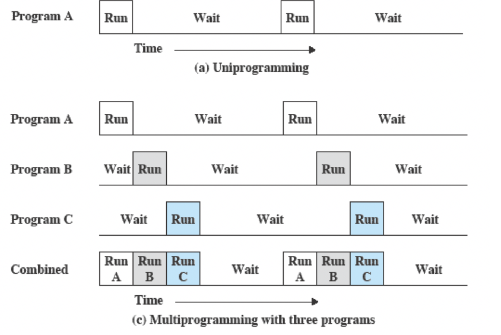
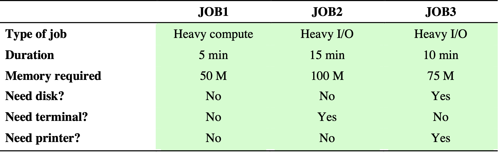
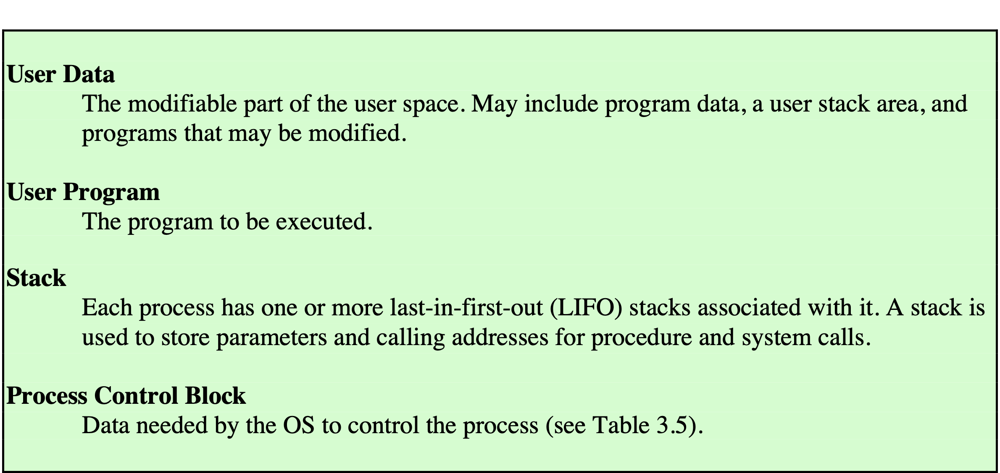
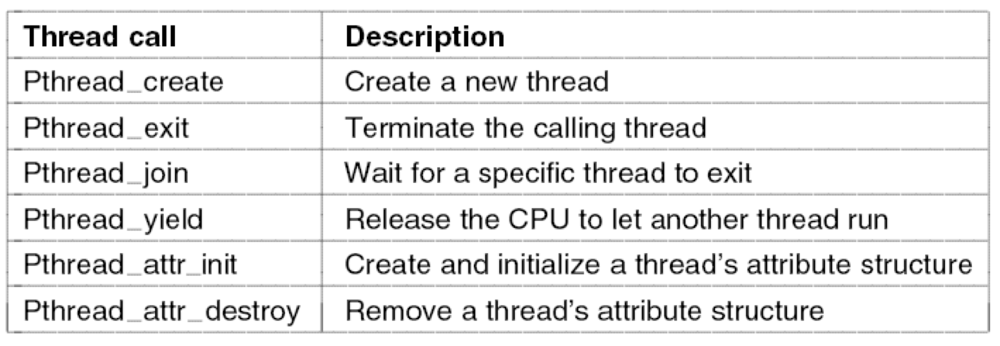
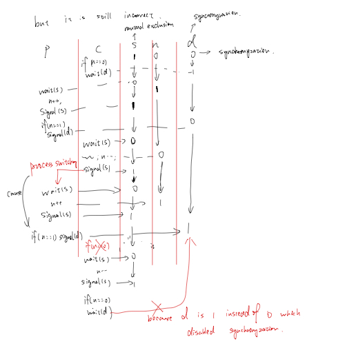
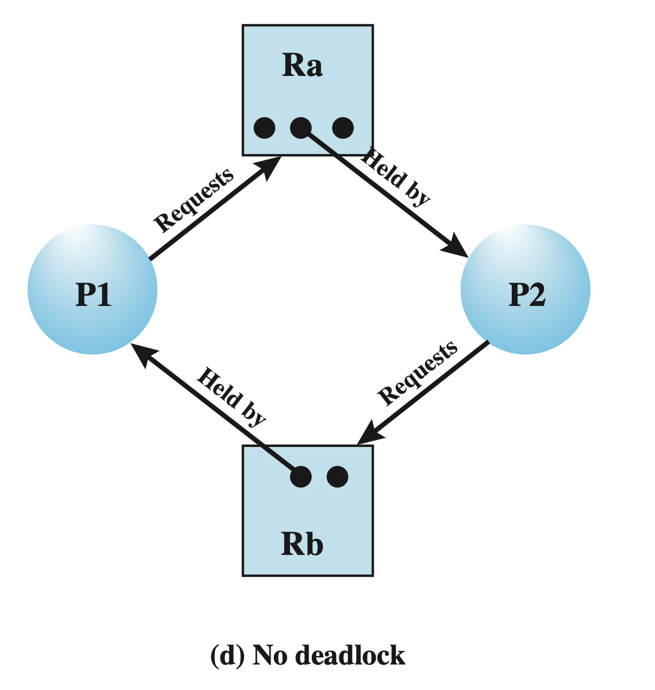
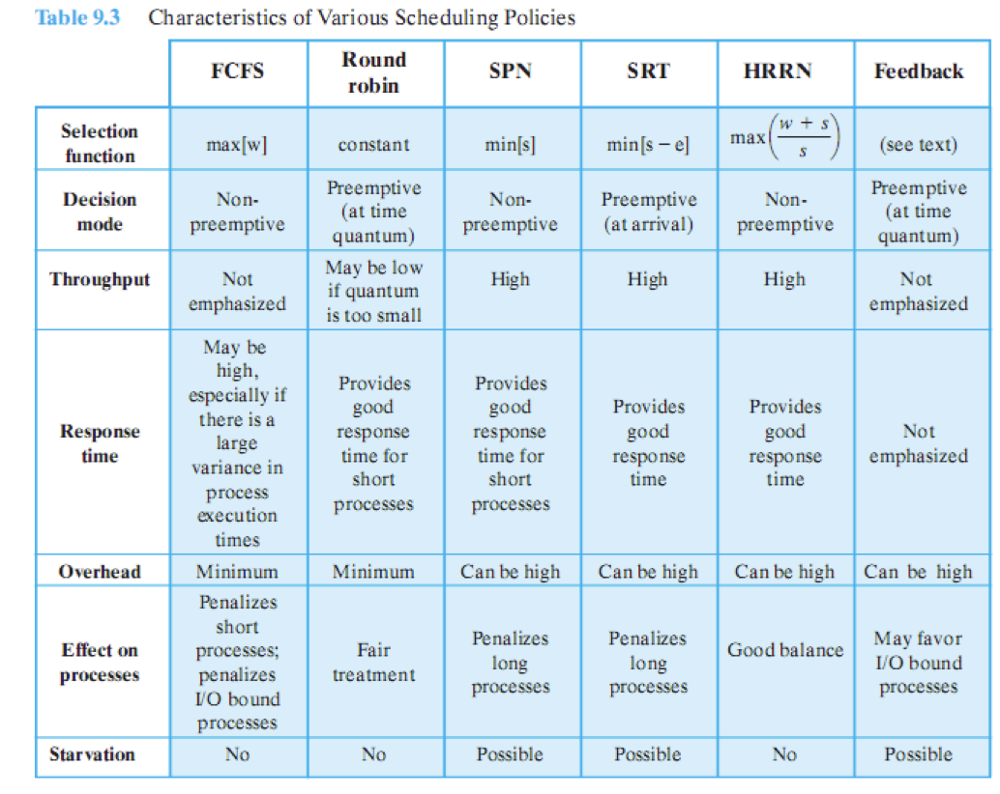

# CS3103 Operating System

----------

## Chapter 1,2 Computer System & Operating System Overview

--------

### Basic Elements

* **Processor** (**C**entral **P**rocessing **U**nit)
  * Components
    * Control unit : Control operation
    * Arithmetic & Logic Unit : Perform data processing

  * Works ==repeatedly== and ==continuously== in cycles to execute instructions

    
* **Main Memory** (**RAM**/primary memory)

  * consists of a set of locations defined by ==sequentially numbered addresses==
  * stores data ==and programs==
  * volatile: Contents of the memory is lost when the computer is shut down
* **I/O Modules** : moves data between the **computer** and the **external environment** (storage, communications equipment, terminals)
* **System Bus** : Provides for communication among processors, main memory, and I/O modules
* Time ratio: 

  * Processor time : memory access time : I/O operation time = 1 : few handreds : ten million​

### Instruction Execution

* A program consists of a set of instructions stored in memory

* 4 steps in a machine cycle(fetch and execute)
  * Processor reads (**fetches**) an instruction from memory
  * Processor interprets (**decodes**) the current instruction
  * Processor **executes** the instruction
  * Processor **stores** the result back to memory
* Registers : special memory locations **inside the processor** that can be accessed very fast
  * **PC**: hold the address of the instruction to be fetched next (incremented after each fetch)
  * Fetched instruction loaded into **IR**
  * **AC** : store execution result temporarily
  * **PSW(Program Status Word)** : contains execution status information
* **Instruction Categories** : Each instruction contains bits (*opcode*) specifying what action the CPU needs to take:

  * Processor-memory

  * Processor-I/O

  * data processing

  * control

  * 4 bits opcode for 16 instructions($2^4$), 12 bits left refer to a memory address => 16 bits in total 

    * (0001): Load AC from memory
    * (0010): Store AC to memory
    * (0101): Add to AC from memory

    

### Interrupts(New)

* **Interrupt** the **normal sequencing of the processor** by **other modules**

* types

  * Program: exception
  * Timer
  * I/O
  * Hardware failure

* provided to improve **processor utilization**

  * Most I/O devices are slower than the processor
  * Processor pauses to wait for device -> wasteful use of the processor

* Example

  * The solide vertical lines represent **code segments**

  * The dash lines represent the order of execution

  * I/O program includes: 

    * **label 4** : before execution, prepare output buffer  
    * **==Actual== I/O command ** : without interrupt, the program must wait and can only test whether the I/O instruction is end
    * **label 5**: after execution, may include set the flag that indicate the success or failure of the execution

  * ==If change write to read for the I/O operation, you still have to wait, because before finish of reading, you don't have the data to be executed==

    

    

    

* Transfer of control via Interrupts

  * Interrupt suspends(暂停) normal sequence of execution(control given to the Interrupt Handler)

  * execution resumes when the interrupt processing is completed

    

  * **Important** : what could happen when the I/O operation takes much more time than executing the code segment 2 or 3 of the user program, i.e., the user program reaches the second WRITE call before the I/O operation called by the first one is completed: **processor** will wait for the last I/O opeartion, and generate an **idle wait time** 

  

  

  * Hardware part: Done automatically by hardware:

     Processor finish => processor signal ack of interrupt => store the PSW and PC => change the PC according to the interruption

  * Software part: need to be considered by OS programmers

    Save register information => Interrupt => restore registers => restore PC and PSW

  * PSW is register store the information of program execution (independent of **stack**)

  

* **Uniprogramming vs Multiprogramming**

  * Uniprogramming: only ==one program== is running at a given time

    * The processor spends a certain amount of time executing, until it reaches an I/O instruction(maybe read operation ); it must then wait until that I/O instruction concludes before proceeding

  * Multiprogramming: processor has ==more than one program== to execute (**Enable interrupts by other programs**) => another way to solve the processor untility problem

    * When **one job(A)** needs to wait for I/O, the processor can switch to the **other job(B,C)**.

      

  * e.g. Consider a computer with 250 Mbytes of available memory, a disk, a terminal, and a printer.

    * Three programs, JOB1, JOB2 and JOB3 are submitted for execution at the same time.

    * Assume minimal processor requirements for JOB2 and JOB3 and continuous disk and printer use by JOB3.

      

      

      

* Interrupt, multiprogramming and multiprocessing

  * **Interrupt**: save the time between the initialization and finalization of I/O operation by doing next instruction, but 
    * Generates idle wait time when the second write instruction called before the first write completed
    *  Must wait for data require operation such as read
  * **Multiprogramming**: A lot of programs(not instructions) run at the same time, when one is in I/O operation(READ case which is not possible continue or idle time slot), the other do the calculation
  * **Multiprocessing**: A lot of processors run at the same time
    * When there is only one program to run, multiprogramming will not improve the performance by fill the I/O wait time, but using multiprocessing can divide one progress into many and run at the same time. 

### Memory Hierarchy

* Concerned features: capacity, speed,money

  * Faster access time, greater cost per bit
  * Greater capacity, smaller cost per bit
  * Greater capacity, slower access speed

* Going down the hierarchy

  

  * decreasing cost per bit
  * Increasing capacity
  * Increasing access time (slower speed)
  * Decreasing frequency of access to the memory by the processor

* **Cache Memory**: Processor must access memory at least **once per instruction cycle** -> processor execution is limited by memory cycle time, but processor speed is much faster than memory access speed

  * Solution: copy information in use from slower to faster (but smaller) storage (cache) temporarily

  * Cache is checked first to determine if information is there

  * **Principle of locality**: Data which is required soon is often close to the current data. If data is accessed, then it’s neighbors might also be accessed in the near future.

    

    * If it is, information used directly from the cache
    * If not, data copied to cache and used there

  * **Tricky case** : Consider a memory system with the following parameters: 

     * Cache access time: 0.1 $\mu s $ 

     * Memory access time (time needed to load a word into the cache): 1 $\mu s$ 

     * Suppose we ignore the time required for the processor to determine whether a word is in cache or memory. What is the ***hit ratio*** in order to have an average time to access a word no more than 50% greater than the cache access time?

       
       $$
       h*0.1+(1-h)*\color{red}{(1+0.1)}<=1.5
       $$
       

* Secondary Memory: Also known as storage devices
  * extension of main memory that provide large nonvolatile storage capacity
  * Used to store program and data files
  * Most commonly used: magnetic disks
    * Disk surface is logically divided into *tracks*, which are subdivided into *sectors*.
    * The disk controller determines the logical interaction between the device and the computer

### I/O Communication Techniques

* When the processor encounters an instruction relating to I/O , it executes that instruction by issuing a command to the appropriate I/O module

* Three techniques are possile

  * Programmed I/O

    * Good for simple and cheap product

    

  * Interrupt-driven I/O (intervention: 介入，干预)

    

  * Direct memory access (DMA)

    * need DMA module which is expensive

    

  

### Operating System Objectives & Functions

* Definition of Operating System (OS)

  

  * A **program** that control the **execution of application programs**

  * An **interface between application and hardware**

    Application(high level languages) <=> system call <=> hardware

  * Main objectives of an OS
    * Convenience : Making a computer more **convenient to use**
    * Efficiency : Allowing computer **resources** to be used efficiently
    * Ability to evolve : Permitting effective development, testing and introduction of new system functions: 
      * hareware upgrade / new hardware
      * new services
      * fixes

* OS Servivces

  * **Program developement** : editors and debuggers
  * **Program execution** : OS handles steps need to be performed to execute a program, i.e. instructions
  * **Access I/O devices** : OS provides a uniform interface so that programmers can access I/O devices using simple reads and writes
  * **Controlled access to files** : In the case of system with multiple users OS provides protection mechanisms to control access to the files
  * **System access** : Also for shared systems
  * **Error detection and response** : OS must provide a response that clears the **error condition** with the **least impact on running applications**. 
  * **Accounting** : A good OS will collect ==usage statistics== for various resources and monitor performance parameters such as response time

* OS as resource manager

  * A computer is a set of resources for the movement, storage, and processing of data

    

  * OS is responsible for managing these resourses
    * how much **processor time** is to be devoted to the execution of a particular user program
    * controls the **allocation of main memory**
    * decides when an **I/O device** can be used by a program in execution
    * controls **access to the use of files**

* Major topics of OS

  

* Summary: 

  * A computer platform consists of a collection of hardware resources.
  * Computer applications are developed to perform some tasks.
  * It is inefficient for applications to be written directly for a given hardware platform.
  * The OS was developed to provide a convenient, feature-rich, secure, and consistent interface for applications to use.
  * We can think of the OS as providing a uniform, abstract representation of resources that can be requested and accessed by applications.

----------------

## Tutorial 01

--------

* Do you know why most of applications are platform dependent? E.g., an iPhone Apps can only work on iPhones while Android Apps can only work on Android devices. 

  * The term *platform* often refers to the **combination of the type of hardware and the type of** **operating system running on it**. 

    * A *hardware platform* can refer to a **computer’s architecture or processor architecture**. 
    * A *software platform* can either be an **operating system or programming environment**, though more commonly it is a combination of both. 

  * Any operating system is **hardware dependent**, from interrupt handling, process scheduling to memory management, device I/O.  (OS <=> hardware)

  * Application software is built on top of OS and dependent on the OS to interact with the hardware (such as keyboard input and printer output). Hence, most application software is  platform dependent. (OS <=> Applications)

  * However, developing cross-platform software is also possible, but it can be a very time- 

    consuming task. Read more about cross-platform programming/development at: 

    http://en.wikipedia.org/wiki/Cross-platform 

* What are the interfaces available for users to interact with operating systems? What is
  the difference between user interface and programming interface to interact with the
  operating system?

  * The user interfaces for users to interact with the operating system can be 
    * command interpreter (MS-DOS as command.com or UNIX as shell) 
    * window manager (MS Windows, macOS or UNIX X Window) as graphical interface 
  * <u>User interfaces</u> allow users to use system commands or mouse selections to interact with the operating system. User can develop or execute programs or applications, control I/O operations, monitor the system status, e.g., access file directory, display file content, print a file.
  * Programming interface (a.k.a. API) is used by **application developers** to access (via system calls) operating system functions (system programs), hardware devices or system resources, e.g., display results on an I/O device (screen), write data to a file (disk device), instead of implementing those functions from scratch. 

--------

## Tutorial 02

* What could happen when the I/O operations take much more time than executing segment 2,3 => reach second write before the first is finished 

  * It is a typical case especially for devices like printer
  * The result is that the user program is **hung up at that point**. When the preceding I/O operation completes, the new WRITE call may be processed, and a new I/O operation may be started. 
  * Though the processor might still need to wait in this situation, the waiting time is noticeably shortened. There is still a gain in efficiency because ==part of the time during which the I/O operation is underway overlaps with the execution of the user instructions==. 

  

  

  

* Multiprogramming and Multiprocessing

  * A multiprogramming system runs more than one program “simultaneously” on **one processor**. The system attempts to **keep several programs resident in main memory** and **switches the processor rapidly between them**. Multiprogramming was developed to improve **processor and I/O resource utilization**. 
  * A multiprocessor is a computer system with **more than one processor**. Multiprocessing was developed in an effort to increase processing speeds by allowing truly parallel computation. 
  * When there is only one task, multiprogramming will be faster

* The ***principle of locality*** states that memory references tend to cluster. In the literature, there is a distinction between ***spatial locality*** and ***temporal locality***. 

  * Spatial locality refers to the tendency of execution to involve a number of memory locations that are ==clustered== => achieved by large cache block

  * Temporal locality refers to the tendency for a processor to access memory locations that have been used ==recently==. => achieved by keep the most recent memory in the cache

  * e.g.: 

    ```cpp
    for(int i=0;i<20;i++){
      	for(int j=0;j<10;j++){
    				a[i] *= j;
      	}
    }
    ```

    * Instructions `++`, `*=` are loaded in to the cache as a block
    * Array `a` has been loaded into the cache as the most recent variable

-------

## Chapter 3 Process Description and Control

### How are processes represented and controlled by the OS

* Applications vs. Processes

  * All modern OS rely on a model in which the execution of an application corresponds to the existence of **one or more processes.**
  * Example: single-user systems such as Windows and mainframe system such as IBM’s mainframe OS, z/OS, are built around the ***concept of process***. 

* Process : A program in execution

  *  perspective with program: An **instance of** a program running on a computer
  *  perspective with processor: The entity that can be **assigned to** and **executed on a processor**
  *  perspective with itself : A unit of activity characterized by the execution of a **sequence of instructions, a current state, and an associated set of system resources**

* Process Elements

  

  * Program **code**
  * Associated **data** needed by the program
  * **Execution context** of the program, containing all **information the OS needs to manage the process**

* Requirement of an OS

  * fundamental task: process management

    * Interleave(插入) the execution of multiple processes (multiprogramming)
    * Allocate resources to processes and protect the resources of each process from other processes (mutual exclusion)
    * enable processes to share and exchange information (interprocess communication)
    * Enable synchronization among processes (one wait for another finished)

  * Example: Interleaved(插入) execution of Processes

    

    * Consider three processes being executed
    * Plus a ***dispatcher*** - a small program which switches the processor from one process to another (short term scheduling)
    * All are in memory

* Trace from processes' point of view

  

  * The behavior of an individual process can be characterized by listing the sequence of instructions that execute for that process: a *trace* of the process.

* Trace from processor's point of view (6 instructions per process each time)

  

---------

### A flavour of creating a process in UNIX

* Creating Process in UNIX

  * A parent process can create a child process by means of the *system call*, `fork()` (return the id of the child process,if do not exist, return 0)
  * After creating the process, the OS can do one of the following, as part of the dispatcher(调度员) routine (depends on the operating system) => determine the execution order of very low level instruction
    * Stay in the parent process : control returns to the point of the fork call of the parent
    * Transfer control to the child process : The child process begins executing at the same point in the code as the parent, namely at the return from the fork call
    * Transfer control to another process

  

  * `fork()` just create a child process copy every thing of parent process
    * but child process just run the codes after fork
    * `fork()` returns the id of child process in parent process
    * `getpid()` returns the id of current process
    * `getppid()` returns the id of parent process

-----------

### Process states which characterize the behaviour of processes

* Two-State Process Model

  

  * OS creates a new process and enters it into the system
  * Process may be in one of two states: Running & Not-running
  * Queuing Diagram: Processes that are not running are kept in some sort of queue, waiting for their turn to execute
  * Short term scheduling executed


* Process Birth and Death

  * spawned by existing process: like `execvp`

  

* Five-State Process Model

  

  * State Description:

    - *New*: a process that has just been **created but not yet been admitted to the** 

      **pool** of executable processes by the OS 

    - *Ready*: a process that is **prepared to execute when given the opportunity** 

    - *Running*: the process is currently being executed (occupying the processor)

    - *Blocked*: a process that **cannot execute until some event occurs**, such as the 

      completion of an I/O operation 

    - *Exit*: a process that has been **released from the pool of executable processes** 

      **by the OS**, either because it halted or because it aborted for some reason. Process in exit state might be kept for calculate some status

  * State transaction

    1. *Ready* => *Running*: OS scheduler picks this process to run (short-term scheduling)
    2. *Running* => *Ready*: OS scheduler picks another process to run (according to the scheduling algorithm)
    3. *Running* => *Blocked*: the process waits for an event 
    4. *Blocked* => *Ready*: the event for which the process has been waiting occurs

  * 2 other transactions (is it possible?)

    * *Blocked* => *Running*: it is possible. Suppose that a process is blocked on an I/O operation and **there is no more processes are in the ready queue**. When the I/O finishes, if the CPU happens to be idle at that moment, the process could go directly from blocked to running. 
    * *Ready* => *Blocked*: it is not likely. A ready process is currently queueing for its CPU time, so it cannot do I/O or anything else that might block it. Typically, a ready process cannot be blocked until it has run. 

  * Reaseon of 5 states model: Distinguish between blocked and ready state

  * While some processes in the Not Running state are ready to execute, **others may be blocked**(e.g., **waiting for an I/O operation to complete**, or timer interrupt) , while ready state represent process that **run out of its instructions for this turns** (timeout)

  * Using Two Queues/Multiple Blocked Queues

  

  

* Suspended Processes

  * Processor is faster than I/O so **all** processes could be waiting for I/O -> processor could be idle most of the time

    * When there are **too many blocked processes in the main memory**, the speed of process will be too slow
    * OS swaps one of the blocked processes out on to disk to **free up more memory** and use processor on other processes

  * Blocked state becomes **suspend** state **when swapped to disk(secondary storage)**

  * Distinguish between suspend state and blocked state : whether the process is in the main memory or not

  * One suspend state

    

    ​	

    * Although each process in the suspend state was originally blocked on a particular event, when that event occurs, the process is not blocked and is potentially available for execution
    * 阻塞 VS 挂起(blocked vs. suspended): 阻塞与挂起都是进程的状态，但他们有一些相似之处，也有一些区别，下面先对他们进行概述，再进行比较
      * 阻塞：正在执行的进程由于发生某时间（如I/O请求、申请缓冲区失败等）暂时无法继续执行。此时引起进程调度，OS把处理机分配给另一个就绪进程，而让受阻进程处于暂停状态，一般将这种状态称为阻塞状态。
      * 挂起：由于系统和用户的需要引入了挂起的操作，进程被挂起意味着该进程处于静止状态。如果进程正在执行，它将暂停执行，若原本处于就绪状态，则该进程此时暂不接受调度。
      * 共同点：
        * 进程都暂停执行
        * 进程都释放CPU，即两个过程都会涉及上下文切换
      * 不同点：
        * 对系统资源占用不同：虽然都释放了CPU，但阻塞的进程仍处于内存中，而挂起的进程通过“对换”技术被换出到外存（磁盘）中。
        * 发生时机不同：阻塞一般在进程等待资源（IO资源、信号量等）时发生；而挂起是由于用户和系统的需要，例如，终端用户需要暂停程序研究其执行情况或对其进行修改、OS为了提高内存利用率需要将暂时不能运行的进程（处于就绪或阻塞队列的进程）调出到磁盘
        * 恢复时机不同：阻塞要在等待的**资源**得到满足（例如获得了锁）后，才会进入就绪状态，等待被调度而执行；被挂起的进程由将其挂起的对象（如用户、系统）在时机符合时（调试结束、被调度进程选中需要重新执行）将其主动激活
      * 挂起和阻塞区别：
        * 挂起是一种主动行为，因此恢复也应该要主动完成。而阻塞是一种被动行为，是在等待事件或者资源任务的表现，你不知道它什么时候被阻塞，也不清楚它什么时候会恢复阻塞。
        * 阻塞（pend）就是任务释放CPU，其他任务可以运行，一般在等待某种资源或者信号量的时候出现。挂起（suspend）不释放CPU，如果任务优先级高，就永远轮不到其他任务运行。一般挂起用于程序调试中的条件中断，当出现某个条件的情况下挂起，然后进行单步调试。
      * sleep（）和wait（）函数的区别：
        * 两者比较的共同之处是：两个方法都是使程序等待多少毫秒。
        * 最主要区别是：sleep（）方法没有释放锁。而wait（）方法释放了锁，使得其他线程可以使用同步控制块或者方法。
        * sleep（）指**线程**被调用时，占着CPU不工作，形象的说明为“占着CPU”睡觉。（一个进程可能有多个线程）
          * sleep(2000)表示：占用CPU，程序休眠2秒。
          * wait(2000)表示：不占用CPU，程序等待2秒。

  * Two suspend states (blocked/suspend and ready/suspend)

    * Because block and suspend are 2 independent states(block: whether waiting for resources; suspend: whether in the main memory)
    * May be there is a program waiting for user input, and at this time OS decide to move it out of the main memory
    * State transaction:
      * Blocked => Blocked/Suspend (**which is the first thing to do to free up memory**): This can make room for another process that is not blocked, in particular, when the currently running process or a ready process that the OS would like to dispatch requires more main memory to maintain adequate performance.
      * Ready => Ready/Suspend: If this is the only way to ==free up a sufficiently large block== of main
        memory or the OS may choose to **suspend a lower-priority ready process rather than a higher-priority blocked process** if it believes that the blocked process will be ready soon.
      * Ready/Suspend => Ready: If the process in the **Ready/Suspend state has higher priority**(there might be a higher priority process with the state: Blocked/Suspend has been triggered by the corresponding event) than any of the ready processes. Otherwise, there is swapping cost.
      * Blocked/Suspend => Ready/Suspend: The existence of this transaction proved that not all data of process are swapped into the second memory

    

  * **Reason for Process Suspension**

    * swapping: free memory
    * Other OS reason: error handling
    * interactive user request: user explicit call
    * timing: suspend periodical processes when they are idle
    * parent process request: Child process suspended by parents => coordinate the activity of various descendants

    

------------

### Data structures used to manage process

* Processes and Resources: OS manages **the use of system resources (CPU, I/O, memory, files) by processes**

  

* Operating System Control Structures

  * For the OS to manage processes and resources, it must have information about the **current status of each process and resources**

  * Tables are constructed for **each entity (resources)** the OS manages

    

* Memory Tables

  * Memory tables are used to keep track of **both main(real) and secondary(virtual memory)**
  * Must include this information
    * **Allocation of main memory** to processes
    * **Allocation of secondary memory** to processes
    * **Protection attributes** of blocks of main or virtual memory such as which processes may **access certain shared memory regions**
    * Information needed to **manage virtual memory**

* I/O Tables

  * Used by the OS to **manage the I/O devices** and channels of the computer.
  * At any given time, an I/O device may be **available or assigned to a particular process.** : I/O device( particular process(process identifier), status, memory)
  * If an I/O operation is in progress, the OS needs to know
    * The **status of the I/O operation**
    * The **location in main memory being used as the source or destination of the I/O transfer**

* File Tables

  * These tables provide information about:
    * **Existence** of files
    * **Location** on secondary memory
    * **Current status**
    * other attributes.
  * Sometimes this information is maintained by a **file management system**

* Process Table

  * To manage and control a process, there is one entry for each process in the process table

    * Each entry points to a **process image**(进程投影) containing

    

* Process Control Block

  

  * Each process has associated with it a number of ==attributes that are used by the OS for process control==.
  * The attributes are stored in a data structure called a ***process control block*** (PCB), created and managed by the OS.
  * It contains **sufficient information so that it is possible to interrupt a running process and later resume its execution.**

* Process Attributes : we can group the information in a PCB into three general categories:(**Process identification**, **Processor state information and Process control information**)

  * Process Identification: Each process is assigned a unique numeric identifier. (`pid`)

    * Cross reference: Many of the tables controlled by the OS may use process identifiers to **cross-reference process tables**(relationship relation), e.g., memory tables may be organized to provide **a map of main memory with an indication of which process is assigned to each region** (memory block <-> process identification -> process)
    * Inter-process communication:  When processes **communicate with one another**, the process identifier informs the OS of the **destination of a particular communication**
    * Reference to parent process: When processes are allowed to create other processes, identifiers **indicate the parent and descendants** of each process

  * Process State Information: Consists of processor registers' content

    * User-visible registers
    * **Control and status** registers
      * Program counter: address of the next instruction
      * Program status word (PSW)
        * Condition codes: result of the **most recent arithmetic or logical operation** (e.g., sign, zero, carry, equal, overflow)
        * Status information: e.g. **interrupt enabled/disabled flags, execution mode**
      * Stack pointers (need to back to the original stack pointer)

  * Process Control Infromation: The additional information needs by the OS to control and coordinate the various active processes

    * Process **state** (block / suspend)
    * Priority
    * Scheduling-related info
    * Waiting event (for blocked process)
    * Data structuring

  * Process List Structures： The queuing structure (ready queue, blocked buffer) could be implemented as linked lists of PCBs in which pointers can be stored in the PCBs (structuring information)

    

* Structure of Process Images in Virtual Memory

  * Private User address space: User data and User program

  

* Role of the Process Control Block

  * Most important data structure in an OS
    * contains all of the information about a process that is needed by the OS
    * **Read and/or modified** by virtually every module in the OS such as scheduling, resource allocation, interrupt processing and performance monitoring
    * ==Defines the state of the OS==
  * **Requires protection, which is difficult**
    * A faulty (有缺陷的) routine could damage PCBs, which could destroy the OS's ability to manage the affected processes
    * Any design change to the PCB could affect many modules of the OS

--------

### Ways in which the OS uses these data structures to control process execution

* Modes of Execution

  * Most processors support at least two modes of execution to protect the OS and key OS tables from interference (干扰) by user programs.
  * User mode
    * Less-privileged mode
    * User programs typically execute in this mode
  * System mode (control mode or kernel mode)
    * More-privileged mode
    * *Kernel* of the operating system (central module of an OS)
      * Loads first when the system starts
      * Resides in main memory (in a protected area) all the time

* Typical Functions of an OS Kernel

  

* Process Creation: Once the OS decides to create a new process, it:

  * **Assigns a unique process identifier** and adds a new entry to the process table
  * **Allocates space** for the process (process image)
  * Initializes **process control block**
  * Sets up appropriate **linkages such as putting the new process** in the Ready list
  * Creates or expands **other data structures** such as an ==accounting file for performance assessment==

* Process Switching

  * When CPU switches to another process, the system must **save the state of the old process** and **load the saved state for the new process** (to be described).

  * *Process-switch* time is considered as **overhead** (the system does no useful work while switching), so several issues are important

    * What events trigger a **process switch**: A process switch may occur any time that OS has **gained control from the currently running process**. Possible events giving OS control are:

      | **Mechanism**                          | **Cause**                                                    | **Use**                                            |
      | -------------------------------------- | ------------------------------------------------------------ | -------------------------------------------------- |
      | ***Interrupt***(system)                | External to the execution of the  current instruction, e.g., clock interrupt, I/O   interrupt. | Reaction to an asynchronous external event         |
      | ***Trap***(process)                    | Associated with the execution of the **current instruction**, e.g., illegal file access | ==Handling of an error== or an exception condition |
      | ***System   /supervisor call*** (user) | Explicit request, e.g., file open                            | Call to an operating system function               |

    * What must the OS do to the various data structures to achieve such a process switch?(steps in a process switch)

      * idle means the process may wait for some resources or I/O input

      

      * Steps: (**context, state, resource allocation**)
        1. Save context of processor including program counter and other registers
        2. Update the PCB of the process currently in the Running state (change the status, store the process state information)
        3. Move the **PCB of this process to appropriate queue**- ready; blocked;ready/suspend
        4. Select another process for execution
        5. Update the PCB of the process for execution
        6. Update memory management data structures
        7. **Restore** context of the processor to that which existed at the time the selected process was **last switched out**

  * Mode Switching

    * The occurrence of an **interrupt** does not necessarily mean a process switch
    * It is possible that, after the processor switches from user mode to kernel mode in order to **execute the interrupt handler** (which may include privileged instructions), the currently running process will resume execution.
    * In such a *mode switching* case, only need to save / restore the processor state information. 

----------------

### Discuss process management in UNIX

* System processes run in kernel mode : executes operating system code to perform administrative and housekeeping functions

* User processes
  * operate in user mode to execute user programs and utilities

  * operate in kernel mode to execute instructions that belong to the kernel

  * enter kernel mode by issuing a system call, when an exception is generated, or when an interrupt occurs **user mode <= system call => kernel mode**

    

  * preempted: While returning from kernel to user, process switching occurs

  

* Process Creation in Unix

  * Process creation is by means of the kernel system call, **fork( )**

  * This causes the OS, in kernel mode, to:

    1. **Allocate** a slot in the process table for the new process.
    2. Assign a unique process ID to the child **process**.
    3. **Make a copy of the process image of the parent**, with the exception of any shared memory. (Copy the data to other places, do not share the data)
    4. Increment counters for any files owned by the parent, to reflect that an additional process now also owns those files.
    5. Assign the child process to the Ready to Run state.
    6. Return the ID number of the child to the parent process, and a 0 value to the child process. 
       * The child process copy from the line `fork()`, and have different value returned from `fork()`
    7. Their data are independent with each other even if they has a same variable name 

  * After creation (different choices **for OS**, different with the explicit system call to wait (`wait()` in parent process) by user, because it means whose **next instruction to be called**)

    * Stay in the parent process: Control returns to ***user mode*** at the point of the fork call of the parent
    * Transfer control to the child process: The child process **begins executing at the same point in the code as the parent**, namely at the return from the fork call
    * Transfer control to another process: Both parent and child are left in the ***Ready to Run*** state (switch to the ready buffer)

  * Wait in parent process to wait for collecting zombie child (explicit system call), parent process will be blocked by `wait()`

    

## Tutorial 03

* Including the initial parent process, how many processes are created by the following program? => $2^4$ 

  

  ```cpp
  #include <stdio.h>
  #include <unistd.h>
  
  int main(){
    int i;
    for(i=0;i<4;i++){
  		fork();
    }
    return 0;
  }
  ```

  

--------

## Chapter 04 Threads

-----

### Threads: Resource ownership and execution

* **Processes revision** :
  * Resource ownership : (process unit)
    * A process is allocated ownership of resources including a ==virtual address space== to hold **process image** (user data, user program, stack, PCB)
    * OS performs a **protection function** to prevent unwanted interference between processes with respect to resource (process cannot access memory block of other processes)
  * Dispatching/scheduling/execution : (Thread unit)
    * The execution of a process follows an **execution path** that may be **interleaved with other processes**
    * A process has an **execution state (Running, Ready, blocked etc.) and a dispatching priority**, and is the entity that is **scheduled and dispatched by the OS**

* Multithreading
  * These two characteristics can be treated independently by the OS
    * The ==unit of dispatching== is referred to as a ***thread*** or lightweight process
    * The unit of ==resource ownership== is referred to as a ***process*** or task
  * ***Multithreading*** is the ability of an OS to support multiple, ==concurrent (happening or existing at the same time) paths of execution== within **a single process**.


* Single-threaded Approaches: A single thread of execution per process (concept of thread is not recognized)

  * MS-DOS supports a ==single-user process and a single thread==
  * Some variants of UNIX support multiple user processes but only support one thread per process

* Multithreaded Approaches

  * A **Java run-time environment** is a system of one process with multiple threads.
  * The use of multiple processes, each of which supports multiple threads are found in Windows, Solaris, and many modern versions of UNIX.

* Process vs. Thread

  * Process (in OS): 

    * A **unit of resource allocation**: a virtual address space that holds the ***process image*** (program + changeable data + address calling stack + PCB)
    * A **unit of protection**: protected access to processors, other processes (for inter-process communication), files, I/O resources

  * Thread(in Process):

    * Threads have
      * An execution **state** (running, ready, etc.)
      * A saved thread **context (上下文)** when not running
      * An execution **stack** (for return)
      * Some per-thread **static storage** for local variables
    * Access to the memory and resources of its process, **shared by all threads** in that process
    * From the following graph, you can find that PCB (process identifier, process state information **because suspend is a process level state**, process control information) and User Address Space (user data, user program) are shared

    

  * One way to view a thread is as an **independent program counter operating within a process to execute different part of instructions in the main memory** 

    ```c++
    #include <pthread.h>
    int g = 0;
    void *myThreadFun(void *vargp){
        long myid = *(long*)vargp;
        int s = 0;
        ++s; ++g;
        printf("Thread ID: %ld, local: %d, global: %d\n"
              , myid, ++s, ++g);
    }
    
    int main(){
        pthread_t tid;
        for(int i=0;i<3;i++)
        	pthread_create(&tid,NULL,myThreadFun,&i);
        pthread_exit(NULL);
        return 0;
    }
    ```

    

* **Activities Similar to Processes**: Similar to processes, threads have *execution states* and need to *synchronize* with one another.

  * Execution states
    * ==Reminder: In an OS that supports threads, scheduling and dispatching is done on a thread basis.==
    * Most of the **state information dealing with execution** is maintained in **thread-level** data structures.
    * The key states for a thread are: **Running, Ready, Blocked.** (no suspend)
    * Some states are at process-level
      * Suspending a process involves ==suspending all threads== of the process because they share the address space.
      * ==Termination of a process terminates all threads within the process==.
  * Threads need to **synchronize** with one another so that they **don't interfere with each other or corrupt data structures** (need mutual exclusion)
    * All threads of a process share the **same address space and other resources**.
    * ==Any alteration of a resource by one thread affects the other threads in the same process.==

* Multithreading on a Uniprocessor(单处理器): Mutiprogramming enables the interleaving(插入) of multiple threads within multiple processes => Because thread itself is a light-weight process

  

* Examples of using Thread

  * Foreground and background work: 

    In a word processor, a thread for interacting with the user, one thread for background editing, and a 3rd thread to do periodic backup asynchronously

  * Asynchronous processing: 

    In a Web server, multiple threads can work independently and simultaneously, such as issuing SQL queries and invoking Web services, to gather information that are required to build a Web response page => concurrently call SQL and get data from database

  * Speed of execution

    In computer graphics, matrix data can be divided and distributed into multiple threads to be calculated in parallel (on multiple cores)

* *Benefits of Threads*: If an application is implemented as **a set of related units of execution**, it is far more efficient to do so as a collection of threads rather than a collection of separate processes. Reasons include: 

  * less time to **create & terminate & switch** new thread than a process
  * Enhance efficiency in communication because threads within the same process ==share memory and files== (do not need to copy all the data), they can ==communicate== with each other ==without invoking the kernel==

-------

### Categories of thread implementation

* **User Level Thread(ULT)** : All thread management is done within the application by calling a threads library

  

  * The application and its threads are allocated to a single process managed by the kernel
  * The kernel is not aware of the existence of threads
  * Kernel scheduling is done on a **process basis**
  * e.g.: GNU Portable Threads
  * Pros: good for single processor with multiple threads
    * **Saves the overhead**: does not switch to the kernel mode to do thread management -> saves the overhead of two mode switches
    * **Flexible** : Scheduling can be application specific (application determines the order which is more flexible for tasks that self-define the order of execution)
    * **Multiple platform support** : Can run on ==any OS== because the threads library is a set of application-level functions (already based on the OS)
  * Cons: 
    * **Not efficient for multiprocessor** : Only a single thread within a process can execute at a time -> a multithreaded application cannot take advantage of multiprocessing (processor just for one process's threads), **cannot let 2 threads of the same process work on different processors**
    * **Kernel doesn’t have information of state** : When a ULT executes a blocking system call, all of the threads within the process are blocked

* Kernel level Thread(KLT), also called (kernel-supported threads or lightweight processes): Thread management is done by the kernel

  

  * No thread management done by application, just an **API to the kernel thread facility**(服务)
  * Each user-level thread is mapped to a kernel-level thread
  * Kernel maintains context information for the whole process ==and individual threads within the process==.
  * Scheduling is done ==on a thread basis==.
  * e.g. : Windows, Linux
  * time comparation for three different kinds of the execution modes (**for uni-processor**)

  

  * Pros:
    * **Good for multiprocessor** : The kernel can simultaneously schedule multiple threads from the same process onto multiple processors.
    * **Kernel has information** : If one thread in a process is blocked, the kernel can schedule another thread of the same process.
    * **Reuse for kernel mode** : Kernel routines themselves can be  multithreaded. (In user level thread, kernel level does not implement multithreading, so kernel level cannot be multithreaded)
  * Cons:
    * **conversion overhead** : The transfer of control from one thread to another within the same process requires a mode switch to the kernel.
      * Managing KLTs is slower than ULTs.
    * **OS support** : KLT implementation needs ==OS support==.

* Combined Approach: **m-to-n hybrid** implementation

  * 
  * Application creates *m* ULTs.
  * OS provides pool of *n* KLTs (n processors to manage multithreading).
  * Multiple ULTs are mapped onto a ==smaller or equal number of KLTs==.
  * Multiple threads within the same application can run in parallel on multiple processors.
  * A blocking system call need not block the entire process.
  * Example: Solaris

--------

### Thread library (POSIX Threads(Pthreads)) [src](https://computing.llnl.gov/tutorials/pthreads)

------

* Thread Libraries: Provide programmer with API (application program interface) for creating and managing threads.

  * Three main thread libraries are in use today:
    * **POSIX Pthreads**
    * Win32
    * **Java**
  * UNIX and Linux systems often use Pthreads.

* Pthreads(POSIX Threads)

  * Historically, hardware vendors(卖主) have implemented their own proprietary(专卖) versions of threads.
  * For UNIX systems, a standardized C language ***threads programming interface*** has been specified by the IEEE POSIX 1003.1c standard (*Portable Operating System Interface*)*.*
  * Implementations that adhere(依附) to this standard are referred to as **POSIX threads**, or **Pthreads**.
  * Most hardware vendors now offer Pthreads in addition to their proprietary API's.

* What are Pthreads?

  * Pthreads are defined as a set of C language programming types and procedure calls
  * Implemented with a `pthread.h` header/include file and a thread library
  * This makes it easy for programmer to develop *portable* threaded applications

* The Pthreads API: The **subroutines** which comprise the Pthreads API can be informally grouped into four major groups: 

  * ***Thread management*** 

    * Create, detach(分开), join 
    * Set/query thread attributes

  * ***Mutexes*** : Deal with synchronization via a “***mutex***” (mutual（相互） exclusion)

  * ***Condition variables*** : Address communications between threads that share a mutex

  * ***Synchronization*** : Manage read/write locks and barriers

  * Some of the thread-management function calls

    

  * Naming conventions: All identifiers in the threads library begin with `pthread_`

* Multithreading Consequences: Because threads within the same process share resources

  * Changes made by one thread to shared system resources (such as closing a file) will be seen by all other threads
  * Two pointers having the same value point to the same data
  * Reading and writing to the same memory locations is possible
  * No guarantee as to the order that threads will run
  * Therefore requires ==explicit *synchronization* by the programmer== (mutual exclusion)

--------

## Tutorial 04

* How does thread creation differ from process creation in terms of resource requirements?

  * Thread creation needs less resources
  * Thread creation: When a thread is created, it **shares the resources (such as code and data) of its parent process** or parent thread, so, no allocation of memory for the shared resources is necessary. Instead, only **a stack and a small thread control block containing register values and other thread related state information are required.**
  * Process creation: Space for code and data **has to be allocated for individual processes**. Moreover, creating a process requires allocating space for a process control block (PCB) which is a rather large data structure.

* What kind of program in which multithreading does not provide better performance than a single-threaded solution? => A program cannot be divided into parts that can be executed concurrently (Any kind of sequential program)

* Can a multithreaded solution using multiple kernel-level threads provide better performance than a single-threaded solution on a single-processor system?

  * Yes: In a kenel-level threads solution, if one thread is blocked, another kernel-level thread can be switched and continue running

* Specify the output of the following program: 

  

  ```cpp
  #include <pthread.h>
  #include <stdio.h>
  #include <unistd.h>
  #include <sys/wait.h>
  
  int value=0;
  void *runner(void *param);
  int main(int argc, char *argv[])
  {
  		pid_t pid; pthread_t tid; pthread_attr_t attr;
      pid=fork();
      if (pid>0) {
  				wait(NULL);
          printf("Value1 = %d\n", value);
      }
  		else if (pid==0) {
  				pthread_attr_init(&attr); 
        	pthread_create(&tid, &attr, runner, NULL); 					      
        	pthread_join(tid, NULL);
          printf("Value2 = %d\n", value);
      } 
  }
  void *runner(void *param) {
  		value = 5;
  		pthread_exit(0);
  }
  // Value2 = 5 => because shared memory with the main thread
  // Value1 = 0 => because it copies the data and code
  ```

  

-------------

## Chapter 05 Concurrency: Mutual Exclusion and Synchronization

--------

### Principles of Concurrency

* OS design is concerned with the management of processes and threads in different systems

  * Multiprogramming: Multiple processes, one core
  * Multiprocessing: Multiple processes, multiple cores (shared main memory)
  * Distributed Processing: Multiple process, multiple nodes (distributed main memory)

* Processes not only interleave(插入) but also overlapped on multi-processors (execute at the same time)

  * interleaving

    

  * Overlapping

  

* Principles of Concurrency(an assumption): ***Interleaving*** and ***overlapping*** can be viewed as examples of **concurrent(同时发生) processing** and present the same problems

  * The relative speed of execution of processes cannot be predicted.
    * depends on activities of other processes
    * the way the OS **handles interrupts**
    * **scheduling** policies of the OS

* Difficulties of Concurrency

  * Sharing of **global resources**: global variables(may be changed at the same time)
  * Difficult for OS to manage the **allocation of resources** optimally: Multiple processes may request use of the same resource. (the example of the multithreaded hello program => same resource: screen)
  * Difficult to **locate programming errors**: Results are not deterministic and reproducible => difficult to find the resource of error

* **Race Condition**: Occurs when multiple processes or **threads read and write shared data items**

  * Final result depends on how the execution of instructions in the multiple processes interleaves

  * "Loser" of the race is the process that **updates last** and will determine => finish last process(loser) determine the final value of shared variable

  * e.g. of loser determine principle : P1 P2 are 2 threads can access X, each instruction are in order from a process point of view, **and 2 process use different registers**

    

    

* OS Concerns: What design and management issues are raised by the existence of concurrency? => OS must

  * keep track of various processes
  * allocate and de-allocate resources for each active process; multiple processes want to access to the same resource
  * protect the data and physical resources of each process against interference by other processes
  * **ensure that a process and its output must be independent of the speed at which its execution is carried out relative to the speed of other concurrent processes**

* Resource Competition

  * Concurrent processes come into conflict when they are competing for use of the same resource such as I/O devices, memory, and processor time.
  * Three control problems must be faced:
    * **Need for mutual exclusion**
    * Deadlock： wait for each other(one process wait for memory while using process and another using processor while using memory)
    * Starvation: wait for resources forever.
      * for example, a low priority process is waiting for the resource, but high priority processes are always generated and occupy the ready buffer

### Mutual Exculsion

* **Mutual Exculsion**: Only one process access the shared resource at one time

  - The problem concerns a group of processes which need access to some resource that **cannot be used simultaneously by more than one single process.**

  - Control of competition involves the OS because it is the OS that allocates resources. 

  - The processes themselves also need to be able to express the requirement for mutual exclusion.

  - **Critical Section**: The piece of code within a process that accesses a shared resource (data structure or device) that must **not** be concurrently accessed by other processes.

  - e.g. : Each process includes a critical section operate on some resource **Ra**.

    

    - The two functions: **entercritical** and **exitcritical** (进出关键) are used to enforce mutual exclusion: any process that attempts to enter its critical section while another process is in its critical section is made to wait. 
    - if one is in its critical section, other processes cannot access the shared resouce
    - BUT, how to provide the functions entercritical and exitcritical?

* Requirements of Mutual Exclusion

  * Mutual exclusion must be **enforced**: only one process at a time is allowed into its critical section, among all processes that have critical sections for the same resource
  * A process that halts in its noncritical section must do so **without interfering(插足) with other processes**
  * No **deadlock or starvation**
    * deadlock: high priority process occupying the resource(memory), low priority process occupying the critical section => they locked each other
    * Starvation: Process keep waiting resources forever
  * When no process is in a critical section, any process that request entry to its critical section must be permitted to enter without delay
    * process with higher priority can be switch to the front by this requirement 
  * No assumptions are made about **relative process speeds or number of processes** (regardless of speed and number, mutual exclusion must work)
  * A process remains inside its critical section **for a finite time only** => avoid starvation

* Hardware Support: (software solution is difficult to deal with the situation)

  * Disabling Interrupt: do not permit process switching while in the critical section (**Do not work for multi-process systems !!!**)

    * Uniprocessors only allow interleaving, no overlapping:

      * Recall: operation system switch the processes
      * I/O is disabled to access control

    * To guarantee mutual exclusion: sufficient to prevent a process from being interrupted while it is in the critical section

      ```pseudocode
      while(1){
          /* disable interrupts */
          /* critical section */
          /* enable interrupts */
          /* remainder */;
      }
      ```

  * Another hardware solution: Special Machine Instructions

    

    ```cpp
    int compare_and_swap(int* word, int testval, int newval);
    // word: point to old value
    // testval: test value
    // newval: new value
    // if testval==oldval swap
    // always return oldval of bolt(in memory)
    // bolt is a global variable, (means existCritical), bolt==1 means 	    occupied
    // when in the critical section, set bolt to 1 to disable the ability    to access, after finish, reset the bolt to 0
    // if one is occupying the critical area others will busy-waiting for    the bolt reset to 0
    ```

    * Actual meaning:

      ```cpp
      int compare_and_swap(int* bolt){
          int oldval = *bolt;
          if(oldval == 0) *bolt = 1;
          return oldval;
      }
      ```

      

    * Compare-and-Swap (CAS) Instruction: ***atomic*** CPU instruction that cannot be interrupted (interrupt occurs: must finish the current instruction, thus atomic(only one) instructions cannot be interrupted)
    * A **compare** is made between a memory value and a test value.
    * If the values are the same, a **swap** occurs.
    * Advantage: 
      * Applicable to **any number** of processes on either a **single processor or multiple processors** sharing main memory
      * Simple and easy to verify
      * It can be used to support **multiple critical sections**; each critical section can be defined by its own variable (`bolt`)
    * Disadvantage
      * *Busy-waiting* consumes processor time (occupy the processor and cannot be suspended)
      * **Starvation is possible** 
        * When a process leaves a critical section and more than one process is waiting, the selection of a waiting process is arbitrary; some process could **indefinitely be denied access.** (bad luck)
        * solved by semaphore with a fix buffer to store the blocked processes
      * **Deadlock is possible**
        * P1 enters its critical section and is then preempted(制止) by a higher-priority P2. (resource is held by P2)
        * P2 attempts to use the same resource as P1 but is denied access because of the mutual exclusion mechanism. 
        * P2 goes into a busy waiting loop.
        * The lower-priority P1 will never be dispatched

### Semaphores

* Semaphore: (**An OS service which is possible to be interrupted, different with the swap-compare instruction**, actually it calls some **atomic** instructions)

  * Fundamental principle: multiple processes can cooperate by means of simple signals such that a **process can be forced to stop at a specified place** until it has received a specific signal.
  * Semaphore: an integer value used for signaling among processes. (**shared as a global variable**)
  * **Three operations** on a semaphore are all *atomic*: (but not the semaphore is atomic)
    * Initialize to a non-negative integer value (The maximum number of concurrent processes)
    * **semWait** decrements the semaphore value: to receive a signal
    * **semSignal** increments the semaphore value: to transmit a signal
  * The semaphore is **initialized to zero or a positive value.** 
  * When the value is positive, that value equals the number of processes that can issue a **wait** and **immediately continue** to execute. (maximum processes that can be executed simultaneously)
  * When the value is zero, the next process to issue a **wait** is blocked, and the semaphore value goes negative. (the value becomes -(# of blocked))
    * Each subsequent **wait** further decrements the value. 
    * The negative value equals the number of processes waiting to be unblocked. (equals to the number of process in the waiting queue)
  * Each **signal** *unblocks* **one of** the waiting processes, if any.

* Implementation

  * General Semaphore with Primeitives

  ```cpp
  struct semaphore{
  	int count;	//max execute processes
      queueType queue;
  };
  void semWait(semaphore s){
      s.count--;
      if(s.count < 0){
          /* place this process in s.queue */
          /* block this process */
      }
  }
  void semSignal(semaphore s){
      s.count++;
      // if there are some processes in the queue
      if(s.count <= 0){
          /* rmove a process P from s.queue */;
          /* place process P on ready list */;
      }
  }
  ```

  * Binary Semaphore Primitive (allows only one process executing => mutual exclusion)

    * Actually using the compare-and-swap instructions instead of using STL queue to implement the semaphore, following is just a basic idea

    ```cpp
    struct semaphore{
      	enum {zero,one} value;
        queueType queue;
    };
    void semWait(semaphore s){
      	if(s.value == one) 
            s.value = zero;
        else{
            /* s.queue.push(P) */
            /* block P */
        }
    }
    void semSingnal(semaphore s){
        if(s.queue.empty())
        // no waiting => reset value
            s.value = one;
        else{
        // waiting => pop one and execute it
            /* P=queue.front();
               queue.pop();
               place P one readylist
            */
        }
    }
    ```

    

* Mutex

  * A concept related to the binary semaphore is the **mutex**
  * Two operations: `lock()` and `unlock()`
  * When a process tries to lock a mutex
    * mutex not locked => acquire a lock
    * mutex locked => fail and enter in waiting mode if the mutes is being locked
  * When a process tries to unlock a mutex : It releases the lock and makes the mutex available for another process to lock
  * A key difference between binary semaphore and mutex is that the **process that locks the mutex must be the one to unlock it**, i.e. a process cannot unlock a mutex that is not locked by itself.

* Strong/Weak Semaphore

  * Waiting queue for processes waiting on the semaphore
  * strong/weak determined by the order of processes are removed from the queue
  * **strong semaphores** use FIFO
  * **weak semaphores** do not specify the order of removal from the queue (may have starvation problem)

* Mutual Exclusion By Using Semaphores

  

  ```cpp
  const int n = /*number of processes*/;
  semaphore s = 1; // set the max val
  void P(int i){
      while(1){
          semWait(s);
          // critical section
          semSignal(s);
          // remainder
      }
  }
  int main(){
     parbegin(P(1),P(2),...,P(n));
     return 0;
  }
  ```

* Producer/Consumer Problem

  * General Statement:
    * One or more producers are generating data and placing them in a buffer.
    * A single consumer is taking items out of the buffer one at time.
    * Only one producer or consumer may access the buffer at any one time.
  * The Problem : Ensure that the Producer can’t add data into full buffer and Consumer can’t remove data from empty buffer.

* Infinite buffer: assume an infinite buffer b with a linear array of elements

  

  

  * d is set to be 0 at first, to block the consumer for the first time, if the information(nonempty=>empty) is sent by the producer, then the consumer thread will be unblocked (**always consider process switching for mutual exclusion problems**)
    * cause problem when process switch happens after the consumer do the job for the first time
    * now the buffer is empty, but since next iteration of consumer didn't call wait(d), d is still 0
    * producer add one to the buffer, but the empty message d is incorrectly increased to 1
    * now consumer calls wait for 2 iterations, the first iteration will empty the buffer, and second iteration will cause segmentation fault because buffer is already empty
    * Consumer `signal(s)` (n=0,d = 0) => producer from `produce()` to `signal(d)` (n=1, d=1) => consumer run for 2 iterations, first n!=0 it can execute, second d!=0 it can execute => pop from empty  buffer => root reason `if(n==0)` is not atomic, if n is zero, d is not zero, program will also execute
  * d is set to be zero at first

  

  * Correct solution : each time let producer goes first if there is no inserted => use **nearly atomic semaphore** to represent n

    * e: size of buffer
    * n: inserted number(d in the previous version)

  * A consumer is :

    * blocked when removing from empty buffer (when the buffer is empty, consumer will wait for one producer to produce)
    * unblocked when an item is inserted by the producer (i.e. >0 number of items in the buffer)
    * decrease(wait) n and increase(signal) e

  * A producer is :

    * blocked when inserting in full buffer
    * unblocked when an item is removed by the consumer (i.e. >0 number of space in the buffer)

    * decrease(wait) e and increase(signal) n

* for infinite buffer

  

* for finite buffer => also need to consider the situation of insert into a full buffer

  * Use e to record producer will be blocked when e is decreased to negative

    

  

### IPC - Message Passing

* Message passing

  - When processes interact with one another, they may need to satisfy two fundamental requirements: 
    - **synchronization**: to enforce mutual exclusion
    - **communication**: to exchange information

  - Message Passing is one approach to providing both of these functions.

    - block until recieve
    - message can also contains communication informations

  - Actual function is normally provided in the form of a pair of primitives:

    ```cpp
    void send(dest, message);
    void receive(src, message);
    ```

  - if P1 and P2 wish to communicate, a **communication link** must exist between them

* Direct Communication

  * Processes names each other explicitly

    ```cpp
    void send(P1, message);
    void receive(P2, message);
    ```

  * Properties of communication link:

    * Processes need to know each other's identity to communicate
    * A link is associated with **exactly two processes**
    * Between each pair of processes, there is **exactly one link**

* Indirect Communication(send to mail box)

  * Messages are directly send to or receive from **mailboxes** (one sends to mailbox, another picks from mailbox)

    ```cpp
    boxid = mailbox-create(IDENTIFIER);
    send(boxid, message);
    receive(boxid, message);
    ```

  * Properties of communication link:

    * A link is established between a pair of processes only if they have a ==shared mailbox==.
    * A link may be **associated with many processes**.
    * Each pair of processes may have **several links**, **each link corresponds to one mailbox**.
    * m-to-n relation available

  * Relationship can be implemented

    

    

    * One-to-one: allows a private communications link to be set up between two processes
    * Many-to-one relationship: useful for client/server interaction, one process provides service to a number of other processes (**mailbox is often referred to as a port)**
    * One-to-many relationship: allows for one sender and multiple receivers => useful to applications where a message is to be broadcast to a set of processes
    * Many-to-many relationship: allows multiple server processes to provide concurrent service to multiple clients 

* Synchronization

  * Message passing may be either blocking or non-blocking
  * Blocking is considered ==synchronous==
    * **Blocking send**: the sender is blocked until the message is received by the receiver
    * **Blocking receive**: the receiver is blocked until a message arrives
  * Non-blocking is considered ==asynchronous==
    * **Non-blocking** send: the sender sends the message and continues
    * **Non-blocking** receive: the receiver receives the message or abandons the attempt to receive and continues

* Mutual exclusion by using message

  * Receive will be blocked (synchronous sending)

  * sender will unlock blocked receiver

  * critical section will wait until receive the message

  * receive represent a process wishing to enter its critical section attempts to receive a message, the process places the message back to the mailbox by send => like pass the token among processes

  * `send(box,null)` in main activate one of the 2 threads

    

* Producer/consumer problem

  * **`mayconsume` mailbox** is also a buffer of data => reuse
    * producer store the data in the buffer and sent the message to consumer
    * Empty buffer <=> empty mailbox <=> no message
  * `mayproduce` means available space: max number of items can be produced
    * **Need send in main because need to activate producer**
    * decrease by `receive(mayproduce)` and increase by `send(mayproduce)`
  * producer and consumer wait for each other, but producer activated first
  * `pmsg` represents the real data you want to send or push into the buffer
  * Different with the semaphore approach, `main() ` distribute the permission of produce, and each consumer is permitted by one producer message => the total capacity can be limited by the total number of messages

  

### Readers/Writers Problem

* The problem: A data area is shared among many processes

  * Some processes only read the data area (readers), some only write to the data area (writers)
  * Conditions to satisfy:
    * **Any number of readers** may simultaneously read the file.
    * **Only one** writer at a time may write to the file.
    * **If a writer is writing to the file, no reader may read it.** => block all readers established after the writer(writer priority version) or insert all incoming reader before the writer(reader priority version)

* Solution without achieve multiple reader => just lock the reader and writer respectively (similar idea in the assignment2 because it is the same way that can be achieved by mutex)

  

* Add `readcount` to record number of readers : add **one more semaphore** to deal with the add or minus of `readcount` => make sure that no readers can change the `readcount` at the same time

  * Reader priority solution
    * if reader is the first reader => lock writer
    * If there is not readers at all => unlock writer
    * `semWait(wsem)` does not lock reader, because it will only be called by the first reader => multiple reader can read the resource at the same time
    * it is difficult for writer to access because there may be many readers and if there is at least one reader, writer will not write. Therefore,  writer may suffer from **starvation**

  

* Writer priority version: **no new readers are allowed to access to the data area once at least one writer wants to write** (put **incoming** readers after writer)

  * Writer:
    * Use another semaphore `y` to make sure no 2 writers increase `writecount` at the same time (different with multiple writing, because it is controlled by `wsem`, here `y` controls count of writer)
    * if there is at least one writer didn’t write => block reader by `rsem`
    * multiple writer is disallowed(queued) by `wsem`
    * incomming reader is queued by `z`
      * `z` is used to prevent the compete between the first writer and many readers
      * suppose each reader read for an hour, each writer only change the file for a second
      * 10 millions reader and one writer arrive at the same time, without `z` , readers will occupy `rsem` first => after a long time, writer can write , but the 10 million readers have read an error message
    * `semWait(rsem)` block readers except the reader comes before the writer

  

  * only one reader is allowed to queue on `rsem`, with any additional readers queuing on `z` (**in order to make sure writer will at least be put on the second position, because it compete with only one reader for `rsem`**): 

    

    * suppose at first there is no writer

    * there is one reader occupying `z` and `rsem`, and many readers blocked by `z` 

    * the first reader cannot be interrupted by writer, because it is occupying `rsem`

    * After the first reader finished the ordering(first half part), it will unlock `rsem` first, writer will occupy it, one of the reader occupying `z` will be unblocked and further blocked by `rsem` => writer is placed into the second order

    * after reader finish first half (to `semWait(wsem)`), it is reading, thus writer cannot override anymore

    * since the code block `semWait(z)` to `semSignal(z)` is faster than `READUNIT()` , multi-reader is still achieved

    * Is it possible to omit the first `semWait(x)`? => No, because there may be one reader is decreasing the `readcount`

    * Actually, `if(readcount==1)` can allow multiple reader and block writer, `if(writecount==1)` can allow multiple writer and block reader

      

  

  * The priority:

    * reader only: `wsem` will only be set by the first reader
    * writer only: `rsem` will only be set by the first reader, and since there is no `if` , `wsem` will block writers
    * both readers and writers with read first: 
      * reader set `wsem` to make sure once reader is reading, no writer can write (all writer queue on `wsem`)
      * writer set `rsem` to make sure that once there is at least one writer, the incoming reader will be blocked. Besides, if one reader is blocked by `rsem`, it will not release `z` , such that other readers will be blocked by `z` , in this way the first writer can always be at least the second order(`rsem` released earlier than `z`) (1 reader queue on `rsem`, others on `z`)
    * both readers and writers with write first: 
      * writer set `wsem` and the `rsem`
      * writer queue on `wsem`, reader queue one `rsem` and `z`

    

  * e.g. **Always notice that whether it is queuing others while it is queued**

    

  * Four process with the following order: A(read), B(read), C(write), D(read)

    * with write priority => A,C,B,D or A,B,C,D (A,B read at the same time and B finished before C came)
    * with read priority => A,B,C,D or A,B,D,C
      * when D comes after B finished => A,B,C,D
      * when D comes before B finished => A,B,D,C (because write is always put to the last when new read comes)

* Writer Priority version with **message passing**

  ```cpp
  // count is initialized as the maximum size of mailbox(for number of reader threads), here initially count = 100
  // i and j are just IDs of threads
  void reader(int i){
      message rmsg;
      while(true){
          rmsg = i;
          send(readrequest, rmsg);	// ask for permission
          receive (mbox[i],rmsg);		// wait for permission
          READUNIT();
          rmsg = i;
          send(finished, rmsg);		// report finish
      }
  }
  void writer(int j){
      message rmsg;
      while(true){
          rmsg = j;
          send(writerequest, rmsg);
          receive(mbox[j],rmsg);
          WRITEUNIT();
          rmsg = j;
          send(finished, rmsg);
      }
  }
  // a server called controller
  void controller(){
      while(true){
          if(count>0){
              if(!empty(finished)){
  // collect finished threads and allocate spaces until there is no finished
                  receive(finished, msg);
                  count++;
              } else if(!empty(writerequest)){
  // each writer request will change count to -(num of running reader)
                  receive(writerequest,msg);
                  write_id = msg.id;
                  count -= 100;
              } else if(!empty(readrequest)){
  // each reader takes one permission, reader request is impossible to cause a negative value
                  receive(readrequest, msg);
                  count--;
  // reader will only permitted when count > 0
                  send(msg.id,"OK");
              }
          }
          if(count==0){
  // if there is no running reader, run the writer
              send(writer_id, "OK");
              receive(finished, msg);
              count = 100;
          }
          while(count < 0){
  // wait for every reader before last writer
              receive(finished, msg);
              count++;
          }
      }
  }
  ```

  * Description
    * not empty make sure receive cannot be blocked
    * Processes wishing to access the data area send a request message to the controller
      * Granted access with an “OK” reply message
      * Completion of access with a “finished” message
    * **count** is initialized to 100 (the maximum possible number of readers can read at the same time)
    * **count** > 0: no writer is waiting, clear active readers first, then service write requests and then read requests
    * **count** = 0: the only request outstanding is a write request
    * **count** < 0: a writer has made a request and is being made to wait to clear all active readers
  * Priority: 
    * Writers have priority: The controller services **write requests before read requests if writer comes before readers**.
    * Readers only and readers can read simultaneously: After receiving a read request, the controller sends “OK” and does not block to receive “finished” (count > 0) -> can continue to receive other read requests.
    * Writers only and only one writer can write at a time: After receiving a write request, the controller sends “OK” and blocks to receive “finished” (count == 0) -> cannot continue until the writer finishes.
    * Both readers and writers and read first (i.e., a writer arrives while the first reader is reading)
      * The controller receives the write request and makes the writer to wait until receiving “finished” from the first reader (count < 0).
      * When the first reader finishes, the controller sends “OK” to the writer and blocks to receive “finished” (count == 0).
    * Both readers and writers and write first (i.e., a reader arrives while the first writer is writing)
      * The controller blocks to receive “finished” while the first writer is writing (count == 0).
      * When the first writer finishes, the controller receives the read request and send “OK” to the reader” (count > 0).

--------

## Workshop 2: Threads

-------

* Common functions:

  ```cpp
  #include <pthread.h>
  pthread_create(thread,attr,start_routine,arg);
  // thread: An opaque, unique identifier for the new thread returned by the subroutine
  // attr: An opaque(不透明) attribute object that may be used to set thread attributes. You can specify a thread attrbutes object, or NULL for the default values
  // start_routine: The C++ routine that the thread will execute once it is created(function pointer)
  // arg: A single argument that may be passed to start_routine. It must be passed by referce as a pointer cast of type void. NULL may be used if no argument is to be passed
  // void pointer has different address int the function and the main
  pthread_exit(status);
  // retval: specifies the return value for the thread, the value can be obtained in another thread by calling pthread_join()
  // main() finished before the threads it has created => other threads will continue
  // main()... after..., just terminate all
  pthread_join(pthread_t thread, void **retval);
  // accomplish synchronization
  
  // Pthreads functions return 0 on success of a positive value on failure
  ```

  

  

  * Passing arguments

    ```cpp
    // use a structure to pass the arguments
    typedef struct thread_data{
      	int thread_id;
        char* message
    } args;
    void *PrintHello(void *threadarg){
    	args *my_data;
        my_data = (args *)threadarg;
    }
    pthread_t threads[NUM_THREADS];
    args td[NUM_THREADS];
    rc = pthread_create(&threads[i],NULL,PrintHello,(void *)&td[i]);
    ```

  * **Mutex** variables are used for enforcing mutual exclusion: **binary semaphores** that can only be unlocked by the process or thread that locked them

    ```cpp
    pthread_mutex_t mymutex = PTHREAD_MUTEX_INITIALIZER;
    pthread_mutex_lock(&mymutex);
    
    pthread_mutex_unlock(&mymutex);
    ```

  * e.g. three different way to sell icecream

    ```cpp
    void* seller(void *arg)
    {
        int id = *(int *)arg;
        int done = 0;  /* 0 - not done; 1 - done */
        long mysell = 0;
    
        while (!done) {
            /* pthread_mutex_lock(&mutex); */
            if ( icecream > 0 ) {
                for (int i=0; i<100; i++) {}; // simulate selling duration
                icecream--;
                mysell++;
            }
            else
                done = 1;
            /*  pthread_mutex_unlock(&mutex); */
        }
        pthread_exit((void *) mysell);
    }
    // main
     for (i = 0; i < NUM_SELLER; i++) {
            threadid[i] = i;
            rc = pthread_create(&threads[i], NULL, seller, (void *)&threadid[i]);
            if (rc) {
                cout << "Error when creating thread!" << endl;
                exit(-1);
            }
            jrc = pthread_join(threads[i],&retval);
            if(jrc){
                cout << "Error when joining thread!\n";
                exit(-1);
            }
             cout << "Seller #" << threadid[i] << " sold " << (long) retval << " ice-creams" << endl;
             total_sold+=(long) retval;
        }
    
        /*  for (i = 0; i < NUM_SELLER; i++) { */
        // rc = pthread_join(threads[i], &retval);
        // if (rc) {
        //     cout << "Error when joining thread!" << endl;
        //     exit(-1);
        // }
        //     cout << "Seller #" << threadid[i] << " sold " << (long) retval << " ice-creams" << endl;
        // total_sold+=(long) retval;
        /* } */
    ```

    * First: create all then  join all without mutex

      ```cpp
      //Seller #0 sold 1389 ice-creams
      //Seller #1 sold 1340 ice-creams
      //Seller #2 sold 1276 ice-creams
      //A total of 4005 ice-creams sold
      ```

    * second: create all then join all with mutex on each sell

      ```cpp
      //Seller #0 sold 1153 ice-creams
      //Seller #1 sold 903 ice-creams
      //Seller #2 sold 944 ice-creams
      //A total of 3000 ice-creams sold
      ```

    * third: create one and join one => same as uni-thread program

      ```cpp
      //Seller #0 sold 3000 ice-creams
      //Seller #1 sold 0 ice-creams
      //Seller #2 sold 0 ice-creams
      //A total of 3000 ice-creams sold
      
      ```

-------

## Tutorial 05

* A possible approach of mutual exclusion by using software approach(only for 2 threads)

  ```cpp
  boolean blocked[2];
  int turn;
  void P(int id){
      while(true){
          blocked[id] = true;
          // turn cannot be 0 and 1 at the same time => no deadlock
          while(turn != id){
              while(blocked[1-id]);
            // process switch here => cause problem
              turn = id;
          }
          /* critical section */
          blocked[id] = false;
          /* remainder */
      }
  }
  void main(){
      blocked[0] = blocked[1] = 0;
      turn = 0;
      parbegin(P(0),P(1));
  }
  ```

  * Find out the basic idea:
    * turn means the running one, it is either activated by main or given to corresponding process after it is unblocked
    * if it is not his turn, check whether the other is running, if running, busy waiting; after waiting change turn to itself
  * prove it is incorrect
    * The root reason for its incorrectness is the busy waiting part is software level => **not atomic**
    * for process 0 and 1, if 1 runs first, it steps into the `while(turn != id)` loop
    * Because p0 is not running, it will not busy waiting
    * However, before running `turn = id`, process switch occurs, since turn is still 0, p0 will enter the critical section
    * Then p1 get its turn, and also enter the critical section

* Refer to the solution to the readers/writers problem using semaphore with **writers have priority**. Assume that a reader is reading and no writer and reader are waiting for the time being. rsem = 1, wesm = 0, x = 1, y = 1, z = 1

  * What will be the values of the semaphores when a writer wants to write while the first reader is reading? rsem = 0, wesm = -1, x = 1, y = 1, z = 1
  * Continue with a), what will be the values of the semaphores when a second reader wants to read while the first reader is still reading? rsem = -1, wesm = -1, x = 1, y = 1, z = 0
  * c) Continue with b), what will be the values of the semaphores when a third reader wants to read while the first reader is still reading? rsem = -1, wesm = -1, x = 1, y = 1, z = -1
  * Continue with c), what will be the values of the semaphores when a second writer wants to write while the first reader is still reading? rsem = -1, wesm = -2, x = 1, y = 1, z = -1
  * Which one will resume first when the first reader finishes reading, assuming all the semaphores are ***strong semaphores***? The first writer

* Refer to the solution to the bounded-buffer producer/consumer problem using semaphore. Assume that the size of the buffer is 10. What is the value of each semaphore when **a producer is inserting data into an empty buffer** while no consumer is waiting?

  * Because the producer is inserting, there are only 9 left
  * s = 1, e = 9, n = 0

-------------

## Chapter06 Deadlock and Starvation

---------

* **Deadlock**: The *permanent* blocking of a set of processes that either **compete for system resources** or **communicate** with each other.

  * A set of processes is deadlocked when each process in the set is blocked awaiting an *event* that can only be triggered by another blocked process in the set.
  * The event is typically the freeing up of some requested and obtained resources
  * No efficient solution

* Two general categories of resources:

  * **Reusable resources**: Can be safely used by only one process at a time and ***is not depleted(耗尽)*** by that use.

    * Examples: processors, main memory, storage space, devices, and data structures such as files, databases, and **semaphores**

    * Deadlock cases:

      * E.x1 : Consider two processes that compete for exclusive access to a disk file D and a tape drive T.

      * Deadlock occurs if each process holds one resource and requests the other, e.g., execution of p0 -> p1 -> q0 -> q1 -> p2 -> q2.

        

      * Ex2: Space is available for allocation of 200Kbytes, and the following sequence of events occur.(when both of the 2 processes run to their second request)

        

  * Consumable resources: One that can be created (***produced***) and destroyed (***consumed***).

    * Examples: interrupts, signals, **messages**, and information in I/O buffers

    * Dead lock case: Consider a pair of processes, in which each process attempts to receive a message from the other process and then send a message to the other process.

      * Deadlock occurs if the Receive is blocking (i.e., the receiving process is blocked until the message is received).

      * difficult to detect this error

      * Need to activate one of the processes in main thread

        

* Resource allocation graphs: A useful tool that characterizes the allocation of resources to processes

  * **Directed Graph** that depicts(描画) the state of the system of resources and processes

  * A point represents an instance of the corresponding resource

    

* Conditions for **possible** Deadlock (**nessesary but not sufficient**)

  * Mutual exclusion: Only one process may use a resource at a time, no process may access a resourced unit that has been allocated to another process
  * Hold-and-wait: A process may **hold allocated resources**(subset of the total needed set) **while awaiting** assignment of others
  * No pre-emption: No resource can be forcibly(强力的) removed from a process holding it

* Actual Deadlock requires: **Circular wait** (Given that the first 3 conditions exist, a sequence of events may occur that lead to the following fourth condition)

  * A closed chain of processes exits, such that each process holds at least one resource needed by the next process in the chain
  * In fact, it is the **definition** of deadlock
  * **notice**: it is possible that a process out of the deadlock cycle being locked => ask for resource that is being deadlocked

* **Four conditions**, taken together, constitute necessary and sufficient conditions for deadlock

  * Example of deadlock

  

  * Example of non-deadlock

    * No deadlock because multiple instance
    * no cycle or several instances **for any one of** the resources in the cycle => no deadlock
    * cycle with only one instance per resource

    

### Deadlock Prevention

* Deadlock prevention: Disallow one of the three necessary conditions for deadlock occurrence, or prevent circular wait

* Main concept: Design a system to exclude one of the deadlock condition

  * Indirect: prevent one of the 3 necessary conditions

    * Mutual exclusion: If access to a resource requires mutual exclusion, it must be supported by the OS ; so it cannot be used in the deadlock prevention (cannot be implemented because mutual exclusion is what we want) 
    * Hold and wait: Allow execution only when all resources required by it are available, otherwise block it until all requests can be granted simultaneously
      * **disadvantage** : inefficient and may be impractical
        * *Inefficient* : You can ask one resource for one time, after using it, you can release it which is more efficient than wait for all the resources at one time
        * *Impractical* : Maybe don’t know how many resources in total
    * No preemption: Two ways
      * **First way (requester release)**: If a process holding certain resources is denied by a further request, that process must release its original resources and request them again 
      * **Second way (requested release)**: If a process requests a resource that is **currently held by another process**, the OS may preempt the second process and require it to release its resources
      * **disadvantage**: Practical only for resources whose state can be easily saved and restored later

  * Direct: prevent circular wait

    * Define a **linear ordering** of resource types => A process can only request resources that following(**after**) R in the ordering

    * Principle : If ==R is the last one== of the linear order, and a thread has R, it ==cannot ask for the first one== => avoid cycle, it can finish and release R

    * Implemented by the nested semaphore

      * e.x. in the tutorial => following code will cause deadlock if we run the first `semwait `of each processes

      ```cpp
      void T1(){
          ...
          semWait(s3);
          ...
          semWait(s1);
          ...
          semSignal(s3);
          ...
          semSignal(s1);
      }
      void T2(){
          ...
          semWait(s2);
          ...
          semWait(s3);
          ...
          semSignal(s2);
          ...
          semSignal(s3);
      }
      void T3(){
          ...
          semWait(s1);
          ...
          semWait(s2);
          ...
          semSignal(s1);
          ...
          semSignal(s2);
      }
      void main(){
          parbegin(T1,T2,T3);
      }
      ```

      * To solve the problem: 

        ```cpp
        void T1(){
            ...
            semWait(s1);
            ...
            semWait(s3);
            ...
            semSignal(s3);
            ...
            semSignal(s1);
        }
        ```

      * defined a linear order(**actually an acyclic graph**):

        * `T1()`: s1 => s3
        * `T2()`: s2 => s3
        * `T3()`: s1 => s2

    * **disadvantage**: Inefficient => slowing down processes and denying resource access unnecessarily

### Deadlock avoidance

* Deadlock avoidance: Do not grant a resource request if this allocation might lead to a deadlock

* Main concept: Make decision dynamically whether the **current incoming (main difference with deadlock prevention)** resource allocation request will, **if granted**, potentially lead to deadlock

* Two methods: 

  * **Process initiation denial(拒绝)**: Do not start a process if **its demands might lead** (consider the worst case => all processes ask for the maximum resource) to deadlock

    * A process is only started if the ***maximum claim*** of all current processes plus those of the new process can be met by the total amount of resources in the system
    * Not optimal: assume the **worst case** that **all** processes will make their **maximum** claims together

  * **Process allocation denial**: Do not grant an incremental resource request to a process if this allocation might lead to deadlock

    * ***Banker’s algorithm***(strategy for resource allocation denial) => consider a system with fixed number of resources

    * ***State*** of the system is the ***current*** allocation of resources to processes

    * ***Safe state*** is one in which there is **at least one ==sequence==** of resource allocations to processes that does not result in deadlock, i.e., all processes can be run to completion.

    * ***Unsafe state*** is a state that is not safe

    * **Principle explanation**: A system consisting of four processes and three resources with a state to be determined => check whether following state is safe

      

      

      

      

      * A process $i​$ can run to completion if it meets the following condition: $C_{ij}-A_{ij}\leq V_{ij}​$ 
      * If there exists row $i$ , s.t. $C_{ij}-A_{ij}\leq V_{ij}$ for all $j$ , i.e. it can be finished, add the corresponding row vector in **allocation matrix** $A$ to the remain vector

    * Steps: 

      * When a process makes a request of a set of resources, **assume** that the request is granted and update the system state accordingly
      * Then judge whether the current state is safe, it not safe do not grant the request 
        * Not safe doesn’t mean must exist deadlock => can use deadlock prevention to preempt  some processes
        * If deadlock exist, it must be unsafe state
      * change the allocation matrix, residual matrix and avaliable vector

    * 2 example of process allocation denial checking

      - A safe request:

      - A non-safe request:

        

* Deadlock avoidance logic (*By using the banker’s algorithm*)

  ```cpp
  // global data structure
  #define m num_of_resources
  #define n num_of_processes
  struct state{
  	int resource[m];
      int avaliable[m];
      // residual = claim - alloc
      int claim[n][m];	// initial request
      int alloc[n][m];
  };
  
  // resouce alloc algorithm
  if(alloc[i,:] + request[:] > claim[i,:])	// invalid request
      <error>;
  else if(request[:] > avaliable[:])		// request more than left
      <suspend process>;
  else{
      < store current state >;
  	<define newstate by:
      alloc[i,:] = alloc[i,:] + request[:];
      available[:] = available[:] - request[:];>;
  }
  if(safe(newstate))
      < carry out allocation >;
  else{
      < restore original state>;
      < suspend process >;
  }
  
  // test for safety algorithm (banker's algorithm)
  bool safe(state S) {
      int currentavail[m];
      Process rest[n];
      currentavail = available;
      rest = {all processes};
      possible = true;
      // actually possible is enough
      while(possible && !rest.empty()){
  		<find a process p_k in rest such that
           claim[k,:]-alloc[k,:] <= currentavail;>;
          if(found){
              currentavail += alloc[k,:];		// notice to add the allocation row
              rest -= {p_k};
          }
          else possible = false;
      }
      return rest.empty();
  }
  ```

* Advantage: Allow **more concurrency** than prevention (less restrictive than deadlock prevention) and **not necessary to preempt** and rollback processes, as in deadlock detection

* Disadvantage: 

  - Requires knowledge of future process requests => need to estimate the resource required by the process in total
  - Maximum resource requirement for each process must be stated in advance
  - Processes under consideration must be independent and with no synchronization requirement
    - Dependent: Suppose that by using banker’s algorithm, you eliminate a process that is a child process of others ( must finish. when parent is finished. For example, a process must wait for the data manipulated by the parent process is eliminated first )
  - There must be a **fixed number of resources **(not flexible because you fix the Resource vector and the claim matrix) to allocate
  - No process may exit while holding resources => no preemption

### Deadlock Detection

* Deadlock detection: Grant resource request **whenever possible**, but **periodically check** for the presence of deadlock and take action to recover

* Difference between deadlock prevention and deadlock detection

  * Deadlock prevention: Too conservative => **limit access** to resources and impose restrictions on processes
  * Deadlock detection strategies do the opposite
    - Resource requests are granted **whenever possible**.
    - Regularly check for deadlock by using a method very similar to *banker’s algorithm*

* Difference between deadlock avoidance and deadlock detections

  - Avoidance: decide process to run or not to run (whenever processes comes **the algorithm will run**)
  - Detection: always allow process to run, but check the system state periodically ( run the algorithm with a specific period )

* Main idea: 

  * Find and **mark** a process whose resource requests can be satisfied with the available resources (find the process can be done)
  * Assume that those resources are granted and that the process runs to completion and releases all its resources
  * Look for another process to satisfy until there is no process can be finished by available vector
  * A deadlock exists if and only if there are **unmarked** processes at the end

* A common detection algorithm

  * Same data structures with bank’s algorithm (Allocation matrix $A$ and available vector $V$ )
  * New request matrix **Q** : current request by the process instead of total request(not the **claim**) 
    * run time request is totally different because at run time, you don’t need all the resources through the process

* Steps:

  * First, unmark all the processes
  * Mark each process that has a row in the allocation matrix of all zeros (because it is not holding the resource therefore they are impossible to cause deadlock)
  * Initialize a temporary vector **W** to equal the available vector
  * Find an index $i​$ such that process $i​$ is currently unmarked and the $i​$ th row of **Q** is less than or equal to **W**; 
  * if cannot find , terminate, else mark process $i$ and only if there are unmarked processes at the end each unmarked process is deadlocked

* Example:

  

* The detection period can be set:

  * As frequently as each resource request: Leads to early detection; relatively simple but frequent check consume **considerable processor time**
  * less frequently, depending on **how likely** it is for a deadlock to occur

* Recovery strategies after find deadlock

  1. Abort all deadlocked processes
  2. Back up (rollback) each deadlocked process to some previously defined checkpoint, and restart all processes => **risk of deadlock recurring**, because same situation may happen again by one of deadlock trigger process
  3. Successively abort deadlocked processes **until** deadlock no longer exists
  4. Successively preempt resources and rollback the preempted process until deadlock no longer exists

### Summary of three ways to solve deadlock


* What is incremental resource requests?

### Dining Philosophers Problem


* Problem: Each philosopher can only use 2 forks to eat, no philosopher can use same fork at the same time (mutual exclusion) => find a way that no deadlock or starvation

* First not correct algorithm => circular wait exists

  ```cpp
  semaphore fork[5] = {1};
  int i;
  void philosopher(int i){
  	while(1){
  		think();
          // each philosopher pick the fork on the left hand side
          wait(fork[i]);
          // wait for the fork one the right hand side
          wait(fork[(i+1)%5]);	// circular exists
          eat();
          signal(fork[(i+1)%5]);
          signal(fork[i]);
      }
  }
  int main(){
  	parbegin(philosopher(0),philosopher(1),philosopher(2),
  			 philosopher(3),philosopher(4));        
  	return 0;
  }
  ```

  

* Second algorithm => one of the solution

  ```cpp
  /* program diningphilosophers */
  semaphore fork[5] = {1};
  semaphore room = 4;
  int i;
  void philosopher(int i){
  	while(1){
  		think();
          // each philosopher pick the fork on the left hand side
          wait(room);
          wait(fork[i]);
          // wait for the fork one the right hand side
          wait(fork[(i+1)%5]);	// circular exists
          eat();
          signal(fork[(i+1)%5]);
          signal(fork[i]);
          signal(room);
      }
  }
  
  ```

------

## Tutorial 06


--------

## Chapter 07 Uniprocessor Scheduling

### Types of Processor Scheduling

* Scheduling: 

  * An OS must allocate resources amongst(在…中) competing processes.
  * The resource provided by a processor is execution time.
  * Processor resource is allocated by means of **scheduling** - determines which processes will wait and which will progress.
  * The aim of processor scheduling is to assign processes to be executed by the processor in a way that **meets system objectives**, such as **response time**, **turnaround time**, **throughput**, and **processor utilization**. 

* Objective: Scheduling function should

  * Share time **fairly** among processes
  * Prevent **starvation**(always cannot execute) of a process => need to consider the “age” of process as part of the priority
  * Use the processor efficiently
  * Have low overhead
  * Prioritise processes when necessary (e.g. real time deadlines)

* Types of Scheduling

  

* Classify the scheduling in the state diagram

  * **Long-term scheduling** is performed when a new process is **created**.
  * **Medium-term scheduling** is a part of the **swapping function**. ( includes suspend and unsuspend not like the direct arrow in the following graph )
  * **Short-term scheduling** is the actual decision of **which ready process to execute next**. => runtime decision to decide which one in ready buffer can execute

  

  

* Another point of view: Scheduling is a matter of managing queues to minimize queuing delay and to optimize performance; different kinds of scheduling is just solving different kinds of queue

  

  * Why there is no blocked suspend => blocked?

* Long-Term Scheduling

  * Determines which programs are admitted to the system for processing
    * May be first-come-first-served
    * Or, according to criteria such as priority, I/O requirements or expected execution time
  * Controls the ***degree of multiprogramming*** to provide satisfactory service to the current set of processes
  * the more processes that are created, the smaller the percentage of time that each process can be executed

* Medium-Term Scheduling

  * Part of the swapping function
  * Swapping-in decisions are based on:
    * the need to manage the degree of multiprogramming
    * the memory requirements of the swapped-out processes (suspend is a memory concern decision)

* Short-Term scheduling (**main focus of this chapter**)

  * Short-term scheduler is also known as the **dispatcher**
  * Executes **most frequently** to decide which process to execute next
  * Invoked when an event occurs that may lead to the **blocking of the current process** or that may provide an opportunity to **preempt a currently running process** in favor of another
    * Clock interrupts
    * I/O interrupts
    * Operating system calls
    * Signals (e.g., semaphores)

* Short-Term Scheduling Criteria( standard ): 

  * Main objective is to allocate processor time to optimize certain aspects of system behavior 

  * A set of criteria:

    * Orientation
      * User oriented (respond time): Behavior of the system as perceived(observed) by individual user or process
      * System-oriented criteria (throughput): Effective and efficient utilization of the processor
    * Performance
      * Performance related(respond time and throughput): Quantitative(量化), easily measured
      * non-performance related (predictability): Quantitative(量化), hard to measure

  * Definitions:

    

    

* Interdependent Scheduling Criteria

  * Impossible to optimize all criteria simultaneously: **Response time vs. throughput** (response time increase will cause switching overhead which increases system overhead, reducing throughput)
  * Design of a scheduling policy involves compromising(妥协) among competing requirements

* Priorities:

  * In many systems, each process is assigned a priority.

  * Scheduler will always choose a process of higher priority over one of lower priority

    * Problem: lower-priority may suffer **starvation** if there is a steady supply of high priority processes
    * Solution: allow a process to change its priority based on **its age or execution history**

  * Mutiple read queues, in descending order of priority: RQ0, RQ1, … , RQn => start with RQ0

    

### Alternative Scheduling Algorithms(policies)

* Selection Function: Determines which process is selected next for execution

  * Important quantities based on execution characteristics:
    * $w$ = time spent **waiting in system so far** (unexecuted process initialization -> now)
    * $e$= **time** spent in **execution** so far
    * $s$ = total **service time** required by the process, including $e$; generally, this quantity must be estimated or supplied by the user

* Decision Mode: Specifies the instants in time at which the selection function is exercised. 

  * **Non-preemptive (keep running)**: Once a process is in the running state, it will continue until it **terminates or blocks itself** for I/O or OS service
  * **Preemptive (interrupt allowed)**: Currently running process may be **interrupted** and moved to ready state by the OS
    * Preemption may occur 
      * when a **new process arrives**(switch in SRT)
      * when an interrupt occurs that **places a blocked process in the Ready state**, or 
      * periodically, based on a clock interrupt (RR)

* An Process scheduling example used:

  * Example set of processes:

    | Process | Arrival Time | Service Time |
    | ------- | ------------ | ------------ |
    | A       | 0            | 3            |
    | B       | 2            | 6            |
    | C       | 4            | 4            |
    | D       | 6            | 5            |
    | E       | 8            | 2            |

  * Process requires alternate use of the processor and I/O in a repetitive fashion

  * The service times represent the processor time required in one cycle

  * CPU burst: a time interval that contains pure CPU operation

    

---------------------

### $\color{red}{From\ now\ on, all\ the\ notes\ are\ supplementary\ of\ lecture\ note} $

Turnaround time($T_r$): finish - submit

service time($T_s$): processor time

#### FCFS (First-Come-First-Serve)

* Also known as FIFO or a strict queuing scheme

* when the current process ceases to execute, select the process that has been in the ready queue the longest

  

* Disadvantage: 

  * Favors long processes over short ones (short ones has large normalized turnaround time) : A short process has to wait a long time when it arrives just after a long process
  * Favors CPU-bound processes over I/O-bound ones => result in inefficient use of both the processor and the I?O devices => **May result in inefficient use of both the processor and the I/O devices** 
    * CPU-bound processes: Long CPU bursts
    * I/O-bound processes: Short CPU bursts
    * CPU bound occupy CPU at first, a lots of I/O bound waiting for it => I/O utilization wasted
    * CPU bound blocked by I/O, I/O bound finish CPU operation very fast
    * Now all processes are in the blocked queue => idle processor

#### RR (Round-Robin)

##### Page 27

* Uses **preemption** based on a clock
* time slicing
* order is based on FCFS
* Continous time slot exists when there is **no waiting process in the queue** 

##### Page 28

* Short time quantum(of RR) => large overhead of switching
* Time quantum should be slightly greater than the time required for typical interaction (larger than the largest CPU burst)

##### Page 29

* Favors CPU-bound => I/O-bound will be **blocked before joining the ready queue** again while a CPU-bound process uses a ***complete*** time quantum while executing and ***immediately*** returns to the ready queue.

#### SPN (Shortest-Process-Next)

* **nonpreemptive**: Change order only for non-executing
* shortest expected processing time goes first
* Notice that the picture on the slide doesn’t mension the arriving time
* starvation possible, need estimate expected time

#### SRT (Shortest-Remaining-Time)

* preemptive
* shortest expected remaining processing time goes first
* **shortest processes has normalized turnaround time 1**
* No additional interrupts(>RR), better turnaround time than SPN(short preempt long)
* starvation, estimation

#### HRRN (Highest-Response-Ratio-Next)

* Non-preemptive
* Highest ration goes first: $ratio={current\ time-arriving\ time+expected\ time\over expected\ time}​$
* Exp increase ratio decrease => 糖水不等式
* Consider both age and processing time of the process
* Prefer shorter and older
* need estimate

#### FB (Feedback)

* hard to estimate expected processing time => preemptive and dynamic priority way needed
* Penalize jobs runs longer by denoting it to the lower priority queue, favors shorter jobs
* increasing processor allocation time slot(before interrupt): $2^i$ where i is the priority number
* A process is too old => increase priority

#### Summary



### Fair-share scheduling

* Use cares more about efficiency of applications (groups of process) than process

* Fare-share scheduling: based on process sets => can extend to groups of users

* Fraction of the processor allocated into fair-share groups

  

* Scheduling bases on priority: The fair-share groups are prioritized by how close they are to achieving their fair share.

  * groups doing poorly receive higher priority
  * Groups doing well receive lower priority
  * To give ***fewer*** resources to users who have had ***more than their fair share*** and 
  * To give ***more*** to those who have had ***less than their fair share***

--------------------

## Chapter 7&8 Memory Management and Virtual Memory

----

### Basic requirements of Memory Management

#### Page 7

* The meaning of relocation: Change the main memory **location** of the part of the process 
* **Why we need relocation**: Multiprgramming system, available main memory is generally shared among a number of processes
* Problem caused by relocation: Address problem => we need to translate the address at runtime => need a relative address inside the code and a translate mechanism to translate the relative address to physical address
* The physical addresses are determined when program is loaded into memory.
* Reason of compaction: There might be some hole between different process image => shift to occupy the hole and make the use of memory efficient

### Basic blocks of memory management

#### Paging

##### Page 17

* Frame size == page size
* each page has a unit of identification (byte or word)
* A process is loaded by loading all of its pages into available, but ***not necessarily contiguous*** frames.
* Internal fragment

##### Page 19

* logical address in paging = page# + offset
* relative address(treat the some known point of as 0) and logical address are the same => need to use page size (number of entries insize the pages) as power of **2** 

#### Segmentation

##### Page 24

* A process is loaded by loading all of its segments that ***need not be contiguous***.
* Each segmentation correspond to a module in the process, each module must be contiguous
* Need relocation when allocate new space for a module (like linked list) => make the external fragmentation becomes smaller
  * Extend to the neighbor empty fragment => make it smaller
  * Occupy another bigger fragment(when neighbor is another process => use one of the big fragment reduce the average size of fragment
* External fragment

##### Page 26

* The relative address is no longer same as logical address => because the size is not identical anymore
* segment table: 
  * Key : segment id
  * Value: the starting point in physical memory base, and the length of the fragment limit
* Need to compare the offset value and the limit, if offset is larger, segmentation fault exist

### Virtual Memory (VM) Basics

### Hardware and Control Structures of VM

#### Paging

#### Segmentation

#### Combined Paging and Segmentation

### VM Management