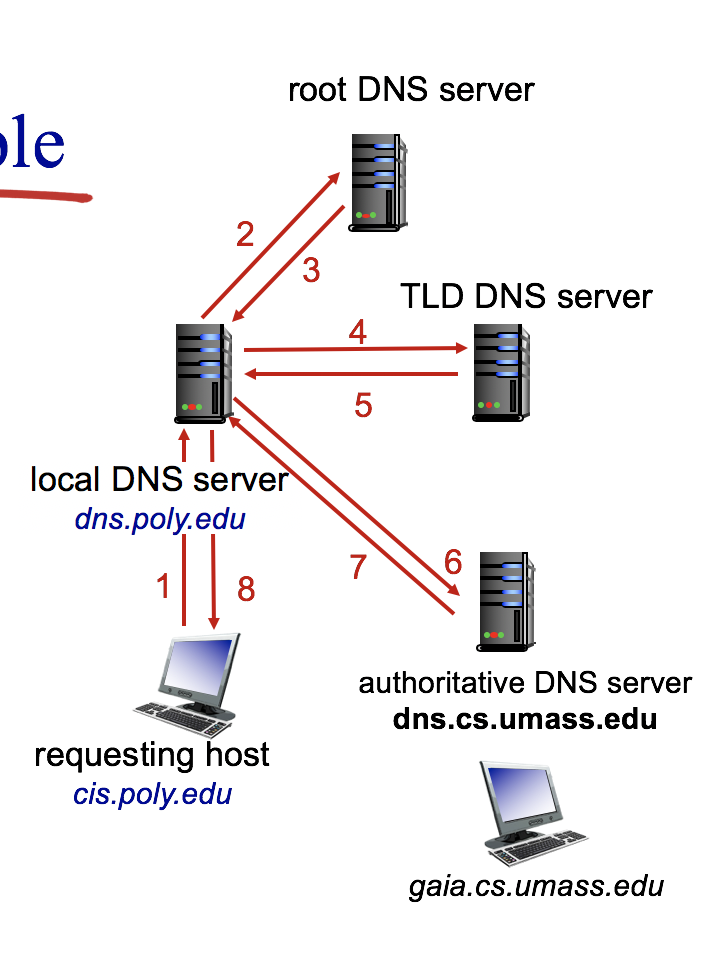

Weakest man in CS

#  CS 3201 Note

--------

## Tutorial 1

-------

### 1. Some devices

* Network Interface card : Connects computers to a network using cables. Any device needs a network interface card to connect to the internet
* Network cables : Network cables have connectors on each end that plug into network interface cards
* Cable modern(路由器) : connets your home computer or wireless router to your *Internet Service Provider* (ISP 中国移动) 
* Bluetooth headsets : When Bluetooth is switched on, you device will search for other Bluetooth device to connect to main ebabler if (PAN)
* WIFI router : allow share of internet connection main enabler of (LAN)
* Fare for each device connected to it
  * Hubs : allow devices to connect to each other by plugging network cables into their ports
  * Switch : works similar to hubs, but it can recongonize data (not anyone can access it)
* Router : Allows computers on a LAN to share the same Internet connection
* Bridge: Used to connect multiple LANs together
* Cellular Network Base station: e.g. a 4G station
* A router in the *core network* or wide area network(WAN)

--------------

## Lecture 1

-------

### 1. 1 What is Internet

----------

#### 1.1.1 A Nuts-and-Bolts Description

* millions of connected computing devices: *hosts = end systems*
  * running *network apps*
* communication links
  * Fiber, copper, radio, satellite (physical media)
  * transmission **rate** = bandwidth (bits/seconds)
* Packets = header(add by the sender) + segment of file
  * packet switch: receive packets and forward packets toward their ultimate destinations
    * Link-layer switches : used in access networks
    * Routers: forward packets (chunks of data) (packets: divide big file into small units called packets) used in network cores
* Internet: "network of networks"
  * loosely hierarchical (树) => all connected together
  * public Internet versus private intranet
* ISPs : Internet service provider => provide internet-access service to end systems
  - Tier1: national
  - Tier2: regional => connect 1 or more Tier1
  - Tier3: ISPs and local ISPs => closest to end systems
* Protocols controls sending, receiving of msgs
  * e.g. TCP, IP, HTTP, Skype, Ethernet
  * Protocols define **format, order** of msgs sent and received among network entities, and **actions ** taken on msg transmission and receiption  
  * Internet standards
    * RFC: Request for comments
    * IETF: Internet Engineering Task Force

#### 1.1.2 A Services Description

* Distributed applications: Applications involve multiple end systems that exchange data with each other, and run a the end systems.

* Service

  * communication *infrastructure* (and delivery system i.e. protocols) enables distributed applications
    * Web, VoIP, email, games, e-commerce, file sharing
  * communication services provided to apps:
    * Reliable data delivery from source to destination
    * "Best effort" (unreliable) data delivery => some times we prefer loss of bits than speed of transformation(online game/movie)

### 1.2 The network edge

-------------

#### 1.2.1 Access Networks

* network edge: applications and hosts 
* Hosts / end systems
  * client
  * server
* access networks(edge router): the network that physically connects an end system to the **first** router 
  * e.g.
    * DSL (digital subscriber line) : A residence typically obtains DSL Internet access from the same local telephone company (telco) that provides its wired local phone access.  
    * Cable, FTTH, Dial-Up and Satellite
  * Properties
    * slower than core
    * dedicated(私有)

----------

### 1.3 The Network Core

#### 1.3.1 Packet switching

* Store-and-Forward Transmission :packet switch must receive the entire packet before it can begin to transmit the first bit of the packet onto the outbound link 
  * Consider : source has three packets, each consist of L bits
  * First buffer the packet's bits : size of packets is L, rate is R
  * transmission(for one packet) delay = (L/R)*number of links
* Queuing Delays and Packet Loss
  * For each link linked to the **output buffer**(output queue)
  * Store the packets to the queue when the output link is busy
  * The queue has finity capacity
  * packet arriving to full queue dropped (aka lost)
  * lost packet may be retransmitted by previous node, by source end system, or not at all
* Forwarding Tables and Routing Protocols
  * IP address of target host is writen in the header of packets by the sender host
  * Forwarding table: Each router has an forward table that maps destination addresses
  * Packets' IP is read by the table to find appropriate outbound link

#### 1.3.2 Circuit Switching

* circuit-switched network : set up a new path between sourse and target

  - dedicated resources: no sharing

  -  circuit-like (guaranteed) performance

  - call setup required

  - dividing link bandwidth into “pieces”

    - frequency-division multiplexing : share channel

      - FM radio stations also use FDM to share the frequency spectrum between 88 MHz and 108 MHz, with each station being allocated a specific frequency band. 

    - Time-division multiplexing(TDM): use whole channel but share on time

      - Frame: time is divided into frames of fixed duration 
      - Slots: each frame is divided into a fixed number of time slots
      - When the network establishes a connection across a link, the network dedicates one time slot in every frame to this connection 
      - transmission rate of a circuit is equal to the frame rate multiplied by the number of bits in a slot (frame per second*number of bits in a slot = slot per second/slot per frame * number of bits)
      - Bit rate: total bits per second
      - transmission rate: for one slot (bit rate/slots per sec)

      $$
      dely\ time=time\ to\ set\ up+{packet\ size\over( {bit\ rate\over slots\ per\ sec})}(total\ slots)
      $$

* Packet Switching Versus Circuit Switching

  * packet-switching: data sent thru net in discrete “chunks” （router决定下一个方向， if busy store into buffer）
    * A, B packets share $\color{red}{network}$ resources
    * each packet uses full link bandwidth
    * resource contention
      * aggregate resource demand can exceed amount available
      * congestion: packets queue, wait for link use
      * store and forward: packets move one hop at a time
      * Node receives complete packet before forwarding
  * Statistical multiplexing
    - Sequence of A & B packets does not have fixed pattern, bandwidth shared on demand => statistical multiplexing
    - each host gets same slot in revolving TDM frame
  * transmit delay : (num of edges*size of file)/deliver rate
  * packet switching > circuit switching
    - Great for bursty(Discrete) data
      - resource sharing
      - Simpler, no call setup
    - excessive congestion: packet delay and loss
      - protocols needed for reliable data transfer, congestion control
    - How to provide circuit-like behaviour
      - bandwidth guarantees needed for audio/video apps (pay for the service)

* network core: 
  * interconnected **routers**
  * network of networks

### 1.4 Delay, Loss, and Throughput in Packet-Switched Networks

* Four sources of delay

  - Nodal processing : check bit errors and determine output link （negligible 可忽略）

  - Queueing : time waiting at output for transmission and depends on congestion level of router  (not negligible)

  - Transmission delay : L(file size)/R(rate) (negligible)

  - Propagation delay : down voteaccepted (negligible)

    Propagation delay is how long it takes *one* bit to *travel* from one end of the "wire" to the other (it's proportional to the length of the wire, crudely).

    Transmission delay is how long it takes to get *all* the bits *into* the wire in the first place (it's packet_length/data_rate).
    $$
    d_{nodal}=d_{proc}+d_{queue}+d_{trans}+d_{pop} 
    $$

  - Throughput

    - Throughput: rate(bits/time unit) at which bits transfeered between sender/receiver (observe from receiver side)
      - Instantaneous : At any instant of time is the rate(bits/sec) at which Host B is receiving the file
      - Average : 平均速度 F(whole bits)/T(whole time)
      - Consider $R_S$ is the rate of link between server and router $R_c$ denote the rate of the link between client and router, then the transmission rate is min($R_S$,$R_c$)
      - Per-connection end-end throughput: min($R_S​$,$,R_c​$, R/10)
      - in practice: $R_S$ and $R_c$ is oftehn bottleneck

  ### 1.5 Protocol Layers and Their Service Models

  * Layer : each layer implements a service

    * via its own internal-layer actions
    * relying on services provided by layer below (down to top)
    * advantage: different implement of layer(layer's function has not changed) doesn't affect the whole system's function

  * Protocol Layering

    * To provide structure to the design of network protocols, network designers organize protocols-and the network harware and software

  * Internet protocol stack : Protocols of the various layers are called the protocol stack

    * Application Layer : supporting network applications
      * functions : Such as the translation of human-friendly names for Internet end systems to a 32-bit network address
      * FTP, SMTP, HTTP
      * **Message** : The application in one end system using the protocol to exchange packets of information with the application in another end system, the packet of information **at application layer** is message
    * Transport Layer : processing data and transfer
      * Transports application-layer messages between application endpoints.
      * May used to
        * deliver the message up to the appropriate application
        * Error-detection bits that allow the receiver to determine whether bits in the message has changed in the route
      * TCP, UDP
        * TCP: provides a connection-oriented service to its applications
          * guaranteed delivery of application-layer messages to the destination and flow control(sender/receiver speed matching)
        * UDP: provides a connectionless service to its applications
      * **Segment**: We will refer to a transport-layer packet as segment
    * Network Layer : routing of datagrams from source to destination (for router decide output link)
      * Responsible for moving network-layer packets known as **datagrams** from one host to another
      * Internet transport-layer protocol(TCP/UDP) in a source host passes a transport-layer segment and a destination address to the network layer
      * The network layer provides the service of delivering the segment to the transport layer in the destination host
      * IP, routing protocols
        * IP : Defines the fields in the datagram as well as how the end systems and routers act on these fields (only one IP protocol, and all Internet component has a network layer must run the IP protocol)
        * Rooting protocol : determine the routes that datagrams take between sources and destinations
    * Link Layer: data transfer between neighboring network elements (avoid collision, generate different number)
      * Packets called **Link-layer frame** (has two kinds of fields)
        * header fields 
        * **payload field**:Typicaly from layer above
      * To move a packet from one node (host or router) to the next node in the route
      * Service provided depends on the link-layer protocol that is employed over the link
      * PPP, Ethernet
    * Physical : bits "on the wire" (from bits to signal)

  * ISO/OSI reference model (2 layers between application and transport) => do have this in the history

    * presentation : allow applications to interpret meaning of data (encryption, compression, machine-specific conventions)
    * Session : synchoronization, checkpointing, recovery of data exchange

    

  * The graph of layers

    * Only destination delete header, only source add header , only this two have 5 layers
    * switch only has 2 layers(do not know IP protocol), routers only have 3 layers
    * Host(end systems) implement all five layers, (Internet architecture puts much of its complexity at the edge of the network(网络的最边缘， 不是图论中的edge))

  * Encapsulation

    * Sending host: An **application-layer message** is passed to the transport layer

    * Transport layer: Take the messages and appends additional information(*Transport-layer header*) that will be used by teh receiver-side transport layer
      $$
      (application-layer\ information)+(transport-layer\ header)=(transport-layer\ segment)
      $$

    * Network Layer: Then every layer add its header

---------------

## Tutorial 2

|                         | Circuit Switching | Packet Switching                                             |
| ----------------------- | ----------------- | ------------------------------------------------------------ |
| Resource Usage          | Reservation       | Share the resources                                          |
| Performance             | stable            | Unpredictable (congestion may happen) (delay and loss)       |
| Set up                  | Needed            | Not needed                                                   |
| Multiplexing (多路传输) | TDM/FDM           | Divide the whole file into packets => statistical multiplexing |


* For long-term steady rate transmission Circuit switching  is better

* Skype offers a function to have phone call between computers and phones (connect computer network with telephone network) How?

   Skype app $\Leftarrow$ Packet switching (Internet (packets))$\Rightarrow$ Gateway $\Leftarrow$ Circuit switching(Telephone net (stream)) $\Rightarrow$ Phone

* How long does it take a packet of length 2000 bytes to ==propagate== over a link of distance 2000 km, propagation speed $2*10^8 m/s$, and transmission rate 2Mbps(it is **bits**)?

  * Transmission delay : time spend for **push data to link**

  * Propogation delay : time spend **on the link**
    $$
    td = {L\over R} = {2000*8\over 2*10^6} = 0.008s
    $$

    $$
    pd={2*10^6\over 2*10^8}=0.01s
    $$

* Suppose that users share a 10Mbps link, i.e., they all send traffic to a node which has a 10Mbps link to forward the traffic received from the users. Suppose that each user transmits continuously at 5Mbps when transmitting, but each user transmits only 20% of the time.  

  * When circuit switching is used, how many users can be supported? => 2

  * Suppose that there are **4** users and packet switching is used. What is the fraction of time that the queue at the node is not empty? 
    $$
    p=C_4^3*0.2^3*0.8+C_4^4*0.2^4
    $$


----------------

## Chapter 2

----------

### 2.1 Principles of Network Applications

* creating an internet app

  * program on different ending systems(all end systems can use it)

* Application architecher

  * p2p (pear to pear)
  * Client - Server
    * Server
      * always on host
      * permanent IP address (not local IP address)
      * data centers for scaling
    * Client
      * call communication first
      * may be intermittently(间隔) connected
      * may have dynamic IP addresses
      * do not communicate directly with each other
    * Data center:
      * Single server can't response to all the requests
      * data center housing a large number of hosts, often used to vreate a powerful virtual server

* P2P

  * no always-on server (everyone service each other)
  * arbitary ending systems directly connected
  * No or minimal reliance on dedicated server
  * peers are intermittently connected and change IP addresses
    * complex management
  * Feature : **self-scalability**

* Process communicating

  * Process : program running within a host (ending systems)
    * with the same host, two processed using $\color {red}{interprocess\ communcation}$ (defined by *OS*)
    * processes in different hosts communicate by exchanging messages
    * Include client process(initialize communication) and server process

* **Interface between the process and the computer network**

  

  * A process sends messages into or receives messages from the network through a software interface called **socket** (also called **API** between applications and network) (multiplication)
  * Control by the application developer
    * (1) the choice of transport protocol and 
    * (2) perhaps the ability to fix a few transport-layer parameters such as maximum buffer and maximum segment sizes (to be covered in Chapter 3). 
  * Address processes : for client to match message returned and process or server to match process and coming message
    * Unique IP address for identifying client
    * *identifiers* includes both **IP address** and **port numbers**

#### 2.1.3 Transport Services Available to Applications

* On the receiver side, transport layer send the message to the application layer (demultiplexing)

* Transport-layer protocols is determined by the application layer needs

  * Reliable data transfer

    * To transfer data that affected a lot by loss of bits (e-mail, file transfer, remote host access, financial applications)
    * e.g. process-to-process reliable data transfer (otherwise, **loss-tolerant applications**)

  * Throughput

    * Other sessions are sharing bandwidth with current task, the avaliable throughput can fluctuate with time
    * Another natural service : Guaranteed available throughput at some specified rate => **bandwidth-sensitive applications** (otherwise, **elastic applcations**)

  * Timing

  * Security

    

#### 2.1.4 Transport Services Provided by the Internet

* TCP services
  * Connection-oriented service
    * TCP has the client and server exchange transport-layer control information with each other *before* the application-level messages => hand shaking
    * TCP connection is between the sockets of the two processes can send messages to each other over the connection at the same time
  * reliable data transfer service
    * Deliver all data sent without error and in the proper order
    * When one side of the application passes a stream of bytes into a socket, it can count on TCP to deliver the same stream of bytes to receiving socket
  * Congestion-control mechanism(抗阻塞机制)
    * For the welfare of the whole Internet rather than for the direct benefit of the communicating processes
* UDP services
  - UDP is a no-frills(没多余装饰) lightweight transport protocol => no hand shaking, unreliable transfer, data may out of order, no congestion-control mechanism

#### 2.1.5 Application-Layer Protocols

* Application-layer protocol define how an application's processes, running on different end systems, pass messages to each other. It defines:
  * The type of messages exchanged, for example, request messages and response messages
  * The syntax of the various message types, such as the fields in the message and how the fields are delineated(划定) 
  * The semantics of the fields, that is, the meaning of the information in the fields
  * Rules for determining when and hows a process sends messages and responds to the message

* types of messages exchanged, 
  * e.g., request, response 
  * message syntax:
    *  what fields in messages & how fields are delineated
  * message semantics 
    * meaning of information in fields
  * rules for when and how processes send & respond to messages
    * HTTP, DNS，Skype 

### 2.2 The Web and HTTP

* unlike traditional broadcast radio and TV, users receive what they want, when they want it => force user to tune in when the content provider makes the content available

#### 2.2.1 Overview of HTTP

* Web overview
  * Web and HTTP
    * web page consist of referenced objects which are based on *HTML* file
    * Each object is addressed by a URL (Every objects has its URL refered by HTML)
  * HTTP: Web's ==application layer== protocol => **HyperText Transfer Protocol** implementing 2 programs
    * Client program : browser (using HTTP protocol and "displays" web objects)
    * server program: Web server sends (using HTTP protocol) objects in response to requests 
    * HTTP based on TCP : 
      * client initiates connection

        * client sends HTTP request messages into its socket interface and receives HTTP response messages from its socket interface
        * When message sent into its socket interface, it is out of hand of HTTP or client's hand, it is in control of TCP => HTTP don't have to warry about how data loss is recovered or bits are reordered, because that is job of TCP(like OOP) => advantage of layered architecture

      * Server accepts TCP connection from client

        * Server sends requested files to clients without storing any state information about the client

          => if a client ask for the same object twice, server will do it => HTTP is **stateless protocol**

      * HTTP messages (application-layer protocol messages) exchanged between browser (HTTP client) and Web server (HTTP server)

      * TCP connection is closed

  #### 2.2.2 Non-Persistent and Persistent Connections

  * HTTP connections
  * HTTP : default: persistent connection; runnable : both non-persistent and persistent
    * Non-persistent connection=>each request sent over a *separate* TCP connection
      * steps
        * client initialize connection, 2 sockets(1 client 1 server) established
        * client sends an request message to the server via its socket which include the path name
        * Server process receives the request message via its socket, retrieves the object, *encapsulates* the object in an HTTP response message, and sent back the message via its socket
        * HTTP server process tells TCP to close the TCP connection (TCP doesn't acctually close until it knows client has received the information)
        * client receive the object (HTML) and ask for reference object
        * repeat the steps above until get all the objects (parallel TCP connections are allowed)
      * at most one object sent over a TCP connection
        * The connection is then closed
      * downloading multiple objects required multiple connections
        * If we do not consider the transmission time, it takes two round trip time (i.e. **from client to server then back to client**) (RTT) to get each object (one for object, one for close TCP link request)
        * HTML : 2 RTT(for connection and request) +transmission of the HTML file Object : 2 RTT
        * All : 2*(n+1) n is the linked object
    * Persist HTTP : Multiple objects can be sent over a single TCP connection between client and server
      * without pipelining
        * Client issues new request only when the previous one has been received
        * HTML : 2 RTT(TCP+HTML) Each Object : 1 RTT 
        * All : 2 + 1*n(objects)
      * with pipelining
        * Multiple Web pages residing on the same server can be sent from the server to the same client over a single persistent TCP connection
        * Client issues new request as soon as it encounters a reference object
        * All : As little as 1 RTT for all the referenced objects (send all objects at the same time) but still 1 RTT for HTML to get the link i.e. 3 RTT in total

#### 2.2.3 HTTP Message Format

* Two types of message : request messages and response messages
* HTTP Headers
  - General header
  - Request/Response header
* Request message (five lines)
  * The first line : **request line** => 3 fields
    * method field
    * URL field
    * HTTP version field
  * 2th : **header line**
    * specifies the host on which the object resides
    * As there is already a connection with TCP (i.e. already found the server), it is used for web cache
  * 3th : ```Connection:close``` : tell the server close the connection after sending the requested object
  * 4th : ```User-agent:``` : header line specifies the user agent, that is, the browser type that is making the request
  * 5th : ```Accept-language``` : just one of many content negotiation headers available in HTTP (use what kind of language, if it is not provided by the server, use the default language)
* HTTP Response message
  - Status-line (The first line)
    - HTTP version number 
    - Status code (indicating success or failure) (200 OK, 404 Not Found)
    - Status phrase (OK, Not Found)
  - General/Response/Entity Header (s)
    - Date
    - Last-Modified
    - Entity headers (propoty of enetity)
      - Content-Length
      - Content-Type
    - Entity body : Object itself

* Cookies

  * Allow sites to keep track of users
  * small chunck of data generated by Web server and stored on computer's hard disk
  * Fix problems caused by HTTP's stateless(server doesn't remember the information of client) protocol
  * Components:
    * a cookie header line in the HTTP response message
    * a cookie header line in the HTTP request message
    * a cookie file kept on the user's end system and managed by the user's browser
    * a back-end database at the Web site
  * Steps
    * First time of connect : 
      * When request comes in to serverm server creates a unique identification number and **creates an entry**(the cookie file) in its back-end database that is indexed by the identification number. Response message includes a ```Set-cookie:```header, which contains the number
      * when browser receives the HTTP response message, it sees the ```Set-cookie:``` header. Then browser appends a line(include the hostname of the server and the identification number in the header) to the special cookie file that it manages
    * After that
      * Every time browser request, it will consults her cookie file, and add the identification number in HTTP request
      * If client has sign up an account on the Web, thus the database has client's information, then everytime it will check the identification number with the database, user don't have to input the account and password again

* Web cache

  * Goal: statisfy client requests without involving the origin server

  * save the data at proxy server (distributed around the world) , cliet get the data from the closest server

  * User sets browser: Web accesses via cache (i.e. TCP connection to the Web cache)

  * Browser sends all HTTP requests to cache

    * object in the cache: the cache returns object 
    * Otherwise the cache requests the object from the origin server, then returns the object to the client and store the object into the Web cache's local storage

  * If origin updated (The conditional GET)

    * Goal : vdon’t send the object if cache has up-to-date cached version 

      - no object transmission delay (less than the delays)
      - lower link utilization

    * Request message uses the GET method and includes an ```If-Modified-Since``` : header line

    * when proxy server(cache) receive request it will check with origin server(just 版本号)

      ```
      If-modified-since : Wed, 19 Sep 2018 04:09:30	//Date
      ```

    * cache: specify date of cached copy in HTTP request 

    * server: response contains no object if cached copy is up-to-date:  ```304 Not Modified``` 

### 2.5 DNS - The Internet's Directory Service : belongs to Application layer protocol

* DNS : domain name system

  * IP address (32 bit) - used for addressing datagrams
  * domain name( **hostname**) => used by human

  * DNS : Directory service that **translates** hostnames to IP addresses => **domain name system**
    * property
      * distributed database implemented in hierarchy of many **DNS servers** (often **UNIX** machines ): to avoid attack(if it is save in a single one, will be attacked) => block chain to avoid attack
      * Application-layer protocol: hosts and name servers communicate to resolve names (address/name translation) 

#### 2.5.2 Overview of How DNS Works

* Structure

  * If there is only one DNS server

    * A single point of failure
    * Traffic volume
    * Distant centralized database
    * Maintenance (DNS server has to keep records for all Internet hosts)

  * As a result => use distributed, hierarchical database

    * **Root DNS servers** : In the Internet there are 13 root DNS servers(labeled A through M) in the world 
    * **Top-level domain (TLD) servers** : These servers are responsible for top-level domains such as com, org, net, edu, and gov
    * **Authoritative DNS servers** : Every organization with publicly accessible hosts (such as Web servers and mail servers) on the Internet must provide publicly accessible DNS records that map the names pf those hosts to IP addresses (server can be rent or maintain one server yourself)

    


- Process : client wants IP for www.amazon.com; (All DNS in the client use UDP transport protocol)

  - DNS client queries root server to find com DNS server 
  - client queries .com DNS server to get amazon.com DNS server
  - client queries amazon.com DNS server to get  IP address for www.amazon.com (it is a web server www rather than an e-mail server)

- Root DNS servers:

  - contacted by local name server that can not resolve name : nearest

  - root name server(向导):

    - contacts authoritative name server if name mapping not known
    - gets mapping
    - returns mapping to local name server

  - Local DNS name server

    - not the hierarchy but it is the one who send the query (beween DNS client and the **DNS Hierarchy**)

    - each ISP(Internet Service Provider) has one

    - when host makes DNS query, query is sent to its local DNS server 

    - has local cache of recent name-to-address translation pairs (but may be out of date!)

    - acts as proxy, forwards query into hierarchy

      

    - Iterated query: (the picture above 1&8 is recufsive query, others are Iterated query)

      - contacted server replies with name of server to contact
      - “I don’t know this name, but ask this server”
      - Cons : local DNS server will not benefit for others

    - recursive query:

      - deep first search
      - heavy load at upper levels of hierarchy

      

### 2.6 Peer-to-Peer Applications

#### 2.6.1 P2P File Distribution

* Scalability of P2P Architectures

  * Denotes

    * Denote upload rate of the server's access link by $u_s$
    * Denote upload rate of $ith$ peer's access link by $u_i$
    * Denote download rate of the $ith$ peer's access link by $d_i$
    * Denote the size of the file to be distributed (in bits) by $F$ and the number of peers that want to obtain a copy of the file by $N$
    * **Distribution time**: time it takes to get a copy of the file to all $N$ peers

  * Assumption

    * Internet core has abundant bandwidth => all of the bottlenecks are in access networks
    * Server and clients are not participating in any other network applications => all bandwidth used to distributing this file

  * Distribution time : $D_{cs}$

    * For Client-Server

      * The server must transmit one copy of the file to each of N peers => total $NF$ bits => rate = $NF \over u_s$
      * $d_{min}=min(d_1,d_2,...,d_N)$ The peer obtain all $F$ bits of the file in less than $F\over d_{min}$ seconds

      $$
      D_{cs} \geq max\{{NF\over u_s},{F\over d_{min}}\}
      $$

      * We take the lower bound (i.e. the equal case , best case)
      * The formular increasing linearly (with respect to N)

    * For P2P architecture

      * When a peer receives some file data, it can use its own upload capacity to redistribute the data to other peers => distribution time depends on how each peer distributes portions of the file to the other peers

      * Server need to send each bit of the file at least once into its access link (only server has the file at first) => minimum distribution time is at least $F/u_s$

      * The peer with the lowest download rate cannot obtain all $F$ bits of the file in less than $F/d_{min}$ seconds => minimum $F\over d_{min}$

      * Total upload capacity of the system as a whole is equal to the upload rate of the server plus the upload rates of each of the individual peers $u_{total}=u_s+u_1+...+u_N$ (every one contributes to get the largest rate). And the total file size is $NF$, thus the minimum time is $NF\over u_{total}$ .
        $$
        D_{cs}=max\{ {F \over u_s},{F \over d_{min}},{NF\over u_s+\sum^N_{i=1}u_i}\}
        $$

      * In reality, where chunks of the file are redistributed rather than individual bits, the equation is a good approximation

    * Set $F/u=1\ hour,\ u_s=10u,\ and\ d_{min} \geq u_s$ 

      

- Pure P2P architecture
  - file divided into 256Kb chucks
  - peers in torrent send/receive file chunks
  - server just tell you who has what, and people change with each other
  - **tracker** : tracks peers participating in torrent (provide a list to client)
  - **torrent**: ==group== of peers exchanging chunks of a file
    - each torrent has a infrastructure node called a *tracker*
- P2P file distribution
  - BitTorrent ： In BitTorrent lingo(行话), the collection of all peers participating in the distribution of a particular file is called a *torrent* (include the whole group)
    - peers in a torrent download equal-size *chunks*(256KB) of the file from another
    - peer joining torrent
      - has no chunks, but will accumulate them over time from other peers
      - registers with tracker to get list of peers (tracker **randomly** selects a subset of peers, and send IP address to request peer), connects to subset of peers (“neighbors”)
    - requesting chunks
      - Ask neighbors for the list of chunks they have (By TCP connections)
      - Alice requests missing chunks from peers, **rarest first**, because no one always online => as a result equalize the copies of the different chunks
    - Sending chunks: tit-for-tat
      - sends to those top four peers (**unchoked**) currently send you *at highest rate* (re-evaluate 4 every 10 secs ) 
      - every 30 secs : randomly select another peer (**optimistically unchoked**), starts sending chunks (for the case of new client who didn't serve others

### 2.7 Socket Programming

* Initializing the connection
  * First, as in the case of UDP, the TCP server must be running as a process(Listen) before the client attempts to initiate contact. 
  * Second, the server program must have a special door—more precisely, a special socket—that welcomes some initial contact from a client process running on an arbitrary host. 
* Some java functions and classes

#### (1)Connecting to a server using java

```java
Socekt s = new Socket("ip.address",port#);
s.getInputStream();
InputStream in = s.getInputStream();		// read from socket
OutputStream out = s.getOutputStream();		// write to socket
```

#### (2) Implementing Server

```java
ServerSocket s = new ServerSocket(port#);
Socket = s.accept();

```


## Chapter3  Transport layer

------

Relation between Transport layer and network layer:

* Transport layer **extending the network layer's delivery service** between two end systems to a delivery service between two application-layer processes running on the end systems

-------------

### 3.1 Introduction and Transport-Layer Services

-----------

* A transport-layer protocol provides for **logical communication**(from an application's perspective, it is as if the hosts running the processes were directly connected, it doesn't worry about the physical infrastructure used to carry these messages) between application processes running on different hosts
  * package on transport-layer : **segments** = chunks + transport-layer header
  * Rooter act only on datagram (segments+network-layer header), i.e. it doesn't check the transport-layer header

#### 3.1.1 Relationship Between Transport and Network Layers

* Transport-layer protocol provides logical communication between *processes* running on different hosts, a network-layer protocol provides logical communication between *hosts*.
  * e.g. 2 house, each has a dozen kids, kids from different house to each other, Alice and Bob are person who receive the mail and distribute to other kids in the 2 houses respectively, then
    * application message : mail in envelopes
    * Process : kids
    * Hosts : house
    * transport-layer protocol : Alice and Bob
    * Network-layer protocol : postal service (including mail carriers)
  * So transport-layer protocols only lives in end systems

#### 3.1.2 Overview of the Transport Layer in the Internet

* Two protocol
  * **UDP** : User Datagram Protocol => unreliable
  * **TCP** : Transmission Control Protocol => reliable
* **IP** (Internet protocol) 
  * Provides logical communication between hosts
  * a **best-effort delivery service** : makes best effort to deliver segments between 2 communcating hosts, *but makes no guarantees*(order and segment delivery) => **unreliable service** 

* Transport protocol
  * sender side: breaks app messages into segments, passes to  network layer => **transport-layer multiplexing**
  * receiver side: reassembles segments into messages, passes to app layer => **transport-layer demultiplexing**

-----------------

### 3.2 Multiplexing and Demultiplexing

-------------

* Transport-Layer protocol delivet data to socket instead of delivering data to application directly (There is more than one socket in the receiving host, more than one socket for a single process, and each socket has a unique identifier) => format of the identifier depends on whether the socket is a UDP or TCP socket

* Multiplexing/demultiplexing 

  * Multiplexing at sender : break data to segment, add transport header (encapsulation)
  * Demultiplexing at receiver : (Transport layer) use header info to deliver received segments to correct socket (UDP use less information to demultiplexing)
  * Transport-layer in the middle host in the picture must **demultiplex segments arriving from the network layer** below to either process P1 or P2 above (done by directing the arriving segment's data to the corresponding process's socket), and must also **gather outgoing data from these sockets**
  * when a **single protocol** at one layer (transport layer or other layers) is used by **multiple protocols** at the next **higher** layer (底层一个对应上层多个), it is called multiplexing

* Port number

  * multiplexing requires:
    * sockets have unique identifiers
    * each segment have special fields that indicate the socket to which the segment is to delivered
  * Source port number filed and destination port number field
  * Well-known port numbers : 0-1023 (used by well-known application protocols such as HTTP , FTP)
  * Typically, the client side of the application lets the transport layer automatically (and transparently ) assign the port number, whereas the server side of the application assigns a ==specific port number==

* Connectionless Multiplexing and Demultiplexing (UDP)

  * Use 2 number to generate socket at server side(destination ==IP address== and ==destination port number==) => maybe two different client ask for the ==same socket== at the server side (connectionless)
  * Source port number : used as a return address

* Connection-Oriented Multiplexing and Demultiplexing (TCP)

  * four numbers to spercify the process (source IP, source port, dest IP, dest port) (connection oriented)

  * two arriving TCP segments with different source ==IP addresses== or ==source port numbers== will (with the exception(除此以外) of a TCP segment carrying the original connection-establishment request) be directed to 2 different sockets

  * Further insight

    * There is a "welcome socket" waits for connection-establishment requests from TCP clients on port number 12000

    * The TCP client creates a socket and sends a connection establishment request segment

      ```python
      clientSocket = socket(AF_INET,SOCK_STREAM)
      clientSocket.connect((serverName,12000))
      ```

    * the request consist of : 

      * destination port number 12000 
      * a special connection-establishment bit set in the TCP header
      * source port number chosen by client

    * The server receives the incoming connection-request segment with destination port 12000, and creates a new socket

      ```python
      connectionSocket, addr = serverSocket.accept();
      ```

    * Also transport layer at the server side notes the four values (1) source port (2) source IP (3) destination port (4) its own IP address, the newly created socket is identified by these four (newly comed segment has to match the 4 values to go in the socket)

    

* Web Servers and TCP

  * There is not always a one-to-one correspondence between connection sockets and processes
  * High performance server often use only ==one process==, and create a ==new thread== with ==a new connection socket== for each new client connection (i.e. there may be many sockets(identified by 4 numbers) attached to the same process)
  * Threaded(线程) server : in the same port, generate child API to deal with request of different client (main process generate new socket generate new thread process and combine them)
  * recall the HTTP
    * Persistent connection : client and server exchange HTTP messages via the same server socket
    * Not-persisten connection : different socket

### 3.3 UDP : Does as little as transport protocol can do (almost directly from application to IP)

* No handshaking : so called *connectionless*

* Used in DNS (ask for the hierarchy server) why?
* UDP's advantage
  * Finer application-level control over what data is sent, and when (i.e. **Fast**) 
  * No connection establishment
  * No connection state
  * Small packet header overhead

#### 3.3.1 UDP Segment Structure

* Data field: data provided application layer process

* Header field : Four fields each has 2 bytes

  * Source port and Destination port : for recongnizing process (no IP address because it is network layer header)
  * Length field : specifies the number of bytes in the UDP segment (both header and data i.e. 4*2 bytes+sizeof(data)) => needed since the size of the data field may differ from one UDP segment to the next
  * Checksum field : used by the receiving host to check whether errors have been introduced into the segment 
    * In truth, also calculated over a few of fields in IP header

  

#### 3.3.2 UDP Checksum

* At sender : 
  * add all the 2 bytes fields in the segment together
  * If there is an overflow, ==add the overflow digit to end==
  * perform the 1s complement (==flip the number '1' to '0' and '0' to '1'==)
  * get the Checksum header
* At receiver:
  * Add all the fields including checksum
  * if the answer is not all '1' (because flip the number, there exist and only exist one '1' in each digits), there is error
  * if it is all 'a' , maybe error, maybe not(because maybe when transmit the data the number in the same digits change together, answer will still be 1)
* Reason to provide the service
  * As Link-layer protocol also provide check error service but there is no guarantee that all the links between source and destination provide error checkingter's memory
  * Also possible that bit errors could be introduced when a segment is sotred in a rou
  * **end-end principle** : end-end data transfer service is to provide error detection
* Do with error
  * discard the damaged segment
  * pass the damaged segment to the application with a warning

### 3.4 Principles of Reliable Data transfer

* Reason of difficult to implement reliable : The layer below may not be reliable
* One assumption : packets will be delivered in the order in which they were sent, but some packets may lost
* Terminology : use packet instead of segment, because the theory apply for all the layers
* Data transfer : only consider **unidirectional data transfer** (directly between sender and receiver rather than full-duplex)


#### 3.4.1 Building a Reliable Data Transfer Protocol

* First case : When the underlying channel (底层) is completely reliable ```rdt1.0```

  * sender side : just wait for data from above (layer)
  * Receiver side : just wait for data from below
  * Both sender and receiver has 1 state , that is wait for data
  * Property
    * In this case, there is no difference between a unit of data and a packet, no need to provide feedback from receiver to sender
    * We also assume that the receiver is able to receive data as fast as the sender happens to send data => no need for receiver to ask for slow down

* Second case : Reliable Data Transfer over a Channel with Bit Errors ```rdt2.0``` 

  * Situation : There might be some error in the packet

    * **positive acknowledgments** : OK
    * **negative acknowledgments**: Please repeat that
    * retransmission protocol : ARQ  protocols

  * Fundamental additional functions

    * *Error detection* : require extra bits be sent from the sender to the receiver
    * *Receiver feedback* : Since the sender and receiver may be separated by thousands of miles, it is neccessary to let the sender know that whether data transfer is successful
      * Positive : ACK packets sent by receiver
      * Negative : NAK packets sent by receiver
    * *Retransmission* : A packet that is received in error at the receiver will retransmitted by the sender

  * Sender : 

    * wait for data above

    * wait for ACK(or NAK) from receiver, cannot get data from upper layer in this state

      ```python
      while(!isACK(rcvpkt)){
      if(rdt_rcv(rcvpkt)&&isACK(rcvpkt))
      	changeState();
      else if(!isACK(rcvpkt))
      	retransmit(theLastPacket);
      }
      ```

  * Receiver : just judge whether it receive the correct data

  
  * Thus known as **stop-and-wait** protocols

  * BUT : How to recover from errors in ACK and NAK packets => ACK and NAK packets is corrupted when transferred 

    * To solve : sender simply to *resend the current data packet* (treat bad acknowledgment as NAK) when receive garbled ACK or NAK packet (**duplicate packet**) => cause new problem that receiver doesn't know the coming data is new data or resent data
    * **sequence number** (给packet编号): putting a sequence number into this field, to make receiver identify the data (0 for even number, 1 for odd number)

  * ```rdt2.1``` : 防止收到packet后，ACK error导致duplicate packet

    * 2 new state to identify whether the packet currently being sent(by the sender) or expected(by the receiver) should have a sequence number '0' or '1'(differen state of odd seq# and even seq#)
    * Use ACK for the same ACK for the ==last correctly received packet==(**duplicate ACKs**) instead of NAK (sender receive 2 same ACKs => the packet after the ACK is corrupted => retransmit) just add argument in ```isNAK(rcvpkt,0)``` 

    

    

  

  

* Reliable Data Transfer over a Lossy Channel with Bit Errors: ```rdt3.0```

  * When data loss occur => put the burden of detecting and recovering from lost packets on the sender

    * Suppose one of the pkt or the ACK of pet get lost => **wait for a long time** to ensure that the data is lost, then retransmit
    * How long? => At least as long as a round-trip delay between the sender and receiver plus whatever amount of time is needed to process a packet at the receiver

  * Problem of resent the lost packet

    * If ACK is not back on time or has error (means it lost or error), just resent => If the time is not set properly, if packet experiences a particularly large delay, the sender may retransmit the packet even though neither the data packet nor its ACK have been lost => **duplicate data packets** (use sequence number to handle this problem)

      

    * **countdown timer** can interrupt the sender after a given amount of time has expired, thus the sender need to do:

      * start the timer each time a packet (first-time packet or retransmission) is sent
      * respond to a timer interrupt
      * stop the timer

      

#### 3.4.2 Pipelined Reliable Data Transfer Protocols

* ```rdt3.0``` is a functionaly correct, but slow => reason is it is a stop-and-wait protocol

* **utilization** : 真正传输时间占比

  * L is the size of packets, R is transmission rate of the packet

  * when the last bits of the packet comes to the receiver side
    $$
    t = RTT/2+L/R
    $$

  * assume that the ACK packet is extremly small, the time back is $RTT/2$

  * the **utilization** of the sender is fraction of time the sender is actually busy sending bits into the channel

  * we find that the number is very small => time is not efficiently used, $\color {red} {a\ lot\ of\ time\ to\ wait}$ 

$$
U_{sender}={L/R \over RTT+L/R}
$$

- Solution of stop-and-wait => **pipelining** (流水线)

  - more efficient than before (分子为pipeline传输完的时间， 分母是第一个packet的ACK返回的时间)
    $$
    U_{sender}={NL/R \over RTT+L/R}
    $$

  - Range of sequence number : increased (a lot of packets each time, need a identical number)

  - Sender and receiver sides of the protocols may have to buffer more than one packet

    - at least buffer the packets that have been transmitted but not yet acknowledged
    - Buffering of correctly received packets may also be needed at the receiver

  - Range of seq# and buffering requirments will depend on the manner in which a data transfer protocol responds to lost, corrupted, and overly delayed packets, 2 basic error recovery :  **Go-Back-N** and **selective repeat** 

#### 3.4.3 Go-Back-N (GBN)

* Sender is allowed to transmit multiple packets(no more than N) without ACK

* Define

  * ```base``` : sequence number of the oldest unacknowledged packets

  * ```nextseqnum``` : Smallest unused sequence number (next first-time packet to be sent)

  * Seq# ```[0,base-1]``` :packets that have already been transmitted

  * Seq# ```[base,nextseqnum-1]``` : packet that have been sent but not yet acknowledged

  * Seq# ```[nextseqnum,base+N-1]``` : useable but not sent

  * Seq# >= ```base+N``` : cannot be used until there is an ACK come back

  * window size : N

  * GBN itself : A **sliding-window protocol**

    

* In practice

  * If *k* is the number of bits in the packet sequence number field, the range of sequence numbers is thus $[0,2^k-1]$ => make sure not overflow 
  * Every time $seq_n=(seq_{n-1}+1) \% 2^n$ 
  * stop-and-wait case : k = 1; TCP : k = 32

* Extended *FSM* : ACK-based NAK-free GBN protocol

  * extended means: add 2 variable to the function : ```base``` and ```nextseqnum``` 

* Sender

  * *Invocation from above* : when there is data comes from above, the sender will check whether the window is full
    * Full: return the data back to the upper layer (in practice : buffer the data or make the upper layer send onlly when the window is not full)
    * Not full : add to the window
  * *Receipt of an ACK* : In GBN, acknowledgment for a packet with seq# $n$ will be taken to be a **cumulative acknowledgment** => indicating that all packets with a seq# <= n have been correctly received (n代表从0积累到n的packet都被收到了)
    * if sender receive an ACK which is earlier than base => result of short timer, just discards it
  * *timeout event* : As in stop-and-wait protocol, a timer will be again be used to recover from lost data or lost ACK packets . When time out, $\color {red}{sender\ resend\ all\ the\ packet\ previously\ sent\ but\ not\ acknowledged}$  
    * i.e. all packet after the oldest unACKed packet(says kth)
      * Because, on receiver side, if there is an out of order one it will send back the last correct ACK (k-1) which is in front of the current one(k)
      * what if the ACK(k) is lost or corrupted => sender also resend from kth packet
    * Thus, only **one timer** needed to record the oldest not ACKed packet
    * If an ACK is received but there are still additional transmitted but not ACKed packets, resend and timer restart
    * If no outstanding, unACKed packets, timer stop

* Receiver

  * If a packet with sequence number *n* is received correctly and in order (i.e. the last one is n-1)
    * send ACK for packet n=> i.e. ACK(n)
  * In all other case => discards the packet and resends an ACK for the most recently received in-order packet => may generate duplicate ACKs (also duplicate when timer is too short, packets are sent more than 1 times successfully with ACK) (一直不成功(前一个成功的duplicate)和timer太快导致来不及传回ACK，相同包被传两次，多了个ACK都导致duplicate)
    * Out-of-order pkt
      * Discard (don't buffer) : no receiver buffering
      * re-ACK packet with highest in-order seq#
    * Thus, need only remember ```expectedseqnum```, i.e. the next seq# after the last inorder seq# because don't have out of order members
    * Cons: more retransmission would be required
  * Since Receiver deliver the data to the upper layer, if kth packet delivered, then the seq#<= k packets are also delivered => Thus, cumulative acknowledgments is a natural choice for GBN

  

#### 3.4.4 Selective Repeat (SR)

* Problem of GBN : 

  * window size and bandwidth-delay product are both large => many packets can be in the pipeline => single packet error cause GBN retransmit a large number of packets

* Selective Repeat : 

  * avoid unnecessary retransmissions by having the sender **retransmit only**  those packets that it **suspects were received in error**

  * Require receiver *individually* acknowledge correctly received packets (not just expectedseq) 

  * Require sender keep some of the ACKed packets in the window

    

  * SR receiver will acknowledge a correctly received packet whether or not it is in order

* Sender

  * *Data received from above*: similar as GBN
  * *Timeout* : Timers are again used to protect against lost packets. But each packet has its own timer (a single packet will be transmitted)
  * *ACK received* : If ACK received, SR sender marks that packet as having been received but  may not move the window
    * If ```base``` packet is ACKed, move then window to the minimum unACKed packets in the window
    * If windows moved, and there are untransmitted packets with seq# that now fall within the window, these packets are transmitted

* Receiver

  * *Packet with seq# in* ```[rcv_base,rcv_base+N-1]``` *is correctly received* : The received packet falls within the receiver's window and a selective ACK packet is returned to the sender
    * If the packet was not previously received, it is buffered (maybe repeat when ACK of receiver side lost or corrupted)
    * If the packet has a sequence number equal to the base of the receive window, then the consecutively buffered packets after the bases are delivered to upper layer. The window move to the first unreceived packet after the delivered sequence
  * *Packet with sequence number in* ```[rcv_base-N, rcv_base-1]``` *is correctly received* (i.e. the packet is arrive after the window shift => ==maybe caused by loss or corrupt of ACK packet==)  , even though this is a packet that the receiver has previously acknowledged(because the sender side need to be terminated)
  * Otherwise, ignore(receive a packet out of window, or a duplicate packet in the window) 

  

* Lack of synchronization (缺乏同步)

  * suppose the length of sequence field is 4 => only 0,1,2,3 four numbers

  * suppose the window size is 3

  * if 0,1,2 is successfully received => sender window becomes 3,0,1

  * 2 scenario

    * ACKs for the first 3 packets are lost and the sender retransmit these packets
      * The receiver thus receive a 0 which is caused by the fail ACK transmission
      * Cause chaos

      

    * ACKs for the first three packets are all delivered correctly, but the packet with seq# 3 id lost, and the seq# 0 after it deliveted correctly

    

    * There is no way to identify these two scenarios 
    * Conclusion : The window size must be less or equal to half of the size of the sequence number space for SR protocols (i.e. no same seq# in adjacent window shifting)

* Remaining assumption

  * we assume that packets cannot be reordered within the channel between the sender and receiver
  * possible when there is only one path to transmit, but there is a lot of roads to a town
  * If reordered, there maybe a packet with seq# x, that x is neither in sender's window nor in receiver's window. i.e. x is buffered by the channel
  * Seq# may be reused (%2^n) : sender need to be sure that there is no pre-sent packet with seq# x still in the network
  * Set the lifetime of the packet to be approxiamately 3 minutes

* TCP

  * connection oriented : Explicit set-up and tear-down of TCP session
  * Reliable, in-order delivery
    * checksum => bits error
    * Acknowledgments & retransmissions for reliable delivery
      * Sender retransmits lost or corrupted data
      * Timeout based on estimates of round-trip time (wait for the data, maybe just slow instead of loss)
      * Fast retransmit algorithm for rapid retransmission
    * Sequence numbers to detect losses and reorder data => detect missing data and put the data it back in order
  * Flow control : prevent overflow of the receiver's buffer space
  * Congestion control

* Stop-and-wait operation

  * Pipelining : increased utilization : $U = N*U$ (N is maximum packets per pipeline)

  * * Go-back-N
      * sender can have up to N unacked packets in pipeline
      * Receiver sends $\color{red}{cumulative\ ack}$ => doesn't ack packet if there is a gap (i.e. receive 5th without 4th packets, there is a gap between 3 and 5)
      * Sender has timer for oldest unacked packet. Resend in sequence from the oldest unacked
      * For acked packets after the oldest unack packet, just delete them from the buffer
    * Selective Repeat
      * sender can have up to N unacked packets in pipeline
      * Receiver sends $\color{red}{individual\ ack}$ for each packet
      * sender maintains timer for each unacked packet

### 3.5 Connection-Oriented Transport: TCP

#### 3.5.1 The TCP Connection

* Review of TCP
  * Connection-oriented : handshaking (Three-way-handshake)
  * TCP only runs in end systems (not in routers or link-layer switches) 
  * **Full-duplex service** : Same transmission speed for both side of host connected by the same TCP
  * point to point : single sender and single receiver

* Some terms

  * **send buffer** : one of buffers set up during the initial three-way handshake

  * **maximum segment size(MSS)** : set by first determining the length of the largest link-layer frame that can be sent by the local sending host (maximum application layer data size rather than transport layer)

  * **maximum transmission unit(MTU)** : largest link-frame
    $$
    MTU = MSS+TCP/IP\ header
    $$


#### 3.5.2 TCP Segment Structure


* seq# and ACKs#

  * Seq# : **byte stream "number"** of first byte in segment's data(I.E. seq#-1=how many bytes has been received) => TCP 可以借用selective 的优点的本质在于seq#的选取非常巧妙

    * initial the seq# randomly (prevent it is same as earlier used numbers)
    * neighbor segments has a difference between seq# as MSS

  * ACK# : Since the TCP is full-duplex, everyone could be sender or receiver

    * $ACK_A=last\ correct\ PKT_B+1$ 
    * $ACK_B=last\ correct\ PKT_A+1$ 
    * i.e. the next seq# the receiver expecting
    * cumulative ACK : only ask for the first expected (when there is a gap, ask for the first bytes of the gap)
    * buffer the out-of-order segments

    

#### 3.5.3 RTT Estimation and Timeout

* timeout value : longer than RTT (BUT RTT varies)
  * too short : premature timeout, unnecessary retransmissions
  * too long : slow reaction to segment loss

* Measurment
  * measured time from segment transmission until ACK receipt ($SampleRTT=t_{ack}-t_{sent}$) => average the several *recent* measurements rather than the current one

  * At any point in time, the ```SampleRTT``` is being estimated for only one of the transmitted but currently unACKed segments => leading to a new value of ```SampleRTT``` once every RTT

  * ignore the retransmitted segments

  * Because the value will fluctuate(波动) due to the congestion in the routers and to the varying load on the end systems

    * Use the average value ```EstimatedRTT``` 
      $$
      EstimatedRTT=(1-\alpha)*EstimatedRTT + \alpha * SampleRTT
      $$

    * Weghted combination of previous value and new value of Sample

    * recommended value is 0.125

    * Also need to measure the variability(变化) of the RTT, define ```DevRTT``` as an estimate of how much ```SampleRTT``` typically deviates from ```EstimatedRTT``` : 

    $$
    DevRTT = (1-\beta)*DevRTT+\beta*|SampleRTT-EstimatedRTT|
    $$

    * DevRTT is an EWMA(exponential weighted moving average) of the difference between SampleRTT and EstimatedRTT

* Setting and Managing the Retransmission Timout Interval

  * The interval should be larger than ```EstimatedRTT``` (stop and wait) => otherwise, unnecessary retransmissions

  * not to large => otherwise, when segment lost, TCP wouldn't quickly retransmit the segment

  * Therefore, set it to be ```EstimateRTT``` plus some margins

    ```
    TimeoutInterval = EstimatedRTT + 4 * DevRTT
    ```

  * Initial value of the interval should be set to 1 sec

  * timeout occurs => double the interval => to avoid premature(过早的) timeout occurring for a subsequent segment that will soon be acknowledged = > However, next time the value will be computed again by the fotrmula

#### 3.5.4 Reliable Data Transfer

* Review : with IP service datagrams can overflow router buffers and never reach their destination, datagram can arrive out of order, and bits in the datagram can get corrupted

- Sender :

  - ACK(n) $\color{red}{all\ byte\ before\ n\ }$ is correctly received (window remove to the expected one)
  - Single timer for segment loss => associated with the oldest unACKed segment
  - Three basic events : data received above, timer timeout, ACK receipt
  - Timer timeout
    - resend the segment caused timeout
    - restart timer
  - ACK receipt
    - change the window base to y (expected)

- Receiver

  - If no gap, send the next expect ACK

  - If there is gap, send back the first bytes of the gap as seq# of ACK

  - Duplicate packet to receiver(due to the timeout interval is too short, the ACK is not back, sender resend the pkt) : ignore duplicate, just send expected ACK 

  - loss or corrupted ACK : receiver will just send expected

    | Event                                                        | Action                                                       |
    | ------------------------------------------------------------ | ------------------------------------------------------------ |
    | arrival correct seq# pkt, and all data up to expected seq# already acknowledged | Delayed ACK : wait for the next segment for about 500ms      |
    | correct seq#, one other in-order segment waiting for ACK transmission | Immediately send single cumulative ACK, ACKing both in-order segments |
    | arrival of out-of-order segment higher-than expect seq# (Gap) | immediately send back duplicate ACK                          |
    | arrival of segment partially or completely fills gap         | Immediately send ACK, provided that segment starts at lower end of gap or the next expected |

- A few interesting scenarios

  - first case : lost ACK , duplicate segment, resend ACK

    

  - Second case : 2 continuously segments' ACK arrive late, duplicate segment, resend last ACK (Sender restart timer)

    

  - Third case : ACK before the last one lost => ignore

    

- Doubling the Timeout Interval : now discuss a few modifications that most TCP implementations employ

  - Timeout interval will be doubled if the timeout occurs => interval grow exponentially after each continuously retransmission
  - Timeout interval will be recalculated by the formula when other 2 events occur
  - Timer expiration is most likely caused by congestion in the network (i.e. too many packets in the same router causing packet loss or long queuing delay)
  - So the TCP double the interval to slow down the rate of transmit

- Fast Retransmit

  - timeout events => long delay before resending lost packet
    - Problems of timeout-triggered retransmission : if timeout interval is long, need to wait for a long time before retransmitting
  - duplicate ACK => segment is lost, a lot of segment after it received by receiver, then receiver will send back a lot of same ACK
    - if duplicate ACK exist, there might be error, but also possible to be correct => thus receive $ \color{red}{3 ACKs}$ for same data then resend unacked segment with smallest seq#
    - If 3 duplicate occurs, sender performs a **fast retransmit** 

- Compare with GBN and SR

  - GBN
    - Same : cumulative ACK, only maintain 1 timer , 1 sendbase and NextSeqNum 
    - Diff : buffer correctly received but out of order segments

#### 3.5.5 Flow Control

sender may send faster than receiver buffer send the data to upper layer => overflow of receiver buffer

* Thus Flow control => speed-matching service

* congestion control => solve the problem of whole network congestion (use same method on the sender side as flow control but for different reason)

* Method : have the sender maintain a variable called **receive window**(rwnd) => give sender 

  

  * receiver
    $$
    rwnd = RcvBuffer-[LastByteRcvd-LastByteRead]
    $$

  * Sender
    $$
    LastByteSent-LastByteAcked\leq rwnd
    $$

  * Problem : when receiver buffer is full, now sender stop sending, but as receiver's application layer empty the buffer without sending back any information (only when receives segment it will send ACK) , sender thus blocked

  * Solve : Host A continue to send segments with one data byte when rwnd is 0, this segment will be ACKed and return the window size

#### 3.5.6 TCP Connection Management

* establish a connection : three ways hand shaking

  

  * step1 : client-side TCP first sends a special TCP segment(no application data) to the server-side TCP, the SYN bit of the segment header is set to 1
    * The special TCP segment
      * SYN = 1;
      * application data = null
      * Seq# = random # denote as client_isn + 1
  * Step 2 : 
    * The IP datagram containing the TCP SYN segment arrives the server, the server extracts the TCP SYN segment, add the buffers and variables to the connection
    * Then send a connection-granted segment back
      * SYN = 1
      * ACK = client_isn +1
      * Seq# : random# server_isn
    * The connection granted segment is refered as a **SYNACK segment**
  * Step 3 : 
    * Upon receiving the SYNACK segment, the client also allocates buffers and variables to the connection, and then the cliet put the server_isn +1 as ACK number
    * The SYN is set to 0

* Close a connection : The "resources"(variables and buffer) should be deallocated

  

  * First, the application layer of sender declare a command of closing the connection, client side send a special segment FIN = 1
  * Second, the server send back ACK for FIN and wait for a while , then sends its own shutdown segment, which has the FIN set to 1
  * Thirdly, the client side acknowledges the server's shutdown segment => at this point, all the resources in the two hosts are now deallocated

* During life TCP connection

  

  

* Situation : The host receives a TCP SYN packet with destination port 80,. but the host is not accepting connections on port 80

  * The host will send a special reset segment to the source. (RST bit set to 1)

### 3.6 Principles of Congestion Control

Data loss or long delay => overflowing of router buffers as the network becomes congested

Retransmission => Does not treat the cause of network congestion-too many sources attempting to send data at too high a rate

 **available bit-rate (ABR)** service in **asynchronous transfer mode(ATM)** networks

#### 3.6.1 The Causes and the Costs of Congestion (not in class)

* Simplest scenario : 2 hosts each have a connection that shares a single hop between source and destination (Suppose the Transport layer protocol is weak)

  * A sending data in to the connection at ave rate of $\lambda_{in}$ bytes/sec => igoring the adding header time, the rate at which Host A traffic to the router in this first scenaro is thus $\lambda_{in}$ bytes/sec

  * **per-connection throughput**(number of bytes per second at the receiver) as a function of the connection-sending rate (when sender rate larger than R/2, it will not increase )

    

  * Operating near link capacity

    * As the sending rate exceed R/2 the average number of queued packets in the router is unbounded, and the average delay between source and destination become infinite => In the simplest scenario, there is a cost of congested network - large queuing delays are experienced as the packet arrival rate nears the link capacity

      

* Second Scenario : 2 senders and a Router with Finite Buffers => with data loss

  * sending rate : packets can be retransmitted we denote the term *sending rate* as
    * $\lambda_{in}$ when the application sends original data
    * $\lambda_{in}\prime$  (**offer load** to the network)when the transport layer sends segment(both original and retransmited data are considered (by using plus))
  * Case 1 : Buffer is free => no loss occur
    * $\lambda_{in}=\lambda_{in}\prime$ , Throughput = $\lambda_{in}$ 
    * Ave host sending rate cannot exceed R/2 
  * Case 2 : The sender retransmits only when a packet is known for certain to be lost (Also beyond the realistic because when timeout is not large enough the packet will be resent) 
    * Cost of retransmission
  * Case 3 : The sender may time out prematurely and retransmit
    * Cost of unneeded retransmission

* Third Scenario : 4 senders, Routers, with Finite Buffers and Multihop paths

  

  - For extremely small value of $\lambda_{in}$ the sender side, overflows are rare. So in this case a little change of $\lambda_{in}$ effects a lot of $\lambda_{in}\prime$ 
  - For large value, arrival rate of B-D traffic at R2 can be much larger than that of the A-C traffic 
    - because A-C and B-D complete at router R2 for the limited buffer space
    - rate of A-C goes to zero in the limit of heavy traffic
    - When a packet is dropped at second-hop router, the work done by teh first-hop in forwarding a packet to the second router ends up being "wasted" (好不容易过来，前面白努力了)

### 3.7 TCP Congestion Control

TCP needs to adjust the rate of transmission by perceiving the network congestion

Three question:

(1) How does a TCP sender limit the rate at which it sends traffic into its connection

- Solution

		Sender side congestion-control mechanism operating at the sender keeps track of an 			 additional variable, the **congestion window** (denote ```cwnd```), imposes a constraint on the rate at which a TCP sender can send into the network
$$
LastByteSent-LastByteAcked\leq min\{cwnd,rwnd\}
$$

* Suppose : The TCP recieve buffer is so large => the amount of unACKed data at sender is solely limited by ```cwnd``` 

  *Thus the sender's send rate is roughly cwnd/RTT bytes/sec. By adjusting the value of cwnd, the sender can therefore adjust the rate at which it sends data into its connection* 

(2) How does a TCP sender perceive that there is congestion on the path between itself and the destination

* Define "loss event" at TCP sender as : **Timeout** or **receipt of 3 duplicate ACKs **
* when congestion free
  * when a loss event doesn't occur => Increasing the cwnd size
  * If the ACK arrives at low rate, then the window size will increase in a low rate
  * Use ACK to trigger increasing cwnd => called **self-clocking** 
* Control the cwnd (don't congest the network, but make full use of bandwidth)
  * Loss => decrease the cwnd
  * ACK => increase the cwnd
  * Bandwidth probing => increase the rate until loss occurs

 (3) What algorithm should the sender use to change its send rate as a function of perceived end-to-end congestion

- slow start : mandatory(必须)

  - Initialize : cwnd = 1 MSS, rate = MSS/RTT
  - Increase the value of ```cwnd``` begins at 1 MSS and increases by 1 MSS every time a ==transmitted segment== is first ACKed 
    - 1 ACKed packet will increase 1 (i.e. 2 packets from the ACKed packet) => increase exponentially ($2^n$) 
  - When to end the increasing
    - If there is a loss event(congestion) indicated by a time out 
      - TCP sender sets the value of  ```cwnd``` to 1 , because timeout represents that the packets after the first unACKed packet are all possibly lost, the network is seriously congested
      - Sets the value of second state variable ```ssthresh```  to be ```cwnd/2``` 
    -  The second way : 
      - Since the ```ssthresh``` is half of the value last detected, it maybe reckless to keep doubling the cwnd
    - The third way: 3 duplicated ACKs received
      - the fast recovery state

- congestion avoidance : mandatory(必须)

  - The value of cwnd is approximately half its value when congestion was last encountered -- congestion could be just around the corner

  - Thus increase 1 MSS every RTT=> many ways to accomlish it

    - increase ```cwnd``` by MSS bytes whenever a ==new== ACK arrives (exclude duplicate)

      ```
      cwnd+=MSS*(MSS/cwnd) // increase per ACK (MSS/num of pkts)
      ```

      

    - When timeout occurs, the value of ```cwnd``` set to 1 MSS, value of ```ssthresh``` updated and slow start again

    - When 3 duplicate ACKs occurs, since only the duplicate one may lost, so just halve the value of ```cwnd``` 

    

- fast recovery : recommended

  - When duplicate ACK occurs, need to restart => fast start (exponentially increase) 
  - until reach the ```ssthresh``` 


* The tutorial

  * Go-back-N must has at most seq-1 window size

  * selective repeat must has most seq/2 window size

  * In TCP, whatever the sender send, the receiver will reply accumlative ACK

  * When using AIMD (addition.. multiple ..) TCP, the average throughput when the pkt size from 4MSS increased to 12MSS is
    $$
    {4MSS+5MSS+...+11MSS}\over 8RTT 
    $$
    

## Chapter 4 The Network Layer

-------

Difference between Forwarding and routing functions of network layer:

*  Forwarding : The transfer of a packet from an incoming link to an outgoing link within a *single* router
   *  Look inside the router => at its harware architecture and orgnization
   *  Look at packet formarding in the Internet scope => IP and network address translation(NAT)
*  Routing : Involves all of a network's routers, whose collective interactions via routing protocols determine the paths that packets take on their trips from sourse to destination node
   *  network layer routing function => the job of a routing algorithm is to determine good paths
      *  Link-state algorithm
      *  Distance-vector algorithm
   *  Complexity of routing algorithms grows considerably as the number of network routers increases => Hierarchical routing approaches will also be itrerest

--------------

### 4.1 Introduction

-------

#### 4.1.1 Forwarding and Routing

* Definition : The role of network layer just to move packets from a sending host to a receiving host => 2 function are identified
  * *Forwarding* : When a packet arrives at a router's input link, the router must move the packet to the appropriate output ==link== (all links are stored in the router)
  * *Routing* : The network layer must determine the route or path taken by packets as they flow from a sender to a receiver. The algorithms that calculate these paths are referred to as **routing algorithms** 
* **Forwarding table** : Every router has a forwarding table, a router forwards a packet by examining the value of a field in the arriving packet's header, and then using this header value to index into the router's forwarding table. 
  * Depending on the network-layer protocol, the header value could be the *destination address* of the packet or an *indication of the connection to which the packets belong* (hierarchy structure) 
  * How farwarding tables are configured ? => exposes important interplay between routing and forwarding
    * Routing algorithm determines the values that are inserted into the routers' forwarding tables (router receive a routing protocol message in either(all) case below)
      * The algorithm may be centralized (executing on a central site and downloading the routing information to each of the routers)
      * Also may be decentralized (with a piece of teh distributed routing algorithm running in each router)
* packet switches : A general packet-switching device that transfers a packet from input link interface to output link interface
  * **Link-layer switches** : Base their forwarding decision on values in the fields of the link-layer frame => thus switches(generally) refered to as link-layer devices
  * **Routers** : Base their forwarding decision on the value in the network-layer field => thus routers are network-layer devices (but must implement layer2 protocols as well)
* Connection Setup (third important network-layer function)
  * This function allows  the sender and receiver to set up the needed state information (similar to handshaking)

--------------

### 4.2 Datagram Networks

-----------

* In network layer there is also connection service and connectionless service:

  * connection : **virtual-circuit (VC) networks**
  * Connectionless : **datagram networks** 

* Datagram network : In a datagram network, each time an end system wants to send a packet

  * Beginnig : it **stamps**(贴邮票) the packet with the address of the destination end system and then pops the packet into the network
  * Transmitting : Passes through a series of routers => each of them uses the packet's destination address to forward the packet
  * In a router : The routers use the packet's destination address to look up the **appropriate output link interface** (likes a gate to the right path)  in the forwarding table

* Longest prefix matching : Suppose that all dest addresses are 32 bits (length of the destination address in an IP datagram) 

  * Brute-force implementation : Forwarding table would have 1 entry for every possible destination address => more than 4 billion possible addresses => too comlex

  * Further suppose that our router has four links, numbered 0 through 3

    

    the packet goes in to the interface which has **longest match digits** with its prefix

-----------

### 4.3 What's Inside a Router

-------

* Terminology : *Forwarding* is same as *switching* 

* Architecture : 

  * *Input ports* : several key functions 

    * Physical layer function of terminating an incoming physical link at a router (used in left most box input and right most box in output) 
    * Link-layer function to interoperate with the link layer at the other side of the incoming link (middle box in 2 sides)
    * Look up function determine the router output port to which an arriving packet will be forwarded via the switching fabric, Control packets (carrying routing protocol information) are forwarded from an input port to the routing processor
      * *port* here means physical input and output interface

  * *Switching fabric* : connects the router's inout ports to its output ports

  * *Output ports* : An output port stores packets received from the switching fabric and transmits theses packets on the outgoing link by performing the necessary link-layer and physical-layer functions

    * Link are bidirectional(both directions traffic), output port will typically be paired with input port for that link on the same line card

  * *Routing processor* : execute the routing protocols

  * control plane : routing service

  * forwarding plane : forwarding service

    

#### 4.3.1 Input/Output Processing

* Input 
  * Forward table computed by the routing processor, and copied by the line cards over a separate bus (match plus action (look up the table and send the data))
  * queuing: if datagrams arrive faster than forwarding rate into switch fabric
* Output 
  * buffering required when datagrams arrive from fabric faster than the transmission rate
  * scheduling discipline chooses among queued datagrams for transmission

-----------

### 4.4 The IP : Forwarding and Addressing in the Internet

-----------

#### 4.4.1 Datagram Format

* 