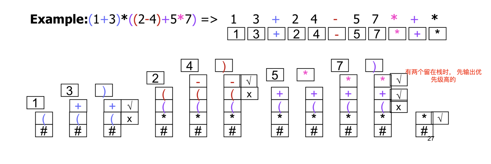

# CS 3334

---------

## Lec 02 Linked List

---------

* Linked list

  * Count

    ```cpp
    int List::Count(){
    	int ans = 0;
        for(Node* i = first;i!=NULL;i = i -> next,ans++);
        return ans;
    }
    ```

  * Print

    ```cpp
    int List::print(){
    	for(Node* i=first;i!=NULL;i = i->next)
    		cout << i->val << " ";
        cout << endl;
    }
    ```

  * Search 

    ```cpp
    Node* List::Search(int data){
        Node* i;
    	for(i = first;i!=NULL&&i->val!=data;i = i->next);
        return i;
    }
    ```

  * Insert

    * consider special case of empty list
    * Case1: add in front of the list : 

    ```c++
    newnode->next = first;
    first = newnode
    ```

    * Case2: Insert in the middle

    ```c++
    newnode->next = p->next;
    p->next = newnode;
    ```

    * Case3: Insert at the end

    ```cpp
    // same as the case 3 => reuse the code
    ```
    

    ```cpp
    void List::insert(Node* nd){
        if(first==NULL) first = nd;
        else if(nd->val < first->val){
    		nd->next = first;
            first = nd;
        }
        else {
            Node* it;
         	for(it=first;it->next!=NULL&&it->next->val < nd->val;it=it->next);
            nd->next = it->next;
            it->next = nd;
        }
    }
    ```

  * Remove

    * Search by value remove by reference
    * Cases : beginning/not beginning
      * Case1 : Remove at the beginning of the list
        * Current status : the node pointed by "first" is unwanted ```first=first->next``` 
        * ```q=first;first=q->next;delete q;```
      * Case 2 : Remove a node not at the beginning of the list
        * ```p->next = q->next; delete q;```

    ```cpp
    void List::remove(Node* nd){
        Node* tmp;
        if(nd==first){
    		tmp = first;
            first = first->next;
            delete tmp;
        }
        else {
            Node* it;
            for(it = first;it->next!=NULL&&it->next!=nd;it=it->next);
            tmp = it->next;
            it->next = it->next->next;
            delete tmp;
        }
    }
    ```

* Dummy Header Node

  * In order to remove the empty case
  * put a negative (impossible) value in the dummy header

* Double-linked list

  * add a Link to the pre node for every node
  * insert after an exiting node
  * delete a node

  ```cpp
  void DLL::insert(Node* p,Node* nd){
      nd->pre = p;
      nd->next = p->next;
      if(p->next!=NULL) p->next->pre = nd;
      p->next = nd;
  }
  void DLL::remove(Node* nd){
      if(nd->next!=NULL) nd->next->pre = nd->pre;
      if(nd->pre!=NULL) nd->pre->next = nd->next;
  }
  ```

* Analysis

  * Advantage:
    * efficient use the memory
    * Easy manipulation (merge 2 lists, break 1 lists into 2,delete or insert an item)
    * Variations (变化): 
      * Variable(可变化) number of variable-size lists, multi-direction lists
    * Simple sequential operations
  * Disadvantage : random access time *O(n)* , take up additional memory space

---------

## Lec 03 Program Complexities

---------

* Algorithm : A sequence of elementary computational steps that transform the input to the output
* Correctness of Algorithm (for every input instance, it halts with the correct output) => loop invariant
  * Intialization: It is true prior to the first iteration of the loop 
  * Maintenance:  If it is true before an iteration, it remains true before the next iteration 
  * Termination:  When the loop terminates, the invariant gives a useful property that helps to show the algorithm is correct 
* Running time of Insertion Sort

```c++
for(int i=1;i<n;i++){		// n times (last one check add 1)
	key = A[i];				// n-1
	int j;
	for(j = i-1;j>=0&&A[j]>key;j--) A[j+1] = A[j];
	A[j+1] = key;
}
```

* Kind of Analysis

  * Worst case : Usually used => guarantee about the upper bound
  * Average case : Sometimes => Often as bad as worst case
  * Best case : rarely => to prove the algorithm is **bad** (bad lower bound)

* Asymptotic Notation

  * For all f(n) in $\Theta (n^4)$ , the shape of curve is similar

    * O - notation ("Big-oh") $\approx$ <= (upper bound)

    $$
    O(g(n))=\{f(n):\exists (c\ and\ n_0)\ s.t.\ 0 \leq f(n) \leq cg(n)for\ \forall n \geq n_0\}
    $$

    * $\Omega$ - notation ("Big-omega") $\approx$ >= (lower bound)

    $$
    \Omega(g(n))=\{f(n):\exists (c\ and\ n_0)\ s.t.\ 0 \leq cg(n) \leq f(n) for\ \forall n \geq n_0\}
    $$

    * $\Theta$ - notation ("theta") $\approx$ (sandwich)

  * $$
    \Theta(g(n))=\{f(n):\exists (c_1,\ c_2\ and\ n_0)\ s.t.\ 0 \leq c_1g(n) \leq f(n) \leq c_2g(n) for\ \forall n \geq n_0\}
    $$

    * We don't use symbol of $\Theta$, we use *O* (for some historical reasons)

      * o (little o) o means better

      * o(g(n)) must be slightly bigger (whater ever constant equals what)

      * 最优的可能 is g(n)
        $$
        logn<sqrt(n)<n<nlogn<n2 <n4 <2n <n!
        $$

  * When calculating asymptotic running time

    - Drop low-order terms
    - Ignore leading constants 
    - because O is sandwich (but can't use o)

  * In general

    * For each For-loop (O*=n)

    * If else $max(O(statement1),O(statement2))$

    * the conditional statement => the condition complexity + **statement in the if condition**

      ```c++
      if(n>10)
          // O(n)
          for(i=0;i<n/2;i++)
          	x++;
      else{
          // total situation <=50
          for(i=0;i<n;i++)
          	for(j=0;j<n/2;j++)
          		x--;
      }
      // O(n) in total
      // supose IsSignificantData() is O(n)
      // suppose SpecialTreatment() is O(nlogn)
      for(int i=0;i<n;i++){	// n here
          if(IsSignificantData(i))
              SpecialTreatment(i);	// max(n,nlogn)
          // n^2logn in total
      }
      ```

--------

## Tutorial 3

* Suppose we have a pointer to a node in a singly linked list that is guaranteed not to be the last  node in the list. We do not have pointers to any other nodes (except by following links). We also  do not know “first”. Describe an algorithm that logically removes the value stored in such a node  from the linked list, maintaining the correctness of the linked list

  ```C++
  p->val = p->next->val;
  Node* pn = p->next;
  p->next = pn->next;
  delete pn;
  ```

* In singly linked list, write a member function Swap(ListNode* p ListNode* q) which swaps the  order of the adjacent two nodes pointed by p and q (satisfying p->next==q). You can only change  the links （**not data**）in your implementation and the pointer “first” is known.

  ```C++
  
  p->next = q->next;
  q->next = p;
  if(p!=first){
  	Node* pF = findFront(p);
  	pF->next = q;
  }
  else{
      first = q;
  }
  
  // findFront function
  Node* ans = first;
  while(ans->next!=p) ans = ans->next;
  return ans;
  ```

* small o
  $$
  f(n)=o(g(n)) \iff lim_{n->infinity} {f(n)\over g(n)} = 0
  $$

* Coin flipping

  * change the order of fliping row or column will not effect the answer
  * move all column flipping to the front
  * list all the column flipping
  * greedy to the row

* Tower of Hanoi

  * Use fewest steps to move all disks from the source rod to the target without violating the rules through the whole process (given one intermediate rod for buffering)? 

    * Move first n-1 two the second 

    * Move the last to the third

    * Move the n-1 to the third

    * move n-1 twice, and last one on
      $$
      a[N]=a[N-1]*2+1
      $$


```cpp

void Towers (int n, int Source, int Target, int Interm) { 
  if(n==1)
	cout<<“From”<<Source<<“To”<<Target<<endl; 
  else
  { 
    Towers(n-1, Source, Interm, Target);
	Towers(1, Source, Target, Interm);
	Towers(n-1, Interm, Target, Source); 
  }
}
```


​    

## Stack

------

* Use Dynamic Array
  * maintain capacity of data[]

  * double ```capacity``` when ```size=capacity```

  * Half capacity when ``size<=capacity/4``

  * E.g., initial cap is 4; I, I, I, I, I (expand; cap=8, size=5), D (shrink; cap=4, size=4), I (expand; cap=8, size=5), D (shrink; cap=4, size=4), I (expand), D (shrink), .... (避免临界时的重复操作)

    ```cpp
    template <typename Item>
    void Stack::realloc(int newCap){
    	if(newCap<size)return;
        Item* oldarray = data;
        data = new Item[newCap];
        
        for(int i=0;i<size;i++)
        	data[i] = oldarray[i];
        cap = newCap;
        delete[]oldarray;
    }
    void Stack::push(Item x){
    	if(size==cap) realloc(2*cap);
    	array[size++]=x;
    }
    void Stack::pop(){
    	if(size==0){
    		// handle
    	}
    	else{
    		size--;
    		if(size<=cap/4)
    			realloc(cap/2);
    	}
    }
    ```

* Linked Implementation => without isFull() and maxsize field

  * Insert=>no tricky conditions

    ```cpp
    template<typename Item>
    private : 
    	Node* top;
    	struct Node{
        	Item val;
            Node* next;
    	};
    public : 
    void push(Item new_item){
    	Node* p;
        p->val = new_item;
        p->next = top;
        top = p;
    }
    Item pop(){
    	Node* p = top;
        Item ans = p->val;
        top = top->next;
        delete p;
        return s;
    }
    ```

* Applications

  * Generating(or solve) a maze => use DFS

    * start from the entrance cell
    * Randomly select a neighbor cell which doesn't reached, break the wall(union) and record the cell, then push it to the stack
    * If all the neighbors are already visited, then go back by popping cells from the stack
    * until the exit is reached

  * Balancing symbols => syntax checker

  * Postfix expression => （逆波兰表示法）

  * Covert infix expression to postfix expression

    * push the operator to the stack

    * if the operator is ')' , means there is a '(' somewhere before it => pop the operators util meet ')'

      

  * Identify the boundary of lines (visible part when look from somewhere)

    * Sort by the slope of the lines, and start with the smallest (or biggest one)
    * push the lines into the stack
    * when there are 2 or more lines in the stack already, pop 2 lines, calculate their intersection and compare with the incoming line
      * Above => push the 3 lines according to the order
      * Below => throw away the second line and pop another line to compare, util the intersection is above or there are only 1 lines left

-------------

## Queue

------

* Full => 1 empty entry

  ```cpp
  bool Queue::full(){
      return ((rear+1)%TOTAL_SLOTS==front);
  }
  ```

* Linked list implementation

  * Insert : 2 cases => empty/not empty
  * delete : 3 cases => 0 item/1 item/more than 1

  ```cpp
  void Queue::push(Item item){
  	Node* nd;
      nd->val = item;
      if(empty()) front = nd;
      else rear->next = nd;
      rear = nd;	// work for any case
  }
  void Queue::pop(){
  	if(!empty()){
  		Node* p = front;
          front = front->next;
          if(front==NULL) rear = NULL; // 2nd case
          delete p;
      }
  }
  ```

* Application:

  * Reversing a stack(just 1 stack=>inplace reverse)
  * phenomena on the computer (queue for current jobs)

* Priority Queue

  * Elements in the FIFO queue are ordered based on the sequence in which they have been Inserted
  * In a priority queue, the sequence in which elements are removed is based on the priority of the elements
  * Implement 1 : as an ordered list
    * Insertion : find the location to insert :O(n), Link the element at the found location : O(1)
    * Deletion : remove the first element O(1)
  * Implement 2 : as an unordered list
    * Insertion : O(1) at the end
    * Deletion : Traverse the entire list to find the maximum priority element

----------

## Hash

-----------

* Advantage of basic hash table
  * Quickly store sparse key-based data in a reasonable amount of space
  * Quickly determine if a certain key is within the table

* Collisions : Two players mapped to the same cell

  * change the table
  * hash functions

* Hash function

  * good : Fast computation, minimize collision
  * kinds of hash functions
    * Division:Slot_id = Key%table_size
    * Others: eg., Slot_id = (Key^2+Key+41)%table_size
    * table_size should better be a **prime number**
  * Combination of Hash Functions
    * Collision is easy to happen if use % function
    * Use a function h1 to get a middle key, use another one h2 to get the final key
    * e.g. h2(x) = x%10, h1(x) = x%101 => h(x) = h2(h1(x))

* Collision resolution -- open addressing => general rule is if collide try other slots 1 by 1

  - Linear probing : if collide, try Slot_id+1, Slot_id+2

    ```cpp
    while(arr[id]!=NULL&&arr[id]!=value)id++;
    ```

  - Quadratic probing : if collide, try Slot_id+1^2, Slot_id+2^2 (can fill half of the array)

    - If quadratic probing is used and the table size is prime, the a new element can always be inserted if the table is at least half empty

    ```cpp
    int i = 1;
    while(arr[id]!=NULL&&arr[id]!=value){
        id+=i*i;
        i++;
    }
    ```

  - Double hashing: if collide, try Slot_id+h2(x), Slot_id+2*h2(x)

    - If double hashing is used and the table size is prime then a new element can always be inserted if the table is not full (when the hash_id%table_size != 0)

    ```cpp
    int i = 1;
    while(arr[id]!=NULL&&arr[id]!=value){
        id+=i*h(x);
        i++;
    }
    ```

* Collision resolution -- separate chaining => use linked list

  * Every slot in the hash table is a linked list
  * collision -> insert into the corresponding list
  * Find data -> Search the corresponding list

* Rehashing

  * Too many elements in the table => too many collisions when inserting
  * $Load\ factor={number\ of\ slots\ occupied \over total\ slots} $ 
  * When full, rehash all the elements into a double-size table
  * Only O(n) cost incurred for a hash table of size n
  * you need to keep the size of table a prime number (find prime number most close to 2*n)

* Application : dictionary

  * First, use hash function to hash string to a number

    ```cpp
    int getKey(char* str){
    	int ans = 0;
        for(int i=0;str[i];i++){
            ans = str[i]+37*ans;
        }
        return ans;
    }
    ```

  * use key%table_size as id, and do the probing

-----------------------------

## Tree

-----------------------

* Definition : recursive definition 

  * Tree is defined a finite set T of one or more nodes such that
    * there is one specially designed node called the root of the tree
    * the remaining nodes are partitioned into m>0 disjoint sets T1, T2 ... Tm are called subtrees of the root
* Terms
  * degree : number of subtrees
  * Terminal node or leaf : A node of degree 0
  * Branch node or internal node : not leaf
  * parent and sibling:
    * root is said to be the parent of the roots of its subtrees
    * the child connected to the same root said to be siblings
  * A path from $n_1$ to $n_k$ : A sequence of nodes n1,n2,...,nk such taht ni is the parent of ni+1 (length = number of edges=#node-1)
  * Ancestor and Descendant : If there is a path from n1 to nk, then n1 is the ancestor of nk, nk is the descendant of n1
  * level or depth of node : The length of the unique path from root to this node
  * Height : the max level of any leaf in the tree
* Binary tree : a finite set of nodes that either
  * empty (tree must have at least 1 node)
  * consist of a root and elements of 2 disjoint binary trees called the right and left subtree
  * The order of left tree and right tree is important
  * $max\ level\ nodes\#=2^{level}$ , $max\ nodes\#=2^{level+1}-1$ 
* Complete binary tree : all level are filled except the last level
* Implementation: array
  * left child : 2\*id+1, right child: 2\*id+2, parent = (id-1)/2
  * unused array elements must be initialized as NULL
  * analysis
    * simpler , save storage for trees known to be complete tree
    * waste of space when tree not filled, maximum size must be fixed, insertion and deletion of nodes from the middle of a tree require the movement of many nodes
* Implementation : Linked list
  * 
