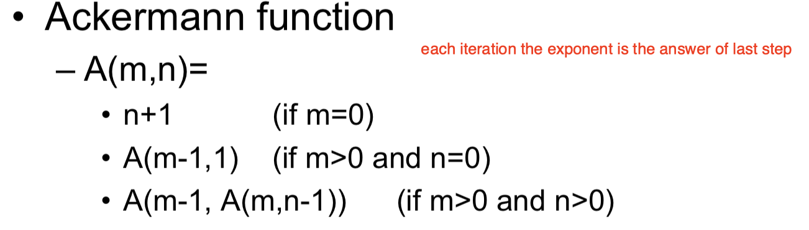

# CS 3334

---------

## Lec 02 Linked List

---------

* Definition of ADT(abstract data type)

  * package of the declarations of a data type and the operations that are meaningful to it

  * we can encapsulate the data type and the operations and hide them from user

  * Implemented independent

  * component:

    * Definition of values

      * definition
      * condition(optional)

    * Definition of operations

      * header
      * precondition(optional)
      * postcondition

      

* Data abstraction: An important method in program design

  * a step between the rough algorithm and implementation detail
  * just need to figure out feature of the ADT

* List

  * Implementation: 
    * arrays: statically allocated or dynamically allocated
    * Linked lists: dynamically allocated
  * Property: sorted or not sorted

* Linked list

  * Count

    ```cpp
    int List::Count(){
    	int size = 0;
        for(Node* i = first;i!=NULL;i = i -> next,size++);
        return size;
    }
    ```

  * Print

    ```cpp
    int List::print(){
    	for(Node* i=first;i!=NULL;i = i->next)
    		cout << i->val << " ";
        cout << endl;
    }
    ```

  * Search 

    ```cpp
    Node* List::Search(int data){
        Node* i;
    	for(i = first;i!=NULL&&i->val!=data;i = i->next);
        return i;
    }
    ```

  * Insert

    * consider special case of empty list
    * Case1: add in front of the list : 

    ```c++
    newnode->next = first;
    first = newnode
    ```

    * Case2: Insert in the middle

    ```c++
    newnode->next = p->next;
    p->next = newnode;
    ```

    * Case3: Insert at the end

    ```cpp
    // same as the case 2 => reuse the code
    ```
    

    ```cpp
    void List::insert(Node* nd){
        if(first==NULL) first = nd;
        else if(nd->val < first->val){
    		nd->next = first;
            first = nd;
        }
        else {
            Node* it;
         	for(it=first;it->next!=NULL&&it->next->val < nd->val;it=it->next);
            nd->next = it->next;
            it->next = nd;
        }
    }
    ```

  * Remove

    * Search by value remove by reference
    * Cases : beginning/not beginning
      * Case1 : Remove at the beginning of the list
        * Current status : the node pointed by "first" is unwanted ```first=first->next``` 
        * ```q=first;first=q->next;delete q;```
      * Case 2 : Remove a node not at the beginning of the list
        * ```p->next = q->next; delete q;```

    ```cpp
    void List::remove(Node* nd){
        Node* tmp;
        if(nd==first){
    		tmp = first;
            first = first->next;
        }
        else {
            Node* it;
            for(it = first;it->next!=NULL&&it->next!=nd;it=it->next);
            tmp = it->next;
            it->next = nd->next;
        }
        delete tmp;
    }
    ```

* **Dummy Header Node**

  * In order to remove the empty case and insert/remove in the front of list
  * put a negative (impossible) value in the dummy header
  * just remove the first 2 condition of insert and delete

* Circular lists:

  * add one pointer at the end of the list to the first node
  * use dummy header also simplify the coding

* Double-linked list

  * add a Link to the pre node for every node
  * insert after an exiting node
  * delete a node

  ```cpp
  void DLL::insert(Node* p,Node* nd){
      nd->pre = p;
      nd->next = p->next;
      // the judegement is important!!
      if(p->next!=NULL) p->next->pre = nd;
      p->next = nd;
  }
  void DLL::remove(Node* nd){
      if(nd->next!=NULL) nd->next->pre = nd->pre;
      if(nd->pre!=NULL) nd->pre->next = nd->next;
  }
  ```

* Analysis

  * Advantage:
    * efficient use the memory
    * Easy manipulation (merge 2 lists, break 1 lists into 2,delete or insert an item)
    * Variations (变化): 
      * Variable(可变化) number of variable-size lists, multi-direction lists
    * Simple sequential operations
  * Disadvantage : random access time *O(n)* , take up additional memory space

* Applications: Representing Convex Polygons

  * polygon: a closed plane figure with n sides
  * each nodes represents an edge of the covex polygons
  * if the convex is cut into 2 pieces, just break the list and add new node

---------

## Lec 03 Program Complexities

---------

* Algorithm : A sequence of elementary computational steps that transform the input to the output
  * a tool for solving well-specified computational problems
* Correctness of Algorithm (for every input instance, it halts with the correct output) => **loop invariant**
  * Intialization: It is true prior to the first iteration of the loop 
  * Maintenance:  If it is true before an iteration, it remains true before the next iteration 
  * Termination:  When the loop terminates, the invariant gives a useful property that helps to show the algorithm is correct 
* Running time of Insertion Sort

```c++
for(int i=1;i<n;i++){		// n times (last one check add 1)
	key = A[i];				// n-1
	int j;
	for(j = i-1;j>=0&&A[j]>key;j--) A[j+1] = A[j];
	A[j+1] = key;
}
```

* Kind of Analysis

  * Worst case : Usually used => guarantee about the upper bound
  * Average case : Sometimes => **Often as bad as worst case**
  * Best case : rarely => to prove the algorithm is **bad** (bad lower bound)
    * We cannot decide which program is better simply by looking at the best case running time, we need worst case running time to do the comparison 

* Asymptotic Notation

  * For all f(n) in $\Theta (n^4)​$ , the shape of curve is similar

    * O - notation ("Big-oh") $\approx$ <= (inside the parenthesis is upper bound)

    $$
    O(g(n))=\{f(n):\exists (c\ ,\ n_0)\ s.t.\ 0 \leq f(n) \leq cg(n)for\ \forall n \geq n_0\}
    $$

    * $\Omega$ - notation ("Big-omega") $\approx$ >= (lower bound)

    $$
    \Omega(g(n))=\{f(n):\exists (c\ ,\ n_0)\ s.t.\ 0 \leq cg(n) \leq f(n) for\ \forall n \geq n_0\}
    $$

    * $\Theta$ - notation ("theta") $\approx$ (sandwich)

  * $$
    \Theta(g(n))=\{f(n):\exists (c_1,\ c_2\ ,\ n_0)\ s.t.\ 0 \leq c_1g(n) \leq f(n) \leq c_2g(n)\ for\ \forall n \geq n_0\}
    $$

    * We don't use symbol of $\Theta$, we use *O* (for some historical reasons)

      * o (little o) o means better

      * o(g(n)) must be slightly bigger (whater ever constant equals what)

      * why need small o()?

        * To compare which algorithm is better
        * n = o(nlogn) => if a algorithm A has running time O(n), Algorithm B has running time O(nlogn), then we can say A is better than B

      * Difference between o and $\Theta$ 

        * if f(n) = $\Theta​$(g(n)) , then we can find a positive number c so that the value of g(n) will never exceed cf(n) , and another positive number d so that the value of g(n) will never less than df(n)

        * If f(n) = o(g(n)), then we cannot find c that cf(n) is larget than g(n)

        * small o
          $$
          f(n)=o(g(n)) \iff lim_{n->infinity} {f(n)\over g(n)} = 0
          $$

      * 最优的可能 is g(n)
        $$
        logn<sqrt(n)<n<nlogn<n^2 <n^4 <2^n <n!
        $$

  * When calculating asymptotic running time

    - Drop low-order terms
    - Ignore leading constants 
    - because O is sandwich (but can't use o)

  * In general

    * For each For-loop (O*=n)

    * If else $max(O(statement1),O(statement2))$

    * the conditional statement => the condition complexity + **statement in the if condition**

    * Recursion: 

      * T(n) = 2T(n-1)+1 => 2^n

      

      ```c++
      // notice the program
      if(n>10)
          // O(n)
          for(i=0;i < n/2;i++)
          	x++;
      else{
          // total situation <=50
          for(i=0;i<n;i++)
          	for(j=0;j<n/2;j++)
          		x--;
      }
      // O(n) in total
      
      // supose IsSignificantData() is O(n)
      // suppose SpecialTreatment() is O(nlogn)
      for(int i=0;i<n;i++){	// n here
          if(IsSignificantData(i))
              SpecialTreatment(i);	// max(n,nlogn)
          // n^2logn in total
      }
      ```

--------

## Tutorial 3

* Suppose we have a pointer to a node in a singly linked list that is guaranteed not to be the last  node in the list. We do not have pointers to any other nodes (except by following links). We also  do not know “first”. Describe an algorithm that logically removes the value stored in such a node  from the linked list, maintaining the correctness of the linked list

  ```C++
  p->val = p->next->val;
  Node* pn = p->next;
  p->next = pn->next;
  delete pn;
  ```

* In singly linked list, write a member function Swap(ListNode* p ListNode* q) which swaps the  order of the adjacent two nodes pointed by p and q (satisfying p->next==q). You can only change  the links （**not data**）in your implementation and the pointer “first” is known.

  ```C++
  
  p->next = q->next;
  q->next = p;
  if(p!=first){
  	Node* pF = findFront(p);
  	pF->next = q;
  }
  else{
      first = q;
  }
  
  // findFront function
  Node* ans = first;
  while(ans->next!=p) ans = ans->next;
  return ans;
  ```

* Coin flipping
  * change the order of fliping row or column will not effect the answer
  * move all column flipping to the front
  * list all the column flipping
  * greedy to the row

* Tower of Hanoi

  * Use fewest steps to move all disks from the source rod to the target without violating the rules through the whole process (given one intermediate rod for buffering)? 

    * Move first n-1 two the second 

    * Move the last to the third

    * Move the n-1 to the third

    * move n-1 twice, and last one on
      $$
      a[N]=a[N-1]*2+1
      $$


```cpp

void Towers (int n, int Source, int Target, int Interm) { 
  if(n==1)
	cout<<“From”<<Source<<“To”<<Target<<endl; 
  else
  { 
    Towers(n-1, Source, Interm, Target);
	Towers(1, Source, Target, Interm);
	Towers(n-1, Interm, Target, Source); 
  }
}
```


​    

## Lec 03 Stack

------

* Definition of Stack: A list with the restriction that insertions and deletions can only be performed at **one end** of the list

* notice check whether **full** before insertion, whether **empty** before deletion

* Use Dynamic Array

  * maintain capacity of data[]

  * double ```capacity``` when ```size=capacity```

  * Half capacity when ``size<=capacity/4``

  * E.g., initial cap is 4; I, I, I, I, I (expand; cap=8, size=5), D (shrink; cap=4, size=4), I (expand; cap=8, size=5), D (shrink; cap=4, size=4), I (expand), D (shrink), .... (避免临界时的重复操作)

    ```cpp
    template <typename Item>
    void Stack::realloc(int newCap){
    	if(newCap<size)return;
        Item* oldarray = data;
        data = new Item[newCap];
        
        for(int i=0;i<size;i++)
        	data[i] = oldarray[i];
        cap = newCap;
        delete[]oldarray;
    }
    void Stack::push(Item x){
    	if(size==cap) realloc(2*cap);
    	array[size++]=x;
    }
    void Stack::pop(){
    	if(size==0){
    		// handle
    	}
    	else{
    		size--;
    		if(size<=cap/4)
    			realloc(cap/2);
    	}
    }
    ```

* Linked Implementation => without isFull() and maxsize field

  * Insert=>no tricky conditions

    ```cpp
    template<typename Item>
    private : 
    	Node* top=NULL;
    	struct Node{
        	Item val;
            Node* next;
    	};
    public : 
    void push(Item new_item){
    	Node* p = new Node();
        p->val = new_item;
        p->next = top;
        top = p;
    }
    Item pop(){
    	Node* p = top;
        Item ans = p->val;
        top = top->next;
        delete p;
        return ans;
    }
    ```

* Applications

  * Generating(or solve) a maze => use DFS

    * start from the entrance cell
    * Randomly select a neighbor cell which doesn't reached, break the wall(union) and record the cell, then push it to the stack
    * If all the neighbors are already visited, then go back by popping cells from the stack
    * until the exit is reached

  * Balancing symbols = > syntax checker

  * Postfix expression => （逆波兰表示法）

  * Covert infix expression to postfix expression

    * push the operator to the stack

    * if the operator is ')' , means there is a '(' somewhere before it => pop the operators util meet '('

    * if there are more than one operators between "()", sort by priority

      

  * Identify the boundary of lines (visible part when look from somewhere)

    * Sort by the slope of the lines, and start with the smallest (or biggest one)
    * push the lines into the stack
    * when there are 2 or more lines in the stack already, pop 2 lines, calculate their intersection and compare with the incoming line
      * Above => push the 3 lines according to the order
      * Below => throw away the second line and pop another line to compare, until the intersection is above or there are only 2 lines left

* Notice: when use stack ADT, we should not access data from outside

-------------

## Lec 04 Queue

------

* Definition of Queue:

  * **Insertions are performed at one end** and **deletions are performed at the other end** (FIFO)

  ```cpp
  void enqueue(Item t){
      items[tail]=t;
      tail = (tail+1)%TOTAL_SLOTS;
  }
  Item dequeue(){
      if(!isEmpty()) return NULL;
  	Item ans = items[head];
      head = (head+1)%TOTAL_SLOTS;
      return ans;
  }
  bool isEmpty(){return head==tail;}
  bool isFull(){return (tail+1)%TOTAL_SLOTS==head;}
  ```

* Linked list implementation

  * Insert : 2 cases => empty/not empty
  * delete : 3 cases => 0 item/1 item/more than 1

  ```cpp
  void Queue::push(Item item){
  	Node* nd;
      nd->val = item;
      if(empty()) front = nd;
      else rear->next = nd;
      rear = nd;	// work for any case
      size++;
  }
  void Queue::pop(){
  	if(!empty()){
  		Node* p = front;
          front = front->next;
          if(front==NULL) rear = NULL; // 2nd case important!!
          delete p;
          size--;
      }
  }
  ```

* Application:

  * Reversing a stack(just 1 stack=>inplace reverse)
  * phenomena on the computer (queue for current jobs)

* Priority Queue

  * Elements in the FIFO queue are ordered based on the sequence in which they have been Inserted
  * In a priority queue, the sequence in which elements are removed is based on the priority of the elements
  * Implement 1 : as an ordered list
    * Insertion : find the location to insert :O(n), Link the element at the found location : O(1)
    * Deletion : remove the first element O(1)
  * Implement 2 : as an unordered list
    * Insertion : O(1) at the end
    * Deletion : Traverse the entire list to find the maximum priority element

----------

## Lec 05 Hash

-----------

* Advantage of basic hash table
  * **Quickly** store sparse key-based data in a **reasonable amount of space**
  * Quickly determine if a certain key is within the table

* Collisions : Two players mapped to the same cell

  * change the table
  * hash functions

* Hash function

  * good : Fast computation, minimize collision
  * kinds of hash functions
    * Division:Slot_id = Key%table_size
    * Others: eg., $Slot_id = (Key^2+Key+41)%table_size$
    * table_size should better be a **prime number**
  * Combination of Hash Functions
    * Collision is easy to happen if use % function
    * Use a function h1 to get a middle key, use another one h2 to get the final key
    * e.g. h2(x) = x%10, h1(x) = x%101 => h(x) = h2(h1(x))

* Collision resolution -- open addressing => general rule is if collide try other slots 1 by 1

  - Linear probing : if collide, try Slot_id+1, Slot_id+2

    ```cpp
    while(arr[id]!=NULL&&arr[id]!=value)id++;
    ```

  - Quadratic probing : if collide, try Slot_id+1^2, Slot_id+2^2 (can fill half of the array)

    - If quadratic probing is used and the table size is prime, the a new element can always be inserted if the table is at least half empty

    ```cpp
    int i = 1;
    while(arr[id]!=NULL&&arr[id]!=value){
        id+=i*i;
        i++;
    }
    ```

  - Double hashing: if collide, try Slot_id+h2(x), Slot_id+2*h2(x)

    - If double hashing is used and the table size is prime then a new element can always be inserted if the table is not full (when the hash_id%table_size != 0)

    ```cpp
    int i = 1;
    while(arr[id]!=NULL&&arr[id]!=value){
        id+=i*h(x);
        i++;
    }
    ```

* Collision resolution -- separate chaining => use linked list

  * Every slot in the hash table is a linked list
  * collision -> insert into the corresponding list
  * Find data -> Search the corresponding list

* Rehashing

  * Too many elements in the table => too many collisions when inserting
  * $Load\ factor={number\ of\ slots\ occupied \over total\ slots} $ 
  * When **half full**, rehash all the elements into a double-size table
  * Only O(n) cost incurred for a hash table of size n
  * you need to keep the size of table a prime number (find prime number most close to 2*n)

* Application : dictionary

  * First, use hash function to hash string to a number

    ```cpp
    int getKey(char* str){
    	int ans = 0;
        for(int i=0;str[i];i++){
            ans = str[i]+37*ans;
        }
        return ans%table_size;
    }
    ```

  * use key%table_size as id, and do the probing

-----------------------------

## Lec 06 Tree

-----------------------

* Definition : recursive definition 

  * Tree is defined a finite set T of one or more nodes such that
    * there is one specially designed node called the root of the tree
    * the remaining nodes are partitioned into m>0 disjoint sets T1, T2 ... Tm are called subtrees of the root

* Terms
  * degree : number of subtrees
  * Terminal node or leaf : A node of degree 0
  * Branch node or internal node : not leaf
  * parent and sibling:
    * root is said to be the parent of the roots of its subtrees
    * the child connected to the same root said to be siblings
  * A path from $n_1$ to $n_k$ : A sequence of nodes n1,n2,...,nk such that ni is the parent of ni+1 (length = number of edges=#node-1)
  * Ancestor and Descendant : If there is a path from n1 to nk, then n1 is the ancestor of nk, nk is the descendant of n1
  * level or depth of node : The length of the unique path from root to this node
  * Height : the max level of any leaf in the tree

* Binary tree : a finite set of nodes that either(difference with tree)
  * empty(but a **tree** must have at least 1 node)
  * consist of a root and elements of 2 disjoint binary trees called the right and left subtree
  * The **order of left tree and right tree is important**

* Full Binary Tree: all levels are filled

  * $max\ level\ nodes\#=2^{level}$ , $max\ nodes\#=2^{level+1}-1$ 

* Complete binary tree : all levels are filled except the last level

  * each nodes correspond to a node in the full binary tree
  * each leaf in a tree is either at level $k$ or level $k-1$ 
  * each node has exactly 2 subtrees at level $0$ to level $k-2$ 

* Implementation: array
  * left child : 2\*id+1, right child: 2\*id+2, parent = (id-1)/2
  * odd number represents left child, even number represents right child
  * **unused array elements must be initialized differently** , thus a random array may not be able to  represent a binary tree, since if the parent of some slots with content is NULL the tree do not exist
    * put special value in the location
    * add a "used" field(true/false) to each node
  * analysis
    * simpler , save storage for trees known to be almost full
    * waste of space when tree not filled, insertion and deletion of nodes from the middle of a tree require the movement of many nodes
    * fixed size of tree

* Binary search tree:

  * each node of the tree contains a number, the number of each node is
    * bigger than the numbers in the left subtree
    * Smaller than the numbers in the right subtree
  * Application: find all **duplicates** in a list of numbers
    - read number by number
    - each time compare the number with thge contents of T
    - if found duplicated, the output, otherwise add it to T
    - Traverse the tree from top to bottom
      - Case1: If node empty, add the new node
      - Case2: If the node content is the same as the number, output as duplicate
      - Case3: If the node is larger(smaller), goes right(left) subtree
      - End condition: case1,case2,or **going beyond the array** (output error)

* Implementation : Linked list

  * Reference: left,right,parent(omitted when there is only downwards traverse)

  * search

    ```cpp
    bool search(int key){
        Node* p = root;
        while(p->key!=key){
            if(p->key > key){
    			if(p->left==NULL)break;
            	p = p->left;
            }
            else{
                if(p->right==NULL)break;
            	p = p->right;
            }
        }
        if(p->key > key)
            p->left=new Node(key);
        else if(p->key < key)
            p->right=new Node(key);
        else return true;
        return false;
            
    }
    ```

  * Insert

    ```cpp
    void insert (int key){
      	root = insert(root,key)
    }
    private:
            Node* insert(Node* nd,int key){
                if(nd==null) return new Node(key);
                if(nd->val>key){
                    nd->left = insert(nd->left,key);
                else if(nd->val<key){
                    nd->right = insert(nd->right,key);
                return nd;
            }
    // or
            void insert(int key){
                Node* nd = root;
                while(nd->val!=key){
                    if(nd!=NULL){
                        if(nd->val>key)
                            nd = nd->left;
                        else if(nd->val<key)
                            nd = nd->right;
                    }
                    else{
                        nd = new Node(key);
                        break;
                    }
                }
            }
    ```

  * height： special case: only one node for a tree height is 1

    ```cpp
    int Node::height(){
        if(t==NULL) return 0;
        if(this->left==NULL&&this->right==NULL) return 0;
        return 1+max(this->left->height(),this->right->height());
        
    }
    ```

  * Count leaf

    ```cpp
    int Mytree::count_leaf(Node* nd){
        if(nd==NULL) return 0;
        if(nd->left==NULL&&nd->right==NULL) return 1;
        // else means itself is not leaf
        return count_leaf(nd->left)+count_leaf(nd->right);
    }
    ```

  * Equal

    ```cpp
    bool Node::equal(Node* nd){
        if(this==NULL&&nd==NULL) return true;
        if(this!=NULL&&nd==NULL||this==NULL&&nd!=NULL) return false;
        if(this->val==nd->val)
            return this->left->equal(nd->left)&&this->right->equal(nd->right);
        return false;
    }
    ```

* Traversing Binary Tree

  * Preorder : root->left all -> right all (first is root)

  * Inorder : left all -> root -> right all (according to the sorted order)

    * Non-recursive inorder traversal using stack:

      * start with an empty stack to store all branch nodes that have been reached but itself and its right child are not yet visited
      * Store the address of nodes and goes left until meet NULL
      * Pop and print the poped one, do it again by using the right child
      * Continue until the stack is empty

  * Postorder : left all -> right all -> root (reverse it => last one is root)

  * A binary tree can be determined by (preorder or postorder) and inorder

    * cannot determined by **preorder and postorder**

    ```cpp
    // pre + in => post
    void print(int lo,int hi){
        if(lo<hi){
            int root = pre[cnt++];
            print(lo,reci[root]);
            print(reci[root]+1,hi);
            cout << root << " ";
        }
    }
    // post + in => pre
    // post array is reversed
    void print(int lo,int hi){ // hi is not included
        if(lo<hi){
            int root = post[cnt++];
            print(reci[root]+1,hi);
            print(lo,reci[root]);
            s.push(root);
        }
    }
    ```

* Application : Representation of General Function expression

  ```cpp
  double Node::calc(){
      double a,b;
      char op;
      if(isDigit(this->val))
          return this->val;
      else{
          a = this->left->calc();
          b = this->right->calc();
          op = this->val;
          return compute(a,b,op);
      }
  }
  ```

* 2 Link representation of tree : left child and right sibling

  * equivalent to let each node hold a linked list of node* 

* Deletion of binary search tree

  * Case 1 : delete a **leaf node** => set the parent node's child pointer to NULL
  * Case 2 : delete **a node that has 1 subtree** => set the parent's child pointer to root of the subtree
  * Case 3 : delete a node that has 2 subtree => replace the node by the left biggest or right smallest node, delete the left biggest or right smallest node

  ```cpp
  void Mytree::delete(int key){
      root = delete(root,key)
  }
  Node* Mytree::delete(Node* p,int key){
      if(p==NULL) return NULL;
      if(p->val>key)
          p->left = delete(p->left,key);
      else if(p->val<key)
          p->right = delete(p->right,key);
      else{
          if(p->left!=NULL&&p->right!=NULL){
              Node* lf=leftMost(p->right);
              p->val = lf->val;
              lf=delete(lf,lf->val);
          }
          else if(p->left==NULL) p = p->right;
          else p = p->left;
      }
      return p;
  }
  ```

* Analysis : 

  * Worst running time for search : O(n) => linked list
  * Worst case running time for insertion : O(n) => linked list
  * Worst case running time for deletion : O(n/2) => the fish shape is the worst shape for deletion
  * Balanced BST is good

* B tree and B+ tree => bottom-up splitting (grow from leaf rather than root) => grow from bottom makes the tree more balanced: **not tested**

  * Each node is kept between *half-full* and *completely full* 
  * Insertion into a node that is not full is quite efficient, if a node is full the insertion causes a split into 2 nodes
  * Split may propagate to other tree levels
  * Similarly , a deletion may causes merged with neighbor nodes

* Difference between B tree and B+ tree : 

  * B tree : pointers to data records exist at all level of the tree
  * B+ tree : all pointers to data records exist at the leaf level nodes only => when split just keep the original value in the leaf and build a new node with some part of the information (i.e. just the key, no value exception leaf)

--------------

## Lec 07 Heaps and Game Trees

----------

### Heap

* Property : 

  * structure : A complete binary tree
    * Heap-order : 
      * Min-heap : the data in the root is smaller than the data in all the descendants of the root
      * Max-heap : the data in the root is bigget than the data in all the descendants of the root

* Insert : insert to the tail and swim

  ```cpp
  void Heap::insert(int key){
      heap[tail++] = key;
      int tmp;
      for(int pos=tail-1;pos&&heap[pos]>heap[(pos-1)/2];pos = (pos-1)/2){
  		tmp = heap[pos];
          heap[pos] = heap[(pos-1)/2];
          heap[(pos-1)/2] = tmp;
          //std::swap(heap[pos],heap[(pos-1)/2]);
      }
  }
  ```

* Delete : copy the last data to the root and sink

  ```cpp
  #define child(k,id) k*2+id
  public:
  void Heap::pop(){
      int ans = heap[0];
      heap[0] = heap[--tail];
      sink(0);
      return ans;
  }
  private:
  void Heap::sink(int k){
      if(child(p,1)<tail){
          int maxc = child(p,1);
          if(child(p,2)<tail){
          	maxc = (child(p,2)<=tail-1)&&heap[child(p,2)]>heap[maxc]?		                       child(p,2):maxc;
          }
          if(heap[maxc]>heap[p]){
              std::swap(heap[maxc],heap[p]);
              sink(maxc);
          }
      }
  }
  ```

* application of heap : piority queue => piority is the key

### Game Tree

* Properties of the game tree:

  * root is the initial game status
  * every node in the tree is a possible game status
  * every edge in the tree is possible move by the players
  * Any path from roo to leaf represents a possible game

* How to make decisions using the game tree

  * each leaf is associated with a value(advantages to player A), **bottom up evaluation** for internal nodes
    * assign each leaf of win as 1, lose as -1, tie as 0
    * counting leaf
  * player A always go to the child with **maximum value**
  * player B always go to the child with **minimum value** (make A lose)

* Max-Min principle

  * Player will choose according to the maximum of minimum of value in the 2 lower level(choose first path), because another player must choose the minimum value

    

* Reduce size of game tree: $\alpha-\beta$  pruning(修剪)

  *  $\alpha$ pruning(is it possible larger than 6, if impossible, just prune the case)

    

  * $\beta$ pruning is the symmetric case, this time second one choose, according to the min-max principle(is it possible less than 3?)

* Notice that duplicate nodes possible in the game tree


----------

## LEC 08 Balanced BST

--------

### AVL BST

* **Balancing Condition**: For each node v, the difference between the height of its left subtree and the height of its right subtree  is **less than 1**

* Insert

  * Insert to the right place first

  * recursively rotate the branch of the tree (rotate the lower level at first)

  * Rotate the **first unreasonable branch according to a down-top approach**

    

    

  ```cpp
  int h(Node* t){
  	return t==NULL ? 0 : t->height;
  }
  void insert (int key){
    	root = insert(root,key)
  }
  private:
          Node* insert(Node* nd,int key){
              if(nd==null) return new Node(key);
              if(key < nd->val){
                  nd->left = insert(nd->left,key);
                  // insert first then rotate
                  if(h(nd->left)>=h(nd->right)+2){
                      // insert inside or outside
                      if(key < nd->left->val) nd = rotateL(nd);
                  	else nd = dbl_rotateL(nd);
                  }
              }
              else if(nd->val<key){
                  nd->right = insert(nd->right,key);
                  if(h(nd->right)==h(nd->left)+2)
                      if(key > nd->rightt->val) nd=rotateR(nd);
                  	else nd=dbl_rotateR(nd);
              }
              else{//duplication => same node inserted twice
              	
              }
              //recalculate the height
              nd->height = max( h(nd->left), h(nd->right) ) + 1;
              return nd;
          }
  ```

* rotateL : replace current node by the left child of it

  * height will only increase when the left subtree is full
  * means put the left child of current node up to the current possition, and move the right child of left child(grandson) to the leftchild position of current node

  

  ```cpp
  Node* rotateL(Node* nd){
      Node* lnd = nd->left;
      nd->left = lnd->right;
      lnd->right = nd;
      //recalculate the height
      nd->height = max(h(nd->left),h(nd->right))+1;
      lnd->hegiht = max(h(lnd->left),h(lnd->right))+1;
      return lnd;
  }
  ```

* Dbl_rotateL: because there is a new nd inserted in the inner side of the tree, rotate right left of current nd and rotate left current node

  * means first rotateR left child, the rotateL new left child

  

  

  ```cpp
  Node* dbl_rotateL(Node* s)
  {
      s->left = rotateR(s->left);
      s = rotateL(s);
      return s;
  }
  ```

* rotateR

  ```cpp
  void rotateR(Node* s) //s & s->rson rotate (Case 4){
      Node* t=s->rson;
      s->rson=t->lson; 
  	t->lson=s;
  	//recalculate height
      s->height=max( h(s->lson), h(s->rson) )+1;
      t->height=max( h(t->rson), s->height )+1;
     	return t;
  }
  ```

* Complexity : Worst case time complexity of insert(t,x)

  * local work requires constant time c

  * at most 1 recursive call with tree height k-1 where $ k = height\ of\ subtree\ pointed\ by\ t$ 
    $$
    T(k) = T(k-1)+c \\
    = T(k-2)+2c \\
    = T(0) + kc \\
    = O(k) \\
    =O(h)\ (where\ h\ is\ the\ height\ of\ the\ tree)\\
    $$

  * #nodes of a height h tree $\geq\alpha^h-1$  can be proved where $\alpha={1+\sqrt5\over2}$ i.e. $\alpha^2=\alpha+1$ 
    $$
    Base\ case:1\geq\alpha^h-1(h=1)\\
    n=x+y+1 \geq (\alpha^{h-1}-1)+(\alpha^{h-2}-1)+1
    $$
    

  * Note that : h-2 comes from the definition of the AVL tree

* Delete : 

  * Normal deletion of BST
  * need to rebalance => ugly code and complicated

* Drawback

  * extra storage/complexity for height fields
  * ugly delete code => use splay tree

-----------------

### Splay Trees (not tested)

---------------

* Property

  - blind adjusting version of AVL trees(find process also do the rotate)
  - amortized time for all operations is O(log n) 
  - worst case time is O(n) 
  - ==insert/find always== rotates node to the root! 

* Cases:

  * Target : to swim the searched value(says n) to the root of the tree(along the path of searching) 

  * n is root => do nothing

  * n is child of Root => AVL single rotate (Zig)

    * left child => rotateLeft()
    * right child=>rotateRight()

  * n has both parent (p) and grandparent(g) 

    * Zig-Zag (AVL double rotation) : common pattern : Turn in middle thus the lowest one can be swam to the first level

      

    * Zig-Zig 

      

* Reason

  - If a node n ==on the access path== is at depth $d$ before the splay, it’s at about depth $d/2$ after the splay 
    - Exceptions are the root, the child of the root(sink down), and the node splayed (to the root)
  - Overall, nodes which are below nodes on the access path tend to move closer to the root 
  - Splaying gets amortized O(log n) performance. (Maybe not the current operation, but soon, and for the rest of the operations.)

* Find : Find the node in normal BST manner • Splay the node to the root

* Split : divide the tree by arbitrary key(may not be root or in the tree), divide it into 2 trees

  - We have the splay operation. 
  - We can  find **x** or the **parent of x**
  - We can splay it to the root. 
  - Now, what’s true about the left subtree of the root? – And the right

* Insert

  

* Join 2 splited tree

  - Find the right most node of the first tree, and then splay it as root, finaly set the right of the node to be the second tree

* Delete

  

* Complexity : $O(Mlog(N))$ , $O(N)$ can occur but splaying makes them infrequent

* Advantages

  * Can be done top-down : only one path and no recursion or parent pointers
  * Alternatives(备选方案) to split/insert and join/delete
  * Relatively simple and excellent **locality properties**(frequently accessed keys are cheap to find, infrequent keys stay near the bottom)

* Red-Black tree

  * A node is either red or black
  * The root is black
  * both children of every red node are black
  * Every simple path from a node to a descendant leaf contains the same number of black nodes 
  * Individual operation takes O(logn) 

-------------

## LEC 09 Graph

----------

* Definition
  * A graph G consists of: 
    * A non-empty set of vertices: V 
    * A set of edges: E 
    * E & V are related in a way that the vertices on both ends of an edge are members of V 
    * Usually written as G = (V, E) 
  * Degree of a vertex is the number of edges
    connecting to it
  * For directed graph, degree is further classified as in-degree (to this vertex) & out-degree (from this vertex)
  * Weight (in directed graph, the weights of edges going in opposite directions can be different)
  * Simple graph : **un-weighted, undirected graph** containing **no graph loops(cycle with single node) or multiple edges**
  * Complete graph : clique
    * n nodes with, $C_n^2$ edges

* Representation : Adjacency matrix and adjacentcy list
  * adjacency matrix
    * Use N*N 2-D array to represent the weight (or T/F) of one vertex to another
    * total $n^2$ only half used **for undirected graph** => waste
    * when the graph is sparse (few edges)
      * greate waste => many zero
      * **slow when query the lis of neighboring vertices**(O(N) instead of O(k), N is the number of all nodes, k is number of neighbors)
    * fast query on edge weight & connection(O(1))
  * adjacency list : **only remember neighbors** (use a list to store all adjacent nodes)
    * save memory if graph is sparse
    * query on edge weight/	connection can be slow
    * graph update is slow(especially if one have to maintain order of neighbors)
    * enumeration(枚举) of all neighbors is fast (O(k))
  * which to choose
    * **memory sufficient** and **update is in-frequent** => represent graph in both methods, different operation choose different structure
    * Link-list can be replaced by 1D array with count  (enumeration of neighbor and query on degree will be fast) 
    * For un-weighted adjacency matrix, you may consider other possibilities other than 0 & 1... 

* Graph searching

  * Goals
    * Determine whether connect: DFS
    * list out all members of connected component: BFS and DFS
    * find shortest path in unweighted graph: BFS

  * algorithms
    * DFS (depth first search)
    * BFS(breath first search)

* DFS(in tree DFS is preorder traversing)

  * using stack to store nodes

    * put the starting node into the stack
    * repeat checking the top

  * if top is unvisited => print the element

  * If top has unvisited neighbors => Push one of the neighbors on stack

  * If top has no unvisited neighbors=>Pop one element

  * do until stack empty

    ```cpp
    void dfs(int nd){
        if(visted[nd]) return;
        visited[nd] = 1;
        for(each vertex w adjacent to nd){
            cout<<arr[nd]<<" ";
            if(!visited[w])
            	dfs(w);
        }
    }
    ```

* BFS

  * Go as broad as you can
  * Using Queue to store nodes
    * put the starting node into the queue
    * repeat the following move
  * Remove
    * remove a node from the queue and print it
    * enqueue all of its neighbors to the queue

  ```cpp
  void bfs(int nd){
      if(visited[nd]) return;
      visted[nd] = 1;
      q.enqueue(nd);
      while(!q.empty()){
          int x= q.front();
          q.dequeue();
          cout<<arr[x]<<" ";
          for(each vertex w adjacent to x ){
              if(!visited[w]){
                  q.enqueue(w);
                  visited[w] = 1;
              }
          }
      }
  }
  ```

* Connectivity 

  * Use a search methods, add node one by one, check whether  the number of nodes equals to the record

* Shortest path

  * measuring water

    * You are given 2 empty containers having capacities of x, y liters respectively (1$\leq$x$\leq$y$\leq$100), and you need to use them to measure exactly z liter (0$\leq$z<100) of water. The supply of water is unlimited and can be pour into / out of the containers. However, the pouring action is restricted: 

      * When filling water in a container, the container must be fully filled. 
      * When pouring water out of a container, all the water must be poured out unless the destination container is full. 

    * Assume all containers are initially empty, write a program to count the minimum number of steps (fill/pour water) to get z Liters of water in any container. 

      Print “No Solution” if it is impossible to measure z Liters exactly. 

    * Node : states of volume of 2 bottoms (x<=y)

      * (0,0) =>{(x,0),(0,y)}
      * (x,0) => {(0,0),(0,x),(x,y)}
      * (0,y) => {(0,0),(x,y-x),(x,y)}
      * (x,y) => {(0,y),(x,0)}
      * ....

    * Edge : Operations

      * six possible : fill bucket 1 or 2, empty bucket 1 or 2, put water in bucket 1 to bucket 2 or 2 to 1

    * BFS, search until meet (z,0) or (0,z)

    * Or if traverse all the possibilities, output no solution

* Minimum Spanning Tree 

  * Spanning tree 
    * A tree substructure of a graph (covering every vertex) 
  * Every Edge has a weight
  * Find the minimum spanning tree 
    * Prim’s algorithm
    * Kruskal’s algorithm 

--------------------

## Lec 10 Disjoint Set

-------------

* Use disjoint set to generate a maze

  * end condition: start and end entry are connected

    ```cpp
    if(find(p)!=find(q))union(p,q);
    ```

* Equivalence Relations

  * A relation R is defined on a set S if for every pair of elements (a,b) => (a,b) is in S
  * Equivalence relation
    * reflexive
    * symmetric
    * Transitive
  * Equivalence relation divide a set into components, in each components,nodes are equivalent to each other
  * Equivalence classes
    * An equivalence class of an element *a* is the subset of all the elements that are equivalent to *a*
    * Equivalence classes are disjoint(不相交) 
    * number of equivalence classes = number of connected components

* Disjoint Set ADT

  * Value 
    * A set of items that belong to some data type ITEM_TYPE 
    * Each item is associated with an **equivalence class name** (has a label of which set it belongs to)
  * operation
    * Find(ITEM_TYPE `a`): return the **equivalence class name** of `a`
    * Union(ITEM_TYPE a, ITEM_TYPE b) : Combine a’s equivalence class with b’s equivalence class (make them the same name) 
      * Precondition (Suppose): Find(a)==Find(c), Find(b)\==Find(d) 
      * Postcondition: a,b,c,d are in the same equivalence class (their equivalence class name are the same.) 

* Array Implementation

  * every entry `rec[i]` stores the equivalence class name for `i` 

  * code

    ```cpp
    int find(int i){return rec[i];}
    
    void Union(int p,int q){
        //important to use temp!!!
        int temp = rec[q];
        if(find(p)!=find(q)){
        	for(int i=0;i<len;i++){
            	// change all rec[q]
            	if(rec[i]==temp){
    				rec[i] = rec[p];
            	}
        	}
        }
    }
    ```

* Tree(linked list) implementation

  * Each node represent an element

  * each node has one pointer to its parent

  * union operation : 

    * must be **game between roots of 2 classes**
    * Because **only root has extra pointer**
    * connection rule : connect smaller tree to larger tree (shallow the height of the tree)
    * value of height can be stored in a field of root

  * code

    ```cpp
    void Union(Node* p,Node* q){
        Node* rp = find(p);
        Node* rq = find(q);
        if(rp->id!=rq->id){
            if(rp->height < rq->height){
                rp->next = rq;
                rp->id = rq->id;
                rq->height=max(rq->height,1+rp->height);
            }
            else{
                rq->next = rp;
                rq->id = rp->id;
                rp->height=max(rp->height,1+rq->height);
            }
        }
    }
    Node* find(Node* p){
        if(p->next==NULL) return p;
        return find(p->next);
    }
    ```

* Array implementation to simplify tree implementation

  * **initial the entries as -1**

    

  * The numbers stored in roots mean $-(height+1)$ (store the reverse of height)

  * The numbers stored in non-root entries mean the group name

    ```cpp
    void find(int p){
        if(rec[p]<0) return p;
        else return rec[p]=find(rec[p]);
    }
    void union(int p,int q){
        int fp = find(p),fq=find(q);
        if(fp!=fq){
            int h1 = -rec[fp];
            int h2 = -rec[fq];
            if(h1<h2){
                rec[fp] = fq;
                rec[fq] = -(max(h2,h1+1));
            }
            else{
                rec[fq] = fp;
                rec[fp] = -max(h1,h2+1);
            }
        }
    }
    ```

  * Union by height (smaller to larger)

    * Guarantee all the trees have depth at most O(logN), where N is the total number of elements

    * Find operation O(logN)

    * $\color {red}{Tree\ height\ only\ increases\ when\ two\ equal\ size\ trees\ are\ joined}$

    * Proof:

      * Theorem : Union-by-height guarantees depth of trees to be O(log N)

      * Lemma : For any root x, $size(x)\geq2^{height(x)}$ where size(x) is the number of nodes of x’s tree, including x

        * base case : at beginning, size = 1>=$2^0$ =height

        * inductive step: assume $size(x)\geq2^{height(x)}$,$size(y)\geq2^{height(y)}$ are true, proof $size(x+y)\geq2^{height(x+y)}$ 

          

        * Thus, $n\geq2^{h}$  i.e. $h \leq log(n)$ , h= O(log n)

  * Union by size(smaller to larger,also maintain O(log n)) 

    * proof:

      * For a $h$ height tree, if it wants to grow to $h+1$ height by connecting a smaller tree to it, the height of the smaller tree must be $h$ too(new height = max(h,h+1)). Thus the minimum node number for that tree is $2^{h}$  

      * Thus, the minimum node number can be attained when these 2 trees are equal size, i.e. the total node after connecting $\geq 2*2^h=2^{h+1}$ 

      * $h \leq log(n)$ 

        

  * Enhancement: path compression

    ```cpp
    int Find(int element){
        if(rec[element]<0)
            return element;
        else
            return rec[element] = Find(rec[element]);
    }
    ```

  * Combination of union by height and path compression maintains $O(a(n))$ performance

  * $a(n)$ is the inverse Ackermann function

  * the relation between Ackermann function and inverse Ackermann function is like exponential function and logarithm function (but even faster growth/decrease)

    * 取多少logn到1

  

  

* Maze Generation(using disjoint set)

  * randomly pick a wall
  * If 2 rooms are not connected (find(p)!=find(q)): union(p,q)

------------------

## Lec 10 Sorting

-------

### Heap sort

* Step 1 : Build a **max heap** according to the input sequence

* Step 2 : Do `deleteMax()` for *n* times, and store the value at the end of the heap

* Notice that: heap sort cannot be done by using encapculated heap

  


----------

### Merge sort

----------

* Divide-and-conquer => split the array into 2 roughly equal subarrays => sort by recursive applications of merge sort and merge the sorted subarrays

* Step:

  * continuously copy the smallest one from `arr1` or `arr2` to a result list until **either**  `arr1` **or** `arr2` is finished
  * `arr1` or `arr2` may still have some numbers not yet copied => finish it
  * copy the result list back to x
  * Simplification : add a big number(bigger than any elements possible in the array) at the end of each auxiliary array

* Code:

  ```cpp
  #define INFINITY 20000000000
  
  void merge(int* arr,int lo,int mid,int hi){
      int len1 = mid - lo;            //lo->mid-1
      int len2 = hi - mid;            //mid->right-1
      int* arr1 = new int[len1+1];    //one for the right boundary
      int* arr2 = new int[len2+1];    //one for the right boundary
      for(int i=0;i<len1;i++) arr1[i]=arr[lo+i];
      for(int i=0;i<len2;i++) arr2[i]=arr[mid+i];
      arr1[len1]=arr2[len2]=INFINITY;
      int i = 0,j = 0;
      for(int p=lo;p<hi;p++){
          if(arr1[i]<arr2[j]) arr[p]=arr1[i++];
          else arr[p]=arr2[j++];
      }
      delete[]arr1;
      delete[]arr2;
  }
  
  void mergeSort(int* arr,int lo,int hi){
      if(lo+1<hi){        //hi not participate the sort, thus if lo+1=hi, that means only 1 left
          int mid = (lo+hi)/2;
          mergeSort(arr,lo,mid);
          mergeSort(arr,mid,hi);
          merge(arr,lo,mid,hi);
      }
  }
  ```

* Linked implementation

  ```cpp
  //A and B are 2 auxiliary linked list
  p = A->first;
  q = B->first;
  if(A->first->data < B->first->data){
      C->first=A->first;
      p = p->next;
  }
  else{
      C->first = B->first;
      q = q->next;
  }
  r = C->first;
  while(p!=NULL&&q!=NULL){
      if(p->data<q->data){
          r->next = p;
          p=p->next;
          r=r->next;
      }
      else{
          r->next = q;
          q=q->next;
          r=r->next;
      }
  }
  if(p==NULL){
      while(q->next!=NULL){
          r->next = q;
          q=q->next;
          r=r->next;
      }
  }
  else if(q==NULL){
       while(p->next!=NULL){
     		r->next = p;
          p=p->next;
          r=r->next;
      }
  }
  ```

* Analysis of merge sort

  

-------------

### Quick Sort

----------

* Base : partition

  * move all numbers smaller than the first entry in front of the first entry
  * move all numbers larger than the first entry behind of the first entry
  * pariwise exchanges of elements

* Step:

  * recursively partition: after partition, partition the subarrays(left and right)

    * do until down and up crossed

    * notice use lo and hi, instead of 0

      

    ```cpp
    void quickSort(int* arr,int lo,int hi){
        if(lo>=hi) return;
        int down,up;
        // notice that down must be initialized as lo
        for(down=lo,up=hi;down<up;){
            while(arr[down]<=arr[lo]&&down<hi) down++;
            while(arr[up]>arr[lo])up--;
            if(down<up) swap(arr[down],arr[up]);
        }
        swap(arr[up],arr[lo]);
        quickSort(arr,0,up-1);
        quickSort(arr,up+1,hi);
    }
    ```

* Analysis:

  * **best case**($O(nlogn)$) : each time when the first element is chosen, it is the median value in the partition => depth of the tree is $logn$
  * **worst case**($O(n^2)$) : worst case is achieved for an inorder array(tree depth $n$ )
  * Improvement: choose the pivot at random(or shuffling), expected $O(nlogn)$ running time

* 3-way partitioning

  ```cpp
  v=a[lo];lt=lo;gt=hi;i=lo+1;
  
  (a[i]<v) swap(a[lt++],a[i++]]);
  
  (a[i]>v) swap(a[gt--],a[i]]);
  
  (a[i]==v) i++;
  
  until i>= gt
  ```


----------------

### Bucket(counting) sort

----------

* Comparison-based sorting algorithms require $\Omega (nlogn)$ time

* There is a method to sort in O(n) time using more powerful operations

  * when elements are integers in $\{0,...,M-1\}$, bucket sort need $O(M+n)$ time and $O(M)$ space
  * when $M=O(n)$(the range is similar to the number of test case), bucket sort needs $O(n)$ 

* Idea: Require a auxiliary array(`rec[M]`) to store the existence of the entry

* Steps:

  * initialize all entries to 0 ($O(M)$)
  * counting ($O(N)$)
  * Write `rex[j]` copies of value `j` into appropriate places in `arr[0,...,n-1]` 

* Code:

  ```cpp
  void countingSort(int* arr,int len){
      int maxval = arr[0];
      for(int i=1;i<len;i++) maxval = arr[i]>maxval ? arr[i] : maxval;
      int* rec = new int[maxval+1];
      int* tmp = new int[len];
      memset(rec,0,sizeof(rec));
      for(int i=0;i<len;i++){
           rec[arr[i]]++;
           tmp[i]=arr[i];
      }
      for(int i=1;i<=maxval;i++) rec[i]+=rec[i-1];
      // reason of reverse: make it stable
      for(int i=len-1;i>=0;i--){
          arr[--rec[tmp[i]]] = tmp[i];
      }
      delete[]tmp;
      delete[]rec;
  }
  ```

-------------------

### Radix Sort

----------

* Concept of stable sort

  * Definition: A stable sorting algorithm is one that preserves the original relative order of elements with equal key(key is the property used to sort)
  * Counting sort, merge sort are stable sort; heap sort, quick sort are unstable sort
  * To determine: whether far away swap happens

* Using stable sort:

  * suppose we sort some 2-digit integers
  * iteratively stable sort(bucket sort) by digit from right to left
    * Reason : if sort by high digit first, the order may be changed, unless use auxiliary array to store the subarray
  * A complication(难题) : 
    * Just keeping the count is not enough
    * need to keep the actual elements
    * use a queue for each digit(store multiple objects with the same key)
    * for each digit,record the relative order(but can be implemented in another way)

* Code(radix is set to 1024)

  ```cpp
  int maxbit() {
  	int d = 1;
  	int p = 1024;
  	for (int i = 0; i < n; ++i) {
  		while (tmp[i] >= p) {
  			p *= 1024;
  			++d;
  		}
  	}
  	return d;
  }
  void radixSort(int* tmp,int* tmp2) {
  	int digit = maxbit(), bucket[1024];
  	for (int i = 1, radix = 1; i <= digit; i++, radix *= 1024) {
  		for (int j = 0; j < 1024; j++) bucket[j] = 0;
  		for (int j = 0; j < n; j++) bucket[(tmp[j] / radix) % 1024]++;
  		for (int j = 1; j < 1024; j++) bucket[j] += bucket[j - 1];
  		for (int j = n - 1; j >= 0; j--) tmp2[--bucket[(tmp[j] / radix) % 1024]] = tmp[j];
  		for (int j = 0; j < n; j++) tmp[j] = tmp2[j];
  	}
  }
  ```

* Worst-case time complexity

  * Assume there are $d$ digits, and *k* radix
  * for each digits:
    * $O(k)$ time to initialize queues
    * $O(n)$ time to distribute $n$ numbers into $k$ queues
    * Total time: O(d*(k+n))
    * radix sort run in linear time when by adjust $k$ ($d$ depends on $k$)

