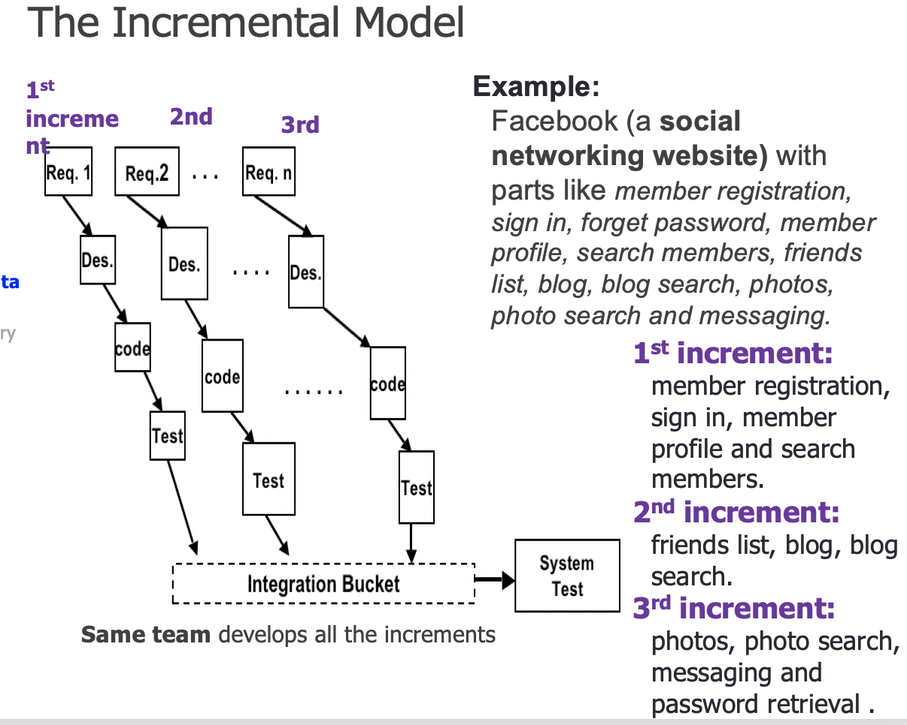
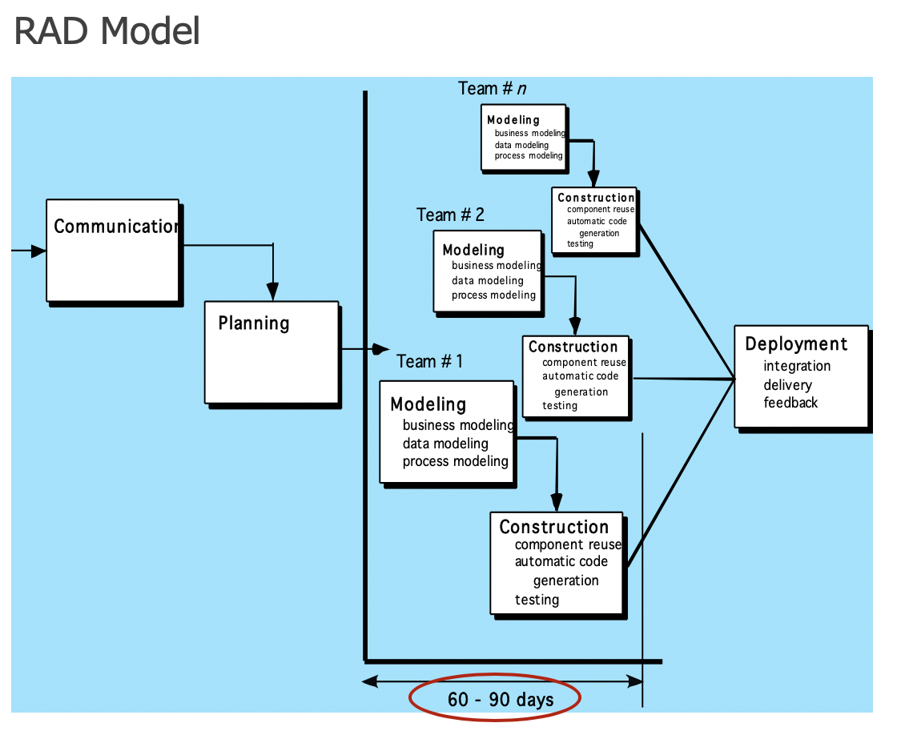

# CS3342 Software Design

--------

## Lecture 01 Introduction to Software Engineering and Design

-------

### What is Software

* Software is a set of items or objects that form a “**configuration**” that includes 
  * **programs** (i.e., source code, executable code) which are instructions
  * **documents** (requirements, design document, test plan, user guide, etc.) ‘describe the program’
  * **data structure** that ‘enable program’ to work. 
* Software is the **Product** that SW engineers design and build
  * produces, manages, acquires, modifies, displays, or transmits information
* Software is **logical rather than physical**
* Software is a **vehicle for delivering a product/service**
  * **—Supports or directly** provides system **functionality** (e.g., banking system, inventory control, CRM)
  * **Controls** other programs (e.g., an operating system)
  * Enable communications (e.g., networking software)
  * Helps build other software (e.g., software tools)
* Quality of software
  * It works(must do the task correctly and completely), thus the first step in the development process is to understand the SW REQUREMENT
    * Format of input and output
    * Processing details
    * Performance
    * Error and handling procedures
    * Standards
  * Can be read and easily understood: document the code
  * Can be modified: accommode for new requirements and changes
  * Completed in time and within budget
* Software vs. Hardware
  * —software is engineered not manufactured
  * software doesn't wear out
  * software is complex
  * Software is custom build (most of them) except software like *Excel, PowerPoint,* etc.
* Software Costs
  * Software costs often dominate system costs (cost of software on a PC are often greater than the hardware cost)
  * —Software costs more to **maintain** than it does to **develop**. For systems with a long life, maintenance costs could be several times of development costs
* **—The IEEE Definition of Software Engineering**
  * “The application of a systematic, disciplined, quantifiable approach to the development, operation, and maintenance of software; that is, the application of engineering to software.”
  * —Software
    Engineering is the process of solving **users problems** by the systematic development and evolution of large, high-quality software systems within cost, time and other constraints
* Task in SE
  * Feasibility Study
  * Requirements Analysis
  * Design
  * Programming**
  * Unit test
  * Integration and system test
  * User training
  * Changeover
  * Maintenance
  * And many more…
* **Software professionals** are characterized 
  * by a relevant education and continued learning;
  * —they have a holistic or system life-cycle focus; 
  * they work to industry standards; 
  * and they have a balanced approach to technical risk. 
* **Why do software project fail**
  * Poor communication(internal and external)
  * Resistance to change
  * Not reviewing project progress on a regular basis
  * Unclear Requirements
  * Unrealistic expectations
  * The absence of a good project manager
  * Moving the goalposts too often
  * not enough resource

-------------------

## Let 02 Software Process

------------

### Software process

* Software process: A series of predictable steps, road maps, that help us to create a timely, and high-quality result (defines tasks of activities that take place during the process)
  * defines who is responsible for:
    * What?
    * when and how?
    * to reach a goal
  * Process defines tasks and activities within a schedule

### SW Process Model (Life cycle)

* Software process model

  * An abstract representation of a process
  * It describe **a process**
  * guides the software developement team
  * with a set of key activities

* Phases and components : (e.g. design phase, test phase) and each phase has 3 components:

  * set of **activities**： define, design, implement, test and maintain
  * set of **deliverables**(可交付产品): what to produce
  * Quality control **measures**: what to use to evaluate/assess deliverables 

* **Waterfall Model**: Follows a systematic, sequential approach to SW development that begins at the system level and progresses through analysis, design, code and testing.

  * The "god parent" of models, linear sequence of phases
  * pure model : **no phases overlap**
  * Pros: Easy; Structured; Provide a template into which methods for **analysis, design, code, testing and maintenance** can be placed.
  * Cons:
    *  Sequential, does not reflect reality
    * Does not produce a prototype
    * *Little feedback from users* until it might be too late. Therefore cannot adapt to users’ needs, lack of intelligence and adaptability
    * *Problems in the specification may be found very late (at* Coding or integration)
    * It can *take a long time* before the first version is out
    * Risky: Integration and testing occur at the end => to late
  * When to use: 
    * simple proj
    * limited amout of time
    * requirements are well understood
    * Use well-understood technologies

* Incremental Process Models

  * Goal : provide quick basic functionality to the users

  * Process is not linear

  * **Requirements are well defined**

  * Software is completed **in small increments**

  * The system "Grows" in a number of small steps

  * 2 types:

    * Incremental Model

      

      * First  build provides the **CORE** functionalities
      * Each increment “deliverable” **adds a new** functionality.
      * This is repeated until the product is complete 
      * It combines characteristics of the waterfall model and the iterative nature of the prototyping model
      * When to use: software **can be broken into increments** and each increment represent a solution

    * RAD (The Rapid Application Developement) Model

      

      * Builds on the Incremental model with emphases on **short development cycle**.
      * A **speed waterfall** model
      * Components are built using this model as a fully functional units in a relatively short time
      * It **assumes that the system can be modularized(模块化)**
      * Involves multiple teams!
      * RAD will fail if we don’t have strong and skillful teams

* Evolutionary(演变) Process Models

  * **Specification,development and validation** activities are carried out *concurrently*(同时) with *rapid feedback* *across
    these activities*
  * **Core requirements are well understood but** **additional requirements are evolving and changing fast**
    * Design most prominent(重要的) parts first
    * Usually via a visual prototype
    * Good for situations with:
      * Rapidly **changing requirements**
      * Non-committal customer(非承诺客户)
      * Vague(模糊) problem domain
    * **Advantages**
      * Do not require **full** knowledge of the requirements
      * **Iterative** (software gets more complex with each iteration)
      * Divide project into **builds** (standalone software package - binaries)
      * Allows ***feedback***, show user something sooner
      * Use to develop more complex systems 
      * Provide steady, visible progress to customer
    * **Disadvantages**
      * Time estimation is difficult
      * Project completion date may be unknown
  * **Prototyping Model**