# CS3342 Software Design

--------

## Lecture 01 Introduction to Software Engineering and Design

-------

### What is Software

* Software is a set of items or objects that form a “**configuration**” that includes 
  * **programs** (i.e., source code, executable code) which are instructions
  * **documents** (requirements, design document, test plan, user guide, etc.) ‘describe the program’
  * **data structure** that ‘enable program’ to work. 
* Software is the **Product** that SW engineers design and build
  * produces, manages, acquires, modifies, displays, or transmits information
* Software is **logical rather than physical**
* Software is a **vehicle for delivering a product/service**
  * **—Supports or directly** provides system **functionality** (e.g., banking system, inventory control, CRM)
  * **Controls** other programs (e.g., an operating system)
  * Enable communications (e.g., networking software)
  * Helps build other software (e.g., software tools)
* Quality of software
  * It works(must do the task correctly and completely), thus the first step in the development process is to understand the SW REQUREMENT
    * Format of input and output
    * Processing details
    * Performance
    * Error and handling procedures
    * Standards
  * Can be read and easily understood: document the code
  * Can be modified: accommode for new requirements and changes
  * Completed in time and within budget
* Software vs. Hardware
  * —software is engineered not manufactured
  * software doesn't wear out
  * software is complex
  * Software is custom build (most of them) except software like *Excel, PowerPoint,* etc.
* Software Costs
  * Software costs often dominate system costs (cost of software on a PC are often greater than the hardware cost)
  * —Software costs more to **maintain** than it does to **develop**. For systems with a long life, maintenance costs could be several times of development costs
* **—The IEEE Definition of Software Engineering**
  * “The application of a systematic, disciplined, quantifiable approach to the development, operation, and maintenance of software; that is, the application of engineering to software.”
  * —Software
    Engineering is the process of solving **users problems** by the systematic development and evolution of large, high-quality software systems within cost, time and other constraints
* Task in SE
  * Feasibility Study
  * Requirements Analysis
  * Design
  * Programming**
  * Unit test
  * Integration and system test
  * User training
  * Changeover
  * Maintenance
  * And many more…
* **Software professionals** are characterized 
  * by a relevant education and continued learning;
  * —they have a holistic or system life-cycle focus; 
  * they work to industry standards; 
  * and they have a balanced approach to technical risk. 
* **Why do software project fail**
  * Poor communication(internal and external)
  * Resistance to change
  * Not reviewing project progress on a regular basis
  * Unclear Requirements
  * Unrealistic expectations
  * The absence of a good project manager
  * Moving the goalposts too often
  * not enough resource

-------------------

## Lec 02 Software Process

------------

### Part one :

* Object : thing from real world which can be quantified to mean one specific item

  * an **instance** of class
  * entity that has a state and a set of operations on that state (**a set of object attribute**)
  * Operation: provide services to other obj which request these services

* Class : represent all objects of the same kind

  * A set of related objects
  * Declarations of the attributes and services associated with an object of that class
  * represents some useful concept that existing in the **problem/solution domains**
  * may inherit attributes and operations from other classes

* OO

  * OO Programming has become the **standard programming** methodology for software engineers.
  * OO Programming is a **software programming paradigm** using “objects”, with instances of a class. 
  * In OO programming, you would design the program with the **data parts in mind, contextual information rather than procedures.**  
  * E.g Designing a smart phone…  : What kind of information/data to be stored/used? 

* Advantage of OO

  * **Easier to maintain** : Objs may be understood as stand-alone entities
  * **reuse** 
    * Objects are potentially **reusable** components.
    * For some systems, there may be an obvious mapping from real world entities to system objects.

* Rules to Name Classes

  

  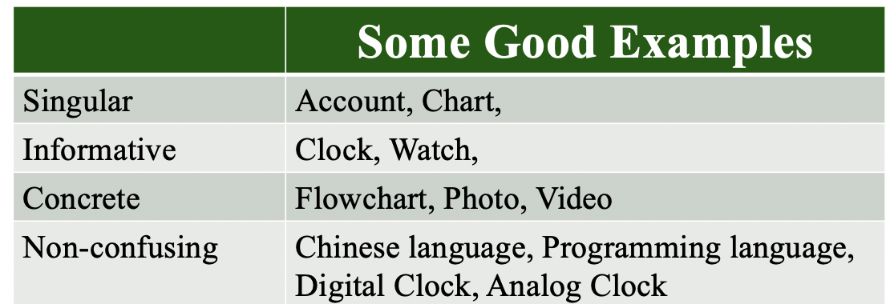

  * notice to model *real world* objects correctly, every attribute of the class instance must be assigned with a concrete value at any time. 

* UML

  * Operations : 

    * **change the value** of some attribute of an obj(set)
    * **Queries** (get)

  * Reference

    * Objects communicate by *message passing*: request from one object to another asking the second object to execute one of its methods.

    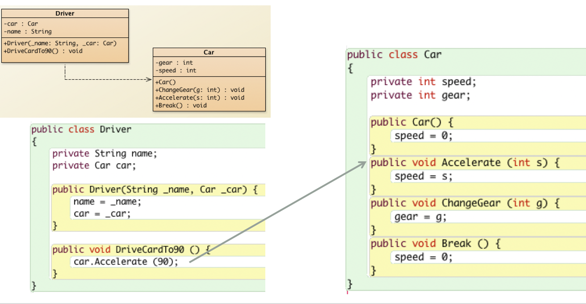

* State of Object

  * Objects can be in different **states**. 
  * State will change under the influence of outside circumstances
  * Use a interface and create difference states class to implement the interface

* Object Inheritance : Tool to reuse the code

  * subclass "is a (kind of)" superclass
  * generalization and inheritance
    * ***Generalisation*** is implemented as ***inheritance*** in OO programming languages
    * *Classes* may be arranged in a *class
      hierarchy* where one class (a *super-class*) is a *generalisation* of one or more other classes (*sub-classes*)
  * Sub-class inherits (all **attributes/operations/relationships**), and add attributes and operations, relationships, **redifine(override**) inherited operations
  * **Point from subclass to superclass**
  *  Do not use too often which causes difficulties of management

  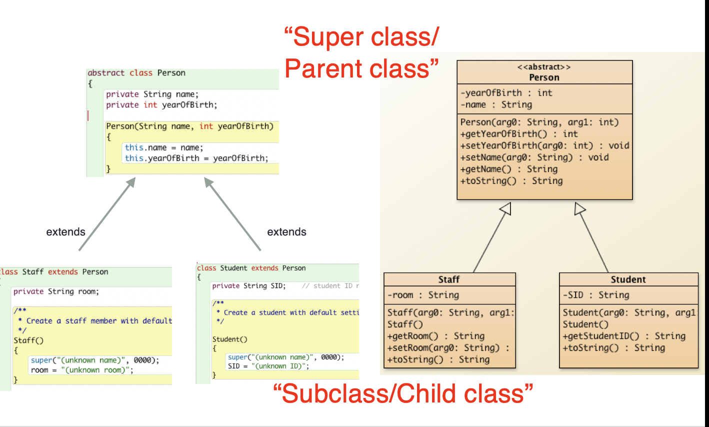

* Advantage of Inheritance

  * It is *an abstraction mechanism* to classify entities
  * It *supports* ***reuse***（often exist in the exam） both at the design and programming level
  * It provides a mechanism to extend or refine a class: by adding or overriding methods (or *operations*) and by adding attributes
  * The inheritance diagram is a *source of organisational knowledge about domains and systems*

* Information Hiding in OO

  * *Information hiding* enhances **maintainability** 
    because implementation details are **invisible** outside an object
  * OO languages allow an attribute to be described as **private** (invisible outside the object) 
    *  (-) minus-sign : private, (+) plus-sign : public

* Benefits of information hiding

  * change cannot affect other part of the system
  * a system consists of essentially **independent** classes
  * they **communicate by sending messages**
  * **objects do talking to each other**

### Part two:

### Software process

* Software process: A series of predictable steps, road maps, that help us to create a timely, and high-quality result (defines tasks of activities that take place during the process)
  * defines who is responsible for:
    * What?
    * when and how?
    * to reach a goal
  * Process defines ==tasks and activities== within a schedule
  * start with understanding the business requirements

### SW Process Model (Life cycle)

* Software process model

  * An abstract representation of a process
  * It describe **a process**
  * guides the software developement team
  * with a set of key activities

* Phases and components : (e.g. design phase, test phase) and each phase has 3 components:

  * set of **activities**： define, design, implement, test and maintain
  * set of **deliverables**(可交付产品): what to produce
  * Quality control **measures**: what to use to evaluate/assess deliverables 

* Process Model

  * **Waterfall Model**: Follows a ==systematic, sequential approach== to SW development that begins at the system level and progresses through analysis, design, code and testing.

    * The "god parent" of models, linear sequence of phases
    * pure model : **no phases overlap**
    * Pros: Easy; Structured; Provide a template into which methods for **analysis, design, code, testing and maintenance** can be placed.
    * Cons:
      *  Sequential, does not reflect reality
      * Does not produce a prototype
      * *Little feedback from users* until it might be too late. Therefore cannot adapt to users’ needs, lack of intelligence and adaptability
      * *Problems in the specification may be found very late (at* Coding or integration)
      * It can *take a long time* before the first version is out
      * Risky: Integration and testing occur at the end => to late
    * When to use: 
      * simple proj
      * limited amout of time
      * requirements are well understood
      * Use well-understood technologies

  * Incremental Process Models

    * Goal : provide quick basic functionality to the users

    * Process is not linear

    * **Requirements are well defined**

    * Software is completed **in small increments**

    * The system "Grows" in a number of small steps

    * 2 types:

      * Incremental Model

        

        * First  build provides the **CORE** functionalities
        * Each increment “deliverable” **adds a new** functionality.
        * This is repeated until the product is complete 
        * It combines characteristics of the waterfall model and the iterative nature of the prototyping model
        * When to use: software **can be broken into increments** and each increment represent a solution

      * RAD (The Rapid Application Developement) Model

        

        * Builds on the Incremental model with emphases on **short development cycle**.
        * A **speed waterfall** model
        * Components are built using this model as a fully functional units in a relatively short time
        * It **assumes that the system can be modularized(模块化)**
        * Involves multiple teams!
        * ==RAD will fail if we don’t have strong and skillful teams==

* Evolutionary(演变) Process Models

  * **Specification,development and validation** activities are carried out *concurrently*(同时) with *rapid feedback* *across these activities*

  * **Core requirements are well understood but** **additional requirements are evolving and changing fast**

    * Design most prominent(重要的) parts first
    * Usually via a visual prototype
    * Good for situations with:
      * Rapidly **changing requirements**
      * Non-committal customer(非承诺客户)
      * Vague(模糊) problem domain
    * **Advantages**
      * Do not require **full** knowledge of the requirements
      * **Iterative** (software gets more complex with each iteration)
      * Divide project into **builds** (standalone software package - binaries)
      * Allows ***feedback***, show user something sooner
      * Use to develop more complex systems 
      * Provide steady, visible progress to customer
    * **Disadvantages**
      * Time estimation is difficult
      * Project completion date may be unknown

  * **Prototyping Model**

    * Start with what is known about requirements.
    * Complete a quick design.
    * ==Build the prototype by focusing on what will be seen by the user.==(write interface first??)
    * Use the prototype to show the user and help refining(提炼) requirements.
    * Better communication
    * Advantage
      * Prototype can serve as a way for identifying requirements.
      * It is developed very quickly.
    * Disadvantage
      * Customer might think that the prototype is the final product and forget the lack of quality i.e. PERFORMANCE, RELIABILITY.
    * **When to use?**: 
      * When the customer define general ==objectives for the SW but does NOT identify details about INPUT, OUTPUT, or processing requirements.==
      * The developer is unsure of the efficiency of an algorithm, human machine interaction, etc(no implementation detail)

  * Spiral(螺旋) Model
    * Iterative (like Prototype) and controlled (like waterfall)
    * Software is developed using evolutionary releases(演变发行)
    * Complexity increase with each release
    * A spiral process rather than as a sequence of activities with backtracking
    * *Each loop* in the spiral represents *a phase in the process*. 
    * *No fixed phases* such as req. specification or design - loops in the spiral are chosen depending on what is required—*more flexible*
    * Emphasize risk analysis and management (Risks are explicitly assessed and resolved throughout the process)

  * The Spiral Model

    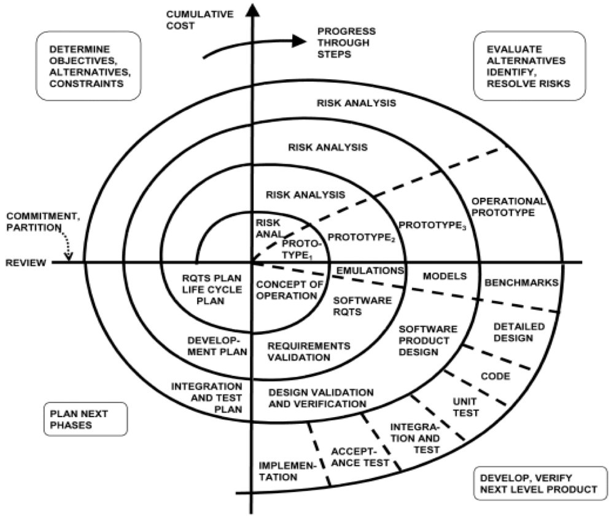

    * Each addresses a set of "risks": Start small, explore risks, prototype, plan, repeat
    * Number of spirals is variable
    * Advantage: 
      * Can be combined with other models(as long as it can be divided into spirals)
      * risk orientation provides early warning of problems
    * Disadvantages
      * More complex
      * requires more management
    * When to use
      * very large projects, mission critical systems
      * When technical skills must be evaluated at each step

  * Concurrent Engineering Model(paralllel development)

    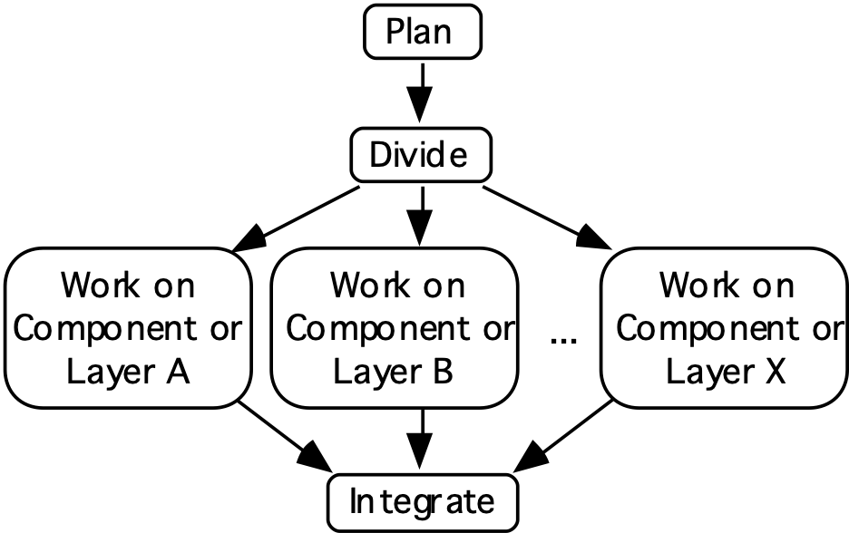

    * It explicitly use the **divide and conquer** principle.
    * Each team works on its own component, ==typically following a spiral or evolutionary approach.==
    * There has to be some initial planning, and periodic integration.   

* Other Process Model: Component based software engineering(CBSE)

  * ==When **reuse** is a development objective==

  * Based on systematic reuse where systems are ==integrated from existing components or COTS (Commercial-off-the-shelf) systems.== (E.g., data conversion, encryption, device drivers, data mining modules)

  * The main difference is that CBSE emphases(依靠) on **composing** solutions
    from prepackaged software components or classes 

  * Key questions: Are commercial off-the-shelf components and internally-developed reusable components are available to implement the requirement; Are the interfaces for available components compatible within the architecture of the system to be built?

  * First rule of CBSE: never build what you can buy!

    Because: it becomes solution oriented, built based on features available in the components, not from customer requirements (problem-oriented). 

  * Design principles:

    * Components are independent so do not interfere with each other
    * Component implemnations are hidden
    * Communication is through well-defined interfaces;(method calls)
    * Component platforms are shared and reduce development efforts/costs

  * Component: Provide a service without regard to where the component is executing or its programming language

    * The *component interface* is published and all interactions are through the published interface;
    * An independent, executable entity
    * The services offered by a component are made available through an interface API

  * Component characteristics

    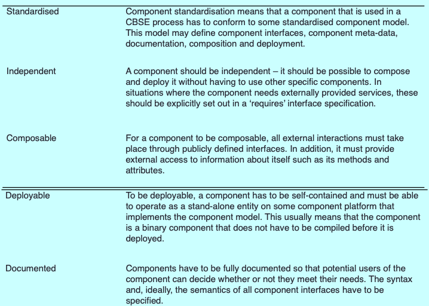

  * Considerations

    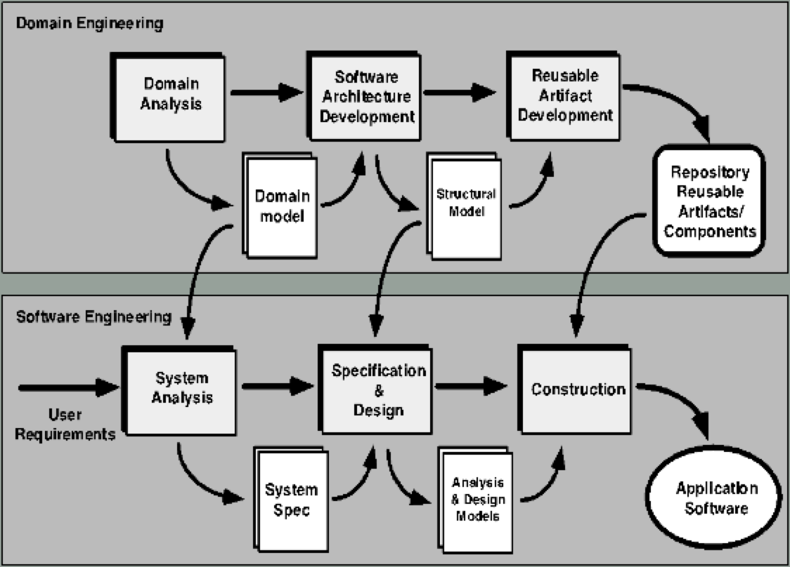

    * step(1): Build up a component library
    * step(2): Develop a new system based on components

---------------

## Lecture 03 OOFundamental-Part II & Roles of Variables & UML Class Diagram

-------

### OOFundamental II

* Abstraction

  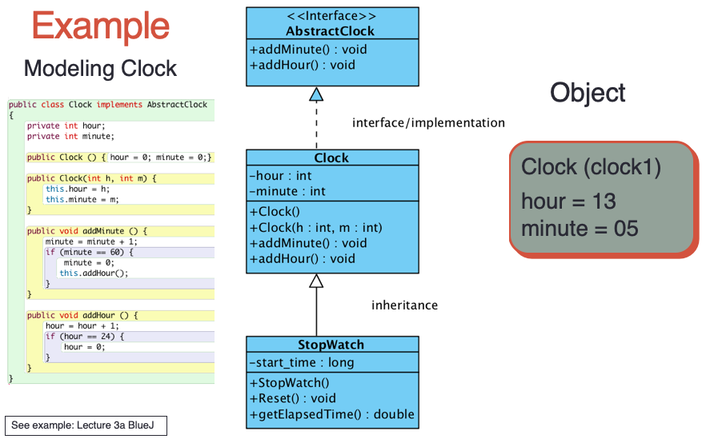

  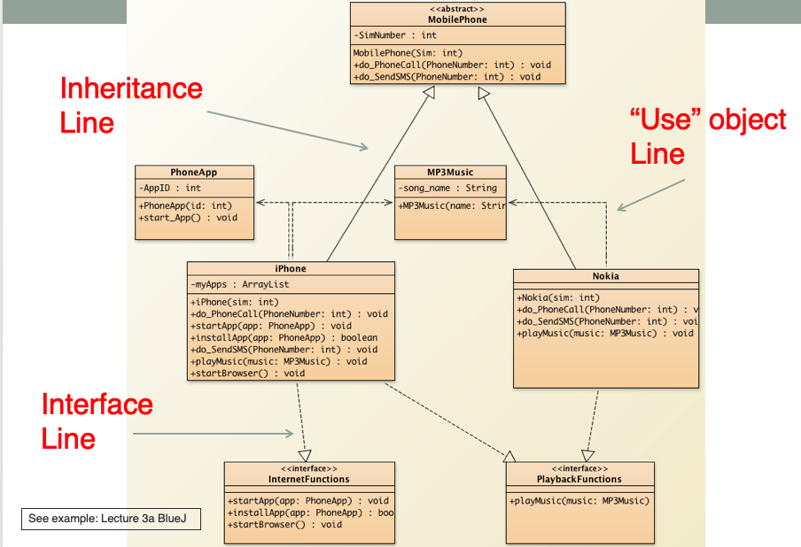

  * Abstract class\<\<abstract\>\>, ... extends...
    * A special kind of class that ==cannot be instantiated== (create object).
    * Can have ==“default” implementations==, subclasses can modify. 
    * Enforce ==certain characteristics and hierarchies for all the subclasses==.
    * Support ==Multiple Inheritance: NO.== Can only inherit from one abstract class
  * Interface\<\<interface\>\>, ... implements...
    * An interface is NOT a class. It is an entity, and ==has no implementation==.
    * Only the definition of the methods without the body.
    * Cannot have “default” implementation, ==subclasses MUST implement them==.
    * Support Multiple Inheritance : Yes, can implement different Interfaces

* Polymorphism(and dynamic binding)

  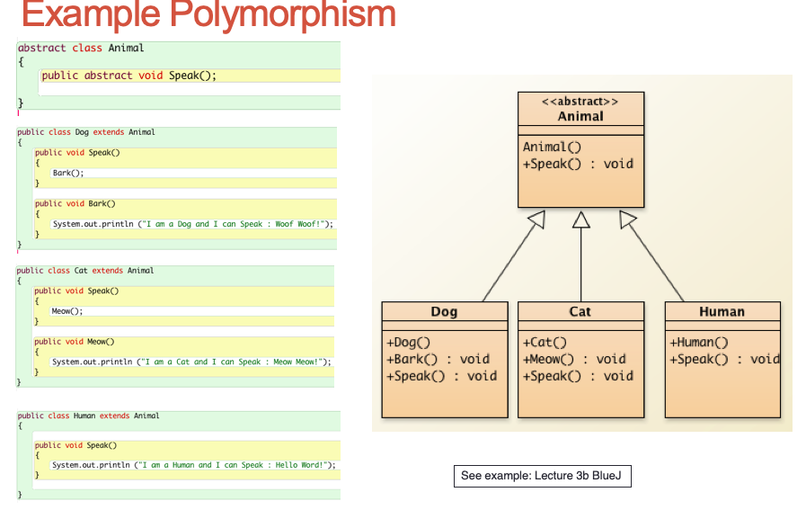

  * Polymorphism is an OO feature that allows a [subclass](http://en.wikipedia.org/wiki/Subclass_(computer_science)) to provide a specific implementation of a [method](http://en.wikipedia.org/wiki/Method_(computer_science)) that is already provided by one of its [superclasses](http://en.wikipedia.org/wiki/Superclass_(computer_science)).
  * Method overriding is an important feature that facilitates [polymorphism](http://en.wikipedia.org/wiki/Polymorphism_(computer_science)) in the design of [object-oriented](http://en.wikipedia.org/wiki/Object-oriented) [programs](http://en.wikipedia.org/wiki/Computer_program).

### Roles of Variables

* If a variable has **multiple purposes** to be used at the same time, the logic becomes less obvious: It is easier to introduce bugs in our program if we are unable to consistently maintain the value of the variable for all purpose

* The "Role" of a variable: is a way for developer to represent *meta-level programming knowledge*. Ten of them are very common in programs

  * **Constant/Fixed value**: A variable which is initialized without any calculation whose value does not change thereafter

    * Purpose: write once and read only
    * Example: read the radius of a circle, then print the area of the circle
      * variable ***r*** is a *fixed value, gets its value once,* never changes after that 
      * (e.g.,  the variable PI in the following example).
    * "final" in Java or "const" in C/C++

    ```java
    public class AreaOfCircle {
       public static void main(String[] args) {
    	  float PI = 3.14F; // PI is a constant
    	  float r = 0.0;
      	  System.out.print("Enter circle radius: ");
    	   r = UserInputReader.readFloat();
    	   System.out.println(“Circle area is " + PI * r * r);
      }
    }
    ```

    

  * **Stepper**: A variable stepping through values that can be predicted as soon as the succession starts.(increment or, i++)

    * Purpose: Goes through a sequence of values systematically

    ```java
    public class MultiplicationTable {
       public static void main(String[] args) {
    	int multiplier;
    	for (multiplier = 1; multiplier <= 10; multiplier++)
    		System.out.println(multiplier + " * 3 = "
    			+ multiplier * 3);
    	}
    }
    ```

    

  * **Most-recent holder**: A variable holding the latest value encountered in going through a succession of values. 

    * Most recent member of a group, or simply latest input value

      * e.g.: when asking the user for an input until input value is valid
      * s in the following example

      ```java
      public class AreaOfSquare {
         public static void main(String[] args) {
      	float s = 0.0;
      	while (s <= 0) {
      		System.out.print("Enter side of square: ");
      		s = UserInputReader.readFloat();
      	}
      	System.out.println(“Area of square is " + s * s);
      	}
      }
      ```

      

  * **Gatherer**: A variable accumulating the effect of individual values in going
    through a succession of values. 

    * Purpose: Accumulates values seen so far: accepts integers, then calculates mean
    * Variable sum is a gatherer

    ```java
    public class MeanValue {
        public static void main(String[] argv) {
    	int count=0;
    	float sum=0, number=0;
    	while (number != -999) {
    	   System.out.print("Enter a number, -999 to quit: ");
           // number is most recent holder
    	   number = UserInputReader.readFloat();
     	   if (number != -999) { sum = sum + number; count++; }
     	}
    	if (count>0) 
            System.out.println("The mean is " + sum / count);
       }
    }
    
    ```

    

  * **One-way flag**: A two-valued variable that cannot get its initial value once its value has been changed.

    * Purpose: serve as a Boolean variable (true or false)
    * Example: sum input numbers and report if any negative numbers

    ```java
    public class SumTotal {
       public static void main(String[] argv) {
    	int number=1, sum=0;
    	boolean neg = false;	//one-way flag
    	while (number != 0) {
    	    System.out.print("Enter a number, 0 to quit: ");
    	    number = UserInputReader.readInt(); sum += number;
    	   if (number < 0) neg = true;
    	}
    	System.out.println("The sum is " + sum);
    	if (neg) 
            System.out.println(“There were negative numbers.");
       }
    }
    
    ```

    

  * **Temporary**: A variable holding some value for a very short time only. 

    * Keep values that are only needed for very short period(e.g. separated by a few lines of code)

      - e.g.: output two numbers in size order, swapping if necessary

      ```java
      public class Swap {
         public static void main(String[] args) {
      	int number1, number2, tmp;
      	System.out.print("Enter num: ");
      	number1 = UserInputReader.readInt();
      	System.out.print("Enter num: ");
      	number2 = UserInputReader.readInt();
      	if (number1 > number2) {
      		tmp = number1;
      		number1 = number2;
      		number2 = tmp;
      	}
      	System.out.println(“Order is " + number1 + “," + number2 + ".");
         }
      }
      
      ```

      

  * **Organizer:** An array which is only used for rearranging its elements after
    initialization. (container)

    * An array[] for containing and rearranging elements
    * e.g.: input ten characters and output in reverse order

    ```java
    public class Reverse {
       public static void main(String[] args) {
    	char[] word = new char[10];	// organizer
    	char tmp; int i;
    	System.out.print("Enter ten letters: ");
    	for (i = 0; i < 10; i++) word[i] = UserInputReader.readChar();
    	for (i = 0; i < 5; i++) {
    		tmp = word[i];
    		word[i] = word[9-i];
    		word[9-i] = tmp;
    	}
    	for (i = 0; i < 10; i++) System.out.print(word[i]);
    	System.out.println();
      }}
    ```

    

  * **Transformation**: A variable that always gets its new value from the same calculation from value(s)of other variable(s). 

    * Purpose: Compute value in new unit
    * e.g.: `speed = distance/time`

    ```java
    public class Growth {
       public static void main(String[] args) {
    	float capital, interest; int i;
    	System.out.print("Enter capital (positive or negative): ");
    	capital = UserInputReader.readFloat();
    	for (i = 1; i <=10; i++) {		//stepper
    	     interest = 0.05 * capital;	//transformation
    	     capital += interest;		//gatherer
    	     System.out.println("After "+i+" years interest is "
    		+ interest + " and capital is " + capital);
    	}
       }
    }
    ```

    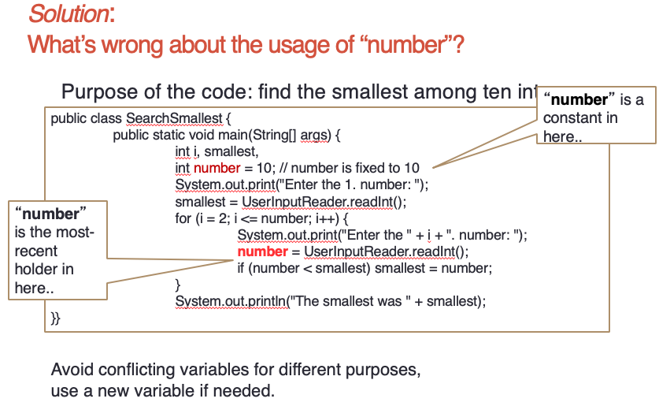

### UML Class Diagram

* Class diagram: Used to visualize object-oriented classes and their relationships in our system

  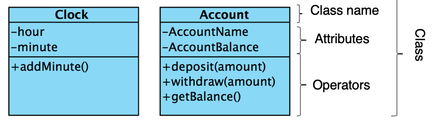

* Class linkages

  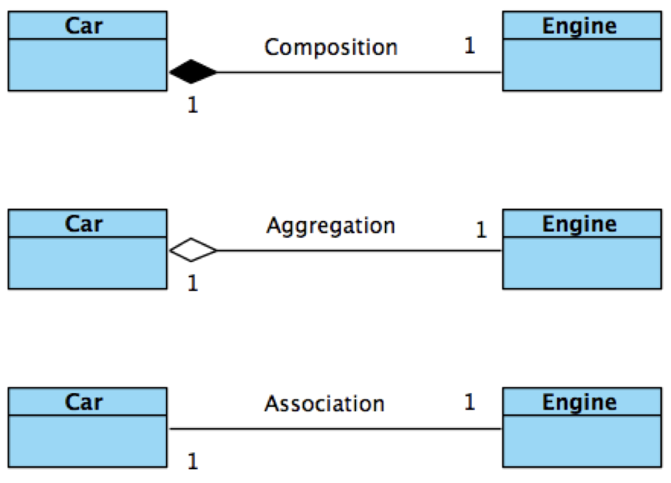

  * Composition
    * A has B(Must/compulsory, i.e. B must be included)
    * Implementation: Class_A contains a fixed local variable links to Class_B
  * Aggregation 
    * A has B(B is Optional, can be included later)
    * Implementation: Class_A contains a changale local variable links to Class_B
  * Association
    * A uses B(may be as a parameter, can define B at runtime, more dynamic)
      * ***Class_A*** DO NOT contain a local variable links to ***Class_B*** 
      * ***Class_A*** uses ***Class_B*** as (input/output) ***Parameter*** directly.

* Example:

  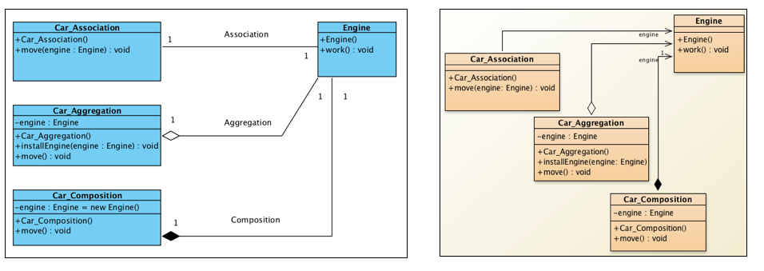

  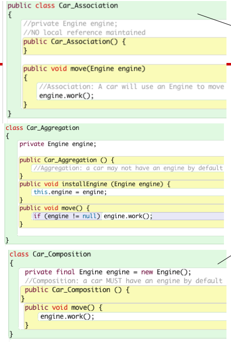

* Association & Mutiplicity

  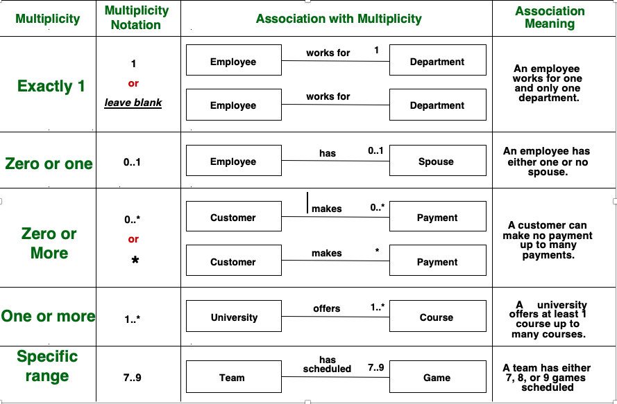

-------------

## Lecture 04 Software Requirement Modeling with Use-cases

-------

### Introduction

* Use Cases: Typically, a use case is a **contract** of an interaction between the system and an actor. 

  * The Actor can be a human or an external system / machine.
  * A full use-case model comprise of:
    * A Use Case Diagram, describing relations between use-cases (system tasks, roles) and actors (external parties).
    * Use Case Specifications (usually one per each use case) Documents describe the use case in details 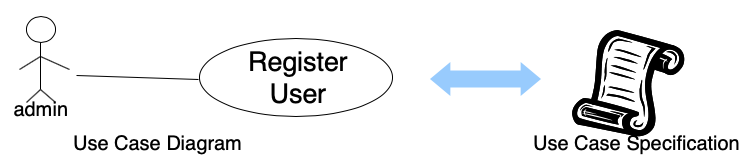

* Use cases as means of communication: simulate about what the system should do

  * mainly with people who are outside of the development team.

    The objective of *use case analysis* is to **model** the system and describe

    *  how users interact with this system
    * when trying to achieve their objectives. 
    * “It is one of the key activities in requirements analysis”

* Use Case Diagram Objective:

  * Create a semi-formal model of the functional requirements (what the system does..)
  * Analyze and define:
    * Scope  (What are the main functions?)
    * External parties  (who will interact with the system?)
    * External interfaces  (how they are related?)
    * Scenarios and reactions  (One Big Picture)

### Use Case Diagram

* Steps to build an Use-Case Model
  * Choose the ***system boundary*** – what are you modeling? System? Business organization?
  * Identify the ***primary*** ***actors*** – they have user goals fulfilled by using the services of the system
  * For each primary actor, ***identify their user goals*** – define what they want to do with the system. Describe their goals at the correct level
  * ***Define use cases*** that satisfy user goals. Name each according to its goal. [You may find out other actors, which we call secondary actors of ***that particular*** use case.]

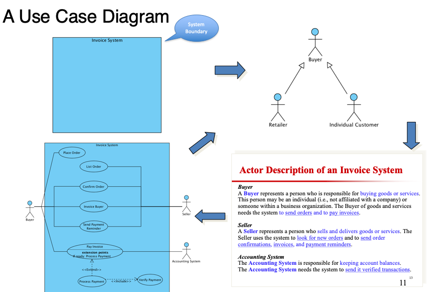

* Actors(provides input and takes output): External objects that produce/consume data:

  * must serve as sources and destinations for data
  * must be **external to the system**
  * **Primary actor** : interacts directly with the system
  * **Secondary actor**: interacts indirectly with the system or support the use case to complete a use case for the primary actor
  * Use case is User-centric

* Basic Types of Relationship in Use Case Model

  * Include(Allow one to express **commonality** between several different use cases)

    * Can be included in other use cases: very different use cases can share sequence of actions and enable you to avoid repeating details in multiple use cases
    * Shows the performing of a lower-level task with a lower-level goal
    * e.g. "place order" includes "validate user"

  * Extend - Graphical representation

    * Conditional flow (IF...THEN...)

    * show **optional** behaviour or handle **exception** 

      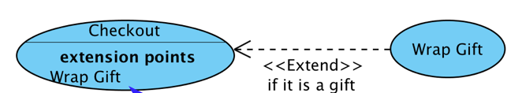

  * Association: Instances of the actor and instances of the use case communicate with each other(**Only** relationship between actors and use cases) 

  * Generalization: A generalization from use case A to use case B indicates that A inherits B

    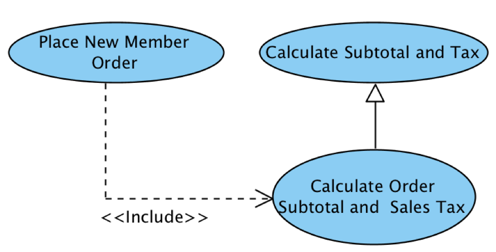

  * Actors can also be generalized: Child actor inherit all use-cases associations

### Writing Use Cases

* Contents in a single use case:

  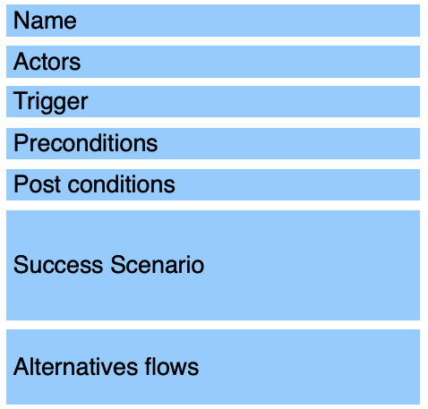

  * **Name**: Give a short, descriptive name to the use case.
  * **Purpose**: State clearly the purpose of the use case. Give a short informal description.
  * **Actors**: List the actors who can perform this use case. 
  * **Pre-conditions**: Describe the state of the system before the use case.(need to be true before running)
  * **Flow of Events** 
    * interactions between actors and the system
    * business logic
  * **Not allowed paths** (if any)
  * **Alternative paths** (if any)
  * **Exceptions** (if any)
  * **Post-conditions**: State of the system in following completion.(outcome condition of the use case)
  * **Extension Points**
  * **Triggers** : What starts the use-case
  * **success senario**: main story-line of the use-case
    * written under the assumption that everything is okay, no errors or problems
    * Composed of a sequence of action steps

### Guidelines for Effective Use Cases

* Guide lines

  * simple grammar
  * one side is doing something in a single step
  * write from an "objective" point of view
  * any step should lead to some progress

  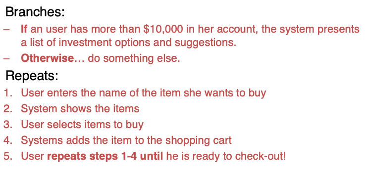

* Common Mistakes:

  * complex diagram
  * No system box
  * no actor
  * too many details(implementation, UI ...)

* Alternative Flows: used to describe exceptional functionality

  * Errors:
    * “Case did not eject properly”
    * “Any network error occurred during steps 4-7”
    * “Any type of error occurred”
  * Unusual or rare cases
    * “Credit card is defined as stolen”
    * “User selects to add a new word to the dictionary”
  * Endpoints: “The system detects no more open issues”
  * Shortcuts : “The user can leave the use-case by clicking on the “ESC” key

* Writing include: add a reference as a step

  * system shows homepage
  * User executes \<include: login to the system\>

* Wriring extend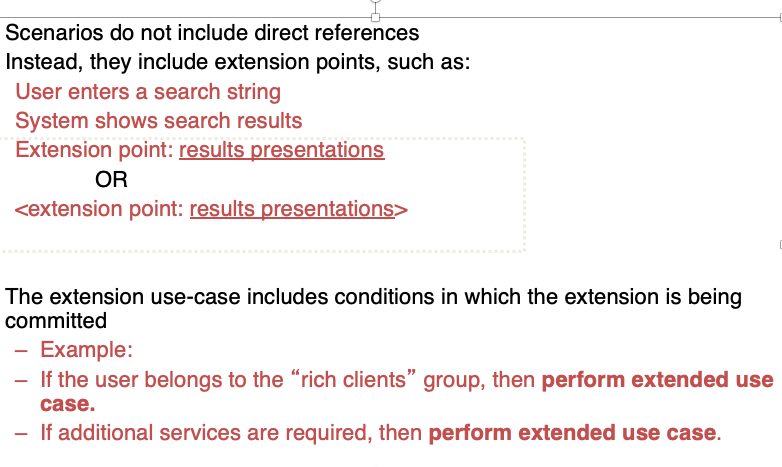


---------------------------

## Lecture 05 Sequence Diagram

----------

* Sequence diagram: Things between implementation and request

  * execution sequence between objects: class methods calling each others

  * when to use centralized or delegation of responsibility and express them in sequence

  * shows objects or actors(**not** classes or the system itself) as vertical dotted lines

  * events as horizontal arrows from the sender object to the receiver object

    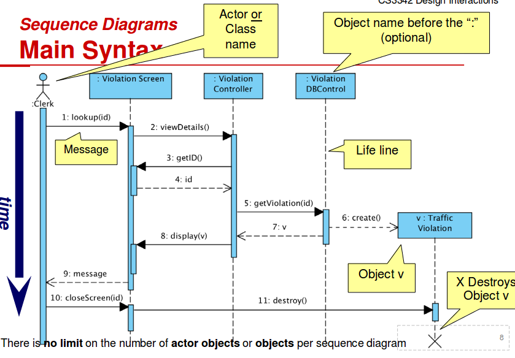

* Basic components

  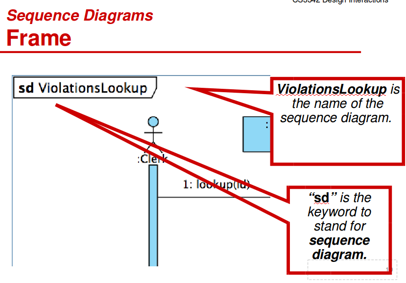

  * **Frame**: define the scope of a sequence diagram
  * **Object, message, life-line, condition,execution occurrence** are basic elements to compose a sequence diagram

* Message:

  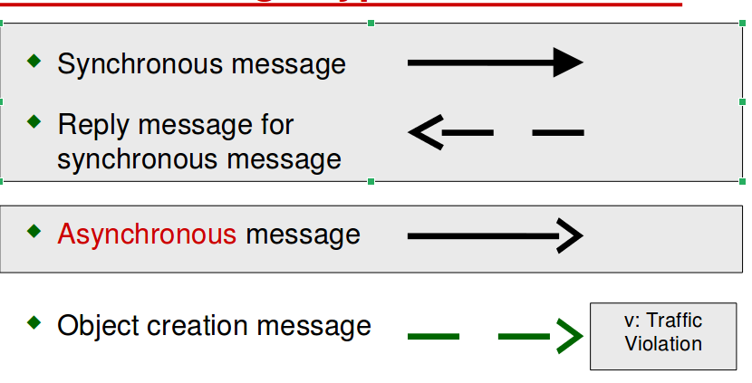

  * Messages, written with horizontal [arrows](https://en.wikipedia.org/wiki/Arrow_(symbol)) with the message name written above them, display interaction. Solid  arrow heads represent synchronous calls, open arrow heads represent [asynchronous messages](http://www.uml-diagrams.org/sequence-diagrams.html), and dashed lines represent reply messages.[[1\]](https://en.wikipedia.org/wiki/Sequence_diagram#cite_note-1)

  * If a caller sends a synchronous message, it must **wait until the message  is done**, such as invoking a subroutine. If a caller sends an  asynchronous message, it **can continue**(bg demo run 1 1) processing and doesn’t have to  wait for a response. 

    * synchronous  

      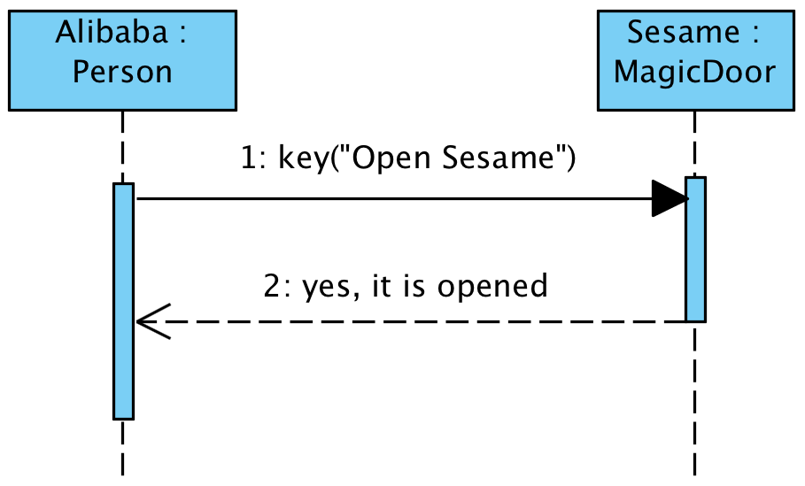

    * Asynchronous(do not pair with return)

    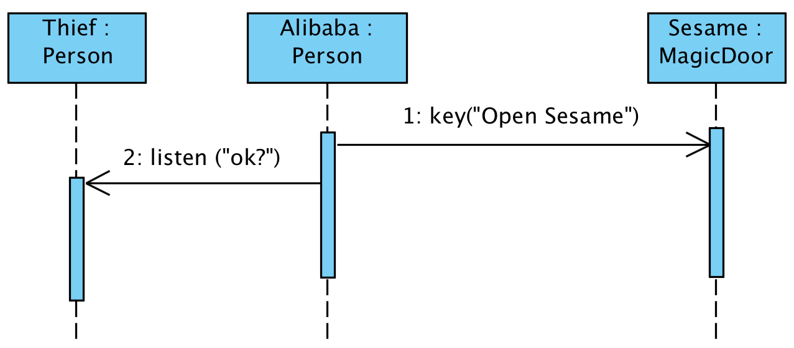

    * Asynchronous calls are present in multithreaded  applications, event-driven applications and in [message-oriented middleware](https://en.wikipedia.org/wiki/Message-oriented_middleware).  
    * Activation boxes, or [method](https://en.wikipedia.org/wiki/Method_(computer_science))-call boxes, are opaque rectangles drawn on top of lifelines to represent  that processes are being performed in response to the message  (ExecutionSpecifications in [UML](https://en.wikipedia.org/wiki/Unified_Modeling_Language)).

  * okay without return values(optional) => reduce line in the diagram(when return val is obvious)

  * Object Creation message(make the lifeline correct)

    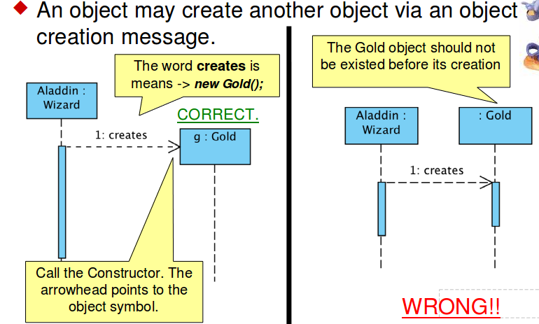

  * Object Destruction

    * c++ : call destructor

    * java: garbage collection

      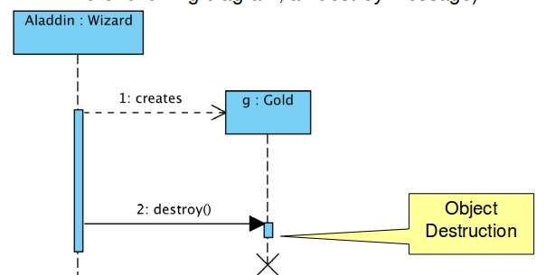

  * summary

    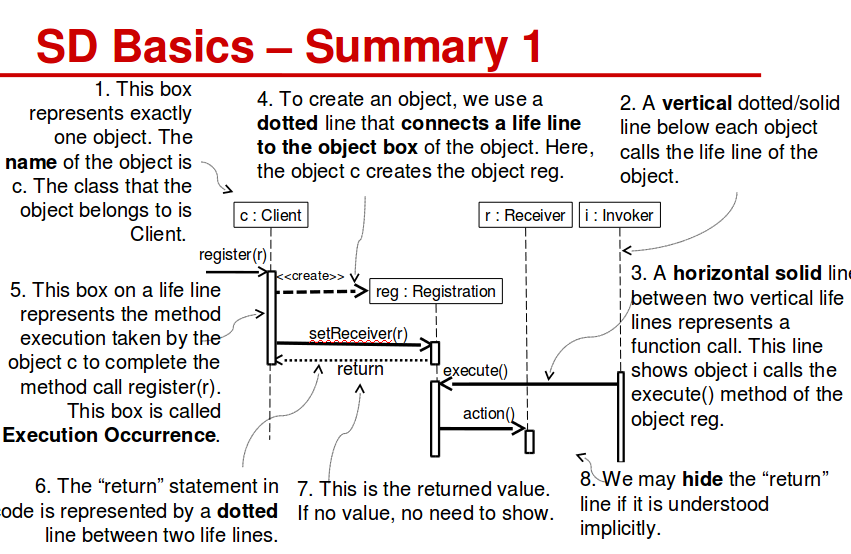

    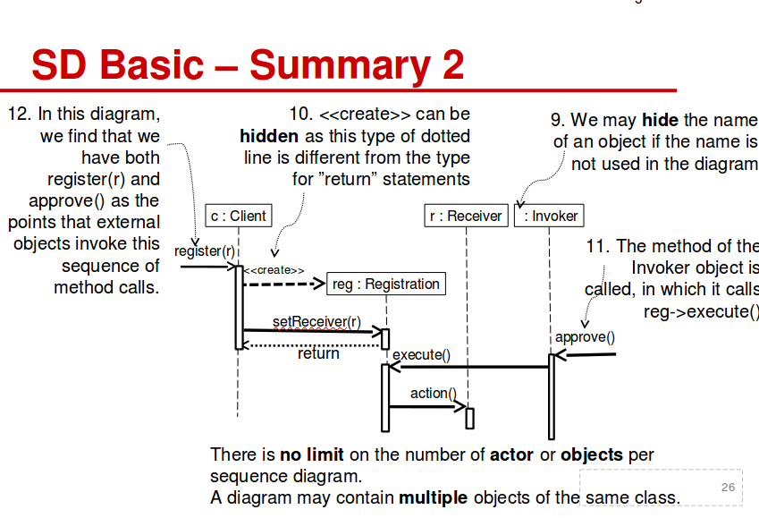

### SD with Complexity

* Condition(event occurs when satisfies condition)

  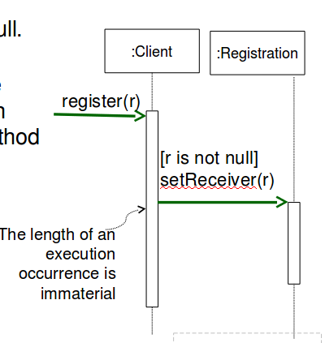

  * [condition] methodName() when  initiate an event

* Lost and found

  ```java
  public void register(String name, int age){ // found
      Account acc = new Account();
      acc.setId(1);
      acc.setName(name);
      acc.setAge(age);
      _accound.add(account);	//loss
  }
  ```

  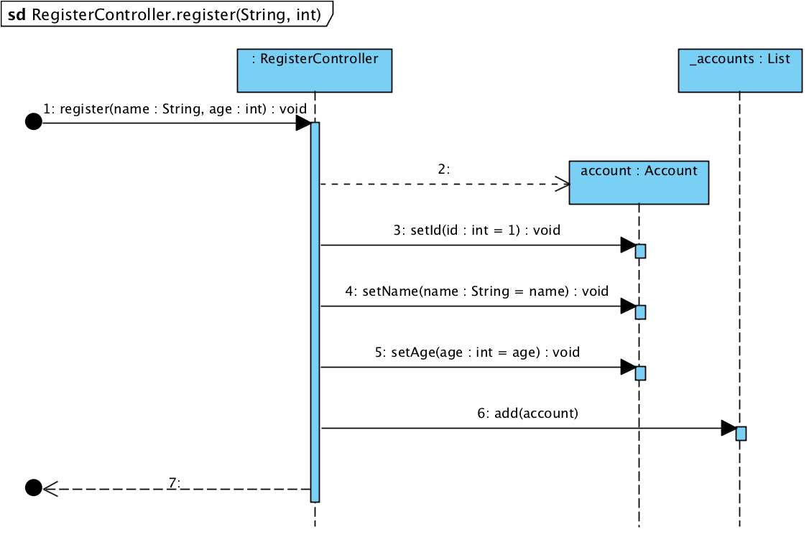

  * Lost message:  are those that are either sent but not arrived, or which go to a recipient not shown on the current diagram. (connecting to other functions in another diagram)

  * Found message: are those that arrived from an unknown source, or from a sender not shown on the current diagram.  (They are denoted going to or coming from an endpoint element.)

  * Enhanced Version

    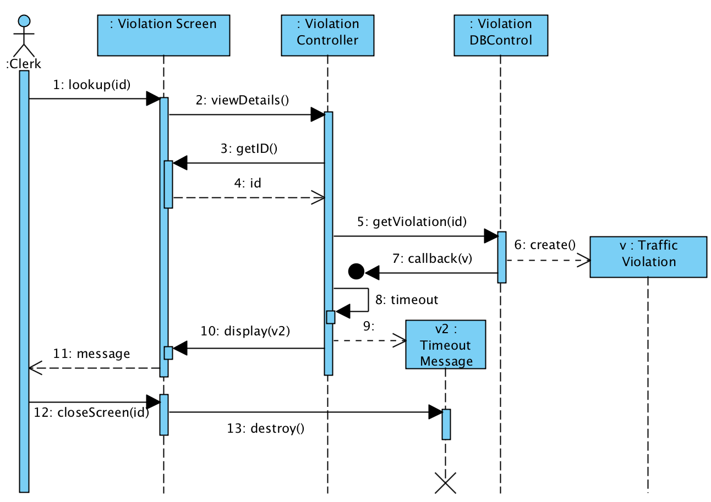

    * No one destructs Traffic Violation obj, memory leaks

* Condition/control logics: if then else, for breaks, fragmentations

  * Reference of interactionUSe(ref): Fragment refers/points to another sequence diagram

    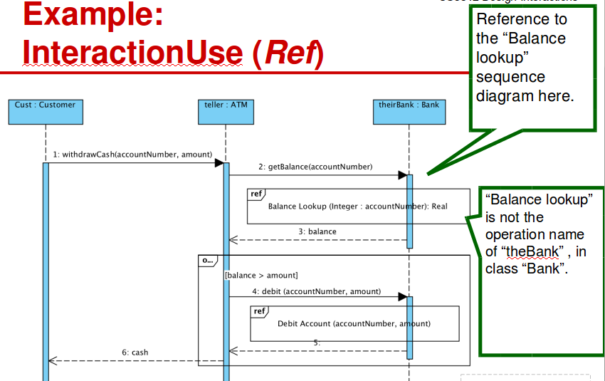

    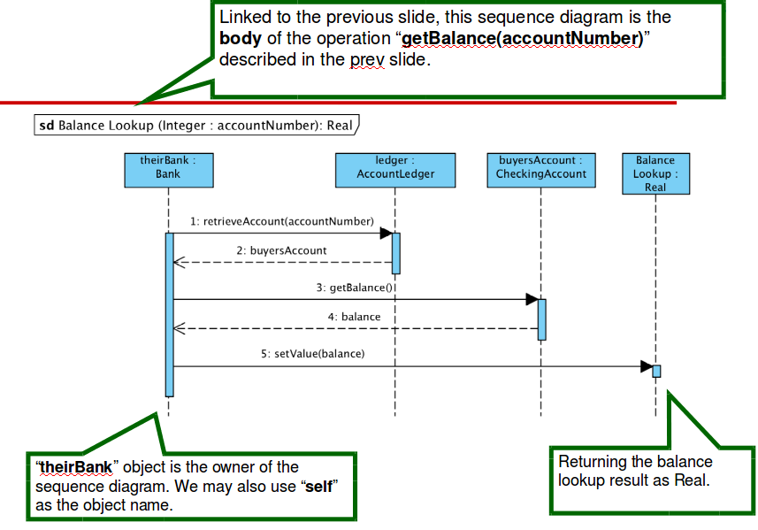

    * Interaction scenario of objects
    * short hand for copying the contents(inline in cpp)
      * To be accurate the copying must take into account substituting parameters with arguments and connect the formal gates with the actual ones.

  * CombinedFragments: Control information of sequence diagram(modeling simple combinations)

    * alt(alternatives): similar to switch: at most one operands

      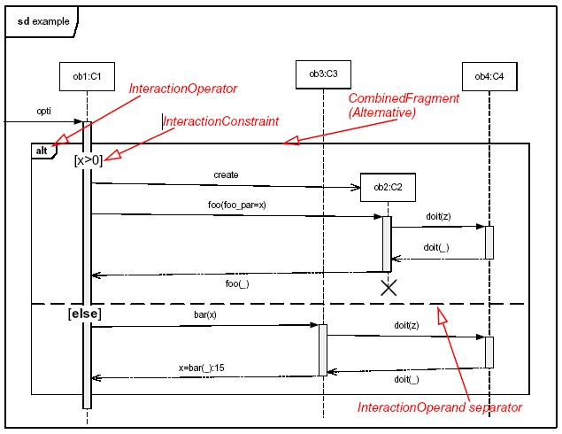

      * use "else " for unnamed case

    * opt(option): if satisefy run, else skip(no else)

      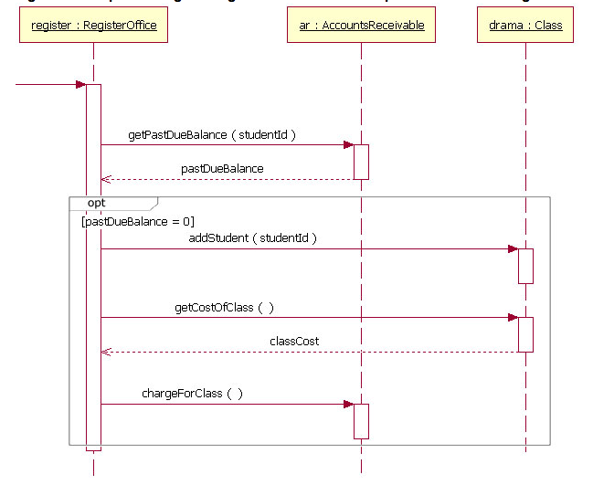

    * Break(break): similar to cpp(if satisifies break, run the code, other wise, do not run the code)

      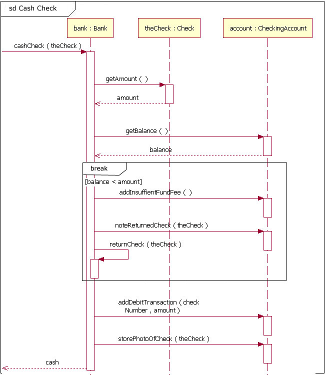

    * Iteration(loop)

      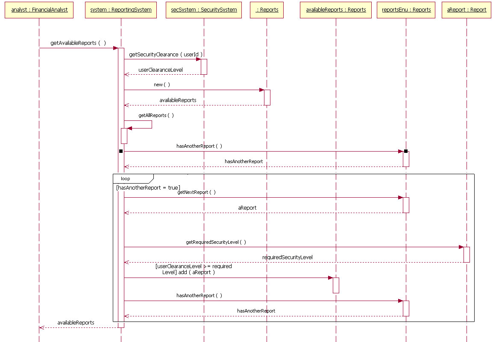

      * loop(min,max) // where min max define the range of iterations
      * loop(3) minimum of 3 iterations , equivalent to loop(3,*)

* Case study

  * how to determine the well structured sequence : 2 implementations: 

    * Fork diagram(centralized control): Appropriate when the operations can <u>change order</u> or new operations <u>could be inserted</u> 
    * Stair Diagram(decentralized control): Appropriate when the operations have a **strong connection** and will **always** be performed in the **same order**

    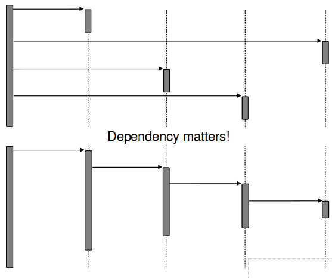

  * A **strong connection** exists among the operations if the objects:

    * form a "consists-of" hierarchy(country-state-city)
    * Information hierarchy(document-chapter-section)
    * represent a fixed procedural sequence such as advertisement-order-invoice-delivery-payment
    * form a (conceptual) inheritance hierarchy(animal-mammal-cat)

  * Reverse Engineering SD


------------

## Lecture 06 Software Design Principles

----

* Reason of writing code that functions well:
  * Development(add new functionality) <=> Maintenance(Fix bug, improve the algorithm , porting a program from one platform to another(iOS->android)
  * Programs are so large that, if functionalities in
    a real-life program is not well-designed,
    a small change in a program is extremely painful!   

### Reveiw Basic OO concepts

### Learn OO Design Principles

* Class Design Principles

  * Open-Closed Principle (OCP)
  * Liskov Substitution Principle (LSP)
  * Dependency Inversion Principle (DIP)
  * Single Responsibility Principle (SRP)
  * Interface Segregation Principle (ISP)
  * Law of Demeter Principle (LoD)
  * or SOLID

* OCP(open-closed principle)

  * open for extension closed for modification(core should not be changed, important attrs shouldn't be directly accessible)

  * ***Modules should be*** ***written so they can be extended without*** ***requiring them to be modified***

  * Bad design

    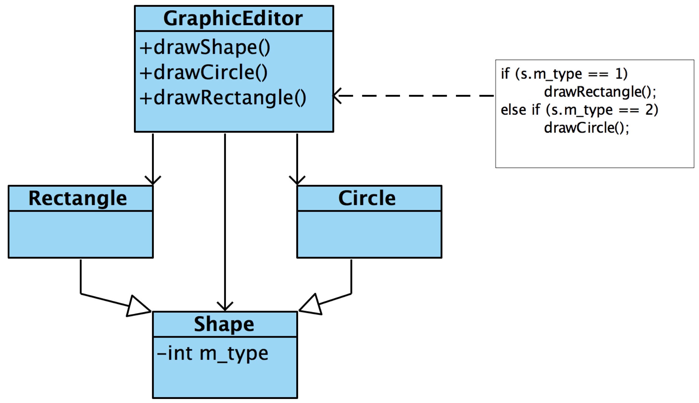

  * Improved

    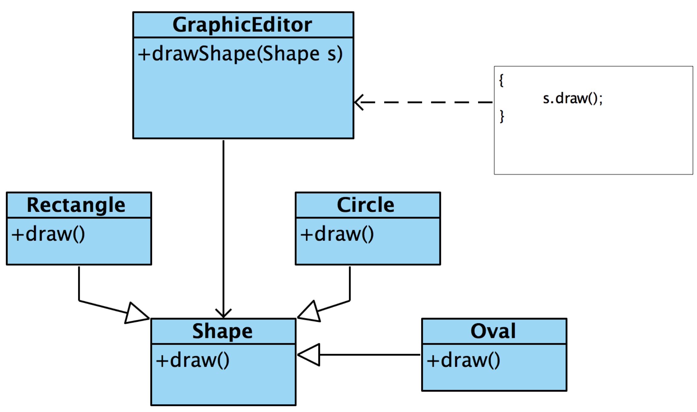

  * **Get rid of IF…THEN…ELSE**

  * **make all obj-data, variables with in an obj private**

    * **Maintaining** public variable/data is always risky, because it may “open” the module for other objects to perform some harmful tasks.
    * They may produce a **rippling effect** requiring maintenance at many unexpected locations, due to code dependencies. 
    * Errors are difficult to be located and fixed. : Fixes may cause undesirable errors elsewhere because of such data dependencies.

  * Implementation:

    * class abstraction(java interface, abstract class,virtual class in cpp)
    * Polyorphism

* Liskov Substitution Principle

  * Key word: Substitutability / Replaceable

  * Definition/Measure of subtyping relation

  * Strong behavioural subtyping

  * An extension of OCP

    * Ensure that new derived subclasses only extending the **base-class**
    * **without changing their behaviour**

  * **Derived subclasses must be completely substitutable for their parent class**(can be changed to other set of implementations)

    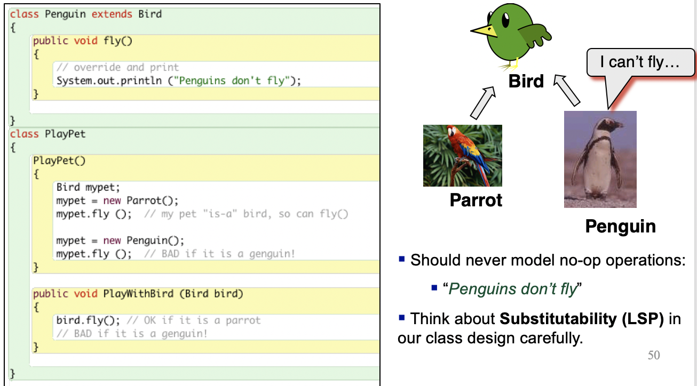

  * **Understand class relationships before** **you design**

    * Don’t guess, have a deeper understanding.
    * Lack of understanding before designing the inheritance hierarchy is likely to beach LSP, which is undesirable.
    * Make sure subclasses can be used to “replace” their parent class. 
    * Subclass could have additional features.  
    * Subclass **should not inherit features don’t exist in the actual context**! (see last example, penguin don’t fly. ).  

  * e.g.: Rectangle / Square

    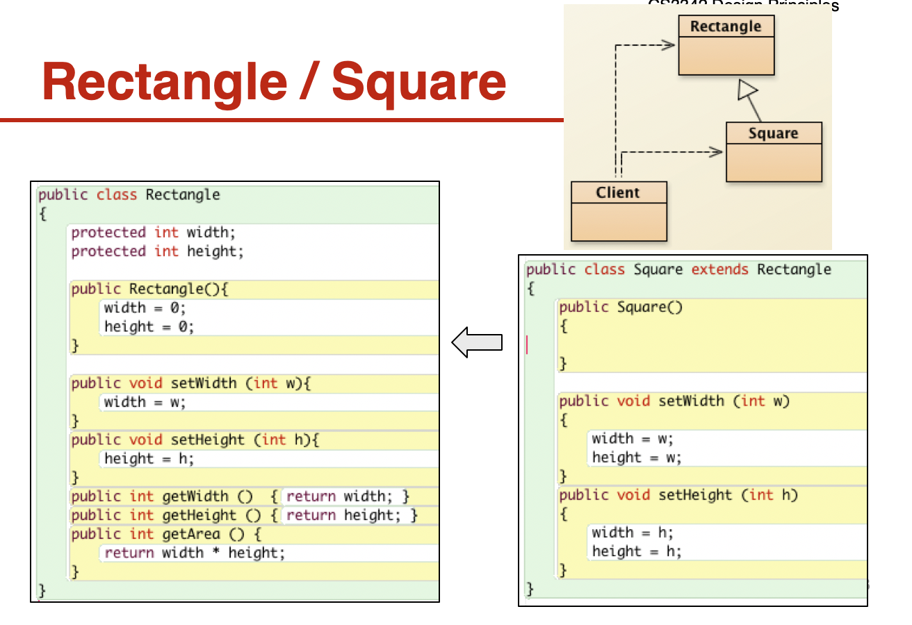

    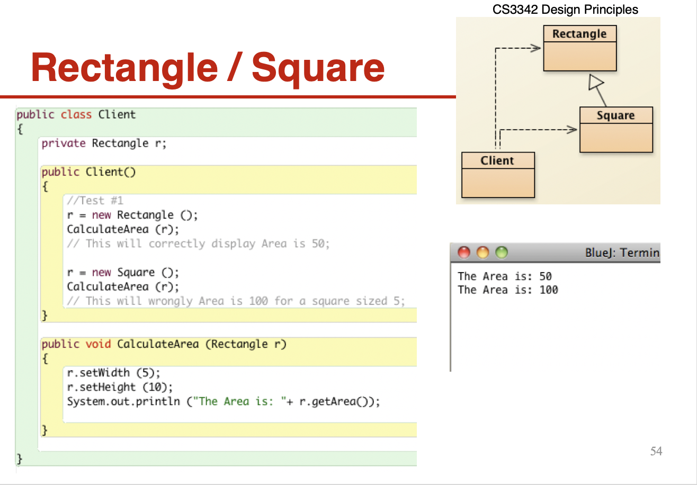

    * different output because of the bad inherance

* Dependency Inversion Principle(DIP)

  * A specific form of decoupling software modules

  * direction of dependency matters

  * *High-level modules* ***should*** ***not*** depend on **Low**-level modules.: Both should depend on abstractions.

  * Abstractions should not depend on details.: Details should depend on abstractions.

  * e.g. powersword: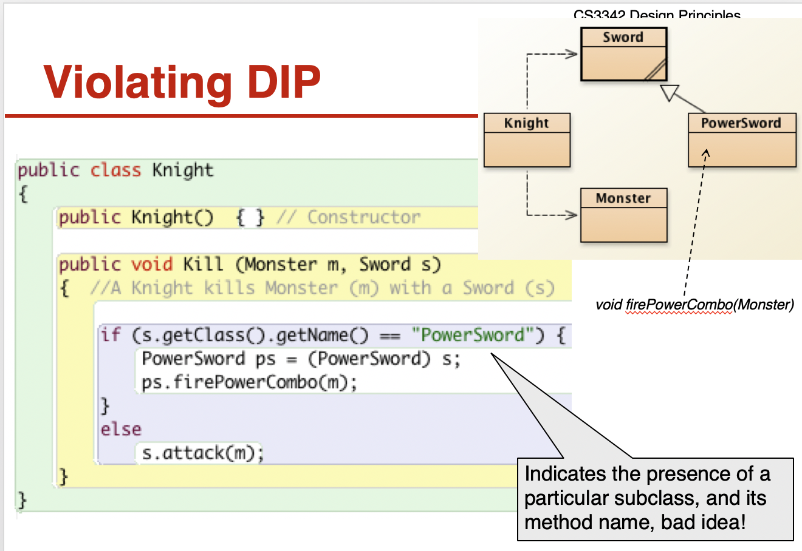

    * highlevel knight should not depend on the low level existence of power sword => should depends on dinamic-binding

    * high level class should provide interface for low level to implement

      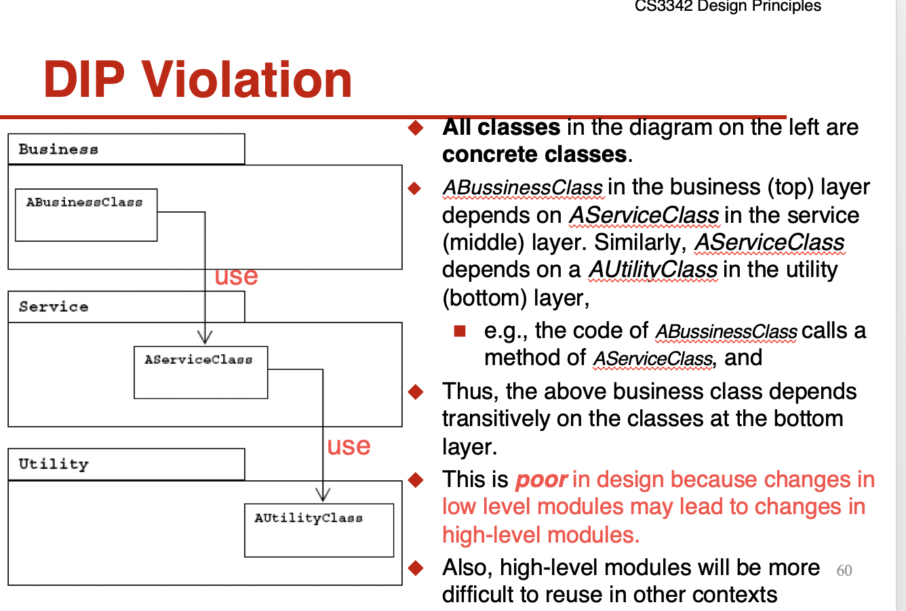

      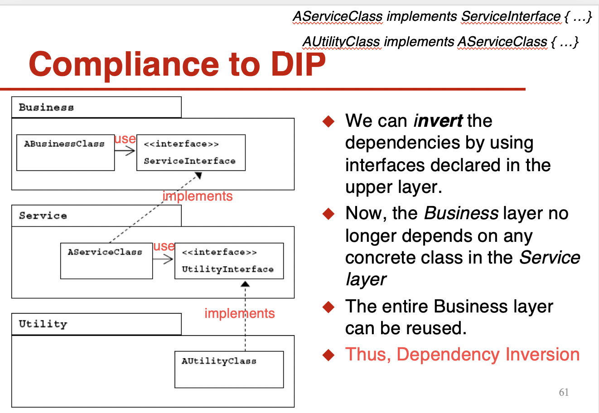

  * 

### Learn General Software Coding Best Practices