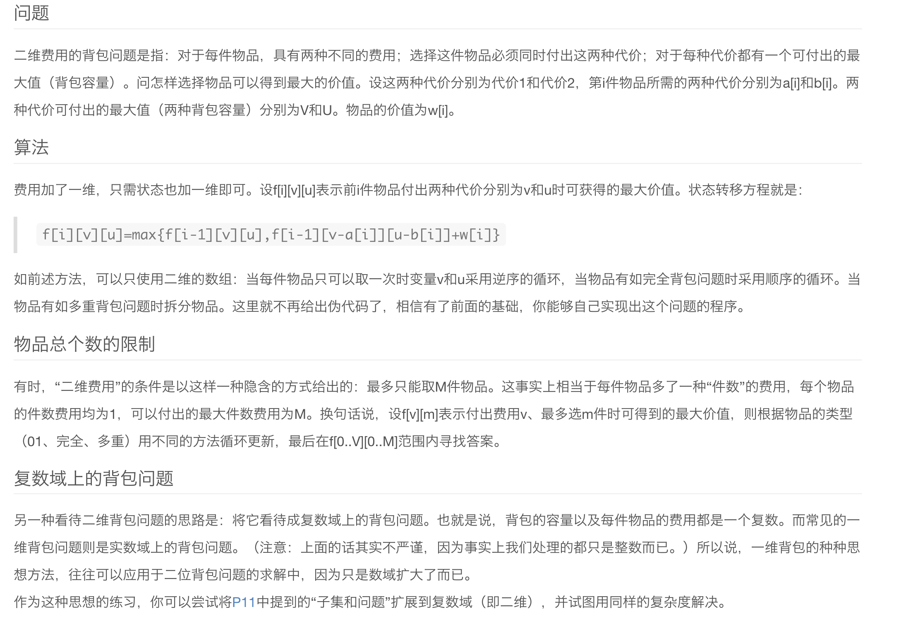
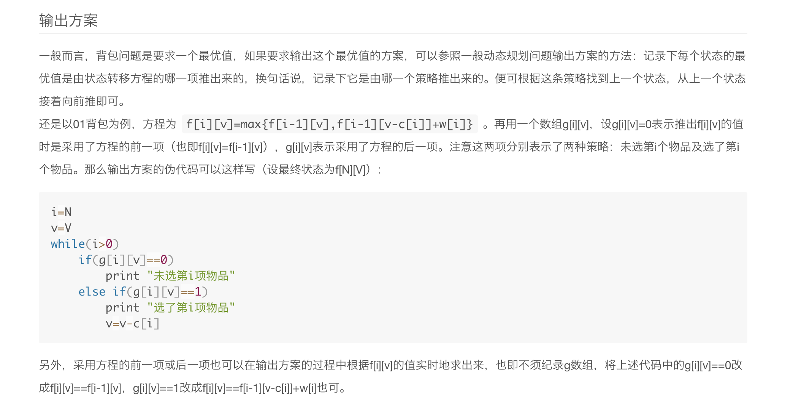
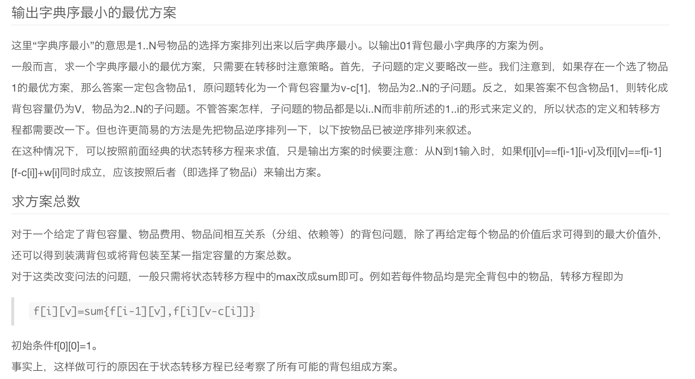
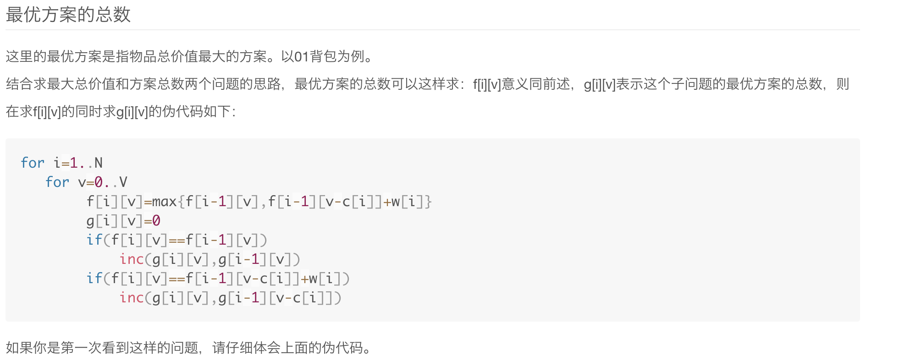
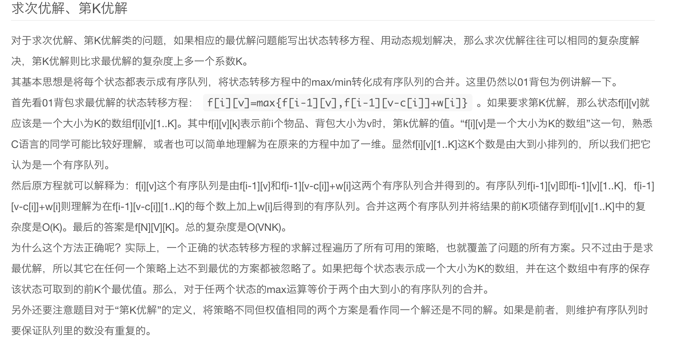

## Basic Knowledge

- Data types

  

  - unsigned version to extend

  - Self-defined class for big number:

    - use an array `bit[]` to represent a big number

    - `bit[0]` store the number of digits

      ```cpp
      r = bit[0];
      n = bit[1]*1+bit[2]*10+...+bit[r]*(10^(r-1))
      ```

      ```cpp
      void numberToArray(int n, int bit[]){
          bit[0] = 0;
          while(n){
      		bit[++bit[0]] = n%10;
              n/=10;
          }
      }
      ```

      Addition: operation, carry-bit, carry flag

      ```cpp
      void add(int a[], int b[], int c[]){
          // operation
          memset(c,0,sizeof(c));
          for(int i=1;i<=a[0];i++)c[i]+=a[i];
          for(int i=1;i<=b[0];i++)c[i]+=b[i];
          c[0] = max(a[0],b[0]);
          // carry-bit
          int flag = 0;
          for(int i=1;i<=c[0];i++){
              c[i]+=flag;
              flag = c[i]/10;
              c[i] = c[i]%10;
          }
          // carry-flag
          if(flag) c[++c[0]]=flag;
          
      }
      ```

    - Mutiplication: operation, carry-bit, carry flag

      ```cpp
      void mutiply(int a[],int b[],int c[]){
      	memset(c,0,sizeof(c));
          for(int i=1;i<=a[0];i++){
              for(int j=1;j<=b[0];j++){
                  c[i+j-1]+=a[i]*b[j];	// i+(j-1)
              }
          }
          c[0]=a[0]+b[0]-1;
          int flag = 0;
          for(int i=1;i<=c[0];i++){
              c[i]+=flag;
              flag = c[i]/10;
              c[i] = c[i]%10;
          }
          while(flag){
              c[++c[0]]=flag%10;
              flag = flag/10;
          }
      }
      ```

    - Speed up: Base could be larger than 10, int can be large as $2^{31}-1$

    - digit compression

    - before(base 10): bit[1,...,n]<10

    - After compression(base: 1e5): bit[1,...n]<1e5

    - **be careful for overflow** 

  - place holders:

    

    

    

- I/O

  

  ```cpp
  // speed up stream I/O
  std::ios_base::sync_with_stdio(false);
  ```

- File I/O

  ```cpp
  FILE* inputfile = fopen("input.txt","r");
  FILE* outputfile = fopen("output.txt","w");
  freopen("input.txt","r",stdin);
  fprintf(outputfile,"%d",num);
  char ch = fgetc(inputfile);
  fgets(buffer,length,stdin);	//will read \n into the buffer
  feof()	// if reach the end-of-file, return 0
  fclose(inputfile); fclose(outputfile);
  ```

- String I/O

  ```cpp
  sprintf(buffer,"%d",n);
  sscanf(buffer,"%d",&n);
  void strcpy(char* src,char* tar){
      sprintf(tar,"%s",src);
  }
  void strcat(char* tar,char* src1,char* src2){
      sprintf(tar,"%s%s",src1,src2);
  }
  int atoi(char* buffer){
      int num;
      sscanf(buffer,"%d",&num);
      return num;
  }
  ```

- Arithmetic functions

  

  - sin(),cos(),tan() accept parameters in radians

  - binary power

    ```cpp
    long long bi_power(int m,int n){
        if(n==0)return 1L;
        else if(n&1) return bi_power(m,n/2)*bi_power(m,n/2)*(long long)m;
        else return bi_power(m,n/2)*bi_power(m,n/2);
    }
    ```

  - self defined log

    ```cpp
    double log(int down,int up){
        return log(up)/log(down);
    }
    ```

  - Bitwise operation

    - Check odd or even: `if(x&1) printf("x is odd");`
    - Check for divisibility of 2's power: `if(x&7) printf("x is not divisible by 8");`
    - Round down to nearest multiple of 2's power: `x=27; =x&(~7)`

- Counting prime:

  ```cpp
  #define MAX 1000000
  int prime[MAX];
  bool rec[MAX+1];
  void init(){
      memset(rec,0,sizeof(rec));
      int cnt = 0;
      for(int i=2;i<=MAX;i++){
          if(!rec[i]) prime[cnt++] = i;
          for(int j=0;j<cnt;j++){
              if(prime[j]*i>MAX)break;
              rec[prime[j]*i] = 1;
              if(i%prime[j]==0)break;
          }
      }
  }
  ```

- String Parsing

  - ```cpp
    char input[80] = "Hi, today is another training of ACM.";
    char *p=input, *cur = input;
    while(*p){
        if(*p==','||*p==' ') {
            *p=0;
        	if(*cur) printf("%s",cur);
            cur = ++p;
        }
        else ++p;
    }
    printf("%s",cur);
    ```

    ```cpp
    char** split(char* buffer, char* spliter,int& len){
        char *ptr = strtok(buffer,spliter);
        char **ans = new char*[100];
        int cnt = 0;
        while(ptr){
            ans[cnt++] = new char[100];
            ans[cnt-1] = ptr;
            ptr = strtok(NULL,spliter);
        }
        len = cnt;
        return ans;
    }
    ```

- nCr

  ```cpp
  combination(set, subset, r) {
  
      if (r == 0) {// the subset contains enough elements
  
          print elements in subset; return;
      }
  
      while (set is not empty) {
          move the first element from set to subset;
          combination(set, subset, r-1);
          remove the last element in subset;
      }
  }
  void comb(int r,int cur_pos,char supset[],vector<char>& subset,int& cnt){
      if(r==0){
          subset.push_back(0);
          printf("%s\n",subset.data());
          subset.erase(subset.end()-1);
          cnt++;
      }
      else{
          for(int i=cur_pos;supset[i];i++){
              subset.push_back(supset[i]);
              comb(r-1,i+1,supset,subset,cnt);
              subset.erase(subset.end()-1);
          }
      }
  }
  ```

- nPr

  

- BFS

  ```cpp
  #define MAX 1000
  bool map[MAX+1][MAX+1];
  bool rec[MAX+1];
  struct Node{
      int id;
      int depth;
      Node(int i,int l):id(i),depth(l){}
  };
  // important: record the node before dequeue
  int bfs(int src,int tar){
      memset(rec,0,sizeof(rec));
      queue<Node*> path;
      path.push(new Node(src,0));rec[src]=1;
      while(true){
          int id = path.front()->id, depth = path.front()->depth; path.pop();
          if(id==tar) break;						//break while find target
          for(int j=1;j<=20;j++){
              if(map[j][id]&&!rec[j]){
                  rec[j] = 1;
                  path.push(new Node(j,depth+1));
              }
          }
      }
      return le;
  }
  ```

- DFS

  ```cpp
  struct Node{
      int val;
      vector<int> next;
  };
  int cnt = 0;
  Node map[10001];
  bool rec[10001];
  void dfs(int s){
      if(rec[s])return;
      rec[s] = 1;cnt++;
      for(int i=0;i<map[s].next.size();i++){
          int tar = (map[s].next)[i];
          if(!rec[tar]) dfs(tar);
      }
  }
  ```

- Topological sort

  - DFS method
    - Use DFS to calculate the finishing time of each vertex
    - As each vertex is finished, insert it onto the front of a list
    - return the list of vertices
  - Second method
    - Remove all node with in-degree 0
    - Decrease the corresponding nodes' degree
    - repeate until all nodes have been removed

- Dijkstra algorithm

  - without heap

    ```cpp
    int map[MAX][MAX];
    int dist[MAX];
    bool rec[MAX];
    int n; // number of nodes
    void dijkstra(int src){
        memset(dist,INF,sizeof(dist));
        memset(rec,0,sizeof(rec));
        dist[src] = 0;
        while(true){
            int nd = -1;
            for(int i=0;i<n;i++){
                if(!rec[i]&&(nd==-1||dist[nd]>dist[i]))nd = i;
            }
            if(nd==-1)break;
            rec[nd] = true;
            for(int i=0;i<n;i++){
                dist[i] 
                    = dist[nd]+map[nd][i]<dist[i]?dist[nd]+map[nd][i]:dist[i];
            }
        }
    }
    ```

    

  - With heap -- stored in matrix

  ```cpp
  #define MAX 201;
  int map[MAX][MAX];
  int dist[MAX];
  int n;
  struct Node{
      int id,dist;
      bool operator>(const Node& b) const{
          return dist<b.dist;
      }
      bool operator<(const Node& b) const{
          return  !operator>(b);
      }
  };
  
  void dijkstra(int src, int tar){
      priority_queue<Node> q;
      fill(dist,dist+n,INF);
      dis[src] = 0;
      q.push((Node){src,0});
      while(!q.empty()){
          Node pre = q.top();q.pop();
          if(pre.id==tar)break;			// important to enhancement
          for(int i=1;i<=n;i++){
              if(i==pre.id) continue;
              if(map[id][i]+pre.dist < dis[i]){
                  dist[i] = map[id][i]+pre.dist;
                  q.push((Node){i,dist[i]});
              }
          }
      }
  }
  ```

  - With heap -- stored as edges

    ```cpp
    struct edge{int tar,cost;};	// store as edge information
    typedef pair<int, int> P;	// stored into the heap, first:cost, second:id
    int V;
    vector<edge> G[MAX];
    int dist[MAX];
    void dijkstra(int src){
        priority_queue<P,vector<P>,greater<P> >q;
        fill(dist,dist+V,INF);
        dist[src] = 0;
        q.push(P(0,src));
        while(!q.empty()){
            P cur = q.top();q.pop();
            int now = cur.second, cost = cur.first;
            if(dist[now]<cost) continue;		// already updated
            for(int i=0;i<G[now].size();i++){
                int tar = G[now][i].tar;
                if(dist[tar]>cost+G[now][i].cost){
                    dist[tar] = cost+G[now][i].cost;
                    q.push(P(dist[tar],tar));
                }
            }
        }
    }
    ```

- Floyd-Warshall algorithm(Any pairs of shortest path)

  ```cpp
  int path[MAX_V]; 
  // for dijkstra
  memset(path,-1,sizeof(path));
  ...;
      if(dist[tar]>cost+map[now][tar]){
          dist[tar] = cost+map[now][tar];
          path[tar] = now;
      }
  ...;
  vector<int> get_path(int t){
      vector<int> p;
      for(;t!=-1;t=path[t])p.push_back(t);
      reverse(p.begin(),p.end());
      return p;
  }
  // for floyd
  int path[MAX_V][MAX_V];
  for(int i=1;i<=n;i++){
  	for(int j=1;j<=n;j++){
  		if(map[i][j]!=-1) path[i][j] = i;
          else path[i][j] = 0;
      }
  }
  for(int k=1;k<=n;k++){
  	for(int i=1;i<=n;i++){
  		for(int j=1;j<=n;j++){
          	if(map[i][j]>map[i][k]+map[k][j]+cost[k]){
              	map[i][j] = map[i][k]+map[k][j]+cost[k];
                  path[i][j] = path[k][j];
              }
          }
      }
  }
  void print(int i,int j){
      if(path[i][j]==i) cout<<i;
      else{
          print(i,path[i][j]);
          cout<<"-->"<<path[i][j];
      }
  }
  ```

- KMP

  ```cpp
  int nxt[100010];
  char str[100001],tmp[100001];
  void getNext(int n){
      int prenxt=0;
      nxt[0] = nxt[1] = 0;
      for(int i=1;i<n;i++){
          while(prenxt>0&&tmp[i]!=tmp[prenxt]) 
              prenxt = nxt[prenxt];
          if(tmp[i]==tmp[prenxt]) prenxt++;
          nxt[i+1] = prenxt;  // i_th iteration, judge the length of i+1(str[0]->str[i])
      }
  }
  void KMP(int n){
      int pos = 0;
      for(int i=0;i<n;i++){
          // if not match, search for the previous smaller substring
          while(pos>0&&str[i]!=tmp[pos])pos = nxt[pos];
          if(str[i]==tmp[pos])pos++;
      }
      printf("%s%s\n",str,tmp+pos);
  }
  ```

-----------

## Sample Questions

* 2 states rough road

  ```cpp
  #include <stdio.h>
  #include <string.h>
  #include <queue>
  #include <vector>
  using namespace std;
  #define MAX 505
  #define INF 0x3f3f3f3f
  struct Edge{int tar, cost;};
  vector<Edge> G[MAX];
  struct Node{
      int id,dist;bool lev;
      bool operator<(const Node& o) const{
          return dist>o.dist;
      }
  };
  int dis[MAX][2];
  int n,r;
  void dijkstra(){
      priority_queue<Node> q;
      memset(dis,INF,sizeof(dis));
      q.push((Node){0,0,0});
      dis[0][0] = 0;
      while(!q.empty()){
          int nd = q.top().id, dist = q.top().dist;
          bool lev = q.top().lev;q.pop();
          if(nd==n-1&&lev==0)break;
          for(int i=0; i<G[nd].size() ;i++){
              Edge& e = G[nd][i]; 
              if(dis[e.tar][1-lev]>dist+e.cost){
                  dis[e.tar][1-lev] = dist+e.cost;
                  q.push((Node){e.tar,dist+e.cost,bool(1-lev)});
              }
          }
      } 
  }
  int main(){
  #ifdef DEBUG 
      freopen("input.txt","r",stdin);
  #endif
      int a,b,c;
      int cnt = 0;
      while(~scanf("%d %d\n",&n,&r)){
          for(int i=0;i<MAX;i++)G[i].clear();
          for(int i=0;i<r;i++){
              scanf("%d %d %d\n",&a,&b,&c);
              G[a].push_back((Edge){b,c});
              G[b].push_back((Edge){a,c});
          }
          dijkstra();
          printf("Set #%d\n",++cnt);
          printf(dis[n-1][0]<INF?"%d\n":"?\n",dis[n-1][0]);
      }
      return 0;
  }
  ```

* Parathesis balance

  ```cpp
  #include <stdio.h>
  #include <string.h>
  #include <limits.h>
  #include <math.h>
  #include <algorithm>
  using namespace std;
  #define MAX 130
  int n;
  char buffer[MAX];
  bool dp[MAX][MAX];
  int main() {
  #ifdef _DEBUG
  	freopen("input.txt", "r", stdin);
  #endif
  	scanf("%d\n", &n);
  	while (n--) {
  		gets(buffer);
  		int size = strlen(buffer);
  		memset(dp, 0, sizeof(dp));
  		for (int i = 0; i < size; i++){dp[i][i] = 1;dp[i][i+1]=0;}
  
  		for (int len = 2; len <= size; len++) {
  			for (int i = 0; i + len <= size; i++) {
  				int j = i + len;
  				if ((buffer[i] == '('&&buffer[j-1] == ')') || (buffer[i] == '['&&buffer[j-1] == ']')) {
  					dp[i][j] |= dp[i + 1][j - 1];
  				}
  				for (int k = i + 2; k < j-1; k++) {
  					dp[i][j] |= (dp[i][k] && dp[k][j]);
  				}
  			}
  		}
  		printf(dp[0][size]||size==0 ?"Yes\n":"No\n");
  	}
  	return 0;
  }
  ```

* Hash+dijkstra => minimun effort

  ```cpp
  #include <stdio.h>
  #include <string.h>
  #include <iostream>
  #include <sstream>
  #include <queue>
  #include <string>
  #include<algorithm>
  using namespace std;
  
  
  int n,p,s,t;
  char places[210][30],tmp[50];
  int Map[210][210],path[210],dis[210];
  struct Node{
      int id;
      int dist;
      Node(int a,int b):id(a),dist(b){}
      bool operator>(const Node& b)const{
          return dist<b.dist;
      }
      bool operator<(const Node& b)const{
          return !this->operator>(b);
      }
  };
  void dijkstra(int src,int tar){
      priority_queue<Node> q;
      memset(dis,0x3f3f3f,sizeof(dis));
      q.push(Node(src,0));
      dis[src]=0;
      path[src]=src;
      while(!q.empty()){
          int id = q.top().id, dist = q.top().dist; 
          q.pop();
          if(id==tar)
              break;
          for(int i=0;i<n;i++){
              if(i==id)continue;
              if(dis[i]>Map[id][i]+dist){
                  dis[i] = Map[id][i]+dist;
                  path[i] = id;
                  q.push(Node(i,dis[i]));
              }
          }
      }
  }
  void print(string &s,int src,int tar){
      if(path[tar]==-1)while(1);
      if(tar==src)return;
      else{
          print(s,src,path[tar]);
          s=s+" -> " + places[tar];
      }
  }
  int hashcode(char* str){
      int hash = 0;
      for(int i=0;str[i];i++) hash=(str[i]+hash*37)%n;
      return hash%n;
  }
  int insert(char* str){
      int hash = hashcode(str);
      while(places[hash][0]!=0)hash=(hash+1)%n;
      strcpy(places[hash],str);
      return hash;
  }
  int find(char* str){
      int hash = hashcode(str);
      while(strcmp(places[hash],str)!=0)hash=(hash+1)%n;
      return hash;
  }
  int main(){
  #ifdef DEBUG
      freopen("input.txt","r",stdin);
  #endif
      while(cin>>n){
          memset(places,0,sizeof(places));
          memset(Map,0x3f3f3f,sizeof(Map));
          memset(path,-1,sizeof(path));
          getchar();
          for(int i=0;i<n;i++){
              cin.getline(tmp,50);
              int pos=insert(tmp);
              if(strcmp(tmp,"office")==0)s = pos;
              if(strcmp(tmp,"hall")==0)t = pos;
          }
          cin>>p;
          getchar();
          for(int i=0;i<p;i++){
              cin.getline(tmp,50);
              int j;
              for(j=0;tmp[j]&&tmp[j]!=':';j++);
              tmp[j] = 0;
              int a = find(tmp);
              int b=-1,pos;
              for(int k=0;k<n;k++){
                  int j2 = 0;
                  while(places[k][j2]==tmp[j2+j+1])j2++;
                  if(!places[k][j2]){ b=k;pos=j2+j+1;}
              }
              stringstream input(tmp+pos);
              int d;
              for(int j=0;input>>d;j++){
                  if(!j) Map[a][b] = min(Map[a][b],d);
                  else Map[b][a] = min(Map[b][a],d);
              }
          }
          dijkstra(s,t);
          int ans = dis[t];
          string Path = "office";
          print(Path,s,t);
          memset(path,-1,sizeof(path));
          dijkstra(t,s);
          ans+=dis[s];
          print(Path,t,s);
          cout<<ans<<endl;
          cout<<Path<<endl<<endl;
      }
      return 0;
  }
  ```

* Bracket sequence

  ```cpp
  #include <stdio.h>
  #include <string.h>
  
  char str[101];
  int dp[101][101];
  int t;
  int main(){
  #ifdef DEBUG
      freopen("input.txt","r",stdin);
  #endif
      scanf("%d",&t);getchar();
      while(t--){
          getchar();
          gets(str);
          int n = strlen(str);
          for(int i=0;i<n;i++) dp[i][i] = 1;
          for(int i=1;i<n;i++){
              for(int j=0;j+i<n;j++){
                  dp[j][j+i] = 1000000;
                  if((str[j]=='('&&str[j+i]==')')||(str[j]=='['&&str[j+i]==']')){
                      dp[j][j+i] = dp[j+1][j+i-1];
                  }
                  for(int k=j;k<j+i;k++){
                      if(dp[j][j+i]>dp[j][k]+dp[k+1][j+i]){
                          dp[j][j+i] = dp[j][k]+dp[k+1][j+i];
                      }
                  }
              }
          }
          printf("%d\n",dp[0][n-1]+n);
          if(t)printf("\n");
      }
      return 0;
  }
  ```

* Shortest super and longest sub strings

  ```cpp
  #include <stdio.h>
  #include <string.h>
  
  char str1[1001],str2[1001];
  int dp[1001][1001];
  int l1,l2;
  int main(){
  #ifdef DEBUG
      freopen("input.txt","r",stdin);
  #endif
      gets(str1);
      while(gets(str1)){
          gets(str2);
          int len1=strlen(str1),len2=strlen(str2);
          memset(dp,0,sizeof(dp));
          for(int i=1;i<=len1;i++){
              for(int j=1;j<=len2;j++){
                  if(str1[i-1]==str2[j-1])dp[i][j] = dp[i-1][j-1]+1;
                  dp[i][j] = dp[i][j]>dp[i-1][j]?dp[i][j]:dp[i-1][j];
                  dp[i][j] = dp[i][j]>dp[i][j-1]?dp[i][j]:dp[i][j-1];
              }
          }
          printf("%d\n",len1+len2-dp[len1][len2]);
      }
      return 0;
  }
  ```

* Donuts on Grid

  ```cpp
  #include <stdio.h>
  #include <string.h>
  #include <iostream>
  #include <algorithm>
  using namespace std;
  
  int t,r,c,dp[51][51][51][51];
  char mat[51][51];
  bool isDon(int x1,int y1,int x2,int y2){
      for(int i=y1; i<=y2 ;i++){
          if(mat[x1][i]!='0'||mat[x2][i]!='0')return false;
      }
      for(int i=x1;i<=x2;i++){
          if(mat[i][y1]!='0'||mat[i][y2]!='0')return false;
      }
      return true;
  }
  int main(){
  #ifdef DEBUG
      freopen("input.txt","r",stdin);
  #endif
      scanf("%d",&t);
      for(int n=0;n<t;n++){
          scanf("%d\n",&r);
          for(int i=0;i<r;i++) gets(mat[i]);
          c = strlen(mat[0]);
          memset(dp,0,sizeof(dp));
          for(int dx = 2;dx<r;dx++){
              for(int dy = 2;dy<c;dy++){
                  for(int x = 0; x+dx<r; x++){
                      for(int y=0; y+dy<c; y++){
                          int x1 = x+dx, y1 = y+dy;
                  dp[x][y][x1][y1] = max(dp[x][y][x1][y1], dp[x+1][y][x1][y1]);
                  dp[x][y][x1][y1] = max(dp[x][y][x1][y1], dp[x][y+1][x1][y1]);
                  dp[x][y][x1][y1] = max(dp[x][y][x1][y1], dp[x][y][x1-1][y1]);
                  dp[x][y][x1][y1] = max(dp[x][y][x1][y1], dp[x][y][x1][y1-1]);
                  if(isDon(x,y,x1,y1))
  		dp[x][y][x1][y1] = max(dp[x][y][x1][y1], dp[x+1][y+1][x1-1][y1-1]+1);
                      }
                  }
              }
          }
          printf("Case #%d: %d\n",n+1,dp[0][0][r-1][c-1]);
      }
      return 0;
  }
  ```

* Monster => standard dijkstra

  ```cpp
  #include <stdio.h>
  #include <string.h>
  #include <queue>
  #include <vector>
  #include <math.h>
  #include <algorithm>
  using namespace std;
  #define MAX 105
  #define INF 0x3f3f3f3f
  struct Edge {
  	int tar, cost;
  };
  vector<Edge> G[MAX];
  int lev[MAX], dis[MAX];
  int m, n;
  struct Node {
  	int id, dist, minl, maxl;
  	bool operator<(const Node& o) const {
  		return dist > o.dist;
  	}
  };
  inline bool isok(int a, int b, int c) {
  	return (b == -1 && c == -1) || (abs(a - b) <= m && abs(c - a) <= m);
  }
  void dijkstra() {
  	priority_queue<Node> q;
  	memset(dis, INF, sizeof(dis));
  	dis[0] = 0;
  	q.push({0,dis[0],lev[0],lev[0]});
  	while (!q.empty()) {
  		int id = q.top().id, dist = q.top().dist, 
          minl = q.top().minl, maxl = q.top().maxl;
  		q.pop();
  		if (id == 1) return;
  		for (int i = 0; i < G[id].size(); i++) {
  			Edge& e = G[id][i];
  			if (dis[e.tar] > e.cost + dist&&isok(lev[e.tar],minl,maxl)) {
  				dis[e.tar] = e.cost + dist;
  				int nmin = minl == -1 ? lev[e.tar] : min(minl, lev[e.tar]);
  				int nmax = maxl == -1 ? lev[e.tar] : max(maxl, lev[e.tar]);
  				q.push({e.tar,dis[e.tar],nmin,nmax});
  			}
  		}
  	}
  }
  int main() {
  #ifdef _DEBUG
  	freopen("input.txt", "r", stdin);
  #endif
  	while (~scanf("%d %d\n", &m, &n)) {
  		for (int i = 0; i < MAX; i++)G[i].clear();
  		lev[0] = -1;
  		int c, t;
  		for (int i = 1; i <= n; i++) {
  			scanf("%d %d %d\n", &c, lev + i, &t);
  			G[0].push_back({ i,c });
  			int mon, tc;
  			for (int j = 0; j < t; j++) {
  				scanf("%d %d\n", &mon, &tc);
  				G[mon].push_back({ i,tc });
  			}
  
  		}
  		dijkstra();
  		printf("%d\n",dis[1]);
  	}
  	return 0;
  }
  ```

* Chemical_Manipulation => quick find + floyd

  ```cpp
  #include <stdio.h>
  #include <string.h>
  #include <iostream>
  using namespace std;
  #define MAX 1005
  
  int n, G[MAX][MAX];
  int partition(int row){
      int lo=0,hi=n-1,mid=-1,down, up;
      while(mid!=n/2){
          for(down=lo,up=hi;down<up;){
              while(G[row][down]<=G[row][lo]&&down<hi) down++;
              while(G[row][up]>G[row][lo]) up--;
              if(down<up) swap(G[row][down],G[row][up]);
          }
          swap(G[row][up],G[row][lo]);
          mid = up;
          if(mid<n/2){
              lo = mid+1;
          }
          else{
              hi = mid-1;
          }
      }
  
      return mid;
  }
  
  int main(){
  #ifdef DEBUG 
      freopen("input.txt","r",stdin);
  #endif
      while(~scanf("%d\n", &n)){
          for(int i=0;i<n;i++){
              for(int j=0;j<n;j++){
                 scanf("%d",G[i]+j); 
              }
          }
          for(int k=0;k<n;k++){
              for(int i=0;i<n;i++){
                  for(int j=0;j<n;j++){
                      if(G[i][j]>G[i][k]+G[k][j]){
                          G[i][j] = G[i][k] + G[k][j]; 
                      } 
                  }            
              }
          }
           
          for(int i=0;i<n;i++){
              int mid = partition(i);
              if(n&1)printf("%d\n",G[i][mid]);
              else if((G[i][mid-1]&1)==(G[i][mid]&1)) printf("%d\n",(G[i][mid]+G[i][mid-1])/2);
              else printf("%.1lf\n",((double)G[i][mid-1]+(double)G[i][mid])/2.0);
          }
      }
      
      return 0;
  }
  ```

* phone call => dp

  ```cpp
  #include <stdio.h>
  #include <string.h>
  int num;
  int y,mon,h,min;
  char op;
  struct Record{
      int val;
      bool need;
      int year;
      Record(){}
      Record(int a,int b,int c):val(a),need(b),year(c){}
  };
  Record rec[1001];
  int dp[1001];
  int main(){
  #ifdef DEBUG
      freopen("input.txt","r",stdin);
  #endif
      while(~scanf("%d",&num)&&num){
          int start = -1,year = 0;
          for(int i=0;i<num;i++){
              int tmp;
              scanf("%d:%d:%d:%d %*s %c\n",&y,&mon,&h,&min,&op);
              if(start<0&&op=='+') start = i; 
              rec[i] = Record(y*1000000+mon*10000+h*100+min,op=='+',year);
              if(rec[i].val<=rec[i-1].val){rec[i].year++;year++;}
              dp[i] = num - i;
          }
          int end = num-1;
          while(true){
              if(rec[end].year==rec[num-1].year) dp[end] = 1;
              if(rec[end].need||rec[end].year!=rec[num-1].year)break;
              end--;
          }
          for(int i=end;i>=start;i--){
              for(int j=i+1;j<num;j++){
                  // all entry between the current one and the next '+' will be covered
                  if(rec[j].year==rec[i].year) dp[i] = (dp[i]<dp[j]+1)?dp[i]:dp[j]+1;
                  else if(rec[i].val>=rec[j].val&&rec[j].year==rec[i].year+1) dp[i] = (dp[i]<dp[j]+1)?dp[i]:dp[j]+1;
                  else break;
                  if(rec[j].need)break;
              }
          }
          printf("%d\n",dp[start]);
      }
      return 0;
  }
  ```

* Tree dp

  ```cpp
  #include <stdio.h>
  #include <string.h>
  #include <algorithm>
  #include <iostream>
  #include <queue>
  #define MAX 1000005
  int Tail[MAX], Next[MAX], to[MAX];
  int imp[MAX];
  int rec[MAX];
  int father[MAX];
  unsigned long long dp[MAX][2];
  int cnt;
  int n;
  void add(int src, int tar) {
      Next[cnt] = Tail[src];
      to[cnt] = tar;
      Tail[src] = cnt++;
  }
  unsigned long long cnt1 = 0, cnt2 = 0;
  int bfs() {
      std::queue<int> q;
      for(int i = 1; i <= n; i++) {
          if(Tail[i] == -1)q.push(i);
      }
      while(1) {
          int id = q.front();
          q.pop();
          cnt1 = cnt2 = 0;
          for (int i = Tail[id]; i != -1; i = Next[i]) {
              int cid = to[i];
              cnt1 += std::max(dp[cid][0], dp[cid][1]);
              cnt2 += dp[cid][0];
          }
          dp[id][0] = cnt1;
          dp[id][1] = cnt2 + imp[id];
          rec[father[id]]--;
          if(father[id] == 0)return id;
          if(rec[father[id]] <= 0)q.push(father[id]);
      }
  
  }
  int main() {
  #ifdef DEBUG
      freopen("input.txt", "r", stdin);
  #endif
      while (~scanf("%d\n", &n)) {
          memset(Tail, -1, sizeof(Tail));
          memset(dp, 0, sizeof(dp));
          memset(rec, 0, sizeof(rec));
          memset(father, 0, sizeof(father));
          cnt = 0;
          for (int i = 1; i <= n; i++)scanf("%d", imp + i);
          int u, v;
          for (int i = 0; i < n - 1; i++) {
              scanf("%d %d\n", &u, &v);
              rec[u]++;
              father[v] = u;
              add(u, v);
          }
          int src = bfs();
          std::cout << std::max(dp[src][0], dp[src][1]) << "\n";
      }
      return 0;
  }
  ```

* Employee planning

  ```cpp
  #include <stdio.h>
  #include <string.h>
  #include <limits.h>
  #include <iostream>
  using namespace std;
  #define MAX 1005
  #define INF 0x3f3f3f3f
  int dp[15][MAX];
  int emp[15];
  int n,hire_cost,fire_cost,salary;
  int main(){
  #ifdef DEBUG
      freopen("input.txt","r",stdin);
  #endif
      while(~scanf("%d\n",&n)&&n){
          scanf("%d %d %d\n",&hire_cost,&salary,&fire_cost);
          int max_emp = 0;
          for(int i=0;i<n;i++){
              scanf("%d", emp+i);
              max_emp = emp[i]>max_emp?emp[i]:max_emp;
          }
          memset(dp,INF,sizeof(dp));
          for(int i=emp[0];i<=max_emp;i++) dp[0][i]=(hire_cost+salary)*i;
          for(int i=1;i<n;i++){
              for(int e=emp[i];e<=max_emp;e++){
                  for(int pe=emp[i-1];pe<=max_emp;pe++){
                      if(pe>=e) dp[i][e] =min(dp[i][e], dp[i-1][pe]+fire_cost*(pe-e)+salary*e);
                      else      dp[i][e] =min(dp[i][e], dp[i-1][pe]+hire_cost*(e-pe)+salary*e);
                  }
              }
          }
          int ans=0x7fffffff;
          for(int i=emp[n-1];i<=max_emp;++i)
              ans=min(ans,dp[n-1][i]);
          printf("%d\n",ans); 
      }
      return 0;
  
  ```

* Converted backpack => dp+Linear search

  ```cpp
  #include <stdio.h>
  #include <string.h>
  #include <limits.h>
  #include <algorithm>
  #include <float.h>
  using namespace std;
  #define MAX 101
  #define INF 10000
  int n;
  float pr;
  int w[MAX];
  float p[MAX], dp[INF];
  int main(){
  #ifdef DEBUG
      freopen("input.txt","r",stdin);
  #endif
      while(~scanf("%d %f\n",&n,&pr)){
          memset(dp,0,sizeof(dp));
          pr = 1.0 - pr;
          int cnt = 0;
          for(int i=1;i<=n;++i){
              scanf("%d %f\n",w+i,p+i);
              cnt += w[i];
              p[i] = 1.0 - p[i];
          }
          dp[0] = 1.0;
          for(int i=1;i<=n;i++){
              for(int j=cnt;j>=0;j--){
                  dp[j] = max(dp[j],dp[j-w[i]]*p[i]);
                  // printf("%10f ",dp[j]);
              }
              // cout << endl;
          }
          int m = 0;
          for(int i=0;i<=cnt;i++){
              if(dp[i]>=pr&&i>m)m = i;
          }
          printf("%d\n",m);
      }
      return 0;
  }
  ```

* Back pack

  * zeroonepack(每个物品一次)

    ```pseudocode
    for i=1..N
        for v=V..0
            f[v]=max{f[v],f[v-c[i]]+w[i]};
    ```

    * e.g. supersale

    ```cpp
    #include <stdio.h>
    #include <string.h>
    #include <algorithm>
    int dp[31],p[1001],w[1001],n,g,t;
    int main(){
    #ifdef DEBUG
        freopen("input.txt","r",stdin);
    #endif
        scanf("%d",&t);
        while(t--){
            scanf("%d",&n);
            for(int i=1;i<=n;i++) scanf("%d %d",p+i,w+i);
            memset(dp,0,sizeof(dp));
            for(int i=1;i<=n;i++)
                for ( int j = 30 ; j >= w[i] ; j--)
                    dp[j] = std::max(dp[j],dp[j-w[i]]+p[i]);
            scanf("%d",&g);
            int cnt = 0;
            while(g--){
                int tmp;
                scanf("%d",&tmp);
                cnt+=dp[tmp];
            }
            printf("%d\n",cnt);
        }
        return 0;
    }
    ```

  * complete pack（每个物品无数次）=》 coin change

    ```cpp
    for i=1..N
        for v=0..V
            f[v]=max{f[v],f[v-cost]+weight}
    ```

    * e.g. coin change

      ```cpp
      #include <stdio.h>
      #include <string.h>
      #define MAX 7490
      int dp[MAX], cost[6] = { 0,1,5,10,25,50 }, num;
      int main() {
      #ifdef _DEBUG
      	freopen("input.txt", "r", stdin);
      #endif
      	memset(dp, 0, sizeof(dp));
      	dp[0] = 1;
      	for (int i = 1; i <= 5; i++) {
      		for (int j = 1; j <= 7489; j++) {
      			dp[j] = (j >= cost[i]) ? dp[j] + dp[j - cost[i]] : dp[j];
      		}
      	}
      	while (~scanf("%d", &num)) {
      		printf("%d\n", dp[num]);
      	}
      	return 0;
      }
      ```

  * Multiple pack

    ```pseudocode
    procedure MultiplePack(cost,weight,amount)
        if cost*amount>=V
            CompletePack(cost,weight)
            return
        integer k=1
        while k<amount
            ZeroOnePack(k*cost,k*weight)
            amount=amount-k
            k=k*2
        ZeroOnePack(amount*cost,amount*weight)
    ```

  * 混合

    ```pseudocode
    for i=1..N
        if 第i件物品属于01背包
            ZeroOnePack(c[i],w[i])
        else if 第i件物品属于完全背包
            CompletePack(c[i],w[i])
        else if 第i件物品属于多重背包
            MultiplePack(c[i],w[i],n[i])
    ```

  * 

  * 分组背包（组内冲突，只选一件）

    ```pseudocode
    for 所有的组k
        for v=V..0
            for 所有的i属于组k
                f[v]=max{f[v],f[v-c[i]]+w[i]}
    ```

  * 

  * 

  * 

  * 