# CS 3391 Note

------------

* Data types

  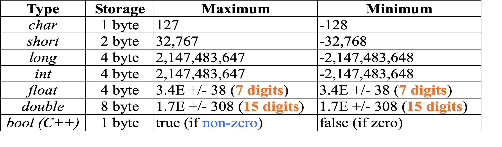

  * unsigned version to extend

  * Self-defined class for big number:

    * use an array `bit[]` to represent a big number

    * `bit[0]` store the number of digits

      ```cpp
      r = bit[0];
      n = bit[1]*1+bit[2]*10+...+bit[r]*(10^(r-1))
      ```

      ```cpp
      void numberToArray(int n, int bit[]){
          bit[0] = 0;
          while(n){
      		bit[++bit[0]] = n%10;
              n/=10;
          }
      }
      ```

      Addition: operation, carry-bit, carry flag

      ```cpp
      void add(int a[], int b[], int c[]){
          // operation
          memset(c,0,sizeof(c));
          for(int i=1;i<=a[0];i++)c[i]+=a[i];
          for(int i=1;i<=b[0];i++)c[i]+=b[i];
          c[0] = max(a[0],b[0]);
          // carry-bit
          int flag = 0;
          for(int i=1;i<=c[0];i++){
              c[i]+=flag;
              flag = c[i]/10;
              c[i] = c[i]%10;
          }
          // carry-flag
          if(flag) c[++c[0]]=flag;
          
      }
      ```

    * Mutiplication: operation, carry-bit, carry flag

      ```cpp
      void mutiply(int a[],int b[],int c[]){
      	memset(c,0,sizeof(c));
          for(int i=1;i<=a[0];i++){
              for(int j=1;j<=b[0];j++){
                  c[i+j-1]+=a[i]*b[j];	// i+(j-1)
              }
          }
          c[0]=a[0]+b[0]-1;
          int flag = 0;
          for(int i=1;i<=c[0];i++){
              c[i]+=flag;
              flag = c[i]/10;
              c[i] = c[i]%10;
          }
          while(flag){
              c[++c[0]]=flag%10;
              flag = flag/10;
          }
      }
      ```

    * Speed up: Base could be larger than 10, int can be large as $2^{31}-1$

    * digit compression

    * before(base 10): bit[1,...,n]<10

    * After compression(base: 1e5): bit[1,...n]<1e5

    * **be careful for overflow** 

  * place holders:

    

    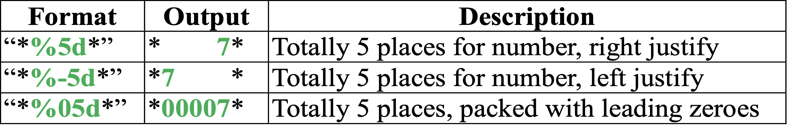

    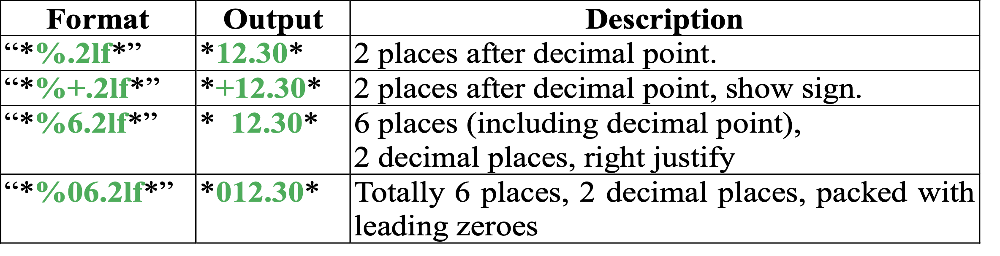

* I/O

  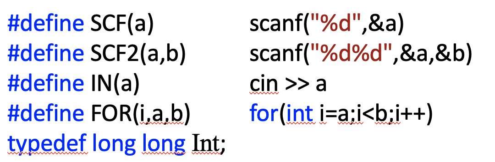

  ```cpp
  // speed up stream I/O
  std::ios_base::sync_with_stdio(false);
  ```

* File I/O

  ```cpp
  FILE* inputfile = fopen("input.txt","r");
  FILE* outputfile = fopen("output.txt","w");
  freopen("input.txt","r",stdin);
  fprintf(outputfile,"%d",num);
  char ch = fgetc(inputfile);
  fgets(buffer,length,stdin);	//will read \n into the buffer
  feof()	// if reach the end-of-file, return 0
  fclose(inputfile); fclose(outputfile);
  ```

* String I/O

  ```cpp
  sprintf(buffer,"%d",n);
  sscanf(buffer,"%d",&n);
  void strcpy(char* src,char* tar){
      sprintf(tar,"%s",src);
  }
  void strcat(char* tar,char* src1,char* src2){
      sprintf(tar,"%s%s",src1,src2);
  }
  int atoi(char* buffer){
      int num;
      sscanf(buffer,"%d",&num);
      return num;
  }
  ```

* Arithmetic functions

  

  * sin(),cos(),tan() accept parameters in radians

  * binary power

    ```cpp
    long long bi_power(int m,int n){
        if(n==0)return 1L;
        else if(n&1) return bi_power(m,n/2)*bi_power(m,n/2)*(long long)m;
        else return bi_power(m,n/2)*bi_power(m,n/2);
    }
    ```

  * self defined log

    ```cpp
    double log(int down,int up){
        return log(up)/log(down);
    }
    ```

  * Bitwise operation

    * Check odd or even: `if(x&1) printf("x is odd");`
    * Check for divisibility of 2's power: `if(x&7) printf("x is not divisible by 8");`
    * Round down to nearest multiple of 2's power: `x=27; =x&(~7)`

* Counting prime

  * Euler's method

  * Proof: 

    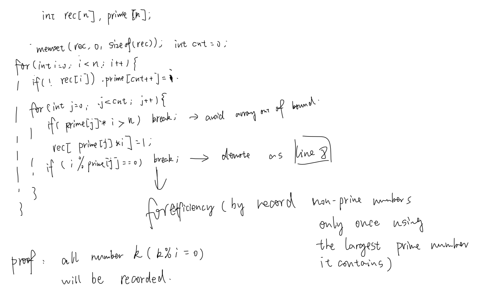

    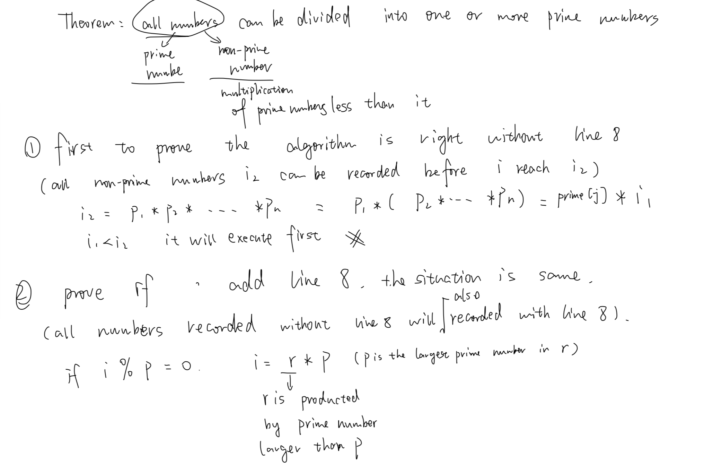

    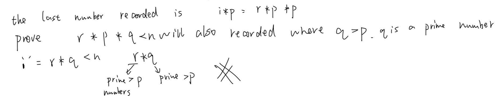

    ```cpp
    #define MAX 1000000
    int prime[MAX];
    bool rec[MAX+1];
    void init(){
        memset(rec,0,sizeof(rec));
        int cnt = 0;
        for(int i=2;i<=MAX;i++){
            if(!rec[i]) prime[cnt++] = i;
            for(int j=0;j<cnt;j++){
                if(prime[j]*i>MAX)break;
                rec[prime[j]*i] = 1;
                if(i%prime[j]==0)break;
            }
        }
    }
    ```

* Rational Numbers: 

  * each rational number $x \over y$ can be represented by 2 integers x and y, where x is the numberator and y is the denominator
    * Addition: $x = x_1y_2+x_2y_1$, $y = y_1y_2$
    * Subtraction: : $x = x_1y_2-x_2y_1$, $y = y_1y_2$
    * Mutiplication: $x = x_1x_2$,$y=y_1y_2$
    * Division: $x = x_1y_2$,$y=x_2y_1$
    * Reduce the fractoins to their simplest representation => use **greatest common divisor (GCD)**
  * Also can use two number one is integer part, the other is the fraction part (with a significant digits)
  * How to find such a fraction for representing an infinite decimal number?
    * e.g. Find ${a \over b} =0.0123123…$ 
    * Set repeated part $R = 123$ and set length of repeated part $L=3$ 
    * consider $10^{L}*({a \over b})-{a \over b}=12.3..=R/10$
    * Hence $a/b = R/10/(10^3-1) = {123 \over 9990}$  

* Modular Arithmetic: The number we are dividing by is called the modulus, and the remainder left over is called residue

  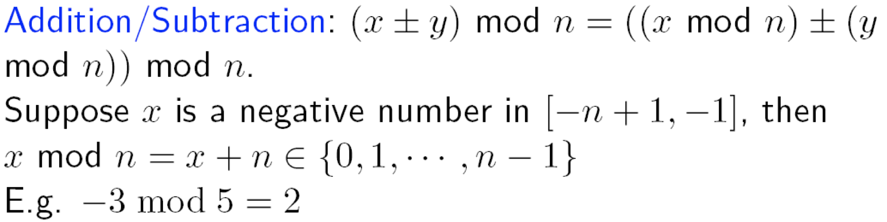

  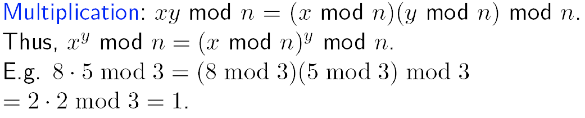

  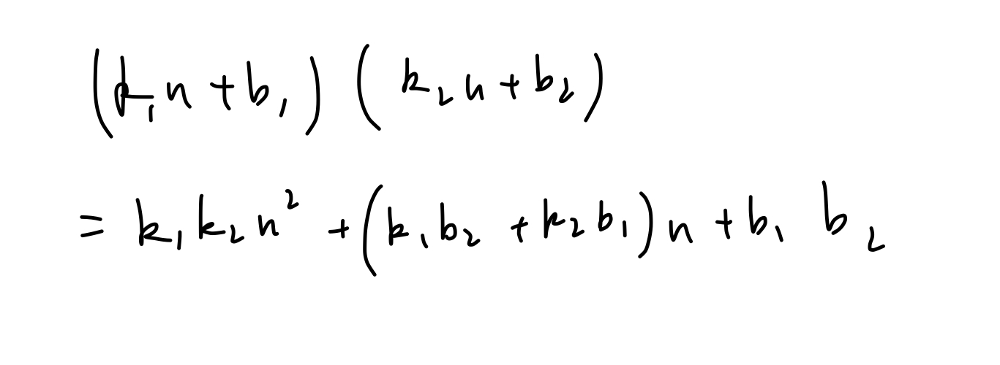

  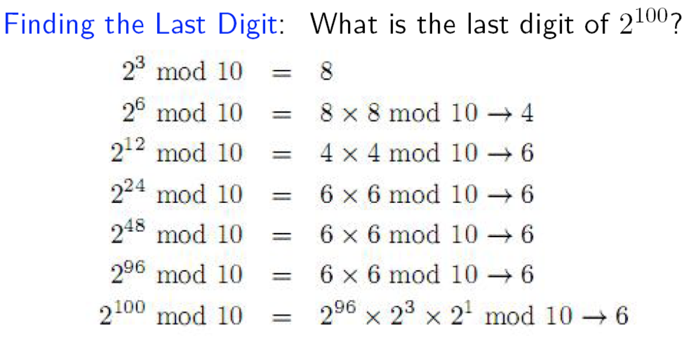

* GCD: The largest divisor shared by a given pair of integers

  * 2 integers are **relatively prime** if their GCD is 1

  * Important Theorem related to GCD(Euclidean’s algorithm) => If $a = qb+r$ for some integer q and r, then $gcd(a,b) = gcd(r,b)=gcd(a\ mod\ b,b)$ 

  * Extended Euclid’s Algorithm:solve the equation $ax+by=gcd(a,b)$ 

    * Always keep the first parameter of gcd to be the larger one
    * Base case: If the second parameter is zero, that means the previous $gcd(a,b)$ satisfies $a\%b = 0$ , and $b$ becomes current $a$, then $a$ itself is gcd => $gcd*1+0 = gcd$ 

    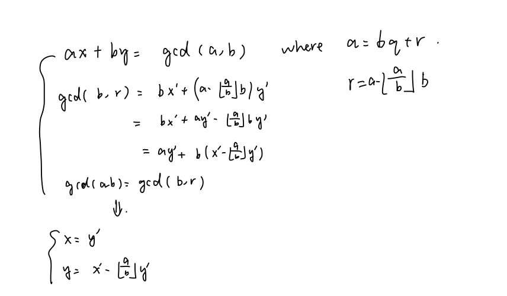

    ```cpp
    long gcd(long p, long q, long* x, long* y){
        long x1, y1;
        long g;
        if(q>p) return gcd(q,p,y,x);
        if(q==0){
            *x = 1;
            *y = 0;
            return p;
        }
        g = gcd(q,p%q,&x1,&y1);
        
        *x = y1;
        *y = (x1 - floor(p/q)*y1);
        return g;
    }
    ```

  * LCM (least common multiple)

    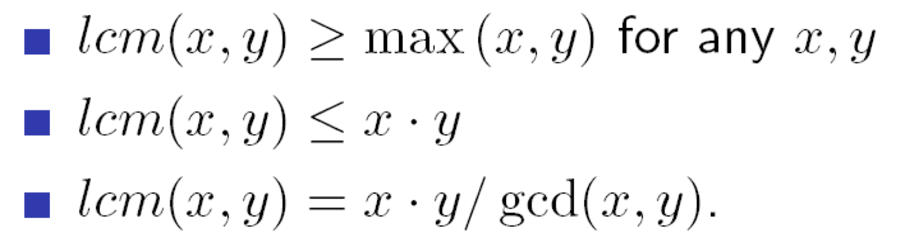

* Modular Inverse:

  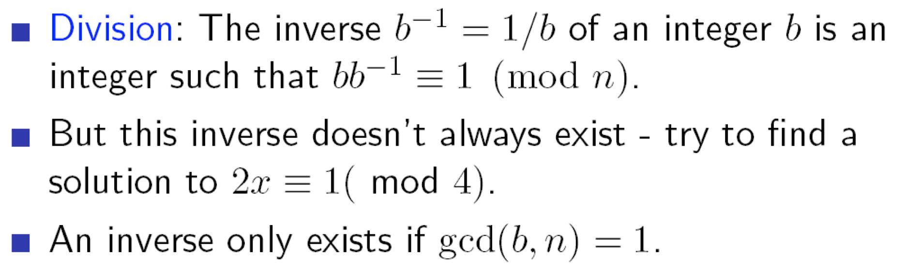

  * if gcd = 1, always exists an answer

  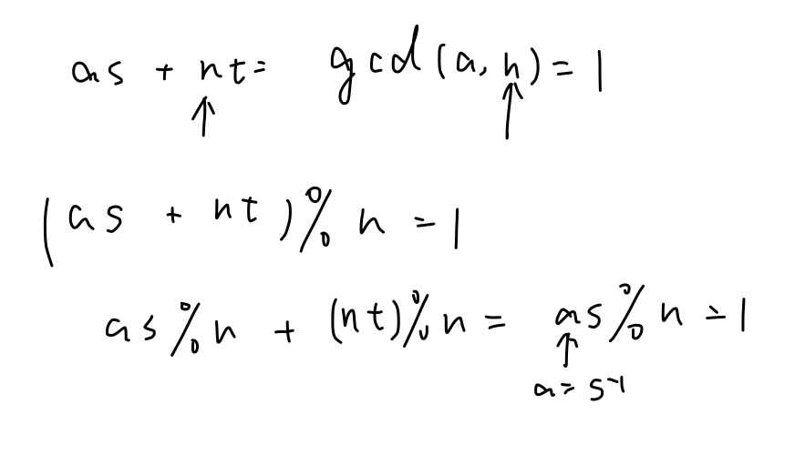

  * s, t are integers, gcd is less than **a** and **n**, so s and t must have one negative number
  * if gcd is not 1, the minus(difference) between several a and n will be some multiple of gcd(a,n)

* Euler’s Theorem: 

  * The multiplicative group for $Z_n$, denoted with $Z_n$, is the subset of elements of $Z_n$ relatively prime with $n$, less than it and 

  * The totient function of $\phi(n)​$, denoted with $\phi (n)​$, is the size of $Z_n​$

  * Example

    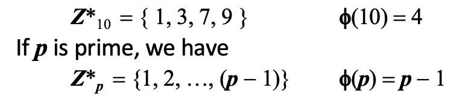

  * Euler’s Theorem: 

    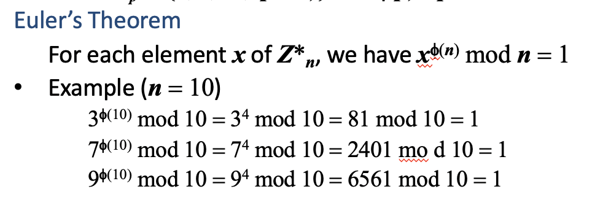

    * where n is **multiplication** of 2 prime number p, q

    * Actually x is relative prime with n

    * if p,q are prime: $\phi(pq)=(p-1)(q-1)=pq-p-q+1​$ 

    * [proof](https://blog.csdn.net/hillgong/article/details/4214327)

    * 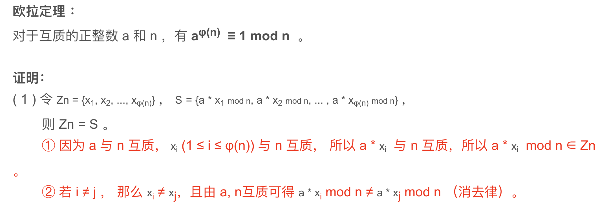

      

      * $a*x_{\phi(i)}​$ is different with  $a*x_{\phi(j)}​$ for any pairs of $i,j​$, therefore if we use all $a*x_{\phi(i)}​$, we will fill the set $Z_n​$ 

      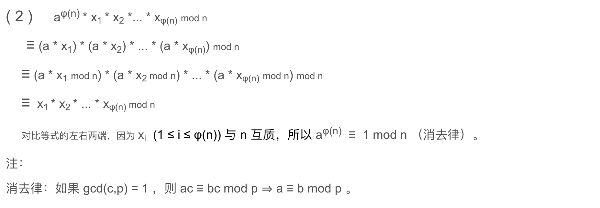

  * Property: for example calculate $20^{10203}\%10403​$

    * $10403 = 101(prime)*103(prime)$
    * 20 is relative prime with 10403
    * $(101-1)*(103-1)=10200$ 
    * $20^{10203}=20^{10200}*20^{3}$
    * $20^{10203}\%10403=20^{3}\%10403=8000​$
    * $(a^{k\phi(pq)+b})\%(pq)=a^b\%(pq)​$

* RSA public-key encryption

  * M: message, C: encripted message, (n,e) public key, (n,d) private key

  * $Gcd(e,\phi(n)) = 1​$

  * Principle: 

    * $M^{k\phi(n)+1}\%n=M$, where $n=pq$ (Euler’s theorem)
    * $ed=k\phi(n)+1​$ <=> $ed\%\phi(n)=1​$ <=> d is inverse of e in $\phi(n) ​$
    * $ed+\phi(n)*k= gcd(e,\phi(n)) = 1​$

  * Encrypt: $C=M^e\ mod\ n​$

  * Decrypt: $M = C^d\ mod\ n=M^{ed}\ mod\ n$

  * Setup:

    * Find two prime that is large enough
    * 

    

* String Parsing

  ```cpp
  char input[80] = "Hi, today is another training of ACM.";
  char *p=input, *cur = input;
  while(*p){
      if(*p==','||*p==' ') {
          *p=0;
      	if(*cur) printf("%s",cur);
          cur = ++p;
      }
      else ++p;
  }
  printf("%s",cur);
  ```

  ```cpp
  char** split(char* buffer, char* spliter,int& len){
      char *ptr = strtok(buffer,spliter);
      char **ans = new char*[100];
      int cnt = 0;
      while(ptr){
          ans[cnt++] = new char[100];
          ans[cnt-1] = ptr;
          ptr = strtok(NULL,spliter);
      }
      len = cnt;
      return ans;
  }
  ```

* Stack and Infix, prefix and postfix notation

  * Operator Priority

    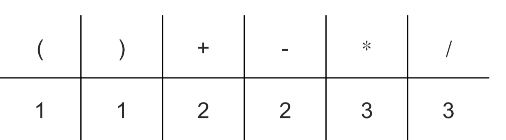

  * translate infix to postfix

    * Scan from left to right, token by token 
    * If current token is an operand -> display token(or push into the number stack)
    * If current token is an operator
      * case 1: stack is empty / new operator has higher priority -> push the new operator
      * case 2: the priority is same or lower -> pop old operator and  display, and check current token again (
    * If current token is '(' -> Push 
    * If current token is ')'  -> Pop until '(' and display all operators 
    * When expression finishes, pop and display remaining operators 

* Recursion

  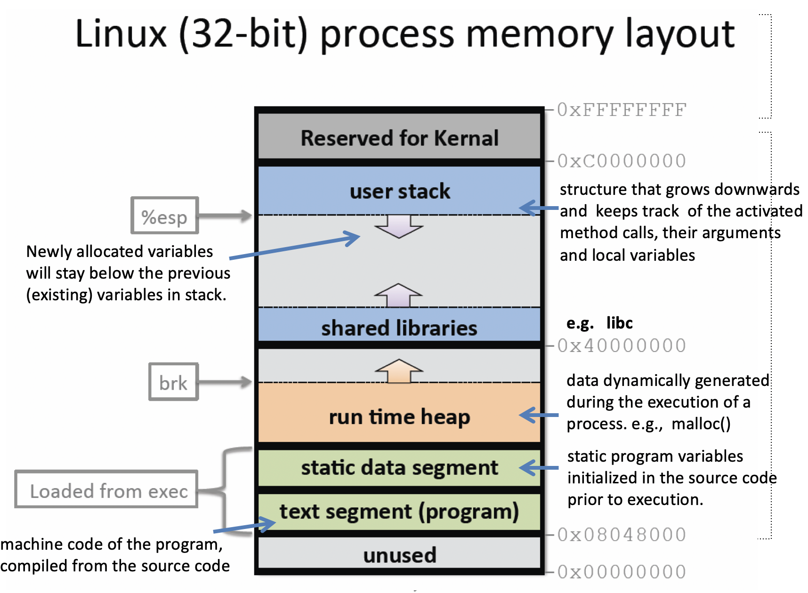

  

  * nCr: given n characters - a,b,c,d,... => want to choose r characters and display inorder

    * sub problem: $i_{th}$ character should/shouldn't choosed
    * Base case: the last character should/shouldn't choosed

    ```pseudocode
    combination(set, subset, r) {
    
        if (r == 0) {// the subset contains enough elements
    
            print elements in subset; return;
        }
    
        while (set is not empty) {
            move the first element from set to subset;
            combination(set, subset, r-1);
            remove the last element in subset;
        }
    }
    ```

    ```cpp
    void comb(int r,int cur_pos,char supset[],vector<char>& subset,int& cnt){
        if(r==0){
            subset.push_back(0);
            printf("%s\n",subset.data());
            subset.erase(subset.end()-1);
            cnt++;
        }
        else{
            for(int i=cur_pos;supset[i];i++){
                subset.push_back(supset[i]);
                comb(r-1,i+1,supset,subset,cnt);
                subset.erase(subset.end()-1);
            }
        }
    }
    ```

  * nPr

    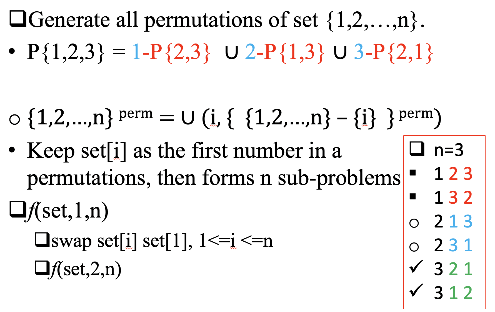

* BFS

  ```cpp
  #define MAX 1000
  bool map[MAX+1][MAX+1];
  bool rec[MAX+1];
  struct Node{
      int id;
      int depth;
      Node(int i,int l):id(i),depth(l){}
  };
  // important: record the node before dequeue
  int bfs(int src,int tar){
      memset(rec,0,sizeof(rec));
      queue<Node*> path;
      path.push(new Node(src,0));rec[src]=1;
      while(true){
          int id = path.front()->id, depth = path.front()->depth; path.pop();
          if(id==tar) break;						//break while find target
          for(int j=1;j<=20;j++){
              if(map[j][id]&&!rec[j]){
                  rec[j] = 1;
                  path.push(new Node(j,depth+1));
              }
          }
      }
      return le;
  }
  ```

* DFS

  ```cpp
  struct Node{
      int val;
      vector<int> next;
  };
  int cnt = 0;
  Node map[10001];
  bool rec[10001];
  void dfs(int s){
      if(rec[s])return;
      rec[s] = 1;cnt++;
      for(int i=0;i<map[s].next.size();i++){
          int tar = (map[s].next)[i];
          if(!rec[tar]) dfs(tar);
      }
  }
  ```

* Topological sort

  * DFS method
    * Use DFS to calculate the finishing time of each vertex
    * As each vertex is finished, insert it onto the front of a list
    * return the list of vertices
  * Second method
    * Remove all node with in-degree 0
    * Decrease the corresponding nodes' degree
    * repeate until all nodes have been removed

* Dijkstra algorithm

  * without heap

    ```cpp
    int map[MAX][MAX];
    int dist[MAX];
    bool rec[MAX];
    int n; // number of nodes
    void dijkstra(int src){
        memset(dist,INF,sizeof(dist));
        memset(rec,0,sizeof(rec));
        dist[src] = 0;
        while(true){
            int nd = -1;
            for(int i=0;i<n;i++){
                if(!rec[i]&&(nd==-1||dist[nd]>dist[i]))nd = i;
            }
            if(nd==-1)break;
            rec[nd] = true;
            for(int i=0;i<n;i++){
                dist[i] 
                    = dist[nd]+map[nd][i]<dist[i]?dist[nd]+map[nd][i]:dist[i];
            }
        }
    }
    ```

    

  * With heap -- stored in matrix

  ```cpp
  #define MAX 201;
  int map[MAX][MAX];
  int dist[MAX];
  int n;
  struct Node{
      int id,dist;
      bool operator>(const Node& b) const{
          return dist<b.dist;
      }
      bool operator<(const Node& b) const{
          return  !operator>(b);
      }
  };
  
  void dijkstra(int src, int tar){
      priority_queue<Node> q;
      fill(dist,dist+n,INF);
      dis[src] = 0;
      q.push((Node){src,0});
      while(!q.empty()){
          Node pre = q.top();q.pop();
          if(pre.id==tar)break;			// important to enhancement
          for(int i=1;i<=n;i++){
              if(i==pre.id) continue;
              if(map[id][i]+pre.dist < dis[i]){
                  dist[i] = map[id][i]+pre.dist;
                  q.push((Node){i,dist[i]});
              }
          }
      }
  }
  ```

  * With heap -- stored as edges

    ```cpp
    struct edge{int tar,cost;};	// store as edge information
    typedef pair<int, int> P;	// stored into the heap, first:cost, second:id
    int V;
    vector<edge> G[MAX];
    int dist[MAX];
    void dijkstra(int src){
        priority_queue<P,vector<P>,greater<P> >q;
        fill(dist,dist+V,INF);
        dist[src] = 0;
        q.push(P(0,src));
        while(!q.empty()){
            P cur = q.top();q.pop();
            int now = cur.second, cost = cur.first;
            if(dist[now]<cost) continue;		// already updated
            for(int i=0;i<G[now].size();i++){
                int tar = G[now][i].tar;
                if(dist[tar]>cost+G[now][i].cost){
                    dist[tar] = cost+G[now][i].cost;
                    q.push(P(dist[tar],tar));
                }
            }
        }
    }
    ```

* Floyd-Warshall algorithm(Any pairs of shortest path)

  * proof

    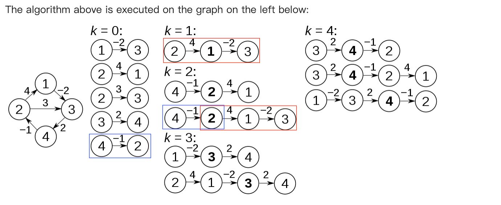

    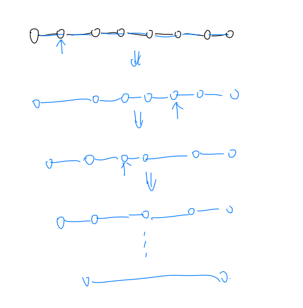

    * #define black shortest_path; #define blue determined_shortest_path(stored in the matrix);
    * Prove: Any arbitrary **black** path(i,j) can be changed to **blue** path, after the loop finished
    * Proof:  
      * Any segment consists of neighbor nodes on the shortest path is a blue path, because they are on a **black** path
      * As outer for loop go through all nodes, the n-2 nodes between i and j will be covered in some order
      * Each iteration, there will be a **blue** path generated by 2 consecutive blue path
        * Suppose i1, i2, i3 is a subpath between i and j
        * path(i1,i2) and path(i2,i3) are blue path
        * we know that path(i1,i3) is a black path, thus it will be changed to blue 

  ```cpp
  int dist[MAXV][MAXV];
  int V;
  
  void floyd() {
      for(int k=0;k<V;k++){
          for(int i=0;i<V;i++){
              for(int j=0;j<V;j++){
                  dist[i][j] 
                      = dist[i][j]>dist[i][k]+dist[k][j];
              }
          }
      }
  }
  ```

* recover the path

  ```cpp
  int path[MAX_V]; 
  // for dijkstra
  memset(path,-1,sizeof(path));
  ...;
      if(dist[tar]>cost+map[now][tar]){
          dist[tar] = cost+map[now][tar];
          path[tar] = now;
      }
  ...;
  vector<int> get_path(int t){
      vector<int> p;
      for(;t!=-1;t=path[t])p.push_back(t);
      reverse(p.begin(),p.end());
      return p;
  }
  // for floyd
  int path[MAX_V][MAX_V];
  for(int i=1;i<=n;i++){
  	for(int j=1;j<=n;j++){
  		if(map[i][j]!=-1) path[i][j] = i;
          else path[i][j] = 0;
      }
  }
  for(int k=1;k<=n;k++){
  	for(int i=1;i<=n;i++){
  		for(int j=1;j<=n;j++){
          	if(map[i][j]>map[i][k]+map[k][j]+cost[k]){
              	map[i][j] = map[i][k]+map[k][j]+cost[k];
                  path[i][j] = path[k][j];
              }
          }
      }
  }
  void print(int i,int j){
      if(path[i][j]==i) cout<<i;
      else{
          print(i,path[i][j]);
          cout<<"-->"<<path[i][j];
      }
  }
  ```

  

* Dp: longest common substring: how to find the substring exactly?(string model)

  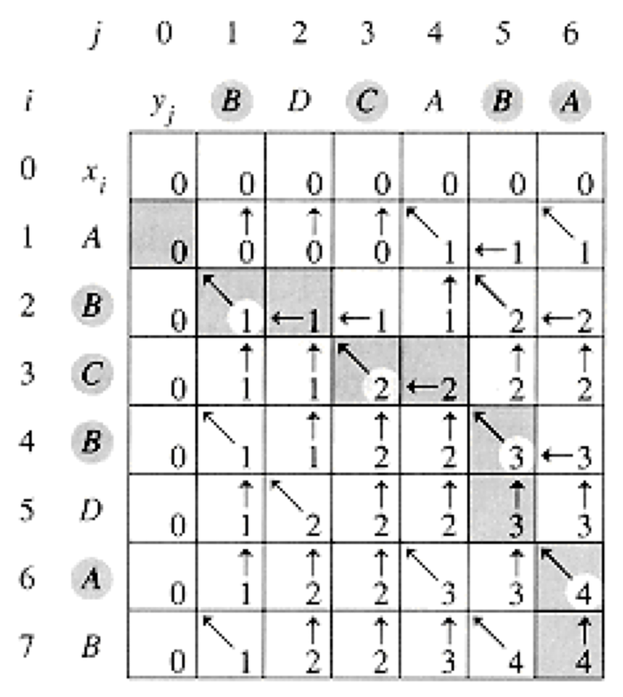

  * Use a matrix path\[m\]\[n\]

* 背包九讲

* Examples of dynamic programming

  * Dance Dance Revolution: Linear model(consider the number of the )

    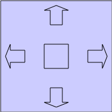

    * Originally, at the middle, input is a set of up,down,left and right. 

    * Find the way that correctly follow a melody and use least energy

    * Energy calculation:

      * adjacent move(left->up):3
      * opposite(left->right):4
      * center to any: 2
      * Tap the same position: 1

    * state transaction function
      $$
      dp[i][p_1][p_2]=min\{dp[i+1][x][p_2]+cost(x,p_1),\\ \ \ \ \ \ \ p[i+1][p_1][x]+cost(x,p_2)\}
      $$

  * Interval Model: Jumping frog

    * There are n stones (1<n<1000) in the pond. All the stones are on the same circle

    * A frog wants to jump to every stone exactly once

    * Try to design a route so that the total distance covered by the frog is minimized

      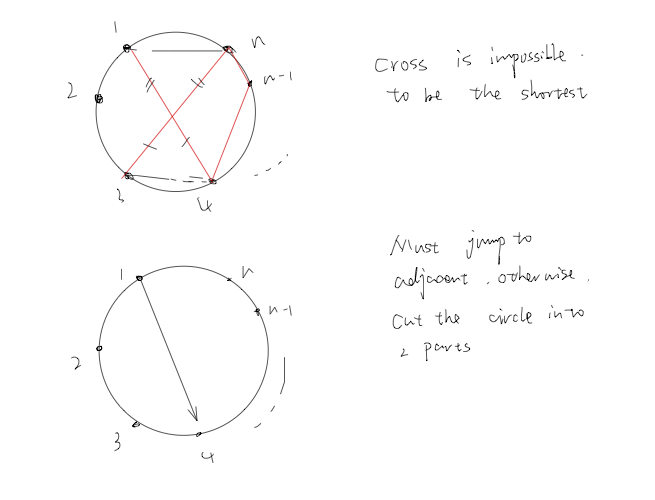

    * use the start and end points of interval as the states, each time can choose left or right

    * state transaction function
      $$
      dp[1][n]=min(dp[1][n-1]+dist[1][n]\\
      			dp[2][n]+dist[1][2])
      $$

  * Tree Model: (1) Find Maximum comfortable group on tree

    * input: tree

    * output: a comfortable group of maximum size

    * comfortable group: A set of nodes with no edge between any pair

    * A node can be either selected or not selected => create a dimension called selected, another dimension is node id

    * for binary tree:

      ```cpp
      dp[0][0] = max(dp[1][0],dp[1][1])+
      		   max(dp[2][0],dp[2][1]);
      dp[0][1] = dp[1][0]+dp[2][0];
      ```

    * for a general tree:

      ```cpp
      struct Node{
          int id;
          vector<Node*> childs;
          ...
      };
      
      for(int i=0;i<nodes[x].childs.size();i++){
          Node* nd = nodes[x].childs[i];
       	dp[x][0]+=max(dp[nd->id][0],dp[nd->id][1]);
          dp[x][1]+=dp[nd->id][0];
      }
      
      ```

  * Tree Mode: (2) Minimize longest path in a tree

    * A program can be branched to a tree by flow control statement

    * there is a worst case for the program, suppose each block takes some times, we need to put some blocks into the cache, such the **longest(worst) case** of the code can be **minimized**(by using cache)

    * First, if we consider each block takes same memory and time, and we have a cache with **finite** memory(says k blocks) that can reduce access time to 0 

      * In this case, the best solution is for each k, push the node that has the maximum height

    * Second, we consider each cache can reduce the time from t to t', and each block has different memory

      * In this case, the best solution can be obtained by using dp

      * each node can be considered whether selected into the cache or not

      * we use an array `dp[node][avaliable_cache_mem]` to save the minimized max execution time of the program below(include) the node, use `mem[x],t[x],t_ptime[x]` to represent the memory, time and reduced time of the node x

        ```cpp
        #define child(x,i) x*2+i
        dp[x][k] = min(
        	max_for_any(k1+k2==k)(
                dp[child(x,1)][k1],
                dp[child(x,2)][k2]
           	)+t_prime[x],
            max_for_any(k1+k2==k-mem[x]){
                dp[child(x,1)][k1],
                dp[child(x,2)][k2]
            }+t[x]
        );
        ```

* Greedy, Enumeration and Guess

  * Enumeration: Simplest method, try all the combinations

  * greedy: every time pick the current"best" choice

  * Coin Flipping: 

    * there are N(<10000) rows of coins each of them consists of 9 coins
    * Some coins are heads up and some are tails up
    * we can flip a whole row or  a whole column every time
    * Enumerate all the column flipping conditions and greedy to each row

  * Discrete Function: 

    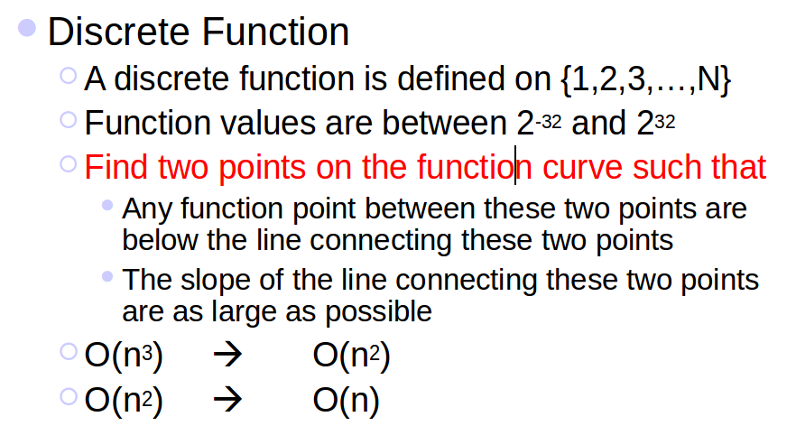

    * $n^3$: enumerate all possible pairs of points and  compare n-2 other points with it
    *  $n^2$ : enumerate all points and for each points calculate slope between it to others, choose the line with highest slope(impossible to exist some points above the largest slope one)
    * $n$ : enumerate all adjacent points(because for a biggest slope, if the start point and the end point are not adjacent and there are some points under the line, you always can use points under the line as the starting point to get a larger value)

  * Selecting Breakpoints

    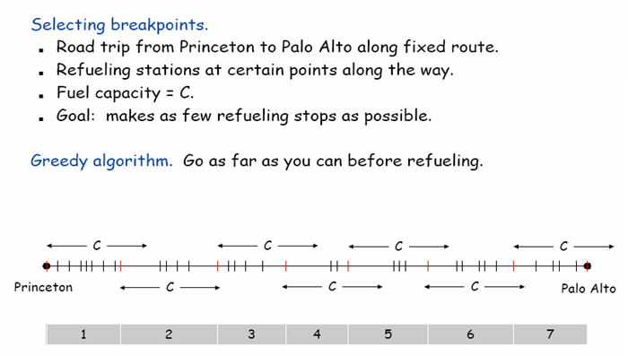

  * Gone Fishing

    * There are n fishing lakes on a line labeled 1, 2, 3, …, n from left to right
    * H hours’ fishing time in total, and **you must be come back home(i.e. you have to repeat some roads**
    * Start from lake 1
    * 5*$T_i$ minutes to reach lake i+1 from lake i
    * At the same lake i
      * The first 5 minutes can produce $F_i$ fishes
      * Every 5 minutes when you are fishing, there will be a decrease $D_i$ to the profit $F_i$ 
    * How to get the maximum number of fishes

  * Enlightened Landscape: Make sure all the landscape can be enlightened: 

    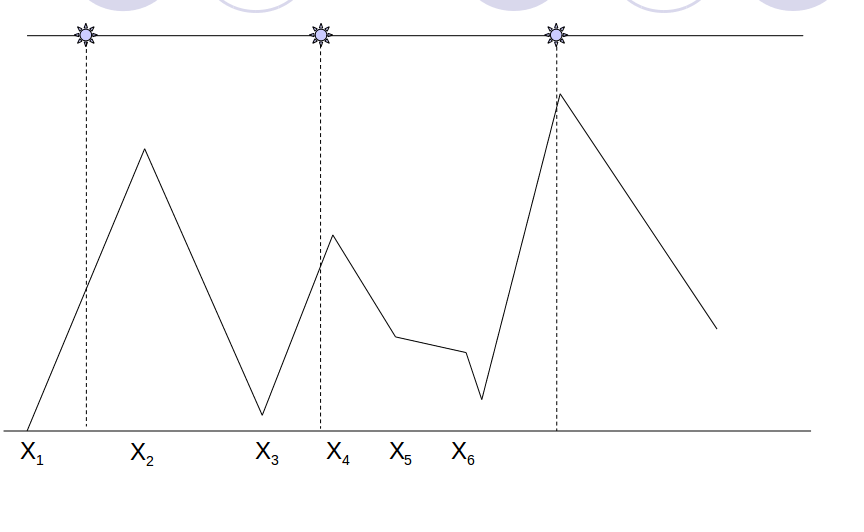

    * All turned points are enlightened is enough for this problem

    * look from down to up and determine an interval

    * scan and greedy, to find minimum vertical line that can cut the interval

      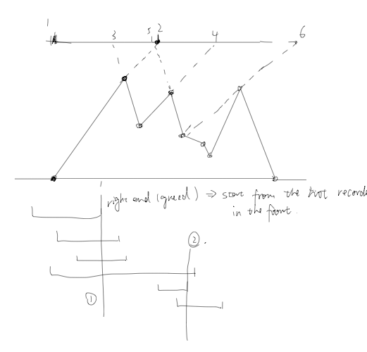

* Ford-Fulkerson algorithm(**max flow==min cut**)

  ```cpp
  // (target, capacity, reversed edge(store the index of the entry where it will be stored in the target node))
  struct edge{int tar,cap,rev;};
  
  vector<edge> G[MAX_V];
  bool rec[MAX_V];
  void add_edge(int src, int tar, int cap){
      int pos_index = G[src].size(), neg_index = G[tar].size();
      G[src].push_back((edge){tar,cap,neg_index});
      G[tar].push_back((edge){src,0,pos_index});
  }
  //	(start point, end point, minimum redundent flow of reached path)
  int dfs(int nd, int tar, int f){
      if(nd==tar)return f;
      rec[nd] = true;
      for(int i=0;i<G[nd].size();i++){
          edge& e = G[nd][i];
          if(!rec[e.tar]&&e.cap>0){
          	int d = dfs(e.tar,tar,min(f,e.cap));
              if(d>0){
                  e.cap-=d;
                  G[e.tar][e.rev].cap += d;
                  return d;
              }r
          }
      }
      return 0;
  }
  
  int max_flow(int src, int tar){
      int flow = 0;
      while(true){
          memset(rec,0,sizeof(rec));
          int f = dfs(src, tar, INF);
          if (f)flow+=f;
          else return flow;
      }
      return flow;
  }
  ```

* Convertion of max flow, min cut and max (point) weight closure of a Graph

  

  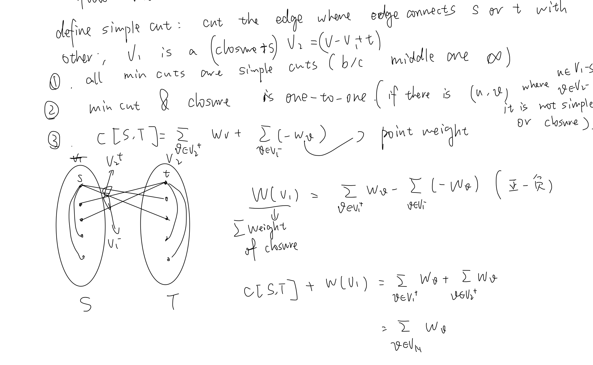

  * Conclusion: Max closure weight = sum of point weight - Max flow

* Minimum spanning tree

  * Minimum spanning tree contains at least one minimum edge, a minimum edge at least contained by at least one minimum spanning tree

  * Prim’s algorithm: Similar principle with Dijkstra, but store different meaning of distance (each time, grow the tree by connecting the nearest vertex to the group, where the distance is defined by the minimum distance between vertex and another vertex in the group)

    * Start with a random vertex, push all of it’s connected edges into the priority queue
    * Pop the shortest edge each time, and push all edges connected to the target vertex of the current edge

  * Kruskal’s algorithm: Start with the shortest edge

    * simple proof: if an edge is small enough, and will construct a cycle, you must delete one edge from the cycle, and the edge causes cycle must be the one with maximum weight

    * Sort all the edges

    * Start with an empty disjoint set, each time add one edge according to the sorted order

    * An edge is valid if it will not construct a cycle

    * Do until there are n-1 edges, where n is the number of nodes

    * A template

      ```cpp
      #define MAX 101
      int root[MAX];	// record the parent
      int find(int a){
          if(root[a] < 0) return a;
          // path compression
          else return root[a] = find(root[a]);
      }
      void join(int a, int b){
          int r1 = find(a), r2 = find(b);
          // follow the principle of union by size
          if(root[r1] < root[r2]){
              root[r1] += root[r2];
              root[r2] = r1;
          }
          else{
              root[r2] += root[r1];
              root[r1] = r2;
          }
      }
      struct Edge{
          int src, tar, cost;
          bool operator<(const Edge& o){
              return cost < o.cost;
          }
      } G[MAX*(MAX-1)/2];
      int main(){
          ...;
          memset(root, -1 , sizeof(root));
          sort(G,G+num_of_edge);
          int connected = 0, ans = 0;
          for(int i=0;i<num_of_edge;i++){
              int x = find(G[i].src), y = find(G[i].tar);
              if(x!=y){
                  join(x,y);
                  connected++;
                  ans += G[i].cost;
              }
              if(connected == n - 1) break;
          }
          return 0;
      }
      
      ```

* Disjoint Sets & minimum spanning trees

  * Definition of **spanning tree**: Acyclic, connect all the vertices and is generated from the given graph(it is a subset of the original graph)

  * **minimum spanning tree**: The spanning tree formed from a weighted undirected graph in which the total sum of values on edge has the minimum total weight

  * Prim's algorithm:  (dijkstra)

    * start with a set of known vertices with only one element, the initial element(vertex) can be any vertex
    * The set of known vertices is grown by one vertex for each stage
      * for each node in the set, iterate all edges connect vertex inside the set  with unknown vertex
      * find the edge with minimum length
      * this step can be optimized by a priority queue or set hold the edges
    * Find an unknown vertex which is nearest to the set of known vertices
    * similar principle with dijkstra => greedy 
    * implementation can use dijkstra

  * Kruskal's algorithm: (hierachical clustering)

    * **sort** the edges in non descending order by weights(can use priority queue at first)
    * Each time pop an edge: if it does not form a cycle, this edge is accepted
    * if the edge forms a cycle, this edge is rejected => repeat until all vertices are connected

  * **A graph can have more than one minimum spanning trees**

  * Implementation details

    * Sort in C : `qsort()` functoin in `<stdlib.h>` can be used to sort integers, chars and stuctures

    ```cpp
    void qsort(Type* arr,int len,int sizeof(Type),CMP);
    // where CMP is a function name
    int CMP(const void* a, const void* b){
        if(a less than b) return -1;
        if(a greater than b) return 1;
        return 0;
    }
    #define MAX 1000
    struct Edge{
        int src,tar,len;
    } G[MAX];
    const int CMP(const void* a,const void* b){
        Edge* A = (Edge*)a, B = (Edge*)b;
        return A->len - B->len;
    }
    ```

    * use disjoint set to record the spanning tree(following is disjoint set with union by size and path compression)

      ```cpp
      int root[MAX];
      void Union(int e1, int e2){
          int root1 = find(e1), root2 = find(e2);
          // since root stores -(member count)
          if(root[root1]<root[root2]){
              root[root1] += root[root2];
              root[root2] = root1;
          } else {
              root[root2] += root[root1];
              root[root1] = root2;
          }
      }
      int find(int e){
          if(root[e]<0)return e;
          else retur root[e] = find(root[e]);
      }
      ```

​      

* Line segment intersection

  ```cpp
  #define MAX 105
  struct Point{
  	int x, y;  
  } line[MAX][2];
  
  int clock(Point& p1, Point& p2, Point& p3){
      int val = (p2.x - p1.x)*(p3.y - p2.y) - (p2.y - p1.y)*(p3.x - p2.x);
      if(!val) return val;
      return val < 0 ? -1 : 1;
  }
  bool online(Point& p1, Point& p2, Point& p3){
      return p3.x <= max(p1.x, p2.x) && p3.x >= min(p1.x, p2.x)
          && p3.y <= max(p1.y, p2.y) && p3.y >= min(p1.y, p2.y);
  }
  bool checkIntersection(int i, int j){
      int o1 = clock(line[i][0], line[i][1], line[j][0]);
      int o2 = clock(line[i][0], line[i][1], line[j][1]);
      int o3 = clock(line[j][0], line[j][1], line[i][0]);
      int o4 = clock(line[j][0], line[j][1], line[i][1]);
      if (o1 == 0 && online(line[i][0], line[i][1], line[j][0])) return 1;
  	if (o2 == 0 && online(line[i][0], line[i][1], line[j][1])) return 1;
  	if (o3 == 0 && online(line[j][0], line[j][1], line[i][0])) return 1;
  	if (o4 == 0 && online(line[j][0], line[j][1], line[i][1])) return 1;
  	return 0;
  }
  ```

  

* KMP algorithm

  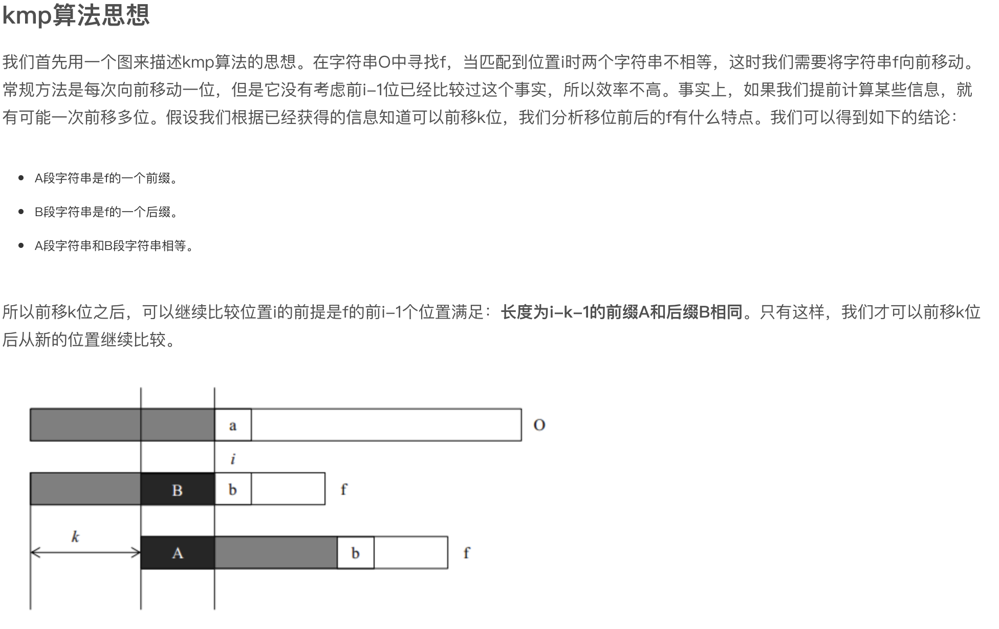

  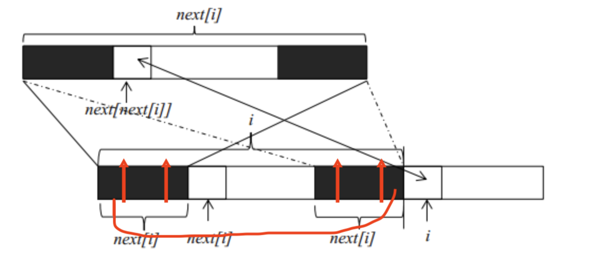

  * next[i]:  maximum common length when we consider the $0->(i-1)$ substring 

  * we calculate next array for the "moved" string

  * Code

    ```cpp
    int nxt[100010];
    char str[100001],tmp[100001];
    void getNext(int n){
        int prenxt=0;
        nxt[0] = nxt[1] = 0;
        for(int i=1;i<n;i++){
            while(prenxt>0&&tmp[i]!=tmp[prenxt]) 
                prenxt = nxt[prenxt];
            if(tmp[i]==tmp[prenxt]) prenxt++;
            nxt[i+1] = prenxt;  // i_th iteration, judge the length of i+1(str[0]->str[i])
        }
    }
    void KMP(int n){
        int pos = 0;
        for(int i=0;i<n;i++){
            // if not match, search for the previous smaller substring
            while(pos>0&&str[i]!=tmp[pos])pos = nxt[pos];
            if(str[i]==tmp[pos])pos++;
        }
        printf("%s%s\n",str,tmp+pos);
    }
    ```

    

  * Proof:  

    * if there is a block before B and equals to A, it is skipped

      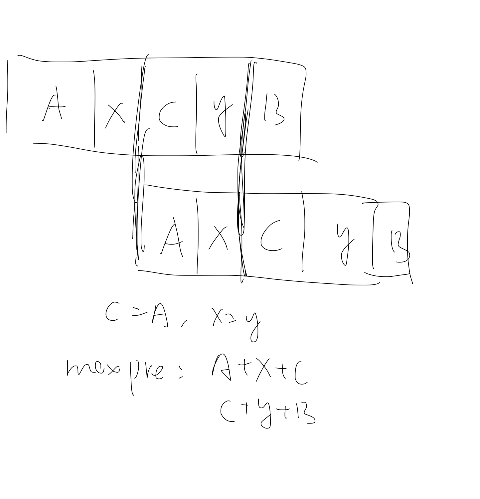

