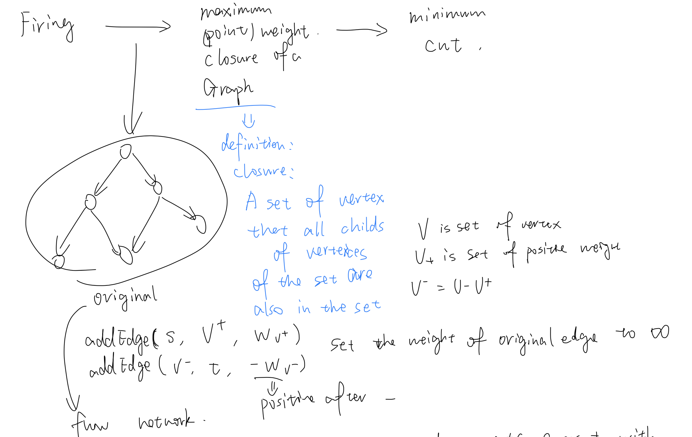

# CS 3391 Note

------------

* Data types

  

  * unsigned version to extend

  * Self-defined class for big number:

    * use an array `bit[]` to represent a big number

    * `bit[0]` store the number of digits

      ```cpp
      r = bit[0];
      n = bit[1]*1+bit[2]*10+...+bit[r]*(10^(r-1))
      ```

      ```cpp
      void numberToArray(int n, int bit[]){
          bit[0] = 0;
          while(n){
      		bit[++bit[0]] = n%10;
              n/=10;
          }
      }
      ```

      Addition: operation, carry-bit, carry flag

      ```cpp
      void add(int a[], int b[], int c[]){
          // operation
          memset(c,0,sizeof(c));
          for(int i=1;i<=a[0];i++)c[i]+=a[i];
          for(int i=1;i<=b[0];i++)c[i]+=b[i];
          c[0] = max(a[0],b[0]);
          // carry-bit
          int flag = 0;
          for(int i=1;i<=c[0];i++){
              c[i]+=flag;
              flag = c[i]/10;
              c[i] = c[i]%10;
          }
          // carry-flag
          if(flag) c[++c[0]]=flag;
          
      }
      ```

    * Mutiplication: operation, carry-bit, carry flag

      ```cpp
      void mutiply(int a[],int b[],int c[]){
      	memset(c,0,sizeof(c));
          for(int i=1;i<=a[0];i++){
              for(int j=1;j<=b[0];j++){
                  c[i+j-1]+=a[i]*b[j];	// i+(j-1)
              }
          }
          c[0]=a[0]+b[0]-1;
          int flag = 0;
          for(int i=1;i<=c[0];i++){
              c[i]+=flag;
              flag = c[i]/10;
              c[i] = c[i]%10;
          }
          while(flag){
              c[++c[0]]=flag%10;
              flag = flag/10;
          }
      }
      ```

    * Speed up: Base could be larger than 10, int can be large as $2^{31}-1$

    * digit compression

    * before(base 10): bit[1,...,n]<10

    * After compression(base: 1e5): bit[1,...n]<1e5

    * **be careful for overflow** 

  * place holders:

    

    

    

* I/O

  

  ```cpp
  // speed up stream I/O
  std::ios_base::sync_with_stdio(false);
  ```

* File I/O

  ```cpp
  FILE* inputfile = fopen("input.txt","r");
  FILE* outputfile = fopen("output.txt","w");
  freopen("input.txt","r",stdin);
  fprintf(outputfile,"%d",num);
  char ch = fgetc(inputfile);
  fgets(buffer,length,stdin);	//will read \n into the buffer
  feof()	// if reach the end-of-file, return 0
  fclose(inputfile); fclose(outputfile);
  ```

* String I/O

  ```cpp
  sprintf(buffer,"%d",n);
  sscanf(buffer,"%d",&n);
  void strcpy(char* src,char* tar){
      sprintf(tar,"%s",src);
  }
  void strcat(char* tar,char* src1,char* src2){
      sprintf(tar,"%s%s",src1,src2);
  }
  int atoi(char* buffer){
      int num;
      sscanf(buffer,"%d",&num);
      return num;
  }
  ```

* Arithmetic functions

  

  * sin(),cos(),tan() accept parameters in radians

  * binary power

    ```cpp
    long long bi_power(int m,int n){
        if(n==0)return 1L;
        else if(n&1) return bi_power(m,n/2)*bi_power(m,n/2)*(long long)m;
        else return bi_power(m,n/2)*bi_power(m,n/2);
    }
    ```

  * self defined log

    ```cpp
    double log(int down,int up){
        return log(up)/log(down);
    }
    ```

  * Bitwise operation

    * Check odd or even: `if(x&1) printf("x is odd");`
    * Check for divisibility of 2's power: `if(x&7) printf("x is not divisible by 8");`
    * Round down to nearest multiple of 2's power: `x=27; =x&(~7)`

* Counting prime

  * Euler's method

  * Proof: 

    

    

    

    ```cpp
    #define MAX 1000000
    int prime[MAX];
    bool rec[MAX+1];
    void init(){
        memset(rec,0,sizeof(rec));
        int cnt = 0;
        for(int i=2;i<=MAX;i++){
            if(!rec[i]) prime[cnt++] = i;
            for(int j=0;j<cnt;j++){
                if(prime[j]*i>MAX)break;
                rec[prime[j]*i] = 1;
                if(i%prime[j]==0)break;
            }
        }
    }
    ```

* String Parsing

  ```cpp
  char input[80] = "Hi, today is another training of ACM.";
  char *p=input, *cur = input;
  while(*p){
      if(*p==','||*p==' ') {
          *p=0;
      	if(*cur) printf("%s",cur);
          cur = ++p;
      }
      else ++p;
  }
  printf("%s",cur);
  ```

  ```cpp
  char** split(char* buffer, char* spliter,int& len){
      char *ptr = strtok(buffer,spliter);
      char **ans = new char*[100];
      int cnt = 0;
      while(ptr){
          ans[cnt++] = new char[100];
          ans[cnt-1] = ptr;
          ptr = strtok(NULL,spliter);
      }
      len = cnt;
      return ans;
  }
  ```

* Stack and Infix, prefix and postfix notation

  * Operator Priority

    

  * translate infix to postfix

    * Scan from left to right, token by token 
    * If current token is an operand -> display token(or push into the number stack)
    * If current token is an operator
      * case 1: stack is empty / new operator has higher priority -> push the new operator
      * case 2: the priority is same or lower -> pop old operator and  display, and check current token again (
    * If current token is '(' -> Push 
    * If current token is ')'  -> Pop until '(' and display all operators 
    * When expression finishes, pop and display remaining operators 

* Recursion

  

  

  * nCr: given n characters - a,b,c,d,... => want to choose r characters and display inorder

    * sub problem: $i_{th}$ character should/shouldn't choosed
    * Base case: the last character should/shouldn't choosed

    ```pseudocode
    combination(set, subset, r) {
    
        if (r == 0) {// the subset contains enough elements
    
            print elements in subset; return;
        }
    
        while (set is not empty) {
            move the first element from set to subset;
            combination(set, subset, r-1);
            remove the last element in subset;
        }
    }
    ```

    ```cpp
    void comb(int r,int cur_pos,char supset[],vector<char>& subset,int& cnt){
        if(r==0){
            subset.push_back(0);
            printf("%s\n",subset.data());
            subset.erase(subset.end()-1);
            cnt++;
        }
        else{
            for(int i=cur_pos;supset[i];i++){
                subset.push_back(supset[i]);
                comb(r-1,i+1,supset,subset,cnt);
                subset.erase(subset.end()-1);
            }
        }
    }
    ```

  * nPr

    

* BFS

  ```cpp
  #define MAX 1000
  bool map[MAX+1][MAX+1];
  bool rec[MAX+1];
  struct Node{
      int id;
      int depth;
      Node(int i,int l):id(i),depth(l){}
  };
  // important: record the node before dequeue
  int bfs(int src,int tar){
      memset(rec,0,sizeof(rec));
      queue<Node*> path;
      path.push(new Node(src,0));rec[src]=1;
      while(true){
          int id = path.front()->id, depth = path.front()->depth; path.pop();
          if(id==tar) break;						//break while find target
          for(int j=1;j<=20;j++){
              if(map[j][id]&&!rec[j]){
                  rec[j] = 1;
                  path.push(new Node(j,depth+1));
              }
          }
      }
      return le;
  }
  ```

* DFS

  ```cpp
  struct Node{
      int val;
      vector<int> next;
  };
  int cnt = 0;
  Node map[10001];
  bool rec[10001];
  void dfs(int s){
      if(rec[s])return;
      rec[s] = 1;cnt++;
      for(int i=0;i<map[s].next.size();i++){
          int tar = (map[s].next)[i];
          if(!rec[tar]) dfs(tar);
      }
  }
  ```

* Topological sort

  * DFS method
    * Use DFS to calculate the finishing time of each vertex
    * As each vertex is finished, insert it onto the front of a list
    * return the list of vertices
  * Second method
    * Remove all node with in-degree 0
    * Decrease the corresponding nodes' degree
    * repeate until all nodes have been removed

* Dijkstra algorithm

  * without heap

    ```cpp
    int map[MAX][MAX];
    int dist[MAX];
    bool rec[MAX];
    int n; // number of nodes
    void dijkstra(int src){
        memset(dist,INF,sizeof(dist));
        memset(rec,0,sizeof(rec));
        dist[src] = 0;
        while(true){
            int nd = -1;
            for(int i=0;i<n;i++){
                if(!rec[i]&&(nd==-1||dist[nd]>dist[i]))nd = i;
            }
            if(nd==-1)break;
            rec[nd] = true;
            for(int i=0;i<n;i++){
                dist[i] 
                    = dist[nd]+map[nd][i]<dist[i]?dist[nd]+map[nd][i]:dist[i];
            }
        }
    }
    ```

    

  * With heap -- stored in matrix

  ```cpp
  #define MAX 201;
  int map[MAX][MAX];
  int dist[MAX];
  int n;
  struct Node{
      int id,dist;
      bool operator>(const Node& b) const{
          return dist<b.dist;
      }
      bool operator<(const Node& b) const{
          return  !operator>(b);
      }
  };
  
  void dijkstra(int src, int tar){
      priority_queue<Node> q;
      fill(dist,dist+n,INF);
      dis[src] = 0;
      q.push((Node){src,0});
      while(!q.empty()){
          Node pre = q.top();q.pop();
          if(pre.id==tar)break;			// important to enhancement
          for(int i=1;i<=n;i++){
              if(i==pre.id) continue;
              if(map[id][i]+pre.dist < dis[i]){
                  dist[i] = map[id][i]+pre.dist;
                  q.push((Node){i,dist[i]});
              }
          }
      }
  }
  ```

  * With heap -- stored as edges

    ```cpp
    struct edge{int tar,cost;};	// store as edge information
    typedef pair<int, int> P;	// stored into the heap, first:cost, second:id
    int V;
    vector<edge> G[MAX];
    int dist[MAX];
    void dijkstra(int src){
        priority_queue<P,vector<P>,greater<P> >q;
        fill(dist,dist+V,INF);
        dist[src] = 0;
        q.push(P(0,src));
        while(!q.empty()){
            P cur = q.top();q.pop();
            int now = cur.second, cost = cur.first;
            if(dist[now]<cost) continue;		// already updated
            for(int i=0;i<G[now].size();i++){
                int tar = G[now][i].tar;
                if(dist[tar]>cost+G[now][i].cost){
                    dist[tar] = cost+G[now][i].cost;
                    q.push(P(dist[tar],tar));
                }
            }
        }
    }
    ```

* Floyd-Warshall algorithm(Any pairs of shortest path)

  * proof

    

    

    * #define black shortest_path; #define blue determined_shortest_path(stored in the matrix);
    * Prove: Any arbitrary **black** path(i,j) can be changed to **blue** path, after the loop finished
    * Proof:  
      * Any segment consists of neighbor nodes on the shortest path is a blue path, because they are on a **black** path
      * As outer for loop go through all nodes, the n-2 nodes between i and j will be covered in some order
      * Each iteration, there will be a **blue** path generated by 2 consecutive blue path
        * Suppose i1, i2, i3 is a subpath between i and j
        * path(i1,i2) and path(i2,i3) are blue path
        * we know that path(i1,i3) is a black path, thus it will be changed to blue 

  ```cpp
  int dist[MAXV][MAXV];
  int V;
  
  void floyd() {
      for(int k=0;k<V;k++){
          for(int i=0;i<V;i++){
              for(int j=0;j<V;j++){
                  dist[i][j] 
                      = dist[i][j]>dist[i][k]+dist[k][j];
              }
          }
      }
  }
  ```

* recover the path

  ```cpp
  int path[MAX_V]; 
  // for dijkstra
  memset(path,-1,sizeof(path));
  ...;
      if(dist[tar]>cost+map[now][tar]){
          dist[tar] = cost+map[now][tar];
          path[tar] = now;
      }
  ...;
  vector<int> get_path(int t){
      vector<int> p;
      for(;t!=-1;t=path[t])p.push_back(t);
      reverse(p.begin(),p.end());
      return p;
  }
  // for floyd
  int path[MAX_V][MAX_V];
  for(int i=1;i<=n;i++){
  	for(int j=1;j<=n;j++){
  		if(map[i][j]!=-1) path[i][j] = i;
          else path[i][j] = 0;
      }
  }
  for(int k=1;k<=n;k++){
  	for(int i=1;i<=n;i++){
  		for(int j=1;j<=n;j++){
          	if(map[i][j]>map[i][k]+map[k][j]+cost[k]){
              	map[i][j] = map[i][k]+map[k][j]+cost[k];
                  path[i][j] = path[k][j];
              }
          }
      }
  }
  void print(int i,int j){
      if(path[i][j]==i) cout<<i;
      else{
          print(i,path[i][j]);
          cout<<"-->"<<path[i][j];
      }
  }
  ```

  

* Dp: longest common substring: how to find the substring exactly?

  

  * Use a matrix path\[m\]\[n\]

* Ford-Fulkerson algorithm(max flow)

  ```cpp
  // (target, capacity, reversed edge(store the index of the entry where it will be stored in the target node))
  struct edge{int tar,cap,rev;};
  
  vector<edge> G[MAX_V];
  bool rec[MAX_V];
  void add_edge(int src, int tar, int cap){
      int pos_index = G[src].size(), neg_index = G[tar].size();
      G[src].push_back((edge){tar,cap,neg_index});
      G[tar].push_back((edge){src,0,pos_index});
  }
  //	(start point, end point, minimum redundent flow of reached path)
  int dfs(int nd, int tar, int f){
      if(nd==tar)return f;
      rec[nd] = true;
      for(int i=0;i<G[nd].size();i++){
          edge& e = G[nd][i];
          if(!rec[e.tar]&&e.cap>0){
          	int d = dfs(e.tar,tar,min(f,e.cap));
              if(d>0){
                  e.cap-=d;
                  G[e.tar][e.rev].cap += d;
                  return d;
              }r
          }
      }
      return 0;
  }
  
  int max_flow(int src, int tar){
      int flow = 0;
      while(true){
          memset(rec,0,sizeof(rec));
          int f = dfs(src, tar, INF);
          if (f)flow+=f;
          else return flow;
      }
      return flow;
  }
  ```

* Convertion of max flow, min cut and max (point) weight closure of a Graph

  

  

  * Conclusion: Max closure weight = sum of point weight - Max flow

* KMP algorithm

  

  

  * next[i]:  maximum common length when we consider the $0->(i-1)$ substring 

  * we calculate next array for the "moved" string

  * Code

    ```cpp
    int nxt[100010];
    char str[100001],tmp[100001];
    void getNext(int n){
        int prenxt=0;
        nxt[0] = nxt[1] = 0;
        for(int i=1;i<n;i++){
            while(prenxt>0&&tmp[i]!=tmp[prenxt]) 
                prenxt = nxt[prenxt];
            if(tmp[i]==tmp[prenxt]) prenxt++;
            nxt[i+1] = prenxt;  // i_th iteration, judge the length of i+1(str[0]->str[i])
        }
    }
    void KMP(int n){
        int pos = 0;
        for(int i=0;i<n;i++){
            // if not match, search for the previous smaller substring
            while(pos>0&&str[i]!=tmp[pos])pos = nxt[pos];
            if(str[i]==tmp[pos])pos++;
        }
        printf("%s%s\n",str,tmp+pos);
    }
    ```

    

  * Proof:  

    * if there is a block before B and equals to A, it is skipped

      

