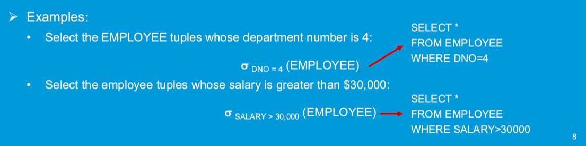
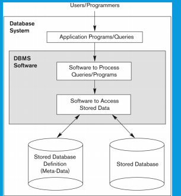

# CS3402 Database system

--------

## Lecture 01: Entity-Relationship (ER) Model

---------

* Definition of **ER model**: describes *interrelated things of interest* in a specific domain of knowledge. Becomes an abstract data model, that defines a data or information structure which can be implemented in a database. Composed of:

  * Entity types(classify the things of interest)
  * Specifies relationships: exist between entities, instances of those entity types

* Entity, Entity type and Entity Set

  * **Entity**: a thing capable of an independent existence that **can be uniquely identified** and exists either **physically or logically**. (represented as rectangle)(object)
  * **Entity type**: collection of entities that have the **same kinds of attributes**(class)
  * **Entity set**: set of entities of the same type(a set of objects)

* Relationship, Relationship types and  Relationship Set

  * **Relationship** (ties): captures how entities are related to one another(can be thought of as *verbs, linking two or more nouns(entities)*). 
    * For example, a *work_for* relationship between an *employee* and a *department*.(represented as a diamond )
  * **Relationship type**(same kinds of ties) : Defines a relationship among entities of certain entity types
    * **Degree** of a relationship type: **number of participating ==entity types==**
      * binary(ternary) relation type: involving two(three) entity types
  * **Relationship set** (a bunch of ties) : collection of relationships all belonging to one relationship type represented in the database

* Attribute

  * Both entities and relationships can have

    

  * **Key attribute** : A set of attributes (one or more attributes) that ==uniquely identify an entity==(super keys) 

  * Types of attribute

    * **Simple attribute** : Has a single atomic value that ==does not contain any smaller meaningful components==
    * **Composite attributes** : composed of several components(simple attributes).
    * **Multi-valued attribute** : Has multiple values. 
      * For example, color of a product (i.e., red and white) and major of a student (i.e., computer science and mathematics).(stored as a collection)
      * In general, composite and multi-valued attributes may be nested to any number of levels although this is rare.  (Muti-valued consists of multi-valued)
    * **Derived attribute** : An attribute whose value is calculated from other attributes(==need not be physically stored== within the database) 

* Value sets(domains) of attributes

  * Each **simple attribute** is associated with a **value se**t (or domain)
  * The value set specifies the set of values associated with an attribute
  * Value sets are similar to data types in most programming languages(**normally do not use float in database**, unsteadily, use double)
  * Char(20), int ….

* Constrains on relationships

  * **Participation constraint**(focus on pariticipation of each entity): Indicate the ==minimum number of relationship== instances that an entity can participate in(must be larger than what)

    * **Total participation** requires that each entity is involved in the relationship.
      * In other words, an entity must exist related to another entity(represented by **double lines** in ER model) => **Key word: A must have at least one B**
    * **Partial participation** means that not all entities are involved in the relationship. (represented by single lines in ER model)

  * **Cardinality constraint**(focus on the map between A and B) : Indicates the ==maximum number== of relationship instances that an entity can participate in(cannot be larger than what) 

    * A **1:1 or one-to-one relationship** from entity type S to entity type T is one in which an entity from S is related to **at most one** entity from T and vice versa. 

    * An **N:1 or many-to-one relationship** from entity type S to entity type T is one in which an entity from T can be related to two or more entities from S. 

      

    * A **1:N or one-to-many relationship** from entity type S to entity type T is one in which an entity from S can be related to two or more entities from T. 

    * An **N:M or many-to-many relationship** from entity type S to entity type T is one in which an entity from S can be related to two or more entities from T, and an entity from T can be related to two or more entities from S. 

    * *(min, max)* notation for relationship structural constraints (focus on each of the entity in one entity type)

      - This notation specifies that **each entity** participates in at least min and at most max relationship instances(of relationship) in a relationship. 
        - total participation: min > 0
        - 1:1, max = 1
        - 1:1 total: (1,1)
        - 1:1 partial: (0,1)
      - min must be at least 0 and at most max (0 <= min and min <= max) 
      - max must be at least 1 (max >= 1) 

* Recursive relationship type

  * A recursive relationship is one in which **the same entity participates more than once** in the relationship. The relationship should be ==marked by the role that an entity takes in the participation==(supervisor). 
  * It is also called a **self-referencing relationship** type. 

* Weak entity type: defined as entity types that **doesn't have super key**, therefore determined by other entity by reference(foreign key)

  * A **weak entity** that does not have a key attribute and is identification- dependent on another entity type. It **must** participate in an **identifying relationship** type with an owner or identifying entity type. In other words, weak entity type **must be owned by some owner entity type**. 
  * A weak entity is identified by the combination of: (1) its **partial key** and (2) the **identifying entity type** related to the identifying relationship type. 
    * **because partial key may be the same**
  * e.g.: 
    * Ada Chan is an employee. She has a dependent(受抚养者) Cindy Chan. 
    * Bob Chan is an employee. He has a dependent Cindy Chan. 
    * The two dependent entities are identical and determined by employee name(foreign key) and dependent name(partial key)
    * The EMPYLOEE entity type owns the DEPENDENT entity type. 

* Notations for ER Diagrams

  

* Case Study:

  

  *   An ER diagram for the company database. 

  * 3 entities: EMPLOYEE, DEPARTMENT, and PROJECT 

  * 1 weak entity: DEPENDENT 

  * 4 relationships: WORKS_FOR, MANAGES, WORKS_ON, and CONTROLS 

  * 1 identifying relationship: DEPENDENTS_OF 

  * 1 recursive relationship: SUPERVISION 

  * The company is organized into DEPARTMENTs 

  * Each DEPARTMENT has a unique name, unique number, many EMPLOYEEs and an EMPLOYEE who manages the DEPARTMENT. 

  * A DEPARTMENT may have several locations. 

  * We keep track of the start date of the department manager and the number of employees for each DEPARTMENT. 

  * A DEPARTMENT controls a number of PROJECTs. 

  * Each PROJECT has a unique name, unique number and is located at a single location and is controlled by a DEPARTMENT. 

  * Each EMPLOYEE has social security number (Ssn), address, salary, sex, and birthdate. Ssn is a key attribute and address is composite attribute. 

  * Each EMPLOYEE works for one DEPARTMENT. Many EMPLOYEEs work for the same DEPARTMENT. 

  * Each EMPLOYEE may work on several PROJECTs. 

  * Many EMPLOYEEs work on the same PROJECT. 

  * An EMPLOYEE manages at most one DEPARTMENT. 

  * It is required to keep track the number of hours per week that each EMPLOYEE currently works on each PROJECT and the direct supervisor of each EMPLOYEE. 

  * A supervisor can supervise many EMPLOYEEs. 

  * An EMPLOYEE may have a number of DEPENDENTs. For each dependent, it is required to keep a record of name, sex, birthdate, and relationship to the EMPLOYEE. 

    

  * An ER diagram for the company database with structural constraints specified using (min, max) notation and role name. 

  * A DEPARTMENT has **exactly one** manager and an EMPLOYEE can manage at most one DEPARTMENT. 

  * An EMPLOYEE can work for exactly one DEPARTMENT but a DEPARTMENT has at least 4 EMPLOYEEs. 

  * An EMPLOYEE works on at least one project. A PROJECT has at least one worker. 

  * A DEPARTMENT can control no PROJECT or any number of PROJECTs, but a PROJECT has exactly one controlling department. 

  * An EMPLOYEE can have no dependent or many dependents, but a dependent belongs to exactly one EMPLOYEE. 

  * An EMPLOYEE has at most one supervisor and may be a supervisor supervising any number of supervisees.

----------

## Tutorial 01:ER Model


* Question 2: Construct an ER diagram for a car insurance company. Identify the key entities, relationships and their attributes in the ER diagram. 

  - A customer owns **at least one(total participation)** car. 

  - A car may be owned by more than one customer. 

  - An accident involves **at least one** car. 

  - A car may have a number of recorded accidents associated with it. 

    

* Question 3:  Construct an ER diagram for a hospital. Identify the key entities, relationships and their attributes in the ER diagram. 

  - The hospital has a set of patients and a set of medical doctors. 

  - A patient may be treated by more than one doctor. 

  - A doctor may have a number of patients. 

  - A log of the various conducted tests and results is associated with each patient. 

    

* Steps to draw a ER diagram

  * Entities: customer,car, accident
  * Relationships: owns involve 
    * Partial/Total Participation
    * Constraints on Relationship
  * Attributes/Key Attributes

--------------

## Lecture 02: Relational Model

-----------

* Many database implementations are always based on **relational approach** 

  * ER diagram => relation model

* Relation : Looks like a table of values

  * A relation contains a set of **rows (tuples(元组))** and each **column (attribute)** has a column header that gives an indication of the meaning of the data items in that column 
    - Associated with each attribute of a relation is a set of values (domain) 
    - Students(SSN:string, Name:string, GPA:double) 
  * The data elements in **each row** (tuple) represent certain facts that **correspond to a real-world entity or relationship(also multivalued attribute)**  

  

* Primary Key vs Foreign Key

  * **Primary Key**: Uniquely indentify a record in the table. (We can have **only one** primary key in a table)
  * **Foreign Key**: Foreign key is a field in the table that is ==primary key in another table==(reference to other table, can be treated as a object field or pointer). (We can have **more than one** foreign key in a table )

* Relational Data Model: Basic Structure

  * Each row/turple in a relation is a record/turple (an entity)

  * Each attribute in a relation corresponds to a ==particular field of a record== 

    

  * Definition Summary

    

* Relation State

  * Each populated relation has many records or tuples in its relation state
  * Whenever the database is changed a new state arises (==change the data => change the state==)
  * Basic operations for changing the database:
    * Insert – add a new tuple in a relation 
    * Delete – remove an existing tuple from a relation 
    * Update – modify an attribute of an existing tuple 
  * Query is not a part of changing state operations

* Characteristics of Relations

  * The tuple  **are not considered to be ordered**, even though they appear to be in a tabular(列成表的) form (may have dfferent presentation orders)
    - **same relation state can be with different order of tuples** => unordered set
  * Values in a tuple
    * **All values are considered atomic(indivisible) => the reason of construct a new relation for multivalued attributes**
    * Basic unit for manipulation(add or change)
  * Each value in a turple must be from the domain(set of values) of the attribute for that column => data type and size should fulfill the requirements initialized in table schema
  * A special null value is used to represent values that are ==unknown or not available or inapplicable in certain tuples==

* From ER Diagram to Relations:

  * **notice: all composite attribute should be divided into multiple simple attributes in the relation model**

  * Step 1: Mapping of strong Entity types

    * Create a relation R that includes all the ==simple attributes== of E(The strong enity)

    * Choose ==one of the key attributes== E as the primary key for R 

    * R is called an entity relation(each tuple represent an entity instance)

      

  * Step 2: Mapping of weak Entity types

    * Create a relation R and includes all the simple attributes of the entity type as the attributes of R
    * Include the **primary key attribute of the owner** as the **foreign key attributes** of R
    * The primary key of R is the **combination** of(1) the **primary key of the owner** and(2) the **partial key of the weak entity type**(may be the name of the dependence)

  * Step 3: Mapping of 1:1 Relation**ship** types

    * Identify relations that correspond to the entity types participating R (Says S and T)
    * Approaches:
      * **Foreign key approah**(let one of the entity remember the relationship) used in the example
        * Choose one of relations(says S, **normally the total participation side**) and include the primary key of T as the foreign key in S
        * Include all the simple attributes of the relationship as the attributes of S
      * Merged relationship approach: merge the 2 entity types and the relationship(simple attributes) into a single relation (**not efficient**)
      * Cross reference or **relationship relation approach**
        * Set up a third relation **R** for the purpose of cross-referencing(including) the **primary keys of the two relations S and T** representing the entity types
        * Also including the primary key attributes of S and T as foreign keys to S and T respectively
        * primary key of R will be **one of the two foreign keys** (because it is 1: 1 relation, 1 key is enough to identify a relation) 

  * Step 4: Mapping of 1:N Relationship Types(let N-side remember the relation=>more efficient)

    * Identify relation S that represents participating entity type at **N-side** of relationship type
    * Include **the primary key of relation T as the foreign key in S** 
    * Include the **simple attributes** of the 1:N relationship type as the attributes of S 
    * Alternative approach(create a new relationship)
      * Use the relationship relation option as in the third approach for binary 1:1 relationships, but the **primary key of R will be two foreign keys of both involvoing entities**

  * Step 5: Mapping of Binary M:N Relationship Types(cross reference)

    * Create a new relation R
    * Include all primary key of the participating entity types as the foreign key attributes in R
    * The **combination of all foreign key attributes** forms the primary keys of R
    * Include **all the simple attributes** of M:N relationship type as attribute of R

  * Step 6: Mapping of Multivalued Attributes

    * Create a new relation R
    * Primary key of R. is the **combination of A and the primary key attribute of "owner"(relationship or entity) that has A as an attribute**
    * If the multivalued attribute is composite, include its simple components. 

  * Step 7: Mapping of N-ary Relationship Types

    * Create a new relation to represent R

    * Include **primary keys of participating entity types** as  foreign keys

    * Include all the **simple attributes of R** as the attributes of S 

    * The primary key of S is a combination of **all the foreign keys that reference the relations representing the participating entity types** 

      

  * The example

    

  * Terms

    


## Tutorial 02 : Relational Model

------


* (a)For each strong entity type
  * Include simple (or atomic) attributes of the entity
  * include components of composite attributes
  * Identify the primary key from the key attributes
  * Do not include : non-simple component of composite attributes, derived attributes, multivalued attributes (not yet)
  * Employee(<u>SSN</u>, Fname, Lname)
  * Department(<u>Number</u>, Name)
* (b) Weak Entity(partial key, foreign key, simple attributes)
  * **Dependent**(<u>Name</u>,<u>EmployeeSSN</u>,Relationship(simple_attr))
* (c) Binary 1:1 relation ship type(==total side remember the information==)
  * Options: store the Manager information into Dept or store Dept information in manager
    * choose the total participation side to store the other side => avoid empty entry to save memory
  * **Department**(<u>Number</u>, Name, **ManagerSSN**, **StartDate**)
* (d) Binary 1:N Relationship type(N side remember the information)
  * **Employee** (<u>SSN</u>, Fname, Lname, **SupervisorSSN**)
* (e) Binary M:N Relationship type(==create new relation type==)
  * **Work_for**(**<u>EmployeeSSN,DeptNum</u>**,simple_attrs)
* (f) Multi-valued attribute(primary key of owner, simple_attrs values)(they are all prime keys) (Why??)
  * each value create an entry
  * **Dept_location**(**<u>DeptNum,single Location_value</u>**)

## Lecture 03: Structured Query Languages

---------

* Relational Query Language :

  * Data Definition Language (DDL): standard commands for defining the different structures in a database. DDL statements create, modify, and remove database objects such as tables, indexes, and users, Common DDL statements ate CREATE, ALTER, and DROP x
  * Data Manipulation Language (DML): standard commands for dealing with th**e manipulation of data present in database**. Common DDL statements SELECT, INSERT, UPDATE, and DELETE. 
  * Each statement in SQL ends with a semicolon(;)

* `CREATE SCHEMA ` Statement

  * A schema is a way to **logically group objects in a single collection and provide a unique namespace for objects**. => like a package

  * The `CREATE SCHEMA` statement is used to create a schema. A schema name **cannot exceed 128 characters**. Schema names must be **unique within the database**. 

  *  Syntax

    ```SQL
    CREATE SCHEMA schemaName AUTHORIZATION user-name 
    ```

    

  * Example

    ```SQL
    CREATE SCHEMA COMPANY AUTHORIZATION ‘Jsmith’; 
    ```

* `CREATE TABLE` Statement

  * A `CREATE TABLE` statement creates a table. Tables contain **columns and**
    **constraints(prime-key, foreign key, data type, simple attributes)**, rules to which data must conform. Table-level constraints specify a column or columns. Columns have a data type and can specify column constraints (column-level constraints => **determined the domain of attributes**).

    

    

    

* Table Manipulation

  *  The ` ALTER TABLE` statement allows you to => **manipulate columns of table instead of insert an instance into the table**: 
    - Add a column to a table 
    - Add a constraint to a table 
    - Drop a column from a table 
    - Drop an existing constraint from a table 
    - Increase the width of a VARCHAR or VARCHAR FOR BIT DATA column 
    - change the default value for a column 
  * `DROP TABLE` statement **removes the specified table**.  
  * The `TRUNCATE TABLE` statement allows you to quickly remove all content from the specified table and return it to its initial empty state. 

* `SELECT` Statement

  * The basic statement for retrieving(getter) information from a database

    ```SQL
    SELECT <attribute list>
    // A list of attrbibute names whose values are to be retrieved by the query
    FROM <table list> 
    // a list of relation names required to process the query
    WHERE <condition> ;
    // condition is a boolean expression
    ```

  * try one of single/double quotation for a string

    

    

    

    * Each connection between 2 tables will be as one constraint in WHERE closure
    * `WHERE` will find the information according to the attributes' name

* Ambiguous Attribute Names

  * Same name can be used for two (or more) attributes in different relations 

    - As long as the attributes are in different relations 

    - Must qualify the attribute name with the relation name to prevent ambiguity (Name space)

      

* Aliasing, Renaming and Tuple Variable

  * Aliases or tuple variables: Declare alternative relation names E and S to refer to the EMPLOYEE relation twice in a query (**important when there is a recursive relation and some query based on comparation between entries within the same relation**)

  * e.g. For each employee, retrieve the employee's first and last name and the first and last name of his of her immediate supervisor

    ```sql
    SELECT E.Fname, E.Lname, S.Fname, S.Lname
    FROM EMPLOYEE AS E, EMPLOYEE AS S	// E and S are alias
    WHERE E.Super_ssn=S.Ssn
    ```

  * Recommended practice to **abbreviate names and to prefix same or similar attribute** from multiple tables

  * Attributes can also be aliased

    ```sql
    EMPLOYEE AS E (Fn, Mi, Ln, Ssn, Bd, Addr, Sex, Sal, Sssn, Dno)
    ```

  * Note that the relation `EMPLOYEE` now has a variable name `E` which corresponds to a tuple variable 

  * The “AS” may be **dropped in most SQL implementations** 

    ```sql
    EMPLOYEE E (Fn, Mi, Ln, Ssn, Bd, Addr, Sex, Sal, Sssn, Dno) 
    ```

* Unspecified `WHERE` Clause(分句)

  * Missing `WHERE` clause: Indicates no condition on tuple selection(select ALL)

  * **notice that**: to select all tuples => do not write where; to select all columns => use `SELECT *`

  * The resultant effect is a CROSS PRODUCT (`JOIN` n x m) => multiple relations without `WHERE`

    * Result is **all possible tuple combinations** between the participating relations

      

  * Specify an asterisk\*: Retrive all the **attributes** values of the **selected tuples**

* Table as Sets in SQL

  * The `ALL` and `DISTINCT` keywords determine **whether duplicates are eliminated from the result of the operation**

    * `DISTINCT` : Result have no duplicate row(**default**) => **Thus, the returned row of selecting different attribute might be different**
    * `ALL` : May have duplicate row(depends on the original data set)

    ```sql
    SELECT DISTINCT Salary
    ```

  * `SELECT` statement using the set operators `UNION`, `INTERSECT` and `MINUS`, all set operators have equal precedences(**set operations work on two returned queries got by 2 distinct select**)

  * Each `SELECT` statement within the operator must have the **same number of fields** in the result sets with similar data types.

  * ` UNION` operator 

    * The UNION operator is used to combine the result sets of 2 or more SELECT statements. It **removes duplicate rows** between the various SELECT statements. 

    * e.g.: Select a list of all project numbers for projects that involve an employee whose last name is 'Smith', **either as a worker or as a manager of the department that controls the project**(2 tables are involved)

      ```SQL
      (
      	SELECT PNUMBER
          FROM PROJECT, DEPARTMENT, EMPLOYEE
          WHERE DNUM = DNUMBER	(project <=> department) 
          AND MGR_SSN = SSN		(department <=> employee)
          AND LNAME = 'Smith'		(the condition)
      ) UNION (
      	SELECT DISTINCT PNUMBER
          FROM PROJECT, WORKS_ON, EMPLOYEE
          WHERE PNUMBER = PNO		(project <=> works_on relationship)
          AND ESSN = SSN			(employee <=> works_on relationship)
          AND LNAME = 'Smith'		()
      );
      ```

      

  * `UNION` ALL operator 

    * It returns all rows from query and it **does not remove duplicate rows** between the various SELECT statements. 

    ```sql
    SELECT column_name(s) FROM table1
    UNION
    SELECT column_name(s) FROM table2;
    ```

  * INTERSECT` operator 

    * The INTERSECT operator is used to return the results of 2 or more SELECT statements.It only returns the rows selected by all queries or data sets. In other words, if a record exists in one query and not in the other, it will be omitted from the INTERSECT results. 

  * `MINUS` operator 

    * The MINUS operator is used to return all rows in the first SELECT statement that are not returned by the second SELECT statement. Each SELECT statement will define a dataset. The MINUS operator will retrieve all records from the first dataset and then **remove from the results all records from the second dataset.** 

* `LIKE` Conditions

  * The `LIKE` condition allows wildcards(通配符) to be used in the `WHERE` clause of a `SELECT`, `INSERT`, `UPDATE`, or `DELETE ` statement. This allows you to perform pattern matching.

    | Wildcard | Explanation                                                  |
    | -------- | ------------------------------------------------------------ |
    | %        | Allows you to match any string of any length (including zero length) |
    | _        | Allows you to match on a single character                    |

  * select first_name begins with 'P'

    ```sql
    SELECT first_name
    FROM customers
    WHERE customers.last_name LIKE 'P%'		
    ```

* `ORDER BY` Clause

  * The `ORDER BY` clause is used to sort the records in your result set. The `ORDER BY` clause can only be used in `SELECT` statements. 

  * Syntax: `ORDER BY expression [ ASC | DESC ] `

    - expressions: The columns or calculations that you wish to  retrieve

    - ASC: Optional. It sorts the result set in ascending order by expression (**default**, if no modifier is provider). 

    - DESC: Optional. It sorts the result set in descending order by expression. 

    - There may be many of the condition, when  first condition is same

  * e.g.: List the entire borrow table in descending order of amount, and if
    several loans have the same amount, order them in ascending order by loan#:

    ```sql
    SELECT *
    FROM Borrow
    ORDER BY amount DESC, loan# ASC;
    ```

* `INSERT` statement: insert single/ multiple records

  * insert single record using the `VALUES` keyword

    ```sql
    INSERT INTO target_table (column1, column2, ... column_n) 
    VALUES (expression1, expression2, ... expression_n);
    ```

  * insert multiple records using a `SELECT` statement(list attrs after target_table because may insert only part of the value, others attrs use default)

    ```sql
    INSERT INTO target_table (column1, column2, ... column_n) 
    SELECT expression1, expression2, ... expression_n 
    FROM source_table
    [WHERE conditions];
    ```

  * e.g.: 

* `DELETE` Statement: delete a single/multiple records from a table(different with drop)

  ```sql
  DELETE FROM target_table
  [WHERE conditions;]
  ```

  * target_table: The table that you wish to delete records from. 

  * `WHERE` conditions: Optional. The conditions that must be met for the records to be deleted. If no c**onditions are provided, then all records from the table will be deleted.** 

  * Example: Delete all records from the employee table where the first_name is Bob 

    ```sql
    DELETE FROM EMPLOYEE
    WHERE FIRST_NAME = 'Bob';
    ```

    

* `UPDATE` Statement: Used to update exsiting records in a table

  ```sql
  UPDATE table
  SET column1 = expression1,
  	column2 = expression2, ...
  	column_n = expression_n
  [WHERE conditions];
  ```

  * e.g.: Update the last_name to 'Bob' in the employee table where the employee_id is 123, and increase the balance by 5%

    ```sql
    UPDATE employee
    SET last_name = ‘Bob’, balance = balance*1.05 
    WHERE employee_id = 123;
    ```

* Nested queries and set comparisons

  * Nested queries

    * `SELECT-FROM-WHERE` blocks within `WHERE` clause of another query 
    * For example, some queries require that existing values in the database be fetched and then used in a comparison condition 

  * Comparison operator IN (focus on an **entry** in the **selected set** or not)

    * Compares value v with a set (or multiset) of values v

    * Evaluate to `TRUE` if v is one of the elements in V

      

    * multiple attributes can be collected by a parenthesis for comparison

      

  * `=ANY` (or `=SOME`) operator returns `TRUE` if the value b is equal to **some value** in the set V and is hence equivalent to `IN`

  * `=ALL` returns `TRUE` if the value b is equal to all the values in the set V ( meaningless but make sence when used with '>' or '<' )

  * Other operators that can be combined: >, >=, < , <= and <>(!=)

  * e.g.: 

    * Find the last name and first name of the employees with salary **higher than all the employees** in the department with Dno=5 

    ```sql
    SELECT Lname, Fname
    FROM Employee
    WHERE Salary > ALL(	SELECT salary
                     	From	Employee
                     	WHERE	Dno = 5);
    ```

    * Find the name of braches that not the least assets in "central city"

    ```sql
    SELECT DISTINCT T.cname 
    FROM Deposit T
    WHERE assets > SOME (SELECT assets
    					 FROM Branch
    					 WHERE b-city = “Central”);
    //or use alias
    SELECT (DISTINCT) X.bname
    FROM Branch X, Branch Y
    WHERE X. assets > Y.assets AND Y.b-city= “Central”;
    
    ```

    * Find all customers who have an account at some branch in which Jones has an account

      ```sql
      // bname is branch name, cname is customer name
      // first select all bname of customer "Jones"
      // second select all customer except Jones whose branch name is in the selected branches
      SELECT DISTINCT T.cname 
      FROM Deposit T
      WHERE T.cname != “Jones”
      	  AND T.bname IN(SELECT S.bname
                           FROM Deposit S
                           WHERE S.cname = "Jones");
      //A set of branch name with “Jones” as cname.
      SELECT DISTINCT T.cname
      FROM Deposit S, Deposit T
      WHERE S.cname = “Jones” AND S.bname = T.bname
      		AND T.cname != S.cname;
      ```

* `EXISTS` Condition: 

  * `EXISTS` : The EXISTS operator is **used to test for the existence of any record in a subquery.** The EXISTS operator returns true if the subquery returns one or more records.(**not existence of entry but existence of selected type**)

  * `NOT EXISTS` condition: return true when there is no answer

  * Thus, **the sub selection always use the attributes as a `WHERE` constraint from super selection in order to return the existence information**

  * e.g.: 

    * Find all customers of Central branch who have an account there but no loan there

      ```sql
      SELECT C.cname 
      FROM Customer C 
      WHERE EXISTS
      			(SELECT *
      			 FROM Deposit D
      			 WHERE D.cname = C.cname	(account <=> customer)
      			 AND D.bname = “Central”)
      	  AND NOT EXISTS
      			(SELECT *
      			 FROM Borrow B
      			 WHERE B.cname = C.cname	(loan <=> customer)
      			 AND B.bname = “Central”);
      ```

    * Find branches having greater assets than all branches in N.T

      ```sql
      SELECT X.bname
      FROM Branch X
      WHERE NOT EXISTS(SELECT *
                       FROM Brach Y
                       WHERE Y.b-city="N.T."
                       AND Y.assets>=X.assets);
      //or
      SELECT bname
      FROM Branch
      WHERE assets>ALL(SELECT assets
                       FROM Brach
                       WHERE b-city="N.T.")
      ```

    * Find all customers who have a deposit account at ALL braches located in Kowloon(no branch do not contain its deposit)

      ```sql
      SELECT DISTINCT S.cname
      FROM Deposit S
      WHERE NOT EXIST(
          (
              SELECT bname
           	FROM Branch
           	WHERE b-city = "Kowloon"
          )
          MINUS(
          	SELECT T.bname
              FROM Deposit T
              WHERE S.cname = T.cname
          )
      );
      所有的S使得 不存在(在九龙但不包含S的branch)
      在九龙-包括他 个数为零
      //not sure correct
      SELECT DISTINCT S.cname
      FROM Deposit S
      WHERE (
      	SELECT COUNT(*)
          FROM BRANCH B, DEPOSIT T
          WHERE B.cname = T.cname
          AND B.b-city = "Kowloon"
          AND S.cname != T.cname
      )=0;
      ```

* Aggregate(总数) Functions

  * Built-in aggregate functions: `COUNT`, `SUM`, `MAX`, `MIN`, `AVG`

  * summarize information from multiple tuples into a single tuple

  * use `where` to limit the rows that under the consideration

    ```sql
    SELECT SUM(Salary), MAX(Salary), MIN(Salary), AVG(Salary)
    FROM EMPLOYEE;
    ```

  * e.g.: Find the sum of the salaries of all employees of the 'Reasearch' department, as well as the maximum salary, the minimum salary, and the average salary in this department

    ```sql
    SELECT SUM(Salary), MAX(Salary), MIN(Salary), AVG(Salary)
    FROM EMPLOYEE, DEPARTMENT
    WHERE Dno = Dnumber AND Dname = 'Research';
    ```

  * Retrieve the total number of employees in the company

    * `COUNT(*)` is different with `SELECT *`, it is used to calculate total number of rows instead of working on the columns

    ```sql
    SELECT COUNT(*)
    FROM EMPLOYEE;
    ```

  * Retrieve the number of employees in the 'Reasearch' department

    ```sql
    SELECT COUNT(*)
    FROM EMPLOYEE, DEPARTMENT
    WHERE Dno = Dnumber AND Dname = "Reasearch"
    ```

  * Count how many different salary values in the data base

    ```sql
    SELECT COUNT(DISTINCT Salary)
    FROM EMPLOYEE
    ```

  * Retrieve the names of all employees who have two or more dependents(more specific query than `EXIST`)

    ```sql
    SELECT Lname, Fname
    FROM EMPLOYEE
    WHERE (
        SELECT COUNT(*)
        FROM DEPENDENT
        WHERE SSN=ESSN
    ) >= 2 ;
    ```

* `GROUP BY ` clause(used to construct a new table, each row is identified by the attribute used to form a group) => **when you what to calculate some things according to one entity type but the type is in another relation (referenced in the current relation)**

  * group tuples by some of its attributes

    * The same value of attributes for group members called **grouping attribute(s)**, and the aggregate function is applied to each subgroup independently

    * SQL has the GROUP BY clause for this purpose

    * The **GROUP BY clause** specifies the grouping attributes, which should also appear in the SELECT clause => **value resulting from applying each function to a group of tuples** appears along with the value of the grouping attributes

    * e.g.: For each department, retrieve the department number, the number of employees in the department, and their average salary (salary is not stored in department table)

      

      ```sql
      SELECT Dno, COUNT(*), AVG(Salary)
      FROM EMPLOYEE
      GROUP BY Dno;
      ```

      

    * For each project, retrieve the project number, the project name, and the number of employees who work on that project

      * `GROUP BY` restricts the type of tuples that the `COUNT(*)` function works on
        * `COUNT(*)` : from all tuples to a group that shares the same Pnumber an Pname
      * If we want to select all distinct Pnumber and Pname only, we can omit `GROUP BY` 

      ```sql
      SELECT Pnumber, Pname, COUNT(*)
      FROM PROJECT, WORKS_ON
      WHERE Pnumber=Pno
      GROUP BY Pnumber, Pname;
      ```

* HAVING Clause(conjunction with the GROUP BY clause)

  * Retrieve the values of the aggregate functions only for **groups that satisfying certain conditions**(select some rows in the GROUP BY table) => **constraint on the groups**, used when you need to make some constraints to the value that calculated by functions that only works correctly under `GROUP BY`（是where的后置条件，即先选择entry组成group， 再判断）. (`where` only works when you are dealing with each of the row)

  * Example 1: For each project on which ==more than two employees work==, retrieve the project number, the project name, and the number of employees who work on the project.

    ```sql
    SELECT Pnumber, Pname, COUNT(*)
    FROM PROJECT, WORKS_ON
    WHERE Pnumber=Pno
    GROUP BY Pnumber, Pname
    HAVING COUNT(*)>2
    ```

    * `WHERE` limit the tuples to which functions applies (correspond to WORKS_ON), `HAVING` serves to choose groups

  * Example 2: For **each department that has more than five employees**(前置条件), retrieve the department number and the number of its employees who are marking more than $40,000.

    ```sql
    SELECT Dname, COUNT(*)
    FROM DEPARTMENT, EMPLOYEE
    WHERE Dnumber = Dno AND Salary>40000
    GROUP BY Dname
    HAVING COUNT(*)>5
    ```

    * This is **incorrect** because it will select only departments that have more than five employees who earn more than $40,000. This is because the WHERE clause is executed first to select individual tuples, and then the HAVING clause is applied later to select individual groups of tuples.

    ```sql
    SELECT Dname, COUNT(*)
    FROM DEPARTMENT, EMPLOYEE
    WHERE Dnumber = Dno AND Salary>40000 AND Dno in
    		(
            	SELECT Dno
                FROM EMPLOYEE
                GROUP BY Dno
                HAVING COUNT(*)>5
            )
    GROUP BY Dnumber;
    ```

* Views(Virtual Tables)

  * A VIEW is a virtual table that does not physically exist. 

  * A view contains rows and columns, just like a real table. The fields in a view are fields from **one or more real tables** in the database. 

  * You can add SQL functions, WHERE, and JOIN statements to a view and present the data **as if the data were coming from one single table**. 

  * A view always shows up-to-date data! The database engine recreates the data(automatically), using the view's SQL statement, every time a user queries a view. 

  * When you update record(s) in a VIEW, it updates the records in the underlying tables that make up the View. However, most SQL-based DBMSs restrict that a modification is permitted through a view ONLY IF the view is defined in terms of ONE underlying table. 

    

* NULL Values

  * Information can be very often incomplete in the real world

  * Unknown attributes are assigned a null value

  * One proposal to deal with NULL values is by using 3-valued logic

    

  * Syntax: expression IS NULL

    * Expression: The value to test whether it is a null value 
    * If *expression* is a NULL value, the condition evaluates to TRUE. 
    * If *expression* is not a NULL value, the condition evaluates to FALSE. 

* Summary:

  

  

----------------

## Lecture 04: Relational Algebra

---------------

* Relational Algebra: a formal language for the relational model 
  * The operations in relational algebra enable  a user to **specify basic retrieval requests(or queries)**
  * Relational algebra consists of **a set of operations on relations to generate relations**
  * The result of an operation is a new relation that can  be further manipulated using operations
  * A sequence of relational algebra operations forms a relational algebra expression
  * **provides a formal foundation for relational model**

* Overview

  * Unary(一元) Relational Operations 
    * SELECT (symbol: $\sigma​$ (sigma)) 
    * PROJECT (symbol: $\pi​$ (pi)) 
    * RENAME (symbol: $\rho​$ (rho)) 
  * Relational algebra operations from set theory 
    * UNION ($\cup$), INTERSECTION ( $\cap$ ), DIFFERENCE (or MINUS, $-$ ) 
    * CARTESIAN PRODUCT (**x**) 
  * Binary Relational Operations
    * JOIN (several variations of JOIN exist) (cross product and products under some constraints)
    * DIVISION
  * Additional Relational Operations 
    - OUTER JOINS, OUTER UNION 
    - AGGREGATE FUNCTIONS (These compute summary of information: for example, SUM, COUNT, AVG, MIN, and MAX) 

* The COMPANY relational database schema

  

* SELECT: Used to select **a subset of the tuples** from a relation based on a selection conditioin(different with the SQL select, similar to WHERE in SQL)

  * only keep tulples satisfying the condition => horizontal partitioning

  

  * Properties: 

    * (1) selected relation has **the same attrbutes(columns)** with the parent relation; 
    * (2) commutative(order of selected attributes doesn't matter) => A cascade (sequence) of SELECT operation may be applied in any order;
    * (3) A cascade of SELECT operations may be replaced by a single selection with a conjunction (and) of all the conditions

    

    * The **number of tuples** in the result of a SELECT operation is **less  than (or equal to)** the number of tuples in the input relation R 
    * The fraction of tuples selected by a selection condition is called the **selectivity of the condition** 

* Unary Relational Operations: PROJECT($\pi​$) (similar to SELECT in SQL)

  * Keeps certain attributes from a relation and discards the other attributes: create **vertical partitioning** => spercified attributes are kept in each tuple and the other attributes in each tuple are discarded 

    

  * General form of the project operation is ${\pi}_{<attribute\ list>}(R)​$ 

  * **Removes duplicate tuples**: Result of the project operation must be a mathmetical set(do not allow duplicate) of tuples => equivalent to `SELECT DISTINCT` in SQL

  * Number of tuples in the result of projection is always **less or equal** to the number of tuples(duplicate removed => `SELECT DISTINCT`)

  * If the list of attributes **includes a key of R**, then the number of tuples in the result of PROJECT is equal to the number of tuples in R, because it uniquely determine each tuple (i.e. they shares same column space => keys can be treated as bases in Linear algebra)

    * ${\pi}_{Lname,Fname,Salary}(R)​$ (with key)and ${\pi}_{Sex, Salary}(R)​$ (without key)

      

  * Not commutative: 

    * list1 must be part of list2

    

* Relational Algebra Expressions

  * Apply several relational algebra operations one after the other: Either we can write the operations as a single relational algebra expression by nesting the operation(**must select before  projection** because we need to use the DNO as the condition)

  * **if you do not know the order, selecting before projecting is always correct**

    

  * Or we can apply one operation at a time and create intermediate result relations

    

  * In the latter case, we must give names to the relations that hold the intermediate results

* Unary relational Operations: RENAME($\rho$) 

  * Forms of expression 

    

    Create R and attributes(similar to class init in cpp)

  * *Shorthand* for renaming

    

* Set Theory : UNION Operation (R$\cup$S)

  * Either in R or S; remove duplicate

  * R and S must be "type compatible" (double and int are different types but compatible) (same for R$\cap​$S and R-S)

    * R and S have same number of attributes
    * Domains of each corresponding pair of attr must be type compatible
    * Resulting relation has the same attr names as the **first operand relation** as default

  * e.g. Retrieve all employees that are either in Dept 5 or supervise an employee in Dept 5

    

    * SSN and SUPERSSN are compatible

* INTERSECTION and DIFFERENCE ($\cap​$ and -)

  * $R\cap S=(R \cup S)-(R-S)-(S-R)​$

* Some properties of set operation (3 operations above)

  * commutative(except minus)
  * associative

* CARTESIAN (or CROSS) PRODUCT

  * $R(A_1,A_2,...,A_n) \ X\  S(B_1,B_2,...,B_m)$)

  * In order take all the possible combination

  * result is a relation Q with degree $col_A+col_B$ attributes and $row_A*row_B$ tuples

  * R and S **do not have to be compatible**

  * meaningless because some tuple do not exist in real world, but meaningful followed by other operations

    * e.g. all combination of part of female employee information and dependent

    

    * meaningful after checking the reference of SSN(the name of female employees and their dependents)

      

* Binary Relational Operations: **JOIN** (denote by )

  * represents a sequence of CROSS PRODUCT followed by SELECT 
  * similar property with CROSS PRODUCT but has number of tuples is less than or equal to $row_A*row_B$ 
  * The general case of JOIN operation is called a **Theta-join**: R S 
  * **The join condition is called theta** 
  * Theta can be any general boolean expression on the attributes of R and S
  * Most join conditions involve one or more equality conditions “AND”ed together

* **EQUIJOIN**: join conditions with equality comparisons only(the only operator used is =)

  * In the result of an EQUIJOIN, we always have **one or more pairs of attributes that have identical values** in every tuple(because it is the join condition)

* **NATURAL JOIN** Operation(denoted by \*)

  * created to get rid of the second(superfluous(多余的)) attribute in an EQUIJOIN condition(**attributes as part of condition in table 2 are not included in the result table**)

  * The standard definition of natural join **requires that the two join attributes, or each pair of corresponding join attributes**, have the **same name in both relations** 

  * The same name attributes are all included

  * If this is not the case, a **renaming operation is applied first** or specify the join conditions

  * e.g.: For 2 relations(DEPARTMENT and DEPT_LOCATIONS) has only 1 same name attributes, sufficient to write:

    DEPT_LOCS <- DEPARTMENT*DEPT_LOCATIONS

  * Only attribute with the same name is DNUMBER -> An implicit join condition is created based on this attribute: 

    DEPARTMENT.DNUMBER=DEPT_LOCATIONS.DNUMBER 

  * Another example: Q <- R(A,B,C,D) * S(C,D,E) 

    - The implicit join condition includes each pair of attributes with the same name, 

      “AND”ed together: R.C=S.C AND R.D=S.D 

    - Result keeps only one attribute of each such pair: Q(A,B,C,D,E) 

* **Complete Set** of Relational Operations: SELECT, PROJECT, UNION, DIFFERENCE, RENAME, and CARTESIAN PRODUCT X (any other relational algebra expression can be expressed by a combination of these five)

* DIVISION:  The division operation is applied to two relations 

  * R(Z) $\div​$ S(X), where X is a subset of Z (both of them are set of attributes)

  * Let Y = Z - X (and hence Z = X $\cup​$ Y); that is, let Y be the set of attributes of R that are not attributes of S 

  * The **result of DIVISION is a relation T(Y)** that includes a tuple t if tuples $t_R$ appear in R with $t_R$ [Y] = t, and with  $t_R$ [X]=$t_s$ for every tuple $t_s$ in S (**S X T$\subseteq$R**) 

  * For a tuple t to appear in the result T of the DIVISION, the values in t must appear in R in combination with every tuple in S 

    

* summary

  

  

-----------

## Lecture 05 Integrity Constraints

* Integrity Constraints (完整性限制)

  * Constraints determine which values are permissible(许可) and which are not in the database (table)
    * Constraints are conditions that must hold on **all valid relation states**
  * A relational database schema S is a set of relation schemes S = {R 1 , R 2 , ..., R n } and a set of integrity constraints IC
  * Valid state vs. invalid state 
    * Valid state: a state that satisfies all the constraints in the defined set of integrity constraints
    * Invalid state: A database state that **does not obey all** the integrity constraints

* Three Main Types of Relational Integrity Constraints

  * Inherent or Implicit Constraints: characteristics of relations, e.g., no duplicate tuples
  * **Schema-based** or Explicit Constraints: Expressed in schemas by DDL (i.e., SQL)
  * Application-based or Semantic(语意的) constraints: These are **beyond the expressive power of the model** (i.e., cannot be expressed in the schemas of the data model) and must be specified and enforced by the application programs(business rules, laws, which cannot be checked in the data base)

* Schema-based Constraints

  *  There are three main types of schema-based constraints that can be expressed in the relational mode
    * Key constraints (key must be minimal)
    * Entity integrity constraints (key must be not null)
    * Referential integrity constraints  (between 2 relation R1 and R2 a **foreign key** must be one-to-one , must have same domain with primary key of referenced relation and must match one of the primary key or be NULL)
  * Another schema-based constraint is the **domain constraint**
    * Every value in a tuple **must be from the domain of its attribute** (or it could be null, if allowed for that attribute) (domain is determined in SQL when create the table)

* **Keys** of Relations: Example

  * A **functional dependency (FD)** on a relation R is a statement of the form: if two tuples of R agree on attributes {$A_1, A_2 , ..., A_n$ } (i.e., the tuples have the same values in their respective components for **each of** these attributes), then they **must also** agree on another attribute, “B”, {$A_1, A_2 , ..., A_n​$ }→ B (i.e. B is dependent on the set)
  * A set of one or more attributes {$A_1, A_2 , ..., A_n$ } is a key for a relation if:
    * The attributes *functionally determine* **all other** **attributes** of the relation (can be treated as bases of the relation)
    * Relations are sets. It is **impossible** for two distinct tuples of R to agree on all $A_1 , A_2 , ..., A_n$ (if agree on the set, will agree on the whole tuple, which means duplicate and violate the implicit constraints)
    * No proper subset of {$A_1, A_2 , ..., A_n$ } functionally determines all other attributes of R, i.e., a **key must be minimal**
  * e.g. Movies(title, year, length, type, studioName, starName): title, year, starName → length, type, studioName
    * Attributes {title, year, starName} form a key for the relation Movie
    * Suppose two tuples agree on these three attributes: title, year, starName
    * They must agree on the other attributes, length, type and studioName
  * No proper subset of {title, year, starName} functionally determines all other attributes
    * {title, year} does not determine starName since many movies have more than one star
    * {year, starName} is not a key because we could have a star in 2 movies in the same year

* Key Constraints => what is PK(minimal+min size)

  * **super key**: A **set of attributes that contains a key** is called a superkey
  * It is a set of attributes super key SK, e.g., {A 1 , A2 } of R with the following conditions:
    * No two tuples in any valid relation state r(R) will have the same value for SK
    *  For any distinct tuples t1 and t2 in r(R), t1[SK] $\neq$ t2[SK] (i.e., different SK)
  * **Key** is also superkey(minimal superkey): For a key(minimal) remove any attributes, it will not be a superkey
  * If a relation has several candidate keys(cannot be divided), one is chosen arbitrarily to be the primary key(uniquely identify each tuple in a relation)
  * **General rule**: choose the key with **smallest size** as the primary key

* Entity Integrity(完整性) => PK not null

  * The primary key attributes PK of each relation schema R **cannot have null values** in any tuple of R
    * t[PK] $\neq​$ null for any tuple t in R because it need to be used to identify
    * if PK has several attributes, null is not allowed in any of these attributes
  * Note: Other attributes of R **may be** constrained to disallow null values, even though they are not members of the primary key (domain constraint)

* Referential Integrity

  * Key and entity integrity constraints are specified on **individual relations**
  * Referential integrity is a constraint **involving two relations**
    * To specify a relationship among tuples in two relations
    * The referencing relation and the referenced relation (R 1 → R 2 )
  * Tuples in the referencing relation R 1 have attributes **FK (called foreign key attributes)** that reference the primary key attributes PK of the referenced relation R 2 if it satisfies:
    * The attributes in FK **have the same domain(s) as the primary key attributes PK of R2**

* Displaying a Relational Database Schema and its Constraints

  * Each relation schema can be displayed as **a row of attribute names**
  * The name of the relation is **written above the attribute names**
  * The primary key attribute (or attributes) will be **underlined**
  * A foreign key (referential integrity) constraints is **displayed as a directed** arc (arrow) from the foreign key attributes to the referenced table
  * Next slide shows the COMPANY relational schema diagram with referential integrity constraints

  

* Referential Integrity

  * Referential integrity constraints typically arise from the **relationships among the entities represented by the relation**
  * For example, in the EMPLOYEE relation, the attribute Dno refers to DEPARTMENT for which an employee works. We designate Dno to be a foreign key of EMPLOYEE referencing the DEPARTMENT.
  * **The constraint**(value matches a tuple in another relation or is null): A value of Dno in any tuple t1 of the EMPLOYEE relation **must match** a value of the primary key of DEPARTMENT, Dnumber, in the same tuple t2 of the DEPARTMENT relation or the **value of Dno can be NULL** if the employee **does not belong to a department** or will be assigned to a department later.

* Update Operations on Relations

  * Update operations: INSERT / DELETE / MODIFY a tuple (state changing operations)
  * Integrity constraints **should not be violated by the update operations**
  * Several update operations **may have to be grouped together**
  * Updates **may propagate to cause other updates automatically**. This may be necessary to maintain integrity constraints

* Possible Violations for Update Operations

  * DELETE may violate only referential integrity: If the primary key value of the tuple being deleted is referenced from other tuples in the database
  * INSERT may violate any of the constraints(INSERT any entry break the law)
    * **Domain constraint**: if one of the attribute values provided for the new tuple is not of the specified attribute domain
    * **Key constraint**: if the value of a key attribute in the new tuple **already exists** in another tuple in the relation (can be duplicate)
    * **Referential integrity**: if a foreign key value in the new tuple references a primary key value that does not exist in the referenced relation
    * **Entity integrity**: if the primary key value is null in the new tuple

* Integrity Violation: In case of integrity violation, several actions can be taken:

  * **Cancel the operation** that causes the violation
  * Perform the operation but **inform the user** of the violation
  * **Trigger additional updates**(automatically) so the violation is corrected
  * Execute a **user-specified error-correction routine**

* Adding constraints in SQL

  ```sql
  CREATE TABLE TOY
  ( 	toy_id NUMBER(10),
  	description VARCHAR(15) NOT NULL,
  	purchase_date DATE, remaining_qnt NUMBER(6)
  );
  CREATE TABLE TAB1(
  	col1 NUMBER(10) PRIMARY_KEY,
      col2 NUMBER(4) NOT NULL,
      col3 VARCHAR(5) REFERENCES zipcode(zip) ON DELETE CASCADE,
      --CASCADE: parent delete => child delete (called cascade delete in Oracle)
      col4 DATE,
      col5 VARCHAR(20) UNIQUE,	
      --A unique constraint is a single field or combination of fields that uniquely defines a record. => cannot be duplicate
      col6 NUMBER(5) CHECK(col6<100)
      -- specify a condition(domain) on each row in the table
  );
  ```

* Reference Constraints in SQL

  

  * Add constraints to tables COUNTRY and EXCHANGE
    * ALTER TABLE COUNTRY ADD CONSTRAINT PK_country PRIMARY KEY(cntry_cd);
    * ALTER TABLE EXCHANGE ADD CONSTRAINT PK_exchange PRIMARY KEY(exchg_cd);
    * ALTER TABLE EXCHANGE ADD CONSTRAINT FK_exchg_cntry FOREIGN KEY(cntry_cd) REFERENCES COUNTRY(cntry_cd);.

-------------

## Lecture 6 : Functional Dependency & Normalization

-------

### Functional Dependency

* Functional Dependency

  * Functional dependency is a constraint between two sets of attributes from the database：For example, deptno and dname in DEPARTMENT, if you know the department number, you know the department name 
  * A functional dependency denoted by X → Y specifies a constraint on the possible tuples between two sets of attributes X and Y that are subsets of a relation R that can form a relation state r of R(R is a relation(table)) 
    - The constraint is that, for any two tuples t1 and t2 in r that have t1[X] = t2[X], they must also have t1[Y] = t2[Y] 
    - The values of the Y component of a tuple in r depend on, or are determined by the values of the X component 
    - If you know his student ID, then I know his name (student ID → student Name) 

* Formal definition : 

  * e.g.Movies(title, year, length, type, studioName, starName): {title, year, starName} → {length, type, studioName} 
  * Attributes {title, year, starName} form a key for the relation Movie 
  * If two tuples agree on these three attributes, title, year, and starName, they must agree on the other attributes, length, type and studioName. 
    * No **proper subset** of {title, year, starName} functionally determines all other attributes(**in the first set**)
    * {title, year} does not determine starName since many movies have more than one star 
    * {year, starName} is not a key because we could have a star in two movies in the same year 
  * Can it be {title, year, starName, length} → type? Yes 

* Candidate Key(minimal super key)

  * If a constraint on R states X is a candidate key of R, then X → Y for any subset  of attributes Y of R 
  * A candidate key **uniquely identifies a tuple** 
  * The values of all remaining attributes are determined 
  * If X → Y in R, this does not say whether or not Y → X in R 
    * {length, type, studioName} → {title, year, starName}? No 
  * A functional dependency is property of the semantics or meaning of the attributes 

* Trivial Functional Dependency

  * Some functional dependencies are “trivial”, since they are always satisfied by all relations: 
    * E.g.,A→A,AB→A
    * E.g., {Ename, Salary} → Ename 
  * A functional dependency is trivial if and only if the right-hand side (the dependent) is a subset of the left-hand side (the determinant) 

* Inference Rules for FDs

  

  * IR1, IR2, IR3 form a sound and complete set of inference rules

    * Sound: These are true
    * Complete: other true rules can be deducted from these rules
      * X -> XY; XY->YZ;X->YZ

    

    

  * Closure of a set of FDs: Given a set of FD says F, F+ is closure of the set which contains all FDs implies by F

    

* Closure of Attribute Sets

  * 

    * Recall : superkey is the one contains candidate key, but not supposed to be minimal
    * Attribute sets is the set contains all attributes that one attribute can determine

  * The algorithm (iteratively add the entry in **second set of FD where first set in FD is already in X** into the closure until nothing can be added)

    

  * e.g.

* Equibalence of Sets of FDs

  * A set of functional dependencies F is said to cover another set of functional dependency E i**f every FD in E is also in** F+(E is a subset of F+)
  * Two sets of FDs F and G are equivalent if: **every FDs in F and G can be inferred from one of each others' FD**, hence F and G are equivalent if F+=G+

### Normalization forms

* Relational Database design

  * Logical/conceptual DB design 
  * Schema 
    * What relations (tables) are needed? 
    * What their attributes should be? 
  * What is a “bad” DB design? 
    - **Repetition** of data/information 
    - Potential inconsistency(潜在矛盾) 
    - **Inability** to represent certain information 
    - **Loss** of data/information 

* Normalization: Take relation schema through a series of tests to certify whether it satisfies a certain normal form

  * Analyzing the relation schema based on FD and primary keys to achieve

    * Minimizing redundancy 
    * Minimizing the insertion, deletion and update anomalies 

  * Properties:

    * Non-additive or lossless join 
      * Decomposition is **reversible** and no information is loss
      * No spurious tuples (tuples that should not exist) should be generated by doing a **natural-join**(according to the samename attributes) of any relations (extremely important) 
    * Preservation of the functional dependencies
      * Ensure each functional dependency is represented in **some**(thus primary key can be broken) individual relation (sometimes can be sacrificed) 

    

* First normal form:

  * Disallowed: **Mutivalued attributes, composite attributes and their combination; mutivalued attributes that themselves composite; domain of attribute must be atomic values; No repeating groups(nested relations)**

    

    

* Second Normal Form with Primary Key

  * **Full functional dependency**: remove one attr in the first set, the FD does not hold anymore

  * **Partial functional dependency**: If some attr removed => still hold FD

  * **Prime attribute**: An attr R is called prime attributes if it is a member of *some* candidate key of R

  * **A relation R is in 2NF iff every non-prime attr A in R is fully functional dependent on the primary kety of R**

  * Change a relation to 2NF: split the relation for the non-prime **attrs that can be determined by part of the primary key** => no reduandent dependent on the primary key

  * e.g.

    

* Third Normal Form with Primary key(only super key can determine non-prime attributes, original: super key can determine all attribute => now: super key is the only type of attr sets that can determine non-prime attributes)

  * A relation schema R is in 3NF iff whenever a non-trivial(X does not have A) FD **X -> A** holds in R, either
    * X is a superkey of R  **or**
    * A is a prime attribute of R
  * Why non-trivial? => if it is a candidate key X, and A is an non-prime attribute, then (X+A)=>A always holds
  * **Transitive dependent**: As we know, super key can determine all attires, such that the existence of a super key **X** -> **Z** where  **Z->Y** and Y is a set of non-prime attrs and Z is not a super key(neither a candidate key nor a subset of any key, **b.c. we can use argumentation rule to make it becomes a superkey if Z is a subset of some key**) will violate 3NF
  * 3NF = 2NF + no non-prime attrs of R is **transitively depdent on the primary key**
  * 2NF 和 3NF交集不为0

* summary of Normalization

  

* Boyce-Codd Normal Form

  * BCNF was proposed as a simpler form of 3NF, but it was found to be stricter than 3NF => every BCNF relation is a 3NF, 3NF is not necessary to be BCNF

  * A relation R is BCNF iff a non-trivial function dependentcy **X->A** holds in R, then **X is a superkey of R**(only first situation in 3NF is ok)

  * Following relation is 3NF but not BCNF

    

  * Algorithm for BCNF Decomposition

    

    * Primary key is possible to be broken

  * e.g.

* Algorithm to find all Candidate keys

  ```
  1. Find the attributes that are neither on the left and right side
  
  2. Find attributes that are only on the right side
  
  3. Find attributes that are only on the left side
  
  4. Combine the attributes on step 1 and 3
  
  // by now, step 4 contains all attributes that must be included into the candidate key
  
  5. Test if the closures of attributes on step 4 constitutes all the attributes. If yes it is a candidate key.
  
  6. If not, find the relation exteriors, that is the attributes not included in step 4 and step 2.
  
  7. Now test the closures of attributes on step 4 + one attribute in step 6 one at a time. All those combinations are candidate keys if their closures constitute all the attributes.
  ```

----------

## Lecture 07 Files and Hash Files

* Storage Medium for Databases: 

  * Memory hierarchy
    - CPU cache > main memory > flash memory/Phase change memory > magnetic disks/optical  disks
    - Slower in access delay but larger in memory size (less expensive)
  * Primary storage (volatile) 
    * The storage media that can be operated **directly by the CPU** 
    * Include main memory and cache memory 
  * Secondary and tertiary storage (non-volatile) 
    * Slower in access 
    * Include magnetic **disks**, optical **disks** and flash memory 
  * A database could be huge in size (several hundred GB or even larger) : Need to be resided in secondary/tertiary storage (non-volatile/persistent storage) 

* Disk Storage Devices (Preferred secondary storage device for **high storage capacity and low cost**)

  

  * Data are stored as **magnetized areas** on magnetic disk surfaces 
  * A disk pack contains several magnetic disks connected to a rotating spindle 
  * Disks are divided into concentric **circular tracks** on each disk surface 
    * Track capacities vary typically from 4 to 50 Kbytes or more 

  - A track is divided into **fixed size sectors and then into blocks** 
    - Typical block sizes range from B=512 bytes to B=4096 bytes 
    - Whole blocks are transferred between disk and main memory for processing 
  - Disk pack -> Disk -> Track -> Sectors -> Blocks  

* Disk Storage Devices

  * A read-write head moves to find the track contains the block to be transferred, and **disk rotation moves the block** under the read-write head
  * To access a physical disk block: 
    * identify track number (**seek time** e.g., 3 to 8 ms)
    * The block number (within the cylinder) (**rotation delay**, e.g., 2ms)
    * get the block data (**transfer delay**)
  * **Disk access delay = seek time(track) + rotational delay(block) + transfer delay(load block)**
  * First 2 delays are time counsuming
  * **Double buffering** can be used to speed up the transfer of contiguous disk blocks

* Double buffering

  * Problem : Have a file with a sequence of n blocks $B-1, B_2, ... , B_n$ to be **fetched and executed**, suppose $R$ is time to read each block and $P$ is time to process each block

  * Single buffer solution: Read and process doesn’t overlap => Total time = $n(R+P)$

    

  * Double buffer solution(**assume $P>R$**): Except the first period, other period can do the work at the same time => Total time = $R+nP$

    

* Simplified Database System Environment

  

  * DBMS(database manage system): A collection of programs that enables users to created and maintain a database
  * General-purpose software that facilitates the process of defining  **constructing**
    **and manipulating databases** for **various applications**
  * Database System = DBMS Software + Database

* Database Records: 

  * Database: data file(records) + meta-data(database definition)
  * **fixed/variable(changeable or not) length records**
  * The file records are of the same record type, but one or more of the fields
    may have multiple values for individual records; such a field is called a
    **repeating field** and a group of values for the field is often called a repeating
    group.
  * Records contains fields (attributes), field can contain **multiple attributes**
  * Fields may be fixed length or variable length: Different with fixed or variable length record, it represents the single field instead of the record
  * **Variable length fields can be mixed** into one record => Separator characters or length fields are needed so that the record can be “parsed” , **specify the variable length**
    * In (b), there are 2 variable, and three fixed contained in the variable-length fields. Fixed-length fields are fixed because they already have the specific value
    * In (c), the terminate record is a sign of variable record

  

  * **Blocking** : Refer to storing a number of records into one block on the disk
  * Blocking factor ($bfr​$) refers to the number of records per block
  * There may be empty space in a block if an **integral number of records do not fit into one block**
  * Suppose the block size is $B$ for fixed-length records of size $R$ with $B>= R$
  * $bfr = floor(B/R)$ block per record
  * The ==unused space== in each block = $B – (bfr * R)$ bytes

* Files of Records:

  * A file (e.g., table) is a sequence of records (e.g., tuples), where each
    record is a collection of data values (fields)

  * A file can have fixed-length records or variable-length records

  * A file descriptor (or file header) includes information that describes the file, such as the **field names and their data types**, and the addresses of the file blocks on disk

  * File records are stored on disk blocks: The physical disk blocks that are allocated to hold the records of a file can be contiguous (one by one), linked (using pointers), or indexed (a table to describe their locations)

  * File records can be unspanned or spanned

    

    * Unspanned: no record can span two blocks (usually used in fixed-length records => fix length determine the concrete block)
    * Spanned: a record can be stored in **more than one block** (usually used in variable-length records => need additional information to be stored for variable-length records, such as sperator characters)

* Typical operations on Files:

  * OPEN: makes the ==file ready for access==, and associates a ==pointer== that will
    ==refer to a current file record== at each point in time
  * FIND: searches for the== first file== record that ==satisfies a certain condition==,
    and ==makes it the current file record==
  * FINDNEXT: searches for the ==next file record== (from the current record) that
    ==satisfies a certain condition==, and makes it the current file record
  * READ: reads the current file record into **a program variable**
  * INSERT: inserts a **new record into the file**, and makes it the current file
    record
  * DELETE: **removes the current file record** from the file, usually by marking the record to indicate that it is **no longer valid**
  * MODIFY: changes the values of some fields of the current file record
  * CLOSE: terminates access to the file
  * REORGANIZE: reorganizes the file records. For example, the records marked “deleted” are physically removed from the file or a new organization of the file records is created
  * READ_ORDERED: reads the **file blocks in order** of a specific field of the file

* Unordered Files (heap file => Records are unordered)

  * New record inserted at the end of the file (O(1)) : Arranged in their insertion sequence
  * Linear search to find (worst case O(n), average O(n/2)) 
  * Reading the records in order need to sort

* Ordered Files (Sequential file)

  * File records are kept sorted by the values of an ordering field

  * insertion is expensive => can be improved by hold a unordered temporary buffer for insertion

    

  * Find (O(log(n)) => binary search

    

  * binary tree data structure is also available

* Hashed Files: A way to hash different block and combine them as a file

  * External hashing: Hashing for disk files

  * File blocks are divided into M equal-sized buckets, numbered $bucket_0, bucket_1,...,bucket_{m-1}​$

  * **Hashed field**: One of the file fields is designated to be the hash key of the file

  * **Bucket array**: a array(bucket) holds the header of $m$ list 

    * A bucket is either one disk block or a cluster of contiguous disk blocks. The
      hashing function **maps a key into a relative bucket number**, rather than assigning an
      absolute block address to the bucket. A table maintained in the file header ==converts
      the bucket number into the corresponding disk block address== (key <=>array <=> list <=> disk block address)

  * If a record has search key K, we store the record by linking it to the bucket list for the
    bucket numbered h(K) where h is the hash function

  * Hash function take the hash key as an argument to compute an integer between 0 and m-1

    

* Collision:

  * Each bucket has a capacity => if full collision happens

  * solve:

    * open addressing (search for empty slots): 

      * Linear probing: Each time increase one => bucket_id +1 , bucket_id +2 , … , bucket_id+n
      * Quadratic probing: Each time increase to square => bucket_id + 1, bucket_id + 4, .. , bucket_id + n^2

    * Chaining:

      * Extending the array with a number of overflow positions, each bucket has a pointer to the header of overflowed list, each overflowed block will have pointer of next overflowed block
      * placing the new record in an unused overflow bucket and setting the pointer of the occupied hash address bucket to the address of that overflow bucket

      

    * Multiple hashing: 

      * The program applies a second hash function if the first results in
        a collision
      * If another collision results, the program uses open addressing or
        applies a third hash function and then uses open addressing if
        necessary

  * To reduce collision hash file is typically kept 70% - 80% full

  * The hash function h should distribute the records **uniformly among the buckets**

    * Otherwise, search time will be increased because many overflow records
      will exist (Searching overflow records are more expensive)

  * Main disadvantages of static external hashing:

    * Fixed number of buckets M is a problem if the number of records in the file
      grows or shrinks
    * Ordered access on the hash key is quite inefficient (requires sorting the
      records)

* Extendible and Dynamic Hashing (extend hashing tech to allow dynamic growth and shrinking of file records)

  * Hash key: Use binary representation 
  * Data structure: dynamic hashing(the directory is a binary tree); extendible hashing (use an array of size $2^d$ as the directory (d is global depth))
    * difference between the data structure and B-tree: B-tree actually is the truth data structure to store the data, but hash is use the tree to store the bucket of address
    * The depth of the tree for hashing will not be so large
  * **Directory**: The directories can be stored on disk, and they expand or shrink dynamically: Directory entries point to the disk blocks that contain the stored records
  * Insertion to a full block => split the block

* Extendible hashing:

  

  - A directory consisting of an array of 2d bucket addresses is maintained, d is called the global depth of the directory
    - At first all directories point to the same bucket
    - bucket point to the memory address
  - The integer value corresponding to the first (high-order) d bits of a hash value is used as an **index to the array** to determine a directory entry and the address in that entry determines the bucket storing the records
  - **A location d’** (called, local depth stored with each bucket) specifies the
    number of bits on which the bucket contents are based
  - The value of d’ can be increased or decreased by one at a time to handle
    overflow or underflow respectively

* e.g.: d = 4, at first d’ = 1 => there are only 2 bucket => if one is full and insert => split to 2

  

* Dynamic Hashing (similar concept with b-tree but different location of data)

  * Dynamic and extendible hashing do not require an overflow area in
    general
  * Dynamic hashing maintains tree-structured directory with two types of nodes 
    * Internal nodes that have two pointers: the left pointer corresponding to the 0 bit (in the hash address) and a right pointer corresponding to the 1 bit
    * Leaf nodes: these hold a pointer to the actual bucket with records

--------

## Lecture 8: Indexing Techniques

* Indexes as access path: 

  * index file is a file that have partial information of the data file
  * Entries are ordered in the index file, each entry consists of 2 parts: field value(the index) and pointer to record(address of one entry in the data file)
  * The operation: 
    * Access index file in the secondary disk (do binary search)
    * Load the searched block into the main memory
    * Since it is faster to search in memory, overhead search a certain entry in the loaded block can be ignored

* Simple level index: only one index file

  * Primary Index: Use primary key as the base of order and order the data file

    * Sparse index : The entry is smaller than the number of record (a entry has many records in a block)

    * Each entry hold the first record of the block in the data file as the key field value(index), we call it **block anchor**

    * The way to calculate: The binary search is actually done on the index file and multiple entries of index file are also arranged in blocks. After that, the corresponding block $i$ ==whose block anchor $K(i) < K < K(i+1) $ where $K​$ is the searched value== will be loaded into the main memory 

    * B is block size, R is record size, r is number of records, following is the cost with out the primary index
      $$
      Bfr(record\ per\ block)={B\over R}\\
      b(block\#)={r \over Bfr} \\
      cost = log_2b
      $$

    * Following is the cost with primary index
      $$
      r_1 = b \\
      R=size(index)+size(pointer) \\
      b_1 = {r_1 \over Bfr_1} \\
      cost = log_2b_1 +1(load\ into\ memory)
      $$

  * Cluster index: Use the non-key field as the base of order => duplicate possible

    * The pointer point to the first **unoccupied** block in the file that includes the first existence of the index value

  * Secondary index: When there is a order design for a existing primary index or cluster index file, we cannot reorder the data file by another key or non-key => use secondary

* Mutiple-level indexes: Index file for the previous index file, the first-level index file is for data file

  

  * Because index is ordered and identical, all the non-first-level index can use primary index

  * $bfr$ is fixed besides the first layer, because record size fixed and equals to size of pointer plus size of key

  * block number $b$ is equals to the previous $b$ divide by $bfr$

  * $$
    cost = level\ of\ blocks + 1
    $$

    

* Tree index structure: Mutiple index actually form a tree => insert into deletion becomes a problem

* Common things of B-tree and B+-tree

  * Each node correspond a disk block
  * Each node is kept between full(split => which will propagate to higher level) and half full(merge)

* Difference of B-tree and B+-tree

  * In a B-tree, pointers to data records exist at all levels of the tree ($P_i$ points to the lower level, $K_i$ points to data)

    * at most p tree pointers and at least p/2
    * Only the middle value is kept in the root node and the rest of the values are split evenly between the other two nodes 
    * When a non-root node is full and a new entry is inserted into it, that node is split into two nodes at the same level, and the middle entry is moved to the parent node along with two pointers to the new split nodes (parent full also split parent)

    ​	

    

  * In a B+-tree, all pointers to data records exists at the leaf-level nodes => less levels

    * if full
      * on the leaf: split and copy the minimum key of second child to upper level
      * on the internal: split and insert the minimum key of second child to upper level

    

    

    * Internal node => only store pointer to tree node, no need to store the data pointer => more space to store key => larger capacity and smaller level
    * Leaf node => only store pointer to data node
    * Notice $P_{leaf}$ is the degree of the tree minus one

-----------------------

## Lecture 9: Transaction

* ACID principle, a transaction is : 
  * Atomicity: A transaction is either performed completely or not performed at all
  * Consistency: A correct execution of a transaction must take the database from one consistent state to another
  * Isolation: Only after a transaction is committed, it can be visible to other transactions
  * Durability: Once a transaction is committed, these changes must never be lost because of subsequent failure
* Transaction = DB operations + transaction operations
  * DB ops:
    * Read: SELECT
    * Write: UPDATE
    * Delete
    * Insert
  * transaction ops: Make sure atomic => partial results are not allowed
    * Begin
    * End (Commit/Abort)
      * commit: new value of transaction will become permanent
      * abort: fail and recover
  * State: Begin(consistent state) => executing DB operations(maybe inconsistent) => End(consistent state)
* read/write description => see lecture note
* Transaction schedule: 
  * A schedule is defined as a sequence of operations that the relative order of the operations in the same transaction is not changed
  * concurrent schedule: interleave of different transactions exists
  * serial schedule: otherwise
* Consistency problems: 
  * Lost update problem (write/write conflicts)
  * Inconsistent retrieval problem (read/write conflicts)
  * read read don’t have conflict
* Serializable schedule: A schedule S which is **equivalent** to serial schedule(itself is serializable schedule) => guarantee the consistency and have better performance (serial equivalence)
* Conflict serializable schedule: A schedule S is conflict equivalent to the serial schedule
  * conflict  equivalent schedule: RW,WW on same data item are in relatively same order with some serial schedule
* Serialization Graphs: A direct edge $T_i -> T_j$ can drawn if $j $ is after $i $, and 
  *  $i $ is write, $j $ is read or
  * $i$ is read, $j$ is write or
  * $i$ is write, $j$ is write
  * It is serializable iff the graph is acyclic(there are 2 nodes represent $i$ & $j$, no bidirectional edge)
  * all of one node’s operations is before the other one
* 