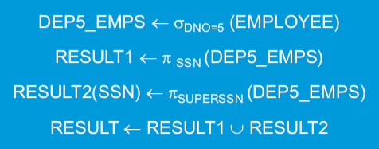

# Short cheat sheet for CS3402

--------

## SQL

-----

- (ALWAYS CONSIDER ALIAS AND DISTINCT, READ THE QUESTION IN DETAIL, ALWAYS LOOK BACK to THE RELATION, figure out what relations are needed at first)

- Clustered practice questions

  - Relations of department
    - EMPLOYEE(FNAME, MINIT, LNAME, <u>SSN</u>, BDATE, ADDRESS, SEX, SALARY, SUPER_SSN, DNO)
    - DEPARTMENT(DNAME, <u>DNUMBER</u>, MGR_SSN, MGR_START_DATE)
    - DEPT_LOCATIONS(<u>DNUMBER</u>, <u>DLOCATION</u>)
    - WORKS_ON(<u>ESSN</u>, <u>PNO</u>, HOURS)
    - PROJECTS(PNAME, <u>PNUMBER</u>, PLOCATION, DNUM)
    - DEPEDENT(<u>ESSN</u>, <u>DEPENDENT_NAME</u>, SEX, BDATE, RELATIONSHIP)
  - Relations for mid-term
    - PERSON(<u>PID</u>, PNAME)
    - EVENT(<u>EID</u>, ENAME, START_TIME, END_TIME)
    - INVITED(<u>PID, EID</u>, ATTENDED)

  - Type I: Simple retrieve, update or delete

    - Retrieve the **birth date** and **address** of the employee(s) whose name is ‘John B. Smith’.

      ```sql
      SELECT Bdate, Address
      FROM EMPLOYEE
      WHERE Fname = 'John'
      AND 	Minit = 'B'
      AND		Lname = 'Smith';
      ```

    - Select all EMPLOYEE **Ssns**

      ```sql
      SELECT DISTINCT E.SSN
      FROM EMPLOYEE E;
      ```

    - Select all **combinations of EMPLOYEE Ssn and DEPARTMENT Name** in the database

      ```sql
      SELECT E.SSN, D.DNAME
      FROM EMPLOYEE E, DEPARTMENT D;
      ```

    - Find all of the employees whose first_name begins with ‘P’s

      ```sql
      SELECT *
      FROM EMPLOYEE
      WHERE FNAME LIKE 'P%';
      ```

    - Delete all records from the employee table where the first_name is Bob

      ```sql
      DELETE FROM EMPLOYEE
      WHERE FNAME = 'Bob';
      ```

    - Update the last_name to ‘Bob’ in the employee table where the employee_id is 123

      ```sql
      UPDATE EMPLOYEE
      SET LNAME = 'Bob'
      WHERE SSN = 123;
      ```

    - Increase the payment by 5% to all accounts; it is applied to each tuple exactly once.

      ```sql
      UPDATE EMPLOYEE
      SET SALARY = 1.05 * SALARY
      ```

    - Increase the payment by 6% to all accounts with balance over \$10000; all others receive 5% increase

      - the order is important => after increasing, bigger than 10000 is always bigger

      ```sql
      UPDATE EMPLOYEE
      SET SALARY = 1.06 * SALARY
      WHERE SALARY > 10000;
      
      UPDATE EMPLOYEE
      SET SALARY = 1.05 * SALARY
      WHERE SALARY <= 10000
      ```

    - MID-TERM: Change the attended from 1 to 2 and not attended from 0 to 1

      ```sql
      UPDATE INVITED
      SET ATTENDED = ATTENDED + 1;
      
      /* or */
      UPDATE INVITED
      SET ATTENDED = 2 WHERE ATTENDED = 1
      
      UPDATE INVITED
      SET ATTENDED = 1 WHETER ATTENDED = 0;
      ```

    - List in alphabetical order all customers having a loan at Kowloon branch (ORDER BY)

      ```sql
      SELECT DISTINCT CNAME
      FROM BORROW
      WHERE BNAME = 'Kowloon'
      ORDER BY CNAME;
      ```

    - List the entire borrow table in descending order of amount, and if several loans have the same amount, order them in ascending order by loan#:

      ```sql
      SELECT * 
      FROM BORROW
      ORDER BY AMOUNT DESC, 
      				 loan# ASC;
      ```

  - Type II: Retrieve with join condition

    - Retrieve the **name** and **address** of all employees of all employees who **work for** the **‘Research’** department

      ```sql
      SELECT FNAME, Address
      FROM EMPLOYEE, DEPARTMENT
      WHERE Ssn = Essn
      AND		Dname = 'Research';
      ```

    - For every project located in ’**Stafford**’, list the **project number**, the controlling **department number**, and the **department manager’s last name** 

      ```sql
      SELECT PNUMBER, DNUMBER, LNAME
      FROM PROJECT P, DEPARTMENT D, EMPLOYEE E
      WHERE D.DNUM = P.DNUMBER
      AND		D.MGR_SSN = E.SSN
      AND		P.PLOCATION = 'Stanford'
      ```

  - Type III: Use alias name to retrieve the information of recursive relationship or do the comparation **within one relation**

    - For each employee, retrieve the employee’s **first and last name** and the **first and last name of his or her immediate supervisor.** 

      ```sql
      SELECT E1.FNAME, E1.LNAME, E2.FNAME, E2.LNAME
      FROM EMPLOYEE E1, EMPLOYEE E2
      WHERE E1.SUPER_SSN = E2.SSN
      ```

    - Mid-term question: Retrieve the ids and names of all persons who have attended to two distinct events that have the same start time and end time

      ```sql
      SELECT DISTINCT P1.PID, P1.PNAME
      FROM PERSON P1, EVENT E1, INVITED I1, EVENT E2, INVITED I2
      WHERE P1.PID = I1.PID AND I1.EID = E1.EID
      AND		P1.PID = I2.PID AND I2.EID = E2.EID
      AND 	E1.EID <> E2.EID
      AND		E1.START_TIME = E2.START_TIME 
      AND 	E1.END_TIME = E2.END_TIME;
      
      SELECT DISTINCT P.PID, P.PNAME
      FROM PERSON P, INVITED I, EVENT E
      WHERE P.PID = I.PID AND I.EID = E.EID AND I.ATTENDED = 1
      AND (E.START_TIME, E.END_TIME) IN (
      	SELECT E1.START_TIME, E1.END_TIME
        FROM EVENT E1, INVITED I1
        WHERE E1.EID = I1.EID AND I1.PID = P.PID AND I1.ATTTENDED = 1
        AND E1.EID <> E.EID
      );
      ```

  - Type IV: Set operations

    - Make a list of all **project numbers** for projects that involve an employee whose last name is ’Smith’, either as a **worker of the project or as a manager of the department that controls the project**

      ```sql
      (
        SELECT DISTINCT P.PNUMBER
        FROM PROJECT P, WORKS_ON W, EMPLOYEE E
        WHERE W.ESSN = E.SSN AND P.PNUMBER = W.PNO
        AND E.LNAME = 'Smith'
        /*
        SELECT DISTINCT W.PNO PNUMBER
        FROM WORKS_ON W, EMPLOYEE E
        WHERE W.ESSN = E.SSN AND E.LNAME = 'Smith' 
        */
      )
      UNION
      (
      	SELECT DISTINCT P.PNUMBER
        FROM PROJECT P, DEPARTMENT D, EMPLOYEE E
        WHERE P.DNUM = D.DNUMBER AND E.SSN = D.MGR_SSN 
        AND E.LNAME = 'Smith'
      );
      ```

  - Type V: Nested queries (Nested query returns one value can be treated as a value, with more than one can be treated as a set)

    - Make a list of all **project numbers** for projects that involve an employee whose last name is ’Smith’, either as a **worker of the project or as a manager of the department** that controls the project **by using nested queries**

      ```SQL
      SELECT DISTINCT PNUMBER
      FROM PROJECT P
      WHERE
      P.PNUMBER IN (
      	SELECT P1.PNUMBER
        FROM PROJECT P1, DEPARTMENT D, EMPLOYEE E
        WHERE D.DNUMBER = P1.DNUM AND 	E.SSN = D.MGR_SSN
        AND E.LNAME = 'Smith'
      )
      OR P.PNUMBER IN (
      	SELECT W.PNO
        FROM WORKS_ON W, EMPLOYEE E1
        WHERE E1.SSN = W.ESSN
        AND E1.LNAME = 'Smith'
      );
      ```

    - Select the Essn of all employees who work the same **project and hours** as the employee Essn = “123456789”

      ```sql
      SELECT DISTINCT W1.ESSN
      FROM WORKS_ON W1
      WHERE (W1.PNUM, W1.HOURS) IN (
      	SELECT W2.PNO, W2.HOURS
        FROM WOTKS_ON W2
        WHERE W2.ESSN = 123456789
      );
      
      SELECT DISTINCT W1.ESSN
      FROM WORKS_ON W1, WORKS_ON W2
      WHERE W2.ESSN = 123456789 
      AND 	W1.PNO = W2.PNO AND W1.HOURS = W2.HOURS;
      ```

    - Find the last name and First name of the employees with salary higher than all the employees in the department 5

      ```sql
      SELECT DISTINCT E.FNAME, E.LNAME
      FROM EMPLOYEE E
      WHERE E.SALARY > ALL (
      	SELECT E1.SALARY
        FROM EMPLOYEE E1
        WHERE E1.DNO = 5
      );
      ```

    - Find names of all branches that have greater assets than some branch located in Central

      ```sql
      SELECT BNAME
      FROM BRANCH
      WHERE ASSETS > SOME(
      	SELECT ASSETS 
        FROM BRANCH
        WHERE B_CITY = "CENTRAL"
      );
      
      SELECT DISTINCT X.BNAME
      FROM BRANCH X, BRANCH Y
      WHERE X.ASSETS > Y.ASSETS AND Y.B_CITY = "CENTRAL";
      ```

      * Find all customers who have an account at some branch in which Jones has an account

      ```sql
      SELECT DISTINCT T.CNAME
      FROM DEPOSITE T
      WHERE T.CNAME != 'JONES'
      AND T.BNAME IN(
      	SELECT S.BNAME
        FROM DEPOSITE S
        WHERE S.CNAME = "JONES";
      );
      
      SELECT DISTINCT T.CNAME
      FROM DEPOSITE T, DEPOSITE S;
      WHERE T.CNAME != 'JONES'
      AND T.BNAME = S.BNAME
      AND S.CNAME = 'JONES';
      ```

      - Find all customers of Central branch who have an account there but no loan there

        ```sql
        SELECT C.cname 
        FROM Customer C 
        WHERE EXISTS
        			(SELECT *
        			 FROM Deposit D
        			 WHERE D.cname = C.cname	(account <=> customer)
        			 AND D.bname = “Central”)
        	  AND NOT EXISTS
        			(SELECT *
        			 FROM Borrow B
        			 WHERE B.cname = C.cname	(loan <=> customer)
        			 AND B.bname = “Central”);
        /* OR */
        (
          SELECT D.CNAME
        	FROM DEPOSITE D
        	WHERE D.BNAME = 'Central'
        )
        MINUS
        (
          SELECT B.CNAME
        	FROM BORROW B
          WHERE B.BNAME = 'Central'
        );
        ```

      - Find branches having greater assets than all branches in N.T

        ```sql
        SELECT X.bname
        FROM Branch X
        WHERE NOT EXISTS(SELECT *
                         FROM Brach Y
                         WHERE Y.b-city="N.T."
                         AND Y.assets>=X.assets);
        //or
        SELECT bname
        FROM Branch
        WHERE assets>ALL(SELECT assets
                         FROM Branch
                         WHERE b-city="N.T.");
        ```

      - Find all customers who have a deposit account at ALL branches located in Kowloon(no branch do not contain its deposit) => **better to draw a Venne diagram**

        ```sql
        SELECT DISTINCT S.cname
        FROM Deposit S
        WHERE NOT EXIST(
            (
              SELECT bname
             	FROM Branch
             	WHERE b-city = "Kowloon"
            )
            MINUS(
            		SELECT T.bname
                FROM Deposit T
                WHERE S.cname = T.cname
            )
        );
        
        所有的S使得 不存在(在九龙但不包含S的branch)
        在九龙-包括他 个数为零
        //not sure correct
        SELECT DISTINCT S.cname
        FROM Deposit S
        WHERE (
        	SELECT COUNT(*)
            FROM BRANCH B, DEPOSIT T
            WHERE B.cname = T.cname
            AND B.b-city = "Kowloon"
            AND S.cname != T.cname
        )=0;
        ```

  - Type VI: Aggregate functions and GROUP BY

    - Find the sum of the salaries of all employees of the ‘Research’ department, as well as the maximum salary, the minimum salary, and the average salary in this department

      ```sql
      SELECT SUM(SALARY), MAX(SALARY), MIN(SALARY), AVG(SALARY)
      FROM EMPLOYEE E, DEPARTMENT D
      WHERE E.DNO = D. DNUMBER AND D.DNAME = 'Research'
      ```

    - Select the number of employees in ‘Research’ department

      ```sql
      SELECT COUNT(*)
      FROM EMPLOYEE E, DEPARTMENT D
      WHERE E.DNO = D.DNUMBER AND D.DNAME = 'Research'
      ```

    - Select the number of different salary values in the database.

      ```sql
      SELECT COUNT(DISTINCT SALARY)
      FROM EMPLOYEE
      ```

    - Retrieve the names of all employees who have **2 or more dependents**

      ```sql
      SELECT DISTINCT E.FNAME, E.MINIT, E.LNAME
      FROM EMPLOYEE E
      WHERE (
      	SELECT COUNT(*)
        FROM DEPEDENT DP
        WHERE DP.ESSN = E.SSN
      ) >= 2;
      ```

    - For **each department**, retrieve the department number, the  number of employees in the department, and their average salary.

      ```sql
      SELECT E.DNO, COUNT(*), AVG(E.SAL)
      FROM EMPLOYEE E
      GROUP BY E.DNO;
      ```

    - For **each project**, retrieve the project number, the project  name, and the number of employees who work on that project. 

      ```sql
      SELECT W.PNO, P.PNAME, COUNT(*)
      FROM WORKS_ON W, PROJECT P
      WHERE W.PNO = P.PNUMBER
      GROUP BY W.PNO, P.PNAME;
      ```

    - For **each project** on which **more than two employees** work,  retrieve the project number, the project name, and the number of employees who work on the project

      ```sql
      SELECT P.PNUMBER, P.PNAME, COUNT(*)
      FROM PROJECT P, WORKS_ON W
      WHERE P.PNUMBER = W.PNO
      GROUP BY P.PNUMBER, P.PNAME
      HAVING COUNT(*) > 2;
      ```

    - For each department that has more than five employees,  retrieve the department number and the number of its employees who are marking more than $40,000.

      ```SQL
      SELECT D.DNUMBER, COUNT(*)
      FROM DEPARTMENT D, EMPLOYEE E
      WHERE D.DNUMBER = E.DNO
      AND		E.SALARY > 40000
      AND D.DNUMBER IN (
      	/*SELECT D1.DNUMBER
        FROM DEPARTMENT D1, EMPLOYEE E1
        WHERE D1.DNUMBER = E1.ENUMBER
        GROUP BY D1.DNUMBER
        HAVING COUNT(*) > 5*/
        SELECT E1.DNO
        FROM EMPLOYEE E1
        GROUP BY E1.DNO
        HAVING COUNT(*) > 5
      )
      GROUP BY D.DNUMNBER;
      ```

    - Midterm => return number of persons who have **attended** events with a **name start with ‘Food’**

      ```sql
      SELECT COUNT(*)
      FROM EVENT E, INVITED I
      WHERE E.EID = I.EID AND E.ENAME LIKE 'Food%' AND I.ATTENDED = 1;
      ```

    - Midterm => get the id and name of the event that the most of persons have attended

      ```sql
      SELECT E.EID, E.ENAME
      FROM EVENT E, INVITED I
      WHERE E.EID = I.EID AND I.ATTENDED = 1
      GROUP BY E.EID, E.ENAME
      HAVING COUNT(*) >= ALL (
      	SELECT COUNT(*)
        FROM INVITED I1
        WHERE I1.ATTENDED = 1
        GROUP BY I1.EID
      )
      ```

    - Midterm => For each events, returns the id and name and number of person attended it

      ```SQL
      SELECT E.EID, E.ENAME, COUNT(*)
      FROM EVENT E, INVITED I
      WHERE E.EID = I.EID AND I.ATTENDED = 1
      GROUP BY E.EID, E.ENAME;
      ```

    - Midterm => Return the id, name of the person who absence the most events

      ```sql
      SELECT P.PID, P.PNAME, COUNT(*)
      FROM PERSON P, INVITED I
      WHERE P.PID = I.PID AND I.ATTTENDED = 0
      GROUP BY P.PID, P.PNAME
      HAVING COUNT(*) >= ALL(
      	SELECT COUNT(*)
        FROM INVITED I1
        WHERE I1.ATTENDED = 0
        GROUP BY I1.PID
      );
      ```

-------

## Relational Algebra

---------

* Retrieve the ssn of all employees who either **work in** department 5 or **directly supervise** an employee who works in department 5 => use the union

  

* Intersaction: $R\cap S=(R \cup S)-(R-S)-(S-R)$

* Theta join: join after selection, Equijoin: join with condition equal, Natural join: join eliminating the duplicate column (**notice that if there are multiple attr used as join condition must satisfy the composite attr is same to join**)

* **Complete Set** of Relational Operations: SELECT, PROJECT, UNION, DIFFERENCE, RENAME, and CARTESIAN PRODUCT X (any other relational algebra expression can be expressed by a combination of these five)

* Notice to use RESULT(a,b,c) <- …, notice to rename if want to use natural join or set operations

----------

## Indexing and B+ tree

* Dense index: an index entry for one record

* Sparse index: an index entry for multiple records

* **Primary index(sparse)**: Suppose the data record size $R$ is 100 bytes , block size $B$ is 1024 bytes, the number of records $r$ is 30,000, pointer size $P_R$ is 6 bytes, field size $V$ is 9 bytes, calculate the block access number respectively
  $$
  b_1 = {{R*r} \over B} = 30000*100/1024 = 3000\ blocks\\
  b_2 = {{b_1*(P_R+V)} \over B} = 3000*15/1024 = 45\ blocks\\
  a_1 = log_2b_1 = 12\\
  a_2 = log_2b_2 + 1 = 6 + 1 = 7\\
  $$

* **Cluster index(sparse):** Non-key field as base of order => duplicate, point to the block with the first existence. 

* **Secondary index(dense)** (already sorted by others)

  * Field is key => dense: Access time of unordered without indexing and with indexing

    * Access time of unordered without indexing
      $$
      b_1 = {{\color {red} r*R} \over B} = 30000*100/1024 = 3000\ blocks\\
      cost = b_1/2 = 1500
      $$

    * Access time with index (dense key)
      $$
      b_2 = {{\color {red} r*(P_R+V)} \over B} = 30000*15/1024 = 442\ blocks\\
      cost = log_2b_2 + 1 = 10
      $$

  * Field is non-key => sparse

* **Multiple-level index** (primary index of previous level)

  * First level point to data

  * An example from the previous example
    $$
    b_1 = {{\color {red} r*(P_R+V)} \over B} = 30000*15/1024 = 442\ blocks\\
    b_2 = {{\color {red} b_2*(P_R+V)} \over B} = 442*15/1024 = 7\ blocks\\
    b_3 = {{\color {red} b_3*(P_R+V)} \over B} = 7*15/1024 = 1\ blocks\\
    $$

    - Thus, the total level of indexing is 3

    - one accessing for each level and final access for data block
      $$
      cost = level\ of\ blocks + 1
      $$

* Reason of using tree structure: Insertion and deletion is convenient

  * index size for b-tree: suppose the pointer limit is 23 and each of the node is 69% full, thus there are $0.69*23=16$ pointers to next level, therefore on level $k​$
    $$
    Node\# = {pointer\#}^k \\
    current\ level\ pointer\# = {pointer\#}^{k+1} \\
    index\ entries = current\ level\ pointer\# - node\#
    $$
    

  * For b+-tree

    * Suppose the search key field is $V$ = 9 bytes, block size $B$ = 512 bytes, record pointer (leaf pointer) size $P_r$ = 7 bytes, block pointer is $P$ = 6 bytes => determine the pointer number limit $p​$ 
      $$
      p*P + (p-1)*V \leq B \\
      6p + 9p - 9 \leq 512 \\
      p_{leaf}*(P_r+V) + P \leq B \\
      p_{leaf} * (7+9) + 6 \leq 512 \\
      p = 34\\
      p_{leaf} = 31 \\
      $$

    * The way to calculate the index size is the same => $0.69*34 = 23, 0.69*31=21$ , but since the data record pointer is the same with key, the leaf level is 12167*21

      

    * split point: floor((n+1)/2), merge or borrow when(n < k/2)

------

## Transaction

* ACID principle, a transaction is : 
  * Atomicity: A transaction is either performed completely or not performed at all
  * Consistency: A correct execution of a transaction must take the database from one consistent state to another
  * Isolation: Only after a transaction is committed, it can be visible to other transactions (no partial results)
  * Durability: Once a transaction is committed, these changes must never be lost because of subsequent failure (committed and permanent results)
* Transaction schedule: Any order 
  * Ordering of the transactions: **if it is under the constraint that the ==relative order of the operations== in the same transaction is not changed**
  * Serial schedule: no interleaving
  * Concurrent schedule: interleaved
  * Serializable schedule: A **concurrent** schedule S which is **equivalent** to serial schedule
  * Serially equivalent schedule: results of schedule is equivalent to a serial schedule
  * Conflict equivalent schedule: Any of conflict operations(RW, WW) is same in **both schedule(they may not be serial schedule)**
  * Conflict serializable schedule: A schedule conflict equivalent to serial schedule
* Conflicts
  * Lost update problem (write/write conflicts) 
  * Inconsistent retrieval problem (read/write conflicts)
* Serialization Graphs: A direct edge $T_i -> T_j$ can drawn if $j $ is after $i $, and
  - $i $ is write, $j $ is read or
  - $i$ is read, $j$ is write or
  - $i$ is write, $j$ is write
  - It is serializable iff the graph is acyclic(there are 2 nodes represent $i$ & $j$, no bidirectional edge)
  - all of one node’s conflicting operations is before the other one
* Recoverable schedule: commit of read is after commit of previous write
* Cascadeless schedule: begin of read is after commit of previous write
* Strict schedule: write and read is after commit of previous write
* Logging
  * Undo-logging
    * U1: if transaction T modifies database element X, the log need to record in the form \<T,X,v\> , where
      - T :the transaction
      - X is the variable to change
      - v is the original value
    * U2: ==\<commit\> log record must be written to disk ONLY after all DB elements changed by the transaction have been written back to disk==
    * order: log records indicating changes( and flush log) => actual changes(only OUTPUT) => commit(and flush log)
    * Steps:
      - Recovery manager scans the log from the end and remember all transactions T with \<COMMIT T\> record or an \<ABORT T\> record
      - if it sees \<T,X,v\> 
        - if there is \<COMMIT T\> after it, do nothing; 
        - Otherwise, write v to X; 
        - After making the changes, the manager must write a log record \<ABORT T\> for each incomplete transaction that was not previously aborted and then flush the log. 
  * Redo-logging
    * R1: Any change to X must recorded as \<T, X, v \> followed by \<COMMIT T\> where v is the **new value**
    * order: log file indicates changes -> COMMIT(and flush log) -> change (OUTPUT)
    * Steps:
      * Scan the log forward from the beginning, if meet \<T, X, v\> 
      * if T is not a committed transaction, do nothing
      * if T is a committed transaction, write value v for database element X (Things are already done because the flush-log is together)
      * For each incomplete transaction T, the manager must write a log record \<ABORT T\> for each incomplete transaction that was not previously aborted and then flush the log.

-------------

## Concurrency Control

* B2PL: get lock one by one, after releasing one lock, it might be wait on another one
* C2PL: get and release lock at one time  (prevent hold and wait)
* S2PL: release lock at one time
* Performance: 
  * S2PL is better than C2PL when the transaction workload is not heavy since the lock holding time is shorter in S2PL, but when heavy workload C2PL is better because deadlock may occur in S2PL ($T_1$ locks b in the first operation of the above graph)
  * If you already analyzed and found a dead lock => C2PL is better
* Avoid cyclic wait => timestamp
  * wait(old)-die(young) rule (non-preemptive): A transaction can be allowed to wait for a lock iff it is older than the holder, otherwise it is restarted with **the same timestamp** (second time the lock might be available)
  * wound(old)-wait(young) rule (preemptive): A transaction can be allowed to wait for a lock iff it is younger than the holder, otherwise the holder is restarted with **the same timestamp** and the lock is granted to the requester
* Dead lock detection: if find cycle => dead lock


