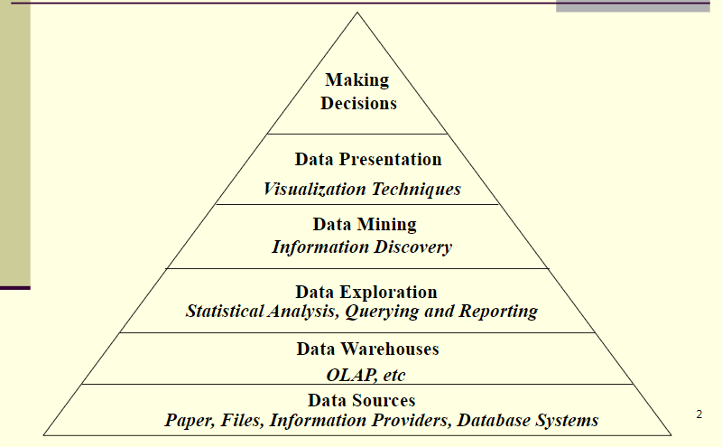
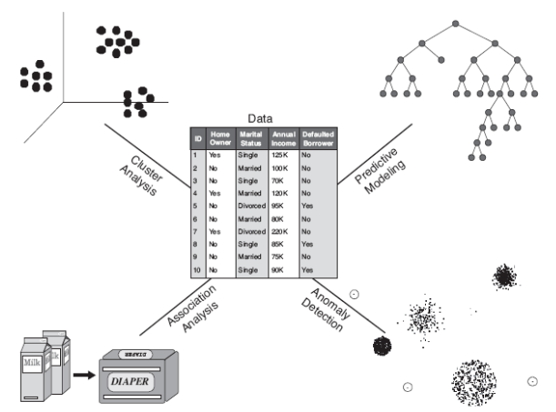

# CS3481

## Lecture 01: Introduction

### Basic Concepts of Data Science

* Hierarchy

* Applications
  * Business
  * Science & Engineering
  * Medicine
* Data Mining: A fundamental approach in data science which allows **automatic discovery** of **useful** information in **large** data repositories. (Looking up individual records using a database management system or finding particular Web pages via a query to an Internet search engine are not data mining.)
* Process of Knowledge Discovery in Database (KDD)
  * Data cleaning: A process that **removes noise** and inconsistent data
  * Data integration: The stage where **multiple** data sources are **combined**
  * Data selection: The stage where data **relevant** to the analysis task are **retrieved** from the database.
  * Data transformation: The stage where data are **transformed** **into** forms **suitable** for mining.
  * Data mining: An important process where intelligent and efficient **methods** are **applied** to **extract patterns**.
  * Pattern evaluation: A process that identifies the truly **interesting** patterns representing knowledge **based on interestingness measures**.
  * Knowledge presentation: The stage where **visualization** and knowledge **representation** techniques are used to **present** the mined knowledge to the user.

* Challenges
  * Scalability: Algorithms scalable to handle massive data sets, which may require
    * Employing special search strategies 
    * Implementing novel data structures
    * Using sampling
    * Developing parallel & distributed algorithms
  * High dimensionality: Encounter large number of features
  * Heterogeneous and complex data: Deal with data sets containing attributes of the different types
* Areas related
  * Statistics: Sampling, estimation, hypothesis testing
  * AI & pattern recognition & ML: Search Algorithms, Modeling techniques, learning theories
  * Database systems
  * High performance computation techniques
  * Distributed techniques

### Tasks

* Predictive Modeling
  * Predict value of a particular attribute (target/dependent variable) based on the values of others (explanatory or independent variables)
  * Types
    * Classification: Discrete target variables (Predicting kind of flowers or web robot detection)
    * Regression: Continuous target variables
  * Goal: minimize the error between predicted and true values of the target variable
* Association Analysis
  * Discover patterns that describe strongly associated items in the data
  * Patterns represented in implications rules or item subsets
* Cluster Analysis: Seeks to find groups of closely related observations

---------------------

## Lecture 02: Data

### Data set & Data

* Data set: Collection of data objects

  * A data set is usually a **file**, in which

    - The objects are records (or rows) in the file and
    - Each field (or column) corresponds to an attribute

  * Types: 

    

    - Record data: A collection of records, each record consists of a fixed set of data fields, usually stored in flat files or in relational databases
    - Transaction or market basket data: A special type of record data, each involves a set of items,
    - Data matrix: Once the data objects all have the same fixed set of numeric attributes, then they can be thought of as points (vectors) in a multidimensional space (m rows (objects), n cols (attributes) ), can apply standard matrix operations to transform and manipulate the data
    - Sparse data matrix: Special case of data matrix, large number of zeros in he matrix, only non-zero attribute values are important, sparsity is an advantage (save storage space & computation),
      - use term vector to represent a document: each term is an attribute, the value is the time existence of the term in the document (also called document-term matrix)

* Data object: record, point, vector, pattern, event, case, sample, observation or entity.

  * Data objects are described by a number of attributes that capture the basic characteristics of an object

* Attributes

  - A property or characteristic of an object that may vary among different either objects or times
  - Measurement scale: A rule (function) that associates a numerical or symbolic value with an attribute of an object
    - The process of measurement is the application of a measurement scale to associate a value with a particular attribute of a specific object. 
  - Types: 
    - By function: Nominal and ordinal attributes are collectively referred to as categorical or qualitative attributes and interval and ratio attributes are collectively referred to as quantitative or numeric attributes.
      - Nominal (標稱): Different names, provides only enough information to distinguish (eye color, gender)
      - Ordinal (序數): Provides enough information to order objects (grades)
      - Interval: Differences between values are meaningful (calendar dates)
      - Ratio: Both differences and ratios are meaningful (monetary quantities, mass, length)
    - By number of values: Discrete or continuous
      - Discrete: Finite or countably infinite set of values, can be categorical, binary attributes are a special case
      - Continuous: One whose values are real numbers, typically represented as floating point variables

### Data quality (quality of measurement)

- Precision

  - Closeness of repeated measurements (of the same quantity) to one another
  - Often measured by the standard deviation of a set of values

- Bias

  - Systematic variation of measurements from the quantity being measured
  - Measured by taking difference between the **mean(estimated)** of the set of values and the **known value of the quantity being measured (ground truth)**

- Example

  - Suppose we have a standard laboratory weight **with a mass of 1g** and we want to assess the **precision and bias** of our new laboratory scale. We weigh the mass five times, and obtain the values: $\{1.015, 0.990, 1.013, 1.001, 0.986\}$. 
  - mean: 1.001, bias: 0.001, precision ( `sqrt(var)` ): 0.013 

- Noise & Outlier

  - Noise: Random component of a measurement error

    

  - Outliers: Data objects that, in some sense, have characteristics that are different from most of the other data objects in the data set

- Missing values: It is common to miss one or more attributes for an object. The strategy is: 

  - Eliminate data objects: For the case that there’s only few incomplete objects. Not for many objects since partially object can have useful information
  - Estimate missing values: Estimate value for one object according to the others
    - Discrete: Use the most commonly occurring value
    - Continuous: Average attribute value of similar points is used

### Data preprocessing

- Aggregation
- Samplings
- Dimensionality reduction
- Discretization
- Normalization

### Similarity and Dissimilarity

- Nominal
- Ordinal
- Interval/Ratio
- Distance

### Summary Statistics