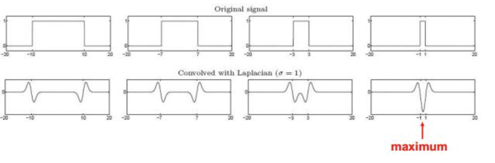
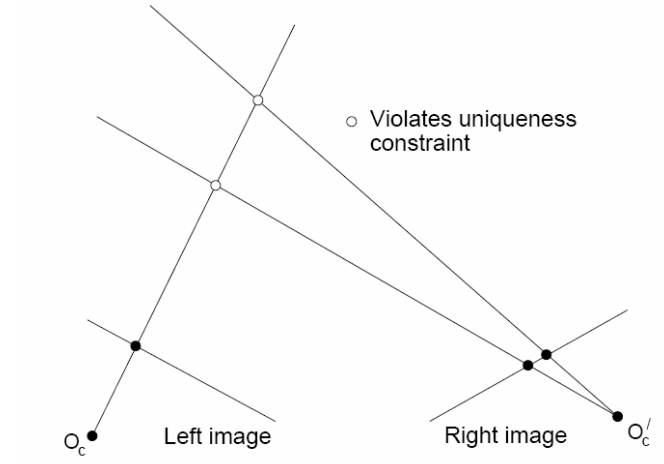
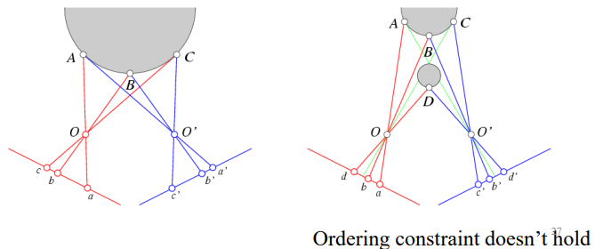

# CS 4186 Computer Vision Review

[TOC]

## Exam Info

* Time: 18:30 - 20:30 05/May (20:45 for submission)

* Two monitoring device

* Open book, online

* Materials

  * Calculator
  * Books, notes (hard copy)

* Types of questions

  * Short answer question (2-3 sentences)
  * Calculations
  
* The first page with academic honesty should be submitted together with the answers, as you need to reaffirm the academic honesty policy. 

  Academic Honesty

   

  *I pledge that the answers in this examination are my own and that I will not seek or obtain an unfair advantage in producing these answers. Specifically,*

  * *I will not plagiarize (copy without citation) from any source;*
  * *I will not communicate or attempt to communicate with any other person during the examination; neither will I give or attempt to give assistance to another student taking the examination; and*
  * *I will use only approved devices (e.g., calculators) and/or approved device models.*
  * *I understand that any act of academic dishonesty can lead to disciplinary action.*

  *I pledge to follow the Rules on Academic Honesty and understand that violations may lead to severe penalties.*

  Student ID:  55199998

  Name: ZHANG Deheng

## 1 Image Filtering

### 1.1 Image

* Image is a grid of intensity values
* Can be represented as a function $f:\mathbb R^2 \mapsto \mathbb R$
  * $f(x,y)$ is the intensity value at position $(x,y)$ 
* A digital image is a discrete (sampled, quantized) version of this function

### 1.2 Linear Filter

* Image transformation: any functions to change the range of the image function

* Filtering: form a new image whose pixels are a combination of the original pixels (in a specific range)

  * get useful information from images
  * enhance the image (change the visual effect, remove noise)

* Linear Filtering: the target pixel is a linear combination (weighted sum) of its neighbour. The operator is called a kernel (or mask, filter)

  * $H$ represents the kernel of size $(2k+1) \times (2k+1)$, and $G$ represents the output image

  * Cross-correlation: 
    $$
    G = H \otimes F\\
    G[i,j] = \sum ^k_{u=-k} \sum ^k_{v=-k}H[u,v]F[i+u, j+v] \\
    $$

  * Convolution: 
    $$
    G = H*F\\
    G[i,j] = \sum ^k_{u=-k} \sum ^k_{v=-k}H[u,v]F[i-u, j-v] \\
    s.t. G=H * F =F*H
    $$

    * Mean filtering & Box filter: can **blur** the image
      $$
      n = (2k+1) \times (2k+1)\\
      \forall u,v\in [-k,k] \cap \Z, H[u,v] = {1 \over n}
      $$

    * Image sharpening: original image adds the difference between it and the blurred image

      

    * Gaussian filter: the filter is defined by 2D Gaussian distribution function
      $$
      G_{\sigma} = {1\over 2\pi\sigma^2}e^{-{(x^2 + y^2)\over 2\sigma^2}}
      $$

      * The filter sums to 1
      * $\sigma$ affects the feature’s scale
      * convolution with itself is another Gaussian
      * Can also be used to blur the image (mean filter may intrdouce grid-like high-frequency noise to the image), while Guassian filter removes the “high-frequency” components from the image (low-pass filter)

## 2 Edge Detection

### 2.1 Image Derivatives

* Edges correspond to extrema (maximum or minimum) of first order derivative of the image intensity function

* Two options

  * Option 1: reonstruct a continuous image $f$ then compute the derivative

  * **Option 2**: take discrete derivative (finite difference)
    $$
    {\delta f \over \delta x}[x,y] \approx F[x+1, y] - F[x, y]
    $$
    

### 2.2 Image Gradient

* used in the SIFT detector.
* The gradient is defined as $\nabla f=[I_x, I_y]$ 
  * **gradient magnitude**: $||\nabla f|| = \sqrt{(I_x)^2 +(I_y)^2}$
  * **gradient direction**: $\theta = tan^{-1}({I_y \over I_x})$ 

### 2.3 Sobel (smooth before derivative)

* The edge corresponds to the peak in the first order derivatives

* There might be noise for the image => many peaks

  

* Smooth by using Gaussian filter and then apply the associative property of convolution
  $$
  {d \over dx}(f*h) = ({d \over dx}h)* f \\
  $$

* Sobel operator: The common approximation of derivative of Gaussian w.r.t $x$ and $y$ 

  

  * $1 \over 8$ is omitted in the stardard definition
  * Added to get the right gradient magnitude

### 2.4 Laplacian of Gaussian (LoG) 

* The edges correspond to zero-crossing in the second order derivatives

* Smooth by Gaussian: 

  * 1D example

  $$
  ({\delta^2 \over \delta x^2} h) * f
  $$

  * 2D case: observe the LoG function and construct the filter, then do the convolution

  $$
  \nabla^2h = {\delta^2 h \over \delta x^2} + {\delta^2 h \over \delta y^2} \\
  I_{xx} + I_{yy} = (\nabla^2h) * I\\
  $$

### 2.5 Canny Edge Detector

* Good edge detector
  * good detection: find all real edges, ignoring noise or other artifacts
  * good localisation: 
    * edges detected are close  to the true edges
    * one point only for each true edge point
* Canny edge detector
  * Filter image with derivative of Gaussian
  * Find the magnitude and orientation
  * Non-maximum suppression: ignore noise
    * get the gradient direction, and compare the edge strength along the direction
    * preserve the largest and suppress the others
  * Linking and thresholding (hysteresis):
    * Define two thresholds: low and high
      * \> high: strong edge
      * \< low: noise
      * Between: weak edge
    * Use the high threshold to start edge curves and the low threshold to continue them
      * ‘Follow’ edges starting from strong edge pixels
      * Continue them into weak edges

## 3 Image Sampling

### 

* Resampling
  * upsampling: from low resolution to high resolution (guess the missing pixels)
  * Subsampling (downsampling): delelte some pixels
* nearest neibor

### 3.1 Gaussian Pyramid

* Gaussian pre-filtering: Filter the image by gaussian first, then sub-sample the image
* Gaussian Pyramid: sequence of blur and subsample

### 3.2 Image Upsampling

* **Nearest neighbour**: copy the pixel from the nearest pixel in the original image
* Average of neighbours
* Gaussian filter

## 4 Color and Texture

### 4.1 Color (no calculation in the exam)

* Histogram
  * Gray image histogram: $H[i]$ is the frequency of the grey tone $i$, $P[i]$ is the percentage of pixels that have gray tone $i$ 
    $$
    h(i) = \sum_x \sum_y \mathbb{I}[f(x,y)=i]
    $$

  * RGB histograms

    * single 3D histogram $H[r,g,b]$ ($256 \times 256 \times 256$)

    * Make 3 histograms and concatenate them ($3 \times 256$ )

    * Create pseudo 8-bits color by using 3 bits of R 3 bits of G and 2 bits of B $(1\times 256)$

    * Normalized color space and 2D histogram (record $r,g$ and calculate $b = 1-r-g$) 
      $$
      r = {R \over R+G+B}, g = {G \over R+G+B}, b = {B \over R+G+B}
      $$

  * Intersection and match score: 
    $$
    intersection(h(I), h(M)) = \sum _{j=1}^{numbins}min\{h(I)[j], h(M)[j]\} \\
    match(h(I), h(M)) = {intersection(h(I), h(M)) \over \sum _{j=1}^{numbins}h(M)[j]}
    $$

  * Property

    * Robust for 2D rotation
    * Not robust for 3D rotation 

* Multi-scale spatial color representation

  * Divide an image into $N \times N$ grids at multiple scales
  * Compute color histogram for each grid
  * Concatenate all the histograms across scales and grids as a feature vector

### 4.2 Edge-based Texture Measures

* gradient magnitude

  * Use an edge detector as the first step in texture analysis.

    * The number of edge pixels in a fixed-size region tells us how busy that region is. 
    * The directions of the edges also help characterize the texture

  * Edgeness per unit area: $N$ represents the size of the unit area
    $$
    F_{edgeness} = {|\{p|gradient\_magnitude(p) \geq threshold\} |\over N}
    $$

* magnitude & direction histogram (similar to SIFT)
  $$
  F_{magdir} = (H_{magnitude}, H_{direction})
  $$

  * these are normalized histograms of gradient magnitudes aned gradient directions
  * e.g. the direction bin can be set in $[0,2 \pi]$ with 16 bins

### 4.3 Local Binary Pattern Measure

* For each pixel, find the comparison of $3 \times 3$ window

  
  $$
  LBP_{p,r} (N_c) = \sum^{P-1}_{p=0}\mathbb{I}[N_p = N_c]2^p
  $$

  * $N_c$ : center pixel
  * $N_p$: neighbour pixel
  * $r$: radius (for $3 \times 3$ cell, it is 1)

### 4.4 Co-occurrence Matrix Features

* Co-occurrence matrix is a 2D array in which

  * rows and columns are labelled by the possible pixel value ($256 \times 256$) 
  * $C_d[i,j]$ represents the value how many times value $i$ co-occurs with value $j$ in a particular spatial relationship represetned by a vector ${\bf d}=(d_r, d_c)$ 
  * We can normalize the matrix $C$ by dividing all values by the sum of all the values to get the normalized co-ocurrence matrix $N$

* Example:

  

## 5 Corners and Blobs

* Interesting features
  * corner: defined as the intersection of two edges
  * blob: regions in the image that differ in properties, such as brightness or color, compared to the surrounding regions
* Application example: panorama stitching
  * Interest point detection - Harris corner detection or LoG blob detection
  * extract features - SIFT
  * match features - distance & ration distance
  * Align images (perspective transform)
* Invariant local features
  * geometric invariance: translation, rotation, scale
  * photometric invariance: brightness, exposure
  * Advantages:
    * Locality – features are local, so robust to occlusion and clutter 
    * Quantity – hundreds or thousands in a single image 
    * Distinctiveness: – can differentiate a large database of objects 
    * Efficiency – real-time performance achievable
* Corner vs flat vs edge: move the window a little bit
  * corner: signifcant change
  * Edge: no change along the edge direction
  * Flat: no change in all direction

### 5.1 Harris corner detection

* SSD error:
  $$
  E(u,v) = \sum_{(x,y) \in W}[I(x+u, y+v) - I(x,y)]^2
  $$

  * shift the window by $(u,v)$ 
  * summing up the squared difference (SSD)
  * search the high error patch

* Small motion assumption
  $$
  I(x+u, y+v) \approx I(x,y) + I_x u+ I_yv \\
  \approx I(x,y) + [I_x, I_y][u,v]^T \\
  E(u,v) \approx \sum_{(x,y) \in W}[I_x u+ I_yv]^2 \\
  \approx Au^2 + 2Buv + Cv^2 = [u,v] 
  \begin{bmatrix}
  A & B\\
  B & C\\
  \end{bmatrix}
  \begin{bmatrix}
  u\\
  v\\
  \end{bmatrix}
  \\ 
  where\ A= \sum_{(x,y) \in W}I^2_x, B = \sum_{(x,y) \in W}I_xI_y,C=\sum_{(x,y) \in W}I^2_y, H = \begin{bmatrix}
  A & B\\
  B & C\\
  \end{bmatrix}
  $$
  
  * If the motion of the window is small, we can represent the shifted image as the first order Taylor expassion 
  
* Eigenvalues analysis: $H$ is a real symmetric matrix
  $$
  H = V\Lambda V^T \ s.t. V^TV = I \\
  SSE = [u,v] 
  H
  \begin{bmatrix}
  u\\
  v\\
  \end{bmatrix} = [u,v] 
  V\Lambda V^T
  \begin{bmatrix}
  u\\
  v\\
  \end{bmatrix} \\
  V' = \begin{bmatrix}
  m\\
  n\\
  \end{bmatrix} = V^T\begin{bmatrix}
  u\\
  v\\
  \end{bmatrix} \\
  SSE = (V')\Lambda (V')^T =\lambda_1 m^2 + \lambda_2n^2 \geq min(\lambda_1, \lambda_2) (m^2 + n^2) = min(\lambda_1, \lambda_2) (u^2 + v^2)
  $$
  

  * larger $\lambda_1, \lambda_2$ => larger $min(\lambda_1, \lambda_2)$ => large SSD
  * Metrics
    * $R = \lambda_1\lambda_2 - k(\lambda_1 + \lambda_2)^2$ (large for corner, negative for edge, small for flat region)
    * $R = {\lambda_1\lambda_2  \over \lambda_1 + \lambda_2 } = {1 \over {1 \over \lambda_1} + {1 \over \lambda_2}}$  
    * $R = min(\lambda_1, \lambda_2)$ 

* Pipeline
  
  * compute the gradient at each point in the image (need Gaussian)
  * create the H matrix from the entries in the gradient
  * compute the eigenvalues
  * find points with large response ($\lambda_{min} > threshold$)
  * choose those points where $\lambda_{min}$ is a local maximum as features
  * Hyperparameters: not include (u,v), include sigma for Gaussian, window size, and threshold
  
* Weighting the derivatives: weight the harris matrix based on the distance from the center pixel

  

* property (invariance?)
  
  * Translation: okay
  
  * rotation: okay
  
  * affine intensity scaling: partially okay
  
    
  
  * Scale: not okay =>  try in Gaussian Pyramid
  
    * Find the local maximum of the Harris eigenvalue pairs for different positions and scales
    * Use Gaussian Pyramid, no need to change the window size
  
    

### 5.2 Blob detection

* Find the maximum and minimum of LoG operator in space and scale
* Use different $\sigma$ in Gaussian filter to get different scale

## 6 Scale Invariance Feature Transform (Important)

Pipeline: 

* Scale space peak selection (potential locations): LoG or Harris

* Key point localization: remove some point that are not interesting
* Orientation Assignment: Relative gradient histogram
* Key point descriptor: 128 dimension vector

### 6.1 Building scale-space & Interest Point Detection

* LoG can be approximated by DoG(difference of Gaussian)

  

* Find the local extreme value of the neigborhood scale and value (8+9+9 = 26)

  

### 6.2 **Orientation Assignment**

* An orientation histogram includes **36 bins** (in 360 degrees) is formed for sample points **within a region around the key point** 
* The samples added to the histogram is weighted by the **gradient magnitude**
* **dominate direction**: peak in the histogram

### 6.3 **SIFT feature descriptor**

### 6.4 SIFT distance calculator

* May rotate the patch first to align the dominate direction
* Simple approach: L2 distance $argmin_{f_2}||f_1 - f_2||_2^2$ (may have ambiguous matches)

* Ratio distance: ratio distance $||f_1 - f_2||_2^2 \over ||f_1 - f'_2||_2^2$ 
  * large values for ambiguous matches (1 is the largest value)  
  * **drop the match if the ratio distance has large value, cannot change the best match**

## Bag of Words

### The BoW representation

### TF-IDF weighting

* TF-IDF

### Inverted File

* Sparse histogram
* Mapping from words to the document

## Transformation and Alignment

### Image Warping

* Image filtering changes the range of the image, while image warping changes the domain of the image. 

* Forward Warping: compute the location first and then assign the pixel value
  $$
  (x',y') = T(x,y) \\
  g(x',y') := f(x,y)
  $$

  * What  if pixel lands between two pixels? =>  add contribution to several pixels, normalize later
  * may have holes

* Inverse Warping (no holes): for each pixel in the target image, find the pixel value in the original image. 
  $$
  (x,y) = T^{-1}(x',y') \\
  g(x',y') := f(x,y)
  $$

  * require taking the inverse of the transform
  * what if original pixel is between two pixels? => resample color value from interpolated (pre-filtered) source image
  * No holes

* Parametric (global) Warping: a global transform (same for each pixel) matrix
  $$
  p' = T(p)\\
  e.g.\ linear\ transform:p'=Tp
  $$

### All 2D Linear Transformations: 

* including **scale, rotation, shear and mirror**
* Can be represented by a $2 \times 2$ matrix

### Homogeneous Coordinates

* Represented by $3\times3$ matrix

* Add one more coordinate to compute the translation, each points in the homogeneous coordinates can be projected to the homogeneous plane ($z=1$) to get the 2D coordinate.
  $$
  (x,y) => (x,y,1)\\
  (x,y,w) => (x/w, y/w, 1)
  $$

* Translation

  

### Affine Transformations

* $T^{(3)}=[0,0,1]$ (the last dimension is always 1 after transformation)
* Including linear transformations and translations

### Homography: 

* $T^{(3)}=[g,h,1]$ (we can always divide the other eight parameters by $T^{(3)}_3$
* Use the 3D matrix two rotate the homography plane

### Image Alignment

* Simple case: translation match 2 equations per match, 2 unknowns => one match needed
  $$
  (x_t, y_t) = (\ {1 \over n}\sum^n_{i=1}(x'_i-x_i),{1 \over n}\sum^n_{i=1}(y'_i-y_i)\ )
  $$

* Affine match: 2 equations per match, 6 unknowns => 3 matches needed

* Homography match: 2 equations per match, 8 unknowns => 4 matches needed

### RANSAC (no calculation)

* Problem of least square: outliers will affect the accuracy

  

* Method: RANdom SAmple Consensus (RANSAC)
  
  * Randomly choose s examples
  * fit a model (given a hypothesized line)
  * count the number of inliers => distance with a threshold $\epsilon$ 
  * repeat n times
  * choose the model with the most number of inliers
  * After finding the vector with the most number of inliers, can also take the average of inliers

## Camera

### Pinhole camera

* Add a barrier to block off most of the ray

  

  * reduce blurring
  * opening: **aperture**

* Perspective Projection

  

* Pinhole Camera Model

  

  

  * $f$: focal length

  * $c$: Optical center of the camera

  * Task: given a point of real object, find the corresponding point in the virtual image. 
    $$
    (x',y') <= (x,y,z) \\
    {x \over z} = {x' \over f}, {y \over z} = {y' \over f}  \\
    P' = (x',y') = (f{x \over z}, f{y \over z})
    $$

### Camera parameters

* world vs. camera coordinate

  * Project a point in world coordinate into the camera coordinate (3D => 3D)
  * calculate the point on the virtual image plane (3D => 2D)

* intrinsic (fixed for each cameras)
  $$
  P = (x,y,z)_{camera\ coordinate} \\
  P' = (x',y') = (fk{x \over z} + c_x, fl{y \over z}+c_y) \\
  =(\alpha {x \over z} + c_x, \beta{y \over z}+c_y) \\
  P' = 
  \begin{bmatrix}
  \alpha & 0 & c_x & 0\\
  0 & \beta & c_y & 0\\
  0 & 0 & 1 & 0
  \end{bmatrix}
  \begin{bmatrix}
  x \\ y \\ z \\ 1\\
  \end{bmatrix} = MP \\
  P' = MP 
  =\begin{bmatrix}
  \alpha & 0 & c_x \\
  0 & \beta & c_y \\
  0 & 0 & 1 
  \end{bmatrix}
  \begin{bmatrix}
  I & 0\\
  \end{bmatrix}P 
  = K\begin{bmatrix}
  I & 0\\
  \end{bmatrix}P
  $$

  * translation: denote the location of the principle point $c$ as $(c_x, c_y)$ 
  * Scale: digital image (pixel)  and real world (centimeter) ratio ($pixel \over cm$) in two dimensions $k,l$. For square pixels $k=l$ 
  * $K$: Camera Matrix (or calibration matrix) => why use $3 \times 4$ matrix? (to match the shape of extrinsic parameters, the extrinsic matrix includes 3D translation, therefore we need to add a homogeneous plane)

* extrinsic (change the position of camera=> change)
  $$
  P = \begin{bmatrix}
  R & T\\
  0 & 1\\
  \end{bmatrix} P_w \\
  $$
  
  * Camera position & orientation => rotation + translation matrix ($4\times4$)

### Modeling projection

$$
P' = MP 

= K\begin{bmatrix}
I & 0\\
\end{bmatrix}P = K\begin{bmatrix}
I & 0\\
\end{bmatrix} \begin{bmatrix}
R & T\\
0 & 1\\
\end{bmatrix} P_w \\
= K\begin{bmatrix}
R & T\\
\end{bmatrix}P_w
$$

* Use homogeneous coordinates for camera and world coordinates $(x,y,z) => (x,y,z,1)$
* Estimation of intrinsic and extrinsic parameters: camera calibration

## Stereo Vision and Structure from Motion

### Depth and Disparity

$$
x_l = {xf \over z}, x_r = {(x-b)f \over z} \\
x_l - x_r = {bf \over z} \\
z = {bf \over x_l - x_r}
$$

* Depth ($z$): distance to the camera
* Disparity ($x_l - x_r$): horizontal shift of two cameras (the pixel shift in two image planes)
* Depth is inversely proportional to the disparity
* Goal: recover the depth using the disparity (also should know the baseline and focal length)
  * Calibration: Recover the relation (baseline) of the cameras (translation)
  * Correspondence: search for the matching point $x_r$ for $x_l$ 

### Epipolar Geometry 

* Reduce searching scale to the **Epipolar lines** for correspondence problem

### Stereo Matching

* Calculate the disparity
  * Rectify the two stereo images to transform Epipolar lines into scanlines
  * For each pixel $x_l$ in the left image
    * find corresponding epipolar scanline
    * search and pick the best match $x_r$ (compare the patch in the neighborhood)
    * compute the disparity $x_l - x_r$ and the depth

* Stereo Image Rectification

  * Make the camera in parallel => epipolar lines can be represented as horizontal lines
  * Use the homography

* Matching Cost

  * Slide a window along the right scanline and compare contents of that window with the reference window in the left image
  * Matching cost: SSD, SAD, or normalized cross correlation
  * Window size:
    * Smaller: more detail but more noise
    * Larger: Smoother disparity maps but less detail and fails near boundaries

* Stereo Constraints /Priors

  * **Uniqueness**: For any point in one image, there should be at most one matching point in the other image

    

  * **Ordering**: Corresponding points should be in the same order in both views (not always true, but for most cases)

    

  * **Smoothness**: We expect disparity values to change slowly => disparity change for adjacent pixels are the similar

* Pipeline

  * Steps
    * calibrate cameras
    * rectify images
    * compute disparity
    * estimate depth
  * Error cases=>use more than two images may improve the performance
    * camera calibration errors
    * poor image resolution
    * occlusions
    * violations of brightness constancy
    * low-contrast image regions

## Structure from motion: problem definition

* Problem
  * Images => 3D point cloud
  * Figure out camera position
  * Build a 3D model of the scene
  
* Applications
  * object recognition
  * Robotics
  * Computer Graphics
  * Image Retrieval
  * Localization
  
* The Algorithm ($i$ labels point, $j$ labels camera)

  * Input: Image with points in correspondence $p_{i,j} = (u_{i,j},v_{i,j}) $ 

  * Output

    * Structure: 3D location $\bf{x_i}$ for each point $p_i$
    * Motion: camera parameters $R_j, t_j$

  * Objective function: minimize reprojection error

  * Steps

    * Feature detection (SIFT) and matching (bewteen each pair of images)

      

    * Correspondence estimation: Link up pairwise matches to form connected components of matches across several images

      

    * Minimize re-projection error: bundle adjustment (find the R T X)

      
      $$
      {\bf{R},T,  \hat X} = argmin_{\bf R,T,\hat X}\{g(\bf{R}, \bf{T}, \bf{ \hat X})\} \\
      =argmin_{\bf R,T, \hat X}\{ ||M \hat X - p ||^2 + ||M' \hat X - p' ||^2\
      $$

## Optical Flow

### Video & Optical Flow

* Image vs. video
  * Image: pixels * channels
  * Video: pixels * channel * temporal
* Motion
  * Cause of motion (different combination of light, object, camera condition)
    * Static camera, moving objects (surveillance) 
    * Moving camera, static scene (3D capture)
    * Moving camera, moving scene (sports, movie)
    * Static camera, moving objects, moving light (time lapse)
  * Recovering motion: 
    * Feature tracking: extract visual features (corners, texture areas) and “track” them over multiple frames
      * Figure out which features can be tracked
      * Efficiently track across frames
      * Some points may change appearance over time (e.g., due to rotation, moving into shadows, etc.)
      * Drift: small errors can accumulate as appearance model is updated
      * Points may appear or disappear: need to be able to add/delete tracked points
    * Optical flow: recover image motion at each **pixel** from patio-temporal image vrightness variations (optical flow)
      * Definition: a ==velocity field== in the image which ==transforms one image into the next image== in a sequence
      * Ambiguity: two flow may have the same result

### Assumptions in Lucas-Kanade method

* Task: given two subsequent frames, estimate the point translation 

  

* Assumptions

  * **Brightness Constancy**: projection of the same point looks the same in every frame
  * **Small Motion**: points do not move very far (alows first order Taylor expansion)
  * **Spatial Coherence**: points move like their neighbors

### Lucas-Kanade Algorithm (brightness Constancy Equation)

$$
I(x,y,t) = I(x+u, y+v,t+1) \\
I(x+u, y+v,t+1) \approx I(x, y, t) + {dI \over dx}u + {dI \over dy}v + {dI \over dt} \\
I_xu+I_yv+I_t \approx I(x+u, y+v,t+1) - I(x, y, t) = 0 \\
\nabla I [u,v]^T +I_t = 0\ or\ I_xu+I_yv = -I_t
$$

* Brightness constancy equation

  * Take the first order Taylor expansion of $I(x+u, y+v,t+1)$ at $(x,y,t)$ to linearize the right side
  * One equation two unknowns per pixel => multiple result $I_xu+I_yv+I_t = 0$ represent a line in $u-v$ plane. This can be shown as the aperture problem visually (multiple motion have the same visual effect). 
  * Aperture problem is significant for flat regions and lines, but not for corners. (important information for feature tracking, tells us which pixels are easy to track)

* Spatial coherent assumption: neighbours have the same motion

  
  $$
  Ad = b => d = (A^TA)^{-1}A^Tb
  $$
  

  * If we use $5\times 5$ window, that gives us 25 equations per pixel

* Errors in Lukas-Kanade

  * $A^TA$ is not easily invertible

  * noise in the image

  * one of the three assumptions is not satisfied 

    * variate brightness

    * large motion:  Newton’s method and coarse-to-fine estimation

      * First order Taylor expansion is not accurate

      * Aliasing: images can have many pixels with the same pixel value

        

    * diverse trace: should find suitable window size

* Interative Refinement

  * 1D example

    
    $$
    I_t \approx {I(x, t+1) - I(x, t)\over t+1 - t} = I(x,t+1) - I(x,t)\\
    I_x = {dI \over dx} = slope\\
    I_x u + I_t = 0 \rightarrow u = -{I_t \over I_x} \\
    I'(x,t):=I(x-u, t)
    $$

  * Method 

    * estimate velocity at each pixel by solving Lucas-Kanade equations
    * Warp $I(t-1)$ towards $I(t)$ using the estimated flow field
    * repeat util convergence 

* Coarse-to-fine flow estimation

  * reduce the resolution to modify the motion (low resolution image has lower pixel shift for the same shift in real world)

  * Gaussian Pyramid

    

  * Add a upsample (according to the scale) procedure to the flow field to the next level, and use it as the initial flow guess (e.g. 1.25 pixels => 2.5 pixels => 5 pixels)

,