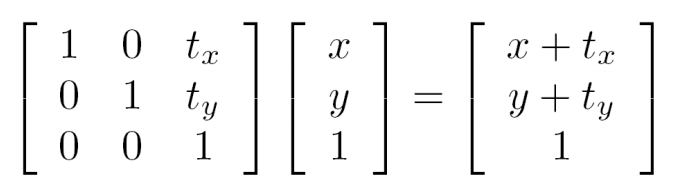
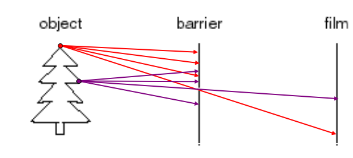
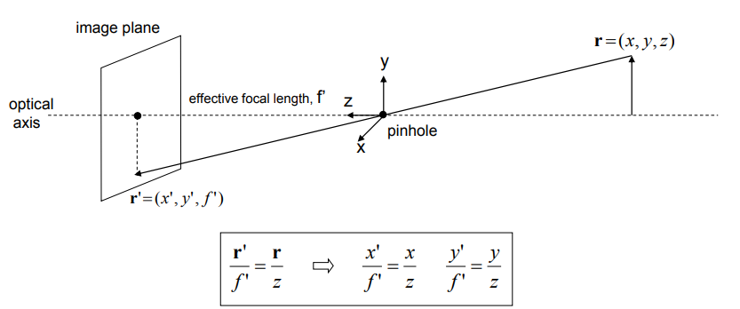
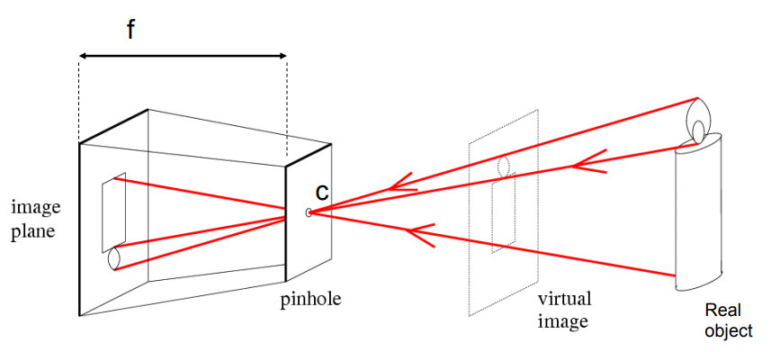
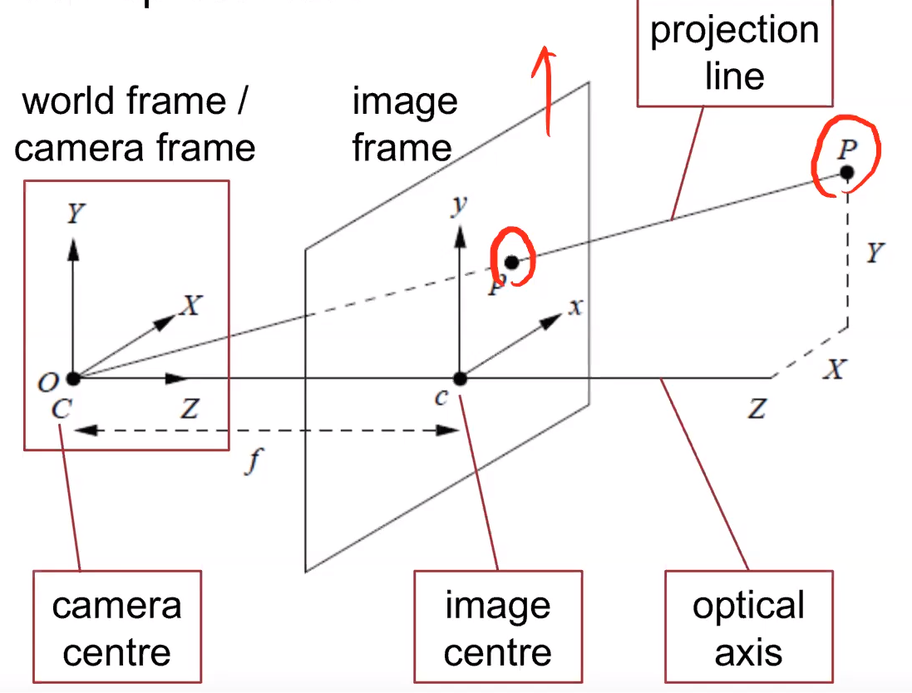
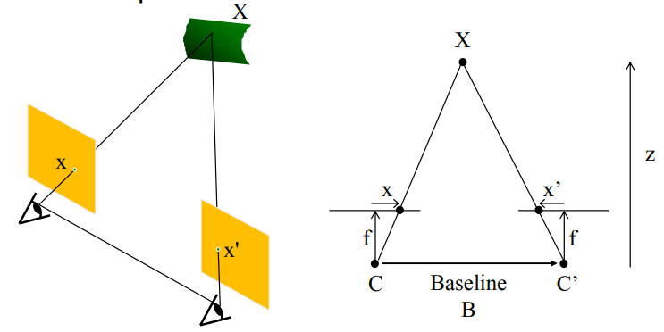
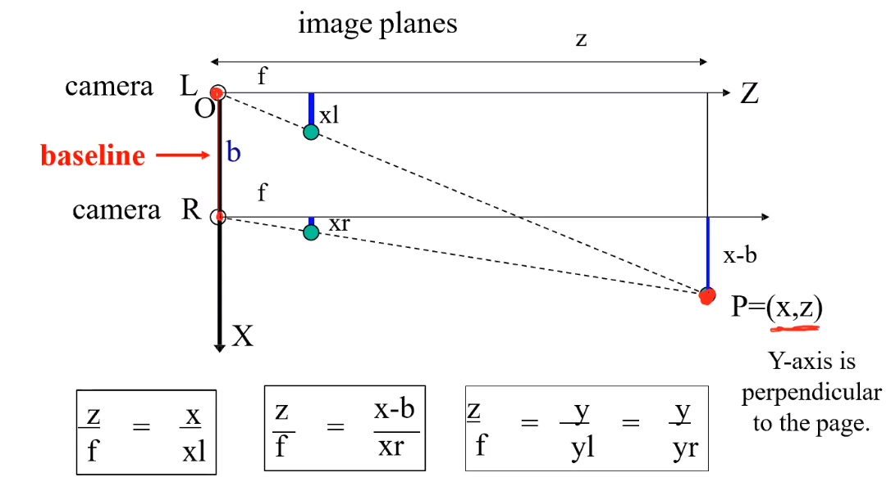
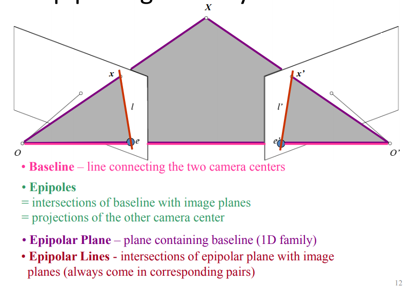

# CS 4186 Computer Vision Review

[TOC]

## Exam Info

* Time: 18:30 - 20:30 05/May (20:45 for submission)

* Two monitoring device

* Open book, online

* Materials

  * Calculator
  * Books, notes (hard copy)

* Types of questions

  * Short answer question (2-3 sentences)
  * Calculations
  * 

* The first page with academic honesty should be submitted together with the answers, as you need to reaffirm the academic honesty policy. 

  Academic Honesty

   

  *I pledge that the answers in this examination are my own and that I will not seek or obtain an unfair advantage in producing these answers. Specifically,*

  * *I will not plagiarize (copy without citation) from any source;*
  * *I will not communicate or attempt to communicate with any other person during the examination; neither will I give or attempt to give assistance to another student taking the examination; and*
  * *I will use only approved devices (e.g., calculators) and/or approved device models.*
  * *I understand that any act of academic dishonesty can lead to disciplinary action.*

  *I pledge to follow the Rules on Academic Honesty and understand that violations may lead to severe penalties.*

  Student ID:  55199998

  Name: ZHANG Deheng

## Image Filtering

* ### Image: A grid of intensity values
* ### Linear Filter: 
* ### Cross-correlation
* ### Convolution
* ### Mean Filter / Box Filter
* ### Gaussian Filter
* ### Image Sharpening

## Edge Detection

* ### Image Derivatives
* ### Image Gradient (used in the SIFT detector)
* ### Sobel (smooth before derivative)
* ### Laplacian of Gaussian (LoG) => Zero crossing

## Image Sampling

* ### Gaussian Pyramid (sequence of blur and subsample)
* ### Image Upsampling
  
  * nearest neibor

## Color and Texture

* ### Histogram (no calculation in the exam)
* ### Edge-based Texture Measures
  
  * gradient magnitude
  * magnitude & direction histogram
* ### Local Binary Pattern Measure
  
  * 8-bit number
* ### Co-occurrence Matrix Features
  
  * spatial relationship d
  * co-occurrence matrix

## Corners and Blobs

* ### Harris corner detection
  
  * Harris matrix
  * eigenvalues analysis
  * property (invariance?)
    * Translation
    * rotation
    * affine intensity scaling => try in Gaussian Pyramid
* ### Blob detection
  
  * Application of LoG (maximum and minimum)

## Scale Invariance Feature Transform (Important)

* ### **Building scale-space**
  
  * Pick the peak
* ### Interest point detection
* ### **Orientation Assignment**
  
  * dominate direction (rotation invariant)
* ### **SIFT feature descriptor**
* ### SIFT distance calculator
  
  * L2 distance
  * Ratio distance

## Bag of Words

* ### The BoW representation
* ### TF-IDF weighting
  
  * TF-IDF
* ### Inverted File
  
  * Sparse histogram
  * Mapping from words to the document

## Transformation and Alignment

### Image Warping

* Image filtering changes the range of the image, while image warping changes the domain of the image. 

* Forward Warping: compute the location first and then assign the pixel value
  $$
  (x',y') = T(x,y) \\
  g(x',y') := f(x,y)
  $$

  * What  if pixel lands between two pixels? =>  add contribution to several pixels, normalize later
  * may have holes

* Inverse Warping (no holes): for each pixel in the target image, find the pixel value in the original image. 
  $$
  (x,y) = T^{-1}(x',y') \\
  g(x',y') := f(x,y)
  $$

  * require taking the inverse of the transform
  * what if original pixel is between two pixels? => resample color value from interpolated (pre-filtered) source image
  * No holes

* Parametric (global) Warping: a global transform (same for each pixel) matrix
  $$
  p' = T(p)\\
  e.g.\ linear\ transform:p'=Tp
  $$

### All 2D Linear Transformations: 

* including **scale, rotation, shear and mirror**
* Can be represented by a $2 \times 2$ matrix

### Homogeneous Coordinates

* Represented by $3\times3$ matrix

* Add one more coordinate to compute the translation, each points in the homogeneous coordinates can be projected to the homogeneous plane ($z=1$) to get the 2D coordinate.
  $$
  (x,y) => (x,y,1)\\
  (x,y,w) => (x/w, y/w, 1)
  $$

* Translation

  

### Affine Transformations

* $T^{(3)}=[0,0,1]$ (the last dimension is always 1 after transformation)
* Including linear transformations and translations

### Homography: 

* $T^{(3)}=[g,h,1]$ (we can always divide the other eight parameters by $T^{(3)}_3$
* Use the 3D matrix two rotate the homography plane

### Image Alignment

* Simple case: translation match 2 equations per match, 2 unknowns => one match needed
  $$
  (x_t, y_t) = (\ {1 \over n}\sum^n_{i=1}(x'_i-x_i),{1 \over n}\sum^n_{i=1}(y'_i-y_i)\ )
  $$

* Affine match: 2 equations per match, 6 unknowns => 3 matches needed

* Homography match: 2 equations per match, 8 unknowns => 4 matches needed

### RANSAC (no calculation)

* Problem of least square: outliers will affect the accuracy

  

* Method: RANdom SAmple Consensus (RANSAC)
  
  * Randomly choose s examples
  * fit a model (given a hypothesized line)
  * count the number of inliers => distance with a threshold $\epsilon$ 
  * repeat n times
  * choose the model with the most number of inliers
  * After finding the vector with the most number of inliers, can also take the average of inliers

## Camera

### Pinhole camera

* Add a barrier to block off most of the ray

  

  * reduce blurring
  * opening: **aperture**

* Perspective Projection

  

* Pinhole Camera Model

  

  

  * $f$: focal length

  * $c$: Optical center of the camera

  * Task: given a point of real object, find the corresponding point in the virtual image. 
    $$
    (x',y') <= (x,y,z) \\
    {x \over z} = {x' \over f}, {y \over z} = {y' \over f}  \\
    P' = (x',y') = (f{x \over z}, f{y \over z})
    $$

### Camera parameters

* world vs. camera coordinate

  * Project a point in world coordinate into the camera coordinate (3D => 3D)
  * calculate the point on the virtual image plane (3D => 2D)

* intrinsic (fixed for each cameras)
  $$
  P = (x,y,z)_{camera\ coordinate} \\
  P' = (x',y') = (fk{x \over z} + c_x, fl{y \over z}+c_y) \\
  =(\alpha {x \over z} + c_x, \beta{y \over z}+c_y) \\
  P' = 
  \begin{bmatrix}
  \alpha & 0 & c_x & 0\\
  0 & \beta & c_y & 0\\
  0 & 0 & 1 & 0
  \end{bmatrix}
  \begin{bmatrix}
  x \\ y \\ z \\ 1\\
  \end{bmatrix} = MP \\
  P' = MP 
  =\begin{bmatrix}
  \alpha & 0 & c_x \\
  0 & \beta & c_y \\
  0 & 0 & 1 
  \end{bmatrix}
  \begin{bmatrix}
  I & 0\\
  \end{bmatrix}P 
  = K\begin{bmatrix}
  I & 0\\
  \end{bmatrix}P
  $$

  * translation: denote the location of the principle point $c$ as $(c_x, c_y)$ 
  * Scale: digital image (pixel)  and real world (centimeter) ratio ($pixel \over cm$) in two dimensions $k,l$. For square pixels $k=l$ 
  * $K$: Camera Matrix (or calibration matrix) => why use $3 \times 4$ matrix? (to match the shape of extrinsic parameters, the extrinsic matrix includes 3D translation, therefore we need to add a homogeneous plane)

* extrinsic (change the position of camera=> change)
  $$
  P = \begin{bmatrix}
  R & T\\
  0 & 1\\
  \end{bmatrix} P_w \\
  $$
  
  * Camera position & orientation => rotation + translation matrix ($4\times4$)

### Modeling projection

$$
P' = MP 

= K\begin{bmatrix}
I & 0\\
\end{bmatrix}P = K\begin{bmatrix}
I & 0\\
\end{bmatrix} \begin{bmatrix}
R & T\\
0 & 1\\
\end{bmatrix} P_w \\
= K\begin{bmatrix}
R & T\\
\end{bmatrix}P_w
$$

* Use homogeneous coordinates for camera and world coordinates $(x,y,z) => (x,y,z,1)$
* Estimation of intrinsic and extrinsic parameters: camera calibration

## Stereo Vision and Structure from Motion

### Depth and Disparity

$$
x_l = {xf \over z}, x_r = {(x-b)f \over z} \\
x_l - x_r = {bf \over z} \\
z = {bf \over x_l - x_r}
$$

* Depth ($z$): distance to the camera
* Disparity ($x_l - x_r$): horizontal shift of two cameras (the pixel shift in two image planes)
* Depth is inversely proportional to the disparity
* Goal: recover the depth using the disparity (also should know the baseline and focal length)
  * Calibration: Recover the relation (baseline) of the cameras (translation)
  * Correspondence: search for the matching point $x_r$ for $x_l$ 

### Epipolar Geometry 

* Reduce searching scale to the **Epipolar lines** for correspondence problem

### Stereo Matching

* Calculate the disparity
  * Rectify the two stereo images to transform epipolar lines into scanlines
  * For each pixel $x_l$ in the left image
    * find corresponding epipolar scanline
    * search and pick the best match $x_r$ (compare the patch in the neiborhood)
    * compute the disparity $x_l - x_r$ and the depth
* horizontal
* matching cost

### Structure from motion: problem definition

## Optical Flow

### Assumptions in Lucas-Kanade method

### Lucas-Kanade Algorithm (brightness Constancy Equation)

