# CS4286: Internet Security & E-commerce Protocols

[TOC]

## Lecture 01: Admin & Introductory Security Concepts

### Intro

* Assessment: 
  * 30 course work = 20 (assignments * 3) + 10 (midterm)
  * 70 final

### Basic Concepts & Terminology

* What is Security: The security of a system, application, or protocol is always relative to (designed based on): 

  * A set of **desired properties**: what do we want to achieve (whether the property is valuable)?
  * An **adversary**(attackers) with specific capabilities: what can they do?
  * What security (service) do we need?
  * How powerful an attacker do we want to defend against?

* Why important

  * Is good security always secure?
  * We need to think: Appropriate? Strength? Cost?
  * Unconditionally VS. Computationally
    * **Unconditionally(theoretically)**: Infinite resource cannot break
    * **Computationally**: Available resource cannot break (RSA)
    * **Financially**: Not profitable to break

* How to know security or not
  * single module
  * system
  * Majority of problems in real life secure systems is not directly due to weak crypto –
    but rather crypto used in wrong way (without considering context) or non-crypto
    issues (mostly human) that weaken security.

* Information Security: 

  * Security is about the protection of assets.
  * Thus, **information security** is the basis for protecting our **information assets**

* Three broad classes of **protection measures**: 

  * **Prevention**:  prevent your assets from being damaged
  * **Detection**: detect when you assets have been damaged, by whom and how
  * **Reaction/Recovery**: recover your assets. or recover from the damage to your assets
  * Difference between prevention and detection: For example, we prevent the attacker from getting plaintext if we encrypt well but we cannot prevent modification during transmission (we can however detect it).

* Basic **Security Goals**: How can our information assets be compromised(危及)? => three **aspects** of information protection (CIA):

  * **Confidentiality(机密的)**: prevention of unauthorized **disclosure** of information. 
  * **Integrity(正确的)**: prevention of unauthorized **modification** of information.
  * **Availability(可靠性)**: prevention of unauthorized **withholding** of information or resources. (refute to give)
  * CIA are most basic security goals => but there are more than three services

* Threats

  * Relationships

    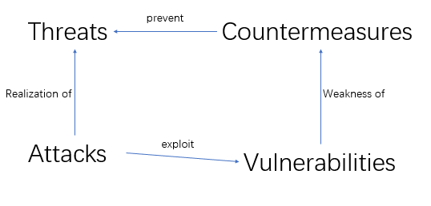

    * Security is only desirable when there is a need to protect a system from a threat.
    * A security threat is a **possible means by which a security policy may be breached** (e.g. loss of
      integrity or confidentiality).
    * Countermeasures are **controls to protect against threats**.
    * Vulnerabilities are **weaknesses** in the system (and/or **countermeasures**).
    * An attack is a **realization** of a **threat** (**exploiting** a **vulnerability**).

  * threats can be classified as:

    * deliberate (e.g. hacker penetration);
    * accidental (e.g. a sensitive file being sent to the wrong address).

  * The associated threats which **CIA** are responsible for countering are:

    * **Exposure of data**: the threat that someone who is unauthorized can access the data.
    * **Tampering with data**: the threat that the data could be altered from what it should be.
    * **Denial of service**: the threat that the data or service is unavailable when it is required.
    * For the three threats which is accidental and which deliberate? All three can be both.

* Adversaries(not always third party or outsiders): 

  * People whose aim it is to circumvent your security are generally called adversaries.
    * Sometimes called intruders, but not all adversaries are external to the system (insider threats).
  * Adversaries act in two different ways:
    * **Passive adversaries** only attempt to get unauthorised access to information
    * **Active adversaries** take more direct action:
      * Unauthorized alteration
      * Unauthorized deletion
      * Unauthorised transmission
      * Falsification of origin of information
      * unauthorized prevention of access to information 
    * you should not memorize what active adversaries can do, rather just think anyone that is not passive is active (not just access is active)
    * Think: 
      * Someone reads your email – Active
      * Someone sends email to your friend pretending to be you – Passive

* Service & Mechanism

  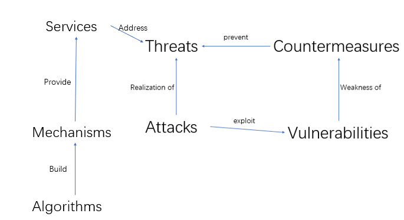

  * **Security Service**(High level security goal): A measure which can be put in place to address a threat(e.g. provision of confidentiality)
  * **Security Mechanism**(actual ways): A means to provide a service

* Services

  * Data Confidentiality and Integrity
    * Confidentiality: Protection against unauthorized disclosure of information. => focus on prevent in the three protection measures
      * What is information? Is it only data?
        - Is traffic flow confidentiality important? Lets say you encrypt the data but people can see when we sent it? - Decide what do you wish to protect and keep confidential.
        - Even if we make the ‘data’ confidential - we make the application layer payload confidential - that means the packet on the wire still has transport layer data (ports, sequences), network layer (destination address) and data link layer information.
        - Example, are encrypting routers in SWIFT networks (for secure financial messaging) – complete traffic confidentiality (cannot see destination) decrypt – look at network routing information, encrypt, send on.
    * Integrity: Integrity is protection against unauthorized modification of data => focus on detect, recover in the three protection measures, cannot prevent
      * includes corruption, deletion, addition and other modifications
  * Authentication
    * Entity authentication: Whether a specific person (message from which person)
      * Provides checking of a claimed identity at a point in time
      * Typically used at start of a connection.
      * Addresses masquerade(假扮) and replay threats
      * Come in person
    * Origin authentication: who did that (does not need provide entity authentication)
      * Provides verification of source of data
      * Does not protect against replay or delay
      * Signature of check, does not check the writer of the signature
  * Access Control: 
    * Provides protection against unauthorized use of resource, including:
      * use of a **communications** resource
      * **reading, writing or deletion** of an information resource,
      * **execution** of a processing resource.
    * Subject action resource -- Is this person allowed to perform this action on this
      resource.
  * Non-repudiation: no denial
    * **non-repudiation of origin**: cannot say not send
      * Most people talk about origin – and this is more common than you think. 
    * **non-repudiation of delivery**: cannot say not receive

* Service (Threats)

  * Confidentiality (data disclosure)
  * Integrity (data alteration)
  * Availability (DoS - deny of service)
  * Entity Authentication (masquerade)
  * Origin Authentication (forgery 伪造)
  * Non-repudiation (repudiation – it did not happen!)
  * Access Control (illegitimate access)

* Mechanisms: 

  * A security mechanism is a means to provide a
    service.
  * Can be divided into two classes:
    * Specific security mechanisms, used to provide **specific security services**, e.g. digital signature
      * An example of a specific mechanism is a digital signature scheme. It can be used to provide several different services – it can obviously be used to give a data integrity service, but it can also be used to provide an origin or entity authentication service even when data integrity is not required. Similarly there are other ways to provide a data integrity service which don’t require digital signatures (e.g. MACs or routing controls).
    * Pervasive security mechanisms, **not** specific to **particular** services, e.g. event detection, labelling.
      * An example of a pervasive mechanism is an event detection mechanism. It doesn’t actively provide any security service. (You can’t say that this data is transmitted confidentially because of the event detection mechanism.) However, it supports every security service by providing a way to detect compromises which may render specific security mechanism ineffective.

* Service (Mechanisms)

  * Confidentiality ( encryption)
  * Integrity (MAC/digital signature)
  * Availability (redundancy)
  * Entity Authentication (authentication protocol)
  * Origin Authentication(MAC/digital signature)
  * Non-repudiation (digital signature)
  * Access Control (Access control model)

* Mechanisms (Algorithm)

  * Algorithms are used to build mechanisms
  * Example of mechanisms/algorithms:
    * Encryption: DES/3DES/AES (modes) or RSA/ECC
      * CAST(Canada), MISTY1/Camellia (Japan), SEED (Korea)
    * MAC: CBC mode, HMAC
    * Digital Signature: RSA, DSA, ECC
    * Hash: SHA-3
    * Random number: True or Pseudorandom

### Standards

* Why standards? - They ensure any business offering products, services or processes is
  * cost-effective and time efficient: You do not have to develop the solution yourself – take time, take experts and this comes up with an ad-hoc solution that is likely to be as good.
  * commercially viable (可行的): customer feels more confident in your solution. The products appears more credible to the customer because our company is using best practice. Could open up a new market
  * credible (可信的):  ties into above.
  * safe: Because you are taking best practice into account, and using a solution developed by experts the chances are our solution is safer?
  * Interoperability (互操作性): Could tie into commercial viability – standards allow different
    entities to produce components that work together (without these entities having a
    relationship).
* How to use standards? 
  * Three common ways to use a standard
    * Use as the basis for new design (use the parts you need) - starting point of a new solution => risky but some standards are meant to be starting points
    * Certification is when a neutral third-party attests(证明) to a claim of compliance (合规) => Good but costs money and takes time
    * Compliance may be declared without recourse to third party certification
  * Most security standards do not require certification
    * Most of the security standards fall into one of two broad categories: they are either
      * standards which define **definite algorithms** (in which compliance can be easily checked and certification is somewhat of an expensive luxury) 
      * or they provide guidance on how to **produce a system or service** (in which case they are advice and certification is not really intended).
* Why not standards(disadvantages)
  * Consensus decisions imply **compromise**.
  * Documents can be **inconsistently implemented**.
  * Commercial pressure can lead to **partial implementation**.
  * Aggressive market strategies by companies who adapt or extend standards can undermine their usefulness.
* Categories of standards
  * International standards: The main function of these bodies is the production of ‘base standards’.
  * North American standards:  have become particularly important in security
  * Internet standards:  loose collaboration between government, industry and academia
    * Internet Standards are quite odd things. Why is it hard to produce reliable Internet
      standards?
      * Strangely - products tend to be interoperable – large companies works together, almost like a standards body – your product needs to work with theirs. Defacto standard –> interoperability.
      * Big problem – once a standard is being used it is used by everyone. Once again if there is a standard and something goes wrong with it is difficult to correct.
  * Company Standards:  also sometimes issue defacto standards for techniques that have been patented. 
    * Any reasons these would not be seen as standards? - As per previous definition:
      * Standard body?
      * Consensus?
      * Are the completely unbiased? 
* Standards bodies
  * **official** standards bodies: defining standards at worldwide or national level
  * **companies** who make standards: often with commercial interest – some good some bad, and some you have to use like payment card standards
  * Internet standards: which no on really looks after, simply technology that grows in usage, and once everyone uses it might be organized and published as a standard by IETS

--------------------

## Lecture02: Symmetric Key Encryption

### Introduction

* Encryption provides confidentiality

* Symmetric key encryption Model: 

  * Sender and recipient uses the same key

  * A **symmetric-key cipher or cryptosystem** is used for **encrypting/decrypting** a **plaintext/ciphertext**

    * Plaintext: Message need to be encrypted
    * Ciphertext: Message after encryption
    * Encrypt function: $C=E_k (P)$ Decrypt function: $P = D_k (C) = E_k^{-1}(C)$ 

  * Attackers’ target is either get the **key or the plaintext** from the observed plaintext

    

    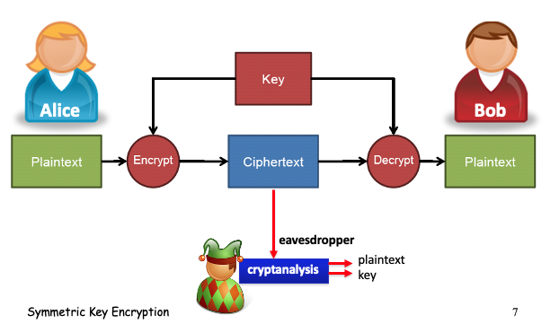

* Symmetric key crypto can also be applied for other purpose, we focus on the encryption mechanisms this chapter

* Crytanalysis 

  * Assumption (Kerckhoffs Principle)
    * Public Known: System, Crypto algorithm
    * Secret: Only key
  * Objective of an attacker
    * Identify secret key used to encrypt a ciphertext
    * (Or) recover the plaintext without the secret key
    * In modern cryptography we are mostly concerned with the key being found – more so than the message – many times an attacker can guess the basic messages (e.g. repetitive network commands)
  * Three types
    * Ciphertext only attack
    * Known plaintext attack (know the pair)
    * Chosen plaintext attack (can choose the pair)
    * Chosen ciphertext attack

### Classical Cryptography - Substitution Cipher

* Caesar Cipher: 
  * Key: $n$ 
  * Encryption: Each letter in plaintext is replaced by the letter shifted by $n​$ places in the alphabet  
  * Decryption: Each letter in ciphertext is replaced by the letter shifted by $-n$ places in the alphabet
  * $25​$ possible cipher alphabets, easy to try
* Other ways to generate key: 
  * Take your favorite sentence, delete the repeat characters, and add the not used characters at the end of the key
  * Key: sentence in this case
  * Key space: Less predictable
* Simple Substitution: 
  * Key: Random permutation of the alphabetic
  * Key space: $26!​$
  * Time for brute force attack: More than 4000 years
  * Frequency Analysis: 
    * One to one match between plaintext and ciphertext preserves the statistics
    * Also notice pairs of letters, one letter word, two letter word frequency, n-grams
    * Also can guess the word or phrase will be in the message
    * Check whether it would be a Caesar cipher
  * Frequency analysis can be beaten, however there are some way to beat these methods
* Polyalphabeic substituion: change the state of substituion table for each characters
  * Same character might be encrypted to different ciphertext
  * Different character might be encrypted to same ciphertext
* Vigenere Cipher
  * Use a keyword, and use the each character as the first one of a Caesar cipher. For each character, use next Caesar cipher. 
  * Weakness: 
    - If we know the length of the codeword, we can break each of the individual Caesar cipher 	independently
    - Repeated words has the chance to be encrypted to the same ciphertext => can be used to determine the length of the key
* Enigma Machine
  * Need same initial state as the sender to break the cipher
  * Configured rotors, and plug board on front. Pressing keys would light a lamp showing the corresponding plaintext (or ciphertext when decrypting).
  * Key space: $2^{67}$ approx
  * Weekness: 
    * Plaintext cannot be encrypt to itself
    * Use known plaintext to eliminate states
    * State then calculated through search

### One-time Pad Encryption

* Limitation of substituion cypher: Can only encrypt character based language

* One-time pad encryption: Use ASCII to represent the text

  * Pad(key) must be random, **used only once**
  * Pad(key) has the same size as message

  $$
  E(plaintext, key) = plaintext \oplus key = ciphertext \\
  D(ciphertext, key) = ciphertext \oplus key = plaintext \\
  $$

* Security

  * Advantage
    * **Theoretically** secure since If given the ciphertext there is no way we can know for sure the message. Any ciphertext can decrypt to any possible plaintext
  * Weakness: (Key management is not practical)
    * Each time we send a message, need a new pad, otherwise if $C_1 = P_1 \oplus K,C_2 = P_2 \oplus K$, $C_1 \oplus C_2 = P_1 \oplus P_2$, we can do some further analysis on this result ([example](<https://crypto.stackexchange.com/questions/59/taking-advantage-of-one-time-pad-key-reuse>))
    * We need same length of the key as the plaintext
    * Still result in same ciphertext with same plaintext

### Stream Ciphers

* Current crypto systems: 

  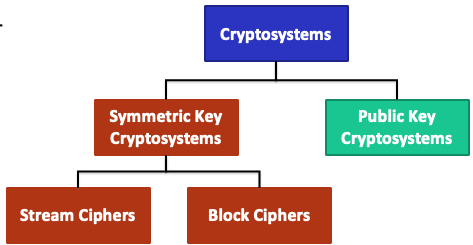

* Structure of stream cipher: 

  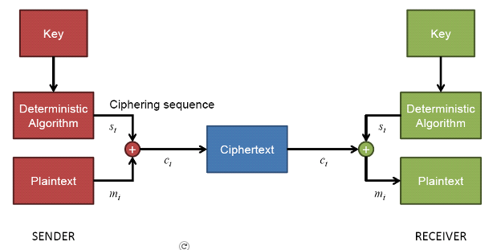

  * Deterministic algorithm a.k.a (also known as) **Keystream generator**
  * Cipher Sequence a.k.a. **Keystream**
  * $Key$ => $Keysteam$ => $Keystream \oplus plaintext$ 
  * Property of keystream generator
    * The function has no randomness in future states - reproducable and predictable, but this only holds for someone has the key => **if you know the key the algorithm is deterministic** 
    * Keystream generator is the same for encryption and decryption as well as the encryption/decryption function $E_k = D_k​$ 
    * Later there will be some scheme with different encrypt and decryption function$E_k = D_k^{-1}​$ 
  * Important issue: Sender and receiver synchronization

* Stream Ciphers:

  * Secret key length: 128 bits, 256 bits
  * Maximum plaintext length: usually can be arbitrarily long
  * Security & Advantage： 
    * Given a “long” segment of  key stream (e.g. $2^{40}\ bits$), the secret key cannot be derived AND the subsequent segment of the keystream (next keystream) cannot be deduced
    * Do not require the size of the plaintext
    * Computation is fast
  * Disadvantage: 
    * If we now the plaintext, we can XOR the plaintext with the ciphertext, then we have the keystream. Then we XOR it own message. 
    * As we use XOR for encryption, we should also provide integrity by using other techniques
      * Consider if we send a value 0010 encrypted with keystream 1010 (C= 0010 XOR 1010 = 1000) Without knowing the plaintext (maybe just the format) an attacker can modify the message by flipping a bit C’=0000, then means P = 0000 XOR 1010 = 1010 and the value is bigger.
      * Alternative if the attacker knows the plaintext he can go KS= C XOR P and then create C’ = KS XOR M (his message). The reciever will then decrypt to M
      * If we are to use stream ciphers in practice we need additional security services – especially with regards to integrity/data origin authentication.

* RC4 (optional): 

  * An good (famous) example of stream cipher

  * But usually we use block cipher to generate key stream (`CFB`, `OFB`) 

    * Notice that in reality, these two modes are blocker cipher. 

  * Steps(no need to know the details): 

    ```pseudocode
    // Setup:
    	byte key[N];    // secret key (e.g. N = 16, i.e. 128-bit key)
    	byte K[256];   // keying material
    	byte S[256];   // internal states
    	
    // Initialization:
    		for i = 0 to 255
    			S[i] = i
    			K[i] = key[i (mod N)]
    		j = 0
    		for i = 0 to 255
    			j = (j + S[i] + K[i]) mod 256
    			swap(S[i], S[j])
    		i = j = 0
    		// S[] is the permutation of 0,1,...,255
    // Select
    	for i = 0 to 255
    		i = (i + 1) mod 256
    		j = (j + S[i]) mod 256
    		swap(S[i], S[j])
    		t = (S[i] + S[j]) mod 256
    		KeyStreamByteSelected = S[t]
    
    ```

    * Set up: `byte key[N], K[256], S[256]` (key array, says 128 bits key with N=16, key material(`K[i]=key[i(mod N)]`), and internal states)
    * Initialization: Initialize the `S` such that the internal state dependent to the `key` 
    * Swap table element of $S$ and select a byte

  * **Note:** Some research results show that the first 256 bytes must be discarded, otherwise attacker may be able to recover the key.

  * This illustrate the benefit of stream cipher: if we need a byte of keystream then we just iterate once more… We can make as much keystream as we have plaintext….need to encrypt another byte, make another byte of keystream.

### Block Ciphers

* **The main difference between block cipher and stream cipher**

  * **Usage of key**:
    * Stream cipher uses a function to generate key stream with flexible length and XOR with plaintext
    * Block cipher takes a plaintext input of fixed size, and generate ciphertext with fixed size. 
  * **Crypton function**: 
    * Stream cipher: Do not need to be reversible. Simply generate random key stream from key. 
    * Block cipher: Need to be reversible. Actually perform on the plaintext (permutation/substitution etc.) 
  * **Plaintext length**:  
    * Stream cipher: Not fixed
    * Block cipher: fixed
  * **Computation**
    * Stream cipher: Says to be faster
    * Block cipher: slower
  * **Security**
    * Stream cipher: Lower
    * Block cipher: Higher

* **Properties of good block cipher algorithms**

  * Confusion
    * A small change in the **key** should be able to change 50% of the ciphertext
    * An attacker using a bruteforce attack shouldn’t receive any signs that he is **getting closer** to the correct key
  * Diffusion
    * A small change in the **plaintext** should cause 50% of the ciphertext to change
    * Hide any statistical relation between the plaintext and the ciphertext
  * Completion
    * Each bit of the ciphertext depends on each bit of the key (flip a bit if it always change the same 50% of bits)
    * The attacker won’t be able to find **valid parts of the key using divide and conquer methods**

* Block cipher

  * Structure: Takes a *block* of **plaintext** and a **secret key** produce a *block* of **ciphertext** (block means fixed size). A series of blocks share the same key

    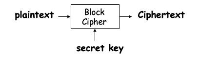

  * Typical block size: `64 bits`, `128= 64*2 bits`, `19 = 64*3 bits`, `256 = 64*4 bits`

  * Key sizes: `56 bits`(DES), `128/192/256 bits`(AES)

    * **Notice that key size is different with block size**

  * Popular block ciphers: **DES(b: 64, k: 56), 3DES(b: 64, k: 56*2), AES(b: 128 k: 128/192/256)**, Twofish, Serpent

* DES (Data Encryption Standard): Should know the basic operation, block size, key size, and basic architecture

  * Structure

    * **Block size: 64-bits**

    * **Key size: 56-bits**

    * Basic operation and architecture: 

      * Intial Permutation

      * iterating **round function** 16 times, the round function needs **a round key** $K_i$ (**for DES the function is also called Feistel Transformation**)
        $$
        round\ function: rf(K_i, rf_{i-1}) = R(rf_{i-1})\ |\ (L(rf_{i-1}) \oplus f(R(rf_{i-1}), key))
        $$

      * Final Permutation

    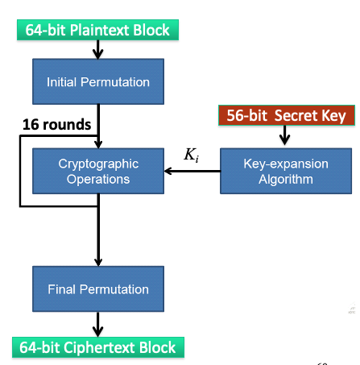

  * Feistel Structure (optional): We only deal with half (left half in the example) the data during one round
    $$
    L_i = R_{i-1}, R_i = L_{i-1} \oplus f(L_i, key) \\
    $$
    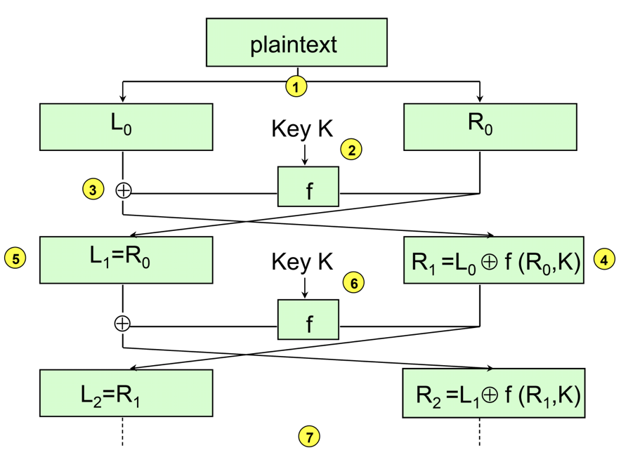

    * The function $f​$ can be one way instead of reversible, because we can compute $f​$ when decryption => Just reverse the order to use round key
      $$
      R_{i-1} = L_i, L_{i-1} = R_i \oplus f(R_{i-1}, key_i) = R_i \oplus f(L_i, key_i)
      $$

      * **Should know**: In DES, the round function $f​$ is an expansion, substitution, and permutation

        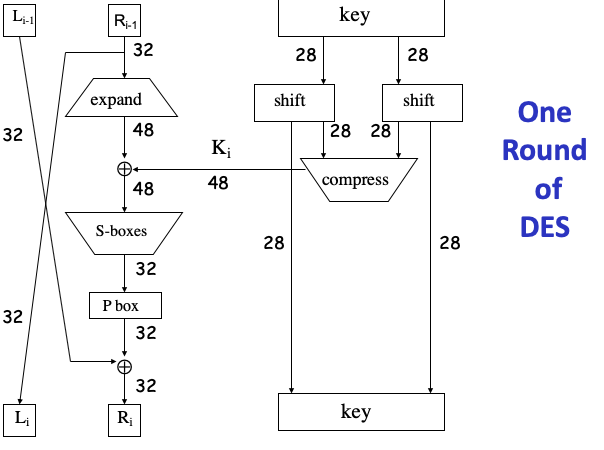

        * Subsitution: Mapping each 6-bits to 4-bits
        * P box: one fixed way to shuffle each bit 
        * Key is compressed from `64bits` to `48-bits`, while half of the message is expanded from `32-bits` to `48-bits` 

    * How many rounds should a Feistel cipher have: Generally you need more rounds, because you are only working on half the block at a time. Key expansion – need out one 56 bit key for 16 rounds

  * Security: 

    * Depends solely on the internals of $f$ 
    * More than thirty years of intense analysis has revealed no “back door”
    * The most effective attack today against DES is still the exhaustive key search (a.k.a. bruteforce attack)

* Bruteforce attack | Exhaustive key search

  * An algorithm is secure when the easiest way of attacking it is by bruteforce attack.
    * n-bits key => $2^n$ space
    * An average of half the combinations should be tried in order to make the probability to find the key larger than $50\%$ is $2^{n-1}$ 
    * `128-bits` key is recommended until 2030 
  * Known-Plaintext attack: Given plaintext $x$ and corresponding ciphertext $y$, find the key $k$ such that $E(k,x) = y$ (Notice that there might be more than one such key $k$) 
  * Known-plaintext attack by bruteforce attack is now viable against DES

* 3DES (Triple DES) and DESX

  * We try to enlarge the size of the key to prevent the exhaustive search. However, it is difficult to change the size of key directly and reuse the algorithm (some mathmetical issues), and it is expensive to create a new algorithm

  * Triple DES

    * The reason of decrypt in the middle: if we set $K_1 = K_2$, 3DES can also be changed to the elder version. 
    * By some advance attack, the space is reduced from 112 bits theoratically to 80 bits

    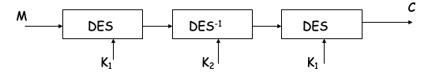

  * DESX

    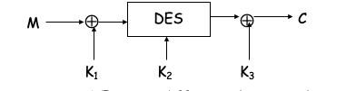

    * By some advance attack, the space is reduced from 184 bits theoratically to 112 bits
    * Notice that the size of $K_1, K_3$ is 64 bits (same as the block), while size of $K_2$ is 56 bits

* AES (Advanced Encryption Standard) Should know the basic operation, block size, key size, and basic architecture

  * Iterated block cipher **not using Feistel round function**, also faster than DES

  * Block size: 128 bits, Key size: 128/192/256 bits, Round(depends on key size): 10/12/14 

  * Steps: Initial trnasformation => four operations(SPN) \* Rounds number=>  Ciphertext

    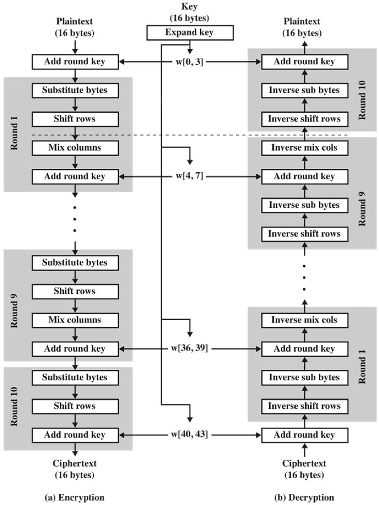

    * The intial transformation also use the add round key operation
    * Final round only 3 operation (no mix columns)

  * [Substitution-Permutation Network (SPN)](<https://simple.wikipedia.org/wiki/Substitution-permutation_network>) : S-box + P-box (actually the first three operations)

  * Each round has 4 operations: Each one is reversible (details are optional)

    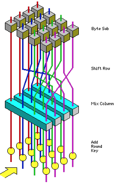

    * **ByteSub**: Use an S-box to perform a byte-by-byte substitution of the data block

      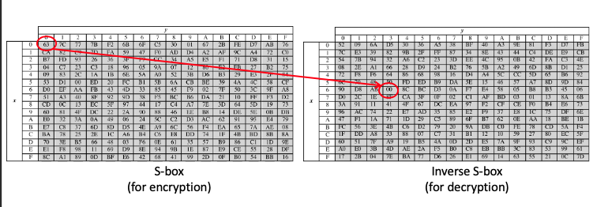

      * Each individual byte in a data block is mapped into a new byte using a 16x16 matrix of byte values
      * The leftmost 4 bits of a data block byte are used as a row value
      * The rightmost 4 bits of a data block byte are used as a column value

    * **ShiftRow**: a permutation

      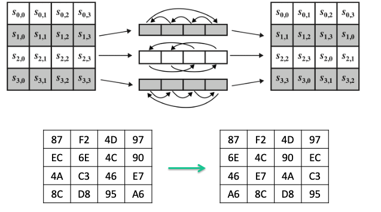

      * The first row of the data block is not altered
      * The second row: 1-byte circular left shift
      * The third row: 2-byte circular left shift
      * The fourth row: 3-byte circular left shift

    * **MixColumn**: a substituion that makes use of arithmetic over GF($2^8$)

      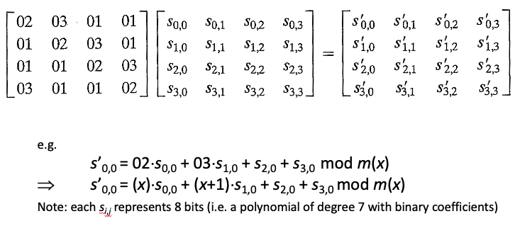

      * Operate on each column individually

      * Each byte of a column is mapped into a new value that is a function of all the four bytes in that column

      * **Notice that the addition and multiplication in the matrix is redefined**

      * Matrix multiplication over $GF(2^8)$ with irreducible polynomial $m(x) = x^8+x^4+x^3+x^1$

      * GF(Galois Field or Finite Field):

        * A field is a set in which we can do addition, subtraction, multiplication, and division without leaving the set (converged to this set)

        * for function $f(x) = a_{n-1}x^{n-1}+ a_{n-2}x^{n-2} + … + a_1x + a_0$ where $a_i$ can only be 0 or 1, the state of the function is $2^n$

        * Combine these functions into a set, we have $GF(2^n)$ which is the set of the functions with cardinality $2^n$ 

        * Addition: Can be represented as bitwise XOR, $x^2 +x^2 = 0$

        * Multiplication: 
          $$
          (x^2 + 1)*(x^2 + x + 1)\ mod\ (x^3 + x + 1)\\
          = (x^4 + x^3 + x^2) + (x^2 + x + 1)\  mod\ (x^3 + x + 1) \\
           = x^4 + x^3 + x + 1\ mod\ (x^3 + x + 1) \\
          = x^4+x^2+x+x^2+x+x^3+x+1\ mod\ (x^3+x+1) \\
          = (x+1)(x^3+x+1) + x^2+x\ mod\ (x^3+x+1) \\
           = x^2+x
          $$
          

    * **AddRoundKey**: a simple bitwise XOR of the current data block with a round key

  * Key expansion / Key scheduling (optional)

    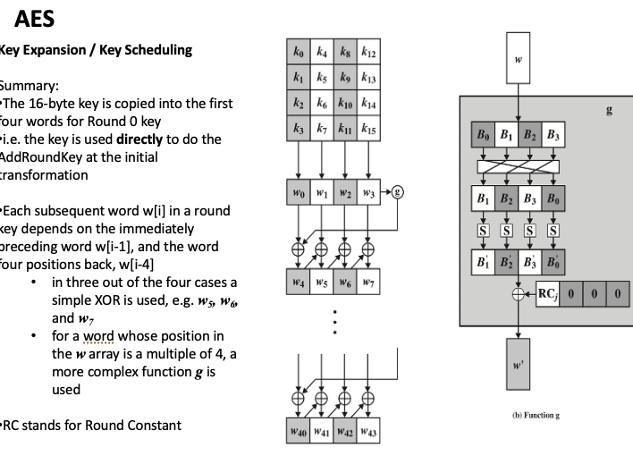

    * 128 bits => 10 rounds, 192 bits => 12 rounds, 256 bits => 14 rounds (The initial transformation needs one more add round key)
    * Each round key is 128 bits long (same as the block size) 
    * Total size(128 key size): 11 \* 128 bits= 11 \* 16 bytes = 176 bytes

* Key spaces

  * DES: $2^{56}​$
  * AES: $2^{128}/2^{192}/2^{256}$
  * Subsitution: $26!$
  * One time pad: $2^{keysize}$ 
  * RC4: $2^{40}\ to\ 2^{2048}$ 

### Encryption Modes

* Multiple blocks: A block cipher only encrypts a fixed block – not like a steam cipher that just keeps generating keystream. So we need ways to **encrypt multiple block** if the message is larger than the block size. We also need a **padding** method if out message is not a multiple of the block size.
  * New key for each block: as bad as one time pad (or worse)
  * Encrypt each block independently use the same key: ECB
  * Make encryption depends on the previous block: CBC, CFB, OFB
  * Make encryption depends on changed state vector: CTR

* Notations: 

  * Encrypt/decrypt functions: $C=E(K, P), P = D(K,C)$
  * Given plaintext $P = P_0, P_1, …,P_m,…$ (in blocks)

* Properties of ‘good’ mode

  * Message dependence of ciphertext (CBC, CFB, OFB are better than ECB and CTR)
  * Limited error propagation (ECB, CTR, OFB with one block error are better than CBC, CFB with two blocks error)
  * Works without block synchronisation: If a block of the message goes missing, the impact on subsequent messages should be limited. 
    * ECB: Only lost one block
    * CBC and CFB: Affect two blocks, one lost one error
    * OFB, CTR: Affect all following blocks. 
  * Optimise use of decrypt/encrypt: reuse encryption function for decryption (CTR, OFB, CFB are better than ECB and CBC)
  * Reduce padding: OFB, CFB, and CTR do not need paddings

* Type of transmission errors: 

  * Transmission errors are errors that occur in the communication channel (1 => 0 or 0 => 1)
  * Transmission losses are bits that get lost (they never arrive) in the communication channel. 

* Error Propagation: A decryption process involves **error propagation** if a ciphertext input that has one incorrect bit produces a plaintext output that has more than one incorrect bit.

  * To what extent does error propagation occur in basic stream and block ciphers? 
    * In a basic stream ciphers – errors in ciphertext map directly to errors in plaintext. This is due to the XOR used. Think – one bit of C XOR one bit of corresponding KS is P, then C’ XOR the same KS is P’ (where if X=1 then X’=0, if X=0 then X’=1)
  * Does error propagation have anything to with error prevention or error correction? 
    * No, we **cannot prevent** errors as such. We **can however limit** the effect is has on the received message.
    * A little bit connected – if we minimise the errors is might be possible to correct the received message. It is nearly impossible to recover from a major amount of errors.
  * Is error propagation a good thing?
    * No, if an error occurs early in the message that means the entire message is wrong.

* ECB Mode

  * Method: Encrypt each plaintext blocks independently. 
    $$
    C_0 = E(K, P_0) \ \ \ \ P_0 = D(K, C_0) \\
    C_1 = E(K, P_1) \ \ \ \ P_1 = D(K, C_1) \\
    ... \\
    C_n = E(K, P_n) \ \ \ \ P_n = D(K, C_n) \\
    $$
    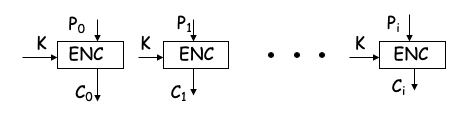

  * ECB Cut and Paste Attack (in the integrity perspective): Since all blocks are encrypted independently, we can in theory delete some of the ciphertext blocks or simply change the order of the blocks without knowing the key. For example: 

    * Suppose plaintext is `Alice digs Bob. Trudy digs Tom.`

    * Assuming 64-bit blocks and 8-bit ASCII:

      ```
      P0 = “Alice di”, P1 = “gs Bob. ”,
      P2 = “Trudy di”, P3 = “gs Tom. ”
      ```

    * Ciphertext: `C0,C1,C2,C3`

    * Trudy cuts and pastes: `C0,C3,C2,C1`

    * Decrypts as`Alice digs Tom. Trudy digs Bob.`

  * Weakness (in the confidentiality perspective): 

    * Same plaintext results in the same ciphertext => make it possible for literature analysis as well as exploit some contextual information
    * If the plaintext are either `yes` or `no`, we can find out whether the two ciphertext are the same to know the plaintext. 
    * This is now like a very very large substitution cipher! (with $2^n$ possible permutations where $n​$ is blocksize)….
    * Traffic analysis – can see the same messages being sent. What if message repeat?
    * A picture encrypted in ECB mode appears to still expose most of the data

  * Property

    * Block dependency: No (Bad)
    * Error propagation: Only one bits error in plaintext for one bits error in cipher text (good)
    * Block synchronization: One block loss of cipher text causes one block loss of plaintext (good)Does not need synchronization (do not need to count how many blocks received)
    * Optimise use of decrypt/encrypt: Not
    * Reduc padding: Not

* CBC Mode

  * Method: Chain blocks together, each output is dependent to the plaintext of this block as well as the ciphertext of previous block. The first block is dependent to the intiali vector (IV). IV is random but public. 

    * In this way, same plaintext blocks result in different ciphertext blocks. 
    * Change the IV each time, otherwise the result will be the same for the same plaintext encrypting twice. 
    * If we change $P_0$, all the following blocks will be changed. => all $C$ blocks are dependent on all previous $P$ blocks. 

    $$
    C_0 = E(K, P_0 \oplus IV) \ \ \ \ P_0 = D(K, C_0) \oplus IV \\
    C_1 = E(K, P_1 \oplus C_0) \ \ \ \ P_1 = D(K, C_1) \oplus C_0 \\
    ... \\
    C_n = E(K, P_n \oplus C_{n-1}) \ \ \ \ P_n = D(K, C_n) \oplus C_{n-1} \\
    $$

    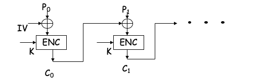

  * Property

    - Block dependency: Yes
    - Error propagation: One block error in the current block and one bit error for the next block for one bits error in cipher text (bad)
    - Block synchronization: One block loss of cipher text causes current block loss and next block error. Does not need synchronization (do not need to count how many blocks received)
    - Optimise use of decrypt/encrypt: Not
    - Reduce padding: Not

* CTR Mode

  * Method: **Use block cipher like a stream cipher**, use the block cipher to generate a key stream and `XOR` to the ciphertext
    $$
    C_0 = P_0 \oplus E(K, IV) \ \ \ \ P_0 = C_0 \oplus E(K, IV)\\
    C_1 = P_1 \oplus E(K, IV+1) \ \ \ \ P_1 = C_1 \oplus E(K, IV+1)\\
    ... \\
    C_n = P_n \oplus E(K, IV+n) \ \ \ \ P_n = C_n \oplus E(K, IV+n)\\
    $$
    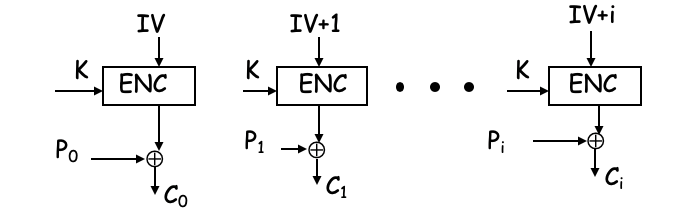

    * Compare to CBC: CTR is good for random access (both read and write), while CBC is good for random read only, but not write.
    * Good if you store encrypted data. Consider that the IV is also the index of the stored ciphertext block. To read the block’s plaintext you do$ E(IV_i, K)​$ and XOR it to stored $C​$. If you edit the block you can then simple XOR the new plaintext the  $E(IV_i, K)​$  and store it.
    * Can you do the same with CBC?
      * Reading is easy, you take cipher block $C_{i-1}$ and use it to decrypt $C_i$, now you can read the data. 
      * However, what happens now if you change the plaintext? You can encrypt $C_i$ again using $C_{i-1}$. Is that good enough? No! Now you need to **decrypt and encrypt all the remaining block** as the change in $C_i$ means all the rest of the blocks will change.

  * Property

    * Block dependency: Yes (not strong as CBC)
    * Error propagation: Only one bits
    * Need strong synchronization, need record how many blocks have encountered 
    * Optimise use of decrypt/encrypt: Yes
    * Reduce padding: Yes

* CFB Mode

  * Method: Also use block cipher like stream cipher. Use the previous ciphertext instead of countered $IV$ to encrypt to a key stream
    $$
    C_0 = P_0 \oplus E(K, IV) \ \ \ \ P_0 = C_0 \oplus E(K, IV)\\
    C_1 = P_1 \oplus E(K, C_0) \ \ \ \ P_1 = C_1 \oplus E(K, C_0)\\
    ... \\
    C_n = P_n \oplus E(K, C_{n-1}) \ \ \ \ P_n = C_n \oplus E(K, C_{n-1})\\
    $$
    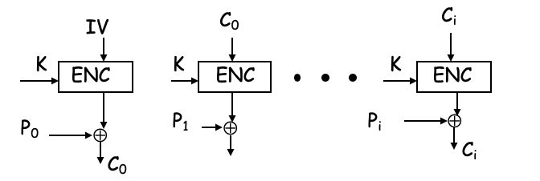

    * Compare to CBC: Change the order of encryption and `XOR` operation

  * Property

    - Block dependency: Yes 
    - Error propagation: One bit error for current block, one block error for next block
    - Loss one block result in current block loss and next block error
    - Optimise use of decrypt/encrypt: Yes
    - Reduce padding: Yes

---------------

### Supplementary Materials

* How to know a cipher is good
  * Keysize: > 128
  * Public: Security cannot come from obscurity (Kerkhoffs principle) 
  * Standard: Public old algorithm have not been broken
  * Mode of operation: Of the basic modes CBC is considered good, while ECB is not good
* 

------------------------------

## Lecture03: Basic Number Theory & CRT & Euler Function & RSA

### Basic Number Theory

* Modular Arithmetic: 

  * Addition / Subtraction: $(x+y)\ mod\ n = ((x\ mod\ n)+(y\ mod\ n))\ mod\ n$

  * Multiplication:$ 

    * proof: 
      $$
      x=k_1n+b_1, y = k_2n+b_2 (k_1, k_2, b_1, b_2\ \in \mathbb N^*)\\ 
      (xy)\ mod\ n = (k_1n+b_1)(k_2n+b_2)\ mod\ n\\
      =(k_1k_2n^2 + (k_1b_2+k_2b_1)n + b_1b_2)\ mod\ n \\
      =b_1b_2 \\
      (x\ mod\ n)(y\ mod\ n) = ((k_1n+b_1)\ mod\ n)((k_2n+b_2)\ mod\ n) \\
      =b_1b_2
      $$

    * $x^y\ mod\ n = (x\ mod\ n)^y\ mod\ n$ 

    * Example: find the last digit of $2^{100}$ in decimal: 

      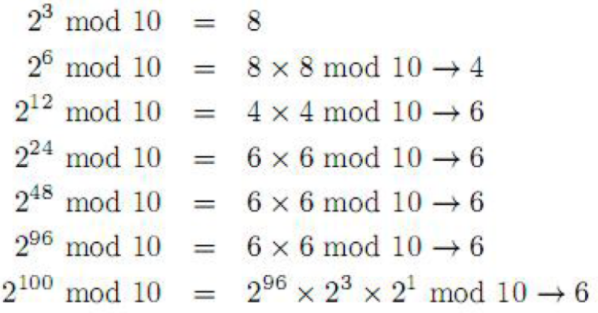

  * Note that if $ac \equiv bc (mod\ n)$ we can get $a \equiv b(mod\ n)$ only when $gcd(n,c) = 1$, or generally: 
    $$
    a \equiv b (mod\ {n \over gcd(c,n)})
    $$
    

* Greatest Common Divisor(GCD)

  * Definition: The largest divisor shared by a given pair of integers

  * Coprime: Two integers $x, y$ are coprime(relatively prime) iff $gcd(x,y)=1$

  * Euclidean’s Algorithm: If $a = qb + r$ for some integer $q$ and $r$, then:
    $$
    gcd(a,b)=gcd(r,b) = gcd(a\ mod\ b, b)
    $$

    * proof: 
      $$
      r = a\ mod\ b \\
      r = a-qb \\
      {r\over d} = {a \over d} - {qb \over d} = m \\(where\ d\ is\ a\ common\ divisor\ of\ a\ and\ b => m \in \mathbb N^*)\\
      m\ is\ a\ divisor\ of\ r
      $$

    * code: 

      ```c++
      int gcd(int a, int b) 
      { 
          // Everything divides 0  
          if (a == 0) 
             return b; 
          if (b == 0) 
             return a; 
         
          // base case 
          if (a == b) 
              return a; 
         
          // a is greater 
          if (a > b) 
              return gcd(a%b, b); 
          return gcd(a, b%a); 
      } 
      ```

  * Extended Euclidean’s Algorithm: 

    * problem: Solve the equation $ax+by=gcd(a,b)​$

      * Always keep the first parameter of $gcd$ to be the larger one
      * The equation always has a solution

    * Base case: $b=0$, that means the previous $gcd(a,b)$ satisfies $a\%b = 0$ , and $b$ becomes current $a$, then $a$ itself is $gcd$ => $gcd*1+0 = gcd$ 

    * Other cases: $b \neq 0$: according to the Euclidean’s Algorithm $gcd(a,b)=gcd(b, a\ mod\ b)$
      $$
      ax + by = gcd(a, b), a = bq +r, r = a - floor({a \over b})b\\
      gcd(b, a\ mod\ b) = gcd(b,r)=bx^\prime + ry^\prime=bx^\prime+(a - floor({a \over b})b)y^\prime \\
      = bx^\prime+ay^\prime - floor({a \over b})by^\prime \\
      = ay^\prime + b(x^\prime - floor({a \over b})y^\prime) \\
      gcd(a,b) = gcd(b,r) \\
      x = y^\prime, y= x^\prime - floor({a \over b})y^\prime
      $$

    * code:

      ```c++
      int exGcd(int a,int b,int &x,int &y)
      {
          if(b==0)
          {
              x=1;y=0;
              return a;
          }
          int r=exGcd(b,a%b,x,y);
          int t=x;x=y;y=t-a/b*y;
          return r;
      }
      ```

  * Least Common Multiple (LCM): 
    $$
    lcm(x,y) \geq max(x,y)\ for\ any\ x,y \\
    lcm(x,y) \leq xy \\
    lcm(x,y) = {xy \over gcd(x,y)}
    $$

* Modular Inverse: 

  * Definition: $b^{-1}$ is called a inverse of $b$ iff
    $$
    bb^{-1} \equiv 1 (mod\ n)
    $$

  * The inverse doesn’t always exist (e.g. $2x \equiv 1 (mod\ 4)$)

  * Inverse exists only if
    $$
    gcd(b,n)=1
    $$

    * Proof: 

      * When $gcd=1$
        $$
        bs + nt = gcd(b,n) = 1 \\
        (bs + nt)\ mod\ n=bs\ mod\ n=1\\
        s = b^{-1}
        $$
        

        * $s,t$ are integers, $gcd$ is less than or equal to minimum of $b$ and $n$, so $s$ and $t$ must have one negative number (otherwise, the value of $gcd$ will be larger than either $b$ or $n​$, which is a contradiction)

      * If $gcd$ is not 1, the minus(difference) between multiple of  $b$ and $n$ will be multiple of $gcd(b,n)​$: 

    $$
    Assume\ b = gcd(b,n)*k_1, n = gcd(b,n)*k_2 \\
    bs + nt = k_1s*gcd(b,n) + k_2t*gcd(b,n) \\
    =gcd(b,n)*(k_1s+k_2t)
    $$


### Chinese Reminder Theorem (CRT)

* Problem: Find the value of $x$ such that: 
  $$
  \begin{cases}
  x \equiv a_1\ (mod\ n_1) \\
  x \equiv a_2\ (mod\ n_2) \\
  \vdots \\
  x \equiv a_k\ (mod\ n_k) \\
  \end{cases}
  $$

*  

### Euler Function and Euler Theorem

* Definition: Euler Function $\phi$ is defined as:
  $$
  \phi(n) = |\{x \in (\mathbb N^* \cap [1,n-1]) \ |\ gcd(x,n)=1\}|\ where\ (n \in (\mathbb N^*\cap[1, +\infty))
  $$

  * The number of positive integers less than $n$ such that $n$ and the integers are coprime.  

  * Denote the set: 
    $$
    Z_n =\{x \in (\mathbb N^* \cap [1,n-1]) \ |\ gcd(x,n)=1\}\ where\ (n \in (\mathbb N^*\cap[1, +\infty)) \\
    |Z_n| = \phi(n)
    $$

* The value of Euler Function: 

  * For prime number $p$: 
    $$
    \phi(p) = p-1
    $$

  * For prime number $p$ , $q$: 
    $$
    \phi(pq) = (pq - 1) - (p - 1) - (q - 1) = pq - p - q + 1 = (p-1)(q-1)
    $$

    * proof: 
      $$
      gcd(p, q) = 1 \\
      Z_{pq} = \{1, 2,...,pq -1\} - \{p, 2p, ..., (q-1)p\} - \{q, 2q, ..., (p-1)q\} \\
      |Z_{pq}| = (pq - 1) - (p - 1) - (q - 1)
      $$

  * For prime number $p$ and a positive integer $k$: 
    $$
    \phi(p^k) = p^k - p^{k-1} = p^k(1-{1 \over p})
    $$

      * proof: 

          * $p^k$ is not calculated in the set, $p^k-p$ is the last multiple of $p$ 

    $$
    Z_{p^k} = \{1, 2,..., p^k-1\} - \{p, 2p,...,(p^{k-1}-1)p\}\\
    =(p^k-1)-(p^{k-1}-1)
    $$

  * For positive integer $p​$, $q​$, $gcd(p,q) = 1​$
    $$
    \phi(pq) = \phi(p)*\phi(q) \\
    $$

    - proof: we only need to prove there is a double mapping from cartesian product of $Z_p$ and $Z_q$ to $Z_{pq}$ 

      - From left to right: prove $a\in Z_p, b \in Z_q \longrightarrow (aq+bp)\ mod\ (pq) \in Z_{pq}$

        - Prove the correspondence: Euclidean Algorithm is used in the last two steps

        $$
        gcd(a,p) = gcd(b,q) = gcd(p,q) = 1 \\
        (aq+bp)\ mod\ p = aq, (aq+bp)\ mod\ q = bp\\
        gcd(aq+bp, p) = gcd(p, aq) = 1 = gcd(q, bp) = gcd(aq+bp, q)\\
        Therefore,\ gcd(aq+bp, pq) = 1 \longleftrightarrow gcd((aq+bp)\ mod\ pq, pq) = 1 \\
        (aq+bp)\ mod\ pq \in Z_{pq}
        $$

        - Prove no two pairs $(a_1, b_1), (a_2,b_2)$ in $Z_p \times Z_q$ corresponds to the same value in $Z_{pq}$ (one-to-one)
          $$
          (a_1-a_2)q+(b_1-b_2)p=kpq \\
          (b_1-b_2)p \equiv 0\ (mod\ q) \\
          b_1 \equiv b_2 (mod\ q) \\
          b_1 < q, b_2 < q \\
          b_1=b_2 \\
          similarly, a_1=a_2
          $$

      - From right to left: Define function $f: Z_{pq} \mapsto Z_p \times Z_q\ s.t.\ f(x) = (x\ mod\ p, x\ mod\ q)$  

        - Prove the correspondence:

        $$
        gcd(pq,x) = 1 \\
            gcd(p,x) = 1, gcd(q,x) = 1 \\
            gcd(x\ mod\ p, p) = gcd(x\ mod\ q, q) =1 \\
            x\ mod\ p \in Z_p, x\ mod\ q \in Z_q
        $$

        - One-to-One

        $$
        Assume\ a,b \in Z_{pq} , a \neq b, f(a) = f(b)\\
          a \equiv b\ (mod\ p), a \equiv b\ (mod\ q)\\
          gcd(p,q) = 1 \longrightarrow a \equiv b\ (mod\ pq) \\
          a , b\in [1,pq) \cap \mathbb N^* \\
          a = b\ (contradiction)
        $$


  * For any positive integer $n$, which is a multiple of $r$ prime numbers: 
    $$
    n = p_1^{k_1}p_2^{k_2}...p_r^{k_r}(k_i \geq 1)\\
    \phi(n) = \phi(p_1^{k_1})\phi(p_2^{k_2})...\phi(p_n^{k_n}) \\
    = p_1^{k_1}p_2^{k_2}...p_r^{k_r}(1-{1 \over p_1})(1-{1 \over p_2})...(1-{1 \over p_r}) \\
    =\Pi^r_{i=1}p_i^{k_i}(1-{1 \over p_i}) \\
    = n\ \Pi^r_{i=1}(1-{1 \over p_i})
    $$

* Euler’s Theorem

  * For positive integer $a$ and $n$, if $gcd(a,n)=1$, $a^{\phi(n) }\equiv 1 (mod\ n)$ ($a^{-1} \equiv a^{\phi(n)-1}\ (mod\ n)$) 

  * proof: 

    * $Z_n=\{x_1, x_2, ..., x_{\phi(n)}\}, S=\{ (a*x_1)\ mod\ n, (a*x_2)\ mod\ n ,...,(a*x_{\phi(n)})\ mod\ n \}$, then $Z_n = S$ 
      $$
      gcd(x_i, n) = gcd(a,n)=1 \\
      gcd(ax_i,n) = 1, gcd(ax_i\ mod\ n, n) = 1\\
      ax_i\ mod\ n \in Z_n \\
      Assume\ ax_i \equiv ax_j (mod\ n) \\
      a(x_i-x_j) = kn, gcd(a,n) = 1\\
      x_i-x_j\equiv0(mod\ n), x_i<n, x_j<n \\
      x_i=x_j
      $$

    * According to the equivalent relationship above: 
      $$
      (a^{\phi(n)}*\Pi_{i=1}^{\phi(n)}x_i)\ mod\ n\\
      = (ax_1\ mod\ n)*(ax_2\ mod\ n)*...(ax_{\phi(n)}\ mod\ n)\ mod\ n\\
      = \Pi_{s\in S} s = \Pi_{x \in Z_n}x \\
      = (x_1*x_2*...*x_n) mod\ n = (\Pi_{i=1}^{\phi(n)}x_i)mod\ n \\
      a^{\phi(n)} \equiv 1(mod\ n)
      $$


### RSA Algorithm

* Notations: 

  * $M$: message
  * $C$: encrypted message
  * {$n,e$}: public key
  * {$d,n$}: private key

* Set up: 

  * pick two prime numbers (larger better) $p, q$

  * $n=p*q$ , the length of $n_{binary}$ is the length of the encrypt key

    * we require that $M < n$ during encryption

  * compute $\phi(n) = (p-1)(q-1)$  

  * pick an integer $e$ **randomly** such that $gcd(e, \phi(n))=1$

  * compute $d\equiv e^{-1}(mod\ \phi(n))$ 
    $$
    ed \equiv 1 (mod\ \phi(n)) \\
    ed - 1 = k\phi(n) \\
    ex + \phi(n)y=1
    $$

* Encryption: 
  $$
  C = M^e\ mod\ n (where\ M < n)
  $$

* Decryption: 
  $$
  M = C^d\ mod\ n = M^{ed}\ mod\ n
  $$

* Proof of correctness: 
  $$
  ed \equiv 1(mod\ \phi(n)) \\
  ed = h\phi(n) + 1 \\
  M^{h\phi(n)+1}\ mod\ n= M \\
  $$

  * when $gcd(M,n)=1$ , according to Euler’s theorem
    $$
    M^{h\phi(n)} \equiv 1(mod\ n) \\
    M^{h\phi(n) + 1} \equiv M (mod\ n)
    $$

  * when $gcd(M,n)\neq 1$, according to Euler’s theorem

    * By assumption, $M < n$ 

    $$
    n=pq \leftrightarrow M=kp\ or\ M=kq \\
    if\ gcd(k,q) \neq 1, q\ is\ prime, M=kp > pq=n\\
    (kp)^{q-1} \equiv1(mod\ q)\\
    [(kp)^{q-1}]^{h(p-1)} * kp \equiv kp (mod\ q) \\
    (kp)^{h\phi(n)+1} \equiv kp(mod\ q) \\
    (kp)^{ed} \equiv kp(mod\ q)\\
    (kp)^{ed} = tq + kp \\
    tq = kp[(kp)^{ed-1}-1] \\
    gcd(p,q) = 1 \rightarrow t = t^\prime p \\
    (kp)^{ed} = t^\prime pq + kp \\
    M^{ed} \equiv M(mod\ n)
    $$

* Security

  * is it possible to calculate $d$ with known $n$ and $e$ 
    $$
    ed \equiv 1 (mod\ \phi(n)) (need\ \phi(n))\\
    \phi(n) = (p-1)(q-1)\ (need\ p\ q)\\
    n=pq\\
    $$

  * if $n$ can be break into two prime numbers, $d$ can be computed => harder to break large $n$, harder to break RSA