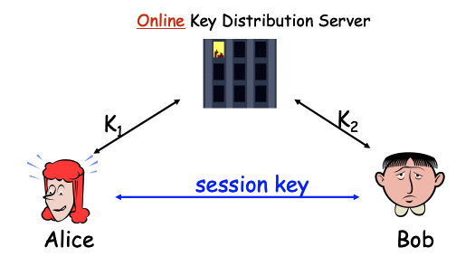
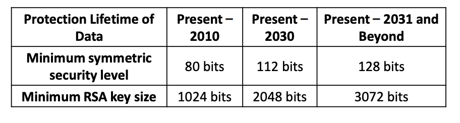
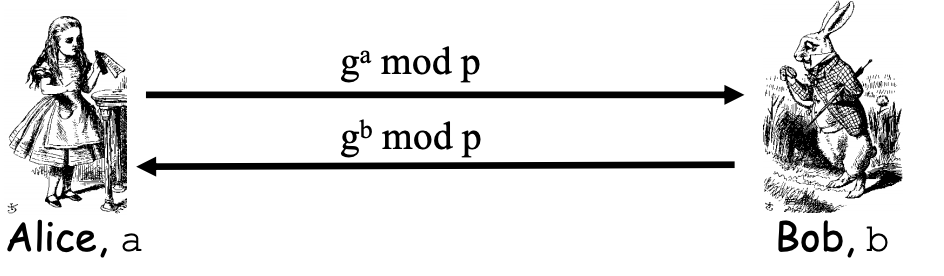
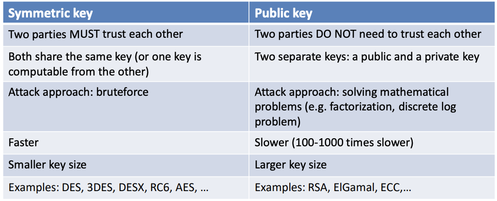
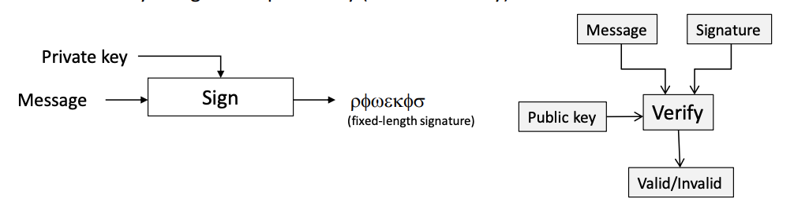
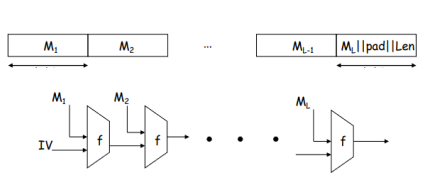
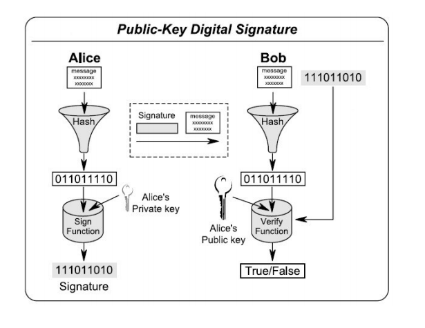
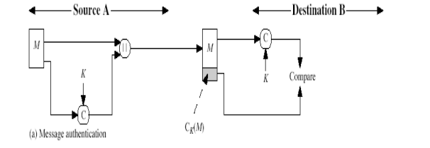
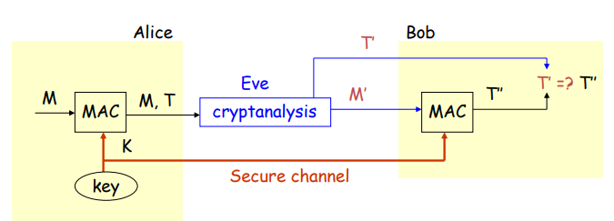
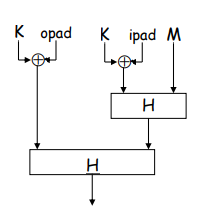

## Lecture 04: Public Key Cryptography: Encryption

### Public Key Encryption vs. Symmetric Key Encryption

* Symmetric Key management: 

  * Each pair of communicating entities needs a shared key
  * ${ n(n-1)\over 2}$ distinct keys in the system
  * $n-1​$ keys for each individual
  * Ways to reduce the key number:
    * Centralized key management => easy to be attacked
    * Public keys

* Centralized Key Management

  

  * Each user shares one long-term secret key with the server
  * The server may become the **single-point-of-failure** and the performance bottleneck
  * Secret keys are used only for the secure delivery of session keys
  * Real data are encrypted under session keys
  * $n$ Long-term secret keys instead of $n(n-1) \over 2$

* Public Key Encryption

  * Receiver Bob has a key pair: public and private
    * publish the **public key** such that the key is **publicly known**
    * Bob keeps the **private key secret**
  * Method: Other people use Bob’s public key to encrypt messages for Bob, and only Bob can use his private key to decrypt
  * Security requirements
    * Difficult to find the private key or plaintext from ciphertext
    * **Difficult to find private key from public key**
  * Usage
    * Rarely used for encrypt message
    * More common to be used to encrypt symmetric session key
    * Dagital signature
  * Based On: Mathematical one way functions: Easy from input to output, difficult otherwise
    * Factorzation problem: Given large prime $p, q$, easy to compute $n = pq$, given $n$ difficult to know $p,q$ 
    * Discrete logarithm problem: Given $a,b,n$, easy to compute $a^b\ mod\ n$, given $a, n, z$, difficult to compute $b$ 
    * ‘Not easy’ means it is currently not computationally feasible

### RSA Algorithm

- Notations: 

  - $M​$: message
  - $C$: encrypted message
  - {$n,e$}: public key
  - {$d,n​$}: private key

- Set up: 

  - Randomly pick two prime numbers (larger better) $p, q$ (suggested to be 512 bits)

  - $n=pq$ , the length of $n_{binary}​$ is the length of the encrypt key

    - **we require that $M < n$ during encryption**

  - compute $\phi(n) = (p-1)(q-1)$  

  - Public key: pick an integer $e$ **randomly** such that $gcd(e, \phi(n))=1$

  - Private key: compute $d\equiv e^{-1}(mod\ \phi(n))$ 
    $$
    ed \equiv 1 (mod\ \phi(n)) \\
    ed - 1 = k\phi(n) \\
    ex + \phi(n)y=1
    $$

- Encryption: 
  $$
  C = M^e\ mod\ n (where\ M < n)
  $$

- Decryption: 
  $$
  M = C^d\ mod\ n = M^{ed}\ mod\ n
  $$

- Proof of correctness: 
  $$
  ed \equiv 1(mod\ \phi(n)) \\
  ed = h\phi(n) + 1 \\
  M^{h\phi(n)+1}\ mod\ n= M \\
  $$

  - when $gcd(M,n)=1$ , according to Euler’s theorem
    $$
    M^{h\phi(n)} \equiv 1(mod\ n) \\
    M^{h\phi(n) + 1} \equiv M (mod\ n)
    $$

  - when $gcd(M,n)\neq 1$, according to Euler’s theorem

    - By assumption, $M < n$ 

    $$
    n=pq \leftrightarrow M=kp\ or\ M=kq \\
    if\ gcd(k,q) \neq 1, q\ is\ prime, M=kp > pq=n\\
    (kp)^{q-1} \equiv1(mod\ q)\\
    [(kp)^{q-1}]^{h(p-1)} * kp \equiv kp (mod\ q) \\
    (kp)^{h\phi(n)+1} \equiv kp(mod\ q) \\
    (kp)^{ed} \equiv kp(mod\ q)\\
    (kp)^{ed} = tq + kp \\
    tq = kp[(kp)^{ed-1}-1] \\
    gcd(p,q) = 1 \rightarrow t = t^\prime p \\
    (kp)^{ed} = t^\prime pq + kp \\
    M^{ed} \equiv M(mod\ n)
    $$

- Security

  - is it possible to calculate $d$ with known $n$ and $e$ 
    $$
    ed \equiv 1 (mod\ \phi(n)) (need\ \phi(n))\\
    \phi(n) = (p-1)(q-1)\ (need\ p\ q)\\
    n=pq\\
    $$

  - if $n$ can be break into two prime numbers, $d$ can be computed => harder to break large $n$, harder to break RSA

  - Factorization Problem: Given positive integer $n$, find its prime factorization: $n = \Pi_{i=1}^kp_i^{e_i}$ 

  - RSA Problem: Given

    - a positive integer $n$ which is the product of two distinct equal-length unknown $p, q$
    - a positive integer $e$ , such that $gcd(e, (p-1)(q-1)) = 1$
    - an encrypted integer $c$ chosen randomly from $Z^*_n$ 
    - Find an integer $m$ such that $m^e \equiv c (mod\ n)$ 

  - The intractability of the RSAP forms the basis for the security of the RSA public-key cryptosystem

    - RSAP is closely related to the Factorization Problem but not known to be equivalent.
    - If one can solve FACTORING, then one can solve RSAP.
    - Is FACTORING $\leq_p$ RSAP?
    - It is widely believed that it is true, although no proof of this is known

  - To break RSA encryption (find $e$) by brute force is not feasible given the relative large size of keys, it is better to solve factorization problem. And the best know factorization algorithms seem to indicate that the number of operations to factorize a number $n$ is estimated by $exp((ln\ n)^{1 \over 3}(ln\ ln\ n))$

  - Roughtly equivalent security for symmetric key size and RSA key size

    - Should consider data lifetime when choose key size
    - For same level of security, key size required for symmetric encryption is less

    

### ElGamal Encryption Scheme

* Notations

  * $M$: message ($M < p$)
  * $C = (A, B)$: encrypted message
  * $y​$: public key
  * $x​$: private key

* Set up

  * Randomly select large prime $p$
  * Let $Z^*_p = \{1, 2, 3, …, p-1\}$ 
  * Let $Z_{p-1} = \{0, 1, 2, …, p-2\}$ 
  * $a \in_R S$ means that $a$ is **randomly chosen** from the set $S$
  * Let $g \in Z^*_p$ such that none of $g^1\ mod\ p, g^2\ mod\ p, …, g^{p-2}\ mod\ p$ is equal to $1$  
  * Private key: $\{x \in_R Z_{p-1}, p\}$  
  * Public key: $\{y = g^x\ mod\ p, p\}$ 

* Encryption

  * $r \in_R Z_{p-1}​$
  * $A = g^r\ mod\ p$
  * $B = My^r\ mod\ p$ where $M \in Z^*_p$ is the message

* Decryption

  * $K = A^x\ mod\ p$
  * $M = BK^{-1}\ mod\ p​$

* Correctness: proof
  $$
  M = BK^{-1} = B(A^x)^{-1}\ mod\ p \\
  = My^r(g^{rx})^{-1}\ mod\ p = M(g^x)^r(g^{rx})^{-1}\ mod\ p \\
  = M
  $$

* Advantage

  * The initial setup procedure is easier than RSA, (However, there is a lot of calculation to do when encrypting and decrypting, since we need to do modular inverse every single time of decryption)
  * If we encrypt same messages with RSA, the result will be the same, while it will be different if we use ElGamal (since there is a random number $r$)

* Security

  * Given $C = (g^r\ mod\ p, My^r\ mod\ p)$ and public key $y = g^x\ mod\ p$, find $M$ without knowing $x, r, g$ (know $p$). The scheme is broken: 

    * If adversary can get $r$ from $g^r\ mod\ p$, as shown below
      $$
      y = g^x\ mod\ p < p \\
      gcd(y, p) = 1 \\
      y^{p-1}\ mod\ p = 1 \\
      r < p-1 \leftrightarrow p-1-r > 0 \\
      y^r * y ^ {p-1-r} \ mod\ p = 1 \\
      B = My^r\ mod\ p \\
      M = By^{p-1-r}\ mod\ p
      $$

    * or get $x​$ from $g^x\ mod\ p​$

    * or compute $g^{rx}\ mod\ p​$ from $A = g^r\ mod\ p, y = g^x\ mod\ p​$
      $$
      K = g^{rx}\ mod\ p \\
      M = BK^{-1}\ mod\ p
      $$

  * First two correspond to DLP (Discrete Logarithm Problem), while the last one corresponds to Diffie-Hellman Problem. 

  * When $p​$ is large, DLP is hard. In practive, key size should be at least $1024​$ bits long

### Diffie-Hellman

* Diffie-Hellman Problem

  * Given $A = g^x\ mod\ p, B = g^y\ mod\ p$ find $C = g^{xy}\ mod\ p$ 

  * If DLP can be solved, then Diffie-Hellman Problem can be solved
    $$
    C = A^y\ mod\ p = B^x\ mod\ p\\
    $$

  * Open Problem: If Diffie-Hellman Problem can be solved, can DLP be solved? 

* Diffie-Hellman Key Exchange: Not all public key algorithms are for encryption, the can be used to exchange keys (or they could only be a signature scheme)

  * Method

    

    * Alice and Bob choose $a, b$ respectively. $p$ is a public large prime number, $g$ is public
    * Alice send $g^a\ mod\ p$ to Bob
    * Bob compute $k = (g^a)^b\ mod\ p​$, and send $g^b\ mod\ p​$ to Alice
    * Alice compute $k = (g^b)^a\ mod\ p$ 

  * Security

    * This key exchange scheme is secure against eavesdroppers (窃听者) if Diffie-Hellman Problem is assumed to be hard to solve
    * However, it is insecure if the attack in the network is **active**: man in middle attack

  * Man-in-the-Middle Attack (MITM)

    * Trudy shares $k_1 = g^{at}\ mod\ p$ with Alice
    * Trudy shares $k_2 = g^{tb}\ mod\ p$ with Bob
    * Alice and  Bob don’t know Trudy exists
    * To avoid it: add integrity protection such as digital signature, MAC etc.

* Public Key vs. Symmetric Key

  

------------

## Lecture 05: Digital Signature & Hash & MAC

### Integrity

* Encryption does not provide integrity i.e.: 
  * Encryption cannot prevent
    * Changing
    * Deletion
    * Insertion
    * Falsifying the origin
  * Reason: If the receiver does not know the content of the message, it will not know whether it has been changed
* Levels of integrity
  * Detect (accidential) modification => hash
  * Data origin authentication (verify origin/no modification) => MAC
  * Non-repudiation (only one person generated this message) => digital signature
  * Example: 
    * Send payment information from ATM to bank - data origin authentication (ATM cannot send it has not send the message)
    * Send payment information by using e-banking - Non-repudiation
* Electronic Signature
  * There is an electronic document to be sent from Alice to Bob, which satisfy:
    * Easy for Alice to sign
    * Hard to forge
    * Easy for Bob to verify
  * Signature should be used for
    * Establish the origin of the message (data origin authentication)
    * Settle later disputes what was sent and who sent it (non repudiation)

### Digital Signature

* Method: Use asymmetric cryptography (usually RSA), since it only allows one party to sign (to provide non-repudiation)

  

  * Sign using Alice’s private key (signing key)
  * Verify using Alice’s public key (verification key)
  * Only the signer can generate a valid signature
  * Anyone can verify if a signature with respect to a message is valid

* RSA Signature Scheme

  * Reason
    * RSA is a cryptosystem that happens to have properties that allow it to be used for both encryption and digital signature accordding to the highly **‘symmetric’** operation of encryption and decryption
    * Not all digital signature schemes are based on RSA (Based on ElGamal for e.g.)
    * **So for digital signature, we use the terminology sign and verify instead of encrypt and decrypt**
  * Set up: Same as RSA encryption
  * Sign: $S = M^d\ mod\ n$
  * Verify: $M = ({S^\prime})^e\ mod\ n$, if $M^\prime = M$, output valid; otherwise, not valid
  * **Notice that $M<n​$** 
    * Break the message into bits and sign each individually: No, it is too slow
    * Use a long $n$: No, it is too slow
    * Use compression function to shrink the size of $M$ 

### Hash Function

* Motivation: To solve the problem for RSA if $M > n$

* Method:

  * Instead of signing $M$, we use function $h(M)$ to compress $M$, such that $M < n$ 
  * Sign: $S = (h(M))^d\ mod\ n$
  * Verify: $H = (S^\prime)^e\ mod\ n$, output valid only if $ H = h(M^\prime) $
  * $h$ maps a binary string to a non-zero integer smaller than $n$ => cannot avoid collision since the space is shrinked
  * $h(M)$ is called a message digest

* Usage of hash: 

  * A hash function **does not provide any security services by itself**, since anyone can calculate hash if it knows the funciton

  * Supports other mechanisms: 

    * Compression function for RSA
    * One way property support digital signature s.t. no one can change the cipher text $C$ and comput fake $M$ 
    * Supports HMAC

  * Can detect **accidental** modification by itself: often used to validate downloads, this is not secure since anyone can update the file and then calculate an new hash. 
    $$
    send(H = h(M)||M) \\
    receive(H^\prime||M^\prime) \\
    H^\prime = h(M^\prime) \rightarrow almost\ impossible\ to\ be\ accidential\ modification
    $$

* Properties should be provided by hash

  * 2 functional properties
    * Compression - aribitrary length input to output of small, fixed length
    * Easy to compute - expected to run fast
  * 3 security properties
    * One way: Given a hash value $y$ it is infeasible to find and $x$ such that $h(x) = y$
    * Second pre-image resistance: Given $y$ and $h(y)$, cannot find $x$ where $h(x) = h(y)$
    * Collision resistance - infeasible to find $x$ and $y$, with $x \neq y$ such that $h(x) = h(y)$ 

  * Notice:
    * **Collision cannot be prevented since it is a compression function, however, collision resistance requires that it is difficult to find such kind of collision.** 
    * The difference between second pre-image and collision resistance is whether your birthday is the same with another one in your classroom and whether there is a pair of students in your classroom. 
    * Strongness of properties: Collision resistance > Second pre-image resistance > One way (If a hash function is collision resistant, then it is also one-way, but it doesn’t work inversly)
    * Due to collision resistance, different messages should be computed to different message digests. A good function will gice a completely different result even if very small part of the input changes

* Security

  * The length of every collision resistant hash function $h$ is fixed, the adversary needs to repeatedly chooses random value $x$, compute $h(x)$ and check if the hash function is equal to any of the hash values of all previously chosen random values
  * The question is how many times in average should the adversaries try to find the collision?

* Birthday Problem

  * Pre-birtnday problem

    * $K$ people in the room
    * How large must $K$ be before the probability that someone has the same birthday as me is $\geq {1 \over 2}$ 
      * Solve: ${1 \over 2} = 1 - ({364\over 365})^K$ for $K$ 
      * Find $K \geq 253$ 

  * Birthday Problem

    * How large must $K$ be before the probability that two or more have the same birthday is $\geq {1 \over 2}$ 
      * Solve: ${1\over 2} = 1 - ({A_{365}^K\over 365^K})$ 
      * Find $K \geq 23​$ 
    * $K \approx \sqrt{365}​$ 

  * **Implication**: Secure $N$ bit hash requires $2^{N \over 2}$ work to “break” (w.r.t collision resistance) => Using the first order Taylor expansion: $1-x \approx e^{-x}$ , denote $F(k)$ to be the probability that the attack fails
    $$
    F(k) = (1-{1\over n})(1-{2\over n})...(1-{k-1\over n}) \\
    \approx e^{-(({1\over n})+({2\over n})+...+({k-1\over n}))}\\
    = e^{k(k-1) \over 2n} \\
    Set\ F(k) =  e^{k(k-1) \over 2n} = {1 \over 2} \\
    k(k-1) = 2n\ ln({1\over 2}) \\
    k \approx \sqrt{2\ ln({1\over 2})} n^{1 \over 2}
    \approx 1.17 n^{1 \over 2}
    $$

  * The birthday attack imposes a lower bound on **the size of message digest**
    * Attacker random choose messages to hash them, and comprare hash value of each of the pairs
    * $10$ bits message digest: $2^5 =32$ random hashes
    * $40$ bits message digest: $2^{20}$ random hashes

* Use block ciphers as hash functions

  * Set $H_0 = 0$
  * Compute $H_i = AES_{M_i}[H_{i-1}]$
  * Use the value of the final block as the hash value
  * If the length of message is not the multiple of the key size, zero-pad the last segment of message
  * **Why should we not do this** => Block cipher has a fixed output size, which is much shorter than most of hash function lengths (AES 128 bits, generally hash function is 160 and up to 256/384/512 bits) => easier to find collision

* General Design of Hash Algorithms

  

  * Partition the input message into fixed-sized blocks (e.g. 512 bits per block)

  * The remaining bits of the input are padded with the value of the message length

  * Iteratively use the compression function $f$, initialize the value $IV$ (i.e. a magic number)
    $$
    H_n = h(H_{n-1}, M_n)
    $$

  * Note: Hash algorithms are usually designed heuristically.

* Main Application of cryptographic hash function

  

  * The signer will calculate the hash of the message and then in the case of RSA signs the hash (not the message). **All signature schemes use the hash in the signature generation**.
  * Upon receiving the message and signature the receiver will also compute the hash of the received message. This hash is then used during signature verification
  * If we were using RSA, the signature verification with the public key will result in the hash the sender calculated. We then compare this verification hash with the has we calculated over the received message and if it they are the same we consider the signature valid.
  * **Function of hash in this case**
    * Compress the message
    * If the hash has some collision, we can replace the message with a same hash value message, and it will be verified
    * If the hash is not one-way, or says, we assume $M<n$. Without using hash, we can always change the signature and use the public key to decrypt finally get a modified but can be verified message

* Popular Crypto Hashes

  * MD5: 128 bit output (broken)
  * SHA-1:  160 bit output (not safe for now)
  * SHA-2 (based on SHA-1 with longer hash value): e.g. SHA 224/256/384/512
  * SHA-3: A competition

### Message Authentication Code (MAC)

* Motivation

  * Make sure what is sent is what is received
  * Detect unauthorized modification of data (e.g. **inter-bank fund transfers, in this case confidentiality is nice, but integrity is critical**) 
  * Encryption provides **confidentiality** (prevents unauthorized disclosure)
  * Reminder! Encryption alone does not assure message authentication (a.k.a. data integrity) (Except the case receiver knows the content of the message)

* Method

  

  

  * A MAC is a symmetric cryptographic mechanism (can be understood as hash with symmetric secret key, or a symmetric key ‘signature’)
  * Assumption: Sender and receiver share a secret key $K$ (Why MAC does not provide non-repudiation => shared key)
    * Sender computes a MAC tag using the message and K; then sends the MAC tag along with the message
    * Receiver computes a MAC tag using the message and $K$; then compares it with the MAC tag received. If they are equal, then the receiver concludes that the message is not changed
  * Comparison to hash
    * The difference between hash and MAC is only sender and receiver can compute and verify a MAC tag => That is why we do not care about collision analysis. attacker would need the secret key
    * Both maps arbitrarily long message to fixed length output
  * Comparison to digital signature
    * Faster to compute - property of symmetric encryption
    * Does not provide non-repudiation => Shared key cannot prove who ‘signs’ the key
      * receiver can modify the message
      * sender can claim it is possible that receiver has changed the message and deny that he sent a message

* MAC Algorithm

  * MAC can be constructed from a block cipher operated in CBC mode (with IV = 0)

  * For plaintext $\{p_0, p_1,...,p_n\}$ 
    $$
    C_0 = E(K, IV \oplus P_0) \\
    C_1 = E(K, C_0 \oplus P_1) \\
    C_2 = E(K, C_1 \oplus P_2) \\
    ... \\
    C_n = E(K, C_{n-1} \oplus P_n) = MAC\ tag \\
    $$

  * Correctness: Suppose Trudy changes $P_1$ to $X$ 
    $$
    C_0 = E(K, IV\oplus P_0), {\color{red}C_1} = E(K, C_0\oplus X), \\
    {\color{red}C_2} = E(K, {\color{red}C_1}\oplus P_2), ...{ \color{red}C_n} = E(K, {\color{red}C_{n-1}}\oplus P_n)
    $$

  * **Note**: This algorithm may not be secure if the messages are in variable length

    * If we have two message-MAC tag pairs: $(P_1, T_1), (P_2, T_2)$ , if we set: 
      $$
      P_3 = P_1||P_2 \oplus T_1 \\
      T_3 = MAC(MAC(P_1, K)\oplus (P_2 \oplus T_1), K) \\
      =MAC(P_2, K) = T_2
      $$

    * By using this method, we can append some information to the message and give a correct tag

    * In this situation, we modify the CBC-MAC to prevent such attacks (we have some additional initial and final permutations)

* HMAC

  * Message Authentication Code: $A\leftarrow C_K(M)$

    * $M$: message
    * $A$: authentication tag
    * For integrity and authenticity

  * HMAC: Keyed-hashing (instead of encryption) for Message Authentication

  * Used extensively in IPSec (IP Security), which is  widely used for establishing Virtual Private Networks (VPNs)

  * Method: 

    
    $$
    HMAC_K(M) = H( K \oplus opad || H((K \oplus ipad) || M) )
    $$

    * Let $B$ be the block length of hash, in bytes ($B = 64$ for MD5 and SHA-1) ?? 

      ```
      ipad = 0x36 repeated B times
      opad = 0x5C repeated B times
      ```

    * Integrating a secret key into the hash calculation (there are some other ways proved to be unsafe) => append generated key to the front and do hash twice using two different generations

    * $ K \oplus opad$ and $K \oplus ipad$ is just a fancy way of saying you should use two different keys (although they could be derived from each other)

  * Reason to use: 

    * Hash functions are generally seen as being quite efficient and fast
    * And they also give good output lengths. 
    * It has therefore been proposed that we build MAC out of hash rather than symmetric
      encryption.

* Combine integrity and confidentiality: Encrypt the data and do a MAC => order is a practical issue

  * Encrypt then MAC:
    * Verification is efficient, we just compute and check the MAC, if fail don’t decrypt
    * However, some people argue MAC is not truly representative of the plaintext (calculated across the ciphertext message).  Once decrypted there is not remaining data origin authentication on the plaintext. 
  * MAC then encrypt
    * MAC calculated on plaintext => more representative
    * However, have to decrypt first and verify

