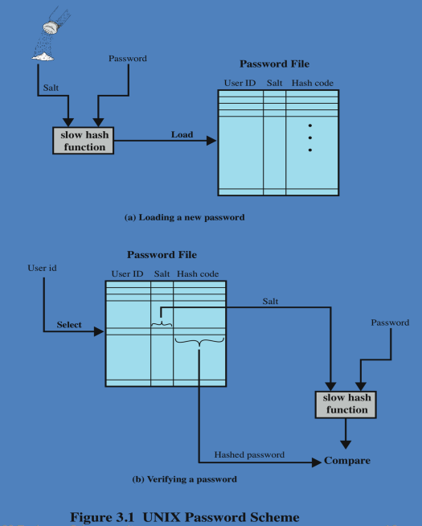
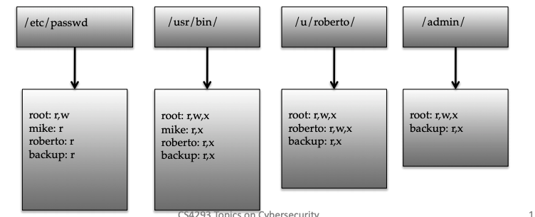

# CS4293: Topics on Cybersecurity

[TOC]

* Midterm questions

  * Analysis & reasoning

  * analyze code => where things wrong, how to fix (**buffer overflow part**)

  * present certain protocols / design diagrams, tell anything wrong/secure, and reason => **authentication**

  * submit kind of formulas, equations => **asymmetric encryption**

  * similar to tutorial / assignment questions

  * First question

    ```
    Name: Zhang Deheng
    EID: dehezhang2
    Student ID: 55199998
    ```

## Lecture 01: Introduction and Basic Crypto Tools

* P19-p23: Tools for **confidentiality**

  * Encryption
  * Access control: Control what the users with a “need to know”
  * Authorization: Person or system is allowed access to resources
  * Physical security: Limit access to protected computational resources

* P20: 

  * e.g. prone <=(https)=> Server (transforme video stream or web pages)
  * s in https means SSL(Secure socket layer)
  * https doe not consider side channel attack, for video streaming case, if two continuous frame are similar, the traffic payload is lower. => use the traffic pattern to analyze which video you are watching (Website finger-printer is another case)

* P25: Tools for **Integrity**

  * Backups
  * Checksums
  * Data correcting codes: Methods for storing data in such a way that small changes can be easily detected and automatically corrected

* P26: Tools for **Availability**

  * Physical protections
  * Computational redundancies: computers and storage devices that serve as fallbacks (後備) in the case of failures.

* P28: **Assurance**: refers to how trust is provided and managed in computer systems. Which depends on

  * Policies: e.g. describe how users can access and copy songs.
  * Permissions: e.g. an online music store may provide permissions for limited access and copying to people who have purchased certain songs
  * Protections: Enforce policies and permissions

* P29: **Authenticity** is the ability to determine that **statements, policies, and permissions issued by persons or systems** are genuine.

  * **tool**: digital signature

* P30: **Anonymity**: the property that certain records or transactions not to be attributable to any individual. Good property, but hard to achieve. Tools: 

  * Aggregation: the combining of data from many individuals so that disclosed **sums or averages** cannot be tied to any individual.

  * Mixing: the **intertwining**(mix) of transactions, information, or communications in a way that cannot be traced to any individual.

  * Proxies: **trusted agents** that are willing to engage in actions for an individual in a way that cannot be traced back to that person.

    

  * Pseudonyms: fictional identities that can **fill in for real identities in communications and transactions, but are otherwise known only to a trusted entity.** 

* P31 - P36 Threats and Attacks - Services

  * Eavesdropping - Confidentiality: the interception(截取) of information intended for someone else during its transmission over a communication channel.

  * Alteration - Integrity: e.g. man-in-the-middle attack

  * DoS - Availability

  * Masquerading - Data entity authentication

  * Repudiation - Non-repudiation

  * Correlation and traceback - Anonymity: the integration of multiple data sources and information flows to determine the source of a particular data stream or piece of information.

    

* P38 - P47: The Ten Security Principles

  * **Economy** of mechanism:  simplicity in the design and implementation of security measures
  * **Fail-safe** defaults: the default configuration of a system should have a conservative protection scheme. e.g.: new added user is assigned to minimal access right
  * **Complete** mediation: every access to a resource must be checked for compliance with a protection scheme. e.g. – For example, an online banking web site should require users to sign on again after a certain amount of time, say, 15 minutes, has elapsed.
  * **Open** design: the security architecture and design of a system should be made **publicly available**. (Algorithm is known to public but still cannot break)
  * **Separation of privilege**: **multiple conditions** should be required to achieve access to restricted resources or have a program perform some action.
  * **Least privilege**: Each program and user of a computer system should operate with the bare minimum privileges necessary to function properly. e.g.: No more privilege
  * **Least common mechanism**: In systems with multiple users, mechanisms allowing resources to be shared by more than one user **should be minimized.** 
  * **Psychological acceptability**: user interfaces should be well designed and intuitive, and all security-related settings should adhere to what an ordinary user might expect.
  * **Work factor**: the cost of circumventing a security mechanism should be compared with the resources of an attacker when designing a security scheme. (cost to break > protected resource)
  * **Compromise recording**: sometimes it is more desirable to **record the details of an intrusion than to adopt more sophisticated measures to prevent it**. 

* P69: Digital Certificates: Make sure the public key is certified (bind public key to a person)

* Secure Password

  * Common means for authentication 
  * Usually stored via hash values 
  * long psw. + odd char. are better and safer

* P77: Social Engineering

  * Pretexting: creating a story that convinces an **administrator or operator** into revealing secret information. 
  * Baiting: offering a kind of “gift” to get **a user or agent** to perform an insecure action. 
  * Quid pro quo: **offering an action or service and then expecting something in return.**

-------------

## Lecture02: Basic Crypto Tools

* P5: 

  * Plaintext length typically the same as ciphertext length 
  * Encryption and decryption are PRP, i.e., pseudorandom permutation functions (bijections), on the set of all n-bit arrays
  * Efficiency: functions $E_K$ and $D_K$ should have efficient algorithms
  * Consistency: Decrypting the ciphertext yields the plaintext

* P6:

  * Never use a proprietary cipher(not public known algorithm)
  * nonce is a.k.a IV

* P7: Use cases

  * Single use key: (one time key) 
    * Key is only used to encrypt one message (encrypted email: new key generated for every email)
    * **No need for nonce** (set to 0) 
  * Multi use key: (many time key)
    * Key used to encrypt multiple messages (SSL: same key used to encrypt many packets)
    * Need either **unique nonce or random nonce**

* P8: Types of attacks

  * Ciphertext only attack
  * Known plaintext attack
  * Chosen plaintext attack
  * Chosen ciphertext attack

* P12: Substitution Boxes (apply substitution cipher on binary numbers), a.k.a. S-boxes

* P13 - P15: 

  * One-time pad is actually using a block of shift keys $(k_1, k_2, …, k_n)$ to encrypt a plaintext, $M$, of length $n$, with each shift key being chosen uniformly at random.
  * Ciphertext = (Key + plaintext) mod 26
  * For binary case, this operation is changed to XOR (i.e. for each bits (key+plaintext) mod 2)
  * OTP is “secure” against cipher text-only attacks => All possible key-plaintext pairs make sence

* Weakness of OTP

  * Length of the key need to be the same as the plaintext
  * Key can never be reused
  * Key management is difficult (Problems in generation & safe distribution of keys.)

* P17 - P19: Steam cipher => use pseudo random generator to create key stream

  * Advantage
    * Solves the problem of key size for OTP
    * Key stream is unpredictable without the key
    * Computation is fast, code is simple
    * Suitable for plaintext of arbitrary length generated on the fly, e.g., media stream – processes input elements continuously
  * Disadvantage
    * Stream ciphers should single use key, danger when the key is used twice, XOR ciphertext to get the XORed message and do further analysis

* P20: Key stream generation

  * RC4
  * Block cipher in counter mode: 
    * Can use a shorter counter concatenated with a random value
    * Synchronous stream cipher
      * Key stream only from secret key
      * Works for unreliable channels if plaintext has packets **with sequence numbers**

* P23: Padding should be removable: 

  * When the block size and plaintext length are a multiple of 8, a common padding method (PKCS5) is a sequence of identical bytes, each indicating the length (in bytes) of the padding
  * We need to always pad the last block, which may consist only of padding (to avoid same result before and after padding)

* P24: Size of `3DES` is `168 bits`

  

* P26: Block cipher round: **For each block**, block cipher will do the operation for many rounds, each round use a different round key by using key expansion

  

* **P37: PRF and PRP**

  * Pseudorandom Function (PRF): $F: K \times X \mapsto Y$ is such that: exists “efficient” algorithm to evaluate $F(K,x)$ 

  * Pseudorandom Permutation Function (PRP): $F: K \times X \mapsto X$ such that

    * Exists “efficient” algorithm to evaluate $E(k, x)$
    * The function $E(k, .)$ is one-to-one
    * **Exists “efficient” algorithm for inverse $D(k,x)$** => bijection
    * A block cipher is a PRP

  * Secure Pseudorandom Function (PRF): $F: K \times X \mapsto Y$ is such that: $F(k, .)$ is **indistinguishable** from a true random function $f: x \mapsto Y$ 

    

  * Secure Pseudorandom Permutation Function (PRP): $F: K \times X \mapsto X$ such that $E(k, .)$ is indistinguishable from a random permutation $\pi: X\mapsto X$ 

  * PRF Switching lemma: A secure PRP is also a secure PRF => AES and 3DES are secure PRFs

  * An example of non-secure PRF

    

* P50: How to choose IV

  * Single use key: Do not need IV

  * Mult use key: 

    * Best: Use a fresh random IV for every messages, and send IV together with the cipher texts 

    * Also can use unique and non-random IV (e.g. counter)

      * But then first step in CBC must be $IV^\prime \leftarrow E(k_1, IV)$

      * Benefit: may save transmitting $IV$ with ciphertext

    * e.g. share both $K$ and $K_1$, and synchronize the choice of initial counter $IV$, which might start with $1,2,3,…$ for message $1,2,3….$ (each time encrypt the counter by using $K_1$, and use the result as $IV$)

      

* P53: Counter mode: Used in high-speed network encryptions (parallel encryption but fix the problem of ECB (same input result in different output))

* P81: PMAC - Parallel MAC: ECBC and HMAC are sequtial => attacker change the order

  

* P88: Implementation attacks: Powercryptanalysis

  * Powerconsumption depends on instruction and data
  * Measure power consumption during block cipher operation
  * About 1000 ciphertexts suffice to expose secret key

* P95: The escrow is a trusted agency, if you forget the key, it can be used to recover the key

* **P113 - 119**:  Notice the definition of trapdoor function (TDF); A textbook RSA (RSA without hash) is not truly randomize encryption, a better method is to use textbook RSA combined with **hash function and symmetric encryption**

  

  * Randomly select $x$: $x \in _ R X$
  * encrypt by textbook RSA: $y \leftarrow RSA(p_k, x)$ => $x \leftarrow RSA(s_k, y)$
  * Use hash function generate a key: $k \leftarrow H(x)$ (Same for both side)
  * Use the key as symmetric encryption key: $c \leftarrow E_s(k, m)$ => $m \leftarrow D_s(k, m)$
  * output $(y,c)$ 
  * The point is use RSA to share the information to construct the key
  * Advantage
    * Fast to compute (borrow from symmetric encryption)
    * Safe, same input will result in different output

* **P124: The $H$ function is not simply hash, it contains two steps**

  * First apply normal hash $h(M)$, which result in says `256-bits` digest
  * The apply an internal step to make to `1024/2048-bits` integer

* P127: Digital signature based certificates is widely used in web browser

  

  * Motivation: Prove the public key of Bob is actually belong to Bob

  * Solution: PKI

    * Trusted root authority (VeriSign, IBM, United Nations) 
      * Everyone must know the verification key of root authority 
      * Check your browser; there are hundreds!! 
    * Root authority can sign certificates
    * Certificates identify **others, including other authorities**
    * Leads to **certificate chains** (verify the certificate of certificate … )

  * Method: The server send its public key to CA, CA sign the public key by using CA’s private key. User verify the public key of server by using the public key of CA. Then use the public key of server verify the message

    

  * Potential threat: PKI cannot provide absolute security

    * If CA is not well added to your browser, bad CA may give bad certificates
    * It is very cheap, even free to get one Digital Certificate 
    * Attackers can still compromise the CA

* P133: Limitations of Cryptography

  * Most security problems are not crypto problems
    * pros: cryptography works
    * cons: people make other mistakes which cannot be solved by crypto
  * Misuse of cryptography is fatal for security
    * WEP – ineffective, highly embarrassing for industry
    * Occasional unexpected attacks on systems subjected to serious review

---------------------

## Lecture 03: User Authentication and Applications

### Authentication

* **Authentication**: The determination of **identity**
* **Authentication Process**: 
  * Fundamental building block and primary line of defense
  * Basis for access control and user accountability
  * **identification step**: presenting an identifier to the security system
  * **verification step**: presenting or generating authentication information that corroborates the binding between the entity and the identifier
* **Means of Authentication** (four means of authenticating user identity are based on)
  * Something the individual knows: password, PIN, answers to prearranged questions
  * Something the individual possesses (token): smartcard, electronic keycard, physical key
  * Something the individual is: fingerprint, retina(视网膜), face
  * Something the individual does (dynamic biometrics): Voice pattern, handwriting, typing rhythm

------------------

### User Authentication with passwords

* **Password Authentication**

  * Widely used line of defense against intruders
    * user provides name/login and password
    * system compares password with the one stored for that specified login
  * The user ID
    * determines that the user is **authorized to access the system**
    * determines the user’s **privileges**
    * is **used in discretionary(自由裁量权) access control**

* **Basic Password Protocol** - incorrect version

  * Now we don’t consider internet channel attack, says you login your computer

  * **PWD**: Finite set of passwords

  * Algorithm G (KeyGen):

    

    

    * Prover: Want to be proved. Verifier: Verify others
    * Choose rand $pw$ in PWD.
    * Output yes if $sk=vk=pw$, otherwise do not allow the access

  * Problem: VK must be kept secret

    * Compromise of server exposes all passwords
    * Never store passwords in the plaintext

* **Basic Password Protocol** - version 1

  

  * $H$: Hash function from PWD to $X$, satisfy one-way and second preimage resistance
  * Problem
    * Weak password is often used by users
    * **Online dictionary** attacks (try different combinations): 
      * Defeat by doubling response time after every failure
      * Harder to block when attacker commands a bot-net
    * **Offline Dictionary Attacks**
      * Suppose attacker obtains the digest of the password $H(pw)$ from server
      * **Offline** attack: hash all words in Dict until a word $w$ is found such that $H(w) = vk$
      * $O(|Dict|)$ per password
      * Off the shelf tools
        * 2,000,000 brute-force guesses/sec
        * Scan through 360,000,000 guesses in few minutes. Will recover 23% of passwords
    * **Batch offline Dictionary Attacks** (aka rainbow attack)
      * Suppose attacker steals $pwd$ file $F$: obtain hashed pwds for all users
      * Batch dictionary attack: 
        * Build list $L$ containing $(w, H(w))$ for all $w \in Dict$
        * Find intersection of $L$ and $F$ 
      * Total time: $O(|Dict|+|F|)$ 
      * Much better than a dictionary attack on each password

* **Preventing Batch Dictionary Attacks** - use salt(or nonce)

  * Motivation:

    * prevents duplicate passwords from being visible in the password file.
    * Even if two users choose the same password, those passwords will be assigned different salt values. 
    * Hence, the hashed passwords of the two users will differ. 
    * It greatly increases the difficulty of offline dictionary attacks. 
    * becomes nearly impossible to find out whether a person with passwords on two or more systems has used the same password on all of them

  * Public salt: 

    * When setting password, pick a random $n$-bit salt $S$, store salt as well as digest
    * When verifying $pw$ for $A$, test if $H(pw, S_A) = h_A$ 

  * Recommended salt length $n = 64$ bits, Pre-hashing dictionary does not help

  * Batch attack time is now $O(|Dict| \times |F|)$ (need to look for all dictionary for each password)

  * Procedure of storing hashed pwd with salt

    

    * To load a new password into the system, this password is combined with a fixed-length salt value.
      * Salt from the time when the password is assigned to the user. (Some old implementation.)
      * Salt from a pseudorandom or random number.
    * The password and salt serve as inputs to a hashing algorithm to produce a fixed-length hash code.
    * The hash algorithm is designed to be slow to execute to thwart attacks. (Change a little bit slower for user but a lot difficulty for adversaries) 
    * The hashed password is then stored, together with a plaintext copy of the salt, in the password file for the corresponding user ID.

  * Procedure of verifying

    * User provides an ID and a password.
    * The OS uses the ID to index into the password file and retrieve the plaintext salt and the hashed password.
    * The salt and user-supplied password are used as input to the slow hash routine.
    * Accept only if the result matches

  * Further Defenses: slow down the process, make it unnoticeable to user, but makes offline dictionary attack harder

    * Slow hash function (e.g. H(pw) = SHA1(SHA1(...SHA1(pw)...)) )
    * Secret salts: 
      * When setting $pwd$ choose short random $r$ (8 bits), does not store the value
      * When verifying $pw$ for $ A$, try all values of $r_A$: 128 times slow down on average

* Case study: UNIX and Windows

  * UNIX: 12-bit public salt

    * Convert $pw$ and salt and a DES key $k$

    * Iterate DES (or DES‘) 25 times by using input value $0$

    * output translated to 11 character sequence

      

  * Windows: NT and later use MD4

    * outputs a 16 bytes hash
    * No public or secret salts

  * Old scheme is regarded as inadequate

    

----------------------

### User Authentication via one-time passwords

* **The SecurID system** (secret $vk$, stateful)

  * Algorithm G: (setup)

    * Choose random key $k \leftarrow K$
    * Output $sk=(k,0)$; $vk = (k,0)$

  * Identification: 

    * Each time increase counter, need to maintain the state

    * $F$ should be one way, if $F$ is secure PRF then protocol is secure against eavesdropping

      * RSA SecureID uses a custom PRF

        

    

  * Advancing state: $sk \leftarrow (k, i+1)$

    * Time based: every 60 seconds
    * User action: every button press of user

  * Both systems allow for skew in the counter value, i.e. allow a window of counter value since the loss of synchronization

* **The S/Key system**

  * Notation: $H^{(n)}(x) = H(H(...H(x)...))(n\ times)$ 

  * Algorithm G: (setup)

    * Choose random key $k \leftarrow K$
    * Output $sk=(k,n)$; $vk=H^{(n+1)}(k)$ (verification key is public)

  * Identification

    * Prover ($sk = (k,i)$): send $t \leftarrow H^{(i)}(k)$; set $sk \leftarrow (k, i-1)$
    * Verifier($vk = H^{(i+1)}$): If $H(t) = vk$ then $vk \leftarrow t$ output “yes”
    * Notes: $vk$ can be made public, but need to generate new $sk$ after $n$ logins ($n \approx 10^6$) 
      * Last session: $sk = (k,0), vk = H(k)$, after this reset everything
    * Thm:$ S/Key_n$ is secure against eavesdropping (public $vk$) provided $H$ is one-way on $n$-iterates

    

* **SecurID vs. S/Key**

  * S/Key:

    * **public** $vk$, **lmited** number of auths

    * often easily implemented (pen and paper suffice)

      * Server just pre-compute a table to record all possible values in the hash chain, just check one-by-one for each sessions

        

    * Can ask everyone to verify

  * SecurID:

    * **secret** $vk$, **unlimited** number of auths
    * often implemented using secure token

--------------------------

### User Authentication/Identification with Biometrics

* **Biometric Authentication**: 

  * Attempts to authenticate an individual based on unique physical characteristics based on pattern recognition
  * Is technically complex and expensive when compared to passwords and tokens
  * physical characteristics used include:
    * facial characteristics
    * fingerprints
    * hand geometry
    * retinal pattern
    * iris
    * signature
    * voice

* Requirements of Biometrics

  * **Universality.** Almost every person should have this characteristic.
  * **Distinctiveness.** Each person should have noticeable differences in the characteristic.
  * **Permanence.** The characteristic should not change significantly over time.
  * **Collectability.** The characteristic should have the ability to be effectively determined and quantified.

* Pros and Cons of Using Biometrics

  * Benefits:
    * hard to forget
    * Individually unique
  * Problems:
    * Biometrics are not generally secret
    * Cannot be changed, unlike passwords
  * => Primarily used as a second factor authentication

* General Operation of a Biometric System

  

  * Each individual who is to be included in the database of authorized users must first be enrolled in the system.
    * analogous(类似的) to assigning a password to a user.
    * The system maintains the user a name (ID), perhaps a PIN or password, and the biometric value.
  * Depending on application, user authentication on a biometric system involves either verification or identification.
    * For biometric verification, the user enters a PIN and also uses a biometric sensor.
      * The system extracts the corresponding feature and compares that to the template.
      * Match? ---> the system authenticates the user.
    * For an identification system, the individual uses the biometric sensor but presents no additional information.
      * The system then compares the presented template with the set of stored templates.
      * Match? ---> the user is identified. 

-----------------------------

### Remote User Authentication (complex than local user authentication)

* **Remote User Authentication**

  * authentication over a network, the Internet, or a communications link is more complex

  * additional security threats such as: eavesdropping, capturing a password (password hash is still not secure => can be captured and sent to server on behalf of attackers), **replaying an authentication sequence (need to be fresh authentication)** that has been observed

  * generally rely on some form of a **challenge response protocol to counter threats**

    * Proof should not review anything on $sk$ (avoid intercepting the proof)

    

* **Remote Authentication via Password Protocol**

  * Procedure

    

    * user transmits identity(UID) to remote host
    * host generates a random number (nonce)

      * nonce ($r$) is returned to the user
      * host stores a hash code of the password
      * function $f$ in which the password hash is one of the arguments
    * user send back the value of $f(r, h(P))$ 

      * use of a random number helps defend against an adversary capturing the user’s transmission 
      * $f$ protects hashed password, to make sure it is not exposed

  * In practice(engineering point of view), if we determine which kind of communication channel is, says `https`  => it is ok to not use challenge and response (also ok to use)

    

  * Summary

    * First, server store hashed password
    * Second, transmit function $f$ instead of hashed password
    * Last but not least, use random nonce $r$ as part of the input of $f$ to avoid replay attack

* **Remarks on the Common Password Problem**

  * Users tend to use the same password at many sites

    * Password at a high security site can be exposed by a break-in at a low security site

  * Standard solution:

    * Client side **software** that converts a common password pw into a unique site password
      $$
      pw^\prime \leftarrow H(pw, user-id, server-id)
      $$

    * $pw’$ is sent to server

* **Remote Authentication via Token Protocol** 

  * Recall token is something you possess. E.g.: RSA SecureID, Magnetic Stripe Cards, Smart card, etc. (yet to be introduced)

  * Procedure:

    

    * user transmits identity(UID) to remote host
    * host generates a random number (nonce) and identifiers
      - nonce ($r$) is returned to the user
      - host stores a hash code of the password
      - function $f$ in which the password hash is one of the arguments
      - **token either stores a static passcode or generates a onetime random passcode**
    * user activates passcode by entering a password (on client side)
      * App scenario changed, send token instead of password to server, password is sent only locally
      * **password is shared between the user and token and does not involve the remote host**
    * user send back the value of $f(r, h(W))$ 
      - use of a random number helps defend against an adversary capturing the user’s token
      - $f$ protects hashed password, to make sure it is not exposed

* **Static Biometric Protocol**: Scenario very rare (may be used in mobile banking app), use similarity match instead of exactly match. Only thing different is similarity checking and replace one-way function by encryption. Key pre-setup between client and host is required for the symmetric encryption part. 

  

  * user transmits an ID(UID) to the host
  * host responds with a random number (nonce) and the identifier for an encryption
  * client system **controls biometric device on user side**
    * **Client side send encryption of biometric information instead of using one-way function**
    * Remeber that if we changed the input a little bit, one-way function will be totally changed
    * The biometric information will be changed, therefore we use encryption
  * host decrypts incoming message and compares these to locally stored values
  * host provides authentication by comparing the incoming device ID to a list of registered devices at the host database 

* **Dynamic Biometric Protocol** (Voice, hand gesture, show your face in different angles) Key pre-setup between client and host is required for the symmetric encryption part (**Biometric always use encryption**)

  

  * host provides **a random sequence and a random number** as a challenge
    * sequence challenge is a **sequence of numbers, characters, or words** 
  * user at client end must then vocalize(发声), type, or write the sequence to dynamically generate a biometric signal
    * the **client side encrypts the biometric signal and the random number**
  * host **decrypts message and generates a comparison** 

* Potential Attacks, Susceptible Authenticators, and Typical Defenses

  

* Authentication Security Issues

  * **eavesdropping**: adversary attempts to learn the password by some sort of attack that involves the physical proximity(接近) of user and adversary
  * **host attacks**: directed at the user file at the host where passwords, token passcodes, or biometric templates are stored
  * **replay**: adversary repeats a previously captured user response
  * **client attacks**: adversary attempts to achieve user authentication without access to the remote host or the intervening communications path
  * **Trojan horse**: an application or physical device masquerades as an authentic application or device for the purpose of capturing a user password, passcode, or biometric
  * **denial-of-service**: attempts to disable a user authentication service by flooding the service with numerous authentication attempts

----------------------

## Lecture 04: Access Control

### Access Control (Gate keeping)

* Access Control: After authentication, system needs to identify the privilege of different users. 

* Assumptions: 

  * System knows who the user is: Authentication via name and password, other credential

  * Access requests pass through gatekeeper (reference monitor): System must not allow monitor to be bypassed 

    

* Relationship Among Access Control and Other Security Functions

  

  * **Authentication**: Verification that the credentials of a user or other system entity are valid.
  * **Authorization**: The granting of a right or permission to a system entity to access a system resource.
    * This function determines **who is trusted for a given purpose.**
  * **Audit**: An independent review and examination of system records and activities.
    * in order to test for adequacy(充足) of system controls, to ensure compliance with established policy and operational procedures, to detect breaches in security, and to recommend any indicated changes in control, policy and procedures.

----------

### Access Control Matrix

* Access Control Matrix

  

  * **Scenario**: an entity(a file) may enable another entity(user) to access some resource
  * Often provided using an access matrix
    * one dimension consists of **identified subjects that may attempt data access** to the resources
    * the other dimension lists the **objects that may be accessed**
  * Each entry in the matrix indicates the acces rights of **a particular subject for a particular object**
  * **Problem**: If the number of user and file increased, the size of table will be really large

* **Two implementation Concepts** (seperate the file in two dimentions respectively)

  * Access control list (ACL): Store column of matrix with the resource (append subjects information to the resource)

    * **Method**: It defines, for each object, $o$, a list, $L$, called $o$’s access control list, which enumerates all the subjects that have access rights for $o$ and, for each such subject, $s$, gives the access rights that $s$ has for object $o$. 

      

    * **Popularity**: Access control lists are **widely used**, often with groups Some aspects of capability concept are used in many systems

    * Pros/Cons: Easy to find who can access the file, difficult to find which file can be accessed by a specific user. When we revoke/remove access right, need to scan through the list

  * Capability: User holds a “ticket” for each resource. 

    * **Method**: Takes a subjectcentered approach to access control. It defines, for each subject $s$, the list of the objects for which s has nonempty access control rights, together with the specific rights for each such object.

      

    * It has two variations

      * Store row of matrix with user, under OS control
      * unforgeable ticket in user space

    * **Popularity**: Not popular today

    * **Pros/Cons**: Difficult to find who can access the file, easy to find which file can be accessed by a specific user

* ACL vs Capabilities

  * Access control list
    * Associate list with each object
    * Check user/group against list
    * Relies on authentication: need to know user
  * Capabilities
    * Capability is unforgeable(不可伪造的) ticket
      * Random bit sequence, or managed by OS
      * Can be passed from one process to another
    * Reference monitor checks ticket
      * Does not need to know identify or user/process

------------

### Role based Access Control

* Roles (also called groups / redundancy) based Access Control

  

  * Based on the fact that access right for individual users has similarity

  * Role = set of users

    * Administrator, PowerUser, User, Guest
    * Assign permissions to roles; each user gets permission

  * Role hierarchy

    * Partial order of roles
    * Each role gets permissions of roles below
    * List only new permissions given to each **role**

  * **Advantage**: users change more frequently than roles

  * **Method**:

    

    *  The upper matrix relates individual users to roles
    * The lower matrix relates roles to access rights

  * Efficiency of RBAC

    * RBAC has the potential to offer greater administrative efficiency for:
      * giving permissions to new users => add to user-role table
      * reviewing and removing old privileges => remove from role-privilege table
      * changes in a user’s job assignment => change role
      * removal of privileges for leaving employees => remove from role table
    * There is usually a direct relationship between the cost of administration and the number of associations that must be managed.
    * The larger the number of associations, the costlier and more error-prone access control administration.
    * In most organisations RBAC **reduces the number of associations** that must be managed. (don’t have to manage individuals just manage roles)

-------------------

### Access Control in current OS

* UNIX File Access Control

  * UNIX files are administered using inodes (index nodes) (Inodes store the information such as the access control list => often stores as a reference)
    * control structures with key information needed for a particular file
    * several file names may be associated with a single inode
    * an active inode is associated with exactly one file
    * file **attributes, permissions and control information** are sorted in the inode
    * on the disk there is an inode table, or inode list, that contains the inodes of all the files in the file system
    * when a file is opened its inode is brought into main memory and stored in a memory resident inode table
  * directories are structured in a hierarchical tree
    * may **contain files and/or other directories**
    * contains file names plus **pointers to associated inodes**

* UNIX File Access Control List

  * Content stored in innodes

    

    * unique user identification number (user ID)
    * member of a primary group identified by a group ID
    * belongs to a specific group
    * 12 protection bits
      * specify read, write, and execute permission for the owner of the file, members of the same group and all other users
      * 3 additional setid bits for special purpose
    * the owner ID, group ID, and protection bits are part of the file’s inode

  * More details

    

    * Each file has owner and group
    * Permissions set by owner
      * Read, write, execute
      * Owner, group, other
      * Represented by vector of four octal values (12 bits)
    * Only owner, root can change permissions
      * This privilege cannot be delegated or shared
    * 3 Setid bits: Used delegate the root privilege to non-privilege user

* ACL Example: `ls`command Lists the contents of the current working directory including:

  

  * file permissions
    * `d` indicates that the file is a directory
    * first three permissions indicate those granted to the owner
    * next three permissions indicate those granted to members of the owner group
    * final three permissions indicate those granted to other authenticated users
  * file name, owner and group owner

* **Setid bits on executable Unix file**

  * “set user ID” (SetUID)
  * “set group ID” (SetGID)
    * system temporarily uses rights of the file owner / group in addition to the real user’s rights when making access control decisions
    * enables privileged programs (root may be) to access files / resources not generally accessible
    * says a change password program (other user can also run this program except admin) => don’t bother admin when user wants to change password. However, borrows new security issue, if the privilege is exploited, may make it possible to take control of the whole system
  * Sticky bit (not quiet in our focus): When applied to a directory it specifies that only the owner of any file in the directory can rename, move, or delete that file
  * Superuser (one particular user ID)
    * is exempt(豁免) from usual access control restrictions
    * has system-wide access

--------------------------

## Lecture 05: Software Threats and Vulnerabilities

* Software Security: 
  * You may have a perfect design, a perfect specification, perfect algorithms, but still have implementation vulnerabilities.
  * After configuration errors, implementation errors are probably the largest single class of security errors exploited in practice.
  * Flaws in software break certain assumptions important for security

### OS Concepts

* P12: Memory Management: 
  * The RAM memory of a computer is its address space.
  * It contains both the code for the running program, its input data, and its working memory. 
  * For any running process, it is organized into different segments, which keep the different parts of the address space separate.
    * Heap
    * Stack 
    * Text program part (binary code instruction)
  * As we will discuss, security concerns require that we never mix up these different segments. If mix up these regions
    * Highly possible to trigger segmentation fault
    * If mixed precisely, can exploit it to run some malicious code

### Control Hijacking(劫持): Buffer-overflow and Memory Safety

* **Exploit**: An exploit is any input (i.e., a piece of software, an argument string, or sequence of commands) that takes advantage of a bug, glitch or vulnerability in order to cause an attack

* **Control hijacking**

  * Attacker’s goal: Take over target machine. Execute arbitrary code on target by hijacking application control flow
    * Webserver => server target
    * Email reader, web browser => client target
  * Examples (The second one depends on logic while the last one is )
    * Buffer overflow attacks (coding level issue)
    * Integer overflow attacks (logic not correct)
    * Format string vulnerabilities (coding level issue)
    * Race condition vulnerabilities (language independent)

* **Buffer Overflows**:

  * Extremely common bug in C/C++ programs

  * Knowledge needed to lauch:

    * Understanding C functions, memory manager, the stack, the heap

    * Know how system calls are made

    * The `execve()` system call

    * Attacker needs to know which CPU and OS used on the target machine

      * Our examples are for x86 running Linux or Windows

      * Details vary slightly between CPUs and OSs

        * Little endian vs. big endian (x86 vs. Motorola) => decimal number 1000 (hexadecimal 3E8) in two bytes

          

          * Big endian: `03 E8`
          * little endian: `E8 03`  (used in the virtual machine)

        * Stack Frame structure (UNIX vs. Windows)

* Linux (32-bit) process memory layout

  

* Stack Frame

  * Can print the address, and find exact address of the informations in each function call

  

  

* Buffer overflow example: Did not apply boundary checking when do string copy => for string larger than the allocated memory, will overwrite other memory regions

  

  

  ```c
  void func(char *str){
    char buf[128];
    strcpy(buf, str);
    do_something(buf);
  }
  ```

  * One of the most common OS bugs is a buffer overflow
    * The developer fails to include code that checks whether an input string fits into its buffer array
    * An input to the running process exceeds the length of the buffer
    * The input string overwrites a portion of the memory of the process
    * Causes the application to behave improperly and unexpectedly
  * Effect of a buffer overflow
    * The process can operate on malicious data or execute malicious code passed in by the attacker
    * If the process is executed as root, the malicious code will be executing with root privileges

* A deeper view of buffer overflow

  * Notice that `url`, `in`, `out` are pointers (store address of other content)

  

  

  * Finally, previous stack is affected. 
  * May not valid address or address without valid machine code => result in segment fault

* Buffer Overflow Attack in a Nutshell

  * The attacker exploits an unchecked buffer to perform a buffer overflow attack
  * The ultimate goal for the attacker is getting a shell that allows to execute arbitrary commands with high privileges
    * Vulnerability scenarios: the targeted victim program has **root** privileges (**setuid**)

* Basic Stack Exploit

  

  * Overwriting the return address allows an attacker to redirect the flow of program control
  * Instead of crashing, this can allow arbitrary code to be executed
    * Code segment is called “shellcode”
  * Example, the execve system call is used to execute a file
    * With the correct permissions, `execve(“/bin/sh”)` can be used to obtain a root level shell

* Steps

  * Find the shell code => find the assembly language code

    

  * Calculate the memory distance, create exploit input file

  * Run the root privilege code

    

  * **The NOP slide**

    

    * Problem: How does attacker determine the ret-address? (Make sure the return address content is executable shellcode)
    * Solution: NOP slide => replace a return address point to a region, which increase the probability of success
      * Guess the approximate stack state when `func()` is called
      * Insert many NOPs before program P (e.g. `nop'/x90`, `xor eax`, `eax`, `inc ax`)

  * **More issues**: Some complications

    * Shellcode should not contain the `'\0'` character. (`strcpy` will be end at `'\0'`)
    * Overflow should not crash program before `func()` exists.

* Unsafe libc functions

  ```c
  strcpy (char *dest, const char *src)
  strcat (char *dest, const char *src)
  gets (char *s)
  scanf ( const char *format, … )
  ```

  * “safe” libc versions `strncpy()`, `strncat()` are misleading
    * Function `strncpy()` copies the string by specifying the number $n$ of characters to cpy
      * e.g.: `strncpy(dest, src, n); dest[n] = ‘\0’`
    * `strncpy` may leave string unterminated: If source string is longer than the destination string, the overflow characters are discarded automatically
    * You have to place the null character manually
  * Windows C run time (CRT):`strcpy_s (*dest, DestSize, *src)`: ensures proper termination

* Buffer overflow opportunities (overwrite anything that performs a jump)

  * **Exception handlers** (windows SEH attacks): Overwrite the **address of an exception handler** in stack frame instead of overwriting the return address
  * **Function pointers**(e.g. PHP 4.0.2, MS MediaPlayer Bitmaps): Overflowing `buf` will override function pointer
  * Longjmp buffers: `longjmp(pos)` (e.g. Perl 5.003): Overflowing buf next to pos overrides value of `pos`

* Corrupting Function Pointers in Heap

  * Compiler generated function pointers (e.g. C++ code)

    

  * After overflow of `buf`

    

* General Control Hijacking: Corrupting Function pointers in Heap

  * Corrupt individually

  

  * Corrupt them to self

    

  * Overwrite Step: Overwrite entries in a `vtable` for Object T

  * Activate Step: Call any method from Object T

* General Control Hijacking

  

  * Overwrite Step: Find some way to modify a Control Flow Pointer to point to your shellcode, library entry point, or Other code of interest..
  * Activate Step: Find some way to activate that modified Control Flow Pointer

* Finding buffer overflows: (code analysis)

  * Run web server on local machine
  * Issue malformed requests (ending with “$$$$$” ) => try different types of malicious input
    * Many automated tools exist (called fuzzers – next module) => cannot make sure full coverage
  * If web server crashes (segmentation fault), search core dump for “$$$$$” to find overflow location 
  * Construct exploit (not easy given latest defenses)

---------------------------

### More Control Hijacking Attacks

* More Hijacking Opportunities

  * Integer overflows: (e.g. MS DirectX MIDI Lib) => based on some logic
  * Double free: double free space on heap.
    * Can cause memory manager to write data to specific location
    * Examples: CVS server
  * Format string vulnerabilities

* Integer Overflows

  * Problem: what happens when `int` exceeds max value

    ```
    int m: (32 bits)
    short s: (16 bits)
    char c: (8 bits)
    ```

    

  * exploit

    


