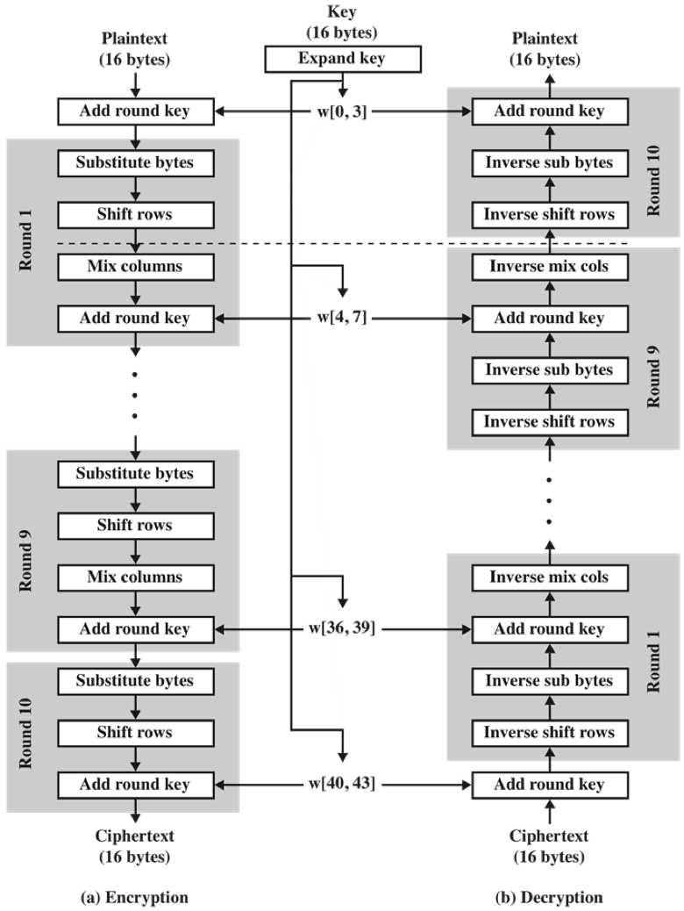
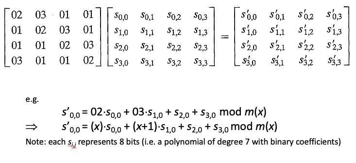
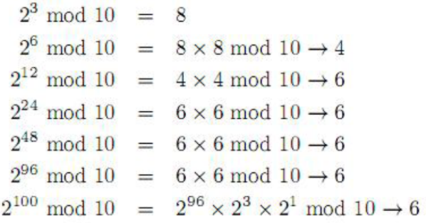
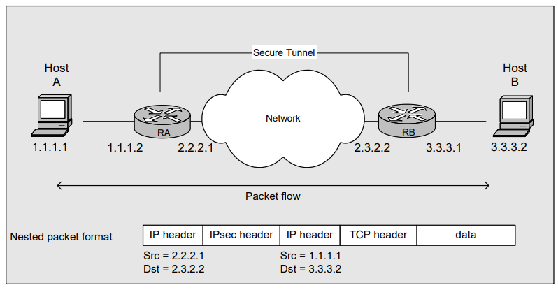
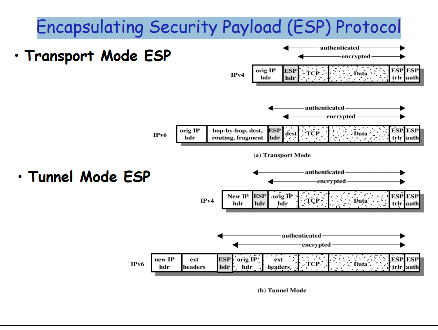
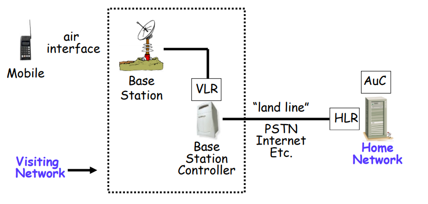
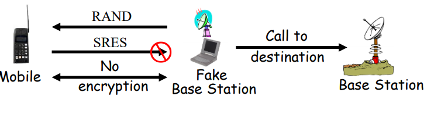

# CS4286: Internet Security & E-commerce Protocols

[TOC]

## Lecture 01: Admin & Introductory Security Concepts

### Intro

* Assessment: 
  * 30 course work = 20 (assignments * 3) + 10 (midterm)
  * 70 final

### Basic Concepts & Terminology

* What is Security: The security of a system, application, or protocol is always relative to (designed based on): 

  * A set of **desired properties**: what do we want to achieve (whether the property is valuable)?
  * An **adversary**(attackers) with specific capabilities: what can they do?
  * What security (service) do we need?
  * How powerful an attacker do we want to defend against?

* Why important

  * Is good security always secure?
  * We need to think: Appropriate? Strength? Cost?
  * Unconditionally VS. Computationally secure
    * **Unconditionally(theoretically)**: Infinite resource cannot break
    * **Computationally**: Available resource cannot break (RSA)
    * **Financially**: Not profitable to break

* How to know security or not
  * single module
  * system
  * Majority of problems in real life secure systems is not directly due to weak crypto –
    but rather crypto used in wrong way (without considering context) or non-crypto
    issues (mostly human) that weaken security.

* Information Security: 

  * Security is about the protection of assets.
  * Thus, **information security** is the basis for protecting our **information assets**

* Three broad classes of **protection measures**: 

  * **Prevention**:  prevent your assets from being damaged
  * **Detection**: detect when you assets have been damaged, by whom and how
  * **Reaction/Recovery**: recover your assets. or recover from the damage to your assets
  * Difference between prevention and detection: For example, we prevent the attacker from getting plaintext if we encrypt well but we cannot prevent modification during transmission (we can however detect it).

* Basic **Security Goals**: How can our information assets be compromised(危及)? => three **aspects** of information protection (CIA):

  * **Confidentiality(机密的)**: prevention of unauthorized **disclosure** of information. 
  * **Integrity(正确的)**: prevention of unauthorized **modification** of information.
  * **Availability(可靠性)**: prevention of unauthorized **withholding** of information or resources. (refute to give)
  * CIA are most basic security goals => but there are more than three services

* Threats

  * Relationships

    

    * Security is only desirable when there is a need to protect a system from a threat.
    * A security threat is a **possible means by which a security policy may be breached** (e.g. loss of integrity or confidentiality).
    * Countermeasures are **controls to protect against threats**.
    * Vulnerabilities are **weaknesses** in the system (and/or **countermeasures**).
    * An attack is a **realization** of a **threat** (**exploiting** a **vulnerability**).

  * threats can be classified as:

    * deliberate (e.g. hacker penetration);
    * accidental (e.g. a sensitive file being sent to the wrong address).

  * The associated threats which **CIA** are responsible for countering are:

    * **Exposure of data**: the threat that someone who is unauthorized can access the data.
    * **Tampering with data**: the threat that the data could be altered from what it should be.
    * **Denial of service**: the threat that the data or service is unavailable when it is required.
    * For the three threats which is accidental and which deliberate? All three can be both.

* Adversaries(not always third party or outsiders): 

  * People whose aim it is to circumvent your security are generally called adversaries.
    * Sometimes called intruders, but not all adversaries are external to the system (insider threats).
  * Adversaries act in two different ways:
    * **Passive adversaries** only attempt to get unauthorised access to information
    * **Active adversaries** take more direct action:
      * Unauthorized alteration
      * Unauthorized deletion
      * Unauthorised transmission
      * Falsification of origin of information
      * unauthorized prevention of access to information 
    * you should not memorize what active adversaries can do, rather just think anyone that is not passive is active (not just access is active)
    * Think: 
      * Someone reads your email – Active
      * Someone sends email to your friend pretending to be you – Passive
  * Here are some common categories of adversary in the literature:
    * Casual prying by nontechnical users - Bored people…
    * Snooping by insiders - Bored people with access to your system…
    * Determined attempts to make money - Criminals, organised crime
    * Commercial or military espionage - ‘Advanced Persistent Threats’
    * Hacktivists? - Unpredictable motivation and skill…

* Service & Mechanism

  

  * **Security Service**(High level security goal): A measure which can be put in place to address a threat(e.g. provision of confidentiality)
  * **Security Mechanism**(actual ways): A means to provide a service

* Services

  * Data Confidentiality and Integrity
    * Confidentiality: Protection against unauthorized disclosure of information. => focus on prevent in the three protection measures
      * What is information? Is it only data?
        - Is traffic flow confidentiality important? Lets say you encrypt the data but people can see when we sent it? - Decide what do you wish to protect and keep confidential.
        - Even if we make the ‘data’ confidential - we make the application layer payload confidential - that means the packet on the wire still has transport layer data (ports, sequences), network layer (destination address) and data link layer information.
        - Example, are encrypting routers in SWIFT networks (for secure financial messaging) – complete traffic confidentiality (cannot see destination) decrypt – look at network routing information, encrypt, send on.
    * Integrity: Integrity is protection against unauthorized modification of data => focus on detect, recover in the three protection measures, cannot prevent
      * includes corruption, deletion, addition and other modifications
  * Authentication
    * Entity authentication: Whether a specific person (message from which person)
      * Provides checking of a claimed identity at a point in time
      * Typically used at start of a connection.
      * Addresses masquerade(假扮) and replay threats
      * Come in person
    * Origin authentication: who did that (does not need provide entity authentication)
      * Provides verification of source of data
      * Does not protect against replay or delay
      * Signature of check, does not check the writer of the signature
  * Access Control: 
    * Provides protection against unauthorized use of resource, including:
      * use of a **communications** resource
      * **reading, writing or deletion** of an information resource,
      * **execution** of a processing resource.
    * Subject action resource -- Is this person allowed to perform this action on this
      resource.
  * Non-repudiation: no denial
    * **non-repudiation of origin**: cannot say not send
      * Most people talk about origin – and this is more common than you think. 
    * **non-repudiation of delivery**: cannot say not receive

* Service (Threats)

  * Confidentiality (data disclosure)
  * Integrity (data alteration)
  * Availability (DoS - deny of service)
  * Entity Authentication (masquerade)
  * Origin Authentication (forgery 伪造)
  * Non-repudiation (repudiation – it did not happen!)
  * Access Control (illegitimate access)

* Mechanisms: 

  * A security mechanism is a means to provide a service.
  * Can be divided into two classes:
    * Specific security mechanisms, used to provide **specific security services**, e.g. digital signature
      * An example of a specific mechanism is a digital signature scheme. It can be used to provide several different services – it can obviously be used to give a data integrity service, but it can also be used to provide an origin or entity authentication service even when data integrity is not required. Similarly there are other ways to provide a data integrity service which don’t require digital signatures (e.g. MACs or routing controls).
    * Pervasive security mechanisms, **not** specific to **particular** services, e.g. event detection, labelling.
      * An example of a pervasive mechanism is an event detection mechanism. It doesn’t actively provide any security service. (You can’t say that this data is transmitted confidentially because of the event detection mechanism.) However, it supports every security service by providing a way to detect compromises which may render specific security mechanism ineffective.

* Service (Mechanisms)

  * Confidentiality ( encryption)
  * Integrity (MAC/digital signature)
  * Availability (redundancy)
  * Entity Authentication (authentication protocol (PKI for e.g.) )
  * Origin Authentication(MAC/digital signature)
  * Non-repudiation (digital signature)
  * Access Control (Access control model)

* Mechanisms (Algorithm)

  * Algorithms are used to build mechanisms
  * Example of mechanisms/algorithms:
    * Encryption: DES/3DES/AES (modes) or RSA/ECC
      * CAST(Canada), MISTY1/Camellia (Japan), SEED (Korea)
    * MAC: CBC mode, HMAC
    * Digital Signature: RSA, DSA, ECC
    * Hash: SHA-3
    * Random number: True or Pseudorandom

### Standards

* Why standards? - They ensure any business offering products, services or processes is
  * **cost-effective and time efficient**: You do not have to develop the solution yourself – take time, take experts and this comes up with an ad-hoc solution that is likely to be as good.
  * **commercially viable** (可行的): customer feels more confident in your solution. The products appears more credible to the customer because our company is using best practice. Could open up a new market
  * **credible** (可信的):  ties into above.
  * **safe**: Because you are taking best practice into account, and using a solution developed by experts the chances are our solution is safer?
  * Interoperability (互操作性): Could tie into commercial viability – standards allow different entities to produce components that work together (without these entities having a relationship).
* How to use standards? 
  * Three common ways to use a standard
    * **Use as the basis for new design** (use the parts you need) - starting point of a new solution => risky but some standards are meant to be starting points
    * **Certification** is when a neutral third-party attests(证明) to a claim of compliance (合规) => Good but costs money and takes time
    * **Compliance** may be declared without recourse to third party certification
  * Most security standards do not require certification
    * Most of the security standards fall into one of two broad categories: they are either
      * standards which define **definite algorithms** (in which compliance can be easily checked and certification is somewhat of an expensive luxury) 
      * or they provide guidance on how to **produce a system or service** (in which case they are advice and certification is not really intended).
* Why not standards(disadvantages)
  * Consensus decisions imply **compromise**.
  * Documents can be **inconsistently implemented**.
  * Commercial pressure can lead to **partial implementation**.
  * Aggressive market strategies by companies who adapt or extend standards can undermine their usefulness.
* Categories of standards
  * International standards: The main function of these bodies is the production of ‘base standards’.
  * North American standards:  have become particularly important in security
  * Internet standards:  loose collaboration between government, industry and academia
    * Internet Standards are quite odd things. Why is it hard to produce reliable Internet
      standards?
      * Strangely - products tend to be interoperable – large companies works together, almost like a standards body – your product needs to work with theirs. Defacto standard –> interoperability.
      * Big problem – once a standard is being used it is used by everyone. Once again if there is a standard and something goes wrong with it is difficult to correct.
  * Company Standards:  also sometimes issue defacto standards for techniques that have been patented. 
    * Any reasons these would not be seen as standards? - As per previous definition:
      * Standard body?
      * Consensus?
      * Are the completely unbiased? 
* Standards bodies
  * **official** standards bodies: defining standards at worldwide or national level
  * **companies** who make standards: often with commercial interest – some good some bad, and some you have to use like payment card standards
  * Internet standards: which no on really looks after, simply technology that grows in usage, and once everyone uses it might be organized and published as a standard by IETS

## Tutorial 01

| Service               | Mechanism                      | Algorithm             | Threat              |
| --------------------- | ------------------------------ | --------------------- | ------------------- |
| Confidentiality       | Encryption                     | DES, AES, RSA ...     | Exposure of data    |
| Integrity             | MAC/Digital Signature          | HMAC/MAC CBC, RSA/DSA | Alternation of data |
| Availability          | Redundancy                     |                       | DoS                 |
| Entity Authentication | Authentication protocols (PKI) | RSA                   | masquerade          |
| Origin Authentication | MAC/Digital Signature          | HMAC/MAC CBC, RSA/DSA | forgery             |
| Access Control        | Access Control Model           |                       | illegitimate access |
| Non-repudiation       | Digital Signature              | RSA/DSA               | repudiation         |


--------------------

## Lecture02: Symmetric Key Encryption

### Introduction

* Encryption provides confidentiality

* Symmetric key encryption Model: 

  * Sender and recipient uses the same key

  * A **symmetric-key cipher or cryptosystem** is used for **encrypting/decrypting** a **plaintext/ciphertext**

    * Plaintext: Message need to be encrypted
    * Ciphertext: Message after encryption
    * Encrypt function: $C=E_k (P)$ Decrypt function: $P = D_k (C) = E_k^{-1}(C)$ 

  * Attackers’ target is either get the **key or the plaintext** from the observed plaintext

    

    

* Symmetric key crypto can also be applied for other purpose, we focus on the encryption mechanisms this chapter

* Crytanalysis

  * Assumption (Kerckhoffs Principle)
    * Public Known: System, Crypto algorithm
    * Secret: Only key
  * Objective of an attacker
    * Identify secret key used to encrypt a ciphertext
    * (Or) recover the plaintext without the secret key
    * In modern cryptography we are mostly concerned with the key being found – more so than the message – many times an attacker can guess the basic messages (e.g. repetitive network commands)
  * Three types
    * Ciphertext only attack
    * Known plaintext attack (know the pair)
    * Chosen plaintext attack (can choose the pair)
    * Chosen ciphertext attack

### Classical Cryptography - Substitution Cipher

* Caesar Cipher: 
  * Key: $n$ 
  * Encryption: Each letter in plaintext is replaced by the letter shifted by $n$ places in the alphabet  
  * Decryption: Each letter in ciphertext is replaced by the letter shifted by $-n$ places in the alphabet
  * $25$ possible cipher alphabets, easy to try
* Other ways to generate key: 
  * Take your favorite sentence, delete the repeat characters, and add the not used characters at the end of the key
  * Key: sentence in this case
  * Key space: Less predictable
* Simple Substitution: 
  * Key: Random permutation of the alphabetic
  * Key space: $26!$
  * Time for brute force attack: More than 4000 years
  * Frequency Analysis: 
    * One to one match between plaintext and ciphertext preserves the statistics
    * Also notice pairs of letters, one letter word, two letter word frequency, n-grams
    * Also can guess the word or phrase will be in the message
    * Check whether it would be a Caesar cipher
  * Frequency analysis can be beaten, however there are some way to beat these methods
* Polyalphabeic substituion: change the state of substituion table for each characters
  * Same character might be encrypted to different ciphertext
  * Different character might be encrypted to same ciphertext
* Vigenere Cipher
  * Use a keyword, and use the each character as the first one of a Caesar cipher. For each character, use next Caesar cipher. 
  * Weakness: 
    - If we know the length of the codeword, we can break each of the individual Caesar cipher 	independently
    - Repeated words has the chance to be encrypted to the same ciphertext => can be used to determine the length of the key
* Enigma Machine
  * Need same initial state as the sender to break the cipher
  * Configured rotors, and plug board on front. Pressing keys would light a lamp showing the corresponding plaintext (or ciphertext when decrypting).
  * Key space: $2^{67}$ approx
  * Weekness: 
    * Plaintext cannot be encrypt to itself
    * Use known plaintext to eliminate states
    * State then calculated through search

### One-time Pad Encryption

* Limitation of substituion cypher: Can only encrypt character based language

* One-time pad encryption: Use ASCII to represent the text

  * Pad(key) must be random, **used only once**
  * **Pad(key) has the same size as message**

  $$
  E(plaintext, key) = plaintext \oplus key = ciphertext \\
  D(ciphertext, key) = ciphertext \oplus key = plaintext \\
  $$

* Security

  * Advantage
    * **Theoretically** secure since If given the ciphertext there is no way we can know for sure the message. Any ciphertext can decrypt to any possible plaintext
  * Weakness: (Key management is not practical)
    * Need the length of the key is the same as the plaintext
    * Each time we send a message, need a new pad, otherwise if $C_1 = P_1 \oplus K,C_2 = P_2 \oplus K$, $C_1 \oplus C_2 = P_1 \oplus P_2$, we can do some further analysis on this result ([example](<https://crypto.stackexchange.com/questions/59/taking-advantage-of-one-time-pad-key-reuse>))
    * We need same length of the key as the plaintext
    * Still result in same ciphertext with same plaintext

### Stream Ciphers

* Current crypto systems: 

  

* Structure of stream cipher: 

  

  * Deterministic algorithm a.k.a (also known as) **Keystream generator**
  * Cipher Sequence a.k.a. **Keystream**
  * $Key$ => $Keysteam$ => $Keystream \oplus plaintext$ 
  * Property of keystream generator
    * The function has no randomness in future states - reproducable and predictable, but this only holds for someone has the key => **if you know the key the algorithm is deterministic** 
    * Keystream generator is the same for encryption and decryption as well as the encryption/decryption function $E_k = D_k$ 
    * Later there will be some scheme with different encrypt and decryption function$E_k = D_k^{-1}$ 
  * Important issue: Sender and receiver synchronization

* Stream Ciphers:

  * Secret key length: 128 bits, 256 bits
  * Maximum plaintext length: usually can be arbitrarily long
  * Security & Advantage： 
    * Given a “long” segment of  key stream (e.g. $2^{40}\ bits$), the secret key cannot be derived AND the subsequent segment of the keystream (next keystream) cannot be deduced
    * Do not require the size of the plaintext
    * Computation is fast
    * Keystream function does not need to be reversible…
  * Disadvantage: 
    * Keystream cannot be reused, same plaintext/keystream always yields same ciphertext (independent of previous plaintext).
    * If we now the plaintext, we can XOR the plaintext with the ciphertext, then we have the keystream. Then we XOR it own message. 
    * As we use XOR for encryption, **we should also provide integrity by using other techniques**
      * Consider if we send a value 0010 encrypted with keystream 1010 (C= 0010 XOR 1010 = 1000) Without knowing the plaintext (maybe just the format) an attacker can modify the message by flipping a bit C’=0000, then means P = 0000 XOR 1010 = 1010 and the value is bigger.
      * Alternative if the attacker knows the plaintext he can go KS= C XOR P and then create C’ = KS XOR M (his message). The reciever will then decrypt to M
      * If we are to use stream ciphers in practice we need additional security services – especially with regards to integrity/data origin authentication.

* RC4 (optional): 

  * An good (famous) example of stream cipher

  * But usually we use block cipher to generate key stream (`CFB`, `OFB`) 

    * Notice that in reality, these two modes are blocker cipher. 

  * Steps(no need to know the details): 

    ```pseudocode
    // Setup:
    	byte key[N];    // secret key (e.g. N = 16, i.e. 128-bit key)
    	byte K[256];   // keying material
    	byte S[256];   // internal states
    	
    // Initialization:
    		for i = 0 to 255
    			S[i] = i
    			K[i] = key[i (mod N)]
    		j = 0
    		for i = 0 to 255
    			j = (j + S[i] + K[i]) mod 256
    			swap(S[i], S[j])
    		i = j = 0
    		// S[] is the permutation of 0,1,...,255
    // Select
    	for i = 0 to 255
    		i = (i + 1) mod 256
    		j = (j + S[i]) mod 256
    		swap(S[i], S[j])
    		t = (S[i] + S[j]) mod 256
    		KeyStreamByteSelected = S[t]
    
    ```

    * Set up: `byte key[N], K[256], S[256]` (key array, says 128 bits key with N=16, key material(`K[i]=key[i(mod N)]`), and internal states)
    * Initialization: Initialize the `S` such that the internal state dependent to the `key` 
    * Swap table element of $S$ and select a byte

  * **Note:** Some research results show that the first 256 bytes must be discarded, otherwise attacker may be able to recover the key.

  * This illustrate the benefit of stream cipher: if we need a byte of keystream then we just iterate once more… We can make as much keystream as we have plaintext….need to encrypt another byte, make another byte of keystream.

### Block Ciphers

* **The main difference between block cipher and stream cipher**

  * **Usage of key**:
    * Stream cipher uses a function to generate key stream with flexible length and XOR with plaintext
    * Block cipher takes a plaintext input of fixed size, and generate ciphertext with fixed size. Can reuse the key
  * **Crypto function**: 
    * Stream cipher: Do not need to be reversible. Simply generate random key stream from key. Produce a bit or a bypte at a time
    * Block cipher: Need to be reversible. Actually perform on the plaintext (permutation/substitution etc.) Produce one block at a time
  * **Plaintext length**:  
    * Stream cipher: Not fixed
    * Block cipher: fixed
  * **Computation**
    * Stream cipher: Says to be faster
    * Block cipher: slower
  * **Security**
    * Stream cipher: Lower
    * Block cipher: Higher

* **Properties of good block cipher algorithms**

  * Confusion (key - ciphertext dependency)
    * A small change in the **key** should be able to change 50% of the ciphertext
    * An attacker using a bruteforce attack shouldn’t receive any signs that he is **getting closer** to the correct key
  * Diffusion (plaintext - ciphertext dependency)
    * A small change in the **plaintext** should cause 50% of the ciphertext to change
    * Hide any statistical relation between the plaintext and the ciphertext
  * Completion (key - ciphertext fully dependency)
    * Each bit of the ciphertext depends on each bit of the key (flip a bit if it always change the same 50% of bits)
    * The attacker won’t be able to find **valid parts of the key using divide and conquer methods**

* Block cipher

  * Structure: Takes a *block* of **plaintext** and a **secret key** produce a *block* of **ciphertext** (block means fixed size). A series of blocks share the same key

    

  * Typical block size: `64 bits` (DES), `128= 64*2 bits`(AES), `192 = 64*3 bits`, `256 = 64*4 bits`

  * Key sizes: `56 bits`(DES), `128/192/256 bits`(AES)

    * **Notice that key size is different with block size**

  * Popular block ciphers: **DES(b: 64, k: 56), 3DES(b: 64, k: 56*2), DESX(b: 64, k: 64\*2+56), AES(b: 128 k: 128/192/256)**, Twofish, Serpent

  * Advantage

    * If we use the right mode of operation ciphertext depends on prior plaintext even if key remains the same (e.g. in CBC mode just change first block of plaintext)

  * Disadvantage

    * Needs to be reversible (PT> CT, CT>PT)
    * Needs padding to block size

* DES (Data Encryption Standard): Should know the basic operation, block size, key size, and basic architecture

  * Structure

    * **Block size: 64-bits**

    * **Key size: 56-bits**

    * Basic operation and architecture: 

      * Intial Permutation

      * iterating **round function** **16 times**, the round function needs **a round key** $K_i$ (**for DES the function is also called Feistel Transformation**)
        $$
        round\ function: rf(K_i, rf_{i-1}) = R(rf_{i-1})\ |\ (L(rf_{i-1}) \oplus f(R(rf_{i-1}), key))
        $$

      * Final Permutation

    

  * Feistel Structure (optional): We only deal with half (left half in the example) the data during one round
    $$
    L_i = R_{i-1}, R_i = L_{i-1} \oplus f(L_i, key) \\
    $$
    

    * The function $f$ can be one way instead of reversible, because we can compute $f$ when decryption => Just reverse the order to use round key
      $$
      R_{i-1} = L_i, L_{i-1} = R_i \oplus f(R_{i-1}, key_i) = R_i \oplus f(L_i, key_i)
      $$

      * **Should know**: In DES, the round function $f$ is an expansion, substitution, and permutation

        

        * Subsitution: Mapping each 6-bits to 4-bits
        * P box: one fixed way to shuffle each bit 
        * Key is compressed from `64bits` to `48-bits`, while half of the message is expanded from `32-bits` to `48-bits` 

    * How many rounds should a Feistel cipher have: Generally you need more rounds, because you are only working on half the block at a time. Key expansion – need out one 56 bit key for 16 rounds

  * Security: 

    * Depends solely on the internals of $f$ 
    * More than thirty years of intense analysis has revealed no “back door”
    * The most effective attack today against DES is still the exhaustive key search (a.k.a. bruteforce attack)

* Bruteforce attack | Exhaustive key search

  * An algorithm is secure when the easiest way of attacking it is by bruteforce attack.
    * n-bits key => $2^n$ space
    * An average of half the combinations should be tried in order to make the probability to find the key larger than $50\%$ is $2^{n-1}$ 
    * `128-bits` key is recommended until 2030 
  * Known-Plaintext attack: Given plaintext $x$ and corresponding ciphertext $y$, find the key $k$ such that $E(k,x) = y$ (Notice that there might be more than one such key $k$) 
  * Known-plaintext attack by bruteforce attack is now viable against DES

* 3DES (Triple DES) and DESX

  * We try to enlarge the size of the key to prevent the exhaustive search. However, it is difficult to change the size of key directly and reuse the algorithm (some mathmetical issues), and it is expensive to create a new algorithm

  * Triple DES

    * The reason of decrypt in the middle: if we set $K_1 = K_2$, 3DES can also be changed to the elder version. 
    * By some advance attack, the space is reduced from 112 bits theoratically to 80 bits

    

  * DESX

    

    * By some advance attack, the space is reduced from 184 bits theoratically to 112 bits
    * Notice that the size of $K_1, K_3$ is 64 bits (same as the block), while size of $K_2$ is 56 bits

* AES (Advanced Encryption Standard) Should know the basic operation, block size, key size, and basic architecture

  * Iterated block cipher **not using Feistel round function**, also faster than DES

  * Block size: 128 bits, Key size: 128/192/256 bits, Round(depends on key size): 10/12/14 

  * Steps: Initial trnasformation => four operations(SPN) \* Rounds number=>  Ciphertext

    

    * The intial transformation also use the add round key operation
    * Final round only 3 operation (no mix columns)

  * [Substitution-Permutation Network (SPN)](<https://simple.wikipedia.org/wiki/Substitution-permutation_network>) : S-box + P-box (actually the first three operations)

  * Each round has 4 operations: Each one is reversible (details are optional)

    

    * **ByteSub**: Use an S-box to perform a byte-by-byte substitution of the data block

      

      * Each individual byte in a data block is mapped into a new byte using a 16x16 matrix of byte values
      * The leftmost 4 bits of a data block byte are used as a row value
      * The rightmost 4 bits of a data block byte are used as a column value

    * **ShiftRow**: a permutation

      

      * The first row of the data block is not altered
      * The second row: 1-byte circular left shift
      * The third row: 2-byte circular left shift
      * The fourth row: 3-byte circular left shift

    * **MixColumn**: a substituion that makes use of arithmetic over GF($2^8$)

      

      * Operate on each column individually

      * Each byte of a column is mapped into a new value that is a function of all the four bytes in that column

      * **Notice that the addition and multiplication in the matrix is redefined**

      * Matrix multiplication over $GF(2^8)$ with irreducible polynomial $m(x) = x^8+x^4+x^3+x^1$

      * GF(Galois Field or Finite Field):

        * A field is a set in which we can do addition, subtraction, multiplication, and division without leaving the set (converged to this set)

        * for function $f(x) = a_{n-1}x^{n-1}+ a_{n-2}x^{n-2} + … + a_1x + a_0$ where $a_i$ can only be 0 or 1, the state of the function is $2^n$

        * Combine these functions into a set, we have $GF(2^n)$ which is the set of the functions with cardinality $2^n$ 

        * Addition: Can be represented as bitwise XOR, $x^2 +x^2 = 0$

        * Multiplication: 
          $$
          (x^2 + 1)*(x^2 + x + 1)\ mod\ (x^3 + x + 1)\\
          = (x^4 + x^3 + x^2) + (x^2 + x + 1)\  mod\ (x^3 + x + 1) \\
           = x^4 + x^3 + x + 1\ mod\ (x^3 + x + 1) \\
          = x^4+x^2+x+x^2+x+x^3+x+1\ mod\ (x^3+x+1) \\
          = (x+1)(x^3+x+1) + x^2+x\ mod\ (x^3+x+1) \\
           = x^2+x
          $$
          

    * **AddRoundKey**: a simple bitwise XOR of the current data block with a round key

  * Key expansion / Key scheduling (optional)

    

    * 128 bits => 10 rounds, 192 bits => 12 rounds, 256 bits => 14 rounds (The initial transformation needs one more add round key)
    * Each round key is 128 bits long (same as the block size) 
    * Total size(128 key size): 11 \* 128 bits= 11 \* 16 bytes = 176 bytes

* Key spaces

  * DES: $2^{56}$
  * AES: $2^{128}/2^{192}/2^{256}$
  * Subsitution: $26!$
  * One time pad: $2^{keysize}$ 
  * RC4: $2^{40}\ to\ 2^{2048}$ 

### Encryption Modes

* Multiple blocks: A block cipher only encrypts a fixed block – not like a steam cipher that just keeps generating keystream. So we need ways to **encrypt multiple block** if the message is larger than the block size. We also need a **padding** method if out message is not a multiple of the block size.
  * New key for each block: as bad as one time pad (or worse)
  * Encrypt each block independently use the same key: ECB
  * Make encryption depends on the previous block: CBC, CFB
  * Make encryption depends on changed state vector: CTR, OFB

* Notations: 

  * Encrypt/decrypt functions: $C=E(K, P), P = D(K,C)$
  * Given plaintext $P = P_0, P_1, …,P_m,…$ (in blocks)

* Properties of ‘good’ mode

  * **Message dependence** of ciphertext (CBC, CFB are better than ECB, OFB, and CTR)
  * Limited **error propagation** (ECB, CTR, OFB with one block error are better than CBC, CFB with two blocks error)
  * Works without **block synchronisation**: If a block of the message goes missing, the impact on subsequent messages should be limited. 
    * ECB: Only lost one block
    * CBC and CFB: Affect two blocks, one lost one error
    * OFB, CTR: Affect all following blocks. 
  * **Optimise use of decrypt/encrypt**: reuse encryption function for decryption (CTR, OFB, CFB are better than ECB and CBC)
  * **Reduce padding**: OFB, CFB, and CTR do not need paddings

* Type of transmission errors: 

  * Transmission errors are errors that occur in the communication channel (1 => 0 or 0 => 1)
  * Transmission losses are bits that get lost (they never arrive) in the communication channel. 

* Error Propagation: A decryption process involves **error propagation** if a ciphertext input that has one incorrect bit produces a plaintext output that has more than one incorrect bit.

  * To what extent does error propagation occur in basic stream and block ciphers? 
    * In a basic stream ciphers – errors in ciphertext map directly to errors in plaintext. This is due to the XOR used. Think – one bit of C XOR one bit of corresponding KS is P, then C’ XOR the same KS is P’ (where if X=1 then X’=0, if X=0 then X’=1)
  * Does error propagation have anything to with error prevention or error correction? 
    * No, we **cannot prevent** errors as such. We **can however limit** the effect is has on the received message.
    * A little bit connected – if we minimise the errors is might be possible to correct the received message. It is nearly impossible to recover from a major amount of errors.
  * Is error propagation a good thing?
    * No, if an error occurs early in the message that means the entire message is wrong.

* ECB Mode (Electronic Code Book)

  * Method: Encrypt each plaintext blocks independently. 
    $$
    C_0 = E(K, P_0) \ \ \ \ P_0 = D(K, C_0) \\
    C_1 = E(K, P_1) \ \ \ \ P_1 = D(K, C_1) \\
    ... \\
    C_n = E(K, P_n) \ \ \ \ P_n = D(K, C_n) \\
    $$
    

  * ECB Cut and Paste Attack (in the integrity perspective): Since all blocks are encrypted independently, we can in theory delete some of the ciphertext blocks or simply change the order of the blocks without knowing the key. For example: 

    * Suppose plaintext is `Alice digs Bob. Trudy digs Tom.`

    * Assuming 64-bit blocks and 8-bit ASCII:

      ```
      P0 = “Alice di”, P1 = “gs Bob. ”,
      P2 = “Trudy di”, P3 = “gs Tom. ”
      ```

    * Ciphertext: `C0,C1,C2,C3`

    * Trudy cuts and pastes: `C0,C3,C2,C1`

    * Decrypts as`Alice digs Tom. Trudy digs Bob.`

  * Advantage:

    * Very simple
    * Allows for parallel encryptions of the blocks of a plaintext
    * Can tolerate the loss or damage of a block
    * Allows parallel decryption

  * Weakness (in the confidentiality perspective): 

    * **Same plaintext results in the same ciphertext => make it possible for literature analysis as well as exploit some contextual information**
    * If the plaintext are either `yes` or `no`, we can find out whether the two ciphertext are the same to know the plaintext. 
    * This is now like a very very large substitution cipher! (with $2^n$ possible permutations where $n$ is blocksize)….
    * Traffic analysis – can see the same messages being sent. What if message repeat?
    * A picture encrypted in ECB mode appears to still expose most of the data
    * We can modify the message by changing the order of the message

  * Property

    * Block dependency: No (Bad)
    * Error propagation: Only one bits error in plaintext for one bits error in cipher text (good)
    * Block synchronization: One block loss of cipher text causes one block loss of plaintext (good) Does not need synchronization (do not need to count how many blocks received)
    * Optimise use of decrypt/encrypt: Not
    * Reduce padding: Not

* CBC Mode (Cipher Block Chaining)

  * Method: Chain blocks together, each output is dependent to the plaintext of this block as well as the ciphertext of previous block. The first block is dependent to the intiali vector (IV). IV is random but public. 

    * In this way, same plaintext blocks result in different ciphertext blocks. 
    * Change the IV each time, otherwise the result will be the same for the same plaintext encrypting twice. (Same M, IV, Key will give same ciphertext)
    * If we change $P_0$, all the following blocks will be changed. => all $C$ blocks are dependent on all previous $P$ blocks. 

    $$
    C_0 = E(K, P_0 \oplus IV) \ \ \ \ P_0 = D(K, C_0) \oplus IV \\
    C_1 = E(K, P_1 \oplus C_0) \ \ \ \ P_1 = D(K, C_1) \oplus C_0 \\
    ... \\
    C_n = E(K, P_n \oplus C_{n-1}) \ \ \ \ P_n = D(K, C_n) \oplus C_{n-1} \\
    $$

    

  * Advantage: 

    * Doesn’t show patterns in the plaintext
    * Is the most common mode
    * Is fast and relatively simple

  * Disadvantage

    * Requires the encryption of blocks to be done sequentially, which is not efficient => non-parallel encryption
    * Bad error propagation
    * Did not reuse encryption algorithm

  * Property

    - Block dependency: Yes
    - Error propagation: One block error in the current block and one bit error for the next block for one bits error in cipher text (bad)
    - Block synchronization: One block loss of cipher text causes current block loss and next block error. Does not need synchronization (do not need to count how many blocks received)
    - Optimize use of decrypt/encrypt: Not
    - Reduce padding: Not

* CTR Mode (Counter Mode)

  * Method: **Use block cipher like a stream cipher**, use the block cipher to generate a key stream and `XOR` to the ciphertext
    $$
    C_0 = P_0 \oplus E(K, IV) \ \ \ \ P_0 = C_0 \oplus E(K, IV)\\
    C_1 = P_1 \oplus E(K, IV+1) \ \ \ \ P_1 = C_1 \oplus E(K, IV+1)\\
    ... \\
    C_n = P_n \oplus E(K, IV+n) \ \ \ \ P_n = C_n \oplus E(K, IV+n)\\
    $$
    

    * Compare to CBC: CTR is good for random access (both read and write), while CBC is good for random read only, but not write.
    * Advantage
      * Efficiency: Allows parallel encryption and decryption in h/w or s/w, Preprocess in advance of need, good for bursty high speed links
      * random access to encrypted data blocks
      * provable security (good as other modes)
    * Disadvantage: but must ensure never reuse key/counter values, otherwise could break
    * Use case: High speed network encryption
      * Good if you store encrypted data. Consider that the IV is also the index of the stored ciphertext block. To read the block’s plaintext you do$ E(IV_i, K)$ and XOR it to stored $C$. If you edit the block you can then simple XOR the new plaintext the  $E(IV_i, K)$  and store it.
      * Can you do the same with CBC?
        * Reading is easy, you take cipher block $C_{i-1}$ and use it to decrypt $C_i$, now you can read the data. 
        * However, what happens now if you change the plaintext? You can encrypt $C_i$ again using $C_{i-1}$. Is that good enough? No! Now you need to **decrypt and encrypt all the remaining block** as the change in $C_i$ means all the rest of the blocks will change.

  * Property

    * Block dependency: No
    * Error propagation: Only one bits
    * Need strong synchronization, need record how many blocks have encountered 
    * Optimize use of decrypt/encrypt: Yes
    * Reduce padding: Yes

* CFB Mode (Cipher FeedBack)

  * Method: Also use block cipher like stream cipher. Use the previous ciphertext instead of countered $IV$ to encrypt to a key stream
    $$
    C_0 = P_0 \oplus E(K, IV) \ \ \ \ P_0 = C_0 \oplus E(K, IV)\\
    C_1 = P_1 \oplus E(K, C_0) \ \ \ \ P_1 = C_1 \oplus E(K, C_0)\\
    ... \\
    C_n = P_n \oplus E(K, C_{n-1}) \ \ \ \ P_n = C_n \oplus E(K, C_{n-1})\\
    $$
    

    * Compare to CBC: Change the order of encryption and `XOR` operation

  * Standard allows any nmber of bit of ciphertext will be used in next block, but normally we use all bits

  * Advantage/Disadvantage

      * appropriate when data arrives in bits/bytes
      * most common stream mode 
      * note that the block cipher is used in encryption mode at both ends 
      * errors propogate for several blocks after the error

    * Property

      - Block dependency: Yes 
      - Error propagation: One bit error for current block, one block error for next block
      - Loss one block result in current block loss and next block error
      - Optimise use of decrypt/encrypt: Yes
      - Reduce padding: Yes

* OFB Mode (Output FeedBack)

  * Method: Message is treated as a stream of bits, output of cipher is added(XOR) to message, output(of encryption) is then feedback, feedback is independent of message (depedent only to $IV$)
    $$
    O_i = E(K, O_{i-1}) \\
    C_i = P_i \oplus O_i \\
    O_{-1} = IV
    $$
    

  * Use case: Stream encryption on noisy channels

  * Advantage/Disadvantage

    * Need an IV which is unique for each use (reuse of IV can make it possible to recover the outputs by XOR)
    * Bit error do not propagate
    * More vulnerable to message stream modification

  * Property

    - Block dependency: No
    - Error propagation: One bit error for current block
    - Loss one block result in all following blocks error
    - Optimize use of decrypt/encrypt: Yes
    - Reduce padding: Yes

* Summary

  

---------------

### Supplementary Materials

* How to know a cipher is good
  * Keysize: > 128
  * Public: Security cannot come from obscurity (Kerkhoffs principle) 
  * Standard: Public old algorithm have not been broken
  * Mode of operation: Of the basic modes CBC is considered good, while ECB is not good

------------------------------

## Lecture03: Basic Number Theory & CRT & Euler Function

### Basic Number Theory

* Divisors: 

  * For two integers $a$ and non-zero $b$
  * $b$ divides $a$ if there exists some integer $m$ such that $a=m*b$ 
  * Notation: $b|a$ 
  * $b$ is a divisor of $a$ 

* Congruence: 

  * $a$ is congruent to $b$ modulo $n$ if $n|a-b$ 
  * Notation $a \equiv b\ (mod\ n)$ 

* Modular Arithmetic: 

  * $a\ mod\ n = r$ then $r$ is the remainder when $a$ is divided by a natural number $n$ (we usually find the minimum positive number of $r$) 
    $$
    a = floor(a/n)*n + r
    $$

  * Addition / Subtraction: $(x+y)\ mod\ n = ((x\ mod\ n)+(y\ mod\ n))\ mod\ n$

  * Multiplication: $(xy)\ mod\ n = (x\ mod\ n)(y\ mod\ n)\ mod\ n$   

    * proof: 
      $$
      x=k_1n+b_1, y = k_2n+b_2 (k_1, k_2, b_1, b_2\ \in \mathbb N^*)\\ 
      (xy)\ mod\ n = (k_1n+b_1)(k_2n+b_2)\ mod\ n\\
      =(k_1k_2n^2 + (k_1b_2+k_2b_1)n + b_1b_2)\ mod\ n \\
      =b_1b_2 \\
      (x\ mod\ n)(y\ mod\ n) = ((k_1n+b_1)\ mod\ n)((k_2n+b_2)\ mod\ n) \\
      =b_1b_2
      $$

    * $x^y\ mod\ n = (x\ mod\ n)^y\ mod\ n$ 

    * Example: find the last digit of $2^{100}$ in decimal: 

      

  * Note that if $ac \equiv bc (mod\ n)$ we can get $a \equiv b(mod\ n)$ only when $gcd(n,c) = 1$, or generally: 
    $$
    a \equiv b (mod\ {n \over gcd(c,n)})
    $$

* Greatest Common Divisor(GCD)

  * Definition: The largest divisor shared by a given pair of integers

  * Coprime: Two integers $x, y$ are coprime(relatively prime) iff $gcd(x,y)=1$

  * Euclidean’s Algorithm: If $a = qb + r$ for some integer $q$ and $r$, then:
    $$
    gcd(a,b)=gcd(r,b) = gcd(a\ mod\ b, b)
    $$

    * proof: 
      $$
      r = a\ mod\ b \\
      r = a-qb \\
      {r\over d} = {a \over d} - {qb \over d} = m \\(where\ d\ is\ a\ common\ divisor\ of\ a\ and\ b => m \in \mathbb N^*)\\
      m\ is\ a\ divisor\ of\ r
      $$

    * code: 

      ```c++
      int gcd(int a, int b) 
      { 
          // Everything divides 0  
          if (a == 0) 
             return b; 
          if (b == 0) 
             return a; 
         
          // base case 
          if (a == b) 
              return a; 
         
          // a is greater 
          if (a > b) 
              return gcd(a%b, b); 
          return gcd(a, b%a); 
      } 
      ```

  * Extended Euclidean’s Algorithm: 

    * problem: Solve the equation $ax+by=gcd(a,b)$

      * Always keep the first parameter of $gcd$ to be the larger one
      * The equation always has a solution

    * Base case: $b=0$, that means the previous $gcd(a,b)$ satisfies $a\%b = 0$ , and $b$ becomes current $a$, then $a$ itself is $gcd$ => $gcd*1+0 = gcd$ 

    * Other cases: $b \neq 0$: according to the Euclidean’s Algorithm $gcd(a,b)=gcd(b, a\ mod\ b)$, assume we can represent $gcd(b, a\ mod\ b) = gcd(b,r) = bx^\prime+ry^\prime$ 
      $$
      ax + by = gcd(a, b), a = bq +r, r = a - floor({a \over b})b\\
      gcd(b, a\ mod\ b) = gcd(b,r)=bx^\prime + ry^\prime=bx^\prime+(a - floor({a \over b})b)y^\prime \\
      = bx^\prime+ay^\prime - floor({a \over b})by^\prime \\
      = ay^\prime + b(x^\prime - floor({a \over b})y^\prime) \\
      gcd(a,b) = gcd(b,r) \\
      x = y^\prime, y= x^\prime - floor({a \over b})y^\prime
      $$

    * code:

      * C++

      ```c++
      int exGcd(int a,int b,int &x,int &y)
      {
          if(b==0)
          {
              x=1;y=0;
              return a;
          }
          int r=exGcd(b,a%b,x,y);
          int t=x;x=y;y=t-a/b*y;
          return r;
      }
      ```

      * python

        ```python
        import math
        def exGcd(a, b):
            if b==0:
                return (a, 1, 0)
            if a < b:
                return exGcd(b, a)
            print("euc: %d = %d*%d+%d"%(a, b, math.floor(a/b), a%b))
            (r, x, y) = exGcd(b, a%b)
            print("eeuc: 1 = (%d)(%d)+(%d)(%d)"%(b, x, a%b, y))
            return (r, y, x - math.floor(a/b)*y)
        
        a = 911
        b = 999
        (r,x,y) = exGcd(a, b)
        print("eeuc: 1 = (%d)(%d)+(%d)(%d)"%(a if a>b else b, x, b if a>b else a, y))
        ```

  * Least Common Multiple (LCM): 
    $$
    lcm(x,y) \geq max(x,y)\ for\ any\ x,y \\
    lcm(x,y) \leq xy \\
    lcm(x,y) = {xy \over gcd(x,y)}
    $$

* Modular Inverse: 

  * Definition: $b^{-1}$ is called a inverse of $b$ iff
    $$
    bb^{-1} \equiv 1 (mod\ n)
    $$

  * The inverse doesn’t always exist (e.g. $2x \equiv 1 (mod\ 4)$)

  * Inverse exists only if
    $$
    gcd(b,n)=1
    $$

    * Proof: 

      * When $gcd=1$
        $$
        bs + nt = gcd(b,n) = 1 \\
        (bs + nt)\ mod\ n=bs\ mod\ n=1\\
        s = b^{-1}
        $$
        

        * $s,t$ are integers, $gcd$ is less than or equal to minimum of $b$ and $n$, so $s$ and $t$ must have one negative number (otherwise, the value of $gcd$ will be larger than either $b$ or $n$, which is a contradiction)

      * If $gcd$ is not 1, the minus(difference) between multiple of  $b$ and $n$ will be multiple of $gcd(b,n)$: 

    $$
    Assume\ b = gcd(b,n)*k_1, n = gcd(b,n)*k_2 \\
    bs + nt = k_1s*gcd(b,n) + k_2t*gcd(b,n) \\
    =gcd(b,n)*(k_1s+k_2t)
    $$


### Chinese Reminder Theorem (CRT)

* Problem: Find the value of $x$ such that: 
  $$
  \begin{cases}
  x \equiv a_1\ (mod\ n_1) \\
  x \equiv a_2\ (mod\ n_2) \\
  \vdots \\
  x \equiv a_k\ (mod\ n_k) \\
  \end{cases}
  $$


### Euler Function and Euler Theorem

* Definition: Euler Function $\phi$ is defined as:
  $$
  \phi(n) = |\{x \in (\mathbb N^* \cap [1,n-1]) \ |\ gcd(x,n)=1\}|\ where\ (n \in (\mathbb N^*\cap[1, +\infty))
  $$

  * The number of positive integers less than $n$ such that $n$ and the integers are coprime.  

  * Denote the set: 
    $$
    Z_n =\{x \in (\mathbb N^* \cap [1,n-1]) \ |\ gcd(x,n)=1\}\ where\ (n \in (\mathbb N^*\cap[1, +\infty)) \\
    |Z_n| = \phi(n)
    $$

* The value of Euler Function: 

  * For prime number $p$: 
    $$
    \phi(p) = p-1
    $$

  * For prime number $p$ , $q$: 
    $$
    \phi(pq) = (pq - 1) - (p - 1) - (q - 1) = pq - p - q + 1 = (p-1)(q-1)
    $$

    * proof: 
      $$
      gcd(p, q) = 1 \\
      Z_{pq} = \{1, 2,...,pq -1\} - \{p, 2p, ..., (q-1)p\} - \{q, 2q, ..., (p-1)q\} \\
      |Z_{pq}| = (pq - 1) - (p - 1) - (q - 1)
      $$

  * For prime number $p$ and a positive integer $k$: 
    $$
    \phi(p^k) = p^k - p^{k-1} = p^k(1-{1 \over p})
    $$

      * proof: 

          * $p^k$ is not calculated in the set, $p^k-p^{k-1}$ is the last multiple of $p$ 

    $$
    Z_{p^k} = \{1, 2,..., p^k-1\} - \{p, 2p,...,(p^{k-1}-1)p\}\\
    |Z_{p^k}| =(p^k-1)-(p^{k-1}-1)
    $$

  * For positive integer $p$, $q$, $gcd(p,q) = 1$
    $$
    \phi(pq) = \phi(p)*\phi(q) \\
    $$

    - proof: we only need to prove there is a double mapping from cartesian product of $Z_p$ and $Z_q$ to $Z_{pq}$ 

      - From left to right: prove $a\in Z_p, b \in Z_q \longrightarrow (aq+bp)\ mod\ (pq) \in Z_{pq}$

        - Prove the correspondence: Euclidean Algorithm is used in the last two steps

        $$
        gcd(a,p) = gcd(b,q) = gcd(p,q) = 1 \\
        (aq+bp)\ mod\ p = aq, (aq+bp)\ mod\ q = bp\\
        gcd(aq+bp, p) = gcd(p, aq) = 1 = gcd(q, bp) = gcd(aq+bp, q)\\
        Therefore,\ gcd(aq+bp, pq) = 1 \longleftrightarrow gcd((aq+bp)\ mod\ pq, pq) = 1 \\
        (aq+bp)\ mod\ pq \in Z_{pq}
        $$

        - Prove no two pairs $(a_1, b_1), (a_2,b_2)$ in $Z_p \times Z_q$ corresponds to the same value in $Z_{pq}$ (one-to-one)
          $$
          (a_1-a_2)q+(b_1-b_2)p=kpq \\
          (b_1-b_2)p \equiv 0\ (mod\ q) \\
          b_1 \equiv b_2 (mod\ q) \\
          b_1 < q, b_2 < q \\
          b_1=b_2 \\
          similarly, a_1=a_2
          $$

      - From right to left: Define function $f: Z_{pq} \mapsto Z_p \times Z_q\ s.t.\ f(x) = (x\ mod\ p, x\ mod\ q)$  

        - Prove the correspondence:

        $$
        gcd(pq,x) = 1 \\
            gcd(p,x) = 1, gcd(q,x) = 1 \\
            gcd(x\ mod\ p, p) = gcd(x\ mod\ q, q) =1 \\
            x\ mod\ p \in Z_p, x\ mod\ q \in Z_q
        $$

        - One-to-One

        $$
        Assume\ a,b \in Z_{pq} , a \neq b, f(a) = f(b)\\
          a \equiv b\ (mod\ p), a \equiv b\ (mod\ q)\\
          a-b = kp, a-b = mq\\
          gcd(p,q) = 1 \longrightarrow a \equiv b\ (mod\ pq) \\
          a , b\in [1,pq) \cap \mathbb N^* \\
          a = b\ (contradiction)
        $$


  * For any positive integer $n$, which is a multiple of $r$ prime numbers: 
    $$
    n = p_1^{k_1}p_2^{k_2}...p_r^{k_r}(k_i \geq 1)\\
    \phi(n) = \phi(p_1^{k_1})\phi(p_2^{k_2})...\phi(p_n^{k_n}) \\
    = p_1^{k_1}p_2^{k_2}...p_r^{k_r}(1-{1 \over p_1})(1-{1 \over p_2})...(1-{1 \over p_r}) \\
    =\Pi^r_{i=1}p_i^{k_i}(1-{1 \over p_i}) \\
    = n\ \Pi^r_{i=1}(1-{1 \over p_i})
    $$

* Euler’s Theorem

  * For positive integer $a$ and $n$, if $gcd(a,n)=1$, $a^{\phi(n) }\equiv 1 (mod\ n)$ ($a^{-1} \equiv a^{\phi(n)-1}\ (mod\ n)$) 

  * proof: 

    * $Z_n=\{x_1, x_2, ..., x_{\phi(n)}\}, S=\{ (a*x_1)\ mod\ n, (a*x_2)\ mod\ n ,...,(a*x_{\phi(n)})\ mod\ n \}$, then $Z_n = S$ 
      $$
      gcd(x_i, n) = gcd(a,n)=1 \\
      gcd(ax_i,n) = 1, gcd(ax_i\ mod\ n, n) = 1\\
      ax_i\ mod\ n \in Z_n \\
      Assume\ ax_i \equiv ax_j (mod\ n) \\
      a(x_i-x_j) = kn, gcd(a,n) = 1\\
      x_i-x_j\equiv0(mod\ n), x_i<n, x_j<n \\
      x_i=x_j
      $$

    * According to the equivalent relationship above: 
      $$
      (a^{\phi(n)}*\Pi_{i=1}^{\phi(n)}x_i)\ mod\ n\\
      = (ax_1\ mod\ n)*(ax_2\ mod\ n)*...(ax_{\phi(n)}\ mod\ n)\ mod\ n\\
      = (\Pi_{s\in S} s)\ mod\ n = (\Pi_{x \in Z_n}x)\ mod\ n \\
      = (x_1*x_2*...*x_n) mod\ n = (\Pi_{i=1}^{\phi(n)}x_i)mod\ n \\
      a^{\phi(n)} \equiv 1(mod\ n)
      $$

* Modular Exponentiation: Euler’s theorem does not always hold. For other cases, we should use other algorithms

  * Square-and-multiply

    ```python
    import math
    def mod_pow(a, p, n):  
        res_str = "( 1"  
        res_val = 1
        p_bin = str(bin(p))
        z = a
        for i in range(len(p_bin[2:])):
            if i == 0:
                z = a
                print("%d^(2^%d) mod %d = %d"%(a, i, n, z))
            else:
                x = (z**2)%n
                print("%d^(2^%d) mod %d = %d^2 mod %d = %d"%(a, i, n, z, n, x))
                z = x
            if p_bin[-i-1] is '1':
                res_str = res_str + " * %d"%(z)
                res_val = (res_val * z)%n
        print(res_str+" ) mod %d = %d"%(n, res_val))
    
    mod_pow(11, 15, 13)
    ```

  * To compute the running time, we can consider both the time of square operation (The length of the binary string) and the time of multiply (corresponds to the number of `1` in the binary string)

  * However, due to the different cost of computation for digit `1` and `0`, the number `p` might be guessed from side channel information

* Side Channel (optional):

  * Platform on which software runs leaks information
  * Power usage, electromagnetic...


## Lecture 04: Public Key Cryptography: Encryption

### Public Key Encryption vs. Symmetric Key Encryption

- Symmetric Key management: 

  - Each pair of communicating entities needs a shared key
  - ${ n(n-1)\over 2}$ distinct keys in the system
  - $n-1$ keys for each individual
  - Ways to reduce the key number:
    - Centralized key management => easy to be attacked
    - Public keys

- Centralized Key Management

  

  - Each user shares one long-term secret key with the server
  - The server may become the **single-point-of-failure** and the performance bottleneck
  - Secret keys are used only for the secure delivery of session keys
  - Real data are encrypted under session keys
  - $n$ Long-term secret keys instead of $n(n-1) \over 2$

- Public Key Encryption

  - Receiver Bob has a key pair: public and private
    - publish the **public key** such that the key is **publicly known**
    - Bob keeps the **private key secret**
  - Method: Other people use Bob’s public key to encrypt messages for Bob, and only Bob can use his private key to decrypt
  - Security requirements
    - Difficult to find the private key or plaintext from ciphertext
    - **Difficult to find private key from public key**
  - Usage
    - Rarely used for encrypt message
    - More common to be used to encrypt symmetric session key
    - Digital signature
  - Based On: Mathematical one way functions: Easy from input to output, difficult otherwise
    - Factorzation problem: Given large prime $p, q$, easy to compute $n = pq$, given $n$ difficult to know $p,q$ 
    - Discrete logarithm problem: Given $a,b,n$, easy to compute $a^b\ mod\ n$, given $a, n, z$, difficult to compute $b$ 
    - ‘Not easy’ means it is currently not computationally feasible

### RSA Algorithm

- Notations: 

  - $M$: message
  - $C$: encrypted message
  - {$n,e$}: public key
  - {$d,n$}: private key

- Set up: 

  - Randomly pick two prime numbers (larger better) $p, q$ (suggested to be 512 bits)

  - $n=pq$ , the length of $n_{binary}$ is the length of the encrypt key

    - **we require that $M < n$ during encryption**

  - compute $\phi(n) = (p-1)(q-1)$  

  - Public key: pick an integer $e$ **randomly** such that $gcd(e, \phi(n))=1$

  - Private key: compute $d\equiv e^{-1}(mod\ \phi(n))$ 
    $$
    ed \equiv 1 (mod\ \phi(n)) \\
    ed - 1 = k\phi(n) \\
    ex + \phi(n)y=1
    $$

- Encryption: 
  $$
  C = M^e\ mod\ n (where\ M < n)
  $$

- Decryption: 
  $$
  M = C^d\ mod\ n = M^{ed}\ mod\ n
  $$

- Proof of correctness: 
  $$
  ed \equiv 1(mod\ \phi(n)) \\
  ed = h\phi(n) + 1 \\
  M^{h\phi(n)+1}\ mod\ n= M \\
  $$

  - when $gcd(M,n)=1$ , according to Euler’s theorem
    $$
    M^{h\phi(n)} \equiv 1(mod\ n) \\
    M^{h\phi(n) + 1} \equiv M (mod\ n)
    $$

  - when $gcd(M,n)\neq 1$, according to Euler’s theorem

    - By assumption, $M < n$ 

    $$
    n=pq \leftrightarrow M=kp\ or\ M=kq \\
    if\ gcd(k,q) \neq 1, q\ is\ prime, M=kp > pq=n\\
    (kp)^{q-1} \equiv1(mod\ q)\\
    [(kp)^{q-1}]^{h(p-1)} * kp \equiv kp (mod\ q) \\
    (kp)^{h\phi(n)+1} \equiv kp(mod\ q) \\
    (kp)^{ed} \equiv kp(mod\ q)\\
    (kp)^{ed} = tq + kp \\
    tq = kp[(kp)^{ed-1}-1] \\
    gcd(p,q) = 1 \rightarrow t = t^\prime p \\
    (kp)^{ed} = t^\prime pq + kp \\
    M^{ed} \equiv M(mod\ n)
    $$

- Security

  - is it possible to calculate $d$ with known $n$ and $e$ 
    $$
    ed \equiv 1 (mod\ \phi(n)) (need\ \phi(n))\\
    \phi(n) = (p-1)(q-1)\ (need\ p\ q)\\
    n=pq\\
    $$

  - if $n$ can be break into two prime numbers, $d$ can be computed => harder to break large $n$, harder to break RSA

  - Factorization Problem: Given positive integer $n$, find its prime factorization: $n = \Pi_{i=1}^kp_i^{e_i}$ 

  - RSA Problem: Given

    - a positive integer $n$ which is the product of two distinct equal-length unknown $p, q$
    - a positive integer $e$ , such that $gcd(e, (p-1)(q-1)) = 1$
    - an encrypted integer $c$ chosen randomly from $Z^*_n$ 
    - Find an integer $m$ such that $m^e \equiv c (mod\ n)$ 

  - The intractability of the RSAP forms the basis for the security of the RSA public-key cryptosystem

    - RSAP is closely related to the Factorization Problem but not known to be equivalent.
    - If one can solve FACTORING, then one can solve RSAP.
    - Is FACTORING $\leq_p$ RSAP?
    - It is widely believed that it is true, although no proof of this is known

  - To break RSA encryption (find $e$) by brute force is not feasible given the relative large size of keys, it is better to solve factorization problem. And the best know factorization algorithms seem to indicate that the number of operations to factorize a number $n$ is estimated by $exp((ln\ n)^{1 \over 3}(ln\ ln\ n))$

  - Roughtly equivalent security for symmetric key size and RSA key size

    - Should consider data lifetime when choose key size
    - For same level of security, key size required for symmetric encryption is less

    

### ElGamal Encryption Scheme

- Notations

  - $M$: message ($M < p$)
  - $C = (A, B)$: encrypted message
  - $y$: public key
  - $x$: private key

- Set up

  - Randomly select large prime $p$
  - Let $Z^*_p = \{1, 2, 3, …, p-1\}$ 
  - Let $Z_{p-1} = \{0, 1, 2, …, p-2\}$ 
  - $a \in_R S$ means that $a$ is **randomly chosen** from the set $S$
  - Let $g \in Z^*_p$ such that none of $g^1\ mod\ p, g^2\ mod\ p, …, g^{p-2}\ mod\ p$ is equal to $1$  
  - Private key: $\{x \in_R Z_{p-1}, p\}$  
  - Public key: $\{y = g^x\ mod\ p, p\}$ 

- Encryption

  - $r \in_R Z_{p-1}$
  - $A = g^r\ mod\ p$
  - $B = My^r\ mod\ p$ where $M \in Z^*_p$ is the message

- Decryption

  - $K = A^x\ mod\ p$
  - $M = BK^{-1}\ mod\ p$

- Correctness: proof
  $$
  M = BK^{-1} = B(A^x)^{-1}\ mod\ p \\
  = My^r(g^{rx})^{-1}\ mod\ p = M(g^x)^r(g^{rx})^{-1}\ mod\ p \\
  = M
  $$

- Advantage

  - The initial setup procedure is easier than RSA, (However, there is a lot of calculation to do when encrypting and decrypting, since we need to do modular inverse every single time of decryption)
  - If we encrypt same messages with RSA, the result will be the same, while it will be different if we use ElGamal (since there is a random number $r$)

- Security

  - Given $C = (g^r\ mod\ p, My^r\ mod\ p)$ and public key $y = g^x\ mod\ p$, find $M$ without knowing $x, r, g$ (know $p$). The scheme is broken: 

    - If adversary can get $r$ from $g^r\ mod\ p$, as shown below
      $$
      y = g^x\ mod\ p < p \\
      gcd(y, p) = 1 \\
      y^{p-1}\ mod\ p = 1 \\
      r < p-1 \leftrightarrow p-1-r > 0 \\
      y^r * y ^ {p-1-r} \ mod\ p = 1 \\
      B = My^r\ mod\ p \\
      M = By^{p-1-r}\ mod\ p
      $$

    - or get $x$ from $g^x\ mod\ p$

    - or compute $g^{rx}\ mod\ p$ from $A = g^r\ mod\ p, y = g^x\ mod\ p$
      $$
      K = g^{rx}\ mod\ p \\
      M = BK^{-1}\ mod\ p
      $$

  - First two correspond to DLP (Discrete Logarithm Problem), while the last one corresponds to Diffie-Hellman Problem. 

  - When $p$ is large, DLP is hard. In practive, key size should be at least $1024$ bits long

- Real time usage for encryption: A textbook RSA (RSA without hash) is not truly randomnize encryption, a better method is to use textbook RSA combined with **hash function and symmetric encryption**

  

  - Randomly select $x$: $x \in _ R X$
  - encrypt by textbook RSA: $y \leftarrow RSA(p_k, x)$ => $x \leftarrow RSA(s_k, y)$
  - Use hash function generate a key: $k \leftarrow H(x)$ (Same for both side)
  - Use the key as symmetric encryption key: $c \leftarrow E_s(k, m)$ => $m \leftarrow D_s(k, m)$
  - output $(y,c)$ 
  - The point is use RSA to share the information to construct the key
  - Advantage
    - Fast to compute (borrow from symmetric encryption)
    - Safe, same input will result in different output

### Diffie-Hellman

- Diffie-Hellman Problem

  - Given $A = g^x\ mod\ p, B = g^y\ mod\ p$ find $C = g^{xy}\ mod\ p$ 

  - If DLP can be solved, then Diffie-Hellman Problem can be solved
    $$
    C = A^y\ mod\ p = B^x\ mod\ p\\
    $$

  - Open Problem: If Diffie-Hellman Problem can be solved, can DLP be solved? 

- Diffie-Hellman Key Exchange: Not all public key algorithms are for encryption, the can be used to exchange keys (or they could only be a signature scheme)

  - Method

    

    - Alice and Bob choose $a, b$ respectively. $p$ is a public large prime number, $g$ is public
    - Alice send $g^a\ mod\ p$ to Bob
    - Bob compute $k = (g^a)^b\ mod\ p$, and send $g^b\ mod\ p$ to Alice
    - Alice compute $k = (g^b)^a\ mod\ p$ 

  - Security

    - This key exchange scheme is secure against eavesdroppers (窃听者) if Diffie-Hellman Problem is assumed to be hard to solve
    - However, it is insecure if the attack in the network is **active**: man in middle attack

  - Man-in-the-Middle Attack (MITM)

    - Trudy shares $k_1 = g^{at}\ mod\ p$ with Alice
    - Trudy shares $k_2 = g^{tb}\ mod\ p$ with Bob
    - Alice and  Bob don’t know Trudy exists
    - To avoid it: add integrity protection such as digital signature, MAC etc.

- Public Key vs. Symmetric Key

  

------

## Lecture 05: Digital Signature & Hash & MAC

### Integrity

- Encryption does not provide integrity i.e.: 
  - Encryption cannot prevent
    - Changing
    - Deletion
    - Insertion
    - Falsifying the origin
  - Reason: If the receiver does not know the content of the message, it will not know whether it has been changed
- Levels of integrity
  - Detect (accidential) modification => hash
  - Data origin authentication (verify origin/no modification) => MAC
  - Non-repudiation (only one person generated this message) => digital signature
  - Example: 
    - Send payment information from ATM to bank - data origin authentication (ATM cannot send it has not send the message)
    - Send payment information by using e-banking - Non-repudiation
- Electronic Signature
  - There is an electronic document to be sent from Alice to Bob, which satisfy:
    - Easy for Alice to sign
    - Hard to forge
    - Easy for Bob to verify
  - Signature should be used for
    - Establish the origin of the message (data origin authentication)
    - Settle later disputes what was sent and who sent it (non repudiation)

### Digital Signature

- Method: Use asymmetric cryptography (usually RSA), since it only allows one party to sign (to provide non-repudiation)

  

  - Sign using Alice’s private key (signing key)
  - Verify using Alice’s public key (verification key)
  - Only the signer can generate a valid signature
  - Anyone can verify if a signature with respect to a message is valid

- RSA Signature Scheme

  - Reason
    - RSA is a cryptosystem that happens to have properties that allow it to be used for both encryption and digital signature according to the highly **‘symmetric’** operation of encryption and decryption
    - Not all digital signature schemes are based on RSA (Based on ElGamal for e.g.)
    - **So for digital signature, we use the terminology sign and verify instead of encrypt and decrypt**
  - Set up: Same as RSA encryption
  - Sign: $S = M^d\ mod\ n$
  - Verify: $M = ({S^\prime})^e\ mod\ n$, if $M^\prime = M$, output valid; otherwise, not valid
  - **Notice that $M<n$** 
    - Break the message into bits and sign each individually: No, it is too slow
    - Use a long $n$: No, it is too slow
    - Use compression function to shrink the size of $M$ 

- Public key infrastructure: Digital signature based certificates is widely used in web browser

  

  - Motivation: Prove the public key of Bob is actually belong to Bob

  - Solution: PKI

    - Trusted root authority (VeriSign, IBM, United Nations) 
      - Everyone must know the verification key of root authority 
      - Check your browser; there are hundreds!! 
    - Root authority can sign certificates
    - Certificates identify **others, including other authorities**
    - Leads to **certificate chains** (verify the certificate of certificate … )

  - Method: The server send its public key to CA, CA sign the public key by using CA’s private key. User verify the public key of server by using the public key of CA. Then use the public key of server verify the message

    

  - Potential threat: PKI cannot provide absolute security

    - If CA is not well added to your browser, bad CA may give bad certificates
    - It is very cheap, even free to get one Digital Certificate 
    - Attackers can still compromise the CA

### Hash Function

- Motivation: To solve the problem for RSA if $M > n$

- Method:

  - Instead of signing $M$, we use function $h(M)$ to compress $M$, such that $M < n$ 
  - Sign: $S = (h(M))^d\ mod\ n$
  - Verify: $H = (S^\prime)^e\ mod\ n$, output valid only if $ H = h(M^\prime) $
  - $h$ maps a binary string to a non-zero integer smaller than $n$ => cannot avoid collision since the space is shrinked
  - $h(M)$ is called a message digest
  - For efficiency, the computation time of the hash function should be proportional to the length of the input plaintext

- Usage of hash: 

  - A hash function **does not provide any security services by itself**, since anyone can calculate hash if it knows the funciton

  - Supports other mechanisms: 

    - Compression function for RSA
    - One way property support digital signature s.t. no one can change the cipher text $C$ and comput fake $M$ 
    - Supports HMAC

  - Can detect **accidental** modification by itself: often used to validate downloads, this is not secure since anyone can update the file and then calculate an new hash. 
    $$
    send(H = h(M)||M) \\
    receive(H^\prime||M^\prime) \\
    H^\prime = h(M^\prime) \rightarrow almost\ impossible\ to\ be\ accidential\ modification
    $$

- Properties should be provided by hash

  - 2 functional properties
    - Compression - aribitrary length input to output of small, fixed length
    - Easy to compute - expected to run fast
  - 3 security properties
    - One way (aka Preimage resistance): Given a hash value $y$ it is infeasible to find and $x$ such that $h(x) = y$
    - Second pre-image resistance (aka weak collision resistance): Given $y$ and $h(y)$, cannot find $x$ where $h(x) = h(y)$
    - Collision resistance - **infeasible** to find $x$ and $y$, with $x \neq y$ such that $h(x) = h(y)$ 
  - Notice:
    - **Collision cannot be prevented since it is a compression function, however, collision resistance requires that it is difficult to find such kind of collision.** 
    - The difference between second pre-image and collision resistance is whether your birthday is the same with another one in your classroom and whether there is a pair of students in your classroom. 
    - Strongness of properties: Collision resistance > Second pre-image resistance > One way (If a hash function is collision resistant, then it is also one-way, but it doesn’t work inversly)
    - Due to collision resistance, different messages should be computed to different message digests. A good function will gice a completely different result even if very small part of the input changes

- Security

  - The length of every collision resistant hash function $h$ is fixed, the adversary needs to repeatedly chooses random value $x$, compute $h(x)$ and check if the hash function is equal to any of the hash values of all previously chosen random values
  - The question is how many times in average should the adversaries try to find the collision?

- Birthday Problem

  - Pre-birtnday problem

    - $K$ people in the room
    - How large must $K$ be before the probability that someone has the same birthday as me is $\geq {1 \over 2}$ 
      - Solve: ${1 \over 2} = 1 - ({364\over 365})^K$ for $K$ 
      - Find $K \geq 253$ 

  - Birthday Problem

    - How large must $K$ be before the probability that two or more have the same birthday is $\geq {1 \over 2}$ 
      - Solve: ${1\over 2} = 1 - ({A_{365}^K\over 365^K})$ 
      - Find $K \geq 23$ 
    - $K \approx \sqrt{365}$ 

  - **Implication**: Secure $N$ bit hash requires $2^{N \over 2}$ work to “break” (w.r.t collision resistance) => Using the first order Taylor expansion: $1-x \approx e^{-x}$ , denote $F(k)$ to be the probability that the attack fails
    $$
    F(k) = (1-{1\over n})(1-{2\over n})...(1-{k-1\over n}) \\
    \approx e^{-(({1\over n})+({2\over n})+...+({k-1\over n}))}\\
    = e^{k(k-1) \over 2n} \\
    Set\ F(k) =  e^{k(k-1) \over 2n} = {1 \over 2} \\
    k(k-1) = 2n\ ln({1\over 2}) \\
    k \approx \sqrt{2\ ln({1\over 2})} n^{1 \over 2}
    \approx 1.17 n^{1 \over 2}
    $$

  - The birthday attack imposes a lower bound on **the size of message digest**

    - Attacker random choose messages to hash them, and comprare hash value of each of the pairs
    - $10$ bits message digest: $2^5 =32$ random hashes
    - $40$ bits message digest: $2^{20}$ random hashes

- Use block ciphers as hash functions

  - Set $H_0 = 0$
  - Compute $H_i = AES_{M_i}[H_{i-1}]$
  - Use the value of the final block as the hash value
  - If the length of message is not the multiple of the key size, zero-pad the last segment of message
  - **Why should we not do this** => Block cipher has a fixed output size, which is much shorter than most of hash function lengths (AES 128 bits, generally hash function is 160 and up to 256/384/512 bits) => easier to find collision

- General Design of Hash Algorithms

  

  

  - Partition the input message into fixed-sized blocks (e.g. 512 bits per block)

  - The remaining bits of the input are padded with the value of the message length

  - Iteratively use the compression function $f$, initialize the value $IV$ (i.e. a magic number)

  - inherits collision resistance of compression function $h$ 
    $$
    H_n = h(H_{n-1}, M_n)
    $$

  - Note: Hash algorithms are usually designed heuristically.

- Main Application of cryptographic hash function

  

  - The signer will calculate the hash of the message and then in the case of RSA signs the hash (not the message). **All signature schemes use the hash in the signature generation**.
  - Upon receiving the message and signature the receiver will also compute the hash of the received message. This hash is then used during signature verification
  - If we were using RSA, the signature verification with the public key will result in the hash the sender calculated. We then compare this verification hash with the has we calculated over the received message and if it they are the same we consider the signature valid.
  - **Function of hash in this case**
    - Compress the message
    - If the hash has some collision, we can replace the message with a same hash value message, and it will be verified
    - If the hash is not one-way, or says, we assume $M<n$. Without using hash, we can always change the signature and use the public key to decrypt finally get a modified but can be verified message

- Popular Crypto Hashes

  - MD5(Message-Digest Algorithm 5): 128 bit output (broken)
  - SHA-1:  160 bit output (not safe for now)
  - SHA-2 (based on SHA-1 with longer hash value): e.g. SHA 224/256/384/512
  - SHA-3: A competition

### Message Authentication Code (MAC)

- Motivation

  - Make sure what is sent is what is received
  - Detect unauthorized modification of data (e.g. **inter-bank fund transfers, in this case confidentiality is nice, but integrity is critical**) 
  - Encryption provides **confidentiality** (prevents unauthorized disclosure)
  - Reminder! Encryption alone does not assure message authentication (a.k.a. data integrity) (Except the case receiver knows the content of the message)

- Method

  

  

  - A MAC is a symmetric cryptographic mechanism (can be understood as hash with symmetric secret key, or a symmetric key ‘signature’)
  - Assumption: Sender and receiver share a secret key $K$ (Why MAC does not provide non-repudiation => shared key)
    - Sender computes a MAC tag using the message and K; then sends the MAC tag along with the message
    - Receiver computes a MAC tag using the message and $K$; then compares it with the MAC tag received. If they are equal, then the receiver concludes that the message is not changed
  - Comparison to hash
    - The difference between hash and MAC is only sender and receiver can compute and verify a MAC tag => That is why we do not care about collision analysis. attacker would need the secret key
    - Both maps arbitrarily long message to fixed length output
  - Comparison to digital signature
    - Faster to compute - property of symmetric encryption
    - Does not provide non-repudiation => Shared key cannot prove who ‘signs’ the key
      - receiver can modify the message
      - sender can claim it is possible that receiver has changed the message and deny that he sent a message

- MAC Algorithm

  - MAC can be constructed from a block cipher operated in CBC mode (with IV = 0)

  - For plaintext $\{p_0, p_1,...,p_n\}$ 
    $$
    C_0 = E(K, IV \oplus P_0) \\
    C_1 = E(K, C_0 \oplus P_1) \\
    C_2 = E(K, C_1 \oplus P_2) \\
    ... \\
    C_n = E(K, C_{n-1} \oplus P_n) = MAC\ tag \\
    $$

  - Correctness: Suppose Trudy changes $P_1$ to $X$ 
    $$
    C_0 = E(K, IV\oplus P_0), {\color{red}C_1} = E(K, C_0\oplus X), \\
    {\color{red}C_2} = E(K, {\color{red}C_1}\oplus P_2), ...{ \color{red}C_n} = E(K, {\color{red}C_{n-1}}\oplus P_n)
    $$

  - **Note**: This algorithm may not be secure if the messages are in variable length

    - If we have two message-MAC tag pairs: $(P_1, T_1), (P_2, T_2)$ , if we set: 
      $$
      P_3 = P_1||P_2 \oplus T_1 \\
      T_3 = MAC(MAC(P_1, K)\oplus (P_2 \oplus T_1), K) \\
      =MAC(P_2, K) = T_2
      $$
      

  - By using this method, we can append some information to the message and give a correct tag

    - In this situation, we modify the CBC-MAC to prevent such attacks (we have some additional initial and final permutations, or add another encryption at the end)

      

- HMAC

  - Message Authentication Code: $A\leftarrow C_K(M)$

    - $M$: message
    - $A$: authentication tag
    - For integrity and authenticity

  - Unsafe cases: Due to the iterative construction of standard hash functions, the following MAC constructions are proved to insecure => Use this value append with other values, we can get the hash of the appended plaintext

    - $H(K||M)$
    - $H(M||K)$
    - $H(K||M||K)$

  - HMAC: Keyed-hashing (instead of encryption) for Message Authentication

  - Used extensively in IPSec (IP Security), which is  widely used for establishing Virtual Private Networks (VPNs)

  - Method: 

    
    $$
    HMAC_K(M) = H( K \oplus opad || H((K \oplus ipad) || M) )
    $$

    - Let $B$ be the block length of hash, in bytes ($B = 64$ for MD5 and SHA-1) ?? 

      ```
      ipad = 0x36 repeated B times
      opad = 0x5C repeated B times
      ```

    - Integrating a secret key into the hash calculation (there are some other ways proved to be unsafe) => append generated key to the front and do hash twice using two different generations

    - $ K \oplus opad$ and $K \oplus ipad$ is just a fancy way of saying you should use two different keys (although they could be derived from each other)

  - Reason to use: 

    - Hash functions are generally seen as being quite efficient and fast
    - And they also give good output lengths. 
    - It has therefore been proposed that we build MAC out of hash rather than symmetric
      encryption.

- Combine integrity and confidentiality: Encrypt the data and do a MAC => order is a practical issue

  - Encrypt then MAC (IPsec)

    

    - Verification is efficient, we just compute and check the MAC, if fail don’t decrypt
    - However, some people argue MAC is not truly representative of the plaintext (calculated across the ciphertext message).  Once decrypted there is not remaining data origin authentication on the plaintext. 

  - MAC then encrypt (SSL)

    

    - MAC calculated on plaintext => more representative
    - However, have to decrypt first and verify

  - Encrypt and MAC (SSH)

    

## Lecture 06: Authentication

### Entity Authentication

- Autentication types

  - Stand-alone computer with physically secure connection: Simple
  - Over a network: Much more complex
    - Interception
    - Replay

- One-way authentication over an open network & Replay attack vulnerabilities

  - Scheme I 
    $$
    Alice \rightarrow Email\ Server: Username, password
    $$

    - **Masquerade/Replay Attack**: Eavesdropper can intercept Alice’s login information and use it to logon to the Email server

  - Scheme II
    $$
    (1)\ Alice \leftarrow Email\ Server: PK, Cert_{server} \\
    (2)\ Alice {\color{red}{\rightarrow}} Email\ Server: E_{PK}(Username, password) (secure\ channel) \\
    or \\
    (1)\ Alice {\color{red}{\rightarrow}} Email\ Server: Username, h(password) \\
    $$

    - **Replay Attack**: Adversary replays $E_{PK}$ or $h$ 

  - Scheme III: Challenge and responce
    $$
    Alice \leftarrow Email\ Server: N \\
    Alice \rightarrow Email\ Server: F(passwd, N) \\
    $$

    - Challenge $N$: Nonce (number used only once, does not need to be a random number)
    - Response $F(passwd, N)$: $F$ is a one-way function and $passwd$ is the password of Alice
      - $F$ can be hash or block cipher
    - Only Alice and the Email Server know the valud of the password. Hence only Alice can provide the correct responce to the Email Server. 

- Types of Challenge and response mechanisms

  - Hash function
    $$
    Alice(K_{AB}) \leftarrow Bob(K_{AB}):Nonce \\
    Alice(K_{AB}) \rightarrow Bob(K_{AB}):h(K_{AB}, Nonce||A) \\
    $$

  - MAC
    $$
    Alice(K_{AB}) \leftarrow Bob(K_{AB}):Nonce \\
    Alice(K_{AB}) \rightarrow Bob(K_{AB}):MAC(K_{AB}, Nonce) \\
    $$

  - Symmetric Encryption
    $$
    Alice(K_{AB}) \leftarrow Bob(K_{AB}):Nonce \\
    Alice(K_{AB}) \rightarrow Bob(K_{AB}):Enc(K_{AB}, Nonce)\ or\\
    Alice(K_{AB}) \leftarrow Bob(K_{AB}):Enc(K_{AB}, Nonce) \\
    Alice(K_{AB}) \rightarrow Bob(K_{AB}):Nonce \\
    $$

  - Asymmetric Encryption
    $$
    Alice(K_{AB}) \leftarrow Bob(K_{AB}):Nonce \\
    Alice(K_{AB}) \rightarrow Bob(K_{AB}):[Nonce]_{Alice}\ or\\
    Alice(K_{AB}) \leftarrow Bob(K_{AB}): \{Nonce\}_{Alice} \\
    Alice(K_{AB}) \rightarrow Bob(K_{AB}):Nonce \\
    $$

    - Assumptions and definitions
      - $\{\}$ represents public key encryption, $[]$ represents digital signature.
      - We assume the public keys are certified. 

- Entity Authentication: A sequence of messages passed between a claimant and a verifier designed to confirm that identity of the claimant. 

  - Terminologies: 
    - Claimant: An entity claiming an identity. (Google Server)
    - Principal: The identity claimed by a claimant. (Server of google.com)
    - Verifier: The entity verifying a claim. (browser)
  - Types:
    - Unilateral authentication: Only one entity is authenticated to another entity
    - Mutual authentication: Both entities are identified with each other
  - Requirements:
    1. Origin authentication: Messages came from the principal
       - Message Authentication Codes (MACs)
       - Digital Signature Schemes
       - **Symmetric Encryption** 
         - does not provides origin authentication without additional features
         - the verifier knows the expected content and format of the message
         - We can append a manipulation detection code (**MDC**) to the message before encryption to check the integrity of a message by checking that it “makes sense” for computer. 
    2. Freshness: Messages have been recently generated. 
       - **Timestamp**: Both clock-based and “logical” counters
         - Synchronized timestamp
           - Assumption & disadvantage: Requires **securely** synchronized clocks
           - Non-trivial to provide such clocks
             - The clock drift of a typical workstation is about one second per day. 
             - Initial synchronisation cannot use time stamps
           - Window of acceptance
             - Clock synchronisation problems and network delays cause problems for time-stamp-based protocols. 
             - Necessary to accept time stamps within a “window of acceptance”. 
             - Necessary to store a log of received messages within the current window to avoid replays.
         - Logical timestamp (sequence number)
           - Each entity maintains counters stating how many messages have been sent to and received from a particular entity.
           - Let $N_{AB}$ be the number of messages A has sent to B (both A and B should know this).
           - Whenever A sends a message to B, $N_{AB}$ is increased by one and included in the message. 
           - When B receives a message that contains a counter value $n$: 
             - If $n > N_{AB}$ then accept the message as fresh and reset $N_{AB} = n$. (we may loss a value)
             - If $n < N_{AB}$ then reject the message as not fresh
           - Very vulnerable to preplay attack, but can be very effective if used carefully (e.g. 3GPP mobile phone authentication protocols)
       - **Nonce** (**n**umber used **once**): Challenge-response protocols
         - Nonce provider must ensure that a nonce is not used twice
         - Freshness for Mutation Authentication
           - What if Alice’s message contains the nonce? No. 
           - Alice (or someone claiming to be her controls the nonce). What if along with Alice’s nonce Bob sends a nonce, and that nonce is included in the message? Yes
         - Randomization: A counter is a good way of producing nonce, but many protocols require the nonce to be randomized => reused nonce increase the possibility of being replied. 
           - Pseudo-randomly using a non-repeating generator
             - Advantage: Easier to be implemented
             - Disadvantage: Could be subject to cryptanalysis, still need a good quality seed.
           - Generate at random and store a log
             - Advantage: Good random source
             - Disadvantage: lots of overhead — how may nonces are we going to store?
           - Generate at random and accept small chance of repeated nonce
             - Advantage: Good random source (no storage)
             - there is the chance that a nonce repeats – this can be reduced by making nonce sufficiently long.
       - Both involve computing the integrity protection for a unique string (nonce or timestamp are strings) => wew need to have assurance as to who created this freshness (tie the entity to this freshness)

- Authentication Attacks: Many security properties of secure entity authentication protocols are defined by their resistance to certain kinds of attack.

  - **Masquerade**: one in which the attacker **directly** generates messages that demonstrate that they are someone else. (Prevented by origin authentication mechanism)
    - If there is no data origin authentication, it is volunerable
  - **Replay**: one in which old messages are replayed to a **verifier**. (Prevented by freshness mechanisms)
    - If there is no freshness, it is volunerable
  - **Reflection**: one in which data the **verifier has produced is sent back to him**. (Prevented by including identifiers that show to whom a message is being sent.)
    - Only happens when there is a shared key, and no identifier

### Protocol Design

- Components of a cryptographic protocol

  - **Assumptions**: What needs to have happened before the protocol is run? 
    - Timestamp: clock synchronization
    - Public key encryption: Certified public key
    - Symmetric encryption: They share a same key
  - Flow: Who sends a message to whom (in what order)? 
  - Messages: What information is exchanged at each step? 
  - Actions: What needs to be done between each step? 

- Stages of protocol design/analysis 

  - Security objectives: What do you want to do? 
  - Protocol goals: Translating the security objectives into a set of cryptographic requirements to be met by the end of the protocol 
  - Define/analyse the protocol: Assumptions, flow, messages, actions
  - Note the difference between objectives and goals. Objective is your real world problem. Goal is your technical requirement.

- Example

  - Objective: Bob wants to make sure that Alice was the source of a electronic purchase contract that should not be denied by Alice
  - Protocol goals: Data origin authentication and non-repudiation for the message received from Alice
  - Define/Analyze
    - MAC
      - Assumption: A and B shares K
      - Actions: B verifies MAC
      - Goal satisfied: No, only original authentication
    - Signature
      - Assumption: B has A’s certificated public key
      - Actions: B verifies signature
      - Goal satisfied: Yes

- Sample protocols

  - Notations:

    - $A$ and $B$ are (identifiers for) two entities who wish to engage in an authentication protocol. 
    - $T_A$ is a time stamp produced by A. 
    - $R_A$ is a random nonce generated by A. 
    - $K_{AB}$ is a symmetric key shared by A and B. 
    - Text is an arbitrary field that can contain data of any form, particularly an $MDC$.
    - $Enc_{K_{AB}}(X)$ denotes the encryption of data $X$ using a key $K_{AB}$ that is shared between A and B. We assume this is “integrity protected” encryption. 
    - $MAC_{K_{AB}}(X)$ denotes a cryptographic check value (MAC) of data $X$ using a key $K_{AB}$ that is shared between A and B. 
    - $Sig_{A}(X)$ denotes the signature (with appendix) computed by A on the data $X$.

  - Example 1
    $$
    A \rightarrow B: M_1 = Enc_{K_{AB}}(T_A||B||MDC)
    $$

    - Assumption: Synchronized clock, $K_{AB}$ shared
    - Unilateral: Only A is authenticated to B
    - Freshness: Provided by timestamp
    - Origin authentication: Provided by symmetric encryption

  - Example 2

    - V1
      $$
      A \leftarrow B: M_1 = R_B \\
      A \rightarrow B: M_2 = MAC_{K_{AB}}(R_B||B)
      $$

      - Assumption: $K_{AB}$ shared
      - Unilateral: Only A is authenticated to B
      - Freshness: Provide by the nonce
      - Origin authentication: Provided by message authentication code
      - Note also that the nonce check here is implicit. The only time we have to perform an explicit nonce check is when we use symmetric encryption as our origin authentication protocol method. Because then our integrity is tied to our formatting, redundancy – if we decrypt and the resultant plaintext is the nonce we were looking for then we trust that nobody messed with the message.

    - V2
      $$
      A \leftarrow B: M_1 = R_B \\
      A \rightarrow B: M_2 = MAC_{K_{AB}}(R_B)
      $$

      - This is volunerable to reflection attack
        $$
        M \leftarrow B: I\ am\ B, R_B \\
        M \rightarrow B: I\ am\ A, R_B \\
        M \leftarrow B: MAC_{K_{AB}}(R_B) \\
        M \rightarrow B: MAC_{K_{AB}}(R_B) \\
        $$

      - We don’t need identifier if we replace MAC by signature (only happens for symmetric case)

  - Example 3
    $$
    A \rightarrow B: M_1 = T_A || Sig_A(T_A ||B) \\
    A \leftarrow B: M_2 = T_B||Sig_B(T_B||A)
    $$

    - Assumption: A's and B’s public keys are certified and known by each other
    - Mutual
    - Freshness: Provided by timestamp $T_A$ and $T_B$
    - Origin auth: Provided by signature
    - Identifier: without identifier, we could take that message and send it to anyone not B (within window of acceptance) and pretend to be A.

  - Example 4
    $$
    A \leftarrow B: M_1 = R_B \\
    A \rightarrow B: M_2 = R_A || Sig_A(R_A|| R_B ||B) \\
    A \leftarrow B: M_3 = Sig_B(R_B|| R_A ||A)
    $$

    - Assumption: A's and B’s public keys are certified and known by each other
    - Mutual
    - Freshness: Provided by nonces $R_A$ and $R_B$
    - Origin auth: Provided by signature
    - Why $R_B$ is in the last message: Protect them from poor random number generation => two nonce has less chance to be both repeat
    - Why flip $R_A$ and $R_B$: shown in example 5
    - Why identifier

  - Example 5
    $$
    A \leftarrow B: M_1 = R_B \\
    A \rightarrow B: M_2 = R_A || Sig_A(R_A|| R_B ||B) \\
    A \leftarrow B: M_3 = Sig_B(R_A|| R_B ||A)
    $$

    - We assume $R_B, R_A$ are counters and $R_B > R_A$ 
    - **Replay attack**: The attacker recorded this protocol messages. He knows that $R_A$ used by Alice in the later transaction will be updated to $R_B$ since it is less than $R_B$. He keeps listening to the messages sent by Alice and when he find $R_B$, he can pretend to be B by choosing $R_A$ in the previous record as nonce:

    $$
    A \rightarrow M: M'_1 = R_A' = R_B \\
    A \leftarrow M: M_2' = R_A||M_3 = R_A||Sig_B(R_A|| R_B ||A) = R_A||Sig_B(R_A|| R_A' ||A) \\
    A \rightarrow M: M_3' = Sig_B(R_A||R_A'||B) \\
    $$

  - Example 6

    

    - Authentication
      - S and A: Unilatural S to A
      - S and B: No auth (no freshness)
      - A and B: Unilatural A to B

### Tutorial & Assignment

- T6 Q3: Design a unilateral authentication protocols using 

  - a) A timestamp and an encryption mechanism 
    $$
    A \rightarrow B: Enc_{K_{AB}}(T_A||B||MDC) \\
    $$

  - b) A timestamp and a MAC mechanism 
    $$
    A \rightarrow B: T_A||MAC_{K_{AB}}(T_A||B) \\
    $$

  - c) What is the practical difference in how we send the timestamp between a) and b)?

    - Append timestamp in plaintext or not

- T7 Q1: Which of the following protocols authenticate A to B? Explain why (or why not and suggest how to fix it). K is a symmetric key shared between A and B, N is a nonce and T is a timestamp. 

  - a) Yes
    - A > B: T, E(K,T)
  - b) No => **Reflection attack** (no identifier)
    - A < B: N 
    - A > B: h(K,N)
  - c) No => change to two messages, and identifier
    - A > B: N, E(K,N)

- T7 Q2: You are asked to design an authentication protocol whereby a web client can authenticate servers he wishes to visit. You must make the following decisions and design the most practical protocol.... 

  - Time stamp or nonce? nonce
  - Symmetric or asymmetric mechanism? asymmetric
  - To make your decision think about: How many clients and servers? What can we assume about clients?
    - Difficult to synchronize
    - Many keys to share

- T7 Q3: You are asked to design an authentication protocol whereby a client can log onto online banking. You are asked to do so for two banks - both banks gives the client a secure hardware device that can generate a response. 

  - a) Bank 1 device has a single button, and response is generated upon press of button. => Use timestamp, **symmetric**(easier to manage, store, and compute)
  - b) Bank 2 has a small 10-digit numeric keypad, and also a button to press for response generation? => Use nonce, **symmetric**

- A2 Q3
  $$
  A \rightarrow B: R \\
  A \leftarrow B: [R]_B \\
  A \rightarrow B: [R+1]_A
  $$

  - (a) This protocol is not secure. Is it vulnerable to any of masquerade, replay, reflection or man-in-the-middle? Explain why. 
    - replay: lack of freshness. Trudy can record the whole process and replay it to Bob by using same nonce as Alice. He can pretend to be Alice
  - (b) Modify the protocol such that it supports mutual authentication. Your modification cannot add any encryption, digital signature or new message flow (change the current messages).
    - as shown in example 4

## Lecture 07: Key Management

### Key Establishment Protocols

- Three types for symmetric key encryption based Key establishment protocols

  - Directly communicating entities (there is already a shared key => each pairs have a key => not efficient, KDC & KTC => each user only needs one key shared)
  - Key Translation Centre (KTC): TTP transport key (key transport)
    - Case 1: KTC receive the key encrypted by key shared with user 1, decrypt it and encrypt it by key shared with user 2, and send to user 2
    - Case 2: Alternatively, send the encrypted key back to user 1, and user 1 send to user 2 (key forwarding)
      - Advantage: user 2 is not human (a smart card), we cannot directly send message to it
  - Key Distribution Centre (KDC): TTP generate and distribute key (argubably key agreement)
    - Case 1: KTC receive the request, send encrypted request to user1 and user2 with shared key
    - Case 2: Alternatively, send all to user1

- Terms

  - Key establishment: Process of making a secret key available to multiple entities.
  - Key control: Ability to fully choose a key’s value
  - Key agreement: Process of establishing a key in such a way that **neither entity has key control**.
  - Key transport: Process of securely transferring a key from one entity to another. (one has control)
  - Key confirmation (authentication): Assurance that another entity has a particular key.
    - Implict key authentication: The assurance for A that only another identified entity **can** possess a key. This is the **basic security requirement**.
    - Explicit key authentication:  The assurance for A that only another identified entity **possesses** a key. This is a more stringent security requirement. 
      - Key is directly sent (sender has key authentication)
      - Key is directly used for encryption/decryption (sender has key authentication)

- Key establishment mech. 6 ($F_A, F_B$ contains key materials, $K_{AB}$ is already shared)
  $$
  A \leftarrow B: M_1 = R_B \\
  A \rightarrow B: M_2 = Enc_{K_{AB}}(R_A || R_B||B||F_A||Text_1) \\
  A \leftarrow B: M_3 = Enc_{K_{AB}}(R_B||R_A||F_B||Text_4)
  $$

  - Authentication: mutually authenticated
  - Key control: Neither, key agreement protocol
  - Implicit key authentication

- Key establishment mech. 9

  

  - Authentication: 
    - S is authenticated to A
    - S is authenticated to B
    - A and B has mutual authentication
      - why switch the order of $R_A$ and $R_B$ => otherwise M5 is the same as part of M4
  - Explicit key authentication
  - Key agreement / Key distribution

- Public-key protocols: use public key to produce a shared symmetric secret key

  - Key transport protocols: public key encryption, digital signatures
  - Key agreement protocols: Diffie-Hellman
  - Why we can’t use an MDC to provide origin authentication when using public key encryption ? => hash function is needed before encryption

- Key transport mech. 4 (Enc is public key encryption)
  $$
  A \rightarrow B: M_1 = R_B \\
  A \leftarrow B: M_2 = B||R_A||R_B||Enc_B(A||K)||\\Sig_A(B||R_A||\\
  R_B||Enc_B(A||K))
  $$

  - A authenticated to B by using signature and nonce
  - Key transport, A has key control
  - Implicity key authentication

- Key hierarchies

  - Key are organized in a hierarchy => one level protect or generate keys in next layer down
  - Only lowest layer keys (session keys) used for data security (used more, short life)
  - Top layer key is master key. Must be protected with care (used less, longer life)
  - Higher layer key must be stronger than lower layer keys

### Public Key (Certificate) Management

- Digital Certificates

  - Certificatin Authority (CA) has a public key which is ASSUMED to be well known. 
  - He issues a certificate with
    - Public key owner’s identity
    - public key
    - Valid period
    - CA’s signature
  - $Cert_A = (ID_A, PK_A, expiry-date, sign_{CA}(ID_A, PK_A, expiry-date))$ 
  - Only CA can sign. Anyone can verify the certificate
  - **Notice that giving someone a certificate does not proof anything about the person who gave it to you. The certificate only links the ID on it to the key on it.**

- CA’s responsibilities

  - identifying entities before certificate generation 
  - Generating user key or verifying user key 
    - before generating a certificate, ought to check that a user knows the private key corresponding to its claimed public key. => avoid attacker use other’s public key to apply for a certificate
  - ensuring the quality of its own key pair, 
  - keeping its private key secret.

- Entities involved in the PKI

  

  - All the functional entities may be performed by the same actual entity
  - Process
    - A user decided that it wants a key and a certificate. It get the key generation facility to generate it a key-pair. (CA or TTP can be the key generation facility)
    - KGF sends key pair to user, and public key to CA
    - Meanwhile the user proves its identity to the RA, which then forwards this guarantee to the CA.
      - The user might communicate with the CA directly, proof of possession
    - The CA generates the certificate and  publishes the certificate in a directory (can be accessed)

- Certificate Revocation (取消)

  - A CA is responsible for the lifetime management of certificates, including renewal, update and revocation.
  - Certification Revocation Lists： Lists of recvoked certificates signed by CA
  - Why? As the keys might become compromised, user got new keypair

- PKI (Public key infrastructure): consists of all pieces needed to securely use public key cryptography (key generation, certification authorities, digital certificates, CRLs)

  - No general standard

- Trust models

  - Monopoly: One universally trusted organization is the CA

  - Anarchy: Everyone is CA

  - Unstructured: Alice’s identity signed by multiple CAs (cannot transfer trust)

    

  - Structured: Mutiple trusted CAs, used today, user can decide which CAs to trust

    - Idea:  used the certificate of the CA who signed it, until we get to the root CA

    - Root CA (self signed or cross certification)

      

    - Other CA (certificate hierarchy)

      

    - Certificate Chains: verify the certificate use the higher level certificate until meet the trusted certificate

      

- PKI in practice: 

  - Web broswer has the CA’s public key built in => The legitimacy of the web browser software becomes crucial for ensuring the security of digital certificates

## Lecture 08: Computer Security

### Password File

- Differernt with key, user choose password with pattern => if the search space is $2^{64}$ by using brute force, the average search time is $2^{63}$ . However, in this case, we can reduce it by dictionary attack => password is less secure than keys
- Passphrase is better than password
- Other vulnerability: attacker test how long it takes to reject a password => if you matches the first part, it will take longer time
- Password storage
  - plaintext in a file => bad
  - store $y = h(password)$ => not encryption (need to store the key)
    - Dictionary attack: pre-computes $h(x)$ for all $x$ in a dictionary of **common passwords**
    - When attacker get the password file, simply find the intersection
  - Store the hased passwords with random salt $y = h(password, s)$ and store the pair $(s,y)$ in plaintext (notice that $s$ is public) 
    - Easy to verify hard to pre-compute
  - Difficult to find and take down

### Phishing

- phishing attack: attacker masquerade as a trustworthy entity
  - phishing website/email => convince user to perform some other actions and acqure information from them
    - social engineering is an important aspect of lauching phishing attack (convince user => e.g. put some pressure on the victim, close your account)
    - another important thing is to be look like the legitimate site
  - Difficult to find or shut down, average time to live is short
- phishing techniques
  - Conventional Phishing
  - Spear Phishing: Targeted phishing at specific person
    - Whaling: a subset of spear phishing, targets are senior executives, high profile, VIP people
  - Clone Phishing: The phishing messages are from previous email (pretend to be from the same sender)

### Authentication

- Access Control

  - Authentication: Who can access
  - Authorization: What can access

- Require two of three methods for human authentication

  - knows => password
  - has => secure card
  - is => finger print
  - e.g. : password + security token, card + PIN for ATM, password + cellphone
    - if I loss my card, others cannot use only card without PIN to access

- One-time password generator (something you have)

  - Advantage: used only once, even if compromised a new password is used next time so does not matter

  - Key $K$ is stored in the password generator => knows PIN has K:

    - challenge response based one time password

    - need a key board to input the random number and PIN

    - K is not known by Alice

      

  - This protocol does authenticate Alice

- Dynamic Password Token  (a.k.a time-based one-time password or T-OTP)

  

  - Simply use the timestamp to provide freshness
  - $K$ is not known by Alice
  - Alice has the token
  - Require time synchronization
  - This protocol doesn't authenticate Alice => Only authenticate when Alice has control of the token

### Access Control

- Authorization enforced by 
  - Lampson’s Access Control Matrix: Subjects (users) index the rows, Objects (resources) index the columns
  - Access Control List => white list for resource
  - Capabilities Lists => ticket for user
  - Role-based Access Control
    - objects record roles list
    - roles record subjects list

### Firewall

- Access control for the network

- Firewall Types

  - Packet Filter - network layer

    - filt based on

      - Source IP address
      - Destination IP address
      - Source Port
      - Derstination Port
      - Flag bits (SYN, ACK) =>  although there is Transport Layer info here SYN,ACK etc. the decision making is still at network layer – the firewall can look at these flags but it does not understand what they mean.

    - Method: Access Control Lists (ACLs) (restrict incoming packets to Web responses)

      

    - Advantage: speed

    - Disadvantage: 

      - No state
      - Cannot see TCP connections
      - Blind to application data

  - Stateful packet filter - transport layer

    - Add state to packet filter
    - Method: Remember TCP connections and flag bits as well as UDP packets (DNS requests)
    - Advantage:
      - do everything a packet filter can do
      - Keep track of ongoing connections
    - Disadvantage
      - Cannot see application data
      - Slower than packet filtering

  - Application Proxy - application layer

    - A proxy is something that acts on your behalf
    - Method: 
      - Application proxy looks at incoming application data (check, reformatting, look for malware)
      - Create a new packet before sending it to internal network
    - Advantages 
      - Complete view of connections and applications data 
      - Filter bad data at application layer (viruses, Word macros)
    - Disadvantage: Speed

  - Personal firewall - for single user, home network, etc.

    - can choose any of 

      - packet filter
      - stateful packet filter
      - application proxy

    - Example security architecture: 

      

      - A lot of traffic => application proxy is slow
      - Two level => first filter by packet filter, then application proxy

### Malware

- Types
  - Replicate ?
    - replicate
      - Over network => worm
      - Spread to other files => virus
      - Lauching more instance => bacteria
    - don’t replicate: Trapdoor, logic bombs, Trojan horses
  - Need host ?
    - need: Trapdoor, Logic bombs, Trojan horses, Viruses
    - don’t need: Bacteria, Worms
- Trapdoor/Backdoor
  - secret, undocumented entry point into a program
  - inserted during developing
  - Intentionally/not intentionally kept in the future
  - Countermeasures
    - open source
    - develop your own program
- Logic bombs
  - embedded in a legitimate program that is set to ‘explode’ when certain conditions are met
- Trojan horses
  - A hidden code that performs a hidden function in addition to its stated function.
- Viruses
  - A program that can ‘infect’ other programs by modifying them. can cause geometric growth of infection
  - Countermeasure: 
    - keep your operating system up-to-date with patches 
    - antivirus software 
    - treat all attachments in email messages from unknown people as suspicious 
- Bacteria (don’t need host)
  - A program that does not explicitly destroy any program or file. Its sole purpose is to replicate themselves to create resource starvation – availability attack.
  - Countermeasure: 
    - keep your operating system up-to-date with patches 
    - antivirus software 
    - treat all attachments in email messages from unknown people as suspicious 
- Worms (don’t need host)
  - It makes use of network management mechanism, identifies a free machine on the net, passes the worm program to other machines
  - Countermeasure
    - Access control
    - Intrusion detection: statistics of user behaviour
    - Firewalls


## Lecture 09: Network Security

### Web (TLS/SSL & IPSec)

#### Secure Socket Layer (Transport Layer Security)

- Socket layer (HTTP**S**): Between application layer and transport layer (SSL usually between HTTP and TCP)

- Service provided: 

  - One-way authentication: authenticate server to client
    - Mutual authentication version does exist but not necessary
  - Data confidentiality: Encryption by shared key

- Basic idea of SSL Protocol: Authentication + key establishment + encrypted data channel
  $$
  A \rightarrow B: I'd\ like\ to\ talk\ to\ you\ securely \\
  A \leftarrow B: Cert_B \\
  A \rightarrow B: \{K_{AB}\}_{Bob} \\
  A \leftrightarrow B: encrypted\ HTTP\ using\ K_{AB} \\
  $$

  - Bob is authenticated to Alice
    - freshness: $K_{AB}$
    - Origin authentication: Public key encryption
  - key transfer, Alice has key control
  - Data confidentiality provided by symmetric encryption

- Simplified SSL Handshake Protocol
  $$
  A \rightarrow B: Cipher\ suites,\ TLS\ version,\ R_A \\
  A \leftarrow B: Cipher\ suite\ used,\ Cert_B, R_B \\
  A \rightarrow B: \{S\}_B,\ PRF(K,h(msgs))\\
  A \leftarrow B:PRF(K,h(msgs))\\
  A \leftrightarrow B: Data\ encrypted\ under\ K
  $$

  - Assumptions
    - Alice knows Bob(server)’s public key
    - The public key is certified by trusted CA
    - $S$ is randomly chosen by Alice
    - $K = h(S, R_A, R_B)$
    - $msgs =$ all previous messages
    - $PRF$ is also a hash function, we can also use $PRF(K, PRF(msgs))$ 
  - Bob is authenticated by Alice
    - freshness: $S$
    - Origin authentication: Public key encryption
  - Key agreement, no one has key control
  - Explicit key authentication

- SSL Sessions vs Connections

  - SSL designed for use with HTTP 1.0, which usually opens multiple simultaneous (parallel) connections
  - It takes a long time to decrypt public key encryption => use SSL connection protocol to construct new connections efficiently between authenticated entities.

- SSL Connection
  $$
  A \rightarrow B: R_A \\
  A \leftarrow B: R_B, PRF(K, h(msgs)) \\
  A \rightarrow B: PRF(K, h(msgs)) \\
  A \leftrightarrow B: Data\ encrypted\ under\ K \\
  $$

  - Assumptions
    - SSL session exists (handshake is done)
    - $S$ is already known to Alice and Bob
    - $K = h(S, R_A, R_B)$ with new $R_A, R_B$ 
    - $msgs =$ all previous messages
    - $PRF$ is also a hash function, we can also use $PRF(K, PRF(msgs))$ 
  - No public key operations

#### IPSec (Network Layer Security)

- IPSec and SSL: IPSec lives at the network layer and transparent to applications, which contains two parts:

  - Internet key exchange (IKE): Establish a session key
    - phase I: master session key setup => comparable to SSL session (**6 variants in total**)
      - Three ways: All based on Diffie-Hellman. The three ways are used to provide original authentication for Diffie-Hellman (i.e. how the proof are calculated)
        - Public key encryption based
        - Signature based
        - Symmetric key based
      - Two modes:
        - Main mode: try to protect user identity => must be implemented
        - Aggressive mode: try to use the fewest number of messages => should be implemented
    - phase II: ESP and/or AH **key setup** => comparable to SSL connection (do not cover)
  - Encapsulating Security Payload (ESP) or Authentication Header (AH): How a secure channel works

- IKE phase I: signature based

  - Main mode
    $$
    A \rightarrow B: CP \\
    A \leftarrow B: CS \\
    A \rightarrow B: g^a\ mod\ p, R_A\\
    A \leftarrow B: g^b\ mod\ p, R_B\\
    A \rightarrow B: E(K, "Alice"||proof_A)\\
    A \leftarrow B: E(K, "Bob"||proof_B)\\
    $$

    - Assumption
      - The public keys are known by each other and certified by trusted CA
      - $CP$ = crypto proposed, $CS$ = crypto selected
      - $K = h(g^{ab}\ mod\ p, R_A, R_B)$
      - $SKEYID$ =  $h(R_A, R_B, g^{ab}\ mod\ p)$  (enlarge the hash space to avoid dictionary attack)
      - $proof_A = [h(SKEYID, g^a\ mod\ p, g^b\ mod\ p, CP, "Alice")]_{Alice}$
    - How does Bob know Alice (now who he is talking to)
      - The identifier $“Alice”$ is appended in the encryption, Bob can use Alice’s identifier to choose public key to verify the signature
    - Alice and Bob are mutually authenticated
    - No one has key control
    - Explicit key authentication

  - Aggressive mode
    $$
    A \rightarrow B: "Alice", g^a\ mod\ p, R_A,CP\\
    A \leftarrow B: "Bob", g^b\ mod\ p, R_B, CS, proof_B\\
    A \rightarrow B: proof_A\\
    $$

    - Identity of Alice and Bob are not protected
    - Cannot negotiate $g$ or $p$ => since less message required

- IKE phase I: Symmetric Key Based 

  - Main mode (same format)
    $$
    A \rightarrow B: CP \\
    A \leftarrow B: CS \\
    A \rightarrow B: g^a\ mod\ p, R_A\\
    A \leftarrow B: g^b\ mod\ p, R_B\\
    A \rightarrow B: E(K, "Alice"||proof_A)\\
    A \leftarrow B: E(K, "Bob"||proof_B)\\
    $$

    - Assumption
      - There is a shared $K_{AB}$ between Alice and Bob in advance
      - $CP$ = crypto proposed, $CS$ = crypto selected
      - $K = h(g^{ab}\ mod\ p, R_A, R_B, {\color {red} K_{AB}})$ 
      - $SKEYID$ =  $h(K, g^{ab}\ mod\ p)$  (enlarge the hash space to avoid dictionary attack)
      - $proof_A = h(SKEYID, g^a\ mod\ p, g^b\ mod\ p, CP, "Alice")$
    - Problem: 
      - Notice that $K_{AB}$ is necessary to be included in the construction of $K$ to prevent man-in-the-middle attack (otherwise anyone can generate the proof)
      - Different from the signature based protocol, we cannot get $K$ without knowing the identity of the message
      - Therefore, Alice’s ID must be IP address (and it is static)

  - Aggressive mode (same format)
    $$
    A \rightarrow B: "Alice", g^a\ mod\ p, R_A,CP\\
    A \leftarrow B: "Bob", g^b\ mod\ p, R_B, CS, proof_B\\
    A \rightarrow B: proof_A\\
    $$

    - No identity protection
    - Does not have problems of main mode

- IKE phase I: Public key encryption Based 

  - Main mode
    $$
    A \rightarrow B: CP \\
    A \leftarrow B: CS \\
    A \rightarrow B: g^a\ mod\ p, \{R_A\}_{Bob}, \{"Alice"\}_{Bob}\\
    A \leftarrow B: g^b\ mod\ p, \{R_B\}_{Alice}, \{"Bob"\}_{Alice}\\
    A \rightarrow B: E(K, proof_A)\\
    A \leftarrow B: E(K, proof_B)\\
    $$

    - Assumption
      - There is a shared $K_{AB}$ between Alice and Bob in advance
      - $CP$ = crypto proposed, $CS$ = crypto selected
      - $K = h(g^{ab}\ mod\ p, R_A, R_B)$  
      - $SKEYID$ =  $h(R_A, R_B, g^{ab}\ mod\ p)$ 
      - $proof_A = h(SKEYID, g^a\ mod\ p, g^b\ mod\ p, CP, "Alice")$
    - Only Alice and Bob can get the random numbers

  - Aggressive mode
    $$
    A \rightarrow B: \{"Alice"\}_{Bob}, g^a\ mod\ p, \{R_A\}_{Bob},CP\\
    A \leftarrow B: \{"Bob"\}_{Alice}, g^b\ mod\ p, \{R_B\}_{Alice}, CS, proof_B\\
    A \rightarrow B: proof_A\\
    $$

    - Identities are hidden in this case
    - The only difference with main mode is that we don’t encrypt the proof

  - Issue for this mode

    - Trudy can generates exponents $a,b$ and nonces $R_A, R_B$ and computes “valid” keys and proofs
    - The signatures can be reused by intercepting the previous communication
    - It means that a fake communication can be constructed
    - This protocol does not provide non-repudiation
      - A feature instead of a failure in IPSec => plausible deniability
      - Can be a failure in some cases

- ESP and AH

  - Two encapsulation modes

    - Transport mode: 

      - designed for host-to-host
      - Original IP header remains for both ESP and AH mode, other data are protected (including TCP header, HTTP header, Application level data)
      - passive attacker can see who is talking

    - Tunnel mode

      

      - designed for gateway to gateway VPN
      - Original IP packet encapsulated in IPSec (not visible to attacker), new header rom firewall to firewall
      - Process
        - Host A generates a packet
        - The RA GW encapsulate the packet adding a new IP header
        - The RB GW decapsulate the packet (strip extra headers) and injects the packet to B’s network
        - Host B receives the packet
        - Note that the routing tables for A and B needs to direct the packets to the GWs so these could be directed
      - Can be extended to host-to-gateway connection (use VPN to work from home). In this case, the host will imitate(模仿) the role of a SGW rouer

  - Two protocols

    - AH - Authentication Header - support message authentication only 
    - ESP – Encapsulating Security Payload 
      - Encryption only 
      - Encryption with message authentication

- Authentication Header (AH) protocol

  

  - Notice that in both mode does not provide authenticity for mutable field
  - At first AH tunnel mode looks a bit useless – the original IP header is replaced but then you keep it plaintext
  - **Benefit of AH with tunnel mode**: entire original IP header is integrity protected – not only the immutable fields. In the new IP header the mutable fields (variable that change during transmission are not protected). => provide more authentication

- Encapsulating Security Payload (ESP) Protocol

  

  - Note that the IP header is not protected in any way here. However, the original IP header in tunnel mode is now confidential

### Mobile Networks

- GSM (Global System for Mobile Communications) Mobile System Overview

  

  - Mobile phone: contains a SIM (subscriber identity module), SIM has following property
    - IMSI (International Mobile Subscriber ID)
    - User key $Ki$ (128 bits)
    - Tamper resistant (smart card)
  - Home network, which you paid for very month: “home” of the mobile
    - HLR: home location register => keeps track of most recent location of mobile
    - AuC: authentication center => one of the security management, contains IMSI/Ki
  - Visiting Nework: network where mobile is currently located
    - base station: one “cell”
    - base station controller: manages many “cell”s, send your request to your home network
    - VLR: visiting location register => info on all visiting mobiles currently in the network

- Services of GSM (2G)

  - Anonymity
    - IMSI used to initially identify caller 
    - Then TMSI (Temporary Mobile Subscriber ID) used. TMSI changed frequently and encrypted when sent
    - Not a strong form of anonymity, but probably sufficient for most uses
  - Authentication
    - Caller authenticated to the base station, not mutual
    - via challenge-response
      - AuC generates $RAND$ and computes $XRES = A3(RAND, Ki)$ where $A3$ is a hash
      - Then $(RAND, XRES)$ are sent to base station 
      - Base station sends challenge $RAND$ to mobile 
      - Mobile’s response is $SRES = A3(RAND, Ki)$ 
      - Base station verifies $SRES = XRES$
    - Note: 
      - $Ki$ never leaves AuC, only send hashed $Ki$
      - Length of the random number should be long enough
      - Response (hash) length should be long enough
  - Confidentiality: Triplet $ Kc, XRES, RAND$
    - Data encrypted by stream cipher, $A5$
    - Encryption key $Kc$ 
      - AuC computes $Kc = A8(RAND, Ki)$, where $A8$ is a hash 
      - Then $Kc$ is sent to base station with $RAND$ 
      - Mobile computes $Kc = A8(RAND, Ki)$ after receiving $RAND$ 
      - The value of $RAND$ is the same as the one used for authentication 
      - Keystream generated from $A5(Kc)$
    - Note: $Ki$ never leaves home network!

- GSM performance

  - Benefit: Eliminate cloning mobiles => authenticated mobile

  - Insecurity of GSM

    - Algorithm

      - Hash used can be broken: Broken after 160,000 chosen plain texts. With SIM, can get Ki in 2 to 10 hours
      - Encryption between mobile and base station but no encryption from base station to base station controller
      - Encryption algorithm can be broken 2 seconds of known plain text
      - no integrity checking

    - Fake base station exploits two flaws 

      

      - Encryption not automatic 
      - Base station not authenticated

    - Vulnerable to replay triplet

    - No integrity check

- 3GPP(3rd Generation Partnership Project) : fixes known GSM security problems

  - Mutual authentication 
  - Keys (encryption/integrity) cannot be reused 
  - Triples ($ Kc, XRES, RAND$) cannot be replayed (freshness)
  - Strong encryption algorithm (AES) 
  - Message authentication 
  - Encryption extended to base station controller

- 3GPP - AKA (Authentication and Key Agreement)

  

  - The green box shows the connection between AuC, base station, and mobile from left to right
  - Send AV to base station according to following fields
    - SQN: increment by one (counter)
    - XRES: expected response 
    - CK: encryption key
    - IK: integrity key
    - AK: authentication key
    - AMF: authentication management field (configurations)
  - **important: use AES for encryption**

### WLAN Security

- Authentication Scheme: one-way authentication (simple challenge-response)

- Confidentiality: Three protocols

  - WEP: long term key, RC4, bad integrity measures and was pretty insecure
  - WPA: Improvement on key reuse (key distributed by a TTP) but still RC4
  - WPA2: started using AES

- WEP (Wired Equivalent Privacy) algorithm

  - WEP encipherment block diagram

    

    - Secret Key (40 bits or 104 bits): Distributed to communicating entities (wireless stations and access points) via external key management service (e.g. manually key in)
    - Integrity Algorithm: CRC-32 (an error check algorithm => does not provide integrity well)
    - WEP PRNG: 
      - RC4
      - Initialized by Seed
      - Outputs a long binary stream called key sequence

  - WEP weakness: 

    - RC4 is not good: By analyze pattern, it can be broken
      - 24 bits IV can be iterated
    - CRC: weak linear integrity, easy to construct (linear combination of bit stream)
      - You can change the CRC as well as the ciphertext

  - Solutions:

    - Higher protocol level solutions
      - Application layer authentication 
      - Encryption with IPSec or PPTP (use VPN) 
      - Important websites should have HTTPS
    - Improve Wi-Fi Protected Access
      - Dynamically varying encryption keys => WPA
      - Use stronger encryption algorithm => WPA2

- WPA/WPA2 (Wi-Fi Protected Access) systems

  - WPA
    - Integrity algorithm: Change CRC to Proprietary Michael integrity check algorithm
    - Key management
      - Extensible Authentication Protocol (EAP) for authentication => allows session keys
      - Temporal key integrity protocol (TKIP) for encryption => still use RC4 but generate key dynamically
  - WPA2
    - CCMP
      - AES (operating like stream cipher in counter mode)
      - CBC-MAC for integrity
    - GCMP
      - AES in GCM mode (Galio/Counter mode)
      - GHASH for integrity
    - Allows alternative to have a password shared between an AP and a user  (Preshared key “WPA2-PSK” mode)
  - Protocol is safe, but some implementations are not
    - WPA2 has a four-way key establishment handshake 
      - Pairwise Transient Key (PTK) 
      - Groupwise Transient Key (GTK)
    - CCMP/GCMP only secure if IV does not repeat 
      - CCMP (IV = MAC/48-bit Nonce) 
      - GCMP (IV = MAC/48-bit Nonce)

### Tutorial

- T10 Q4:  $K = h(S, R_A, R_B)$ 
  $$
  A \rightarrow B: R_A \\
  A \leftarrow B: Cert_B, R_B \\
  A \rightarrow B: \{S\}_B, E(K, h(msgs||K)) \\
  A \leftarrow B:h(msgs||K) \\
  A \leftrightarrow B: Data\ encrypted\ under\ K
  $$

  - (a) What is the purpose of the message $E(K, h(msgs || K))$ sent in step 3?
    - Confirms $A$ actually knows $K$ => explicit key authentication
    - **Only Bob can decrypt $\{S\}_B$, it authenticate Bob to Alice**
  - (b) If we remove this part in step 3, i.e., if we changed step 3 to $A \rightarrow B : \{S\}_B$ Would the protocol still be secure?
    - **Depends what we mean by ‘secure’…the protocol would still be secure from authentication/key establishment viewpoint**
    - **It could be more vulnerable to denial-of-service attacks. If this message is removed, an attacker can simply send a random number to Bob in step 3 and then abandoning the connection, forcing Bob to keep it open until it times out, wasting resources on Bob's side. If the attacker repeats this many times from different sources until a limit is reached, Bob will stop accepting new connections and the DoS attack is successful.**

- T11 Q1

  - (a) How many different methods are there if two hosts would like to authenticate packets between them? **In tutorial 11 q1, why doesn’t the different methods to authenticate packets include 6 phase I of IKE methods** => authenticate packet means already share a session key, we focus on the protocol  

    - **4 methods**

    - **AH + transport****Depends what we mean by ‘secure’…the protocol would still be secure from authentication/key establishment viewpoint**

      **It could be more vulnerable to denial-of-service attacks. If this message is removed, an attacker can simply send a random number to Bob in step 3 and then abandoning the connection, forcing Bob to keep it open until it times out, wasting resources on Bob's side. If the attacker repeats this many times from different sources until a limit is reached, Bob will stop accepting new connections and the DoS attack is successful.**

    - **AH + tunnel**

    - **ESP + transport**

    - **ESP + tunnel**

  - (b) Can you think of an advantage of transport mode over tunnel mode if only authentication is required? 

    - Transport mode: Easy to implement, less time consumption
      - **Transport mode has a slightly lower bandwidth overhead over tunnel mode. **
    - Tunnel mode: Prevent interception of IP address, more secure

  - (c) Can you think of a reason why in transport mode AH could be slightly better for authentication than ESP? 

    - The immutable fields in the IP header is also protected

  - (d) What is the purpose of padding when using ESP?

    - ESP provides confidentiality. Block cipher requires padding
    - **Padding may also be used to conceal(隐藏) the actual length of the payload by adding a certain amount of padding.** 

- T11 Q2

  - a) You are using WEP to secure your WiFi connection. 
    - i) Attackers can gain knowledge about the plain text of the message if the key stream happens to repeat. You are sending 10,000 new WEP messages, on average, every second. How long does the attacker need to wait for the key stream to repeat?
      - **Key is fixed, need iterate 24 bit IV =>( 2^24 / 10000) seconds 0.466 hours**
    - ii) An attacker knows the plain text of one of your messages. How can he modify the message so the receiver receives and accepts his new message? 
    - Standard stream cipher problem 
    - $M= text||CRC_M$, attacker has $A= attack_{text}||CRC_A$ 
    - RC4 generates key stream $KS $
    - $C= M\ XOR\ KS$, attacker recovers $KS $ by $KS = C\ XOR\ M $
    - Attacker makes $C’ = A\ XOR\ KS $
    - Receiver recovers $M’= C’\ XOR\ KS$ instead of $M$
  - b) You wish to use public WiFi at the shopping mall but it is set up to use WEP. What can you do to ensure you have improved security for you connection?
    - **Use a Virtual Private Network using something like IPSec (safest)** 
    - **Make sure of TLS/SSL (https) connection (not guaranteed as some traffic can still be seen – like initial visit to website)**

- T11 Q3

  - a) What basic security services does a 2nd generation mobile network provide? 

    - Anonymity, Confidentiality for **phone and base station** and authenticity for mobile phone

  - b) What basic security services does a 3rd generation mobile network provide? 

    - mutual authentication
    - Integrity
    - Confidentiality for base station controller
    - **Note: Uses standard cryptography based on AES**

  - c) **Consider the simplified 3G system shown below. Construct a suitable protocol and explain how mutual authentication is achieved.**

    
    $$
    Auth\ center \rightarrow Mobile station: MAC, RAND \\
    Auth\ center \leftarrow Mobile station: RES \\
    $$

    - SQN is a counter kept by AuC and MS as a logical time stamp
    - MAC contains SQN as timestamp
    - AuC authenticated to Base station: Mobile station use its own sequence number and the given random number to calculate expected MAC and compare with MAC
      - Freshness: SQN 
      - Origin auth: MAC (f1)
    - Base station authenticated to AuC: The response takes the RAND as a nonce
      - Freshness: RAND 
      - Origin auth: encryption (f2)


