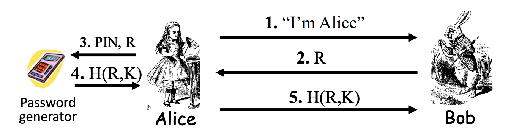
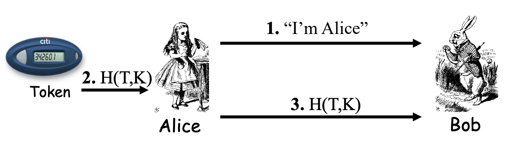
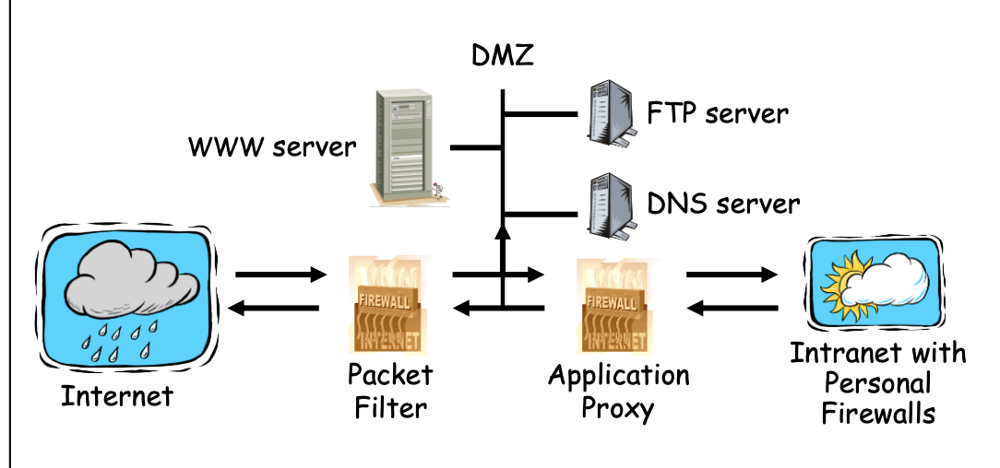

## Lecture 07: Key Management

## Lecture 08: Computer Security

### Password File

* Differernt with key, user choose password with pattern => if the search space is $2^{64}$ by using brute force, the average search time is $2^{63}$ . However, in this case, we can reduce it by dictionary attack => password is less secure than keys
* Passphrase is better than password
* Other vulnerability: attacker test how long it takes to reject a password => if you matches the first part, it will take longer time
* Password storage
  * plaintext in a file => bad
  * store $y = h(password)$ => not encryption (need to store the key)
    * Dictionary attack: pre-computes $h(x)$ for all $x$ in a dictionary of **common passwords**
    * When attacker get the password file, simply find the intersection
  * Store the hased passwords with random salt $y = h(password, s)$ and store the pair $(s,y)$ in plaintext (notice that $s$ is public) 
    * Easy to verify hard to pre-compute
  * Difficult to find and take down

### Phishing

* phishing attack: attacker masquerade as a trustworthy entity
  * phishing website/email => convince user to perform some other actions and acqure information from them
    * social engineering is an important aspect of lauching phishing attack (convince user => e.g. put some pressure on the victim, close your account)
    * another important thing is to be look like the legitimate site
  * Difficult to find or shut down, average time to live is short
* phishing techniques
  * Conventional Phishing
  * Spear Phishing: Targeted phishing at specific person
    * Whaling: a subset of spear phishing, targets are senior executives, high profile, VIP people
  * Clone Phishing: The phishing messages are from previous email (pretend to be from the same sender)

### Authentication

* Access Control

  * Authentication: Who can access
  * Authorization: What can access

* Require two of three methods for human authentication

  * knows => password
  * has => secure card
  * is => finger print
  * e.g. : password + security token, card + PIN for ATM, password + cellphone
    * if I loss my card, others cannot use only card without PIN to access

* One-time password generator (something you have)

  * Advantage: used only once, even if compromised a new password is used next time so does not matter

  * Key $K$ is stored in the password generator => knows PIN has K:

    * challenge response based one time password

    * need a key board to input the random number and PIN

    * K is not known by Alice

      

  * This protocol does authenticate Alice

* Dynamic Password Token  (a.k.a time-based one-time password or T-OTP)

  

  * Simply use the timestamp to provide freshness
  * $K$ is not known by Alice
  * Alice has the token
  * Require time synchronization
  * This protocol doesn't authenticate Alice => Only authenticate when Alice has control of the token

### Access Control

* Authorization enforced by 
  * Lampson’s Access Control Matrix: Subjects (users) index the rows, Objects (resources) index the columns
  * Access Control List => white list for resource
  * Capabilities Lists => ticket for user
  * Role-based Access Control
    * objects record roles list
    * roles record subjects list

### Firewall

* Access control for the network

* Firewall Types
  * Packet Filter - network layer

    * filt based on

      * Source IP address
      * Destination IP address
      * Source Port
      * Derstination Port
      * Flag bits (SYN, ACK) =>  although there is Transport Layer info here SYN,ACK etc. the decision making is still at network layer – the firewall can look at these flags but it does not understand what they mean.

    * Method: Access Control Lists (ACLs) (restrict incoming packets to Web responses)

      

    * Advantage: speed

    * Disadvantage: 

      * No state
      * Cannot see TCP connections
      * Blind to application data

  * Stateful packet filter - transport layer

    * Add state to packet filter
    * Method: Remember TCP connections and flag bits as well as UDP packets (DNS requests)
    * Advantage:
      * do everything a packet filter can do
      * Keep track of ongoing connections
    * Disadvantage
      * Cannot see application data
      * Slower than packet filtering

  * Application Proxy - application layer

    * A proxy is something that acts on your behalf
    * Method: 
      * Application proxy looks at incoming application data (check, reformatting, look for malware)
      * Create a new packet before sending it to internal network
    * Advantages 
      * Complete view of connections and applications data 
      * Filter bad data at application layer (viruses, Word macros)
    * Disadvantage: Speed

  * Personal firewall - for single user, home network, etc.

    * can choose any of 

      * packet filter
      * stateful packet filter
      * application proxy

    * Example security architecture: 

      

      * A lot of traffic => application proxy is slow
      * Two level => first filter by packet filter, then application proxy

### Malware

* Types
  * Replicate ?
    * replicate
      * Over network => worm
      * Spread to other files => virus
      * Lauching more instance => bacteria
    * don’t replicate: Trapdoor, logic bombs, Trojan horses
  * Need host ?
    * need: Trapdoor, Logic bombs, Trojan horses, Viruses
    * don’t need: Bacteria, Worms
* Trapdoor/Backdoor
  * secret, undocumented entry point into a program
  * inserted during developing
  * Intentionally/not intentionally kept in the future
  * Countermeasures
    * open source
    * develop your own program
* Logic bombs
  * embedded in a legitimate program that is set to ‘explode’ when certain conditions are met
* Trojan horses
  * A hidden code that performs a hidden function in addition to its stated function.
* Viruses
  * A program that can ‘infect’ other programs by modifying them. can cause geometric growth of infection
  * Countermeasure: 
    * keep your operating system up-to-date with patches 
    * antivirus software 
    * treat all attachments in email messages from unknown people as suspicious 
* Bacteria (don’t need host)
  * A program that does not explicitly destroy any program or file. Its sole purpose is to replicate themselves to create resource starvation – availability attack.
  * Countermeasure: 
    * keep your operating system up-to-date with patches 
    * antivirus software 
    * treat all attachments in email messages from unknown people as suspicious 
* Worms (don’t need host)
  * It makes use of network management mechanism, identifies a free machine on the net, passes the worm program to other machines
  * Countermeasure
    * Access control
    * Intrusion detection: statistics of user behaviour
    * Firewalls