# CS4286 Final Review

[TOC]

## Tasks

* Lectures
* Tutorials
* Assignments
* Optional Questions
* Mid-term questions

## Questions

* In Lecture 6, why do we use identifier in Example 4 (nonce & signature)
* In Lecture 9, why do we need SSL over IPSec

## Lecture 06: Authentication

### Entity Authentication

* Autentication types

  * Stand-alone computer with physically secure connection: Simple
  * Over a network: Much more complex
    * Interception
    * Replay

* One-way authentication over an open network & Replay attack vulnerabilities

  * Scheme I 
    $$
    Alice \rightarrow Email\ Server: Username, password
    $$

    * **Masquerade/Replay Attack**: Eavesdropper can intercept Alice’s login information and use it to logon to the Email server

  * Scheme II
    $$
    (1)\ Alice \leftarrow Email\ Server: PK, Cert_{server} \\
    (2)\ Alice {\color{red}{\rightarrow}} Email\ Server: E_{PK}(Username, password) (secure\ channel) \\
    or \\
    (1)\ Alice {\color{red}{\rightarrow}} Email\ Server: Username, h(password) \\
    $$

    * **Replay Attack**: Adversary replays $E_{PK}$ or $h$ 

  * Scheme III: Challenge and responce
    $$
    Alice \leftarrow Email\ Server: N \\
    Alice \rightarrow Email\ Server: F(passwd, N) \\
    $$

    * Challenge $N$: Nonce (number used only once, does not need to be a random number)
    * Response $F(passwd, N)$: $F$ is a one-way function and $passwd$ is the password of Alice
      * $F$ can be hash or block cipher
    * Only Alice and the Email Server know the valud of the password. Hence only Alice can provide the correct responce to the Email Server. 

* Types of Challenge and response mechanisms

  * Hash function
    $$
    Alice(K_{AB}) \leftarrow Bob(K_{AB}):Nonce \\
    Alice(K_{AB}) \rightarrow Bob(K_{AB}):h(K_{AB}, Nonce) \\
    $$

  * MAC
    $$
    Alice(K_{AB}) \leftarrow Bob(K_{AB}):Nonce \\
    Alice(K_{AB}) \rightarrow Bob(K_{AB}):MAC(K_{AB}, Nonce) \\
    $$

  * Symmetric Encryption
    $$
    Alice(K_{AB}) \leftarrow Bob(K_{AB}):Nonce \\
    Alice(K_{AB}) \rightarrow Bob(K_{AB}):Enc(K_{AB}, Nonce)\ or\\
    Alice(K_{AB}) \leftarrow Bob(K_{AB}):Enc(K_{AB}, Nonce) \\
    Alice(K_{AB}) \rightarrow Bob(K_{AB}):Nonce \\
    $$

  * Asymmetric Encryption
    $$
    Alice(K_{AB}) \leftarrow Bob(K_{AB}):Nonce \\
    Alice(K_{AB}) \rightarrow Bob(K_{AB}):[Nonce]_{Alice}\ or\\
    Alice(K_{AB}) \leftarrow Bob(K_{AB}): \{Nonce\}_{Alice} \\
    Alice(K_{AB}) \rightarrow Bob(K_{AB}):Nonce \\
    $$

    * Assumptions and definitions
      * $\{\}$ represents public key encryption, $[]$ represents digital signature.
      * We assume the public keys are certified. 

* Entity Authentication: A sequence of messages passed between a claimant and a verifier designed to confirm that identity of the claimant. 

  * Terminologies: 
    * Claimant: An entity claiming an identity. (Google Server)
    * Principal: The identity claimed by a claimant. (Server of google.com)
    * Verifier: The entity verifying a claim. (browser)
  * Types:
    * Unilateral authentication: Only one entity is authenticated to another entity
    * Mutual authentication: Both entities are identified with each other
  * Requirements:
    1. Origin authentication: Messages came from the principal
       * Message Authentication Codes (MACs)
       * Digital Signature Schemes
       * **Symmetric Encryption** 
         * does not provides origin authentication without additional features
         * the verifier knows the expected content and format of the message
         * We can append a manipulation detection code (**MDC**) to the message before encryption to check the integrity of a message by checking that it “makes sense” for computer. 
    2. Freshness: Messages have been recently generated. 
       * **Timestamp**: Both clock-based and “logical” counters
         * Synchronized timestamp
           * Assumption & disadvantage: Requires **securely** synchronized clocks
           * Non-trivial to provide such clocks
             * The clock drift of a typical workstation is about one second per day. 
             * Initial synchronisation cannot use time stamps
           * Window of acceptance
             * Clock synchronisation problems and network delays cause problems for time-stamp-based protocols. 
             * Necessary to accept time stamps within a “window of acceptance”. 
             * Necessary to store a log of received messages within the current window to avoid replays.
         * Logical timestamp (sequence number)
           * Each entity maintains counters stating how many messages have been sent to and received from a particular entity.
           * Let $N_{AB}$ be the number of messages A has sent to B (both A and B should know this).
           * Whenever A sends a message to B, $N_{AB}$ is increased by one and included in the message. 
           * When B receives a message that contains a counter value $n$: 
             * If $n > N_{AB}$ then accept the message as fresh and reset $N_{AB} = n$. (we may loss a value)
             * If $n < N_{AB}$ then reject the message as not fresh
           * Very vulnerable to preplay attack, but can be very effective if used carefully (e.g. 3GPP mobile phone authentication protocols)
       * **Nonce** (**n**umber used **once**): Challenge-response protocols
         * Nonce provider must ensure that a nonce is not used twice
         * Freshness for Mutation Authentication
           * What if Alice’s message contains the nonce? No. 
           * Alice (or someone claiming to be her controls the nonce). What if along with Alice’s nonce Bob sends a nonce, and that nonce is included in the message? Yes
         * Randomization: A counter is a good way of producing nonce, but many protocols require the nonce to be randomized => reused nonce increase the possibility of being replied. 
           * Pseudo-randomly using a non-repeating generator
             * Advantage: Easier to be implemented
             * Disadvantage: Could be subject to cryptanalysis, still need a good quality seed.
           * Generate at random and store a log
             * Advantage: Good random source
             * Disadvantage: lots of overhead — how may nonces are we going to store?
           * Generate at random and accept small chance of repeated nonce
             * Advantage: Good random source (no storage)
             *  there is the chance that a nonce repeats – this can be reduced by making nonce sufficiently long.
       * Both involve computing the integrity protection for a unique string (nonce or timestamp are strings) => wew need to have assurance as to who created this freshness (tie the entity to this freshness)

* Authentication Attacks: Many security properties of secure entity authentication protocols are defined by their resistance to certain kinds of attack.

  * **Masquerade**: one in which the attacker **directly** generates messages that demonstrate that they are someone else. (Prevented by origin authentication mechanism)
    * If there is no data origin authentication, it is volunerable
  * **Replay**: one in which old messages are replayed to a **verifier**. (Prevented by freshness mechanisms)
    * If there is no freshness, it is volunerable
  * **Reflection**: one in which data the **verifier has produced is sent back to him**. (Prevented by including identifiers that show to whom a message is being sent.)
    * Only happens when there is a shared key, and no identifier

### Protocol Design

* Components of a cryptographic protocol

  * **Assumptions**: What needs to have happened before the protocol is run? 
    * Timestamp: clock synchronization
    * Public key encryption: Certified public key
    * Symmetric encryption: They share a same key
  * Flow: Who sends a message to whom (in what order)? 
  * Messages: What information is exchanged at each step? 
  * Actions: What needs to be done between each step? 

* Stages of protocol design/analysis 

  * Security objectives: What do you want to do? 
  * Protocol goals: Translating the security objectives into a set of cryptographic requirements to be met by the end of the protocol 
  * Define/analyse the protocol: Assumptions, flow, messages, actions
  * Note the difference between objectives and goals. Objective is your real world problem. Goal is your technical requirement.

* Example

  * Objective: Bob wants to make sure that Alice was the source of a electronic purchase contract that should not be denied by Alice
  * Protocol goals: Data origin authentication and non-repudiation for the message received from Alice
  * Define/Analyze
    * MAC
      * Assumption: A and B shares K
      * Actions: B verifies MAC
      * Goal satisfied: No, only original authentication
    * Signature
      * Assumption: B has A’s certificated public key
      * Actions: B verifies signature
      * Goal satisfied: Yes

* Sample protocols

  * Notations:

    * $A$ and $B$ are (identifiers for) two entities who wish to engage in an authentication protocol. 
    * $T_A$ is a time stamp produced by A. 
    * $R_A$ is a random nonce generated by A. 
    * $K_{AB}$ is a symmetric key shared by A and B. 
    * Text is an arbitrary field that can contain data of any form, particularly an $MDC$.
    * $Enc_{K_{AB}}(X)$ denotes the encryption of data $X$ using a key $K_{AB}$ that is shared between A and B. We assume this is “integrity protected” encryption. 
    * $MAC_{K_{AB}}(X)$ denotes a cryptographic check value (MAC) of data $X$ using a key $K_{AB}$ that is shared between A and B. 
    * $Sig_{A}(X)$ denotes the signature (with appendix) computed by A on the data $X$.

  * Example 1
    $$
    A \rightarrow B: M_1 = Enc_{K_{AB}}(T_A||B||MDC)
    $$

    * Assumption: Synchronized clock, $K_{AB}$ shared
    * Unilateral: Only A is authenticated to B
    * Freshness: Provided by timestamp
    * Origin authentication: Provided by symmetric encryption

  * Example 2

    * V1
      $$
      A \leftarrow B: M_1 = R_B \\
      A \rightarrow B: M_2 = MAC_{K_{AB}}(R_B||B)
      $$

      * Assumption: $K_{AB}$ shared
      * Unilateral: Only A is authenticated to B
      * Freshness: Provide by the nonce
      * Origin authentication: Provided by message authentication code
      * Note also that the nonce check here is implicit. The only time we have to perform an explicit nonce check is when we use symmetric encryption as our origin authentication protocol method. Because then our integrity is tied to our formatting, redundancy – if we decrypt and the resultant plaintext is the nonce we were looking for then we trust that nobody messed with the message.

    * V2
      $$
      A \leftarrow B: M_1 = R_B \\
      A \rightarrow B: M_2 = MAC_{K_{AB}}(R_B)
      $$

      * This is volunerable to reflection attack
        $$
        M \leftarrow B: I\ am\ B, R_B \\
        M \rightarrow B: I\ am\ A, R_B \\
        M \leftarrow B: MAC_{K_{AB}}(R_B) \\
        M \rightarrow B: MAC_{K_{AB}}(R_B) \\
        $$

      * We don’t need identifier if we replace MAC by signature (only happens for symmetric case)

  * Example 3
    $$
    A \rightarrow B: M_1 = T_A || Sig_A(T_A ||B) \\
    A \leftarrow B: M_2 = T_B||Sig_B(T_B||A)
    $$

    * Assumption: A's and B’s public keys are certified and known by each other
    * Mutual
    * Freshness: Provided by timestamp $T_A$ and $T_B$
    * Origin auth: Provided by signature
    * Identifier: without identifier, we could take that message and send it to anyone not B (within window of acceptance) and pretend to be A.

  * Example 4
    $$
    A \leftarrow B: M_1 = R_B \\
    A \rightarrow B: M_2 = R_A || Sig_A(R_A|| R_B ||B) \\
    A \leftarrow B: M_3 = Sig_B(R_B|| R_A ||A)
    $$

    * Assumption: A's and B’s public keys are certified and known by each other
    * Mutual
    * Freshness: Provided by nonces $R_A$ and $R_B$
    * Origin auth: Provided by signature
    * Why $R_B$ is in the last message: Protect them from poor random number generation => two nonce has less chance to be both repeat
    * Why flip $R_A$ and $R_B$: shown in example 5
    * Why identifier

  * Example 5
    $$
    A \leftarrow B: M_1 = R_B \\
    A \rightarrow B: M_2 = R_A || Sig_A(R_A|| R_B ||B) \\
    A \leftarrow B: M_3 = Sig_B(R_A|| R_B ||A)
    $$

    * We assume $R_B, R_A$ are counters and $R_B > R_A$ 
    * **Replay attack**: The attacker recorded this protocol messages. He knows that $R_A$ used by Alice in the later transaction will be updated to $R_B$ since it is less than $R_B$. He keeps listening to the messages sent by Alice and when he find $R_B$, he can pretend to be B by choosing $R_A$ in the previous record as nonce:

    $$
    A \rightarrow M: M'_1 = R_A' = R_B \\
    A \leftarrow M: M_2' = R_A||M_3 = R_A||Sig_B(R_A|| R_B ||A) = R_A||Sig_B(R_A|| R_A' ||A) \\
    A \rightarrow M: M_3' = Sig_B(R_A||R_A'||B) \\
    $$

  * Example 6

    

    * Authentication
      * S and A: Unilatural S to A
      * S and B: No auth (no freshness)
      * A and B: Unilatural A to B

### Tutorial & Assignment

* T6 Q3: Design a unilateral authentication protocols using 

  * a) A timestamp and an encryption mechanism 
    $$
    A \rightarrow B: Enc_{K_{AB}}(T_A||B||MDC) \\
    $$

  * b) A timestamp and a MAC mechanism 
    $$
    A \rightarrow B: T_A||MAC_{K_{AB}}(T_A||B) \\
    $$

  * c) What is the practical difference in how we send the timestamp between a) and b)?

    * Append timestamp in plaintext or not

* T7 Q1: Which of the following protocols authenticate A to B? Explain why (or why not and suggest how to fix it). K is a symmetric key shared between A and B, N is a nonce and T is a timestamp. 

  * a) Yes
    * A > B: T, E(K,T)
  * b) No => **Reflection attack** (no identifier)
    * A < B: N 
    * A > B: h(K,N)
  * c) No => change to two messages, and identifier
    * A > B: N, E(K,N)

* T7 Q2: You are asked to design an authentication protocol whereby a web client can authenticate servers he wishes to visit. You must make the following decisions and design the most practical protocol.... 

  * Time stamp or nonce? nonce
  * Symmetric or asymmetric mechanism? asymmetric
  * To make your decision think about: How many clients and servers? What can we assume about clients?
    * Difficult to synchronize
    * Many keys to share

* T7 Q3: You are asked to design an authentication protocol whereby a client can log onto online banking. You are asked to do so for two banks - both banks gives the client a secure hardware device that can generate a response. 

  * a) Bank 1 device has a single button, and response is generated upon press of button. => Use timestamp, **symmetric**(easier to manage, store, and compute)
  * b) Bank 2 has a small 10-digit numeric keypad, and also a button to press for response generation? => Use nonce, **symmetric**

* A2 Q3
  $$
  A \rightarrow B: R \\
  A \leftarrow B: [R]_B \\
  A \rightarrow B: [R+1]_A
  $$

  * (a) This protocol is not secure. Is it vulnerable to any of masquerade, replay, reflection or man-in-the-middle? Explain why. 
    * replay: lack of freshness. Trudy can record the whole process and replay it to Bob by using same nonce as Alice. He can pretend to be Alice
  * (b) Modify the protocol such that it supports mutual authentication. Your modification cannot add any encryption, digital signature or new message flow (change the current messages).
    * as shown in example 4

## Lecture 07: Key Management

### Key Establishment Protocols

* Three types for symmetric key encryption based Key establishment protocols
  * Directly communicating entities (there is already a shared key => each pairs have a key => not efficient)
  * Key Distribution Centre (KDC)
  *  Key Translation Centre (KTC)
* 

### Public Key (Certificate) Management

## Lecture 08: Computer Security

### Password File

* Differernt with key, user choose password with pattern => if the search space is $2^{64}$ by using brute force, the average search time is $2^{63}$ . However, in this case, we can reduce it by dictionary attack => password is less secure than keys
* Passphrase is better than password
* Other vulnerability: attacker test how long it takes to reject a password => if you matches the first part, it will take longer time
* Password storage
  * plaintext in a file => bad
  * store $y = h(password)$ => not encryption (need to store the key)
    * Dictionary attack: pre-computes $h(x)$ for all $x$ in a dictionary of **common passwords**
    * When attacker get the password file, simply find the intersection
  * Store the hased passwords with random salt $y = h(password, s)$ and store the pair $(s,y)$ in plaintext (notice that $s$ is public) 
    * Easy to verify hard to pre-compute
  * Difficult to find and take down

### Phishing

* phishing attack: attacker masquerade as a trustworthy entity
  * phishing website/email => convince user to perform some other actions and acqure information from them
    * social engineering is an important aspect of lauching phishing attack (convince user => e.g. put some pressure on the victim, close your account)
    * another important thing is to be look like the legitimate site
  * Difficult to find or shut down, average time to live is short
* phishing techniques
  * Conventional Phishing
  * Spear Phishing: Targeted phishing at specific person
    * Whaling: a subset of spear phishing, targets are senior executives, high profile, VIP people
  * Clone Phishing: The phishing messages are from previous email (pretend to be from the same sender)

### Authentication

* Access Control

  * Authentication: Who can access
  * Authorization: What can access

* Require two of three methods for human authentication

  * knows => password
  * has => secure card
  * is => finger print
  * e.g. : password + security token, card + PIN for ATM, password + cellphone
    * if I loss my card, others cannot use only card without PIN to access

* One-time password generator (something you have)

  * Advantage: used only once, even if compromised a new password is used next time so does not matter

  * Key $K$ is stored in the password generator => knows PIN has K:

    * challenge response based one time password

    * need a key board to input the random number and PIN

    * K is not known by Alice

      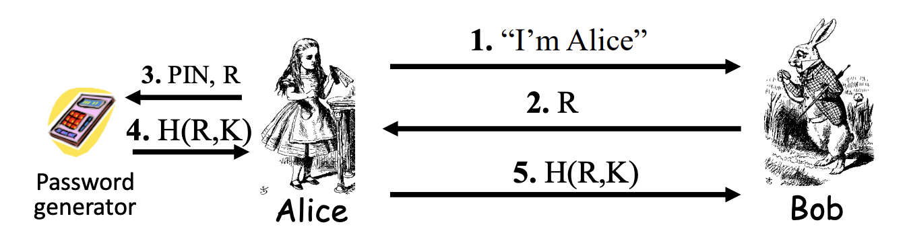

  * This protocol does authenticate Alice

* Dynamic Password Token  (a.k.a time-based one-time password or T-OTP)

  

  * Simply use the timestamp to provide freshness
  * $K$ is not known by Alice
  * Alice has the token
  * Require time synchronization
  * This protocol doesn't authenticate Alice => Only authenticate when Alice has control of the token

### Access Control

* Authorization enforced by 
  * Lampson’s Access Control Matrix: Subjects (users) index the rows, Objects (resources) index the columns
  * Access Control List => white list for resource
  * Capabilities Lists => ticket for user
  * Role-based Access Control
    * objects record roles list
    * roles record subjects list

### Firewall

* Access control for the network

* Firewall Types

  * Packet Filter - network layer

    * filt based on

      * Source IP address
      * Destination IP address
      * Source Port
      * Derstination Port
      * Flag bits (SYN, ACK) =>  although there is Transport Layer info here SYN,ACK etc. the decision making is still at network layer – the firewall can look at these flags but it does not understand what they mean.

    * Method: Access Control Lists (ACLs) (restrict incoming packets to Web responses)

      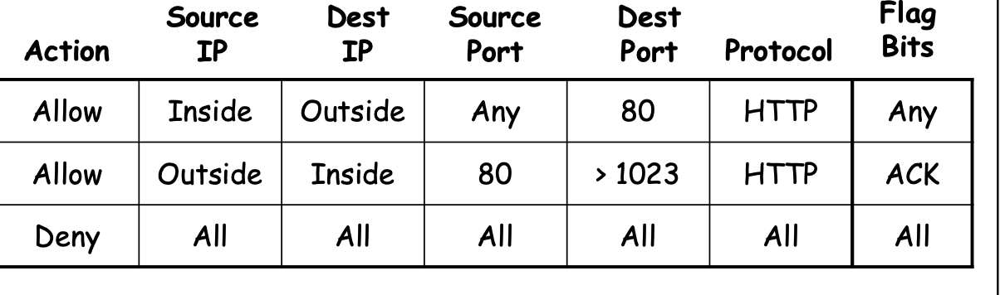

    * Advantage: speed

    * Disadvantage: 

      * No state
      * Cannot see TCP connections
      * Blind to application data

  * Stateful packet filter - transport layer

    * Add state to packet filter
    * Method: Remember TCP connections and flag bits as well as UDP packets (DNS requests)
    * Advantage:
      * do everything a packet filter can do
      * Keep track of ongoing connections
    * Disadvantage
      * Cannot see application data
      * Slower than packet filtering

  * Application Proxy - application layer

    * A proxy is something that acts on your behalf
    * Method: 
      * Application proxy looks at incoming application data (check, reformatting, look for malware)
      * Create a new packet before sending it to internal network
    * Advantages 
      * Complete view of connections and applications data 
      * Filter bad data at application layer (viruses, Word macros)
    * Disadvantage: Speed

  * Personal firewall - for single user, home network, etc.

    * can choose any of 

      * packet filter
      * stateful packet filter
      * application proxy

    * Example security architecture: 

      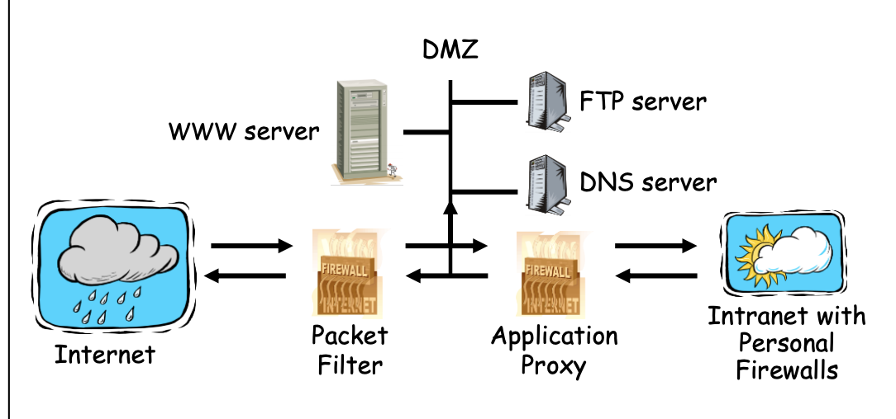

      * A lot of traffic => application proxy is slow
      * Two level => first filter by packet filter, then application proxy

### Malware

* Types
  * Replicate ?
    * replicate
      * Over network => worm
      * Spread to other files => virus
      * Lauching more instance => bacteria
    * don’t replicate: Trapdoor, logic bombs, Trojan horses
  * Need host ?
    * need: Trapdoor, Logic bombs, Trojan horses, Viruses
    * don’t need: Bacteria, Worms
* Trapdoor/Backdoor
  * secret, undocumented entry point into a program
  * inserted during developing
  * Intentionally/not intentionally kept in the future
  * Countermeasures
    * open source
    * develop your own program
* Logic bombs
  * embedded in a legitimate program that is set to ‘explode’ when certain conditions are met
* Trojan horses
  * A hidden code that performs a hidden function in addition to its stated function.
* Viruses
  * A program that can ‘infect’ other programs by modifying them. can cause geometric growth of infection
  * Countermeasure: 
    * keep your operating system up-to-date with patches 
    * antivirus software 
    * treat all attachments in email messages from unknown people as suspicious 
* Bacteria (don’t need host)
  * A program that does not explicitly destroy any program or file. Its sole purpose is to replicate themselves to create resource starvation – availability attack.
  * Countermeasure: 
    * keep your operating system up-to-date with patches 
    * antivirus software 
    * treat all attachments in email messages from unknown people as suspicious 
* Worms (don’t need host)
  * It makes use of network management mechanism, identifies a free machine on the net, passes the worm program to other machines
  * Countermeasure
    * Access control
    * Intrusion detection: statistics of user behaviour
    * Firewalls

## Lecture 09: Network Security

### Web (TLS/SSL & IPSec)

#### Secure Socket Layer (Transport Layer Security)

* Socket layer (HTTP**S**): Between application layer and transport layer (SSL usually between HTTP and TCP)

* Service provided: 

  * One-way authentication: authenticate server to client
    * Mutual authentication version does exist but not necessary
  * Data confidentiality: Encryption by shared key

* Basic idea of SSL Protocol: Authentication + key establishment + encrypted data channel
  $$
  A \rightarrow B: I'd\ like\ to\ talk\ to\ you\ securely \\
  A \leftarrow B: Cert_B \\
  A \rightarrow B: \{K_{AB}\}_{Bob} \\
  A \leftrightarrow B: encrypted\ HTTP\ using\ K_{AB} \\
  $$

  * Bob is authenticated to Alice
    * freshness: $K_{AB}$
    * Origin authentication: Public key encryption
  * key transfer, Alice has key control
  * Data confidentiality provided by symmetric encryption

* Simplified SSL Handshake Protocol
  $$
  A \rightarrow B: Cipher\ suites,\ TLS\ version,\ R_A \\
  A \leftarrow B: Cipher\ suite\ used,\ Cert_B, R_B \\
  A \rightarrow B: \{S\}_B,\ PRF(K,h(msgs))\\
  A \leftarrow B:PRF(K,h(msgs))\\
  A \leftrightarrow B: Data\ encrypted\ under\ K
  $$

  * Assumptions
    * Alice knows Bob(server)’s public key
    * The public key is certified by trusted CA
    * $S$ is randomly chosen by Alice
    * $K = h(S, R_A, R_B)$
    * $msgs =$ all previous messages
    * $PRF$ is also a hash function, we can also use $PRF(K, PRF(msgs))$ 
  * Bob is authenticated by Alice
    * freshness: $S$
    * Origin authentication: Public key encryption
  * Key agreement, no one has key control
  * Explicit key authentication
  
* SSL Sessions vs Connections

  * SSL designed for use with HTTP 1.0, which usually opens multiple simultaneous (parallel) connections
  * It takes a long time to decrypt public key encryption => use SSL connection protocol to construct new connections efficiently between authenticated entities.

* SSL Connection
  $$
  A \rightarrow B: R_A \\
  A \leftarrow B: R_B, PRF(K, h(msgs)) \\
  A \rightarrow B: PRF(K, h(msgs)) \\
  A \leftrightarrow B: Data\ encrypted\ under\ K \\
  $$

  * Assumptions
    * SSL session exists (handshake is done)
    * $S$ is already known to Alice and Bob
    * $K = h(S, R_A, R_B)$ with new $R_A, R_B$ 
    * $msgs =$ all previous messages
    * $PRF$ is also a hash function, we can also use $PRF(K, PRF(msgs))$ 
  * No public key operations

#### IPSec (Network Layer Security)

* IPSec and SSL: IPSec lives at the network layer and transparent to applications, which contains two parts:

  * Internet key exchange (IKE): Establish a session key
    * phase I: master session key setup => comparable to SSL session (**6 variants in total**)
      * Three ways: All based on Diffie-Hellman. The three ways are used to provide original authentication for Diffie-Hellman (i.e. how the proof are calculated)
        * Public key encryption based
        * Signature based
        * Symmetric key based
      * Two modes:
        * Main mode: try to protect user identity => must be implemented
        * Aggressive mode: try to use the fewest number of messages => should be implemented
    * phase II: ESP and/or AH **key setup** => comparable to SSL connection (do not cover)
  * Encapsulating Security Payload (ESP) or Authentication Header (AH): How a secure channel works

* IKE phase I: signature based

  * Main mode
    $$
    A \rightarrow B: CP \\
    A \leftarrow B: CS \\
    A \rightarrow B: g^a\ mod\ p, R_A\\
    A \leftarrow B: g^b\ mod\ p, R_B\\
    A \rightarrow B: E(K, "Alice"||proof_A)\\
    A \leftarrow B: E(K, "Bob"||proof_B)\\
    $$

    * Assumption
      * The public keys are known by each other and certified by trusted CA
      * $CP$ = crypto proposed, $CS$ = crypto selected
      * $K = h(g^{ab}\ mod\ p, R_A, R_B)$
      * $SKEYID$ =  $h(R_A, R_B, g^{ab}\ mod\ p)$  (enlarge the hash space to avoid dictionary attack)
      * $proof_A = [h(SKEYID, g^a\ mod\ p, g^b\ mod\ p, CP, "Alice")]_{Alice}$
    * How does Bob know Alice (now who he is talking to)
      * The identifier $“Alice”$ is appended in the encryption, Bob can use Alice’s identifier to choose public key to verify the signature
    * Alice and Bob are mutually authenticated
    * No one has key control
    * Explicit key authentication

  * Aggressive mode
    $$
    A \rightarrow B: "Alice", g^a\ mod\ p, R_A,CP\\
    A \leftarrow B: "Bob", g^b\ mod\ p, R_B, CS, proof_B\\
    A \rightarrow B: proof_A\\
    $$

    * Identity of Alice and Bob are not protected
    * Cannot negotiate $g$ or $p$ => since less message required

* IKE phase I: Symmetric Key Based 

  * Main mode (same format)
    $$
    A \rightarrow B: CP \\
    A \leftarrow B: CS \\
    A \rightarrow B: g^a\ mod\ p, R_A\\
    A \leftarrow B: g^b\ mod\ p, R_B\\
    A \rightarrow B: E(K, "Alice"||proof_A)\\
    A \leftarrow B: E(K, "Bob"||proof_B)\\
    $$

    * Assumption
      * There is a shared $K_{AB}$ between Alice and Bob in advance
      * $CP$ = crypto proposed, $CS$ = crypto selected
      * $K = h(g^{ab}\ mod\ p, R_A, R_B, {\color {red} K_{AB}})$ 
      * $SKEYID$ =  $h(K, g^{ab}\ mod\ p)$  (enlarge the hash space to avoid dictionary attack)
      * $proof_A = h(SKEYID, g^a\ mod\ p, g^b\ mod\ p, CP, "Alice")$
    * Problem: 
      * Notice that $K_{AB}$ is necessary to be included in the construction of $K$ to prevent man-in-the-middle attack (otherwise anyone can generate the proof)
      * Different from the signature based protocol, we cannot get $K$ without knowing the identity of the message
      * Therefore, Alice’s ID must be IP address (and it is static)

  * Aggressive mode (same format)
    $$
    A \rightarrow B: "Alice", g^a\ mod\ p, R_A,CP\\
    A \leftarrow B: "Bob", g^b\ mod\ p, R_B, CS, proof_B\\
    A \rightarrow B: proof_A\\
    $$

    * No identity protection
    * Does not have problems of main mode

* IKE phase I: Public key encryption Based 

  * Main mode
    $$
    A \rightarrow B: CP \\
    A \leftarrow B: CS \\
    A \rightarrow B: g^a\ mod\ p, \{R_A\}_{Bob}, \{"Alice"\}_{Bob}\\
    A \leftarrow B: g^b\ mod\ p, \{R_B\}_{Alice}, \{"Bob"\}_{Alice}\\
    A \rightarrow B: E(K, proof_A)\\
    A \leftarrow B: E(K, proof_B)\\
    $$

    * Assumption
      * There is a shared $K_{AB}$ between Alice and Bob in advance
      * $CP$ = crypto proposed, $CS$ = crypto selected
      * $K = h(g^{ab}\ mod\ p, R_A, R_B)$  
      * $SKEYID$ =  $h(R_A, R_B, g^{ab}\ mod\ p)$ 
      * $proof_A = h(SKEYID, g^a\ mod\ p, g^b\ mod\ p, CP, "Alice")$
    * Only Alice and Bob can get the random numbers

  * Aggressive mode
    $$
    A \rightarrow B: \{"Alice"\}_{Bob}, g^a\ mod\ p, \{R_A\}_{Bob},CP\\
    A \leftarrow B: \{"Bob"\}_{Alice}, g^b\ mod\ p, \{R_B\}_{Alice}, CS, proof_B\\
    A \rightarrow B: proof_A\\
    $$

    * Identities are hidden in this case
    * The only difference with main mode is that we don’t encrypt the proof

  * Issue for this mode

    * Trudy can generates exponents $a,b$ and nonces $R_A, R_B$ and computes “valid” keys and proofs
    * The signatures can be reused by intercepting the previous communication
    * It means that a fake communication can be constructed
    * This protocol does not provide non-repudiation
      * A feature instead of a failure in IPSec => plausible deniability
      * Can be a failure in some cases

* ESP and AH

  * Two encapsulation modes

    * Transport mode: 

      * designed for host-to-host
      * Original IP header remains for both ESP and AH mode, other data are protected (including TCP header, HTTP header, Application level data)
      * passive attacker can see who is talking

    * Tunnel mode

      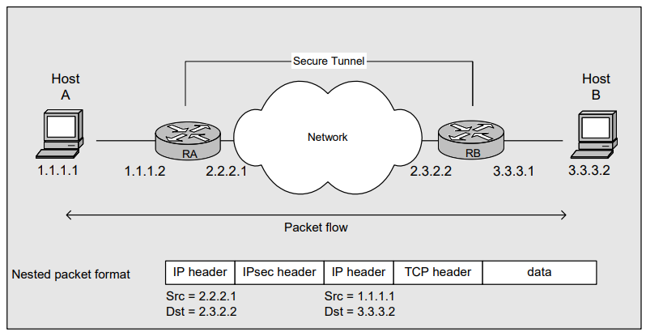

      * designed for gateway to gateway VPN
      * Original IP packet encapsulated in IPSec (not visible to attacker), new header rom firewall to firewall
      * Process
        * Host A generates a packet
        * The RA GW encapsulate the packet adding a new IP header
        * The RB GW decapsulate the packet (strip extra headers) and injects the packet to B’s network
        * Host B receives the packet
        * Note that the routing tables for A and B needs to direct the packets to the GWs so these could be directed
      * Can be extended to host-to-gateway connection (use VPN to work from home). In this case, the host will imitate(模仿) the role of a SGW rouer

  * Two protocols

    * AH - Authentication Header - support message authentication only 
    * ESP – Encapsulating Security Payload 
      * Encryption only 
      * Encryption with message authentication

* Authentication Header (AH) protocol

  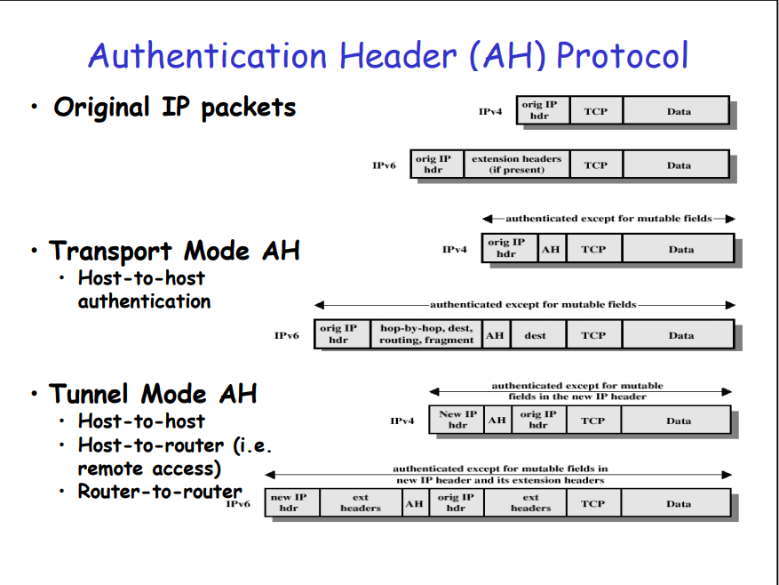

  * Notice that in both mode does not provide authenticity for mutable field
  * At first AH tunnel mode looks a bit useless – the original IP header is replaced but then you keep it plaintext
  * **Benefit of AH with tunnel mode**: entire original IP header is integrity protected – not only the immutable fields. In the new IP header the mutable fields (variable that change during transmission are not protected). => provide more authentication

* Encapsulating Security Payload (ESP) Protocol

  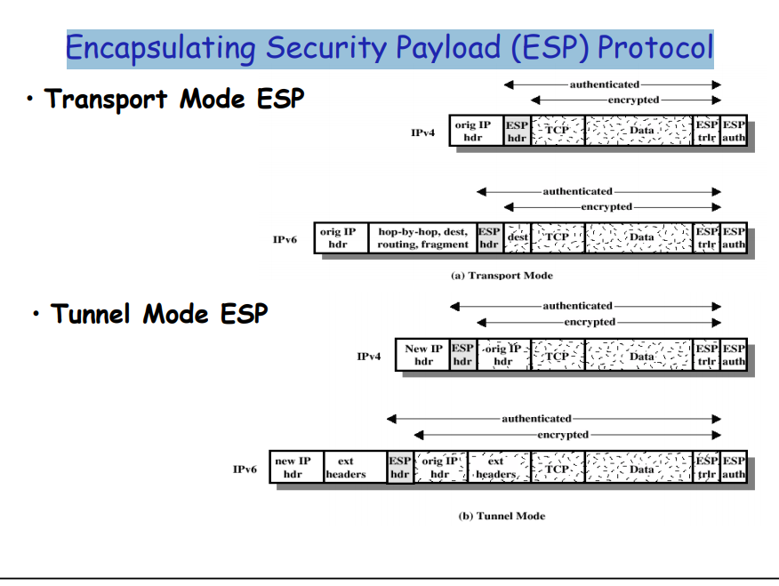

  * Note that the IP header is not protected in any way here. However, the original IP header in tunnel mode is now confidential

### Mobile Networks

* GSM (Global System for Mobile Communications) Mobile System Overview

  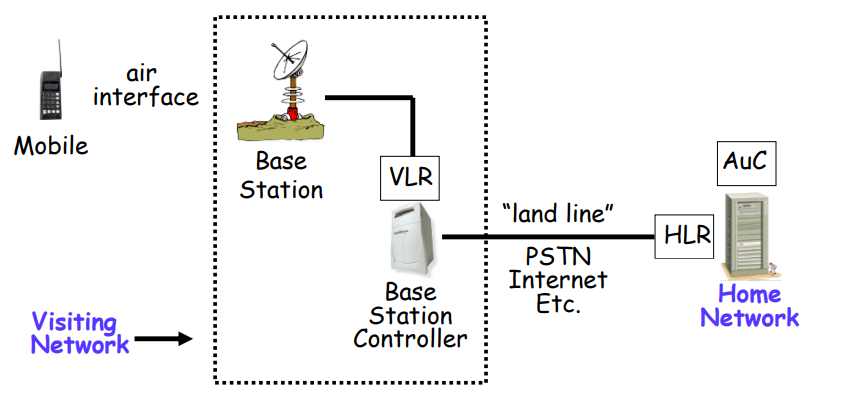

  * Mobile phone: contains a SIM (subscriber identity module), SIM has following property
    * IMSI (International Mobile Subscriber ID)
    * User key $Ki$ (128 bits)
    * Tamper resistant (smart card)
  * Home network, which you paid for very month: “home” of the mobile
    * HLR: home location register => keeps track of most recent location of mobile
    * AuC: authentication center => one of the security management, contains IMSI/Ki
  * Visiting Nework: network where mobile is currently located
    * base station: one “cell”
    * base station controller: manages many “cell”s, send your request to your home network
    * VLR: visiting location register => info on all visiting mobiles currently in the network

* Services of GSM (2G)

  * Anonymity
    * IMSI used to initially identify caller 
    * Then TMSI (Temporary Mobile Subscriber ID) used. TMSI changed frequently and encrypted when sent
    * Not a strong form of anonymity, but probably sufficient for most uses
  * Authentication
    * Caller authenticated to the base station, not mutual
    * via challenge-response
      * AuC generates $RAND$ and computes $XRES = A3(RAND, Ki)$ where $A3$ is a hash
      * Then $(RAND, XRES)$ are sent to base station 
      * Base station sends challenge $RAND$ to mobile 
      * Mobile’s response is $SRES = A3(RAND, Ki)$ 
      * Base station verifies $SRES = XRES$
    * Note: 
      * $Ki$ never leaves AuC, only send hashed $Ki$
      * Length of the random number should be long enough
      * Response (hash) length should be long enough
  * Confidentiality: Triplet $ Kc, XRES, RAND$
    * Data encrypted by stream cipher, $A5$
    * Encryption key $Kc$ 
      * AuC computes $Kc = A8(RAND, Ki)$, where $A8$ is a hash 
      * Then $Kc$ is sent to base station with $RAND$ 
      * Mobile computes $Kc = A8(RAND, Ki)$ after receiving $RAND$ 
      * The value of $RAND$ is the same as the one used for authentication 
      * Keystream generated from $A5(Kc)$
    * Note: $Ki$ never leaves home network!

* GSM performance

  * Benefit: Eliminate cloning mobiles => authenticated mobile

  * Insecurity of GSM

    * Algorithm

      * Hash used can be broken: Broken after 160,000 chosen plain texts. With SIM, can get Ki in 2 to 10 hours
      * Encryption between mobile and base station but no encryption from base station to base station controller
      * Encryption algorithm can be broken 2 seconds of known plain text
      * no integrity checking

    * Fake base station exploits two flaws 

      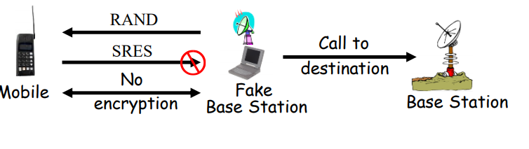

      * Encryption not automatic 
      * Base station not authenticated

    * Vulnerable to replay triplet

    * No integrity check

* 3GPP(3rd Generation Partnership Project) : fixes known GSM security problems

  * Mutual authentication 
  * Keys (encryption/integrity) cannot be reused 
  * Triples ($ Kc, XRES, RAND$) cannot be replayed (freshness)
  * Strong encryption algorithm (AES) 
  * Message authentication 
  * Encryption extended to base station controller

* 3GPP - AKA (Authentication and Key Agreement)

  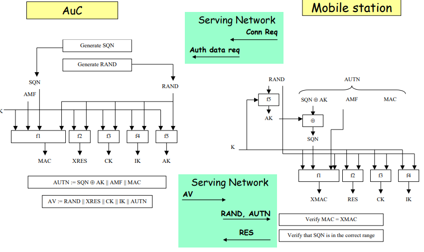

  * The green box shows the connection between AuC, base station, and mobile from left to right
  * Send AV to base station according to following fields
    * SQN: increment by one (counter)
    * XRES: expected response 
    * CK: encryption key
    * IK: integrity key
    * AK: authentication key
    * AMF: authentication management field (configurations)
  * **important: use AES for encryption**

### WLAN Security

* Authentication Scheme: one-way authentication (simple challenge-response)

* Confidentiality: Three protocols

  * WEP: long term key, RC4, bad integrity measures and was pretty insecure
  * WPA: Improvement on key reuse (key distributed by a TTP) but still RC4
  * WPA2: started using AES

* WEP (Wired Equivalent Privacy) algorithm

  * WEP encipherment block diagram

    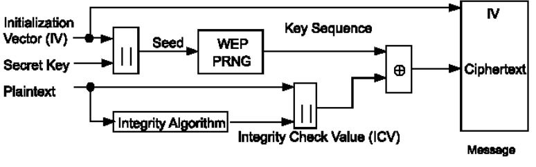

    * Secret Key (40 bits or 104 bits): Distributed to communicating entities (wireless stations and access points) via external key management service (e.g. manually key in)
    * Integrity Algorithm: CRC-32 (an error check algorithm => does not provide integrity well)
    * WEP PRNG: 
      * RC4
      * Initialized by Seed
      * Outputs a long binary stream called key sequence

  * WEP weakness: 

    * RC4 is not good: By analyze pattern, it can be broken
      * 24 bits IV can be iterated
    * CRC: weak linear integrity, easy to construct (linear combination of bit stream)
      * You can change the CRC as well as the ciphertext

  * Solutions:

    * Higher protocol level solutions
      * Application layer authentication 
      * Encryption with IPSec or PPTP (use VPN) 
      * Important websites should have HTTPS
    * Improve Wi-Fi Protected Access
      * Dynamically varying encryption keys => WPA
      * Use stronger encryption algorithm => WPA2

* WPA/WPA2 (Wi-Fi Protected Access) systems

  * WPA
    * Integrity algorithm: Change CRC to Proprietary Michael integrity check algorithm
    * Key management
      * Extensible Authentication Protocol (EAP) for authentication => allows session keys
      * Temporal key integrity protocol (TKIP) for encryption => still use RC4 but generate key dynamically
  * WPA2
    * CCMP
      * AES (operating like stream cipher in counter mode)
      * CBC-MAC for integrity
    * GCMP
      * AES in GCM mode (Galio/Counter mode)
      * GHASH for integrity
    * Allows alternative to have a password shared between an AP and a user  (Preshared key “WPA2-PSK” mode)
  * Protocol is safe, but some implementations are not
    * WPA2 has a four-way key establishment handshake 
      * Pairwise Transient Key (PTK) 
      * Groupwise Transient Key (GTK)
    * CCMP/GCMP only secure if IV does not repeat 
      * CCMP (IV = MAC/48-bit Nonce) 
      * GCMP (IV = MAC/48-bit Nonce)

### Tutorial

* T10 Q4:  $K = h(S, R_A, R_B)$ 
  $$
  A \rightarrow B: R_A \\
  A \leftarrow B: Cert_B, R_B \\
  A \rightarrow B: \{S\}_B, E(K, h(msgs||K)) \\
  A \leftarrow B:h(msgs||K) \\
  A \leftrightarrow B: Data\ encrypted\ under\ K
  $$

  * (a) What is the purpose of the message $E(K, h(msgs || K))$ sent in step 3?
    * Confirms $A$ actually knows $K$ => explicit key authentication
    * **Only Bob can decrypt $\{S\}_B$, it authenticate Bob to Alice**
  * (b) If we remove this part in step 3, i.e., if we changed step 3 to $A \rightarrow B : \{S\}_B$ Would the protocol still be secure?
    * **Depends what we mean by ‘secure’…the protocol would still be secure from authentication/key establishment viewpoint**
    * **It could be more vulnerable to denial-of-service attacks. If this message is removed, an attacker can simply send a random number to Bob in step 3 and then abandoning the connection, forcing Bob to keep it open until it times out, wasting resources on Bob's side. If the attacker repeats this many times from different sources until a limit is reached, Bob will stop accepting new connections and the DoS attack is successful.**

* T11 Q1

  * (a) How many different methods are there if two hosts would like to authenticate packets between them? **In tutorial 11 q1, why doesn’t the different methods to authenticate packets include 6 phase I of IKE methods** => authenticate packet means already share a session key, we focus on the protocol  

    * **4 methods**

    * **AH + transport****Depends what we mean by ‘secure’…the protocol would still be secure from authentication/key establishment viewpoint**

      **It could be more vulnerable to denial-of-service attacks. If this message is removed, an attacker can simply send a random number to Bob in step 3 and then abandoning the connection, forcing Bob to keep it open until it times out, wasting resources on Bob's side. If the attacker repeats this many times from different sources until a limit is reached, Bob will stop accepting new connections and the DoS attack is successful.**

    * **AH + tunnel**

    * **ESP + transport**

    * **ESP + tunnel**

  * (b) Can you think of an advantage of transport mode over tunnel mode if only authentication is required? 

    * Transport mode: Easy to implement, less time consumption
      * **Transport mode has a slightly lower bandwidth overhead over tunnel mode. **
    * Tunnel mode: Prevent interception of IP address, more secure

  * (c) Can you think of a reason why in transport mode AH could be slightly better for authentication than ESP? 

    * The immutable fields in the IP header is also protected

  * (d) What is the purpose of padding when using ESP?

    * ESP provides confidentiality. Block cipher requires padding
    * **Padding may also be used to conceal(隐藏) the actual length of the payload by adding a certain amount of padding.** 

* T11 Q2

  * a) You are using WEP to secure your WiFi connection. 
    * i) Attackers can gain knowledge about the plain text of the message if the key stream happens to repeat. You are sending 10,000 new WEP messages, on average, every second. How long does the attacker need to wait for the key stream to repeat?
      * **Key is fixed, need iterate 24 bit IV =>( 2^24 / 10000) seconds 0.466 hours**
    *  ii) An attacker knows the plain text of one of your messages. How can he modify the message so the receiver receives and accepts his new message? 
      * Standard stream cipher problem 
      * $M= text||CRC_M$, attacker has $A= attack_{text}||CRC_A$ 
      * RC4 generates key stream $KS $
      * $C= M\ XOR\ KS$, attacker recovers $KS $ by $KS = C\ XOR\ M $
      * Attacker makes $C’ = A\ XOR\ KS $
      * Receiver recovers $M’= C’\ XOR\ KS$ instead of $M$
  * b) You wish to use public WiFi at the shopping mall but it is set up to use WEP. What can you do to ensure you have improved security for you connection?
    * **Use a Virtual Private Network using something like IPSec (safest)** 
    * **Make sure of TLS/SSL (https) connection (not guaranteed as some traffic can still be seen – like initial visit to website)**

* T11 Q3

  * a) What basic security services does a 2nd generation mobile network provide? 

    * Anonymity, Confidentiality for **phone and base station** and authenticity for mobile phone

  * b) What basic security services does a 3rd generation mobile network provide? 

    * mutual authentication
    * Integrity
    * Confidentiality for base station controller
    * **Note: Uses standard cryptography based on AES**

  * c) **Consider the simplified 3G system shown below. Construct a suitable protocol and explain how mutual authentication is achieved.**

    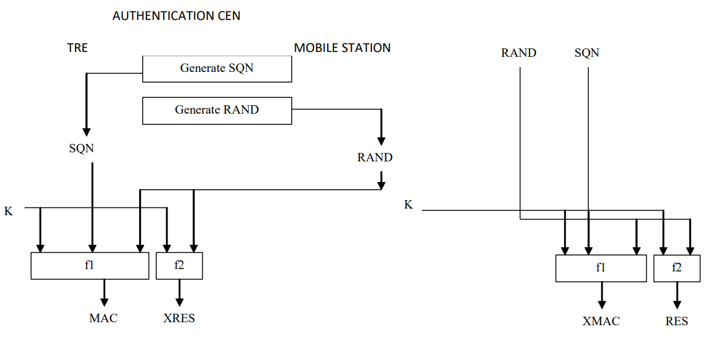
    $$
    Auth\ center \rightarrow Mobile station: MAC, RAND \\
    Auth\ center \leftarrow Mobile station: RES \\
    $$

    * SQN is a counter kept by AuC and MS as a logical time stamp
    * MAC contains SQN as timestamp
    * AuC authenticated to Base station: Mobile station use its own sequence number and the given random number to calculate expected MAC and compare with MAC
      * Freshness: SQN 
      * Origin auth: MAC (f1)
    * Base station authenticated to AuC: The response takes the RAND as a nonce
      * Freshness: RAND 
      * Origin auth: encryption (f2)