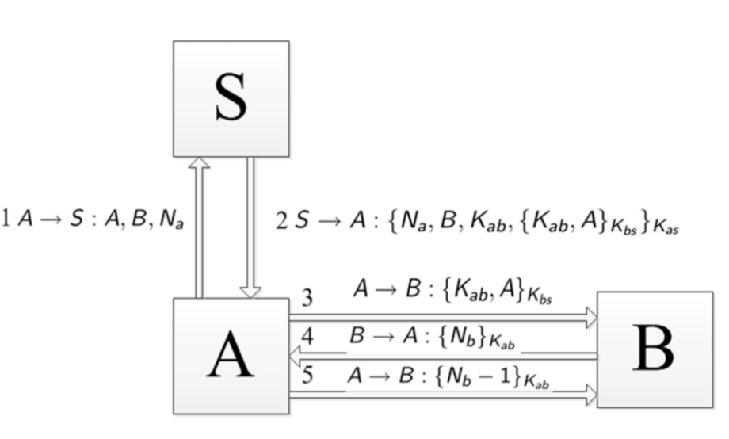

# CS4286 Final Review

[TOC]

## Questions

* In Lecture 6, why do we use identifier in Example 4 (nonce & signature)
* 

## Lecture 06: Authentication

### Entity Authentication

* Autentication types

  * Stand-alone computer with physically secure connection: Simple
  * Over a network: Much more complex
    * Interception
    * Replay

* One-way authentication over an open network & Replay attack vulnerabilities

  * Scheme I 
    $$
    Alice \rightarrow Email\ Server: Username, password
    $$

    * **Masquerade/Replay Attack**: Eavesdropper can intercept Alice’s login information and use it to logon to the Email server

  * Scheme II
    $$
    (1)\ Alice \leftarrow Email\ Server: PK, Cert_{server} \\
    (2)\ Alice \color{red}{\rightarrow} Email\ Server: E_{PK}(Username, password) (secure\ channel) \\
    or \\
    (1)\ Alice \color{red}{\rightarrow} Email\ Server: Username, h(password) \\
    $$

    * **Replay Attack**: Adversary replays $E_{PK}$ or $h$ 

  * Scheme III: Challenge and responce
    $$
    Alice \leftarrow Email\ Server: N \\
    Alice \rightarrow Email\ Server: F(passwd, N) \\
    $$

    * Challenge $N$: Nonce (number used only once, does not need to be a random number)
    * Response $F(passwd, N)$: $F$ is a one-way function and $passwd$ is the password of Alice
      * $F$ can be hash or block cipher
    * Only Alice and the Email Server know the valud of the password. Hence only Alice can provide the correct responce to the Email Server. 

* Types of Challenge and response mechanisms

  * Hash function
    $$
    Alice(K_{AB}) \leftarrow Bob(K_{AB}):Nonce \\
    Alice(K_{AB}) \rightarrow Bob(K_{AB}):h(K_{AB}, Nonce) \\
    $$

  * MAC
    $$
    Alice(K_{AB}) \leftarrow Bob(K_{AB}):Nonce \\
    Alice(K_{AB}) \rightarrow Bob(K_{AB}):MAC(K_{AB}, Nonce) \\
    $$

  * Symmetric Encryption
    $$
    Alice(K_{AB}) \leftarrow Bob(K_{AB}):Nonce \\
    Alice(K_{AB}) \rightarrow Bob(K_{AB}):Enc(K_{AB}, Nonce)\ or\\
    Alice(K_{AB}) \leftarrow Bob(K_{AB}):Enc(K_{AB}, Nonce) \\
    Alice(K_{AB}) \rightarrow Bob(K_{AB}):Nonce \\
    $$

  * Asymmetric Encryption
    $$
    Alice(K_{AB}) \leftarrow Bob(K_{AB}):Nonce \\
    Alice(K_{AB}) \rightarrow Bob(K_{AB}):[Nonce]_{Alice}\ or\\
    Alice(K_{AB}) \leftarrow Bob(K_{AB}): \{Nonce\}_{Alice} \\
    Alice(K_{AB}) \rightarrow Bob(K_{AB}):Nonce \\
    $$

    * Assumptions and definitions
      * $\{\}$ represents public key encryption, $[]$ represents digital signature.
      * We assume the public keys are certified. 

* Entity Authentication: A sequence of messages passed between a claimant and a verifier designed to confirm that identity of the claimant. 

  * Terminologies: 
    * Claimant: An entity claiming an identity. (Google Server)
    * Principal: The identity claimed by a claimant. (Server of google.com)
    * Verifier: The entity verifying a claim. (browser)
  * Types:
    * Unilateral authentication: Only one entity is authenticated to another entity
    * Mutual authentication: Both entities are identified with each other
  * Requirements:
    1. Origin authentication: Messages came from the principal
       * Message Authentication Codes (MACs)
       * Digital Signature Schemes
       * **Symmetric Encryption** 
         * does not provides origin authentication without additional features
         * the verifier knows the expected content and format of the message
         * We can append a manipulation detection code (**MDC**) to the message before encryption to check the integrity of a message by checking that it “makes sense” for computer. 
    2. Freshness: Messages have been recently generated. 
       * **Timestamp**: Both clock-based and “logical” counters
         * Synchronized timestamp
           * Assumption & disadvantage: Requires **securely** synchronized clocks
           * Non-trivial to provide such clocks
             * The clock drift of a typical workstation is about one second per day. 
             * Initial synchronisation cannot use time stamps
           * Window of acceptance
             * Clock synchronisation problems and network delays cause problems for time-stamp-based protocols. 
             * Necessary to accept time stamps within a “window of acceptance”. 
             * Necessary to store a log of received messages within the current window to avoid replays.
         * Logical timestamp (sequence number)
           * Each entity maintains counters stating how many messages have been sent to and received from a particular entity.
           * Let $N_{AB}$ be the number of messages A has sent to B (both A and B should know this).
           * Whenever A sends a message to B, $N_{AB}$ is increased by one and included in the message. 
           * When B receives a message that contains a counter value $n$: 
             * If $n > N_{AB}$ then accept the message as fresh and reset $N_{AB} = n$. (we may loss a value)
             * If $n < N_{AB}$ then reject the message as not fresh
           * Very vulnerable to preplay attack, but can be very effective if used carefully (e.g. 3GPP mobile phone authentication protocols)
       * **Nonce** (**n**umber used **once**): Challenge-response protocols
         * Nonce provider must ensure that a nonce is not used twice
         * Freshness for Mutation Authentication
           * What if Alice’s message contains the nonce? No. 
           * Alice (or someone claiming to be her controls the nonce). What if along with Alice’s nonce Bob sends a nonce, and that nonce is included in the message? Yes
         * Randomization: A counter is a good way of producing nonce, but many protocols require the nonce to be randomized => reused nonce increase the possibility of being replied. 
           * Pseudo-randomly using a non-repeating generator
             * Advantage: Easier to be implemented
             * Disadvantage: Could be subject to cryptanalysis, still need a good quality seed.
           * Generate at random and store a log
             * Advantage: Good random source
             * Disadvantage: lots of overhead — how may nonces are we going to store?
           * Generate at random and accept small chance of repeated nonce
             * Advantage: Good random source (no storage)
             *  there is the chance that a nonce repeats – this can be reduced by making nonce sufficiently long.
       * Both involve computing the integrity protection for a unique string (nonce or timestamp are strings) => wew need to have assurance as to who created this freshness (tie the entity to this freshness)

* Authentication Attacks: Many security properties of secure entity authentication protocols are defined by their resistance to certain kinds of attack.

  * **Masquerade**: one in which the attacker **directly** generates messages that demonstrate that they are someone else. (Prevented by origin authentication mechanism)
    * If there is no data origin authentication, it is volunerable
  * **Replay**: one in which old messages are replayed to a **verifier**. (Prevented by freshness mechanisms)
    * If there is no freshness, it is volunerable
  * **Reflection**: one in which data the **verifier has produced is sent back to him**. (Prevented by including identifiers that show to whom a message is being sent.)
    * Only happens when there is a shared key, and no identifier

### Protocol Design

* Components of a cryptographic protocol

  * **Assumptions**: What needs to have happened before the protocol is run? 
    * Timestamp: clock synchronization
    * Public key encryption: Certified public key
    * Symmetric encryption: They share a same key
  * Flow: Who sends a message to whom (in what order)? 
  * Messages: What information is exchanged at each step? 
  * Actions: What needs to be done between each step? 

* Stages of protocol design/analysis 

  * Security objectives: What do you want to do? 
  * Protocol goals: Translating the security objectives into a set of cryptographic requirements to be met by the end of the protocol 
  * Define/analyse the protocol: Assumptions, flow, messages, actions
  * Note the difference between objectives and goals. Objective is your real world problem. Goal is your technical requirement.

* Example

  * Objective: Bob wants to make sure that Alice was the source of a electronic purchase contract that should not be denied by Alice
  * Protocol goals: Data origin authentication and non-repudiation for the message received from Alice
  * Define/Analyze
    * MAC
      * Assumption: A and B shares K
      * Actions: B verifies MAC
      * Goal satisfied: No, only original authentication
    * Signature
      * Assumption: B has A’s certificated public key
      * Actions: B verifies signature
      * Goal satisfied: Yes

* Sample protocols

  * Notations:

    * $A$ and $B$ are (identifiers for) two entities who wish to engage in an authentication protocol. 
    * $T_A$ is a time stamp produced by A. 
    * $R_A$ is a random nonce generated by A. 
    * $K_{AB}$ is a symmetric key shared by A and B. 
    * Text is an arbitrary field that can contain data of any form, particularly an $MDC$.
    * $Enc_{K_{AB}}(X)$ denotes the encryption of data $X$ using a key $K_{AB}$ that is shared between A and B. We assume this is “integrity protected” encryption. 
    * $MAC_{K_{AB}}(X)$ denotes a cryptographic check value (MAC) of data $X$ using a key $K_{AB}$ that is shared between A and B. 
    * $Sig_{A}(X)$ denotes the signature (with appendix) computed by A on the data $X$.

  * Example 1
    $$
    A \rightarrow B: M_1 = Enc_{K_{AB}}(T_A||B||MDC)
    $$

    * Assumption: Synchronized clock, $K_{AB}$ shared
    * Unilateral: Only A is authenticated to B
    * Freshness: Provided by timestamp
    * Origin authentication: Provided by symmetric encryption

  * Example 2

    * V1
      $$
      A \leftarrow B: M_1 = R_B \\
      A \rightarrow B: M_2 = MAC_{K_{AB}}(R_B||B)
      $$

      * Assumption: $K_{AB}$ shared
      * Unilateral: Only A is authenticated to B
      * Freshness: Provide by the nonce
      * Origin authentication: Provided by message authentication code
      * Note also that the nonce check here is implicit. The only time we have to perform an explicit nonce check is when we use symmetric encryption as our origin authentication protocol method. Because then our integrity is tied to our formatting, redundancy – if we decrypt and the resultant plaintext is the nonce we were looking for then we trust that nobody messed with the message.

    * V2
      $$
      A \leftarrow B: M_1 = R_B \\
      A \rightarrow B: M_2 = MAC_{K_{AB}}(R_B)
      $$

      * This is volunerable to reflection attack
        $$
        M \leftarrow B: I\ am\ B, R_B \\
        M \rightarrow B: I\ am\ A, R_B \\
        M \leftarrow B: MAC_{K_{AB}}(R_B) \\
        M \rightarrow B: MAC_{K_{AB}}(R_B) \\
        $$

      * We don’t need identifier if we replace MAC by signature (only happens for symmetric case)

  * Example 3
    $$
    A \rightarrow B: M_1 = T_A || Sig_A(T_A ||B) \\
    A \leftarrow B: M_2 = T_B||Sig_B(T_B||A)
    $$

    * Assumption: A's and B’s public keys are certified and known by each other
    * Mutual
    * Freshness: Provided by timestamp $T_A$ and $T_B$
    * Origin auth: Provided by signature
    * Identifier: without identifier, we could take that message and send it to anyone not B (within window of acceptance) and pretend to be A.

  * Example 4
    $$
    A \leftarrow B: M_1 = R_B \\
    A \rightarrow B: M_2 = R_A || Sig_A(R_A|| R_B ||B) \\
    A \leftarrow B: M_3 = Sig_B(R_B|| R_A ||A)
    $$

    * Assumption: A's and B’s public keys are certified and known by each other
    * Mutual
    * Freshness: Provided by nonces $R_A$ and $R_B$
    * Origin auth: Provided by signature
    * Why $R_B$ is in the last message: Protect them from poor random number generation => two nonce has less chance to be both repeat
    * Why flip $R_A$ and $R_B$: shown in example 5
    * Why identifier

  * Example 5
    $$
    A \leftarrow B: M_1 = R_B \\
    A \rightarrow B: M_2 = R_A || Sig_A(R_A|| R_B ||B) \\
    A \leftarrow B: M_3 = Sig_B(R_A|| R_B ||A)
    $$

    * We assume $R_B, R_A$ are counters and $R_B > R_A$ 
    * **Replay attack**: The attacker recorded this protocol messages. He knows that $R_A$ used by Alice in the later transaction will be updated to $R_B$ since it is less than $R_B$. He keeps listening to the messages sent by Alice and when he find $R_B$, he can pretend to be B by choosing $R_A$ in the previous record as nonce:

    $$
    A \rightarrow M: M'_1 = R_A' = R_B \\
    A \leftarrow M: M_2' = R_A||M_3 = R_A||Sig_B(R_A|| R_B ||A) = R_A||Sig_B(R_A|| R_A' ||A) \\
    A \rightarrow M: M_3' = Sig_B(R_A||R_A'||B) \\
    $$

  * Example 6

    

    * Authentication
      * S and A: Unilatural S to A
      * S and B: No auth (no freshness)
      * A and B: Unilatural A to B

### Tutorial & Assignment

* T6 Q3: Design a unilateral authentication protocols using 

  * a) A timestamp and an encryption mechanism 
    $$
    A \rightarrow B: Enc_{K_{AB}}(T_A||B||MDC) \\
    $$

  * b) A timestamp and a MAC mechanism 
    $$
    A \rightarrow B: T_A||MAC_{K_{AB}}(T_A||B) \\
    $$

  * c) What is the practical difference in how we send the timestamp between a) and b)?

    * Append timestamp in plaintext or not

* T7 Q1: Which of the following protocols authenticate A to B? Explain why (or why not and suggest how to fix it). K is a symmetric key shared between A and B, N is a nonce and T is a timestamp. 

  * a) Yes
    * A > B: T, E(K,T)
  * b) No => **Reflection attack** (no identifier)
    * A < B: N 
    * A > B: h(K,N)
  * c) No => change to two messages, and identifier
    * A > B: N, E(K,N)

* T7 Q2: You are asked to design an authentication protocol whereby a web client can authenticate servers he wishes to visit. You must make the following decisions and design the most practical protocol.... 

  * Time stamp or nonce? nonce
  * Symmetric or asymmetric mechanism? asymmetric
  * To make your decision think about: How many clients and servers? What can we assume about clients?
    * Difficult to synchronize
    * Many keys to share

* T7 Q3: You are asked to design an authentication protocol whereby a client can log onto online banking. You are asked to do so for two banks - both banks gives the client a secure hardware device that can generate a response. 

  * a) Bank 1 device has a single button, and response is generated upon press of button. => Use timestamp, **symmetric**(easier to manage, store, and compute)
  * b) Bank 2 has a small 10-digit numeric keypad, and also a button to press for response generation? => Use nonce, **symmetric**

* A2 Q3
  $$
  A \rightarrow B: R \\
  A \leftarrow B: [R]_B \\
  A \rightarrow B: [R+1]_A
  $$

  * (a) This protocol is not secure. Is it vulnerable to any of masquerade, replay, reflection or man-in-the-middle? Explain why. 
    * replay: lack of freshness. Trudy can record the whole process and replay it to Bob by using same nonce as Alice. He can pretend to be Alice
  * (b) Modify the protocol such that it supports mutual authentication. Your modification cannot add any encryption, digital signature or new message flow (change the current messages).
    * as shown in example 4

## Lecture 07: Key Management

 