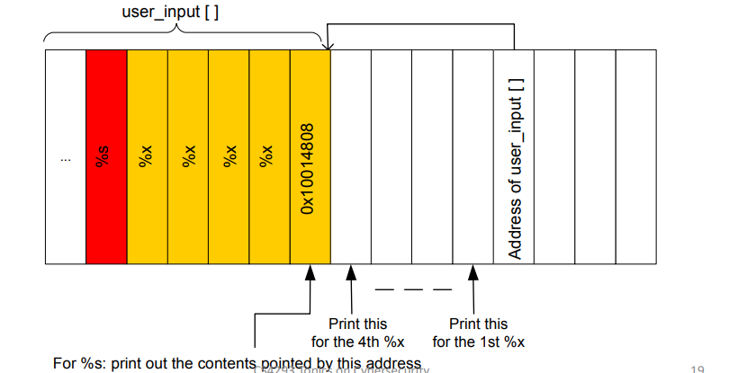
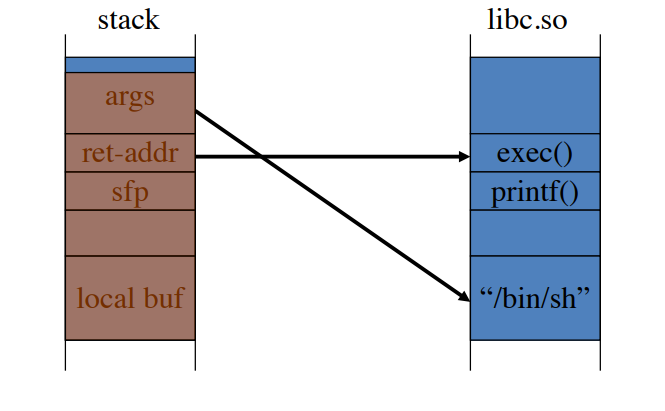
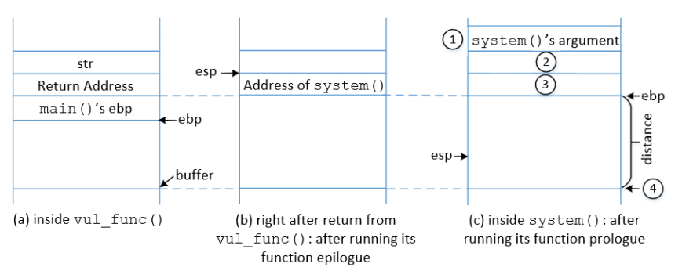
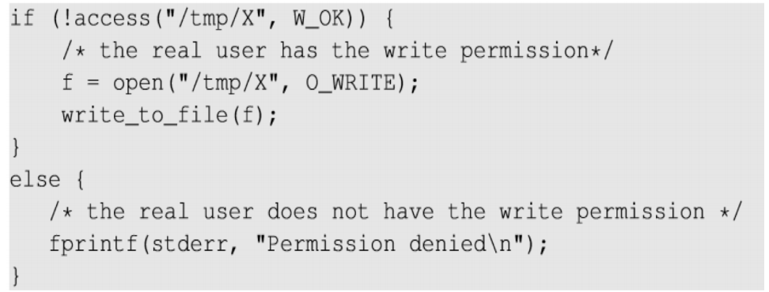
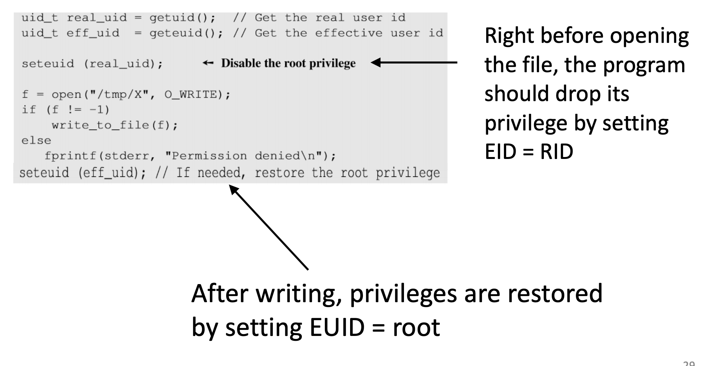

# CS4293 Final Review

[TOC]

## Tasks

* Lectures (finished)
* Assignments (finished)
* Tutorials (finished)
* Mid-term questions (finished)
* 15 problems (time is more limited)
  * 10 short problems (one hour)
  * 5 big problems (one hour) (long description, find keywords, don’t need to read all, focus on the question)

## Question

* In chapter 7, TCP connection Spoofing, why it cannot be prevent by IPSec?
* In chapter 7, what is the difference between the Bot net and normal DDoS
* 

## Overview of Practical Security

* Web attacker 
  * least privilege
  * Control attacker.com 
  * Can obtain SSL/TLS certificate for attacker.com 
  * User visits attacker.com or runs attacker’s Facebook app 
* Network attacker 
  * Passive: Wireless eavesdropper
  * Active: Evil router, DNS poisoning 
* OS/Malware attacker 
  * highest privilege
  * Attacker escapes browser isolation mechanisms and run separately under control of OS

## Chapter 5: Operating System Security

### Buffer-overflow and Memory Safety

* What is needed
  * C functions
  * Memory manager: stack & heap
  * System call, `execve`
  * Which CPU and OS used on the target machine
    * e.g. X86 Linux => little endian (reverse order in memory)
* **Memory layout (from high to low)**
  * Reserved for kernel
  * Stack (growth from high to low) => function call (%esp register stores the top of the stack)
  * Library => shared libraries
  * Heap => dynamically generate data (malloc)
  * Static **data segment** => static variables initialized in the source code
  * **text segment** => machine code
  * unused
* **Stack frame (from high to low)**
  * arguments of the function (4 bytes each)
  * return address (4 bytes)
  * pointer of the previous stack frame (4 bytes)
  * **expectation handlers**
  * local variables initialized in the function
* When does buffer overflow happen:  
  * buffer overflow happens when there is a function that fails to check the boundary for memory copy task. 
  * An input to the running process exceeds the length of the buffer
  * The memory will be overwritten
* Effect of a buffer overflow
  * It will cause segmentation fault in the normal cases
  * If the return address overwritten is well designed, it will point to malicious code
  * If the current process is run in root privilege, attacker may get the root shell. 
* How to get a root shell by using buffer overflow
  * prepare shell code: 
    * write code in C
    * compile and find the compilation code
    * format instructions as characters in a string
  * Stack Exploit
    * insert the shell code in a proper position in the copied string
    * also calculate the return address and put it in the corresponding position in the string
  * The NOP slide
    * It is difficult for attackers to get the specific address
    * Use rough address, add NOP slides between the return address position and the start of the shell code
    * Perform fuzzy testing on the position
  * Important details
    * Do not include `\0` in the shellcode, which will end the string copy
    * Make sure there will not be segmentation fault before the shell code is called
* Unsafe (vulnerable) libc functions and safe functions
  * unsafe: `strcpy`, `strcat`, `gets`, `scanf`
  * safe libc versions: `strncpy`, `strncat` etc.
    * require use input the length of the copied array
    * cause unterminated array since it is possible that the source array is too long
    * need manually add `\0`
* Vulnerabilities of Buffer overflow except return address
  * Function pointer (stack or heap) => e.g. heap and object function
    * method 1
      * Overwrite the vtable of an object, point it to shell code
      * Call any function of the object
    * method 2
      * Overwrite the vtable of an object, point it to corrupted vtable
      * Call any function of the object
  * Exception handler (stack)
    * overwrite the handler
    * make exception
  * Longjmp buffers: `longjmp(pos)` 
    * overflowing buf next to pos overrides value of pos
* Step of general control Hijacking
  * overwrite step: find some way to modify a control flow pointer to point to **shellcode, library entry point**
  * activate step: activate the modified control flow pointer
* How to find overflows
  * run server code on local machine
  * use software to generate malform input
  * find out crash cases

### More Control Hijacking Attacks

* Integer overflows: 
  * overflowed integer could be negative or zero
  * if the boundary checking use the overflowed integer, it will run the memory copy code
* Double free
  * memory manager will write data to the specific position
  * By overwriting particular registers or memory spaces, an attacker can trick the program into executing code of his/her own choosing, often resulting in an interactive shell with elevated permissions.

### Format String Vulnerabilities

* important format : `%n` => instead of printing, it writes number of bytes printed

* `printf` property

  * maintain a pointer point to the first parameter
  * move the pointer to construct new string

* Miss-match case situation => will `printf` be executed?

  * Compiler => `printf `is designed to have multiple parameters
  * Run time => `printf `will automatically move the pointer

* Vulnerabilities

  * crash the program: DoS/segmentation fault =>  use a list of `%s` without parameter

  * view memory at any location => construct `%s` and `%x` format tokens

    * e.g. `printf(“\x10\x01\x48\x08_%x_%x_%x_%x_%s")` 
    * want print `\x10\x01\x48\x08`
    * if we want to print string, the address of format string is stored in a parameter, and the address of the target string is stored in another parameter
    * two parameters of `printf ` are next to each other, therefore, the address of output parameters are next to the address of format string
    * we need to figure out the distance between the address of format string and the content of the format string. 
    * each `%x` is four bytes (one slot in memory)

    

  * write to memory at any location

    * replace `%s` by `%n`, write the string length to the target address
    * control the value written `printf(“%08x.%08x.%08x.%08x.%n”)`

### Defenses and Return-to-libc

* Guideline

  * fix bugs
    * audit software
    * rewrite in java which is safe language
  * prevent code execution
  * add run time integrity checking

* Countermeasure I: non-executable stack (overflow protection)

  * marking heap and stack as non-executable
  * limitations
    * does not prevent return-to-libc
    * some apps need executable heap

* Return-to-libc attack

  

  * change the return address to the corresponding function in the library

  * change the argument to the function parameter you want to use (this can be set by the environment variable)

    * Notice that the program used to find the address of the environment variable need to have the same length of program name (which is also an environment variable).

  * find the addresses of library function and argument using GDB

  * Important registers: ebp (frame pointer), esp (stack pointer)

    * notice that the return address points to the machine code part (in lower address)
    * for machine code, if there is no corresponding stack frame, a new one will be created
    * `system` will create new frame, and the content of the half of the new frame is from the overflowed memory. 
    * put `exit` function in the position 2

    

* Countermeasure II: Address randomization (overflow protection)
  * Idea: 
    * ASLR(Address Space Layout Randomization): start both heap and stack at random location and map shared libraries to rand location in process memory
    * Sys-call randomization: randomize sys-call id’s
    * Instruction Set Randomization (ISR)
  * Limitation: Randomness can still be limited (only shift by a random value)
  
* Countermeasure III: StackGuard (overflow detection) => notice that this method only protect stack

  * Canary: Embed “canaries (金丝雀)” between the local variable and the exception handler, stack frame pointer, return address and the arguments and verify their integrity prior to function return
    * Canary Types
      * Random canary: 
        * insert random string to the stack, check it when return from the function
          * if change, exist program
          * vulnerable to DoS attack
        * Attacker must guess the random string to lauch attack
      * Terminator canary:
        * Insert canary = `{0, newline, linefeed, EOF}` 
        * String function will not copy beyond terminator
    * Canary don’t provide full proof protection => some techniques can leave canary unchanged
      * integer overflow still possible
      * /GS cannot protect exception handler without /SAFESEH and /SEHOP
      * heap-based attack still possible
  * Heap protection: PointGuard
    * **Function pointers and setjmp buffers** are protected by one-time pad encryption (XOR random cookie) (when call the function, XOR the cookie again)
    * Less effective, more noticeable performance effects
  * ProPolice: Canary only protect the SFP, return address, arguments … If there is a function pointer in the local variables, it can still overflow it
    * Rearrange stack layout to prevent ptr overflow, make sure local string buffers are the first one in the local variables => new stack structure (from high to low)
      * args
      * ret addr
      * SFP
      * CANARY
      * **local string buffers**
      * local non-buffer variables (pointers but not array (not constant pointer))
      * copy of pointer args
  * /GS: Combination of ProPolice and Random canary (becomes mandatory after Visual Studio 2010)
  * Limitations: Cannot protect exception handler

* Countermeasure IV: SAFESEH and SEHOP

  * Evading /GS with exception handlers: 
    * When exception is thrown, dispatcher walks up exception list until handler is found (handler may point to attacker’s code after overflow)
    * Canary doesn’t work since it is only checked after returning, exception is triggered before that
  * /SAFESEH: linker flag
    * linker produce whitelist of exception handlers, system will not jump to exception handler not on the list
  * /SEHOP: platform defense
    * Corrupt SEH: corrupt the “next” entry in SEH list
    * SEHOP: add a dummy recored at top of SEH list => check the integrity
    * When exception occurs, dispatcher walks up list and verifies dummy record is there, if not, terminates process
  * Limitation: require recompilation

* Countermeasure V: Libsafe (format string => not overflow)

  * Dynamically loaded library (replace library by safe version) => for the cases cannot recompile the entire code base
  * Intercepts calls to `strcpy(dest, src)` 
    * Validates sufficient space in current stack frame `|frame_pointer - dest|>strlen(src)` 
    * If so do copy, otherwise, terminates the application
    * But there might be funciton pointer in the local variables => cannot protect
  * Limitation: limited protection (see the strcpy case)

* Countermeasure VI: StackShield & Control Flow Integrity

  * StackShield
    * At function prologue, copy return address RET and SFP to “safe” location (beginning of data segment)
    * Upon return, check that RET and SFP is equal to copy
    * Implemented as assembler file processor (GCC) 
  * CFI: Combination of static and dynamic checking
    * statically determine program control flow
    * dynamically enforce control flow integrity
  * Limitation: many different kinds of attacks. Not one silver bullet defense

* Summary

  | Defenses/Mitigations | Code Injection                                               | Arc Injection                                                |
  | -------------------- | ------------------------------------------------------------ | ------------------------------------------------------------ |
  | Stack                | Non-executable (NX)*, ASLR, StackGuard(Canaries), ProPolice, /GS, Libsafe, StackShield | ASLR, StackGuard(Canaries), ProPolice, /GS, Libsafe, StackShield |
  | Heap                 | Non-executable (NX)*, ASLR, PointGuard                       | ASLR, PointGuard                                             |
  | Exception Handler    | Non-executable (NX)*, ASLR, /SAFESEH, /SEHOP                 | ASLR, /SAFESEH, /SEHOP                                       |

### Heap Spray Attacks

* Problem of previous mentioned attack: attacker does not know where the shell code is on the heap even if they can overflow the vtable
* Attack method: use JS to spray (place shellcode among the heap as much as possible) heap with shell code (and NOP slides), then point vtable ptr anywhere in spray area
* Ehancement: Heap Feng Shui (lauch attack with out spraying)
* Countermeasures
  * PointGuard
  * Better browser architecture (store the JS string in a separate heap from browser heap) (browser sandbox)
  * OpenBSD heap overflow protection (non-writable pages in the heap (cannot passover the pages))
  * Nozzel: detect sprays by prevalence of code (code density is higher than a threshold)

### Race Condition Vulnerabilities

* When does it happen: Two concurrent threads of execution access a shared resource and may have different result upon different order of the execution

  * Concurrency property: Two control flows executing concurrently
  * Shared object property: Concurrent flows must access a common shared *race object*
  * Change state property: At least one control flow must alter the state of the *race object*
  * There is a gap between Time-of-Check and Time-of-Use
  * attacker may change the output by putting influence on the uncontrollable events

* Specific attack

  

  * This is a root-owned set-uid program with effective UID root and Real UID seed
    * `access` check the real uid
    * `open` check the effective uid
    * only allow user change their own files 
  * Vulnerable between `acess` and `open`, another program can link the `/tmp/x` to some important root owned files (attacker keep running this until CPU arrange the process as the order he wanted)

* Countermeasures

  * Atomic Operations: elimate the window of the check and use

    * `open(file, O_WRITE | O_REAL_USER_ID)` 
    * with this option, only check real uid => check and use on the function `open` its own
    * just idea, not implemented in any OS

  * Repeating Check and Use: Make it difficult to win the “race” => Raise the bar

  * Sticky Symlink Protection: To prevent creating symbolic links (system level)

    * When enabled, only create link when the owner of the symlink matches either the **follower** or the **directory owner**
    * In our example, `/tmp` is also owned by the root, follower is also the root

  * Principles of Least Privilege: To prevcent the damage after race is won (usage level)

    

## Chapter 6: Web Security

### Introduction

* Image tag problem
  * How to inject bad link
  * How to hide images
  * How to attract victims
  * What is the vulnerability from the perspective of browser if we use bad image
* PKI
  * Challenges: hash, bad CA, cannot find by user
  * Consequence of compromised CA: how to attack if you have a CA? 
  * Counter measures
    * Certificate Transparency
    * Certificate Pinning
      * HPKP - HTTP Public Key Pinning 
      * HSTS - HTTP Strict Transport Security 
    * Keys for people => key base

### Web Security Goals and Threat Model

* Goals of web security
  * site - site
  * user - site
* Threats => what if we didn’t achieve the goals
* Two open web application security projects
  * Broken authentication & session management
    * session hijacking techniques
    * solutions
  * Broken Access Control (CSRF, XSS, SQL injection)
    * how does attacker manipulate the url
      * object in DB
      * files
    * solutions

### Isolation

* Principals
  * what is isolation
  * what is least privilege principle
* Targets
  * Should-be-safe activities (3) 
  * Goals
    * user-site: Browser SandBox
    * site-site: Same origin policy
      * cookie: 
        * website can read: same domain and path
        * set: same domain suffix => vulnerable
      * script: same as page / frame (once imported/embedded, treated as the same origin => vulnerable)
      * DOM: protocol + domain + port
* Example: cookie theft
  * what does cookie do (2 uses)
  * what is the most common technique to still cookie
  * what application layer protocol should be used to avoid cookie theft
  * extra protections => types of cookies
* Cross-Origin Communication (sometimes enable): what are the methods to achieve and drawbacks of these methods
  * access control white list
  * html5 postMessages between frames
* Browser Plugin
  * Examples
  * Goal
  * Problem
  * Good news
* Browser Extensions
  * Examples
  * Goal
  * How to protect from malicious websites
    * privilege separation
    * least privilege
  * Problem: malicious extensions

### Cross-Site Request Forgery

* What is CSRF (bad website, cookie, link, form)
* Main reason: separate origin policy does not control export
* Steps of CSRF between client, server, and attacker(4 steps)

* How to launch
  * GET: hidden image
  * POST: JavaScript
* Countermeasure: 
  * origin headers validation (new headers)
    * why not use refer header => it might be changed for some reasons
  * freshness (token) => nonce based request form

### Cross-Site Scripting

* What is XSS (script, injection, worm)
* Types of XSS
  * reflected: 
    * steps
      * attacker sends bad link
      * victim clicks bad link and connects to the server
      * server reflect back the webpage containing the script
      * victim execute the script
  * stored
    * steps
      * attacker stores bad link in the server
      * victim visits the corresponding page and request the content from server
      * victim execute the script
    * types
      * store self introduction
      * upload “image” which is actually script
  * DOM-based: instead of vulnerable server side code, the JS on client side is vulnerable (document.write())
    * attacker send bad link with malicious input
    * victim click the link, and JS is executed
* Countermeasures
  * input validation: white list a pattern, only allow this pattern
  * input Escaping or Sanitization: switch ‘special characters’
  * use less powerful API (most important): 
    * disable inline script, restrict imported scripts if possible
    * prefer `innterText` over `innerHTML`

### Command Injection

* What is command injection
  * the php file may call `system `function to execute command
  * inject new command by appending `;`
  * notice we need to encode url
* Countermeasures
  * input validation:
    * black list: easy to bypass (semi-colon => pipes => backticks => dollar sign ...)
    * white list a pattern, only allow this pattern (use regular expression)
  * input Escaping or Sanitization: switch ‘special characters’
  * use less powerful API (most important): 
    - `system` is too powerful

### SQL Injection

* What is SQL injection (SQL, multiple command)
  * in the `WHERE` phrase, attacker my use bad input such as `admin'--` to comment following sentences
  * New command can be appended by using `admin';DROP ...;--`
* Countermeasures
  - input validation: white list a pattern, only allow this pattern (use regular expression) 
    - e.g. only allow ‘a-z, A-Z, .’ for username => still can be bypassed by using malicious password input `‘OR 1=1;--` 
  - input Escaping or Sanitization: switch ‘special characters’, pairwise `‘` 
  - use less powerful API (most important): 
    - Use SQL template
    - All the user inputs are treated as data

### Web Privacy

* why web tracking: 
  * website makes money
  * analyze your behavior, recommend ads, personalized content
* Third-party web tracking: Amazon API makes sure you are tracked even if you didn’t click third party link
* Understand tracking
  * first party (you visit), third party (iframes, ads)
  * third party cookie can invite any number of other third-parties
  * types
    - anonymous tracking: third-party cookies containing unique identifiers
      - re-identify a user
      - send the communication id + visited site back to the tracker
    - other tracking: there is a facebook link under a website, you can comment or share
      - user click tracker’s website in the visited website
* Measure tracking
  * How prevalent: 
    * method: use web crawler based on our taxonomy
    * result: very prevalent
  * How much browsing history tracked
    * Challenges
      * Privacy concerns.
      * Users may not browse realistically while monitored
    * Method: Use public AOL search logs to create 30
      hypothetical browsing histories.
    * Result: a large fraction
* Defenses
  * Do not track header => not technical defense: trackers must honor the request
  * Private browsing mode
  * Third-party cookie blocking => only block set cookie not send cookie in some browser, if already set, can still send
  * Browser add-ons => based on blacklist

## Chapter 7: Network Protocol Security and Defenses

### Networks: IP and TCP

* IP:
  * How does it work
    * routing
    * fragmentation and reassembly
    * error reporting
    * TTL field
  * Vulnerabilities
    * Confidentiality => eavesdropping
    * Integrity => forge
    * Availability => bandwidth / censoring
    * Authenticity => spoofing
  * Countermeasure
    * IPSec
      * IKE
      * AH/ESP
    * Two modes
* TCP
  * How does it work
    * three-way handshake
    * acknowledgement
    * congestion control
  * Vulnerabilities
    * passed by untrusted host => eavesdropping
    * easy guess sqn => spoofing
    * congestion control => DoS
  * Countermeasures
    * TLS/SSL
    * Random initialize SQN
    * no solution to congestion control problem

### Routing Vulnerabilities

* BGP:
  * what is BGP
  * Vulnerability: 
    * authenticity
    * DoS
  * Countermeasure: SBGP
    * IPSec
    * PKI & validation => BGP message

### Domain Name System

* DNS
  * Protocol
  * Packet
    * UDP + IP with query ID (can be guessed)
  * Vulnerability
    * poisoning => keep send bad DNS-IP mapping
  * Countermeasure
    * entity authentication
    * Increase query ID size

### DoS and DDoS

* What is DOS
* Main vulnerability => effort amplification
* Mode of attack
  * Consumption of resource
    * ping of death
    * smurf attack
    * TCP SYN flooding (handshake)
  * Disruption or deletion of configuration information => BGP
  * Disruption of physical resource
    * cut cables
    * physical jammers
* Countermeasures of DoS
  * monitoring
  * right limiting
* what is DDoS
* what is Bot Net
* Countermeasures of DDoS
  * is it easy to dismantling?