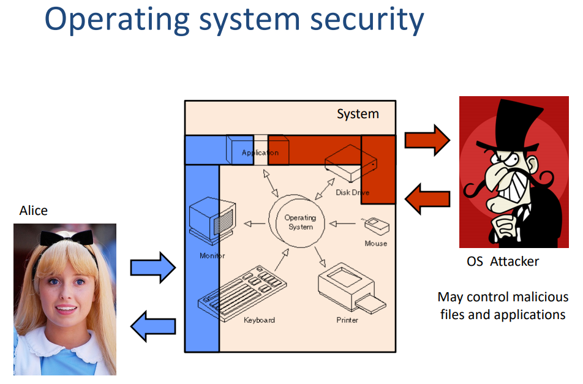
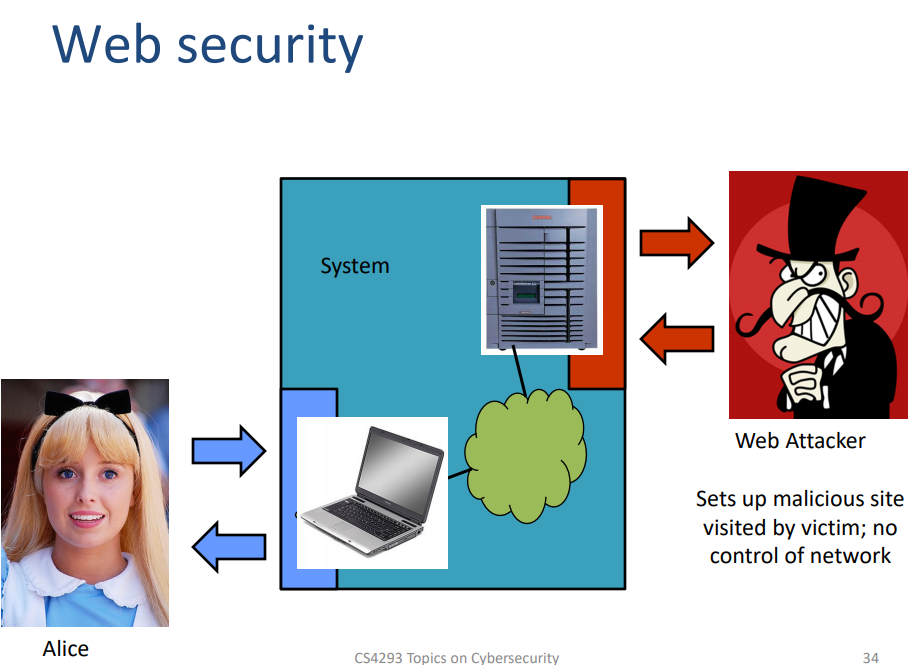
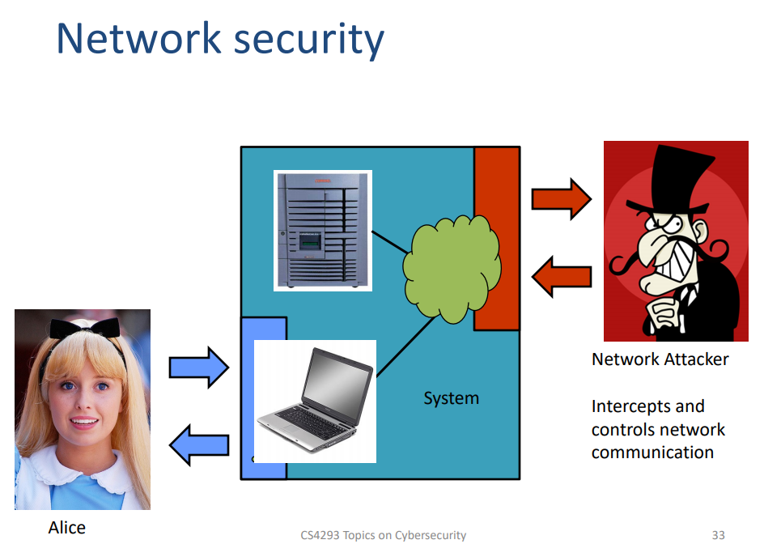

# CS4293 Final Review

[TOC]

## Question

* In chapter 7, TCP connection Spoofing, why it cannot be prevent by IPSec?
* In chapter 7, what is the difference between the Bot net and normal DDoS

## Overview of Practical Seucrity

* Web attacker 
  * least privilege
  * Control attacker.com 
  * Can obtain SSL/TLS certificate for attacker.com 
  * User visits attacker.com or runs attacker’s Facebook app 
* Network attacker 
  * Passive: Wireless eavesdropper
  * Active: Evil router, DNS poisoning 
* OS/Malware attacker 
  * highest privilege
  * Attacker escapes browser isolation mechanisms and run separately under control of OS

## Chapter 5: Operating System Security

## Chapter 6: Web Security

### Introduction

* Notice that for URL, special characters are encoded as hex
* Image tag security issues
  * Many embedded links in the web page for rendering, which might be some bad things, image is an example
  * Communicate with other site by adding the url of bad website to the src field
  * Make the height and width of the image small to hide it
  * Spoof other sites by adding logos that fool a user
  * **A web page can send information to any site**
* PKI certificate: used to identify the public keys
  * Challenges
    * Hash collisions => SHA-1 used before signature (difficult to change old hash function or CAs)
    * Weak security at CAs: allow bad certificates issued
    * User don’t notice when attacks happen
  * Consequences of compromised CA
    * Attacker use DNS to poison the mapping of the legitimate domain name to the correct IP address
    * Authenticate the bad site as real site by the compromised CA
    * Decrypt all data sent by users
  * Countermeasures or CA problem
    * Certificate Transparency
      * Problem: browsers will think nothing is wrong with a rogue(流氓) certificate until revoked(撤销)
      * Goal: make it impossible for a CA to issue a bad certificate for a domain without the owner of that domain knowing
      * Approach: auditable certificate logs => if CA wants to issue some `google.com` certificates, we want Google knows it
      * Need extra auditing system: 
        * what if it is compromised again? **Attacker can change the log**  => cat and mouse
        * May use block chain?
    * Certificate Pinning
      * Trust on first access: tells browser how to act on subsequent connections (assume the very first connection is not attacked)
        * Record the public key of the first time
        * Always check whether the public key is changed
      * HPKP – HTTP Public Key Pinning 
        * Use these keys!
        * HTTP response header field “Public-Key-Pins” 
      * HSTS – HTTP Strict Transport Security 
        * **Only** access server via **HTTPS** 
        * HTTP response header field "Strict-Transport-Security"
    * Keys for People: Keybase => use other trusted account to prove untrusted account for a person
      * Rely on existing trust of a person’s ownership of other accounts (e.g., Twitter, GitHub,website) 
      * Each user publishes signed proofs to their linked account

### Web Security Goals and Threat Model

* Goals of web security
  * Safely browse the web: Users should be able to visit a variety of web sites, without incurring harm:
    * User-site: No stolen information (without user’s permission)
    * Site-site: Site A cannot compromise session at Site B
  * Secure web applications: Applications delivered over the web should have the **same security properties we require for stand-alone applications** => should not jump out the box and compromise other privilege
* Threats
  * Web defacement 
    * loss of reputation (clients, shareholders) 
    * fear, uncertainty and doubt 
  * information disclosure (lost data confidentiality) e.g. business secrets, financial information, client database, medical data, government documents
  * data loss (or lost data integrity) 
  * unauthorized access: functionality of the application abused 
  * denial of service: loss of availability or functionality (and revenue) 
  * “foot in the door” (attacker inside the firewall)
* Two important open web application security project
  * Broken authentication & session management
    * Understand session hijacking techniques, e.g.: 
      * session fixation (attacker sets victim’s session id) 
      * stealing session id: eavesdropping (if not https), XSS 
    * Trust the solution offered by the platform / language and follow its recommendations (for code, configuration etc.)
    * Additionally: 
      * generate new session ID on login (do not reuse old ones) 
      * use cookies for storing session id 
      * set session timeout and provide logout possibility 
      * consider enabling “same IP” policy (not always possible) => website from same IP shares information (separate origin)
      * check referer (previous URL), user agent (browser version) 
      * require https (at least for the login / password transfer)
  * Broken Access Control (CSRF, XSS, SQL injection)
    * Attacker manipulates the URL or form values to get unauthorized access 
      * to objects (data in a database, objects in memory etc.):
        *  http://shop.com/cart?id=413246 (your cart)
        *  http://shop.com/cart?id=123456 (someone else’s cart ?) 
      * to files:
        *  http://s.ch/?page=home -> home.php
        *  http://s.ch/?page=/etc/passwd%00 -> /etc/passwd 
    * Solution: 
      * avoid exposing IDs, keys, filenames to users if possible 
      * validate input, accept only correct values 
      * verify authorization to all accessed objects (files, data etc.)

### Isolation

* Principles
  * Isolation: Separate web applications from each other, and separate browser components from each other
  * Principal of Least Privilege: Give components only the permissions they need to operate
* Target
  * Should-be-safe activities
    * Safe to visit an evil website
    * Safe to visit two pages at the same time
    * Safe delegation
  * Goals
    * Browser Sandbox: Protect local system from web attacker
      * No direct file access, limited access to OS,network, browser data, content from other websites
      * Tabs (new: also iframes!) in their ownprocesses
      * Implementation is browser and OS specific*
    * Same Origin Policy: Protect/isolate web content from other web content
      * Websites from the same origin can share information, otherwise cannot
      * definition of the “same origin” is different for different resource
        * cookies (Websites can only read/receive/set cookies from the same domain): domain and path of setting cookie URL
        * javascript (When a website includes a script, that scriptruns in the context of the embedding website.): 
          * imported: same origin as that **page or frame**
          * embedded: same origin as that **page or frame**
        * DOM (Only code fromsame origin can access HTML elements on another site (or in an iframe).): `protocol://host:port` defines origin
* Attack example: cookie theft
  * Cookie:
    * Contains authentication information => steal cookie = steal account
    * Can be theft with malicious JS
    * Btw: Cookie theft via network eavesdropping (use HTTPS over HTTP)
  * Cookie types
    * Simple Cookie: Can be read by anyone and go everywhere
    * HttpOnly Cookie: Can’t be read by JS
    * Secure Cookie: Can only sent by secure connection

## Chapter 7: Network Protocol Security and Defenses

### Networks: IP and TCP

* IP
  * Vulnerability: IP and TCP headers are not protected well, easy to override using raw packets
    * No encryption and for confidentiality (Eavesdropping)
    * No source authentication (spoof source address)
    * No integrity checking ( content forgeries, redirections, and man-in-the-middle
      attacks)
    * No bandwidth constraints (DoS)
  * Countermeasure: IPSec (AH (integrity) , ESP (integrity + confidentiality) headers), Tunnel Mode
* TCP
  * Vulnerability:
    * packets pass by untrusted hosts => eavesdropping. packet sniffing 
    * TCP state can be easy to guess  (guess the sequence number)
      * Attack: After victim setting up a TCP connection with server, an attacker pretends to be the victim by changing the IP address of his packet
    * DoS vulnerabilities: DDoS
      * Attacker can send Reset packet to close connection
      * TCP allows a large window of sequence number, which makes it easier to guess the sequence number
    * Optimistic ACK Attack
      * Takes advantage of the TCP congestion control
      * It begins with a client sending out ACKs for data segments it hasn’t yet received
      * makes the servers TCP stack believe that there is a large amount of bandwidth available and thus increase cwnd
      * This leads to the attacker providing more optimistic ACKs, and eventually bandwidth use beyond what the server has available
      * This can also be played out across multiple servers, with enough congestion that a certain section of the network is no longer reachable
      * no practical solutions to this problem
  * Countermeasure: 
    * SSL protocol => packet sniffing (confidentiality)
    * Random initial TCP sequence numbers (should be unpredictable) => TCP states and DoS

### Routing Vulnerabilities

* ARP (address resolution protocol): IP address => ethernet address
  - Used to find the physical connected neighbors in the network
* OSPF: used for routing **within** an anonymous system (e.g. CityU network)
* BGP: routing between the anonymous systems
  * Protocol
    * Different router learns information from each other
  * Vulnerability: BGP packets are un-authenticated
    - Attacker cause entire Internet to send traffic for a victim IP to attacker’s address => DoS
    - In the interdomain routing, one point failure will be populated to all the network
  * Countermeasure: S-BGP (raise the bar of fake advertisement)
    - **IPsec**: secure point-to-point router communication
    - **PKI**: authorization frame for all S-BGP entities
    - Attestations: **digitally-signed** authorizations
      - Address: authorization to advertise specified address blocks
      - Route: Validation of UPDATEs based on a new path attribute, using PKI certificates and attestations

### Domain Name System

* DNS query:
  * Protocol
    * Client send request to local DNS resolver (e.g. CityU resolver), and local DNS resolver sends query to the higher level resolver
    * Sometimes, DNS responses and negative queries(nonexistent sites e.g. misspelling) are cached for a quicker response. The data cached also has TTL(time to live)
  * Packet: application level protocol using UDP/IP
    * UDP header, IP header
    * DNS header including query ID (16 bit random value, link response to query)
  * Vulnerability: No protocol widely used to protect DNS request packet
    * Interception of requests or compromise of DNS server can result in incorrect or malicious response 
    * DNS poison attack
      * Attacker can keep sending (guessing the QID) bad mapping from domain name and IP address to a local DNS resolver. It will get a probability to success.
  * Countermeasure: 
    * authenticated requests/responses => provided by DNSsec ... but few use
      * Provides origin authentication and integrity
      * New Resource Records, PKI
    * Increase Query ID size: 
      * randomize src port, add another 11 bits to guess => turn to several hours to attack
      * ask every query twice => raise the bar for attack, but DNS system cannot handle the load

### DoS and DDoS

* Definition: A transient or persistent set of actions by a third party preventing authorized users from access to or use of a resource or service => need not be launched by malicious third party, for malicious party it is called DoS **attack**
* Mode of attack
  * Consumption of resources
    * types
      * Network connectivity
      * bandwidth consumption
    * Vulnerability (Effort Amplification(放大)): Once your it takes less effort for attacker than the server for a message, it is vulnerable to DoS attack. e.g.:
      - ping of death => attacker construct data frames that appear to be fragments of the same application layer data. The sum of the sizes of the data frames is greater than the limit, which will cause buffer overflow. 
      - Smurf Attack: Send request to gateway with echo function and set the echo back IP address to victim’s address
      - TCP SYN Flooding: Server allocate memory for the coming TCP handshake. Attacker send the request that spoofing the clients, server save the request state and run out of resource.  
  * Disruption or deletion of configuration information
    * An improperly configured computer may not perform well or may not operate at all
    * Vulnerability: An intruder may be able to alter or destroy configuration information that prevents you from using your computer or network (BGP example)
  * Disruption of physical resources
    * cutting cables, power cuts for wired network
    * physical jammers for wireless network (exist for a number of frequencies and protocols)
* Countermeasure
  * Monitoring
  * Right limiting: don’t want to many request from the same user
* DDoS: use multiple attackers on a network
  * Master program installed on one computer, which communicates to a number of agent programs installed on compromised computers. Agents initiate attack simultaneously
  * Can be injected to legitimate softwares and uploaded to network
* Bot Networks
  * Infection Mechanisms: web download, mail attachments, scan/exploit
  * Command and Control (C&C): Centralized, P2P, unstructured
  * Communication Protocols: IRC, HTTP, P2P, proprietary
  * Payload/Actions: Spam, DDoS, Keyloggers, Clickfraud
  * Counter measure: 
    * Building one could be a one man job
    * Easier to disable than to destroy (the attacked system can solve the problem but cannot destroy the bot net)