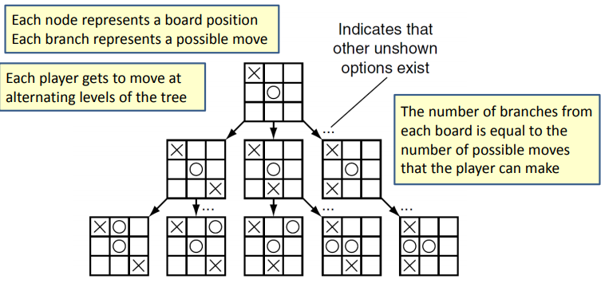
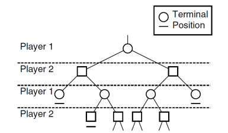
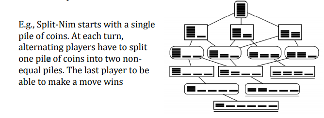
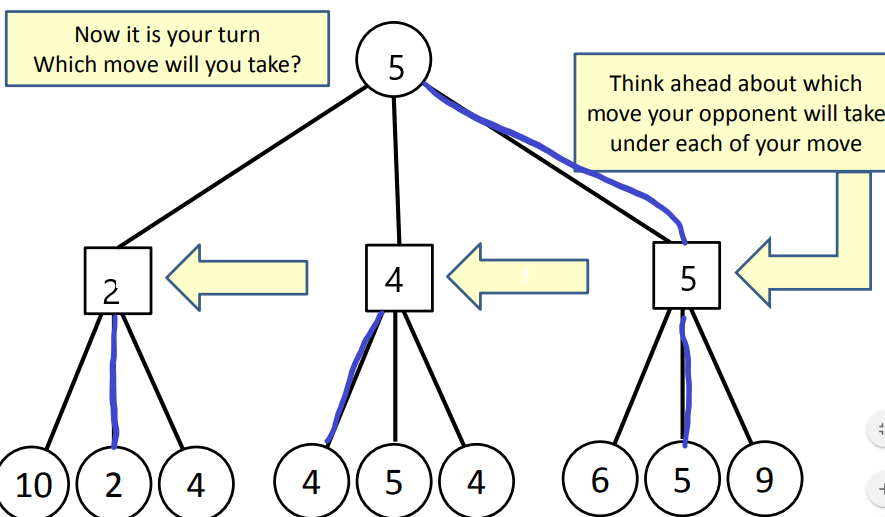
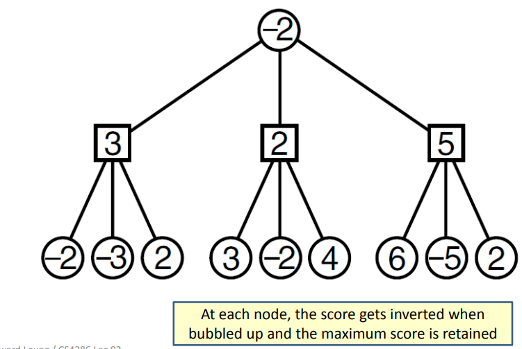
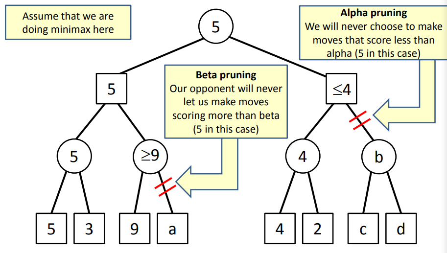
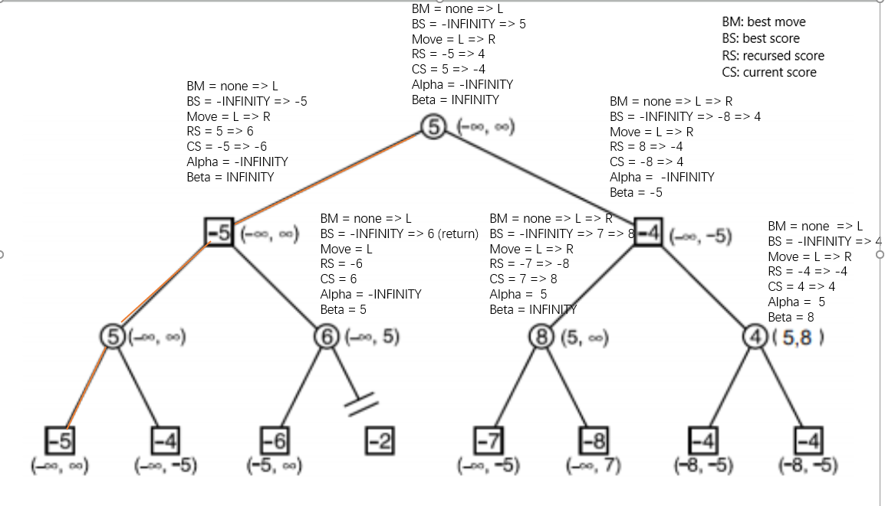
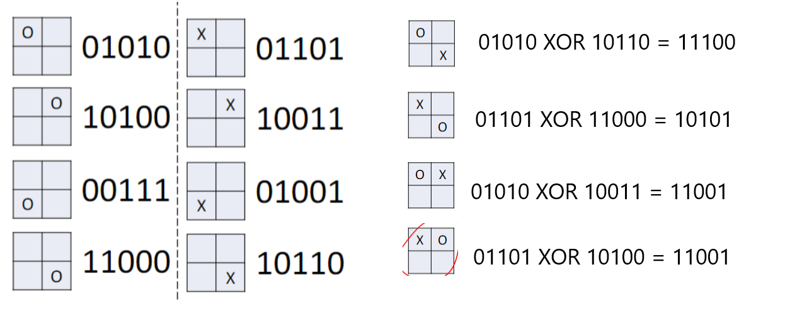

# CS4386: AI Game Programming

## Lecture01: Introduction

### Course Information

* Textbook and reference
  * Text book: [Artificial Intelligence for Games (Second Edition), Ian Millington and John Funge, Morgan Kaufmann, 2009](<https://www.sciencedirect.com/book/9780123747310/artificial-intelligence-for-games>)
  * Reference: [Artificial Intelligence and Games, Georgios N. Yannakakis and Julian Togelius, Springer, 2018](<https://link.springer.com/book/10.1007/978-3-319-63519-4>)
* Assessment
  * course work(50%):
    * Assignments(35%)
    * Quizzes(15%)
  * final(50%)

------------------

### History of AI and Games

* Alan Turing’s Chess Program:
  * (re)invented Minimax algorithm and use it to play chess in 1950
* Tic-Tac-Toe game by A.S. Douglas:
  * The first software to master a game is a digital version of the Tic-Tc-Toe game, also known as Noughts and Crosses (or OXO) in 1952
* Arthur Samuel’s Checker Program
  * Arthur Samuel invented the form of machine learning that is now called reinforcement learning using a program that learned to play Checkers by playing against itself in 1956
* Early Research on Game-Playing AI
  * Classic board games such as Checkers and Chess are the focus
  * These game have complexity arising from simple rules
* Checkers: 
  * 3 decades of research on tree search
  * Chinook Checkers player managed to beat the World Checkers Champion in 1994
  * Checkers game was solved in 2007
* Chess: 
  * IBM’s Deep Blue
  * minmax algorithm
  * won the grandmaster of Chess in 1997
* Backgammon: 
  * Gerald Tesauro developed the backgammon software named TDGammon in 1992
  * Using artificial neural network trained via temporal difference learning by playing backgammon against itself a few million times
* Alpha Go
  * Won top human player in 2016, 2017

* Video games
  * classic board game: discrete turn-based and full state
  * Research community start to focus on developing AI for playing games
  * 2014 Google DeepMind developed an algorithm achieve super-human skill level on some console video games
* Ms Pac-Man: solved in 2017 by Microsoft Maluuba team using hybrid reward architecture reinforcement learning
* Diablo III: 
  * created some of their content algorithmically during runtime, rather than having it designed by humans
  * random scripted events and randomized environments which aims to increase replay value of the game

---------------------

### Game and AI

* Game to AI
  * Games are **hard** and **interesting** problems
    * a lot of state => difficult for searching
  * Rich human-computer interaction
    * option of human linked to the response
    * Interaction between the player and the game is of key importance for AI research as it gives algorithms access to rich player experience stimuli and player emotional manifestations
  * Games are popular
  * Games challenge all core areas of AI
    * Signal processing
    * Machine learning
    * Tree search
    * Knowledge representation and reasoning, NLP
    * Planning and navigation
  * Games Best Realize Long-Term Goals of AI
    * Social and Emotional Intelligence
    * Computational Creativity
    * General Intelligence
* AI to Game
  * AI Plays and Improves Your Game
  * More Content, Better Content

------------------

## Lecture02: Board Games

### Game Tree and Board Games

* Board Games: The earliest application of AI to computer games

* Goal of the game

  * Zero-sum game: your win is your opponent’s loss, 1 point for your win which is equivalent to your opponent’s lose
  * Information
    * Perfect information: All players know about the state of the game: the options and result of every move, e.g. chess
    * Imperfect information: There is random element

* Game Tree: 

  * Any turn based game can be represented as a game tree

  

  * Terminal positions: Board positions do not have any possible moves

  * For each terminal position, a final score is given to each player, e.g. $+1$ for a win and $-1$ for a loss

  * Draws are also allowed, scoring $0$. In a zero-sum game, the final scores for each player will add up to zero

    

* Branching Factor and Depth

  * Branching factor: The number of branches at each branching point in the tree => indicate how difficult a computer will find it to play the game
  * Depth: Maximum number of turns => tic-tac-toe 9

* Transposition: 

  * Possible to arrive at the same board position several times in a game

  * Having the same board position from different sequences of moves is called transposition

    

  * Transposition table is used to store the state

* Static Evaluation Function: look at the current state of the board and score it
  from the point of view of one player

  * Terminal position: Score = Final score of the game
  * In the middle of the game: The score should reflect how likely a player is to win the game from that board position

* Simple move choice: With a good static evaluation function, the computer can select a move by scoring the positions that will result after making each possible move and choosing the highest score

  * Single move: Choose max value for your self, and choose min value for your opponent

  * Two move: Choose the max-min value => predict what will the opponent do

    * Circle represents your round, square represents your opponent’s round

    

-------------------------

### Search Algorithm

* Minimaxing

  * Description: Start from the bottom of the tree, scores are bubbled up according to the minimax rule (max on our turns, min on other turns)

    * For end position, bubble up the static evaluation function score
    * Middle position, do minimax algorithm
    * Score is determined when the recursion is back for each nodes

  * Pseudo Code

    ```python
    def minimax(board, player, maxDepth, currentDepth):
    	
        # Base Case: Check if we're done recursing
        if board.isGameOver() or currentDepth == maxDepth:
            # Call the static evaluation function
            return board.evaluate(player), None
        
        # Otherwise bubble up values from below
        
        bestMove = None
        if board.currentPlayer() == player:
            bestScore = -INFINITY
        else:
            bestScore = INFINITY
        
        # Go through each move from current board position
        for move in board.getMoves():
        	
            newBoard = board.makeMove(move)
            # Player is only used in the final evaluation
            # No need to change player here
            # The board will change state after makeMove function
            currentScore, currentMove = minimax(newBoard, player, maxDepth, currentDepth + 1)
            
            # Update the best score
            # Maximization step for current player
        	if board.currentPlayer() == player:
                if currentScore > bestScore:
                    bestScore = currentScore
                    bestMove = move
            # Minimization step for opponent
            else:
                if currentScore < bestScore:
                    bestScore = currentScore
                    bestMove = move
        return bestScore, bestMove
    def getBestMove(board, player, maxDepth):
    	# Get the result of a minimax run and return the move
        score, move = minimax(board, player, maxDepth, 0)
        return move
    ```

  * Performance

    * $d$: max depth of the search, $n$: number of possible moves at each board position
    * $O(nd)$ memory, $O(n^d)$ time
    * Can be extended to game with more than $2$ players

* Negamax

  * Description: At each stage of bubbling up, rather than choosing either the smallest or largest, all the scores from the previous level have their **signs changed** 

    - `recursedScore`: The score of the next step for next step player

    - `currentScore`: The score of the next step for current step player

    - Gives same result as minimax algorithm, but code implementation is reduced

      

  * Pseudo Code

    ```python
    def negamax(board, maxDepth, currentDepth):
        
        # Check if we're done recursing
        if board.isGameOver() or currentDepth == maxDepth:
            # Call the static evaluation function
            return board.evaluate(player), None
        
        # Otherwise bubble up values from below
        bestMove = None
        # Always find the larger value
        bestScore = -INFINITY
        
        # Go through each move from current board position
        for move in board.getMoves():
        	
            newBoard = board.makeMove(move)
            recursedScore, currentMove = negamax(newBoard, maxDepth, currentDepth + 1)
            currentScore = -recursedScore
            
            # Update the best score
            if currentScore > bestScore:
                bestScore = currentScore
                bestMove = move
                
        return bestScore, bestMove
    ```

  * Performance: 

    * Identical to minimax algorithm
    * When developers talk about minimaxing, they often use a negamax-based algorithm in practice so minimax is often used as a generic term

* AB Negamax (AB pruning with minimax)

  - Description

    

    - Beta pruning: Represent the maximum value we can get **after searching current number of nodes**

      - Focus on the node that we make choice
      - We can get the score beta for some path searched, now we make a new choice, and get a higher score => the opponent will not let us reach the current node => the current node is not considered and best score and move are returned although it may not be the true best, because it does not affect the choice of the opponent
      - Our opponent will never let us make moves scoring more than beta for the node before we reach this node

    - Alpha pruning: Represent the minimum value we can get **after searching current number of nodes**

      - Focus on the node that the opponents make choice
      - We can get the score alpha for some path searched, now opponent make a new choice, and get a lower score => we will not let them reach the current node => the current node is not considered and best score and move are returned although it may not be the true best, because it does not affect the choice of us
      - We will never let opponents make moves scoring less than alpha for the node before they reach this node

    - Notice that the pruned branches are not searched instead of the node that is considered impossible to be reached

    - **Simpler to see the difference between alpha and beta prunes in the minimax algorithm** 

    - From the point of view when the some score is returned and best score is updated

      - Case 1: $ bestscore < \alpha$ => next $\beta$ is not updated
      - Case 2: $\alpha <bestscore<\beta$  => next $\beta$ is updated to a smaller value
      - Case 3: $bestscore > \beta$ => return (impossible to reach current node)

    - **In negamax algorithm, we simply swaps alpha and beta values with consideration of current best score** 

      - Now there is **only beta pruning**

      - Only focus on “player 1”

      - Before swap, we need to update the value. Only highest score of next player is updated, because it is possible to get lower since current player make a choice which might get higher score and the win of current player is the lost of the next player. 
        $$
        \beta^\prime = min(-\alpha,-newbestscore) = -max(\alpha,newbestscore)
        $$

      - The lowest score of next player is not updated
        $$
        \alpha^\prime=-\beta
        $$

  - Pseudo Code

    ```python
    def abNegamax(board, maxDepth, currentDepth, alpha, beta):
        # Check if we're done recursing
        if board.isGameOver() or currentDepth == maxDepth:
            # Call the static evaluation function
            return board.evaluate(player), None
        
        # Otherwise bubble up values from below
        bestMove = None
        # Always find the larger value
        bestScore = -INFINITY
        
         # Go through each move from current board position
        for move in board.getMoves():
        	
            newBoard = board.makeMove(move)
            
            # Recurse and swap
            recursedScore, currentMove = abNegamax(newBoard, maxDepth, currentDepth + 1, -beta, -max(alpha, bestscore))
            currentScore = -recursedScore
            
            # Update the best score
            if currentScore > bestScore:
                bestScore = currentScore
                bestMove = move
                
                if bestMove >= beta: 
                    return bestScore, bestMove
                
        return bestScore, bestMove
    
    def getBestMove(board, maxDepth):
        score, move = ABNegamax(board, maxDepth, 0, -INFINITY, INFINITY) 
        return move
    ```

    

  - Performance: 

    - $O(d)$ in memory, $O(n^d)$ in time
    - n fact, AB negamax will outperform regular negamax in almost all
      cases
    - In fact, AB negamax will outperform regular negamax in almost all cases
    - The only situation in which it will not is if the moves are ordered so that no pruning is possible so the algorithm will have extra comparison making it slower in this case

  - AB Search Window

    - The interval between the alpha and beta values in an AB algorithm
    - Only new move sequences with scores in this window are considered. All others are pruned
    - The smaller the search window, the more likely a branch is to be pruned, thus speeding up the algorithm

  - Move Order

    - If the mostly likely moves are considered first, then
      - The search window will contract more quickly
      - the less likely moves will be considered later and are more likely to be pruned
    - Determining which moves are better is the whole point of AI
      - If we knew the best moves, then we would not need the algorithm
      - In the simplest case it is possible to use the static evaluation function on the moves to determine the correct order, as it gives an approximate indication of how good a board position is. However, repeatedly calling the evaluation function slows down the algorithm
      - An even more effective ordering technique is to use the results of previous minimax searches at previous depths (e.g., iterative deepening) or on previous turns (e.g., stored in transposition table)

  - Aspiration Search

    - Having a small search window can lead to massive speed up so we may
      want to artificially limiting the window using an estimated range (instead of the initial range of $-\infty$to $\infty$) 

    - This estimated range is called an aspiration, and the AB algorithm in this way is called aspiration search

    - The smaller range will speed up the algorithm, but there may be no suitable move sequences within the given range of values and the algorithm will return with failure: no best move found. The search can then be repeated with wider window

    - The aspiration for the search is often based on the results of a previous search, e.g., as aspiration search can be performed using $(5 - window\ size$, $5 + window\ size$), where $5$ is the score from previous search, andw indow size may depend on the range of scores that can be returned by the evaluation function

      ```python
      def aspiration(board, maxDepth, previous):
          alpha = previous - WINDOW_SIZE
      	beta = previous + WINDOW_SIZE
          
          while True:
              result, move = abNegamax(board, maxDepth, 0, alpha, beta)
              if result <= alpha:
                  alpha = -NEAR_INFINITY
              else if reslut >= beta:
                  beta = NEAR_INFINITY
              else return move
      ```

--------------

### Transposition Table & Hash

* To avoid extra work searching the same board position several times => use transposition table that keeps a record of board positions and the results of a search from that position. When get a new value

  * First search the hash table to find whether there is existence of the record
  * Second do the ABNegamax

* Way to represent the hash value of game state 

  * Array: save space, but have to check for new element which takes time
  * Lookup table by first converting each possible board position as a unique index and then use the resulting index to check whether the given board position has already been evaluated: save time, but need to maintain space for each possible index => waste space

* Hashing Game by using Zobrist key

  * A Zobrist key is a set of fixed-length random bit patterns stored for each possible state of each possible location on the board

    * e.g.: chess, 64 places and 6 different kinds of chess for each side: $64\times 2\times 6$

  * For each non-empty square, the Zobrist key is looked up and XORed with a running hash total

  * Length of Hash value

    * The length of the hash value in the Zobrist key will depend on the number of different states for the board
    * Can use the length of hash value to control the space => collision may happen, but will replace the previous value (solve the problem of look up table)

  * **Zobrist keys need to be initialized with random bit-strings of the appropriate size**

  * **Notice that it is possible that the Zobrist key is repeated**

    

  * Pseudo Code for Tic-Tac-Toe

    ```python
    # The Zobrist key.
    zobristKey[9*2]
    
    # Initialize the key for different kinds of one-grid-state.
    # The value is stored pair by pair 
    # zobristKey[0] and zobristKey[1] are circle or cross on same position
    def initZobristKey():
        for i in range(0,9*2):
            zobristKey[i] = rand32()
    
    # Calculate a hash value
    def hash(tictacToeBoard):
        # Start with a clear bitstring
        result = 0
        
        # XOR each occupied location in turn
        for i in range(0,9):
            # Find what piece we have
            piece = board.getPieceAtLocation(i)
            
            # If it is unoccupied, look up the hash value and xor it
            if piece != UNOCCUPIED:
                result = reslut xor zobristKey[i*2+piece]
                
        return result
    ```

* Incremental Zobrist Hashing

  * The advantage of Zobrist key: They can be incrementally updated

  * A board with more than one chess is XORed by one-chess board

  * Adding and removing an element are XOR operations

  * Pseudo code of implementing the hash table

    ```python
    # A general hash table has an array of lists; 
    # The array is called "buckets"
    struct Bucket:
    	# The table entry
        TableEntry entry
        
        # The next item in the bucket (using chain for collision)
        Bucket* next;
        
        # Returns a matching entry from this bucket, even
        # if it comes further down the list
        def getElement(hashValue):
            if entry.hashValue == hashValue:
                return entry
            if next:
                return next->getElement(hashValue);
            return None
    class HashTable:
        # Holds the contents of the table
        buckets[MAX_BUCKETS]
        
        # Finds the bucket in which the value is stored
        def getBucket(hashValue):
            return buckets[hashValue \% MAX_BUCKETS]
        
        # Retrieves an entry from the table
        def getEntry(hashValue):
            return getBucket(hashValue).getElement(hashValue)
        
    # In searching for moves, it is more important
    # that the hash lookup is fast => make the hash table replaceable
    # Therefore, use hash array implementation
    class HashArray:
        # Holds the entries
        entries[MAX_BUCKETS]
        
        # Retrieves an entry from the table
        def getEntry(hashValue):
            entry = entries[hashValue \% MAX_BUCKETS]
            if entry.hashValue == hashValue:
                return entry
            else:
                return None
    ```

* Replacement Strategy

  * One entry for each bucket => need to have replace strategy
  * Simplest strategy: Always overwrite (overwrite whenever a clashing entry wants to be stored) => easy to implement and often perfectly sufficient
  * Another common strategy: Replace whenever the clashing node is for a later move
    * for e.g. a board at move 6 clashes with a board at move 10, the board at move 10 is used
    * Based on the assumption that the board at move will be useful for longer than the board at move 6
  * Many complex replacement strategies, no general agreement (different strategies suit for different games, need experiment)
  * Several programs have had success by keeping multiple transposition tables using a range of strategies

* Performance of hashing

  * Complexity
    * $O(1)$ in both time and memory in getting and storing an entry
    * $O(n)$ in memory where $n$ is the number of entries in the table, which depends on the number of checked board positions
  * Path Dependency: Some games need to have scores that depend on the sequence of moves
    * e.g.: repeating same state for three times results in a draw
    * Can be solved by incorporating a Zobrist key for “number of repeats” in the hash function. In this way successive repeats have different hash values and are recorded separately
    * IIn general, however, games that require sequence-dependent scoring need to have
      either more complex hashing or special code in the search algorithm to detect this
      situation
  * Instability: Stored value may fluctuate(波动) during the same search
    * Because of the replacement, the value return for the same node may change

-----------------

### Other Strategy for Board Game

* Using opponent’s time
  * Calculate in the opponent’s round and your round
  * Store the calculation in the transposition table
* Opening books
  * In many games, there are some experience of experts about which moves are better than others at the start of the game
  * Opening book: A list of move sequences, along with some indication of how good the average outcome will be using those sequences => machine can simply choose from the sequence instead of minimax searching
  * Implemented as a hash table very similar to a transposition table, but there may be more than one recommended move from each board position
  * Some programs use an initial opening book library and add a learning layer which updates the scores assigned to each opening sequence so that better opening can be selected by updating the scores of each opening and/or learning new opening sequences
* Play books
  * Many games have set combinations of moves that occur during the game and especially at the end of the game
  * For almost all games, however, the range of possible board positions in the game is staggering so it is unlikely that any particular board position will be exactly the same as one in the database
    * need more sophisticated(复杂) pattern matching
    * The most common application of this type of database is for subsections of the board
  * Ending database: Very late in some games (like Chess, Backgammon, or Checkers) the board simplifies down. Often, it is possible to pick up an opening book-style lookup at this stage
* Iterative Deepening
  * If branching factor is large => long time for searching even after pruning
  * For some game, there is time limit
  * iterative deepening minimax search performs a regular minimax with gradually increasing depths
    * Initially, the algorithm searches one move ahead, then if it has time it searches two moves ahead, and so on until its time runs out.
    * If time runs out before a search has been completed, it uses the result of the search
      from the previous depth
* Variable Depth Approach
  * AB pruning is an example of variable depth approach (not all branches are searched to the same depth)
  * In general, however, the searches are fixed depth
  * The algorithms can be altered to allow variable depth searches on any number of grounds, and different techniques for pruning the search have different names
    * They are not new algorithms, but simply guidelines for when to stop searching a branch
  * Extensions
    * The major weakness of computer players for turn-based games is the horizon effect, which occurs when a fixed sequence of moves ends up with what appears to be an excellent position, but one additional move will show that that position is, in fact, terrible
    * Extensions are a variable depth technique, where the few most promising move sequences are searched to a much greater depth (Common for extensions to search 10 to 20 moves on a basic search depth of 8 or 9 moves)
    * Extensions are often searched using an iterative deepening approach, where only the most promising moves from the previous iteration are extended further
    * Solve horizon effect problems, but high depends on the effectiveness of evaluation function
  * Quiescence Pruning
    * When a period of relative calm occurs, searching deeper often provides no additional information
      * It may be better to use the computer time to search another area of the tree or to search for extensions on the most promising lines
      * Pruning the search based on the board’s stability is called quiescence pruning
    * A branch will be pruned if its heuristic value does not change much over successive depths of search
      * This probably means that the heuristic value is accurate, and there is little point in continuing to search there
      * Combined with extensions, quiescent pruning allows most of the search effort to be focused on the areas of the tree that are the most critical for good play

------------------------------

