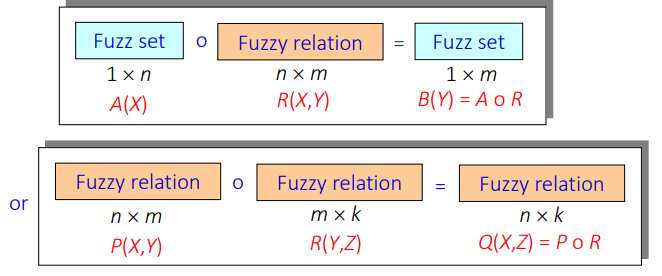
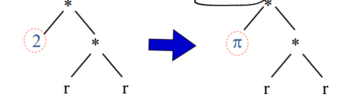
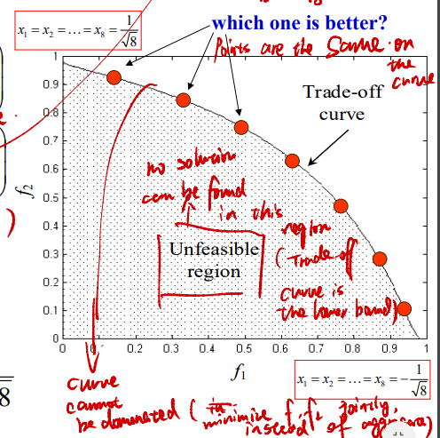
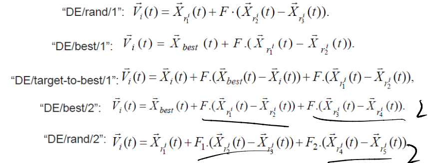
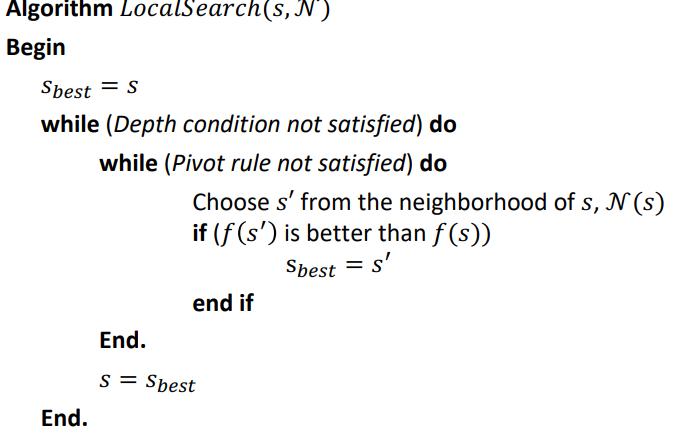
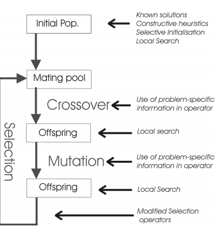
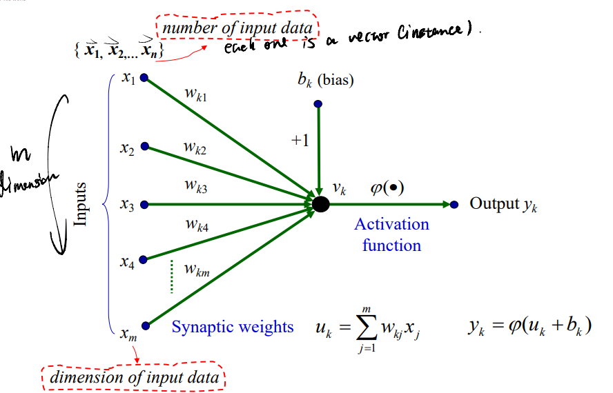
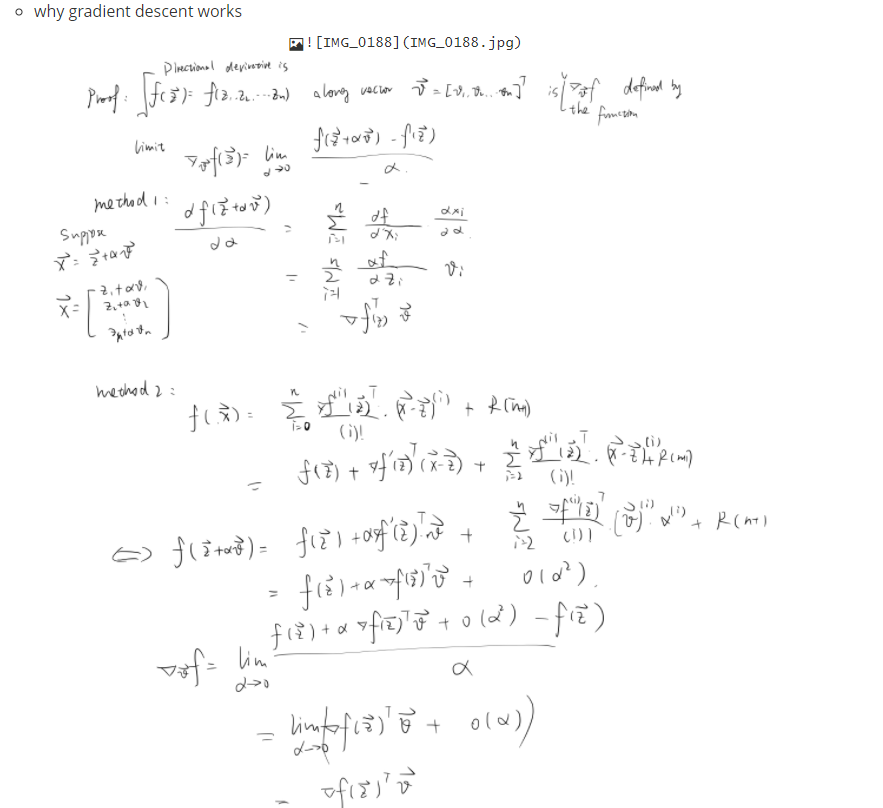
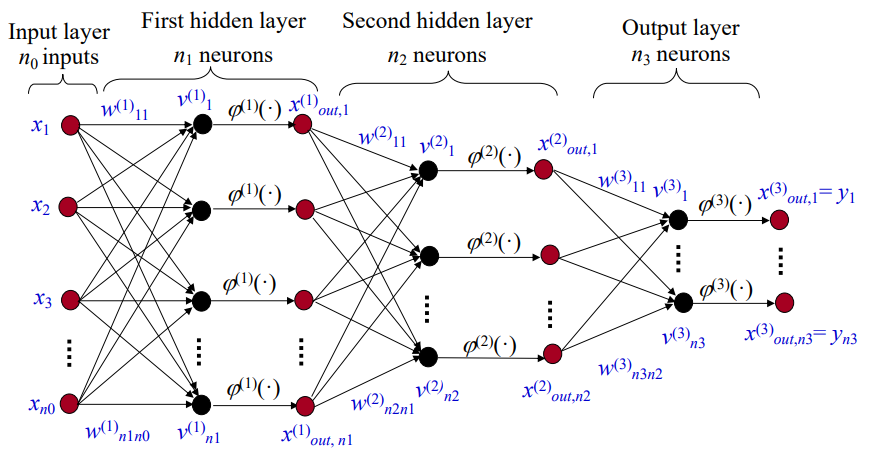
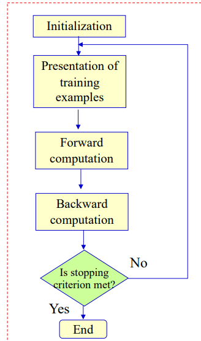

# CS4486: Artificial Intelligence

[TOC]


## Lecture01: Introductions

* Three questions in the final exam:

  * Fuzzy logic
  * Evolution Computing
  * Artificial Neural Network

* Fuzzy Logic System

  * Fuzzy: Blur, not clear, ambiguity

  * Fuzzy Logic => How to define “fast”? - One useful definition is using a membership function ranges from 0-1, with a larger value indicating a higher **degree of truth**

    

  * Fuzzy Logic System => For example, a temperature control system for bath-tub. 

    * If $x$(error temp) is $A$(small hot), then $y$(action opening) is $B$(small large)

    * small hot and small large are two membership functions, for example, hot might be defined as: 

      

    * Fuzzy system is *a convenient way* to map an **input space** to an **output space**, for e.g.: 

      * Present Condition => Knowledge Inference (If...then...) => Conclusion
      * Service Quality => Black Box => The “right” tips

    * What could go into the Black Box

      * Mathematic model
      * Look-up table
      * Neural network
      * Fuzzy logic

  * Fuzzy logic applications

    * Fuzzy-ATO (Automatic Train Operation): (Riding comfort, Stopping accuracy, Energy conservation) => Fuzzy Inference => Speed of the train

    * Fuzzy Washing Machine: (Deg_of_Dirt, Type_of_dirt) => Wash time

    * A ‘Simple’ Control System: Driving a car from point A to point B, control the car

      * A set of control rules: 
        * **Deviation** is zero, **turn** is zero
        * **Deviation** is positive, **turn** is negative
        * **Deviation** is negative, **turn** is positive
      * Deviation => Fuzzy Inference => Turn

    * A Pole Balancing Control Problem:

      

      * *err*: The difference between the bar and the law
      * *err-dot*: The vector representing the bar is moving to

---------------------------------------

## Lecture02: Fuzzy Set & Fuzzy Logic

### Fuzzy Set

* Crisp Sets and Fuzzy Sets

  * Crisp sets(Such as binary sets): Variables are either true or false(to be in the set)
  *  $X$: The universe of discourse (universal set)
  * $A=\{a_1,a_2,...,a_n\}$: A set whose elements are $a_1,a_2,...,a_n$.
  * $|A|$: Number of elements in the set $A$
  * $P(A)$: Power set of $A$, contains all possible subsets of $A$
  * $|P(A)|=2^{|A|}$ 

* Mapping of Crisp Sets to Functions(Membership function of crisp sets): Characteristic function:
  $$
  \chi_A(x)=\left\{
  \begin{aligned}
  1\ (iff\ \ x\in A)\\
  0\ (iff\ \ x\notin A)\\
  \end{aligned}
  \right.
  $$

* Basics of Fuzzy Sets: 

  * Fuzzy set theory uses linguistic variables, rather than quantitative variables, to represent imprecise concepts

  * Need to represent the concept such as “hot” so that machine can communicate with humans 

  * How strongly do you agree that a give number is a “hot” temperature (belongs to the hot set)

    * Threshold type: 

      

    * Conservative type:

      

    * Compromiser type:

      

  * **Fuzzy set**: A set $A$ containing elements that have varying degrees of membership in the set, which defined by a membership function $\mu_A$ 

  * **Membership function**: A function $\mu_A:X\mapsto[0,1]$ (compared to $\chi_A: X\mapsto\{0,1\}$)

    * Larger value of membership function denotes higher degree of the membership
    * Each function corresponds to an *adj.* intuitively
    * Each function defines a fuzzy set
    * Membership function actually depends on the definition, it may not be symmetric

    

* Different Membership Functions

  * A possible membership function

    

  * Triangular membership function (three parameters $a,b,c$)

    

  * Trapezoidal membership function (four parameters $a,b,c,d$)

    

* Representation of Fuzzy Sets

  * Fuzzy set $A$ for a **discrete and finite** universe of discourse $X$ is
    $$
    A = \mu_A(x_1)/x_1 + \mu_A(x_2)/x_2 + ... + \mu_A(x_n)/x_n \\
    =\sum_{i=1}^n\mu_A(x_i)/x_i \\
    $$

    * Notice that in here the meaning of $/$ is not division and $+$ is not addition $\sum$ is not summation
    * $x_i > 0$

  * For **continuous and infinite** is: $A=\int_x\mu_A(x)/x$ 

  * E.g. $A=0.5/20+1/30+0.5/40$ 

    

* Properties of fuzzy set: 

  

  * **Height** of a fuzzy set: the maximum value of the membership
    $$
    hgt(A) = \underline {sup}reme\{x\in X|\mu_A(x)\}=sup\{x\in X|\mu_A(x)\}=max\{x\in X|\mu_A(x)\}
    $$

  * **Support** of a fuzzy set $A$: The **crisp set** of all $x\in X$ such that $\mu_A(x) > 0$
    $$
    Supp(A) = \{x\in X | \mu_A(x)>0\}
    $$

  * **Core** of a fuzzy set $A$: The **crisp set** of all $x\in X$ such that $\mu_A(x) = 1$
    $$
    Core(A) = \{x\in X | \mu_A(x)=1\}
    $$

  * **$\alpha$-cut** of a fuzzy set $A$: A crisp set $A_\alpha$ that contains all the elements of the universal set $X$ that have a membership grade in $A$ greater than **or equal to** the specific value of $\alpha$ (For strong $\alpha$-cut, it is greater than)
    $$
    A_\alpha = \{x\in X | \mu_A(x) \geq \alpha\} \\
    A_{\alpha^+} = \{x\in X | \mu_A(x) > \alpha\} \\
    A_{\alpha=0} = X \\
    A_{\alpha=1} = Core(A) \\
    A_{\alpha^+=0} = Supp(A) \\
    A_{\alpha^+=1} = \empty \\
    $$
    

  * **Level set**: The set of all levels $\alpha \in [0,1]$ that represent distinct $\alpha$-cut of a fuzzy set $A$ is 
    $$
    \Lambda_A=\{\alpha|\exist x\in X\ s.t. \mu_A(x) = \alpha\}
    $$

    * Similar as the concept of **range**

  * **Convex Fuzzy Sets**: For any elements $a,b,c$ in a fuzzy set $A$, the relation $a<b<c$ implies that
    $$
    \mu_A(b) \geq min\{\mu_A(a), \mu_A(c)\}
    $$
    Then $A$ is said to be a convex fuzzy set

     

    * The following one is convex fuzzy set

      

  * Cardinality of fuzzy set: 

    * Scalar Cardinality
      $$
      SC(A) = |A| = \sum_{x\in X}\mu_A(x) \\
      $$

    * Relative Cardinality
      $$
      RC(A) = {SC(A)\over |Universal\ Set|} = {|A| \over |X|}\\
      $$

      * Only defined for discrete fuzzy set

    * Fuzzy Cardinality
      $$
      FC(A) = \sum_{\alpha \in \Lambda_A} \alpha / |A_{\alpha}|
      $$

  * Example: 

    
    $$
    \Lambda_{adult} = \{0,0.8,1\} \\
    \Lambda_{young} = \{0,0.2,0.5,0.8,1\} \\
    \Lambda_{old} = \{0,0.1,0.2,0.4,0.6,0.8,1\} \\
    SC(old)=|old| = 0+0+0.1+0.2+0.4+0.6+0.8+1+1=4.1 \\
    RC(old) = {4.1 \over 9} = 0.4556 \\
    FC(old) = 0.1/7 + 0.2/6+0.4/5+0.6/4+0.8/3 \\
    $$

* Relationship between Fuzzy Sets and Crisp Sets: Fuzzy sets can be treated as a collection of crisp sets

  

  * Decomposition Theorem: A fuzzy set $A$ can be represented by: 
    $$
    A = \cup_{\alpha \in [0,1]} \alpha . A_{\alpha}
    $$

    * where $\alpha.A_{\alpha}$ denotes the algebraic product of a scalar $\alpha$ with the $\alpha$-cut $A_\alpha$; $\cup$ denotes the union operation (notice that we first transform $A_{\alpha}$ to fuzzy set with all membership 1)
    * This theorem is also applicable to non-convex fuzzy set

### Fuzzy Set Operation

* Fuzzy Complement, Union, Intersection

  

  * De Morgan’s laws: 

    * $\overline{A\cap B} = \overline{A}\cup\overline{B}$
    * $\overline{A\cup B} = \overline{A}\cap\overline{B}$

  * Fuzzy **Inclusion and equality**
    $$
    A \subseteq B: if\ \forall x\in X\ \mu_A(x) \leq \mu_B(x) \\
    A \subset B: if\ \forall x\in X \ \mu_A(x) < \mu_B(x) \\
    A = B: if\ \forall x\in X \ \mu_A(x) = \mu_B(x) \\
    A \neq B: if\ \exists x\in X \ \mu_A(x) \neq \mu_B(x) \\
    $$
    

    * $A\neq B, A\subseteq B$

  * **Fuzzy Complement**: 

    * A complement of a fuzzy set $A$ is specified by a function $c:[0,1]\mapsto[0,1]$, which assigns a value $c(\mu_A(x))$ to each membership grade $\mu_A(x)$, satisfy following 4 axioms: 

      * $c(0)=1$ and $c(1)=0$ 
      * For $\mu_A(x)$, $\mu_A(y) \in [0,1]$, if $\mu_A(x) \leq \mu_A(y)$, then $c(\mu_A(x)) \geq c(\mu_A(y))$  
      * $c$ is a continuous function
      * $c$ is involutive, i.e. $c(c(a))=a$ for all $a \in [0,1]$ 

    * e.g.: 

      * **By default $c(a)=1-a$ => satisfy 4 axioms** 

      * Satisfy first two

        

      * Satisfy the first three: $c(a)={1 \over 2}(1+cos\pi a)$ 

        

      * Satisfy all: $c_{\lambda}(a)={1-a \over 1+\lambda a}$ 
        $$
        {1 - {1 - a \over 1+\lambda a}} \over 1+\lambda {1 - a \over 1+\lambda a} \\
        ={1+\lambda a - (1-a) \over 1+\lambda a+\lambda(1-a)} \\
        ={(\lambda + 1)a \over \lambda + 1} = a
        $$
         

* Equilibrium and Dual point (same concept different name)

  *  An **equilibrium of a fuzzy complement** $c$ is defined as any value $a\in[0,1]$ for which $c(a)=a$

  * **dual point** is any membership grade represented by the real number $a \in [0,1]$  such that
    $$
    c(a)-a=a-c(a)
    $$

  * Dual point always equals to the equilibrium but not always 0.5

  * Equilibrium point for $c(a)={1-a \over 1+ a}$: 
    $$
    a={1-a \over 1+a} \\
    a^2+2a-1=0 \\
    (a+1)^2=2(a\in[0,1])\\
    a=\sqrt{2}-1
    $$

* Fuzzy Union: 

  * The union of two fuzzy sets $A$ and $B$ is specified by a function of the form $u:[0,1]\times[0,1] \mapsto [0,1]$, which satisfies the following four axioms: 

    * $u(0,0)=0;u(0,1)=u(1,0)=u(1,1)=1$
    * $u(a,b)=u(b,a)$
    * If $a \leq a^\prime$ and $b \leq b^\prime$, then $u(a,b)\leq u(a^\prime,b^\prime)$ 
    * $u(u(a,b),c) =u(a,u(b,c))$ 

  * Examples

    * By default, $\mu(x)=max[\mu_A(x),\mu_B(x)]=A \cup B=A\or B$ 

      

    * $\mu_{A\cup B}(x)=\mu_A(x)+\mu_B(x)-\mu_A(x)\mu_B(x)$

  * The fuzzy union operator is often referred to as **S-norm**

* Fuzzy Intersection:

  * The fuzzy intersection of two fuzzy sets $A$ and $B$ is specified by a funciton $i:[0,1]\times [0,1] \mapsto [0,1]$, which satisfies the following four axioms:

    * $i(0,0)=i(0,1)=i(1,0)=0;i(1,1)=1$ 
    * $i(a,b)=i(b,a)$
    * If $a \leq a^\prime$ and $b \leq b^\prime$, then $i(a,b)\leq i(a^\prime,b^\prime)$ 
    * $i(i(a,b),c) =i(a,i(b,c))$  

  * Examples

    * By default, $\mu(x)=min[\mu_A(x),\mu_B(x)]=A\cap B = A\and B$

      

    * $\mu_{A\cap B}(x)=\mu_A(x)\mu_B(x)$

  * Fuzzy intersection operator is also referred to as **T-norm** 

* Different definition of intersection and union are used in different scenes, i.e. plays the role of logical connectives in a **sensible way**

  

  * The lefts are intersection and rights are union
  * The first one use min and max because we only need to consider the easiness of breaking one  window, even for the left-up case, the man can rest for next glass. 
  * The second case use multiplication because the value should be less than $0.6$ (one window) in the left case, and larger than $0.9$ for the second case. 

* **Fuzzy Relations**

  * If $A$ then $B$: How do we determine the output if we know the inputs?

  * **Crisp relation** represent the presence or absence of connection between elements of two or more sets while **fuzzy relation** allows relation ship between elements of two or more sets to take an infinite number of **relationship degrees**.

    

  * **Cartesian Product**

    * Both crisp relation and fuzzy relation are defined on Cartesian Product

    * An ordered sequence of n elements, written in the form $(x_1, x_2, x_3, …, x_n)$, is called an ordered **n-tuple**

    * For crisp sets, $X_1, X_2,...,X_n$, the set of all $n$-tuples is called the Cartesian product of $X_1, X_2,...,X_n$

    * **Crisp Relations**: A relation among crisp sets $X_1\times X_2\times ... \times X_n$ is a crisp subset of the Cartesian product, which is denoted by $R(X_1\times X_2\times ... \times X_n)$ 

      * Name: Among two sets => binary relation, among $n$ sets: $n$-ary 

      * The cartesian product $X_1\times X_2\times ... \times X_n$ represents the universal set

      * Membership function: 
        $$
        \chi_R(x_1,x_2,...,x_n) = \left\{
        \begin{aligned}
        1\ (iff\ \ (x_1,x_2,...,x_n)\in R)\\
        0\ (otherwise)\\
        \end{aligned}
        \right.
        $$

    * **Fuzzy Relations**: A fuzzy relation is a fuzzy set defined on the Cartesian product of crisp sets  $X_1, X_2,...,X_n$, where tuples $(x_1, x_2, x_3, …, x_n)$ may have varying degrees of membership $\in [0,1]$, indicating the strength of the relationship present between the elements of the tuple (e.g. $x$ is similar to $y$)

      

      * **Domain** $R$ is a fuzzy set on $X$ noted as $dom\ R$, with 	  
        $$
        \mu_{dom\ R}(x)=max_{y\in Y}\mu_R(x,y), \forall x\in X \\
        for\ example\ above: \\
        dom\ R=1/x_1+0.4/x_2+ 1/x_3 + 0.4/x_4 + 0.5/x_5 + 0.2/x_6 \\
        $$

      * **Range** $R$ is a fuzzy set on $X$ noted as $ran\ R$, with 	  
        $$
        \mu_{ran\ R}(y)=max_{x\in X}\mu_R(x,y), \forall y\in Y \\
        ran\ R = 0.9/y_1 + 1/y_2 + 1/y_3 + 0.2/y_4 + 0.5/y_5
        $$

      * **Height** $R$ is a number
        $$
        h(R)=max_{y\in Y}max_{x\in X}\mu_R(x,y)\\
        h(R)=1
        $$

* **Projection of Fuzzy Relations**

  * Projects a fuzzy $n$-ary relation onto a fuzzy $(n-1)$-ary relation, a fuzzy binary relation onto a fuzzy set

  * For binary relation: 
    $$
    Proj[R(X\times Y);X] = \int_Xmax_{y\in Y}\mu_R(x,y)/x = dom\ R \\
    Proj[R(X\times Y);Y] = \int_Ymax_{x\in X}\mu_R(x,y)/y = ran\ R\\
    $$
    

* **Cylindrical Extension**

  * Extends a fuzzy set to fuzzy binary relation, fuzzy $n$-ary relation to fuzzy $(n+1)$-ary relation

  * Cylindrical extension for binary relation: 
    $$
    ce(A) (A\ is\ a\ fuzzy\ set\ on\ X)\ on\ X\times Y\ is \\
    ce(A) =\int_{X\times Y}\mu_A(x)/(x,y)\\
    ce(B) (B\ is\ a\ fuzzy\ set\ on\ Y)\ on\ X\times Y\ is \\
    ce(A) =\int_{X\times Y}\mu_B(y)/(x,y)\\
    $$
    

  

* **Fuzzy Composition**

  * If $A$ then $B$, with a fuzzy relation $R(X,Y)$
    $$
    A(X) \longrightarrow R(X,Y) \longrightarrow B(Y) = A \circ R
    $$

  * Rules of operation (a bit like a matrix multiplication): 

    

  * Operation of Fuzzy Composition (max-min):
    $$
    [R(X,Y)\circ S(Y,Z)]_{ik} = max_{y_j\in Y} min[\mu_R(x_i,y_j),\mu_S(y_j,z_k)] \\
    =\or_{y_j\in Y}((x_i,y_j)\and(y_j,z_k))
    $$

    * Another explanation: 
      $$
      R =\int_{X\times Y}\mu_R(x,y)/(x,y) \\
      S =\int_{Y\times Z}\mu_S(y,z)/(y,z) \\
      Ce(R) = \int_{X\times Y\times Z}\mu_R(x,y)/(x,y,z) \\
      Ce(S) = \int_{X\times Y\times Z}\mu_S(y,z)/(x,y,z) \\
      Ce(R) \cap Ce(S) = \int_{X\times Y\times Z}min\{\mu_R(x,y,z),\mu_S(x,y,z)\}/(x,y,z) \\
      R\circ S = Proj[Ce(R) \cap Ce(S);X\times Z] = \\
      \int_{X\times Z}max_{y\in Y}\{min\{\mu_R(x,y),\mu_S(y,z)\}\}/(x,z)
      $$

  * Example: 

    

* Difference between randomness and fuzziness: randomness refers to an event that may or may not occur while fuzziness refers to the boundary of a set that is not precise

----------------------------

## Lecture03: Fuzzy relation & Fuzzy Inference

### Extension Principle

* What is the output for a fuzzy input or fuzzy function or both
  $$
  fuzzy\ set\ A \longrightarrow f \longrightarrow fuzzy\ set\ B \\
  f(A) = B = f(\mu_1/x_1+\mu_2/x_2+...+\mu_n/x_n) \\
  =\mu_1/f(x_1)+\mu_2/f(x_2)+...+\mu_n/f(x_n)
  $$

* Extension Principle

  * for **single variable function** 
    $$
    f:X \mapsto Y \\
    y=f(x) \\
    let\ A\ be\ a\ fuzzy\ set\ in\ X.Then,\\
    B=f(A)\ is\ defined\ to\ be\ a\ fuzzy\ subset\ in\ Y\ with \\
    \mu_B(y) = \left\{
    \begin{aligned}
    sup_{x\in f^{-1}(y)}\mu_A(x)\ if\ f^{-1}(y)\neq \empty \\
    0\ (otherwise)\\ 
    \end{aligned}
    \right.
    =max_{f(x)=y}\mu_A(x)
    $$

    * e.g. suppose $y=f(x)=2x+1$ and $A = approx\ 3 = \int_X e^{-(x-3)^2}/x$ , find $f(approx\ 3)$
      $$
      since\ f(x)\ is\ bijection, x = {y-1\over 2} \\
      f(approx\ 3) = \int_Y\mu_B(y)/y = \int_Ysup_{x\in f^{-1}(y)}\mu_A(x)/y \\
      = \int_Y\mu_A({y-1\over 2})/y \\ 
      = \int_Ye^{-{1\over 4}(y-7)^2}/y \\
      $$
      

    * e.g. Given that $y = f(x) = (x – 3)^2 + 2$ and a fuzzy set $Around\ 4$ for $x$
      as $Around\ 4 = 0.3/2 + 0.6/3 + 1/4 + 0.6/5 + 0.3/6$ 

      * If there are more than one $x$ corresponds to $y$ => pick the largest one

      $$
      f(Around\ 4) = 0.3/3 + 0.6/2+1/3 + 0.6/6 + 0.3/11 \\
       = 0.6/2+1/3+ 0.6/6 + 0.3/11
      $$

  * General Extension Principle
    $$
    Given\ X=X_1\times X_2\times ... \times X_n \\
    f: X \mapsto Y \\
    y=f(x)=f(x_1,x_2,...,x_n) \\
    For\ each\ i=1,2,...,n\ let\ A_i \sub X_i \\
    Then\ B=f(A_1,A_2,...,A_n)\ is\ a\ fuzzy\ subset\ in\ Y\ with \\
    \mu_B(y) = max_{y=f(x_1,x_2,...,x_n)}[min\{\mu_1(x_1),\mu_2(x_2),...,\mu_n(x_n)\}]
    $$

    * All the variables happens together => depends on minimal, there are a lot of way to get $y$ => pick the maximal

      

    * e.g. If $A_1= 0.2/1 +1/2 + 0.7/4$ and $A_2 = 0.5/1 + 1/2$, then
      $$
      A_1A_2 = min(0.2,0.5)/1+max[min(0.2,1),min(0.5,1)]/2\\
      +max[min(1,1),min(0.7,0.5)]/4 + min(0.7,1)/8 \\
      = 0.2/1+0.5/2+1/4+0.7/8
      $$

  * Notice that $x^2 \neq x*x\ ;\ 2x \neq x+x$

  * Difference between fuzzy composition and extension principle: fuzzy composition is applied to fuzzy relation(function), while extension principle is applied to normal relation(function) with fuzzy input

### Fuzzy inference

* Approximate reasoning, fuzzy inference

  * Main tools of reasoning are tautologies: for e.g.
    $$
    Premise: A\ is\ True(or\ False) \\
    Implication: If\ A\ then\ B \\
    Conclusion: B\ is\ True
    $$

  * Extension to fuzzy logic (If-then to be fuzzy and the proposition is fuzzy): 

    * Allow statements that are characterized by Fuzzy sets

    * Relax (slightly) the identity of Premise $A$ (make premise fuzzy)

    * e.g.: 
      $$
      Premise:Tomato\ is\ very\ red\\
      Implication:if\ the\ tomato\ is\ red\ then\ the\ tomato\ is\ ripe\\
      Conclusion:Tomato\ is\ very\ ripe
      $$

* Linguistic Variables: Variables whose values are words or sentences in a natural language

  

  * Notion: $<X,T_X, \chi, M_X>$ 
  * $X$: Name of the linguistic variable e.g.: age, error
  * $T_X$: The set of linguistic values (Term set) e.g. 
    * For age, $T_X=\{old,very\ old,not\ so\ old,very\ young\}$ 
    * An arbitrary element of this set is denoted by $TX$, e.g. old
  * $\chi$: The actual physical domain over which the $X$ takes its crisp value 
    * e.g. for age, the interval can be $[0,120]$
  * $M_X$: $TX \mapsto \mu_{TX}$ or $T_X \mapsto \{\mu\}$ A set of membership function to give each $T_X$ with a meaning

* A closed-loop control system

  

  * $y=0$ initially

  * For each time point, error $e$ is calculated by $r-y$, and $e^\prime = {de\over dt}$ 
    $$
    Input: Error \longleftrightarrow Control\ output\\
    <E,T_E, \epsilon, M_E> \longleftrightarrow <U,T_U, \upsilon, M_U> \\
    E:error \longleftrightarrow U:control\ output \\
    T_E = \{NB,NM,NS,ZO,PS,PM,PB\} = T_U \\
    \epsilon  = [-6,6] = \upsilon \\
    M_E: TE \mapsto\mu_{TE} \longleftrightarrow M_U: TU \mapsto \mu_{TU} 
    $$
    

* Typical fuzzy if-then rule: 

  

* **Atomic fuzzy proposition**: “Error has the value negative-big” <=> $E$ is $NB$ 

  * Defined by the membership function $\mu_{NB}$ on the physical domain
  * Only consider the corresponding membership function mensioned in the proposition

* **Compund fuzzy propositions**: $X$ is $A$ and(or) $X$ is $B$

  * Conjunction($\cap$): and defined by *T-norm*
    $$
    \mu_{A\cap B}(a,b) = min\{\mu_A(a),\mu_B(b)\}\\
    A \cap B = \int_{A\times B} min\{\mu_A(a), \mu_B(b)\}/(a,b)
    $$

  * Disjunction($\cup$): or defined by *S-norm*
    $$
    \mu_{A\cup B}(a,b) = max\{\mu_A(a),\mu_B(b)\}\\
    A \cup B = \int_{A\times B} max\{\mu_A(a), \mu_B(b)\}/(a,b)
    $$

  * Different from the previous definition of intersaction, here the universe discourse is different => Can be treated as the intersaction after *cylindrical extension*

    

* **Fuzzy If-then Statements** 

  * Can be symbolically expressed as $if\ <fuzzy\ proposition>\ then\ <fuzzy\ proposition>$ 

  * The fuzzy proposition in the statement can be understood as knowledge which is an organized collection of propositions

    

  * Descride fuzzy if-then rule as fuzzy relation $R(\epsilon \times \upsilon)$ , where
    $$
    \forall e\in \epsilon, \forall e\in \upsilon: \\
    R(\epsilon \times\ \upsilon) = \int_{\epsilon \times\ \upsilon}\mu_R(e,u)/(e,u) \\
    \int_{\epsilon \times\ \upsilon}\mu_A(e)*\mu_B(u)/(e,u)
    $$

    * $*$ Denotes a Fuzzy Implication operator

  * Type of fuzzy implications($\delta$ means implication operator, $a, b$ means membership function): 

    * Kleene-Dienes Implication: follow the normal definition of $if-then$ 
      $$
      \delta(a,b) = max[1-a,b]
      $$

    * Lukasiewicz Implication
      $$
      \delta(a,b) = max[1,1-a+b]
      $$

    * Zadeh Implication
      $$
      \delta(a,b) = max[min(a,b),1-a]
      $$

    * Mamdani Implication
      $$
      \delta(a,b) = min(a,b)
      $$
      

      * Here is the case for crisp value $e^*$, we know that the membership function is $1$, we find the minimum between $e^*$ , membership function $\mu_e$ and membership function $\mu_u$ 

* Two approaches to represent fuzzy inference give fuzzy propositions $A$ and $B$

  * If-then rule that implicity represents a fuzzy relation: 
    $$
    if\ A\ then\ B
    $$

  * Fuzzy relation to represent explicitly the connection between two propositions
    $$
    R(A\times B)
    $$

* **Computation of Fuzzy Inference**
  $$
  Rule(Implication): x\ is\ A^\prime\ with\ the\ degree\ \mu_{A^\prime}(x) \\
  Fact (Premise): If\ x\ is\ A\ with\ the\ degree\ \mu_A(x),\\then\ y\ is\ B\ with\ the\ degree\ \mu_B(y)\\
  Conclusion: y\ is\ B^{\prime}\ with\ the\ degree\ \mu_{B^\prime}(y)\\
  $$

  * Equation: 

    * Rule

    $$
    R(A\times B) =  Ce(A) \cap Ce(B) \\
    = \int_{A\times B}min[\mu_A(x), \mu_B(y)]/(x,y)\\
    $$

    * Conclusion
      $$
      B^{\prime}(y) = (A^\prime \circ R) \\
      = Proj\{Ce(A^\prime\cap R, y\} \\
      = \int_{B} max_{x\in X}\{min[\mu_{A^\prime}(x)min(\mu_A(x), \mu_B(y))]\}/(y) \\
      = \int_{B} max_{x\in X}\{min\{\mu_{A^\prime}(x), \mu_A(x), \mu_B(y)\}\}/(x) \\ 
      = \int_{B} min\{max_{x\in X}[min(\mu_{A^\prime}(x), \mu_A(x))], \mu_B(y)\}/(y)
      $$

      * This way is faster than calculating the matrix directly

  * Graphical fuzzy inference - relationship with the compuation

    * Special case for crisp value:

      * The membership function for $A^\prime$ is 1
      * According to $x$, select $\mu_A$ (less or equal to 1)
      * Shift to $\mu_B$ and compare

      

    * General case for fuzzy value

      * Compute intersaction between $A$ and $A^\prime$ 
      * Find the largest value of $A \cap A^\prime$ 
      * Shift two $B$ and compare

      

* **Multiple fuzzy if-then statements** : 

  * In a systemn of $n$ Rules, 
    $$
    R^{(k)}: if\ e\ is\ TE^{(k)}\ then\ u\ is\ TU^{(k)}, k=1,...,n \\
    $$

  * The whole set of rules is defined as: 
    $$
    R = \cup^n_{k=1}R^{(k)}\ or\\
    \mu_R(e,u) =  max^n_{k=1}\{R^{(k)}\}\\
    =max^n_{k=1}\{min(\mu_{TE^{(k)}}(e), \mu_{TU^{(k)}}(u))\} \\
    $$

  * Graphical approach

    

    * For all inputs, take the min or max for compound fuzzy proposition
    * For each input and output, find the fuzzy relation value
    * Combine all individual output by ‘union’
    * **The intuition of the last step is producing a membership function for the output set, which is a mix of some of the terms in the term set** 

## Lecture 04: Fuzzy Knowledge Based Control (FKBC)

* Main steps of FKBC

  * Normalization
  * **Fuzzification**
  * **Inference**
  * **Defuzzification**
  * Denomalization

* Procedure in designing FKBC

  * Identify variables: (different equations to represent input-output relationship)

  * Partition universe of discourse into fuzzy subsets (Positive big, etc.), choose term set

  * Assign the fuzzy relationships between the inputs’ fuzzy subsets and the outputs’ fuzzy subsets, thus **forming the rule-base**.

    * rule-base table: Always use intersection between the row and column entries

  * Normalization: scale transformation

  * Fuzzification: Determine the membership functions

  * Fuzzy inference: According to the previous note

  * **Defuzzification**: center-of-Area/Gravity

    * Choose discrete values and find weighted average (weights are the memberships)

      

  * Denormalization

* Usually, the system is executed in round. The next round input will be determined by the output of current round and current input by some equation

* Method to improve the performance

  * Increase the number of fuzzy sets (instead of only 3 for inputs and 5 for output).
  * Increase the number of if-then rules.
  * Increase the number of input data points
  * Tune the shape of the membership functions.
  * Tune the entries of the fuzzy rule-base table.

* Applications:

  * Inverted Pendulum
  * Fuzzy Nonlinear Simulation

## Lecture 05 & 06 & 07: Path Finding And Optimization

### A* Algorithm

* Searching: Retrieve information stored within some data structure, or calculated in the search space of a problem domain, either with discrete or continuous values

  * Types
    * Linear/Binary Search
    * Graph/Tree search
  * Generated solution: A fixed sequence of actions
  * Process of find solution: Search phase
  * Solution found: execution phase

* Informed (Heuristic) Search

  * Use problem-specific knowledge => more efficiently

  * **Best**-First-Search: expand base on evaluation function $f$, expand the lowest evaluation node

    * $f$ often includes a heuristic function $h$ (estimation from current node to the goal node) $h=0$ for goal node 

    * $f$ cannot only contains heuristic (e.g. Euclidean distance), should also contains cost-so-far
      $$
      f(n) = g(n) + h(n)
      $$

      * $g$ cost from the staring node
      * $h$ estimation to the target

  * Optimal

    * Optimal is guaranteed if the heuristic is **admissible**(not overestimate the cost) and the search space is a tree
    * Optimal is guaranteed if the heuristic is **consistent**($h(n) \leq c(n, n')+h(n')$) and the search space is a graph
    * If consistent, then it is admissible (reverse is not guaranteed but frequently)

### Basic Optimization

* Def: Given a function, find the independent variables results in the minimum/maximum dependent variable

* Naive methods: e.g. minimum

  * For human: Calculate first order derivative, set it to zero. Calculate second order derivate, prove it is positive at that point (for minimum)
  * For machine: Take uniform distributed values among the domain, calculate the function for each of them and find the minimum value
  * If there are more independent variable => lots of computation

* Gradient-driven search:  $\alpha$ is learning rate
  $$
  find\ P_o = \{P_0 \in S | f(P_0) = min_{\forall P_i\in S}f(P_i) \} \\
  P_{n+1} = P_n - \alpha {\delta f \over \delta P}|_{P=P_n}
  $$

  * Function must be differentiable
  * Easy to be trapped in local optima => performance depends on the starting point

### Genetic Algorithm

* Overview

  

  * Evaluation: Calculate normalized fitness => assign probability to be selected
  * Selection/Reproduction: Select based on the probability (one entity can be chosen twice)
  * Variation
    * Crossover: Produce a child based on the parent vector and the crossover rate
    * Mutation: Change the string based on mutation rate
  * Note that the population size is unchanged

* Basic Operations

  

  ```
  Make initial population;
  Evaluate the fitness of all initial chromosomes;
  REPEAT
  	Reproduce children from parent (selection);
  	Apply crossover to some chromosomes;
  	Apply mutation to some chromosomes;
  	Preserve elite individuals;
  UNTIL satisfactory result found
  Decode the best chromosome found.
  ```

  * More parameters => more individuals; more generations

* Encoding and evaluation

  * Encoding Types: Binary, decimal, real, order-based
  * Evaluation Types: Numerical (fitness function) / Combinatorial (for order-based encoding)
  * e.g. binary => individual is a binary string, gene is one bit (8 bit string 10100011)
    * integer from 0 to 255 => just use the decimal (163)
    * Real number from 2.5 to 20.5 => $x = 2.5(min) + {163 \over 255}(20.5(max)-2.5(min)) = 13.9609$

* Mutation

  * Why => if one digit for all individuals in the current generation are the same, it will never be changed

  * Requirement

    * At least one mutation operator should allow every part of the search space to be reached.
    * The size of mutation is important and should be controllable.
    * Mutation should produce valid chromosomes
    * Mutation rate should not be so high (says higher than crossover rate)

  * Types

    * Binary: Change one/more bit(s)

    * Order-based: Swap to genes

    * Tree based: Randomly select a node and replace it with another random value

      

* Crossover

  * Why => Make it possible to generate new string has a better fitness score
  * Requirement
    * he child should inherit something from each parent. If this is not the case then the operator is a mutation operator.
    * Crossover should produce valid chromosomes.
  * Types
    * Binary
      * Cut from middle and swap
      * for each gene generate a binary value, it it is one then exchange with the parents (Choose an arbitrary part from the first parent and copy this to the first child, Copy the remaining genes (from the second parent) that are not in the copied part to the first child)
    * Order-based: Randomly select genes from the first parent to preserve. Find other genes with order in another parent the fill it to the empty genes
    * Tree-based: Cut at any portion of the tree (cut down sub-tree). Then swap the sub-tree

* Selection

  * Ensure better individuals have a better chance to be parents, also give less good individuals at least some chance
  * Probability of being selected: $f_i / \bar f$ (fitness of individual $i$ over sum of all fitness)
  * Disadvantage: 
    * Danger of premature convergence because outstanding individuals take over the entire population very quickly
    * Low selection pressure when fitness values are near each other
  * Preservation of elitism: Keep the best 10% of parent population and reintroduce them in the next generation by replacing the worst 10% of children 
  * Stop criterion: 
    * Optimization is reached
    * Limit on CPU resources: maximum number of fitness evaluations.
    * Limit on the patience: after some generations without improvement.
    * Never draw any conclusion from a single run
      * use statistical measures (e.g., average, standard deviation).
      * obtain results from a sufficient number of independent runs

### Schemata Theorem

* Solve the problem => why such evolution process will lead to better solutions

* Def: schema is a set of strings that share certain values
  $$
  **1**: \{11101, 11100, 01101, ....\}
  $$

  * $1$ matches $1$, $0$ matches $0$, $*$ matches either

  * For cardinality “$k$”, there are $(k+1)^l$ schemata in a string; $l$ is the length of the string

  * Order of schema: $o(S)$ is defined as **the number of fixed positions**

  * Defining length of schema: $d(S)$ of a schema is the **distance between the first and the last specific fixed position**

  * e.g. $S_1 = *1001*$, $S_2 = 1****0$, $O(S_1) = 4, O(S_2) = 2, d(S_1) = 3, d(S_2) = 5$ 

      

* Effect of selection

  * Fitness of schema is defined as the average of the individuals within that schema:
    $$
    fit(S) = {\sum^r_{k=1} fit(x_k) \over r} (r = n_s(t))
    $$

  * Number of selected individuals for a schema in next generation: 
    $$
    for\ individual: P_i = {fit(x_i) \over \sum^N_{j=1}(x_j)} \\
    number\ of\ selected:Nr(x_i) = N*P_i = N{fit(x_i) \over \sum^N_{j=1}(x_j)} \\
    n_s(t+1) = N*\sum^r_{k=1}({fit(x_k) \over \sum^N_{j=1}(x_j)}) = {r*fit(S) \over {\sum^N_{j=1}fit(x_j) \over N}} = n_s(t){fit(S) \over <fit>}
    $$

  * Member of a schema will grow only when the average fitness of the schema is larger than the average of the generation (it will grows up exponentially)
    $$
    fit(S) = <fit> + \epsilon <fit> \\
    n_s(t+1) = n_s(t)*{<fit> + \epsilon <fit> \over <fit>} = n_s(t)(1+\epsilon)
    $$

* Effect of Crossover

  * Probability of destruction of schema $S$ is $d(S) \over l-1$ (There are $l-1$ positions in total to break, and $d(S)$ positions can be used to break the schema)

  * Crossover probability for a specific string is $P_{cross}$ 

  * If we assume the crossover happens only between two different schemas, the probability of surviving is $1 - P_{cross}{d(S) \over l-1}$ for each individual (or this part of individual can be reserved)

  * Combined effect of reproduction and crossover:
    $$
    n_s(t+1) = n_s(t){fit(S) \over <fit>}(1 - P_{cross}{d(S) \over l-1})
    $$


* Effect of Mutation

  * With the mutation probability $P_m$, the survival of schema is equal to
    $$
    P_{survival} = (1-P_m)^{o(S)} \\
    $$

  * Assume $P_m << 1$ 
    $$
    P_{survival} = 1-P_m{o(S)}
    $$

  * Combined effect of reproduction,  crossover, and mutation (we ignore the small term (mutation and crossover happens together))
    $$
    n_s(t+1) = n_s(t){fit(S) \over <fit>}(1 - P_{cross}{d(S) \over l-1}) (1-P_m{o(S)})\\
    \approx n_s(t){fit(S) \over <fit>}(1 - P_{cross}{d(S) \over l-1}-P_m{o(S)})\\
    $$

  * Low order, short defining length, highly fit schemata are called building blocks of the search. When the building blocks are pieced together, similar to solving the “Jigsaw Puzzle”, the solution emerges

### Multi-objective Evolutionary Algorithms (MOEA)

* Problem: Optimize multiple objectives 

  * **Consist of more than one conflicting objective function** (if there is no conflicting objectives in the set of objectives, it is not a multiple-objective optimization problem) 
    * e.g. car price & time taken from 0 to 100km
  * Method1: Transform into single-objective problem (require priori knowledge of relative importance of different objectives)
    * give different weight on different objective, combine to a single function
    * result in one point
  * Method2: Define problem in multi-objective framework ( provides the decision maker different tradeoffs instead of only one possible weight in method1)
    * Find a **set** of vectors which satisfy the given constraint and optimizes a number of objective functions
    * result in one surface (Pareto Optimal Front (PF)/final tradeoff)

* Example: Minimize following two objectives
  $$
  f_1(x_1, ..., x_8) = 1-exp(-\sum^8_{i=1}(x_i-{1\over \sqrt 8})^2) \\
  f_2(x_1, ..., x_8) = 1-exp(-\sum^8_{i=1}(x_i+{1\over \sqrt 8})^2) \\
  where\ -2\leq x_i \leq 2
  $$

  * According to the property of $f(x) = 1-e^{-x}$; $f \propto x$ 
    $$
    f_1 \propto (x_i-{1\over \sqrt 8})^2; f_2 \propto (x_i+{1\over \sqrt 8})^2
    $$
    

    * We can find that $f_1$ and $f_2$ are only conflict in the range $[-{1\over \sqrt 8}, {1\over \sqrt 8}]$ 

    * Therefore, the set of solution is in this range, and we set all $x_i$ equals to each other, which results in the minimum value

    * Notice that the final trade-off curve is the **lower bound** for the given problem (**we can get the value in the white region by some set of vectors, but it is impossible to find result in the dark region**)

      

  * If we use single objective, we can use $f_{fit} = {1 \over f_1 + f_2}$ which result in a linear trade-off curve. 

* Requirement of EMO:

  * basic requirements: sufficient proximity to the exact Pareto-optimal point (convergence) and well spreading (diversity)
  * others
    * Good spread (along the curve), uniform distribution, minimum proximity (not above the curve)
    * Fitness assignment (assign fitness value for individuals), preference (different weight of objective)
    * Many objectives (e.g. 5 objectives), constraints (constraint for x (domain))
    * Noise (for same value of input, result in different output), dynamic landscape (f1, f2 changes among the time), robust optimization (small change of input, out put will not changed so much)

* Sharing and Elitism

  

  * Difference in MEA compared with simple EA: Add Pareto ranking and fitness sharing in the fitness computation
  * Sharing (diversity): **Avoid the non-dominated solution clustering** on some portions of Pareto-optimal front, certain **penalty is applied to the clustering solutions**  (e.g. a and b are penalized)
    * Introduce niche and species
  * Elitism (convergence): **Elite or non-dominated solutions** should be given the opportunity to be directly carried over to the next generation. 
    * Introduce Pareto ranking

* Pareto Ranking: 

  

  * dominate means completely better, $f_1' < f_1, f_2' < f_2$ 
  * Assign the smallest cost to the non-dominated individuals (as 1), while rank the dominated individuals by the number of individual that dominates it (as (num of dom)+ 1)

* Niches (壁) and species

  * Using a sharing function, which draw a circle for each individual and degrading the fitness according to the number of individuals within the circle

  * The amount of sharing contributed by each organism $x_i$ into its neighbor $x_j$ is determined by their proximity in the decoded parameter space based on distance measure $d_{ij}$ (normalized Euclidean)

    

    * given $p$ parameters unequal boundaries over a parameter range $[x_{min}, x_{max}]$ 
      $$
      d_{ij} = \sqrt {\sum^p_{k=1}({x_{k,i}-x_{k, j} \over x_{k,max} - x_{k,min}})^2}
      $$

      * $x_{k,i}$: $k$-th parameter of individual $i$
      * $x_{k,j}$: $k$-th parameter of individual $j$
      * $x_{k,max}$: Maximum allowable value for $k$-th parameter
      * $x_{k,min}$: Minimum allowable value for $k$-th parameter
      * $p$: number of parameters

  * For each $d_{ij}$, we can apply the sharing function $s(d_{ij})$ given by:

    * $s$ decrease as $d_{ij}$ increase

    $$
    s(d_{ij}) = \left\{
    \begin{aligned}
    1-({d_{ij} \over \sigma_{share}})^w\ (if\ d_{ij} < \sigma_{share})\\
    0\ (otherwise)\\
    \end{aligned}
    \right.
    $$

    * If set $w$ to one, it is linear sharing (triangular sharing), used for simplicity

      

    * $\sigma_{share}$ defines the circle, it is calculated as the average distance required to identify each niche
      distinctly in the solution space. This value can be set based on $q$ uniformly spaced assumed peaks ($p$ is the number of parameters)
      $$
      \sigma_{share} = 0.5q^{-{1 \over p}}
      $$

      - $q$ increase => more peaks => need the region to be small to avoid it covers two peaks => small sigma
      - $p$ increase => many parameters => need larger search space => big sigma

  * The sharing fitness for each individual $i$ is defined as:
    $$
    SharedFitness = {Truefitness \over \sum_j s(d_{ij})}
    $$

    * **Note that $i$ itself is also considered when do the calculation**, therefore, minimum value for the denominator is $1$ (itself contribute one since distance is zero). Shared fitness is always less than the original fitness 
      * When $0 \leq d_{ij} \leq \sigma_{share}$, there is a fractional contribution sharing $s\leq 1$
      * When $d_{ij}=0$, they are identical, share a full portion with each other
      * $d_{ij} >\sigma_{share}$ then no effect on each other
    * This process is done before the selection

* Other issues

  * Decision support: set goal for Pareto Ranking (if it satisfy a goal, then set the ranking to 1) => result in the cluster on the specific region of the trade-off curve
  * Priority/Preference: Assign relative importance of each objective
  * Soft/hard Objective: 
    * soft: always consider in the evolution
    * Hard: Consider while goal is not satisfied (if it is already satisfying the goal, we don’t optimize this goal anymore)
  * Dynamic Population: 
    * MO needs larger population
    * Population size can be changed according to the population distribution at each generation
    * Generate individuals to cover the space on the trade-off curve

### Particle Swarm Optimization (PSO)

* Idea: 

  * Simulate a number of agents (particles) that constitute a swarm moving around in the search space looking for the best solutioneach particle adjusts its “flying” according to 

    * Own flying experience
    * Other particles’ flying experience

  * Each particle record the best solution (fitness) it achieves so far (**pbest**)

  * Each particle record the best solution (fitness) achieved by the neighborhood of the particle (**gbest**)

  * Accelerating each particle toward the best values with random weighted acceleration: 
    $$
    V_{id} = w\times V_{id} + c_1 \times Rand()\times (p_{id} - x_{id}) + c_2 \times Rand()\times (g_{d} - x_{id}) \\
    x_{id} = x_{id} + V_{id} \\
    $$

    * $V_{id}$: Velocity of each particle in each dimension ($i$: particle, $d$ : dimension)
    * $w$: Inertia Weight (great w results in global search, while small w results in local search)
    * $c_1, c_2$: Constants (if $c_1$ is larger, the particle would be affected by its personal best, otherwise, affected by the group best)
    * $Rand()$: Random number from 0 to 1
    * $p_{id}$: pbest
    * $g_{d}$: gbest
    * $x_{id}$: Current position

  * Each iteration, evaluate fitness and update best fitness for individual and group, and do the acceleration. Exit loop if a criterion is met

* Comparison with EA: No selection, crossover, and mutation. The group best is directly learnt by the individuals and adjusted through the inertial weight factor ($w$)

### Differential Evolution

* Considered as one of the most powerful evolutionary algorithms for real number function optimization

* Idea: Generate trial vectors ($v$) using the following formula:
  $$
  v_i = \textbf x_{r1} + \textbf F*(\textbf x_{r2}-\textbf x_{r3})
  $$

  * where $\textbf x_{r2}, \textbf x_{r3}$ are randomly selected from the current population and $F$ is a parameter called scaling factor

    

  * Less parameter to be tuned

* Different schemes: DE/x/y/z

  * DE: Differential Evolution

  * x: string denoting the vector to be perturbed

  * y: number of difference vectors considered for perturbation of x

  * z: type of crossover being used

    

### Simulated Annealing

* Inspired by the analogy to physical annealing, one of the first stochastic local search method

* Idea: avoid local minima by accepting moves to worse solution probabilistically

  * Physical Annealing: obtaining the minimum energy state of solid, whereby the melted solid is slowly cooled down until reaching its ground state
  * Simulation: Metropolis algorithm is a simulation algorithm for the physical annealing
    process. It is generalized to optimization problem

* Notations:

  - $S$: Set of candidate solutions
  - $s$: Solution in $S$
  - $f$: **Cost function**
  - $f(s)$: Cost function value of solution $s$
  - $N(s)$: Neighborhood of $s$

* Overview:

  - Generate neighboring solutions $s_i$ from $N(s)$ 

    - Generate a random neighboring solution
    - Systematically generate neighboring solution, ensuring that neighborhood space is totally explored.

  - Accept new solution when $f(s_i) < f(s)$ (lower cost or higher fitness)

  - Otherwise, decide whether to accept with the probability $p$ (Metropolis criterion)
    $$
    p=exp(-{f(s_i)-f(s) \over T})
    $$

    - $T$ may be decreased in a constant rate among each iteration (if $T$ is too small, the function is difficult to be updated at the later iteration)
    - Larger difference will have smaller probability to be accepted

  

### Memetic Algorithm

* EA incorporating global search (crossover + mutation) and local search simultaneously

  

  * global: GA across generations

  * local: Individual learning within a lifetime of an individual implemented by problem-specific local searchers with MA

    

* domain knowledge: 

  * Specialized crossover
  * Specialized mutation
  * Problem specific representations
  * Problem specific local search

* Work flow: Various possibilities exist for incorporation of domain knowledge in the form of specialized evolutionary operators.

  

* Preservation of Diversity => Solve the problem that local search may lead to local optimum

  * allow only a small fraction of the population to do local search
  * Multiple local searcher to induce different search space and distinct local optima
  * Prevent duplicates in the selection operator
  * New acceptance criteria for local search, e.g. Boltzmann method (similar to Simulated Annealing)

## Lecture 08 & 09 & 10: ANN and ANN Optimization

### ANN Basic

- Neural Network:  a *massively parallel distributed processor* that has a natural propensity for *storing experimental knowledge* and making it available for use

  - *learning process*: Acquire knowledge
  - *synaptic weights*: store the knowledge in the inter-neuron connection strengths

- Benefit

  - generalization
  - parallel structure 
  - Nonlinearity
  - Adaptivity (can be trained)
  - Fault tolerance (change one neuron might still be fine)

- Applications

  - Pattern Recognition
  - Function Approximation (regression)

-  Structure of a neuron

  

  - weight synapses
  - adder: Linear combinator
  - activation function: provide nonlinearity, constrain the range of the output signal
  - bias: change linear transformation to affine transformation
    - normally, we append a column of “1” to the input signal for each layer, and add bias to the weight matrix

- Activation function

  - Threshold function (hard limiter) (1 if larger than threshold, otherwise 0)

  - Piecewise-linear function: grow from 0 to 1 by a linear function

  - Sigmoid function: $\phi(v) = {1 \over 1+e^{-av}}$  (range is 0 to 1)

    - Most common

    - Strictly increasing

    - Differentiable everywhere

    - Asymptotically approach the saturation values (渐近饱和值)

    - $a$ is the slope parameter
      $$
      {\delta \phi \over \delta v} = -1*(1+e^{-av})^{-2}*(-ae^{-av}) \\
      ={ae^{-av} \over (1+e^{-av})^2} = a\phi(v)(1-\phi(v))
      $$

  - Tangent function: $\phi(n) = tanh(v)$(range is -1 to 1)

  - Gaussian functions (Gaussian radial basis functions): $\phi(v) = {1 \over \sqrt{2\pi} \sigma}exp(-{1\over 2}({v-\mu \over \sigma})^2)$

    - Continuous and differentiable everywhere
    - Asymptotically approaches 0 (or some constant) for $v \rightarrow +- \infty$
    - Single maximum at $v = µ$
    - Used in Radial Basis Function Networks

- Structure of a network

  - Defines how nodes are connected
  - Nodes can be partitioned into subsets called layers (no connection from current layer to previous layer, but interlayer connection may exist)
  - Multilayer is more common than single layer (multilayer network contains more than one hidden layer)

### Single-layer Network for Binary Classification and Regression

- single-layer feedforward network
  - Perceptron (simplest form of ANN for classification)
  - Linear Model Fitting (unconstrained optimization): Map multiple input to an output, evaluated by error $e = (d-y)^2$ 
    - Steepest Descent
    - Linear Least-Square Method
    - Least-mean-square (LMS) algorithm (delta rule)
- Task: Correctly classify the set of input samples into one of two classes $C_1$ and $C_2$ 
  - Decision boundary: ${\textbf w}^T{\textbf x} = 0$ ($\textbf w$ has appended the bias) 
  - Notice that the sign of $w$ doesn’t affect decision boundary, but affects the decision rule for two classes. For hard limiter, we should make sure:
    - ${\textbf w}^T{\textbf x} \geq 0$ (class 1, e.g. $y=1$)
    - ${\textbf w}^T{\textbf x} < 0$ (class 2, e.g. $y=$0)
  - Weight can be calculated for simple problems (choose weight for NAND gate). But needed to automatically learnt for complex problems (choose weight for XOR gate)
  - Perceptrons can be equivalent if we multiply the weight and the threshold by a same positive number
- Linear Separable: Two classes are linearly separable if and only if there exists a weight vector $w$ based on which the perceptron can correctly perform the classification.

### Perceptron Learning

- Algorithm

  

  - $d$ represents desired output
  - Two cases
    - if $d=0,y=1$, ${\textbf w}_{new}^T{\textbf x} = ({\textbf w}-\eta \textbf x)^T{\textbf x}={\textbf w^T}{\textbf x}-\eta \textbf x^T \textbf x < {\textbf w}^T{\textbf x}$  (make new one more likely to be smaller than one)
    - if $d=1, y=0$, ${\textbf w}_{new}^T{\textbf x} = ({\textbf w}+\eta \textbf x)^T{\textbf x}={\textbf w^T}{\textbf x}+\eta \textbf x^T \textbf x > {\textbf w}^T{\textbf x}$ (make new one more likely to be larger than one)

- Perceptron Convergence Theorem: If $C_1$ and $C_2$ are linearly separable, then the perceptron training algorithm “converges” in the sense that after a finite number of steps, $w’$ remains unchanged and the perceptron correctly classifies all elements of the training set.

  - If the problem cannot be solved using a perceptron (e.g., non-linearly separable patterns), then, if we apply the perceptron learning algorithm, cycling will occur; 
  - Choose correct $\eta$ can make the convergence speed faster

### Steepest Descent

- Minimize $E(\textbf w)$ w.r.t $\textbf w$, necessary condition is that the gradient w.r.t $\textbf w$ is zero

- The method: Let $g = \bigtriangledown E(\textbf w)$  
  $$
  \textbf w(n+1) = \textbf w(n) - \eta \textbf g(n) \\
  \Delta \textbf w = - \eta \textbf g(n)
  $$

- Reason: The function is always decreasing

  
  $$
  E(w(n+1)) \approx E(\textbf w(n)) + \textbf g^T(n)\Delta \textbf w(n) \\
  \approx E(\textbf w(n)) - \eta\textbf g^T(n)\textbf g(n) \\
  \approx E(\textbf w(n)) - \eta||\textbf g(n)||^2
  $$


### Linear Least-Square Method

- Define a cost function $E(\textbf w')$ (sum of error squares) (transpose for alignment)

  - Gradient perspective

  $$
  E(\textbf w') = {1\over 2} \sum^n_{i=1}e^2(i) = {1\over 2}{\textbf e^T}{\textbf e} = {1\over 2}(\textbf d-\textbf X\textbf w)^T(\textbf d-\textbf X\textbf w) \\
  {\delta E \over \delta w} = {\delta E \over \delta e} {\delta e\over \delta w} = \nabla_w(\textbf d-\textbf X\textbf w)\nabla_e ({1\over 2}{\textbf e^T}{\textbf e})  = (-\textbf X^T)\textbf e  = - \textbf X^T(\textbf d-\textbf X\textbf w) =0\\
  \textbf X^T\textbf X\textbf w = \textbf X^T\textbf d \\
  \textbf w = (\textbf X^T\textbf X)^{-1}\textbf X^T\textbf d
  $$

  - Geometric perspective: $\textbf e$ is a vector orthogonal to the column space of $\textbf X$
    $$
    \textbf X^T(\textbf d-\textbf X\textbf w) = 0
    $$

- Notice that $\textbf X^T\textbf X$ is not always invertible

### Least-Mean-Square Algorithm

- Apply steepest descent method to Least-square problem
- $\nabla E_{w} = -\textbf X^T(\textbf d - \textbf X^T\textbf w)$
- $\hat w(i+1) = \textbf w(i) + \eta \textbf x^T(\textbf d - \textbf X^T\textbf w)$  
- Also called Widrow-Hoff learning rule

### Backpropagation Algorithm

- Used for Multi-layer perceptrons

  

  - Minimize the square of instantaneous error: 
    $$
    E_q = {1\over 2}(\textbf d_{q}-\textbf x^{(3)}_{out})^T(\textbf d_{q}-\textbf x^{(3)}_{out}) = {1\over 2}\sum^{n_3}_{j=1}e^{2}_{qj}
    $$

  - Update weight matrix by using steepest descent
    $$
    w^{(s)}_{ji}(n+1) = w^{(s)}_{ji}(n)-\eta^{(s)} {\delta E_q \over \delta w^{(s)}_{ji}}
    $$

    - $s=1,2,3$ designates the  appropriate network layer, $\eta^{(s)} > 0$ is the corresponding learning rate parameter

- Output Layer:
  $$
  \Delta w^{(3)}_{(ji)} = -\eta^{(3)} {\delta E_q \over \delta v^{(3)}_j}{\delta v^{(3)}_j \over \delta w^{(3)}_{(ji)}} \\
  {\delta v^{(3)}_j \over \delta w^{(3)}_{(ji)}} = {\delta \over \delta w^{(3)}_{(ji)}} \sum^{n_2}_{i=0}w^{(3)}_{ji}x^{(2)}_{out,i} = x^{(2)}_{out,i} \\
  {\delta E_q \over \delta v^{(3)}_j} = {\delta \over \delta v^{(3)}_j}{1\over 2}\sum^{n_3}_{j=1}(d_{qj}-\phi(v^{(3)}_{j}))^2 =-(d_{qj}-\phi(v^{(3)}_{j}))({{\delta\phi(v^{(3)}_j)} \over \delta v^{(3)}_{j}}) \\
  =-(d_{qj}-\phi(v^{(3)}_{j}))\phi'(v^{(3)}_j)  = -e_{qj}\phi'(v^{(3)}_j)
  = -\delta^{(3)}_j \\
  \Delta w^{(3)}_{(ji)} 
  =\eta^{(3)}x^{(2)}_{out,i}\delta^{(3)}_j = \eta^{(3)}x^{(2)}_{out,i}e_{qj}\phi'(v^{(3)}_j)
  $$

- Hidden Layer: (only propagate the connected neurons in the next layer)
  $$
  \Delta w^{(2)}_{(ji)} = -\eta^{(2)}{\delta E_q \over \delta v^{(2)}_j} {\delta v^{(2)}_j \over \delta w^{(2)}_{(ji)}} \\
  {\delta v^{(2)}_j \over \delta w^{(2)}_{(ji)}} = {\delta \over \delta w^{(2)}_{(ji)}} \sum^{n_2}_{i=0}w^{(2)}_{ji}x^{(1)}_{out,i} = x^{(1)}_{out,i} \\
  {\delta E_q \over \delta v^{(2)}_j} = {\delta E_q \over \delta x^{(2)}_{out,j}}{\delta x^{(2)}_{out,j}\over \delta v^{(2)}_j} = {\delta E_q \over \delta x^{(2)}_{out,j}}\phi'(v^{(2)}_j) \\
  ={\delta \over \delta x^{(2)}_{out,j}}[{1\over 2}\sum^{n_3}_{k=0}(d_{qk}-\phi(v^{(3)}_{k}))^2] \phi'(v^{(2)}_j) \\
  ={\delta \over \delta x^{(2)}_{out,j}}[{1\over 2}\sum^{n_3}_{k=0}(d_{qk}-\phi(\sum^{n_2}_{j=0}w^{(3)}_{kj}x^{(2)}_{out,j}))^2] \phi'(v^{(2)}_j) \\
  =-(\sum^{n_3}_{k=0}(d_{qk}-x^{(3)}_{out, k})\phi'(v^{(3)}_k)w^{(3)}_{kj})\phi'(v^{(2)}_j) \\
  = -(\sum^{n_3}_{k=1}\delta^{(3)}_kw^{(3)}_{kj})\phi'(v^{(2)}_j) = -\delta^{(2)}_j
  $$

- Summary:
  $$
  w^{(s)}_{ji}(k+1) = w^{(s)}_{ji}(k) + \eta^{(s)}x^{(s-1)}_{out, i}\delta^{(s)}_j\\
  \delta^{(s)}_j = \left\{
  \begin{aligned}
  (d_{qj}-x^{(s)}_{out, j})\phi'(v^{(s)}_j)\ (output\ layer)\\
  (\sum^{n_{s+1}}_k \delta^{(s+1)}_k w^{(s+1)}_{kj} )\phi'(v^{(s)}_j)\ (hidden\ layer)\\
  \end{aligned}
  \right.
  $$

  - Forward: Computation of function signals for each neuron
  - Backward: Starts at output layer, recursively compute $\delta$ for each neuron from output layer towards the first hidden layer.

- Activation function: For sigmoid activation function $\phi(v) = {1\over 1+e^{-av}}$, we can simply use $\phi'(v) = a\phi(v)(1-\phi(v))$, then
  $$
  w^{(s)}_{ji}(k+1) = w^{(s)}_{ji}(k) + \eta^{(s)}x^{(s-1)}_{out, i}\delta^{(s)}_j\\
  \delta^{(s)}_j = \left\{
  \begin{aligned}
  (d_{qj}-x^{(s)}_{out, j})ax^{(s)}_{out,j}(1-x^{(s)}_{out,j}) \ (output\ layer)\\
  (\sum^{n_{s+1}}_k \delta^{(s+1)}_k w^{(s+1)}_{kj} )ax^{(s)}_{out,j}(1-x^{(s)}_{out,j})\ (hidden\ layer)\\
  \end{aligned}
  \right.
  $$

  - therefore, $\phi'(v)$ will be at maximum when the output is 0.5, and it will saturate when output is 0 or 1

- Stopping Criteria:

  

  - **Epoch**: A complete presentation of the entire training set during the learning process. It is the basis for learning process maintaining.
  - Possible criteria:
    - Error changes slowly
    - Weight matrix changes slowly
    - Error less than threshold

- Nonlinearly Separable problems

  

- Modes of training

  - Sequential Mode: Update weight for each training sample

    - Highly popular.
    - Simple to implement – requires less local storage for each synaptic connection.
    - Provide effective solutions to large problems.
    - Less likely to be trapped in a local minimum (if patterns are presented to the network in a random manner)

  - Batch Mode: Update weight after presentation of all (or a subset of) training samples
    $$
    E_{av} = {1 \over 2N}\sum^{N}_{q=1}\sum_{j=C}e^2_{qj} \\
    \Delta w_{ji} = -\eta{\delta E_{av} \over \delta w_{ji}} = -{\eta \over N} \sum^{N}_{q=1}e_{qj}{\delta e_{qj} \over \delta w_{ji}}\
    $$

    - The update vector $\Delta w$ is averaged among the batch samples
    - Accurate estimate of the gradient vector. Convergence to a local minimum is thereby guaranteed under simple conditions.
    - The composition of batch mode makes it easier to parallelize than the sequential mode.\

- Drawbacks of BP trained NN

  - Converge takes a long time
  - Cannot be fully explained (black box)
  - Can lead to local minimum for some specific functions
    - tune number of hidden layers and units
    - try different initialization weight
    - forced escape from local minima by random permutation
  - No theoretically well-founded way to assess the quality of BP learning
  - The learning (accuracy, speed, and generalization) is highly dependent on a set of learning parameters (hyperparameters)

- Generalization: A network is said to generalize well when the input-output mapping computed by the network is correct (or near so) **for test data never used in creating or training the network**.  

  - Influences by Size and accuracy of training set; Overfitting or overtraining; Architecture
    of neural network, such as simplicity, smoothness

  - In practice, for good generalization, we could have the size of the training set, $N$, satisfy the condition
    $$
    N=O({W \over \epsilon})
    $$

    - $W$ is the total number of free parameters (weight matrix),
    - $\epsilon$ is the fraction of classification errors permitted on test data
    - $O$: the order of quantity enclosed within. e.g.  with an error of 10%, the number of training examples needed should be about 10 times the number of free parameters in the network

  - Method for good generalization

    - Limit number of hidden unit
    - Limit weights (Regularization)
    - Stop before overfitting (adjust epoch number)

- Approximations of functions

  

  - Two layers neural network can simulate all possible functions
  - Logistic function is indeed fulfill the requirement of $\phi$
  - **notice that**: theorem merely states one hidden layer is sufficient, but it does not indicate the optimal number of hidden layers in term of learning time, ease of implementation, and generalization.

### Deep Learning

- How it works: 
  - Use deep neural network
  - trained by large set of labeled data 
  - directly learn from raw data without feature extraction
  - can train from scratch, transfer learning and fine tuning or feature extraction (extract then feed into network)
- Restricted Boltzmann Machine (RBMs)
  - generative stochastic artificial neural network that can learn a probability distribution over its set of inputs.
  - Only allows connections between consecutive layers
  - This restriction allows for more efficient training algorithms
- Deep Belief Network (DBN)
  - stack of RBMs
  - Deep Belief Networks capture higher-level representations of input features Pre-train Artificial Neural Networks (ANNs) weights in an unsupervised fashion, followed by fine-tuning (backpropagation)s
- Unsupervised & Supervised learning: DBN often can be used for both unsupervised learning and supervised learning. For unsupervised learning, it can be used to solve clustering problems. For supervised learning, it can be used to solve classification problems.
- Layer size/Hidden units number: Depends on the dataset
  - few: short training time, but may result in poor performance
  - too many: may result in overfitting and slow speed of training

