[TOC]

## Lecture 04: Fuzzy Knowledge Based Control (FKBC)

* Main steps of FKBC

  * Normalization
  * **Fuzzification**
  * **Inference**
  * **Defuzzification**
  * Denomalization

* Procedure in designing FKBC

  * Identify variables: (different equations to represent input-output relationship)

  * Partition universe of discourse into fuzzy subsets (Positive big, etc.), choose term set

  * Assign the fuzzy relationships between the inputs’ fuzzy subsets and the outputs’ fuzzy subsets, thus **forming the rule-base**.

    * rule-base table: Always use intersection between the row and column entries

  * Normalization: scale transformation

  * Fuzzification: Determine the membership functions

  * Fuzzy inference: According to the previous note

  * **Defuzzification**: center-of-Area/Gravity

    * Choose discrete values and find weighted average (weights are the memberships)

      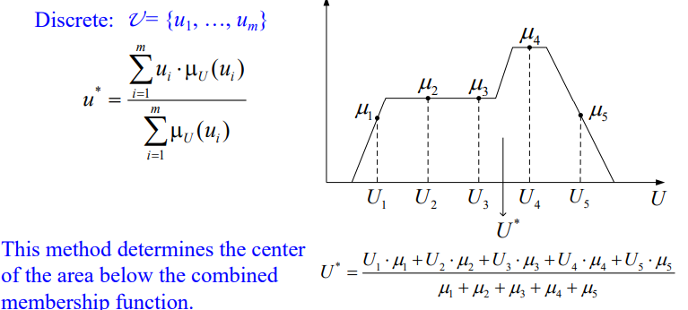

  * Denormalization

* Usually, the system is executed in round. The next round input will be determined by the output of current round and current input by some equation

* Method to improve the performance

  * Increase the number of fuzzy sets (instead of only 3 for inputs and 5 for output).
  * Increase the number of if-then rules.
  * Increase the number of input data points
  * Tune the shape of the membership functions.
  * Tune the entries of the fuzzy rule-base table.

* Applications:

  * Inverted Pendulum
  * Fuzzy Nonlinear Simulation

## Lecture 05 & 06 & 07: Path Finding And Optimization

### A* Algorithm

* Searching: Retrieve information stored within some data structure, or calculated in the search space of a problem domain, either with discrete or continuous values

  * Types
    * Linear/Binary Search
    * Graph/Tree search
  * Generated solution: A fixed sequence of actions
  * Process of find solution: Search phase
  * Solution found: execution phase

* Informed (Heuristic) Search

  * Use problem-specific knowledge => more efficiently

  * **Best**-First-Search: expand base on evaluation function $f$, expand the lowest evaluation node

    * $f$ often includes a heuristic function $h$ (estimation from current node to the goal node) $h=0$ for goal node 

    * $f$ cannot only contains heuristic (e.g. Euclidean distance), should also contains cost-so-far
      $$
      f(n) = g(n) + h(n)
      $$

      * $g$ cost from the staring node
      * $h$ estimation to the target

  * Optimal

    * Optimal is guaranteed if the heuristic is **admissible**(not overestimate the cost) and the search space is a tree
    * Optimal is guaranteed if the heuristic is **consistent**($h(n) \leq c(n, n')+h(n')$) and the search space is a graph
    * If consistent, then it is admissible (reverse is not guaranteed but frequently)

### Basic Optimization

* Def: Given a function, find the independent variables results in the minimum/maximum dependent variable

* Naive methods: e.g. minimum

  * For human: Calculate first order derivative, set it to zero. Calculate second order derivate, prove it is positive at that point (for minimum)
  * For machine: Take uniform distributed values among the domain, calculate the function for each of them and find the minimum value
  * If there are more independent variable => lots of computation

* Gradient-driven search:  $\alpha$ is learning rate
  $$
  find\ P_o = \{P_0 \in S | f(P_0) = min_{\forall P_i\in S}f(P_i) \} \\
  P_{n+1} = P_n - \alpha {\delta f \over \delta P}|_{P=P_n}
  $$

  * Function must be differentiable
  * Easy to be trapped in local optima => performance depends on the starting point

### Genetic Algorithm

* Overview

  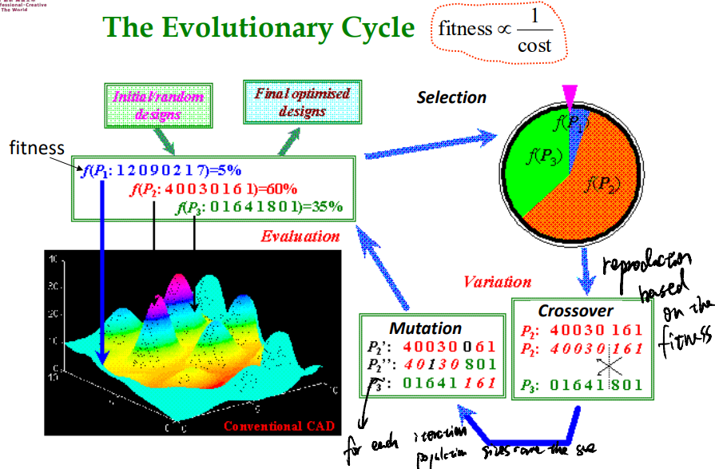

  * Evaluation: Calculate normalized fitness => assign probability to be selected
  * Selection/Reproduction: Select based on the probability (one entity can be chosen twice)
  * Variation
    * Crossover: Produce a child based on the parent vector and the crossover rate
    * Mutation: Change the string based on mutation rate
  * Note that the population size is unchanged

* Basic Operations

  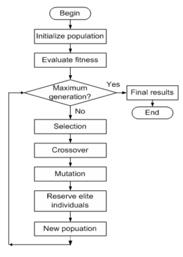

  ```
  Make initial population;
  Evaluate the fitness of all initial chromosomes;
  REPEAT
  	Reproduce children from parent (selection);
  	Apply crossover to some chromosomes;
  	Apply mutation to some chromosomes;
  	Preserve elite individuals;
  UNTIL satisfactory result found
  Decode the best chromosome found.
  ```

  * More parameters => more individuals; more generations

* Encoding and evaluation

  * Encoding Types: Binary, decimal, real, order-based
  * Evaluation Types: Numerical (fitness function) / Combinatorial (for order-based encoding)
  * e.g. binary => individual is a binary string, gene is one bit (8 bit string 10100011)
    * integer from 0 to 255 => just use the decimal (163)
    * Real number from 2.5 to 20.5 => $x = 2.5(min) + {163 \over 255}(20.5(max)-2.5(min)) = 13.9609$

* Mutation

  * Why => if one digit for all individuals in the current generation are the same, it will never be changed

  * Requirement

    * At least one mutation operator should allow every part of the search space to be reached.
    * The size of mutation is important and should be controllable.
    * Mutation should produce valid chromosomes
    * Mutation rate should not be so high (says higher than crossover rate)

  * Types

    * Binary: Change one/more bit(s)

    * Order-based: Swap to genes

    * Tree based: Randomly select a node and replace it with another random value

      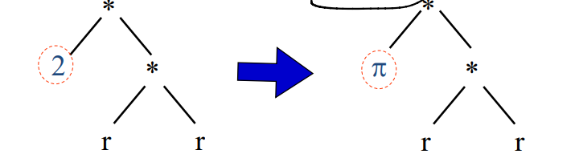

* Crossover

  * Why => Make it possible to generate new string has a better fitness score
  * Requirement
    * he child should inherit something from each parent. If this is not the case then the operator is a mutation operator.
    * Crossover should produce valid chromosomes.
  * Types
    * Binary
      * Cut from middle and swap
      * for each gene generate a binary value, it it is one then exchange with the parents (Choose an arbitrary part from the first parent and copy this to the first child, Copy the remaining genes (from the second parent) that are not in the copied part to the first child)
    * Order-based: Randomly select genes from the first parent to preserve. Find other genes with order in another parent the fill it to the empty genes
    * Tree-based: Cut at any portion of the tree (cut down sub-tree). Then swap the sub-tree

* Selection

  * Ensure better individuals have a better chance to be parents, also give less good individuals at least some chance
  * Probability of being selected: $f_i / \bar f$ (fitness of individual $i$ over sum of all fitness)
  * Disadvantage: 
    * Danger of premature convergence because outstanding individuals take over the entire population very quickly
    * Low selection pressure when fitness values are near each other
  * Preservation of elitism: Keep the best 10% of parent population and reintroduce them in the next generation by replacing the worst 10% of children 
  * Stop criterion: 
    * Optimization is reached
    * Limit on CPU resources: maximum number of fitness evaluations.
    * Limit on the patience: after some generations without improvement.
    * Never draw any conclusion from a single run
      * use statistical measures (e.g., average, standard deviation).
      * obtain results from a sufficient number of independent runs

### Schemata Theorem

* Solve the problem => why such evolution process will lead to better solutions

* Def: schema is a set of strings that share certain values
  $$
  **1**: \{11101, 11100, 01101, ....\}
  $$
  * $1$ matches $1$, $0$ matches $0$, $*$ matches either

  * For cardinality “$k$”, there are $(k+1)^l$ schemata in a string; $l$ is the length of the string

  * Order of schema: $o(S)$ is defined as **the number of fixed positions**

  * Defining length of schema: $d(S)$ of a schema is the **distance between the first and the last specific fixed position**

  * e.g. $S_1 = *1001*$, $S_2 = 1****0$, $O(S_1) = 4, O(S_2) = 2, d(S_1) = 3, d(S_2) = 5$ 

    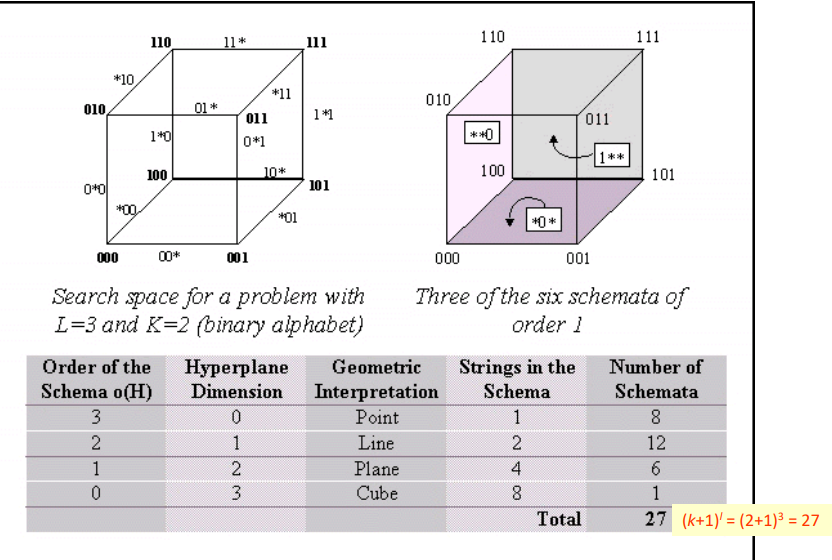  

* Effect of selection

  * Fitness of schema is defined as the average of the individuals within that schema:
    $$
    fit(S) = {\sum^r_{k=1} fit(x_k) \over r} (r = n_s(t))
    $$

  * Number of selected individuals for a schema in next generation: 
    $$
    for\ individual: P_i = {fit(x_i) \over \sum^N_{j=1}(x_j)} \\
    number\ of\ selected:Nr(x_i) = N*P_i = N{fit(x_i) \over \sum^N_{j=1}(x_j)} \\
    n_s(t+1) = N*\sum^r_{k=1}({fit(x_k) \over \sum^N_{j=1}(x_j)}) = {r*fit(S) \over {\sum^N_{j=1}fit(x_j) \over N}} = n_s(t){fit(S) \over <fit>}
    $$

  * Member of a schema will grow only when the average fitness of the schema is larger than the average of the generation (it will grows up exponentially)
    $$
    fit(S) = <fit> + \epsilon <fit> \\
    n_s(t+1) = n_s(t)*{<fit> + \epsilon <fit> \over <fit>} = n_s(t)(1+\epsilon)
    $$

* Effect of Crossover

  * Probability of destruction of schema $S$ is $d(S) \over l-1$ (There are $l-1$ positions in total to break, and $d(S)$ positions can be used to break the schema)

  * Crossover probability for a specific string is $P_{cross}$ 

  * If we assume the crossover happens only between two different schemas, the probability of surviving is $1 - P_{cross}{d(S) \over l-1}$ for each individual (or this part of individual can be reserved)

  * Combined effect of reproduction and crossover:
    $$
    n_s(t+1) = n_s(t){fit(S) \over <fit>}(1 - P_{cross}{d(S) \over l-1})
    $$


* Effect of Mutation

  * With the mutation probability $P_m$, the survival of schema is equal to
    $$
    P_{survival} = (1-P_m)^{o(S)} \\
    $$

  * Assume $P_m << 1$ 
    $$
    P_{survival} = 1-P_m{o(S)}
    $$

  * Combined effect of reproduction,  crossover, and mutation (we ignore the small term (mutation and crossover happens together))
    $$
    n_s(t+1) = n_s(t){fit(S) \over <fit>}(1 - P_{cross}{d(S) \over l-1}) (1-P_m{o(S)})\\
    \approx n_s(t){fit(S) \over <fit>}(1 - P_{cross}{d(S) \over l-1}-P_m{o(S)})\\
    $$

  * Low order, short defining length, highly fit schemata are called building blocks of the search. When the building blocks are pieced together, similar to solving the “Jigsaw Puzzle”, the solution emerges

### Multi-objective Evolutionary Algorithms (MOEA)

* Problem: Optimize multiple objectives 

  * **Consist of more than one conflicting objective function** (if there is no conflicting objectives in the set of objectives, it is not a multiple-objective optimization problem) 
    * e.g. car price & time taken from 0 to 100km
  * Method1: Transform into single-objective problem (require priori knowledge of relative importance of different objectives)
    * give different weight on different objective, combine to a single function
    * result in one point
  * Method2: Define problem in multi-objective framework ( provides the decision maker different tradeoffs instead of only one possible weight in method1)
    * Find a **set** of vectors which satisfy the given constraint and optimizes a number of objective functions
    * result in one surface (Pareto Optimal Front (PF)/final tradeoff)

* Example: Minimize following two objectives
  $$
  f_1(x_1, ..., x_8) = 1-exp(-\sum^8_{i=1}(x_i-{1\over \sqrt 8})^2) \\
  f_2(x_1, ..., x_8) = 1-exp(-\sum^8_{i=1}(x_i+{1\over \sqrt 8})^2) \\
  where\ -2\leq x_i \leq 2
  $$

  * According to the property of $f(x) = 1-e^{-x}$; $f \propto x$ 
    $$
    f_1 \propto (x_i-{1\over \sqrt 8})^2; f_2 \propto (x_i+{1\over \sqrt 8})^2
    $$
    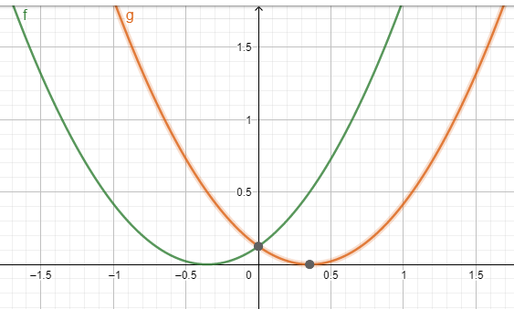

    * We can find that $f_1$ and $f_2$ are only conflict in the range $[-{1\over \sqrt 8}, {1\over \sqrt 8}]$ 

    * Therefore, the set of solution is in this range, and we set all $x_i$ equals to each other, which results in the minimum value

    * Notice that the final trade-off curve is the **lower bound** for the given problem (**we can get the value in the white region by some set of vectors, but it is impossible to find result in the dark region**)

      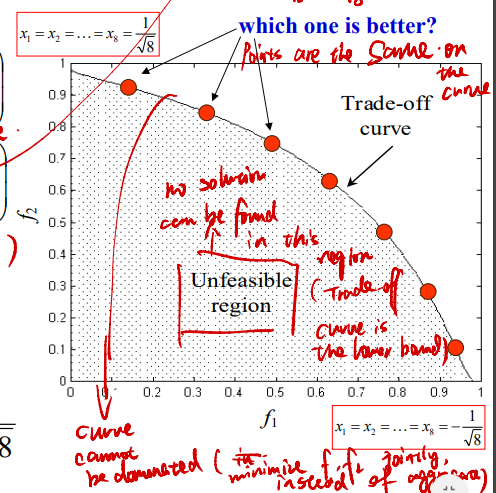

  * If we use single objective, we can use $f_{fit} = {1 \over f_1 + f_2}$ which result in a linear trade-off curve. 

* Requirement of EMO:

  * basic requirements: sufficient proximity to the exact Pareto-optimal point (convergence) and well spreading (diversity)
  * others
    * Good spread (along the curve), uniform distribution, minimum proximity (not above the curve)
    * Fitness assignment (assign fitness value for individuals), preference (different weight of objective)
    * Many objectives (e.g. 5 objectives), constraints (constraint for x (domain))
    * Noise (for same value of input, result in different output), dynamic landscape (f1, f2 changes among the time), robust optimization (small change of input, out put will not changed so much)

* Sharing and Elitism

  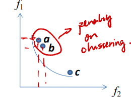

  * Difference in MEA compared with simple EA: Add Pareto ranking and fitness sharing in the fitness computation
  * Sharing (diversity): **Avoid the non-dominated solution clustering** on some portions of Pareto-optimal front, certain **penalty is applied to the clustering solutions**  (e.g. a and b are penalized)
    * Introduce niche and species
  * Elitism (convergence): **Elite or non-dominated solutions** should be given the opportunity to be directly carried over to the next generation. 
    * Introduce Pareto ranking

* Pareto Ranking: 

  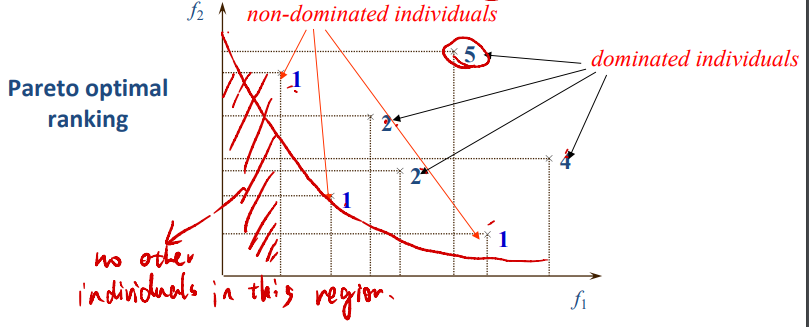

  * dominate means completely better, $f_1' < f_1, f_2' < f_2$ 
  * Assign the smallest cost to the non-dominated individuals (as 1), while rank the dominated individuals by the number of individual that dominates it (as (num of dom)+ 1)

* Niches (壁) and species

  * Using a sharing function, which draw a circle for each individual and degrading the fitness according to the number of individuals within the circle

  * The amount of sharing contributed by each organism $x_i$ into its neighbor $x_j$ is determined by their proximity in the decoded parameter space based on distance measure $d_{ij}$ (normalized Euclidean)

    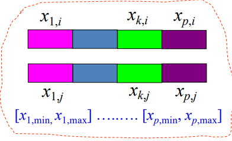

    * given $p$ parameters unequal boundaries over a parameter range $[x_{min}, x_{max}]$ 
      $$
      d_{ij} = \sqrt {\sum^p_{k=1}({x_{k,i}-x_{k, j} \over x_{k,max} - x_{k,min}})^2}
      $$

      * $x_{k,i}$: $k$-th parameter of individual $i$
      * $x_{k,j}$: $k$-th parameter of individual $j$
      * $x_{k,max}$: Maximum allowable value for $k$-th parameter
      * $x_{k,min}$: Minimum allowable value for $k$-th parameter
      * $p$: number of parameters

  * For each $d_{ij}$, we can apply the sharing function $s(d_{ij})$ given by:

    * $s$ decrease as $d_{ij}$ increase

    $$
    s(d_{ij}) = \left\{
    \begin{aligned}
    1-({d_{ij} \over \sigma_{share}})^w\ (if\ d_{ij} < \sigma_{share})\\
    0\ (otherwise)\\
    \end{aligned}
    \right.
    $$

    * If set $w$ to one, it is linear sharing (triangular sharing), used for simplicity

      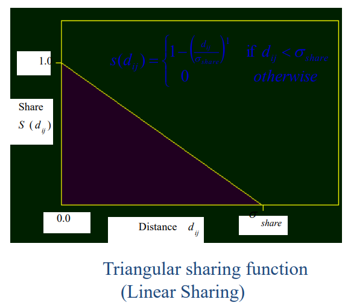

    * $\sigma_{share}$ defines the circle, it is calculated as the average distance required to identify each niche
      distinctly in the solution space. This value can be set based on $q$ uniformly spaced assumed peaks ($p$ is the number of parameters)
      $$
      \sigma_{share} = 0.5q^{-{1 \over p}}
      $$

      - $q$ increase => more peaks => need the region to be small to avoid it covers two peaks => small sigma
      - $p$ increase => many parameters => need larger search space => big sigma

  * The sharing fitness for each individual $i$ is defined as:
    $$
    SharedFitness = {Truefitness \over \sum_j s(d_{ij})}
    $$

    * **Note that $i$ itself is also considered when do the calculation**, therefore, minimum value for the denominator is $1$ (itself contribute one since distance is zero). Shared fitness is always less than the original fitness 
      * When $0 \leq d_{ij} \leq \sigma_{share}$, there is a fractional contribution sharing $s\leq 1$
      * When $d_{ij}=0$, they are identical, share a full portion with each other
      * $d_{ij} >\sigma_{share}$ then no effect on each other
    * This process is done before the selection

* Other issues

  * Decision support: set goal for Pareto Ranking (if it satisfy a goal, then set the ranking to 1) => result in the cluster on the specific region of the trade-off curve
  * Priority/Preference: Assign relative importance of each objective
  * Soft/hard Objective: 
    * soft: always consider in the evolution
    * Hard: Consider while goal is not satisfied (if it is already satisfying the goal, we don’t optimize this goal anymore)
  * Dynamic Population: 
    * MO needs larger population
    * Population size can be changed according to the population distribution at each generation
    * Generate individuals to cover the space on the trade-off curve

### Particle Swarm Optimization (PSO)

* Idea: 

  * Simulate a number of agents (particles) that constitute a swarm moving around in the search space looking for the best solutioneach particle adjusts its “flying” according to 

    * Own flying experience
    * Other particles’ flying experience

  * Each particle record the best solution (fitness) it achieves so far (**pbest**)

  * Each particle record the best solution (fitness) achieved by the neighborhood of the particle (**gbest**)

  * Accelerating each particle toward the best values with random weighted acceleration: 
    $$
    V_{id} = w\times V_{id} + c_1 \times Rand()\times (p_{id} - x_{id}) + c_2 \times Rand()\times (g_{d} - x_{id}) \\
    x_{id} = x_{id} + V_{id} \\
    $$

    * $V_{id}$: Velocity of each particle in each dimension ($i$: particle, $d$ : dimension)
    * $w$: Inertia Weight (great w results in global search, while small w results in local search)
    * $c_1, c_2$: Constants (if $c_1$ is larger, the particle would be affected by its personal best, otherwise, affected by the group best)
    * $Rand()$: Random number from 0 to 1
    * $p_{id}$: pbest
    * $g_{d}$: gbest
    * $x_{id}$: Current position

  * Each iteration, evaluate fitness and update best fitness for individual and group, and do the acceleration. Exit loop if a criterion is met

* Comparison with EA: No selection, crossover, and mutation. The group best is directly learnt by the individuals and adjusted through the inertial weight factor ($w$)

### Differential Evolution

* Considered as one of the most powerful evolutionary algorithms for real number function optimization

* Idea: Generate trial vectors ($v$) using the following formula:
  $$
  v_i = \textbf x_{r1} + \textbf F*(\textbf x_{r2}-\textbf x_{r3})
  $$

  * where $\textbf x_{r2}, \textbf x_{r3}$ are randomly selected from the current population and $F$ is a parameter called scaling factor

    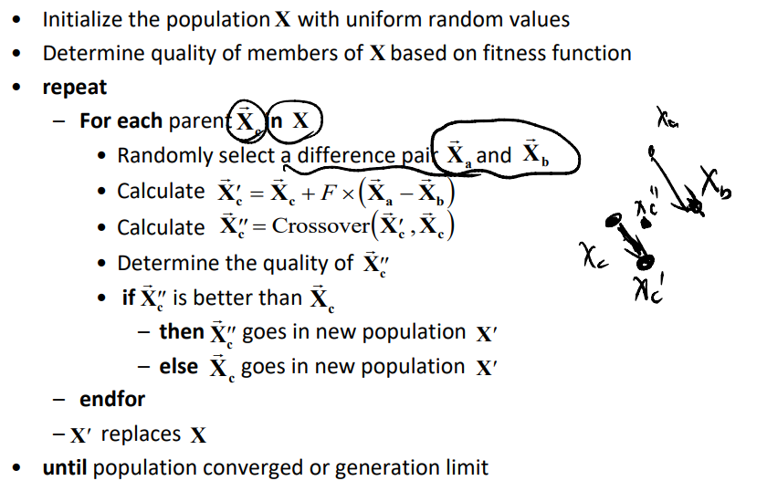

  * Less parameter to be tuned

* Different schemes: DE/x/y/z

  * DE: Differential Evolution

  * x: string denoting the vector to be perturbed

  * y: number of difference vectors considered for perturbation of x

  * z: type of crossover being used

    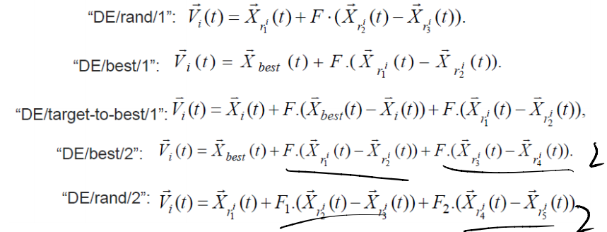

### Simulated Annealing

* Inspired by the analogy to physical annealing, one of the first stochastic local search method

* Idea: avoid local minima by accepting moves to worse solution probabilistically

  * Physical Annealing: obtaining the minimum energy state of solid, whereby the melted solid is slowly cooled down until reaching its ground state
  * Simulation: Metropolis algorithm is a simulation algorithm for the physical annealing
    process. It is generalized to optimization problem

* Notations:

  - $S$: Set of candidate solutions
  - $s$: Solution in $S$
  - $f$: **Cost function**
  - $f(s)$: Cost function value of solution $s$
  - $N(s)$: Neighborhood of $s$

* Overview:

  - Generate neighboring solutions $s_i$ from $N(s)$ 

    - Generate a random neighboring solution
    - Systematically generate neighboring solution, ensuring that neighborhood space is totally explored.

  - Accept new solution when $f(s_i) < f(s)$ (lower cost or higher fitness)

  - Otherwise, decide whether to accept with the probability $p$ (Metropolis criterion)
    $$
    p=exp(-{f(s_i)-f(s) \over T})
    $$

    - $T$ may be decreased in a constant rate among each iteration (if $T$ is too small, the function is difficult to be updated at the later iteration)
    - Larger difference will have smaller probability to be accepted

  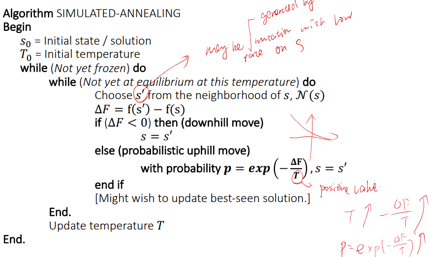

### Memetic Algorithm

* EA incorporating global search (crossover + mutation) and local search simultaneously

  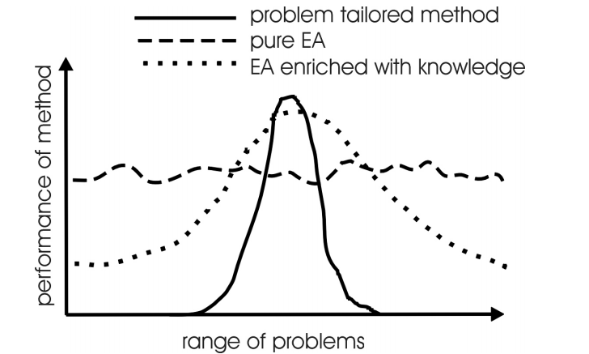

  * global: GA across generations

  * local: Individual learning within a lifetime of an individual implemented by problem-specific local searchers with MA

    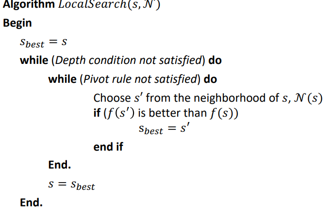

* domain knowledge: 

  * Specialized crossover
  * Specialized mutation
  * Problem specific representations
  * Problem specific local search

* Work flow: Various possibilities exist for incorporation of domain knowledge in the form of specialized evolutionary operators.

  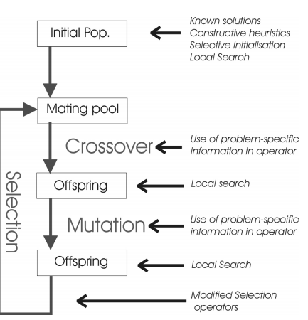

* Preservation of Diversity => Solve the problem that local search may lead to local optimum

  * allow only a small fraction of the population to do local search
  * Multiple local searcher to induce different search space and distinct local optima
  * Prevent duplicates in the selection operator
  * New acceptance criteria for local search, e.g. Boltzmann method (similar to Simulated Annealing)
