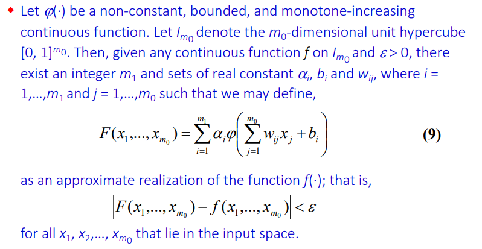

## Lecture 08 & 09 & 10: ANN and ANN Optimization

### ANN Basic

* Neural Network:  a *massively parallel distributed processor* that has a natural propensity for *storing experimental knowledge* and making it available for use

  * *learning process*: Acquire knowledge
  * *synaptic weights*: store the knowledge in the inter-neuron connection strengths

* Benefit

  * generalization
  * parallel structure 
  * Nonlinearity
  * Adaptivity (can be trained)
  * Fault tolerance (change one neuron might still be fine)

* Applications

  * Pattern Recognition
  * Function Approximation (regression)

*  Structure of a neuron

  

  * weight synapses
  * adder: Linear combinator
  * activation function: provide nonlinearity, constrain the range of the output signal
  * bias: change linear transformation to affine transformation
    * normally, we append a column of “1” to the input signal for each layer, and add bias to the weight matrix

* Activation function

  * Threshold function (hard limiter) (1 if larger than threshold, otherwise 0)

  * Piecewise-linear function: grow from 0 to 1 by a linear function

  * Sigmoid function: $\phi(v) = {1 \over 1+e^{-av}}$  (range is 0 to 1)

    * Most common

    * Strictly increasing

    * Differentiable everywhere

    * Asymptotically approach the saturation values (渐近饱和值)

    * $a$ is the slope parameter
      $$
      {\delta \phi \over \delta v} = -1*(1+e^{-av})^{-2}*(-ae^{-av}) \\
      ={ae^{-av} \over (1+e^{-av})^2} = a\phi(v)(1-\phi(v))
      $$

  * Tangent function: $\phi(n) = tanh(v)$(range is -1 to 1)

  * Gaussian functions (Gaussian radial basis functions): $\phi(v) = {1 \over \sqrt{2\pi} \sigma}exp(-{1\over 2}({v-\mu \over \sigma})^2)$

    * Continuous and differentiable everywhere
    * Asymptotically approaches 0 (or some constant) for $v \rightarrow +- \infty$
    * Single maximum at $v = µ$
    * Used in Radial Basis Function Networks

* Structure of a network

  * Defines how nodes are connected
  * Nodes can be partitioned into subsets called layers (no connection from current layer to previous layer, but interlayer connection may exist)
  * Multilayer is more common than single layer (multilayer network contains more than one hidden layer)

### Single-layer Network for Binary Classification and Regression

* single-layer feedforward network
  * Perceptron (simplest form of ANN for classification)
  * Linear Model Fitting (unconstrained optimization): Map multiple input to an output, evaluated by error $e = (d-y)^2$ 
    * Steepest Descent
    * Linear Least-Square Method
    * Least-mean-square (LMS) algorithm (delta rule)
* Task: Correctly classify the set of input samples into one of two classes $C_1$ and $C_2$ 
  * Decision boundary: ${\textbf w}^T{\textbf x} = 0$ ($\textbf w$ has appended the bias) 
  * Notice that the sign of $w$ doesn’t affect decision boundary, but affects the decision rule for two classes. For hard limiter, we should make sure:
    * ${\textbf w}^T{\textbf x} \geq 0$ (class 1, e.g. $y=1$)
    * ${\textbf w}^T{\textbf x} < 0$ (class 2, e.g. $y=$0)
  * Weight can be calculated for simple problems (choose weight for NAND gate). But needed to automatically learnt for complex problems (choose weight for XOR gate)
  * Perceptrons can be equivalent if we multiply the weight and the threshold by a same positive number
* Linear Separable: Two classes are linearly separable if and only if there exists a weight vector $w$ based on which the perceptron can correctly perform the classification.

### Perceptron Learning

* Algorithm

  

  * $d$ represents desired output
  * Two cases
    * if $d=0,y=1$, ${\textbf w}_{new}^T{\textbf x} = ({\textbf w}-\eta \textbf x)^T{\textbf x}={\textbf w^T}{\textbf x}-\eta \textbf x^T \textbf x < {\textbf w}^T{\textbf x}$  (make new one more likely to be smaller than one)
    * if $d=1, y=0$, ${\textbf w}_{new}^T{\textbf x} = ({\textbf w}+\eta \textbf x)^T{\textbf x}={\textbf w^T}{\textbf x}+\eta \textbf x^T \textbf x > {\textbf w}^T{\textbf x}$ (make new one more likely to be larger than one)

* Perceptron Convergence Theorem: If $C_1$ and $C_2$ are linearly separable, then the perceptron training algorithm “converges” in the sense that after a finite number of steps, $w’$ remains unchanged and the perceptron correctly classifies all elements of the training set.

  * If the problem cannot be solved using a perceptron (e.g., non-linearly separable patterns), then, if we apply the perceptron learning algorithm, cycling will occur; 
  * Choose correct $\eta$ can make the convergence speed faster

### Steepest Descent

* Minimize $E(\textbf w)$ w.r.t $\textbf w$, necessary condition is that the gradient w.r.t $\textbf w$ is zero

* The method: Let $g = \bigtriangledown E(\textbf w)$  
  $$
  \textbf w(n+1) = \textbf w(n) - \eta \textbf g(n) \\
  \Delta \textbf w = - \eta \textbf g(n)
  $$

* Reason: The function is always decreasing

  
  $$
  E(w(n+1)) \approx E(\textbf w(n)) + \textbf g^T(n)\Delta \textbf w(n) \\
  \approx E(\textbf w(n)) - \eta\textbf g^T(n)\textbf g(n) \\
  \approx E(\textbf w(n)) - \eta||\textbf g(n)||^2
  $$

### Linear Least-Square Method

* Define a cost function $E(\textbf w')$ (sum of error squares) (transpose for alignment)

  * Gradient perspective

  $$
  E(\textbf w') = {1\over 2} \sum^n_{i=1}e^2(i) = {1\over 2}{\textbf e^T}{\textbf e} = {1\over 2}(\textbf d-\textbf X\textbf w)^T(\textbf d-\textbf X\textbf w) \\
  {\delta E \over \delta w} = {\delta E \over \delta e} {\delta e\over \delta w} = \nabla_w(\textbf d-\textbf X\textbf w)\nabla_e ({1\over 2}{\textbf e^T}{\textbf e})  = (-\textbf X^T)\textbf e  = - \textbf X^T(\textbf d-\textbf X\textbf w) =0\\
  \textbf X^T\textbf X\textbf w = \textbf X^T\textbf d \\
  \textbf w = (\textbf X^T\textbf X)^{-1}\textbf X^T\textbf d
  $$

  * Geometric perspective: $\textbf e$ is a vector orthogonal to the column space of $\textbf X$
    $$
    \textbf X^T(\textbf d-\textbf X\textbf w) = 0
    $$

* Notice that $\textbf X^T\textbf X$ is not always invertible

### Least-Mean-Square Algorithm

* Apply steepest descent method to Least-square problem
* $\nabla E_{w} = -\textbf X^T(\textbf d - \textbf X^T\textbf w)$
* $\hat w(i+1) = \textbf w(i) + \eta \textbf x^T(\textbf d - \textbf X^T\textbf w)$  
* Also called Widrow-Hoff learning rule

### Backpropagation Algorithm

* Used for Multi-layer perceptrons

  

  * Minimize the square of instantaneous error: 
    $$
    E_q = {1\over 2}(\textbf d_{q}-\textbf x^{(3)}_{out})^T(\textbf d_{q}-\textbf x^{(3)}_{out}) = {1\over 2}\sum^{n_3}_{j=1}e^{2}_{qj}
    $$

  * Update weight matrix by using steepest descent
    $$
    w^{(s)}_{ji}(n+1) = w^{(s)}_{ji}(n)-\eta^{(s)} {\delta E_q \over \delta w^{(s)}_{ji}}
    $$

    * $s=1,2,3$ designates the  appropriate network layer, $\eta^{(s)} > 0$ is the corresponding learning rate parameter

* Output Layer:
  $$
  \Delta w^{(3)}_{(ji)} = -\eta^{(3)} {\delta E_q \over \delta v^{(3)}_j}{\delta v^{(3)}_j \over \delta w^{(3)}_{(ji)}} \\
  {\delta v^{(3)}_j \over \delta w^{(3)}_{(ji)}} = {\delta \over \delta w^{(3)}_{(ji)}} \sum^{n_2}_{i=0}w^{(3)}_{ji}x^{(2)}_{out,i} = x^{(2)}_{out,i} \\
  {\delta E_q \over \delta v^{(3)}_j} = {\delta \over \delta v^{(3)}_j}{1\over 2}\sum^{n_3}_{j=1}(d_{qj}-\phi(v^{(3)}_{j}))^2 =-(d_{qj}-\phi(v^{(3)}_{j}))({{\delta\phi(v^{(3)}_j)} \over \delta v^{(3)}_{j}}) \\
  =-(d_{qj}-\phi(v^{(3)}_{j}))\phi'(v^{(3)}_j)  = -e_{qj}\phi'(v^{(3)}_j)
  = -\delta^{(3)}_j \\
  \Delta w^{(3)}_{(ji)} 
  =\eta^{(3)}x^{(2)}_{out,i}\delta^{(3)}_j = \eta^{(3)}x^{(2)}_{out,i}e_{qj}\phi'(v^{(3)}_j)
  $$

* Hidden Layer: (only propagate the connected neurons in the next layer)
  $$
  \Delta w^{(2)}_{(ji)} = -\eta^{(2)}{\delta E_q \over \delta v^{(2)}_j} {\delta v^{(2)}_j \over \delta w^{(2)}_{(ji)}} \\
  {\delta v^{(2)}_j \over \delta w^{(2)}_{(ji)}} = {\delta \over \delta w^{(2)}_{(ji)}} \sum^{n_2}_{i=0}w^{(2)}_{ji}x^{(1)}_{out,i} = x^{(1)}_{out,i} \\
  {\delta E_q \over \delta v^{(2)}_j} = {\delta E_q \over \delta x^{(2)}_{out,j}}{\delta x^{(2)}_{out,j}\over \delta v^{(2)}_j} = {\delta E_q \over \delta x^{(2)}_{out,j}}\phi'(v^{(2)}_j) \\
  ={\delta \over \delta x^{(2)}_{out,j}}[{1\over 2}\sum^{n_3}_{k=0}(d_{qk}-\phi(v^{(3)}_{k}))^2] \phi'(v^{(2)}_j) \\
  ={\delta \over \delta x^{(2)}_{out,j}}[{1\over 2}\sum^{n_3}_{k=0}(d_{qk}-\phi(\sum^{n_2}_{j=0}w^{(3)}_{kj}x^{(2)}_{out,j}))^2] \phi'(v^{(2)}_j) \\
  =-(\sum^{n_3}_{k=0}(d_{qk}-x^{(3)}_{out, k})\phi'(v^{(3)}_k)w^{(3)}_{kj})\phi'(v^{(2)}_j) \\
  = -(\sum^{n_3}_{k=1}\delta^{(3)}_kw^{(3)}_{kj})\phi'(v^{(2)}_j) = -\delta^{(2)}_j
  $$

* Summary:
  $$
  w^{(s)}_{ji}(k+1) = w^{(s)}_{ji}(k) + \eta^{(s)}x^{(s-1)}_{out, i}\delta^{(s)}_j\\
  \delta^{(s)}_j = \left\{
  \begin{aligned}
  (d_{qj}-x^{(s)}_{out, j})\phi'(v^{(s)}_j)\ (output\ layer)\\
  (\sum^{n_{s+1}}_k \delta^{(s+1)}_k w^{(s+1)}_{kj} )\phi'(v^{(s)}_j)\ (hidden\ layer)\\
  \end{aligned}
  \right.
  $$

  * Forward: Computation of function signals for each neuron
  * Backward: Starts at output layer, recursively compute $\delta$ for each neuron from output layer towards the first hidden layer.

* Activation function: For sigmoid activation function $\phi(v) = {1\over 1+e^{-av}}$, we can simply use $\phi'(v) = a\phi(v)(1-\phi(v))$, then
  $$
  w^{(s)}_{ji}(k+1) = w^{(s)}_{ji}(k) + \eta^{(s)}x^{(s-1)}_{out, i}\delta^{(s)}_j\\
  \delta^{(s)}_j = \left\{
  \begin{aligned}
  (d_{qj}-x^{(s)}_{out, j})ax^{(s)}_{out,j}(1-x^{(s)}_{out,j}) \ (output\ layer)\\
  (\sum^{n_{s+1}}_k \delta^{(s+1)}_k w^{(s+1)}_{kj} )ax^{(s)}_{out,j}(1-x^{(s)}_{out,j})\ (hidden\ layer)\\
  \end{aligned}
  \right.
  $$

  * therefore, $\phi'(v)$ will be at maximum when the output is 0.5, and it will saturate when output is 0 or 1

* Stopping Criteria:

  

  * **Epoch**: A complete presentation of the entire training set during the learning process. It is the basis for learning process maintaining.
  * Possible criteria:
    * Error changes slowly
    * Weight matrix changes slowly
    * Error less than threshold

* Nonlinearly Separable problems

  

* Modes of training

  * Sequential Mode: Update weight for each training sample

    * Highly popular.
    * Simple to implement – requires less local storage for each synaptic connection.
    * Provide effective solutions to large problems.
    * Less likely to be trapped in a local minimum (if patterns are presented to the network in a random manner)

  * Batch Mode: Update weight after presentation of all (or a subset of) training samples
    $$
    E_{av} = {1 \over 2N}\sum^{N}_{q=1}\sum_{j=C}e^2_{qj} \\
    \Delta w_{ji} = -\eta{\delta E_{av} \over \delta w_{ji}} = -{\eta \over N} \sum^{N}_{q=1}e_{qj}{\delta e_{qj} \over \delta w_{ji}}\
    $$

    * The update vector $\Delta w$ is averaged among the batch samples
    * Accurate estimate of the gradient vector. Convergence to a local minimum is thereby guaranteed under simple conditions.
    * The composition of batch mode makes it easier to parallelize than the sequential mode.\

* Drawbacks of BP trained NN

  * Converge takes a long time
  * Cannot be fully explained (black box)
  * Can lead to local minimum for some specific functions
    * tune number of hidden layers and units
    * try different initialization weight
    * forced escape from local minima by random permutation
  * No theoretically well-founded way to assess the quality of BP learning
  * The learning (accuracy, speed, and generalization) is highly dependent on a set of learning parameters (hyperparameters)

* Generalization: A network is said to generalize well when the input-output mapping computed by the network is correct (or near so) **for test data never used in creating or training the network**.  

  * Influences by Size and accuracy of training set; Overfitting or overtraining; Architecture
    of neural network, such as simplicity, smoothness

  * In practice, for good generalization, we could have the size of the training set, $N$, satisfy the condition
    $$
    N=O({W \over \epsilon})
    $$

    * $W$ is the total number of free parameters (weight matrix),
    * $\epsilon$ is the fraction of classification errors permitted on test data
    * $O$: the order of quantity enclosed within. e.g.  with an error of 10%, the number of training examples needed should be about 10 times the number of free parameters in the network

  * Method for good generalization

    * Limit number of hidden unit
    * Limit weights (Regularization)
    * Stop before overfitting (adjust epoch number)

* Approximations of functions

  

  * Two layers neural network can simulate all possible functions
  * Logistic function is indeed fulfill the requirement of $\phi$
  * **notice that**: theorem merely states one hidden layer is sufficient, but it does not indicate the optimal number of hidden layers in term of learning time, ease of implementation, and generalization.

### Deep Learning

* How it works: 
  * Use deep neural network
  * trained by large set of labeled data 
  * directly learn from raw data without feature extraction
  * can train from scratch, transfer learning and fine tuning or feature extraction (extract then feed into network)
* Restricted Boltzmann Machine (RBMs)
  * generative stochastic artificial neural network that can learn a probability distribution over its set of inputs.
  * Only allows connections between consecutive layers
  * This restriction allows for more efficient training algorithms
* Deep Belief Network (DBN)
  * stack of RBMs
  * Deep Belief Networks capture higher-level representations of input features Pre-train Artificial Neural Networks (ANNs) weights in an unsupervised fashion, followed by fine-tuning (backpropagation)s
* Unsupervised & Supervised learning: DBN often can be used for both unsupervised learning and supervised learning. For unsupervised learning, it can be used to solve clustering problems. For supervised learning, it can be used to solve classification problems.
* Layer size/Hidden units number: Depends on the dataset
  * few: short training time, but may result in poor performance
  * too many: may result in overfitting and slow speed of training

