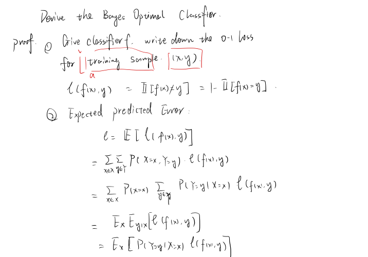
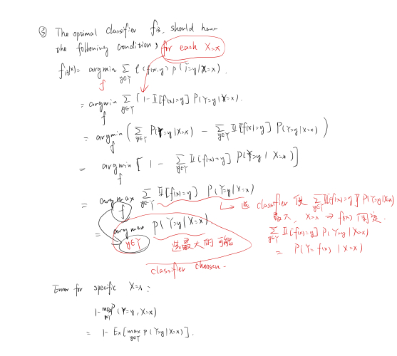

# CS4487 Machine Learning

## Lecture 1: Introduction

* Course Information
  * Content
    * Lecture: Learning algorithm & Mathmetical Proof
    * Tutorial: Use learning algorithms on small examples
    * HW: four => derive and analyze machine learning algorithms with mathematical tools
  * Grade: 
    * Coursework(40)
      * 10(tutorial)
      * 30(assignment)
    * midterm(30)
    * final(30)
  * Book: 
    * Pattern Recognition & Machine Learning (C M B)
    * Convex Optimization (S B & L V)
    * The Matrix Cookbook (K B P)
    * Linear Algebra and Its Applications
    * Deep Learning
  * Syllabus:
    * Classification, regression, clustering, dimensionality reduction and deep learning
    * Model selection, model evaluation, regularization, design of experiments
  * Prerequisites:
    * Linear Algebra
    * Calculus
    * Probability and Statistics
    * Optimization
    * Python
  * Some problem
    * derivative of matrix with respect to another
    * maximum likelihood estimation(MLE) & maximum a posteriori estimation(MAP), and their relationship 
    * difference between gradient descent and stochastic gradient descent
    * sigular value decomposition(SVD) and principal component analysis (PCA) and their relationship 
* Introduction
  * type
    * By I/O
      * Supervised: Learning to predict (with a set of input and output)
      * Unsupervised: Learning to organize and represent
    * By Parameter
      * Non-parametric: storing the training data
      * Parametric: Using an algorithm to adapt the parameters in a mathematical or statistical model given training data
  * Sample => feature => training=>learned model
  * AI > ML (Data) > DL (multi-layer)
* Math
  * Vector Space (column vector)
  * Matrix
    * Square, diagonal, identity
    * Transpose, trace, inverse, **determinant**
    * **eigenvalue, eigenvectors**, orthogonality
  * Probability Concepts
    * Probability Distribution
    * Random Variable (X): Maps each element(get 2 balls) of the sample space to a value x(2) in X(called the range of the random variable)
    * Marginalization
    * Conditioning
    * Bayes Rules
    * Expectations
    * Classical Distributions (Bernoulli, Multinomial, Gaussian)

------------

## Lecture 2: KNN and Naive Bayes

### Classification

* Definition: 

  

* Classifier Learning

  

* Error and Accuracy

  

### KNN

* Definition

  

  * Notice that $argmax$ will traverse all the element in a set

  * Work with any distance function $d$ satisefying non-negativity$d(x,x’)>0$ and identity of indiscernibles $d(x,x)=0$

  * Alternatively, KNN can work with any similarity function $s$s atisfying non-negativity $s(x, x') ≥ 0$ that attains it’s maximum on indiscernibles $s(x, x) = max_{x'} s(x, x')$

  * Distance Metrics

    

  * Variant

    * If there are 4 very far point and 1 very close point => vote to very far

    * For each class $y$, traverse all the $k$ closest points, add all weights that belongs to the class and divide by some of weight of all $k$ closest points, where the weight of $i_{th}$ point is defined as $exp(-\alpha d_i)$. Then, choose the class with the maximum value

      

  * [**K-d tree** to reduce the complexity](<https://zhuanlan.zhihu.com/p/23966698>): Make use of the division line

    * Point to search: (-1, -5)

    

    

  * Trade off

    * Low bias: Converges to the correct decision surface as data goes to infinity
    * High variance: Lots of variability in the decision surface when amount of data is low
    * Curse of dimensionality: Everything is far from everything else in high dimensions
    * Space and time complexity: Need to store all training data. Take time at run time to compute

### Bayes Optimal Classifiers

* Probabilistic Classification

  * Ture probability of seeing a data case that belongs to $p(Y=y)=\phi_y​$

  * Ture probability density of seeing a data vector $x \in \R^n​$ that belongs to class $y​$ is $p(X=x|Y=y)=\varphi_y(x)​$

  * To calculate with vector $x​$ the probability of any one of $y​$ : 
    $$
    p(Y=y|X=x)={{p(X=x|Y=y)p(Y=y)}\over{\sum_{\tilde{y}\in Y}p(X=x|Y=\tilde{y})p(Y=\tilde{y})}}={{\varphi_y(x)\phi_y}\over{\sum_{\tilde{y}\in Y}}\varphi_\tilde{y}(x)\phi_\tilde{y}}
    $$

* Bayes Optimal Classifiers
  $$
  f_B(x)=arg max_{y\in Y}\ p(Y=y|X=x)=arg max_{y\in Y}\ \varphi_y(x)\phi_y
  $$
  
  $$
  MIN\ Error=1-E_x[max_{y\in Y}p(Y=y|X=x)]
  $$
  

  * $p(X=x)​$ can be treated as a constant for specific input vector

  * $E_x$ represents expectation with the condition $X=x$ 

  * Proof:

    

    

    

  * Not useful in practice: difficult to estimate $\varphi_y(x)$ in high dimensions

### Naive Bayes

* Naive bayes classifier approximates the Bayes optimal classifier using a simple form for the functions $\varphi_y(x)$ 

* Assumes that all of the data dimensions are statistically independent given the value of the class variable
  $$
  \varphi_y(x)=p(X=x|Y=y)=\Pi^n_{j=1}p(X_j=x_j|Y=y)=\Pi^n_{j=1}\varphi_{j|y}(x_j)
  $$

* The general form for the classification function:
  $$
  f_{NB}(x)=argmax_{y\in Y}\ \phi_y\ \Pi^n_{j=1}\varphi_{j|y}(x_j)
  $$

