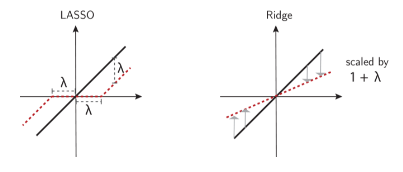

# CS4487 Machine Learning

## Lecture 1: Introduction

* Course Information
  * Content
    * Lecture: Learning algorithm & Mathmetical Proof
    * Tutorial: Use learning algorithms on small examples
    * HW: four => derive and analyze machine learning algorithms with mathematical tools
  * Grade: 
    * Coursework(40)
      * 10(tutorial)
      * 30(assignment)
    * midterm(30)
    * final(30)
  * Book: 
    * Pattern Recognition & Machine Learning (C M B)
    * Convex Optimization (S B & L V)
    * The Matrix Cookbook (K B P)
    * Linear Algebra and Its Applications
    * Deep Learning
  * Syllabus:
    * Classification, regression, clustering, dimensionality reduction and deep learning
    * Model selection, model evaluation, regularization, design of experiments
  * Prerequisites:
    * Linear Algebra
    * Calculus
    * Probability and Statistics
    * Optimization
    * Python
  * Some problem
    * derivative of matrix with respect to another
    * maximum likelihood estimation(MLE) & maximum a posteriori estimation(MAP), and their relationship 
    * difference between gradient descent and stochastic gradient descent
    * sigular value decomposition(SVD) and principal component analysis (PCA) and their relationship 
* Introduction
  * type
    * By I/O
      * Supervised: Learning to predict (with a set of input and output)
      * Unsupervised: Learning to organize and represent
    * By Parameter
      * Non-parametric: storing the training data
      * Parametric: Using an algorithm to adapt the parameters in a mathematical or statistical model given training data
  * Sample => feature => training=>learned model
  * AI > ML (Data) > DL (multi-layer)
* Math
  * Vector Space (column vector)
  * Matrix
    * Square, diagonal, identity
    * Transpose, trace, inverse, **determinant**
    * **eigenvalue, eigenvectors**, orthogonality
  * Probability Concepts
    * Probability Distribution
    * Random Variable (X): Maps each element(get 2 balls) of the sample space to a value x(2) in X(called the range of the random variable)
    * Marginalization
    * Conditioning
    * Bayes Rules
    * Expectations
    * Classical Distributions (Bernoulli, Multinomial, Gaussian)

------------

## Lecture 2: KNN and Naive Bayes

### Classification

* Definition: 

  

* Classifier Learning

  

* Error and Accuracy

  

### KNN

* Definition

  

  * Notice that $argmax$ will traverse all the element in a set

  * Work with any distance function $d$ satisefying non-negativity$d(x,x’)>0$ and identity of indiscernibles $d(x,x)=0$

  * Alternatively, KNN can work with any similarity function $s$s atisfying non-negativity $s(x, x') ≥ 0$ that attains it’s maximum on indiscernibles $s(x, x) = max_{x'} s(x, x')$

  * Distance Metrics

    

  * Variant

    * If there are 4 very far point and 1 very close point => vote to very far

    * For each class $y$, traverse all the $k$ closest points, add all weights that belongs to the class and divide by some of weight of all $k$ closest points, where the weight of $i_{th}$ point is defined as $exp(-\alpha d_i)$. Then, choose the class with the maximum value

      

  * [**K-d tree** to reduce the complexity](<https://zhuanlan.zhihu.com/p/23966698>): Make use of the division line

    * Point to search: (-1, -5)

    

    

  * Trade off

    * Low bias: Converges to the correct decision surface as data goes to infinity
    * High variance: Lots of variability in the decision surface when amount of data is low
    * Curse of dimensionality: Everything is far from everything else in high dimensions
    * Space and time complexity: Need to store all training data. Take time at run time to compute

### Bayes Optimal Classifiers

* Probabilistic Classification

  * Ture probability of seeing a data case that belongs to $p(Y=y)=\phi_y$

  * Ture probability density of seeing a data vector $x \in \R^n$ that belongs to class $y$ is $p(X=x|Y=y)=\varphi_y(x)$

  * To calculate with vector $x$ the probability of any one of $y$ : 
    $$
    p(Y=y|X=x)={{p(X=x|Y=y)p(Y=y)}\over{\sum_{\tilde{y}\in Y}p(X=x|Y=\tilde{y})p(Y=\tilde{y})}}={{\varphi_y(x)\phi_y}\over{\sum_{\tilde{y}\in Y}}\varphi_\tilde{y}(x)\phi_\tilde{y}}
    $$

* Bayes Optimal Classifiers
  $$
  f_B(x)=arg max_{y\in Y}\ p(Y=y|X=x)=arg max_{y\in Y}\ \varphi_y(x)\phi_y
  $$
  
  $$
  MIN\ Error=1-E_x[max_{y\in Y}p(Y=y|X=x)]
  $$
  

  * $p(X=x)$ can be treated as a constant for specific input vector

  * $E_x$ represents expectation with the condition $X=x$ 

  * Proof:

    

    

    

  * Not useful in practice: difficult to estimate $\varphi_y(x)$ in high dimensions

-----------

## Lecture03: Naive Bayes, Linear Discriminant Analysis and Logistic Regression

### Naive Bayes

* Naive bayes classifier approximates the Bayes optimal classifier using a simple form for the functions $\varphi_y(x)$ 

* Assumes that all of the data dimensions are statistically independent given the value of the class variable
  $$
  \varphi_y(x)=p(X=x|Y=y)=\Pi^n_{j=1}p(X_j=x_j|Y=y)=\Pi^n_{j=1}\varphi_{j|y}(x_j)
  $$

* The general form for the classification function:
  $$
  f_{NB}(x)=argmax_{y\in Y}\ \phi_y\ \Pi^n_{j=1}\varphi_{j|y}(x_j)
  $$

* The functions $\varphi_{j|y}(x_j)=p(X_j=x_j|Y=y)$ are called *marginal class conditional distributions* 

  * For real valued $x_j$, $p(X_j=x_j|Y=y)$ is typically modeled as a Gaussian density $\varphi_{j|y}(x_j)=N(x_j;\mu_{j|y}, \sigma_{j|y}^2)$ 
  * For binary valued $x_j$ ,$p(X_j=x_j|Y=y)$ is typically modeled as a Bernoulli distribution $\varphi_{j|y}(x_j)=\theta_{j|y}^{x_j}(1-\theta_{j|y})^{(1-x_j)}$  
  * For general categorical values $x_j$, $p(X_j=x_j|Y=y)$ is typically modeled as a categorical distribution $\varphi_{j|y}(x_j)=\Pi_{x\in X_j}\theta_{x,j|y}^{I[x_j=x]}$   

* The problem to maximize is how to choose a correct $\phi_y$ and $\varphi_{j|y}(x_j)$ => using the *maximum likelihood* over $D=\{(x^{(i)},y^{(i)}), i=1,…,m\}$ 

  * **posterior probability**: $P(Y=y|X=x)$,  … :  likelihood $P(X=x|Y=y)$ , Prior probability: $P(Y=y) $ 
  * maximum likelihood: 让取样获得的大前提($P(D)$)可能性最大, $D$ 为数据集

  

  * for Bernoulli distribution, $x_j$ is $0$ or $1$
  * proof of the class probabilities $\phi_y$ and the categorical probability $\theta_{x,j|y}$ => see lecture note

* Geometric Interpretation: for normal distribution of $x$, and binary classification problem we have =>

  

  

* Laplace Smoothing

  * The maximum likelihood : 

    

  * If the training set is small, it’s possible that $I[x_j^{(i)}=x]=0, for\ any\ i\in[1,m],i\ is\ integer$  

  * Cause the probability to be zero, which is overfitting

  * Laplace smoothing method:

    

  * When $\alpha=1$ it’s called Laplace smoothing

  * it can be shown that Laplace smoothing is the posterior mean with Dirichlet distribution as the conjugate prior for Categorical distribution

* Trade offs

  * Speed: learning and classification are fast
  * Storage: $O(n)$ parameters, large compression of the training data
  * Interpretability: good because $\varphi_y(x)$ is the class conditional averages
  * Accuracy: feature independence assumption and canocial forms for class-conditional marginals will rarely be correct for real-world problems, leading to lower accuracy 
  * Data: Some care is needed in the estimation of parameters in the
    discrete case when data is scarce(small data set)

### Linear Discriminant Analysis

* Linear Discriminant Analysis

  * A different approximation to the Bayes optimal classifier for real-valued data (instead of Maximum Likelihood)

  * Use dependent Normal Distribution in Naive Bayes, LDA assumes $\varphi_y(x)=N(x; \mu_y, \sum)$ , where $\sum$ is covariance matrix

    

    

  * By using maximum likelihood, which reduces to using sample estimates:

    

  * similar to the one dimensional case, the decision boundary consists of points $x$ where:

    

* Trade-offs

  * Speed: quadratic dependence on $n$ dimension makes LDA slower than Naive Bayes
  * Storage: $O(n^2)$ parameters, good when $n<<m$ 
  * Interpretability: Good interpretability
  * Accuracy: Rarely be correct in real-world problems. However, the induced linear decision boundaries can often perform reasonably well
  * Data: LDA will generally need more data than NB since it needs to estimate the *O*(*n*2) parameters in the pooled covariance matrix

### Logistic Regression

* Generative vs. Discriminative Classifiers

  * Naive Bayes and LDA are said to be *generative* classifier because they explicityly model the joint distribution $p(x,y)$ of the data vectors $x$ and the lablel $y$ 
  * To build a probabilistic classifier, all we really need to model is $p(y|x)$ 
  * classifiers based on directly estimating $p(y|x)$ are called *discriminative* classifiers because they ignore the distribution of $x$ and focus only on the class labels $y$ 

* Logistic Regression

  * In binary case, it directly models the decision boundary using a linear function:

    

  * Now the classifunction is : $f_{LR}=argmax_{y\in Y}p(Y=y|x)$: 

    * the standard logistic function, or the sigmoid function is defined as:
      $$
      g(z)={1\over{1+e^{-z}}} \\
      g'(z)=-({1\over{1+e^{-z}}})^2*(-e^{-z})\\
      =g(z)(1-g(z))
      $$

* The learning logistic regression

  * logistic regression model parameters $\theta={\{w,b\}}$ are selected to optimize the conditional log likelihood of the labels given the data set $D=\{(x^{(i)},y^{(i)}),i=1,…,m\}$ : 

    

  * cannot be maximized analytically. Learning the model parameters requires numerical optimization methods

* Multiclass Logistic Regression

  * Logistic regression extends to multiclass case:

    

  * [why different from binary case?](<https://blog.csdn.net/huangjx36/article/details/78056375>)

* Geometry

  * **Explicityly designed** to have a **linear decision boundary in the binary case**
  * In the multiclass case, the decision boundary is piece-wise linear
  * Same representational capacity as LDA

* Trade-offs

  * Speed: Faster than NB and LDA in classification time, numberical optimization is slower than naive bayes
  * Storage: O(n) parameters
  * Interpretability: The “importance” of different feature variables
    $x^j$ can be understood in terms of their weights $w^j$
  * Accuracy: Tends to be better in high dimensions with limited
    data compared to LDA. Much worse than KNN in low dimensions with **lots of data and non-linear decision boundaries** 

* Probability view of logistic function(sigmoid function)

  

-----------

## Lecture 04: Gradient Descent and Stochastic Gradient Descent

### Gradient Descent

* Gradient Descent

  * typical form of machine learning problem

    

  * for logistic regression, trying to minimize the negative log likelihood:

    

  * choose initial point $\theta^{(0)} \in \R^n$ and repeats

    

    

  * why gradient descent works

    

    

    

    

    

* Stochastic Gradient Descent

  * Compute loss for all the training data to get average takes $O(m)$ times

  * Can only choose one training data(i.e. one vecvtor) to (point)estimate the  true gradient

    

    

    

* Mini-Batch Gradient Descent

  * use a subset of samples => interval estimate => mean value theorem

    

* Gradient Descent of Logistic Regression

  

--------------

## Lecture05: Linear Regression

### Regression

* Regression: Given a feature vector $x \in {\R}^n$, predict it’s corresponding output value $y \in \R$ 
* Questions:
  * Does size of sample matters? => we prefere larger sample size
  * Does location of points matters? => Samples need be representative or informative
  * Given a set of $m$ points, is curve fitting unique? => Estimating “continuous” model from “discrete” data is all ill-posed problem and can never be “certain”
  * How to choose the best model from infinite curves? => Have some criteria choose prefered model 

* Example: House price, weather prediction, age estimation ...

* Regression learning problem:

  

* Error measure:

  * MSE:

    

    * SSE and RSS are the same

  * MAE:

    

### Linear Regression

* A parametric regression method that assumes the relationship betweeen $y$ and $x$ is a linear function with parameters $w=[w_1,w_2,…,w_n]^T$ and $b$ 

  

* Ordinary Least Squares (OLS) Linear Regression

  * Minimize the MSE on the training data set:

    

  * Use derivative:

    

* General OLS Solution

  * Assume that $X \in \R^{m\times (n+1)}$ is a data matrix with one data case $x^{(i)} \in \R^{n+1}$ per row, where $x^{(i)}_0=1$ and $y \in \R^m$ is a column vector containing the corresponding outputs. $w \in \R^{n+1}$ where $w_0=b$ 

  * Use derivative:

    

    

  * Use projection:

    

* Connection to Probabilistic Models

  

  

  * Proof: 

    

* Normal Equations

  

  * Pseudo-inverse

    

  * For invertable $X$ pseudo-inverse is just inverse

  * When $X^TX$ is non-invertable:

    * $m<n+1$ => increase sample set and regularization
    * $m>n+1$ => singular  (remove redundant features)
      * Reason: $rank(X^TX)=rank(X)$ 

  * $n$ to large => GD

  * $m$ to large => SGD / mini-batch GD

* Strengths and Limitations of OLS
  * Need at least $m \geq n+1$ data cases to learn a model with an $n$ dimensional feature vector. Otherwise **inverse of** $X^TX$ is not defined
  * Very sensitive to noise and outliers due to MSE objective function/Normally distributed residuals assumption (prefer many medium error than one large error)
  * Sensitive to co-linear features ($x_i \approx ax_j+b$) . Otherwise inverse of $X^TX$ is not numerically stable
  * Computation is cubic in data dimension $n$ 

---------

## Lecture06: Regularized Linear Regression: Ridge, and Lasso & Overfitting, Regularization, and Cross Validation

### Regularized Linear Regression

* Reason of regularization

  * Control the parameter space to avoid *overfitting*

  * Obtain numberically more stable solutions

  * Enforce the desired parameter space as a prior

  * What is the price that we pay? The regularization term will bias the least squares estimate (not exactly least square)

  * Probabilistix interpretation:

    

* General framework:

  

  * For ridge regression, $q=2$. Closed-form solution exists
  * For lasso regression, $q=1$. It is a quadratic programming problem with no closed-form solution in general. However, it can be solved efficiently using an algorithm called *least angle regression*. The advantage is that lasso simultaneously performs regularization and **encourages sparsity** (as a way of feature selection)
  * When $q<1$, the problem is non-convex, but **encourages more sparsity**

* The relationship between the **weight matrix** of regularized version and linear regression version

  * assume that: $X^TX=I$ (each feature vector are unit orthogonal basis)

  * Linear regression: $min_w{1\over 2}||Xw-y||^2_2$ 
    $$
    w_{LS}=(X^TX)^{-1}X^Ty=X^Ty
    $$

  * Ridge regression: $min_w{1\over 2}||Xw-y||^2_2+{\lambda\over2}||w||^2_2$  

    ​	
    $$
    w_{RR}=(X^TX+\lambda I)^{-1}X^Ty=X^Ty/(1+\lambda)=W_{LS}/(1+\lambda)
    $$

  * Lasso regression: $min_w{1\over 2}||Xw-y||^2_2+{\lambda}||w||_1$ 

    
    $$
    w_{RR}=(X^TX+\lambda I)^{-1}X^Ty=X^Ty/(1+\lambda)=W_{LS}/(1+\lambda)
    $$

  * Proof:

    

    

  * Geometrical meaning (with x-axis $W_{LR}$)

    

* Lasso vs Ridge (2D case)

  * Property of the minimum point

  

  

  * Graph of Lasso regression and Ridge regression:

    

    * it’s easier to have the intersection on the corner for $l_1$ case
    * one of $w_j$ will  be zero, which means the feature is dropped => sparsity

* Strengths and Limitations of Ridge and Lasso

  * Need at least $m \geq n+1$ data cases to learn a model with an $n+1$ dimensional feature vector (similar as linear regression)
  * Work when $X^TX$ is close to singular => select feature
  * MSE objective function is still sensitive to noice points
  * Do not solve **bias problem**
  * Computation for ridge is still cubic in data dimension $n$ with additional cost to determine regularization parameters. Computation for lasso is similar

### Review

- We have learnt 4 classifiers in depth: KNN, Naive Bayes, LDA and Logistic Regression
  - KNN: Results sensitive to $k$
  - Logistic Regression: $p(y|x;w)$ sensitive to the magnitude of $w$

### Capacity and Generalization

- Model capacity:

  - **Deterministic classifiers** that can represent **more complex decision boundaries** (in log form) are said to have **higher *capacity*** than classifiers that can only represent simpler boundaries 
  - **Probabilistic classifiers** that can represent **more complex sets of conditional $p(y|x)$** are said to have higher $capacity$ than probabilistic classifiers that can only represent simpler sets of conditionals
  - Rank of the leart classifiers: KNN > Naive Bayes, Logistic Regression $\approx$ LDA

- Reason of not always using the classifier with the highest possible capacity for every problem

  - This would minimize the error on the **training data**. However, what we really care about for prediction problems is *generalization* 

- **Generalization**:  The ability of a trained classifier to achieve an error rate on *future*, *unseen examples* (the generalization error rate) that is comparable to the training error rate

- **Capacity Control**: To achieve optimal generalization performance for a given traing set, we often need to control model capacity carefully

- **Overfitting vs underfitting**

  - **Overfitting**: The generalization error for a classifier is much worse than the training error. This usually results from choosing a classifier with too much capacity so that it models the noise in the training data

  - **Underfitting**: Occurs when the capacity of the classifier is too low to capture the actual structure in the training data, leading to both high training error and high generalization error

  - Examples(error on the down-left corner graph):

    

    

- Bias-Variance Trade-Off (both of them are negative things)

  - Bias: A classifier is said to have low *bias* if the true decision boundary or conditionals $p(y|x)$ can be **approximated closely by the model** 
  - Variance: A classifier is said to have low *variance* if the decision boundary or conditionals $p(y|x)$ it constructs are stable with respect to small changes in the training data 
  - Bias-Variance Dilemma: To achieve **low generalization error**, we need classifiers that are low-bias and low-variance, but this isn’t always possible 
  - Bias-Variance and Capacity: On **complex data**, models with **low capacity have low variance**, but **high bias**; while models with **high capacity** have **low bias**, but **high variance** 

### Hyperparameters

- Why need to control hyperparameters

  - In order to control the capacity of a classifier, it needs to have capacity control parameters
  - Because capacity control parameters can not be chosen based on training error, they are often called hyperparameters
  - For KNN: $k$, for logistic regression: $\alpha\ and\ \lambda$  

- Capacity, Smoothness and Regularization

  

  - **Capacity and Smoothness**: In the case of probabilistic classifiers like naive Bayes, LDA, and logistic regression, we can think of capacity in terms of the *smoothness* of $p(y|x)$

  - **Regularization**: We can control the smoothness of $p(y|x)$ using a technique called *regularization* that penalizes parameters that result in overly complex $p(y|x)$ during learning

  - **Laplace Smoothing**: In the case of Naive Bayes, we introduced Laplace smoothing for a categorical distribution

    

    - As the regularization hyperparameter $α$ increases, our estimate
      of the distribution smooths out toward being uniform

  - In the case of logistic regression, the smoothness of $p(y|x;\theta)$ is determined by the magnitude of $\theta$ 

    - Similar in linear regression, we ca control the magnitude of $\theta$ by introducing a regularization term into the conditional log likelihood learning criteria that penalizes the $l_p$-norm of $\theta$ 

    

    - As the regularization hyperparameter $λ$ increases, the learned
      $p(y|x; θ)$ will smooth out

### Model Selection and Evaluation

- Principles:

  - We’ve identified the parameters that **control the capacity** of our models, we need a way to choose optimal values for these parameters
  - In addition, we will want an estimate of the **generalization error** that the selected parameters achieve
  - To obtain valid results, we need to use appropriate methodology
    and construct learning experiments carefully
  - **Guiding Principle**: Data used to estimate generalization error(**testing set**) can not be used for any other purpose, $i.e.$, model training, hyperparameter selection, feature selection, etc. Otherwise, the results of the evaluation will ve $biased$ 

- Methods:

  - Recipe 1: Train, Validation, and Test

    - Given a data set $D$, we randomly partition the data cases into a **training set (Tr)**, a **validation set (Val)**, and a **test set (Te)**. Typical splits are 60/20/20, 90/5/5, etc. 

    - Training

      - Models {$f (i)$ } are learned on Tr for each **one** choice of hyperparameters $θ(i)$ (Choose weigth matrix in training set)

    - Validation

      - The validation error $Err^{(i)}_v $of each model $f^{(i)}$ is evaluated on Val $v$  
      - The hyperparameters $θ^⋆$ with the lowest validation error are selected and the classifier is re-trained using these hyperparameters on **Tr + Val**, yielding a final model $f^⋆$ (Choose hyperparemeters in training & validation set)

    - Testing

      - Generalization performance is estimated by evaluating error/accuracy of $f^⋆$ on the test data Te (Evaluate the final model)

    - Example: (Notice that the data cases needs to be randomly shuffled before partitioning $D$) 

      

  - Recipe 2: Cross-Validation and Test

    - Randomly partition $D$ into a learning set L and a test set Te, typically 50/50, 80/20, etc. 

    - We next **randomly partition** L into a set of $K$ blocks $B_1, . . . , B_K $

    - For each cross-validation fold $k = 1, . . . , K$:

      - Let $Val = B_k$ and $Tr = L/B_k$ (the remaining $K − 1$ blocks) 
      - Learn $f^{(i,k)}$ on Tr for each choice of hyperparameters $θ^{(i,k)}$ 
      - Compute $Err^{(i,k)}$ of $f^{(i,k)}$ on Val $v$ 

    - Select hyperparameters $θ^⋆$ minimizing ${1\over K}\sum^K_{k=1}Err^{(i,k)}_v$ and re-train model on $L$ using these hyperparameters, yielding the final model $f^⋆$  

    - Estimate generalization performance by evaluating error/accuracy of  $f^⋆$ on Te 

    - Example: Three Fold Cross-Validation and Test (Notice that the data cases needs to be randomly shuffled before partitioning $D$ into L and Te) 

      

    

    

  - Recipe 3: Random Resampling Validation and Test (Notice that the data cases needs to be randomly shuffled before partitioning $D$ into L and Te) 

    - Randomly partition the data cases into a learning set L and a test set Te, typically 50/50, 80/20, etc. 

    - For sample $k = 1, . . . , K$:

      - Randomly partition L into Tr and Val, again 50/50, 80/20, etc. 
      - Learn $f^{(i,k)}$on Tr for each choice of hyperparameters $θ^{(i,k)}$ 
      - Compute $Err^{(i,k)}$ of $f^{(i,k)}$ on Val $v$ 

    - Select hyperparameters $θ^⋆$ minimizing ${1\over K}\sum^K_{k=1}Err^{(i,k)}_v$ and re-train model on $L$ using these hyperparameters, yielding the final model $f^⋆$  

    - Estimate generalization performance by evaluating error/accuracy of  $f^⋆$ on Te

    - Example:

      

- Trade-Offs:

  - In cases where the data has a benchmark split into a training set and a test set, we can use Recipes 1-3 by preserving the given test set and splitting the given training set into train and validation sets as needed 
  - Choosing larger $K$ in cross-validation will reduce bias. Choosing larger $K$ in random re-sampling validation will reduce variance and bias. However, both increase computational costs. $K$ = 3, 5, 10 are common choices for cross-validation. , $K=m$, also known as ***leave-one-out cross validation*** is also popular when feasible 

### Feature Selection

- Feature Selection: As a special and important case of model selection, feature
  selection selects a useful subset from all the features

- Reason of feature selection:

  - Some algorithms (e.g. normal equation) scale (computationally) poorly with increased feature dimension 
  - Irrelevant features can confuse some algorithms
  - Redundant features may adversely affect regularization
  - Reduces data set and resulting model size 

- Methods

  - Wrapper methods (keep the learning algorithm in the loop) 
    - Requires repeated runs of the learning algorithm with different sets of features 
    - Can be computationally expensive 
  - Filter feature selection methods
    - Use some ranking criteria to rank features 
    - Select the top ranking features 

- Wrapper Methods

  - Forward search
    - Start with no features 
    - Greedily include the most relevant feature
    - Stop when selected the desired number of features 
    - Steps:
      - Let $F=\{\}$
      - While not selected desired number of features
      - For each unused feature $f$
        - Estimate model’s error on feature set $ F \cup f $ 
      - Add $f$ with lowerst generalization error to $F$ 
  - Backward search (Maybe computational expensive)
    - Start with all the features 
    - Greedily remove the least relevant feature
    - Stop when selected the desired number of features 
    - Steps:
      - Let $F=\{all\ features\}$
      - While not reduced to desired number of features
      - For each unused feature $f \in F$ 
        - Estimate model’s error on feature set $ F \setminus f $ (using cross-validation) 
      - Remove $f$ with lowerst generalization error from $F$ 
  - Inclusion/Removal criteria uses cross-validation (*i.e.*, train model using the current subset of features and estimate the generalization error)

- Filter Feature Selection Methods (outdated => deep learning nowadays)

  - Uses heuristics but are much faster than wrapper methods 

  - Correlation criterion: Rank features according to their correlation with the labels:

    

  - Mutual information criterion:

    

    - where the probabilities$ p(x_j, y), p(x_j)$ and $p(y)$ can be estimated
      according to their empirical distributions on the training set

- More on Mutual Information

  - Mutual information is a fundamental concept in *information theory*, measuring the mutual dependence between two variables 
  - It quantifies the “amount of information” obtained about one random variable through observing the other random variable 
  - As a function of $p(x, y) = p(x)p(y|x)$, $I(x; y)$ is concave in $p(x)$ for fixed $p(y|x)$, and is convex in $p(y|x)$ for fixed $p(x)$ 
  - Maximizing $I(x;y)$ w.r.t. $p(x)$ leads to *noisy-channel coding theorem*, establishing the maximum communication rate through a noisy channel 
  - Minimizing $I(x;y)$ w.r.t. $p(y|x)$ leads to *rate-distortion theorem*, laying the theoretical foundations for lossy data compression 

------

## Lecture07 Support Vector Machine

Target: Increase the capacity of linear classifiers so they can produce non-linear classification boundaries

------

### Support Vector Machine (SVM)

- Decision Boundary

  - A binary SVM is a discriminative classifier that takes labels in the set $\{−1, 1\}$ 

  - The decision function has the form:
    $$
    f_{SVM}(x)=sign(\textbf w^T\textbf x+b) \\
    \textbf w^T\textbf x+b =0\ (on\ the\ decision\ boundary)
    $$

  - It’s easy to show that the decision boundary for logistic regression can be written in exactly the same way

  - Question: If logistic refgression and SVMs have the same form for their decision boundaries, how do they differ

    - Logistic regression minimize the log probability of miss-classification
    - Logistic regression maximize the probability on the correct label (i.e. if the probability is more than 0.5, it can be correctly classified. But it tends to increase the probability during training)

- Maximum Margin Principle (**notice the axis**)

  

  - Define the *margin* of a linear classifier as the width that the **boundary could be increased before hitting a data point**
  - The simplest kind of SVM is a linear classifier with the maximum margin
  - Reason of MAX margin:
    - If we’ve made a small error in the location of the decision boundary, this gives us least chance of causing a misclassification 
    - There’s solid theory (using VC dimension) that provides indirect support for this proposition 

- Compute the Margin

  - The distance between a point to a line:
    $$
    d^{(i)}={{|\textbf w^T\textbf x+b|}\over{||\textbf w||_2}}={{y^{(i)}(\textbf w^T\textbf x+b)}\over{||\textbf w||_2}}
    $$

  - Proof:

    

    - The $y^{(i)} $ can be added because the value can be only found in the set $\{-1,1\}$
    - The margin of ${\textbf w^Tx}+b=0$ with respect to a training set $D=\{({\textbf x}^{(i)},y^{(i)}), i=1,…,m \}$, where $||\textbf w||_2=\sqrt{\sum_{j=1}^nw_j^2}$ 

    $$
    d(margin) = min\ d^{(i)}=min_{({\textbf x},y)\in D}{{y^{(i)}(\textbf w^T\textbf x+b)}\over{||\textbf w||_2}}
    $$

- Maximize the Margin

  - The maximum margin solution is found by solving
    $$
    max_{\textbf w,b}({1\over{||\textbf w||_2}}min_{({\textbf x},y)\in D}\ {{y^{(i)}(\textbf w^T\textbf x+b)}})
    $$

  - Note that if we make the rescaling $\textbf w \rightarrow \gamma \textbf w $ and $b \rightarrow \gamma b$, then the objective is unchanged

    - We can use this freedom to set:  $min_{(\textbf x, y) \in D}\ y(\textbf w^T\textbf x+b)=1$
      $$
      Ax+By+C=0 <=> 2Ax+2By+2C=0
      $$

    - Or equivalently: $y^{(i)}(\textbf w^T \textbf x^{(i)} + b) \geq 1, \forall i=1,…,m$ 

- Primal Form, **Hard-Margin** of SVM
  $$
  max_{\textbf w,b}({1 \over{||\textbf w||_2}})<=>min_{\textbf w,b}\ {1\over 2}||\textbf w||^2_2 (for\ convenience)\\
  subject\ to\ y^{(i)}(\textbf w^T \textbf x^{(i)} + b) \geq 1, \forall i=1,…,m
  $$

  - Quadratic programming problem with a quadratic objective function and linear inequality contstraint

  - Well studied problem in operations research

  - Another ponit of view: (min and max in the last line should be reversed)

    

- Primal From, Soft-Margin

  - Hard margin is not enough:

    - When there is a noise point to narrow down the margin

      

    - when the data is not linear-discriminatable: **notice that in this time, margin is nearly zero**

      

  - We need to add some level of tolerances to the model:

    

    - In other word, for normal case, $y^{(i)}(\textbf w^T\textbf x^{(i)}+b) \geq1$ , the penalty of misclassification is zero, while on the other hand, there is a penalty with the value $1-y^{(i)}(\textbf w^T\textbf x^{(i)}+b)$  
    - The level of tolerance can be found on the second equation:
      - Originally, $y^{(i)}(\textbf w^T\textbf x^{(i)}+b) \geq1$ means that, all pairs of the points should obey this rule, therefore, **the “distance” between two boundaries generated by the support vector should be at least 2** 
      - Now, $y^{(i)}(\textbf w^T\textbf x^{(i)}+b) \geq1-\xi_i, \xi_i>0$ means that, for any one of the points, there is a **tailored** $\xi_i$ to make sure that the point always lies in the safe constraint. Once $y^{(i)}(\textbf w^T\textbf x^{(i)}+b) <1$ , the difference between $1\ and\ y^{(i)}(\textbf w^T\textbf x^{(i)}+b)$ will be counted as penalty. 
      - This approach makes sure that all points are not forced to have a closest support vector on one or two sides of the decision boundary, but the mistake caused by it will be countered as part of the loss function

- Hinge Loss

  - In the case of primal-form SVM with soft-margin, it is equivalent to minimizing the function:
    $$
    C\sum^m_{i=1}max(0,1-y^{(i)}.g(\textbf x^{(i)}))+{1\over 2}||\textbf w||^2_2
    $$

    - where $g(x)=\textbf w^T\textbf x+b$ and $C$ is the hyperparameter that controls the amount of regularization

  - The function $l_h(y,g(\textbf x))=max(0,1-y.g(\textbf x))$ is called the *hinge loss*

- Logistic Loss

  - In the case of logistic regression  with $l_2$ regularization, we select the model parameters by minimizing the function
    $$
    C\sum^m_{i=1}-log\ p(y^{(i)}|\textbf x^{(i)})+{1\over 2}||\textbf w||^2_2
    $$

  - Under the assumption that the labels take the values $\{-1,1\}$:  

    
    $$
    C\sum^m_{i=1}log\ (1+exp(-y^{(i)}.g(\textbf x^{(i)})))+{1\over 2}||\textbf w||^2_2
    $$

    - Where the function $l_l(y,g(\textbf x))=log(1+exp(-y^{(i)}.g(\textbf x^{(i)})))$ is called the *logistic loss function*

- Zero-One Loss

  - Both the logistic loss and the hinge loss are convex upper bounds on the zero-one loss:
    $$
    l_{01}(y,g(\textbf x))={\mathbb I}[y \neq sign(g(\textbf x))]
    $$

  - Average of $01-loss$ is exactly the classification error rate

  - This is the loss function we’d like to minimize, but this generally isn’t computationally feasible, thus the need for surrogate loss functions 

- Comparison (x-axis is the decision function)

  

### Lagrange Duality

- Lagrange Duality: In [mathematical optimization](https://en.wikipedia.org/wiki/Mathematical_optimization) theory, **duality** or the **duality principle** is the principle that [optimization problems](https://en.wikipedia.org/wiki/Optimization_problem) may be viewed from either of two perspectives, the **primal problem** or the **dual problem**. The solution to the dual problem provides a lower bound to the solution of the primal (minimization) problem. However in general the optimal values of the primal and dual problems need not be equal. Their difference is called the [duality gap](https://en.wikipedia.org/wiki/Duality_gap). For [convex optimization](https://en.wikipedia.org/wiki/Convex_optimization) problems, the duality gap is zero under a [constraint qualification](https://en.wikipedia.org/wiki/Constraint_qualification) condition.

- Convex set

  

- Convex function

  

- Standard form of optimization (minimize for instance) problems
  $$
  min_{\textbf w}f_0(\textbf w) \\
  subject\ to\ f_i(\textbf w) \leq 0, i=1,...,r \\
  \ \ \ \ \ \ \ \ \ \ \ \ \ \ \ \ \ h_i(\textbf w) = 0, i=1,...,s \\
  $$

  - $\textbf w \in \R^n$ is the optimization variable
  - $f_0: \R^n \mapsto \R$ is the objective or cost function
  - $f_i: \R^n \mapsto \R, i=1,...,r$ are the inequality constraint function
  - $h_i: \R^n \mapsto \R, i=1,...,s$ is the equality constraint function
  - If $f_0$ and a set of $f_i$ are convex functions, and $h_i$'s are affine functions, it becomes a **convex optimization problem**
    - Affine function: $f(\textbf x)=A\textbf x+\textbf b, A \in \R^{s\times n}, \textbf x \in \R^n, \textbf b\in \R^s$  

- Lagrangian: $L: \R^n \times \R^r \times \R^s \mapsto \R$, with $dom(L): W \times \R^r \times \R^s$ (fixed weight matrix)
  $$
  L(\textbf w, {\textbf λ},{\textbf ν})=f_0(\textbf w)+\sum_{i=1}^rλ_if_i(\textbf w)+\sum_{i=1}^sν_ih_i(\textbf w)
  $$

  - It's a weighted sum of objective and constraint function
  - $λ_i$ is Lagrange multiplier associated with $f_i(x) ≤0$
  - $ν_i$ is Lagrange multiplier associated with $h_i(x) = 0$

- Lagrange dual function: $g:\R^r \times \R^s \mapsto \R$ , ($inf$ means $min$)
  $$
  g({\textbf λ},{\textbf ν})=inf_{\textbf w\in \textbf W}(L(\textbf w, {\textbf λ},{\textbf ν}))=inf_{\textbf w\in \textbf W}(f_0(\textbf w)+\sum_{i=1}^rλ_if_i(\textbf w)+\sum_{i=1}^sν_ih_i(\textbf w))
  $$

  - $g$ is **concave** and can be $-\infty$ for some ${\textbf λ}$ and ${\textbf ν}$ 

  - According to the constraints: $f_i(x) ≤0,\ h_i(x) = 0, λ_i>0$ , we have:
    $$
    f_0(\textbf w˜)\geq L(\textbf w˜, {\textbf λ},{\textbf ν})\geq inf_{\textbf w}(L(\textbf w˜, {\textbf λ},{\textbf ν})) = g({\textbf λ},{\textbf ν})
    $$

  - Definition of $p^*$ (the value we want):
    $$
    p^*=inf\{f_0(\textbf w)|f_i(\textbf w) \leq 0, i=1,...r,h_i(\textbf w)=0, i=1,...,s\}
    $$

  - Then we have the following equation
    $$
    d^*=max_{\lambda \geq 0,ν}\ g(\lambda,ν) \leq  min\ f_0(\textbf w˜) = p^*
    $$

- Lagrange dual problem (transformed by the Lagrange dual function)
  $$
  max_{\lambda,ν}\ g(\lambda,ν) \\
  subject\ to\ \lambda \geq 0
  $$

  - It is a convex optimization problem, with optimal value $d^*$
  - $d^*$ is the best lower bound on $p^*$
  - **Weak duality**: $d^* \leq p^*$, which always holds for convex and nonconvex problems
  - **Strong duality**: $d^* =p^*$ does not hold in general, but (**usually**) holds for convex problems, e.g., SVM

### Optimization of SVM: From Primal to Dual

- Primal Form:

  - Notice that for constraints $f_i$, there is a set of constraints   

  $$
  min_{\textbf w, b}\ {1\over 2}||\textbf w||^2_2 + C \sum^m_{i=1}\xi_i \\
  subject\ to\ y^{(i)}(\textbf w^T\textbf x^{(i)}+b)\geq 1-\xi_i, i=1,...,m \\
  \xi_i \geq0,i=1,...,m
  $$

- Dual Form (Weak Duality):
  $$
  L(\textbf w,\textbf b,\textbf ξ,\textbf α,\textbf β ) = {1\over 2}||\textbf w||^2_2 + C \sum^m_{i=1}\xi_i - \sum^m_{i=1}\alpha_i[y^{(i)}(\textbf w^T\textbf x^{(i)}+b)-1+\xi_i]
  -\sum^m_{i=1}\beta_i\xi_i \\
  ={1\over 2}\textbf w^T\textbf w-\sum^m_{i=1}\alpha_iy^{(i)}\textbf w^T\textbf x^{(i)}-\sum^m_{i=1}\alpha_iy^{(i)}b+\sum^m_{i=1}(C-\alpha_i-\beta_i)\xi_i
  +\sum^m_{i=1}\alpha_i
  $$

  - Notice that $\alpha$ and $\beta$ are two vectors contains the Lagrange Multiplier $\lambda$ , there is no affine constraint
  - We minimize the **Lagrangian** (definition of $g$) $w.r.t$ the primal variables $\textbf w,\textbf b,\textbf ξ$ 

  $$
  \nabla_{\textbf w}L=\textbf w-\sum^m_{i=1}\alpha_iy^{(i)}\textbf x^{(i)}=0\ (1)\\
  \nabla_{\textbf b}L=-\sum^m_{i=1}\alpha_iy^{(i)}=0\ (2)\\
  \nabla_{\textbf ξ_i}L=C-\alpha_i-\beta_i=0\ (3)\\
  i=1,...,m
  $$

  - Plugin the gradient equality to the Lagrangian to get the **Lagrange dual function**:
    $$
    g(\textbf α,\textbf β)=inf_{\textbf w,\textbf b,\textbf ξ}(L(\textbf w,\textbf b,\textbf ξ,\textbf α,\textbf β ))={1\over 2}\textbf w^T\textbf w-\sum^m_{i=1}\alpha_iy^{(i)}\textbf w^T\textbf x^{(i)}\\
    -\sum^m_{i=1}\alpha_iy^{(i)}b(=0\ according\ to\ (2))\\
    +\sum^m_{i=1}(C-\alpha_i-\beta_i)\xi_i(=0\ according\ to\ (3))
    +\sum^m_{i=1}\alpha_i \\
    =\sum^m_{i=1}\alpha_i+{1\over 2}({\sum^m_{i=1}\alpha_iy^{(i)}\textbf x^{(i)}})^T({\sum^m_{i=1}\alpha_iy^{(i)}\textbf x^{(i)}})-\sum^m_{i=1}\alpha_iy^{(i)}\textbf ({\sum^m_{i=1}\alpha_iy^{(i)}\textbf x^{(i)}})^T\textbf x^{(i)}\\
    (according\ to\ (1))\\
    =\sum^m_{i=1}\alpha_i-{1\over2}\sum^m_{i,j=1}y^{(i)}y^{(j)}\alpha_i\alpha_j (\textbf x^{(i)})^T\textbf x^{(j)}
    $$

    - The property: $(a+b)^T(c+d)=(a^T+b^T)(c+d)=a^Tc+a^Td+b^Tc+b^Td$  is used in the last step

  - Finally, we get the **dual form** of the primary form of SVM optimization:
    $$
    max_\alpha\ \sum^m_{i=1}\alpha_i-{1\over2}\sum^m_{i,j=1}y^{(i)}y^{(j)}\alpha_i\alpha_j (\textbf x^{(i)})^T\textbf x^{(j)} \\
    subject\ to\ \nabla_{\textbf b}L=-\sum^m_{i=1}\alpha_iy^{(i)}=0\ (2)\\
    0\leq\alpha_i\leq C(\alpha_i\geq0,\beta_i\geq0,\beta_i=C-\alpha_i\ (3))
    $$

  - ==Once the dual optimization is solved, we can find the $\textbf α^*$, the optimal $\textbf w^*$ can be computed by:==

    ​	
    $$
    \textbf w^* = \sum^m_{i=1}\alpha_i^*y^{(i)}\textbf x^{(i)}
    $$

  - How to compute the optimal bias $b^*$

    - For an item $i$:
      $$
      y^{(i)}((\textbf w^*)^T\textbf x^{(i)}+b_i^*)=1\\
      (y^{(i)})^2((\textbf w^*)^T\textbf x^{(i)}+b_i^*)=y^{(i)}, y\in\{-1,1\}\\
      (\textbf w^*)^T\textbf x^{(i)}+b_i^*=y^{(i)}\\
      b_i^*=y^{(i)}-(\textbf w^*)^T\textbf x^{(i)}\\
      $$
  
- For the whole training set $D$:
      $$
      b^*={1 \over {|D|}} \sum_{(\textbf x,y)\in D}(y-(\textbf w^*)^T \textbf x)
      $$
  
- Strong Duality Form:

  - Complementary slackness: Assume the strong duality holds, and optimal variables are: $\textbf α^*,\textbf β^*,\textbf w^*,\textbf b^*,\textbf ξ^*$ , we have:
    $$
    p^*=f_0(\textbf w^*)=inf_{\textbf w}(f_0(\textbf w)+\sum_{i=1}^rλ^*_if_i(\textbf w)+(\sum_{i=1}^sν^*_ih_i(\textbf w)=0))\\
    \leq f_0(\textbf w^*)+\sum_{i=1}^rλ^*_if_i(\textbf w^*)+(\sum_{i=1}^sν^*_ih_i(\textbf w^*)=0) \\
    $$

    - $w^*$ minimize both $f_0(\textbf w)$ and $L(\textbf w, \lambda^*, ν^*)$ with Lagrange multiplier $λ^*$ and $ν^*$ 
    - $\sum_{i=1}^rλ^*_if_i(\textbf w^*)=0$ , notice that $λ^*_if_i(\textbf w^*) \leq 0$ for each $i=1,...,m$(know as **complementary slackness**), which implies that $λ^*_if_i(\textbf w^*) = 0$.Therefore, there are only 2 situations:
      - $\lambda_i > 0,\ f_i(\textbf w^*)=0; i=1,...,m$
      - $\lambda_i = 0,\ f_i(\textbf w^*)<0;i=1,...,m$  

  - In the context of SVM with soft margin, we have the following complementary slackness (assume $C>0$):

    

    

    

- Support Vectors:

  

- Why Bother SVM Dual

  - How would one classify a new point $x$ with primal SVM solved

    - We need to explicitly compute the scalar product $\textbf w^Tx+b$

  - How would one classify a new point $x$ with dual SVM solved

    - Very efficient as we only compute a few “support vectors” whose
      $α_i$’s are nonzero (for zero $\alpha_i$, the constraints are not used)
    - In this situation, weight matrix can be considered as a linear combination of training samples

    $$
    \textbf w^Tx+b=({\sum^m_{i=1}\alpha_iy^{(i)}\textbf x^{(i)}})^T\textbf x+b\\
    ={\sum^m_{i=1}\alpha_iy^{(i)}(\textbf x^{(i)}})^T\textbf x+b
    $$

  - More importantly, the dual form lends itself easily to the *kernel trick*

### Kernel Methods

* The drawback of Linear Models

  * Decision boundaries are by definition linear in the input feature space

  * High bias on complex data

  * Need to **relax the constraint of linear decision boundaries** while **retaining the nice properties of linear classifiers** => increase the dimension of the feature space

    

* Basis Function Expansion

  * Simple method to increase dimension: Apply a set (with cardinality $l$) of function $\{\phi_1,...,\phi_l\}$ to the raw feature vector $\textbf x$ to map it in to a new feature space:
    $$
    \phi(\textbf x) = [\phi_1(\textbf x),...,\phi_l(\textbf x)]^T
    $$

  * This is called a *basis function expansion* since $l > n$ in general. 

  * This requires that we know the functions  $\phi_1,...,\phi_l$ in advance

  * We then define a linear classifier (SVM or logistic regression) in this new feature space:
    $$
    \textbf w^T \phi(\textbf x)+b
    $$

* Basis Function Expansion Examples

  * **Degree $2$ Polynomial Basis**: We include all single features $x_j$, their squares $x_j^2$, and all products of two distinct features $x_ix_j$ 
  * **Degree $d$ Polynomial Basis**: We include all single features $x_j$, and all unique products of between 2 and d features
  * The problem is that the space complexity of representing the expanded set of features is essentially $O(n^d)$  => Need to be simplify

* Representer Theorem

  * One of the interesting properties of SVMs is that the optimal weight vectors can always be expressed as a weighted linear combination of the data vectors:
    $$
    \textbf w = \sum^m_{i=1}\gamma_ix^{(i)}
    $$

  * This result is called the *representer theorem*

* Dependence on Inner products

  * Plugging this result back in to the SVM objective, we find that the objective only depends on the data through inner products
    
  * For normalized input vector $\textbf x,\textbf z$, $\textbf x^T \textbf z=||\textbf x||.||\textbf z||\ cos\theta = cos \theta$, which represents the similarity between the two vectors 
    $$
    min_{\gamma, b, \xi}{1\over 2}\sum^m_{j=1}\sum^m_{k=1}\gamma_j\gamma_k\phi(\textbf x^{(j)})^T\phi(\textbf x^{(k)}) +C\sum_{i=1}^m\xi_i\\
    subject\ to\ y^{(i)}((\sum^m_{j=1}\gamma_j\phi(\textbf x^{(j)}))^T\phi(\textbf x^{(i)}+b) \geq1-\xi_i,\\
    \xi_i\geq0, i=1,...,m
    $$

* The Kernel Trick

  * Amazingly, for many useful basis function expansions $\phi(x)$, it is possible to find a function $K(\textbf x, \textbf z)=\phi(\textbf x)^T\phi(\textbf z)$ that can **compute the inner product under the basis expansion without ever explicitly performing the basis function expansion**, where $\textbf x, \textbf z\in \R^n $ are two input feature vectors 
  * Such functions are called *kernel functions* and this is known as the “Kernel Trick”
  * In other words, we can also directly learn the parameters $\gamma_i$‘s using the kernel trick, without constructing the basis expansion (since the expression $\textbf w^T \phi(\textbf x)+b$ also needs inner product)
  * Interestingly, there **exist kernels for which the basis function expansion implied by the kernel is infinite dimensional** 

* Examples of Kernel Functions

  * **Degree $d$ Polynomial Kernel**: $K_p(\textbf x, \textbf z)=(\textbf x^T\textbf z+c)^d$, which corresponds to a feature mapping to an $\binom{d+n}{d}$ feature space. Where $\textbf x, \textbf z\in \R^n $ are two input feature vectors, and $c \geq 0$ is a constant. If $c=0$, $K(\textbf x, \textbf z)$ reduces to the homogeneous(同質) polynomial kernel

    * proof:

      * Let $k_0, k_1,...,k_n$ denote non-negative integers, such that $\sum^n_{j=0}k_j=d$. The multinomial expansion(多項式展開) of the inhomogeneous kernel is then given as
        $$
        K(\textbf x, \textbf z)=(\textbf x, \textbf z) = (\textbf x^T\textbf z+c)^d=(c+\sum^n_{j=1}x_jz_j)^d =(c+x_1z_1+...+x_nz_n)^d \\
        =\sum_{k_0+..+k_n=d}\binom{d}{k_0,...,k_n}c^{k_0}(x_1z_1)^{k_1}...(x_nz_n)^{k_n} \\
        , (where\ \binom{d}{k_0,...,k_n}\ means\ the\ joint\ selection\ number)\\
        =\sum_{k_0+..+k_n=d}\binom{d}{k_0,...,k_n}c^{k_0}(x_1^{k_1}...x_n^{k_n})(z_1^{k_1}...z_n^{k_n}) \\
        =\sum_{k_0+..+k_n=d}(\sqrt {\binom{d}{k_0,...,k_n}c^{k_0}}\prod^n_{j=1}x_j^{k_j})(\sqrt {\binom{d}{k_0,...,k_n}c^{k_0}}\prod^n_{j=1}z_j^{k_j})
        $$

      * Then, the mapping $\phi: \R^n \mapsto\R^l $  is given as the vector:

        $$\phi(\textbf x)=[...,\sqrt {\binom{d}{k_0,...,k_n}c^{k_0}}\prod^n_{j=1}x_j^{k_j},...]^T,$$

        * where $(k_0,...k_n)$ ranges over all the possible assignments, such that $k_j \geq 0$ for $0 \leq j \leq n$ and $\sum^n_{j=0}k_j=d$ 
        * i.e. partition $d$ items to $n+1$(one bias) buckets => select the separator => $\binom{d+n}{n}=\binom{d+n}{d}$

  * **Gaussain/RBF Kernel:** $K_G(\textbf x, \textbf z)=exp(-\gamma ||\textbf x-\textbf z||^2_2)$, which corresponds to an infinite dimensional feature space

    * proof:

      * First, use Taylor expansion of $f(x)=e^x$ at the point $(0,1)$:
        $$
        f(\theta)=e^\theta=\sum^\infty_{d=0}{(\theta-0)^d \over{d!}}f^{d}(0)=\sum^\infty_{d=0}{\theta^d \over{d!}}\\=1+\theta+{1\over 2!}\theta^2+{1\over3!}\theta^3+...
        $$

      * Further, noting that $||\textbf x-\textbf z||^2_2=||\textbf x||^2_2+||\textbf z||^2_2-2\textbf x^T\textbf z$, we can rewrite the Gaussian kernel as follows:
        $$
        K(\textbf x, \textbf z)=exp\{-\gamma||\textbf x - \textbf z||^2_2\}\\
        =exp\{-\gamma||\textbf x||^2_2\}exp\{-\gamma||\textbf z||^2_2\}exp\{2\gamma\textbf x^T\textbf z\}\\
        =exp\{-\gamma||\textbf x||^2_2\}exp\{-\gamma||\textbf z||^2_2\}\sum^\infty_{d=0}{(2\gamma\textbf )^d \over{d!}}(x^T\textbf z)^d\\
        =exp\{-\gamma||\textbf x||^2_2\}exp\{-\gamma||\textbf z||^2_2\}\sum^\infty_{d=0}{(2\gamma\textbf )^d \over{d!}}(\sum_{k_1+...+k_n=d}\binom{d}{k_0,...,k_n}c^{k_0}\prod^n_{j=1}(x_jz_j)^{k_j})\\
        =\sum^\infty_{d=0}\sum_{k_1+...+k_n=d}
        (\omega\times exp\{-\gamma||\textbf x||^2_2\}\prod^n_{j=1}(x_j)^{k_j})(\omega\times exp\{-\gamma||\textbf z||^2_2\}\prod^n_{j=1}(z_j)^{k_j})\\
        where\ \omega=\sqrt{\binom{d}{k_0,...,k_n}{(2\gamma\textbf )^d \over{d!}}}\\
        $$

      * Where the mapping $\phi:\R^n \mapsto \R^\infty $ is given as the vector
        $$
        \phi(\textbf x)=[...,\sqrt{\binom{d}{k_0,...,k_n}{(2\gamma\textbf )^d \over{d!}}} exp\{-\gamma||\textbf x||^2_2\}\prod^n_{j=1}(x_j)^{k_j},...]^T
        $$

      * Since $d$ goes to $\infty$ and each $d$ have $\binom{d+n}{d}$ combinations , the $\phi$ maps the input space into an infinite dimensional feature space, we obviously cannot compute $\phi(x)$, yet computing the Gaussian kernel $K(\textbf x, \textbf z)$ is straightforward and efficient

      * $\gamma$ also matters since it controls how the higher level Taylor expansions expressed

        

  * The graphs:

    

* Kernel Trick for other ML methods

  * Many learning methods depend on computing inner products between features, e.g., linear regression
  * For those methods, we can use a kernel function in the place of the inner products, i.e., "kernelizing" the methods, thus, introducing nonlinear features/basis
  * Instead of first transforming the original features into the new feature space and then computing the inner product, we can compute the inner product in the new feature space directly through the kernel function

* Kernel Ridge Regression

  * Recall ridge regression: $min_w{1\over 2}||\textbf X\textbf w-\textbf y||^2_2+{\lambda \over 2}||\textbf w||^2_2$ 
    $$
    \textbf w^*=(\textbf X^T\textbf X+\lambda\textbf I_{n+1})^{-1}\textbf X^T\textbf y=\textbf X^T(\textbf X\textbf X^T+\lambda\textbf I_{m})^{-1}\textbf y
    $$
    

  * This equation can be rewritten as: $\textbf w^*=\sum^m_{i=1}\alpha_i\textbf x^{(i)}$ with $\textbf α=(\textbf X\textbf X^T+\lambda\textbf I_{m})^{-1}\textbf y$ . This indicates that the solution $\textbf w^*$ must lie in the span of the data cases, which makes intuitive sense because the algorithm is linear in data space

  * For any new point $\textbf x$, we make prediction by: $y=\textbf w^T\textbf x=\textbf y^T(\textbf X\textbf X^T+\lambda\textbf I_m)^{-1}\textbf X \textbf x$ , where $(\textbf X\textbf X^T)^{T}=\textbf X\textbf X^T$

  * Kernelizing the method, we have $y=\textbf w^T\textbf x=\textbf y^T(\textbf K+\lambda\textbf I_m)^{-1}\kappa(\textbf x)$ , where $K_{ij}=\Kappa(\textbf x^{(i)}, \textbf x^{(j)})=\phi(\textbf x^{(i)})^T\phi(\textbf x^{(j)})$, $\kappa_i(\textbf x)=\Kappa(\textbf x^{(i)},\textbf x)$ and $\phi(\textbf x):\R^n \mapsto \R^l$ is a feature mapping 

  * No extra computational burden is incurred, but it now becomes a (much more powerful) nonlinear regression model

* Trade-Offs

  * Linear SVM and logistic regression are both discriminative linear classifiers with identical capacity and space complexity. They have very similar convex loss functions and identical regularizers. They are fast and space efficient, but can have high bias
  * Basis expansion requires more space ( $O(ml)$ ($l$ functions) for data and $O(l)$ for parameters ), but yields non linear classifiers that have lower bias
  * Kernel SVM requires $O(m^2)$(a function with two parameters, takes all the combination among two data vectors) space for storing all the kernel values during training and have $O(m)$ parameters. This can still be much lower than $O(ml)$ for large sets of basis functions. Kernels also yield non-linear classifiers that have lower bias (How does the complexity calculated)
  * Kernel SVM often has at least two **hyperparameters** (C and a kernel hyperparameter). These need to be set jointly, which may be computationally expensive
  * Gaussian kernel SVM has infinite capacity, closely related to KNN
  * ==Unlike logistic loss, hinge loss is not differentiable, so SVMs require more advanced optimization methods==
  * It is somewhat more difficult to form a multi-class SVM than a multi-class logistic regression model, and many implementations use “hacks” like one-vs-all

### Sequential Minimal Optimization

* Solving SVM: Coordinate Descent

  * Another method of optimization (compared with GD)

  * Consider the unconstrained optimization problem: $min(\theta_1, \theta_2,...,\theta_n)$ 

    * The coordinate descent method first selects an initial point $\theta^{(0)}\in\R^n$ and repeats:
      * Choose an index $i$ from $1$ to $n$
      * $\theta_i^{(t+1)}=argmin_{\hat{\theta_i}}l(\theta^{(t)}_1,...,\theta^{(t)}_{i-1},\theta^{(t)}_{i},\theta^{(t)}_{i+1},...,\theta^{(t)}_{n})$

  * At each iteration, the algorithm determines a coordinate, and minimizes over the corresponding direction while fixing all other coordinates

  * Coordinate descent is applicable in both differentiable and derivative-free contexts

    

* Solving SVM: Sequential Minimal Optimization (SMO)

  * SMO is an algorithm for solving the quadratic programming problem that arises during the training of SVMs, invented by John C. Platt in 1998
  
  * Requirements:
    * Sequential:
      * Not parallel
      * Optimize a set of two Lagrange multiplier
    * Minimal : Optimize the smallest possible sub-problem at each step
    * Optimization: Satisfy the constraint for the **chosen pair** of Lagrange multipliers
    
  * Recall the dual form of kernelized SVM with soft margin:
    $$
    max_\alpha\sum^m_{i=1}\alpha_i-{1 \over 2}\sum^m_{i,j=1}y^{(i)}y^{(j)}\alpha_i\alpha_j\Kappa(\textbf x^{(i)},\textbf x^{(j)}) \\
    s.t. \sum_{i=1}^m\alpha_iy^{(i)}=0, \\
    0 \leq \alpha_i \leq C,i=1,...,m
    $$
    
  
    * SMO is derived by decomposing the problem to its extreme and optimizing **a minimal subset of just two data points** at each iteration
      * The sub-problem for two data points admits an analytical solution, eliminating the need to use an iterative quadratic programming optimizer as part of the algorithm
      * To satisfy the second constraint, we need to use two data points, if use one data point, the second constraint will be broken since one of $\alpha_i$ will be changed while others are not => when one $\alpha$ is changed, the other one will be changed to fit the constraint
      * At each step SMO chooses two elements $\alpha_i$ and $\alpha_j$ to jointly optimize, finds the optimal values for those two parameters given that all the others are fixed, and updates the $\textbf α$ vector accordingly
      * The choice of the two points is determined by a **heuristic**, while the optimization of the two multipliers is performed analytically
      * Despite needing more iterations to converge, each iteration uses so few operations that the algorithm exhibits an overall speed-up of some orders of magnitude

### Support Vector Regression (SVR)

* Support vector regression (SVR) is the generalization of SVM to the case of regression

* Use a different objective function. In the following case, the *epsilon insensitive loss*

  

  * Where MAE is like this:

    

* Primal Form:
  $$
  min_{\textbf w,b,\xi,\xi^*} {1\over2}||\textbf w||^2_2+C\sum^m_{i=1}(\xi_i+\xi_i^*) \\
  subject\ to\ y^{(i)} -\textbf w^T\textbf x^{(i)}-b \leq \epsilon + \xi_i, i=1,...,m \\
  \textbf w^T\textbf x^{(i)}+b-y^{(i)} \leq \epsilon+\xi_i^*, i=1,...,m \\
  \xi_i, \xi^*_i \geq 0, i=1,...,m
  $$

  * Where $\xi_i$ and $\xi_i^*$ represent different level of tolerance of different side of the decision boundary for the data point $i$ 
  * It can be generalized to non-linear models using the same representer theorem as in SVM (i.e. the kernel trick)
  * It is a quadratic programming problem that can be efficiently solved by SMO

* Trade-Offs

  * SVR is more robust to outliers than OLS (which minimizing the MSE) due to the loss being linear in the tails instead of quadratic. This is related to a long line of work on robust regression
  * Kernel SVR has low bias and good capacity control,==but use of cross validation to select regularization hyperparameters is critical==
  * The kernel matrix computation is quadratic in the data dimension, and the model has a support vector property

## Lecture 08 K-Means Clustering and Gaussian Mixture Models

