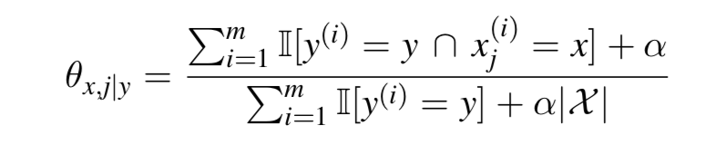

### Review

* We have learnt 4 classifiers in depth: KNN, Naive Bayes, LDA and Logistic Regression
  * KNN: Results sensitive to $k$
  * Logistic Regression: $p(y|x;w)$ sensitive to the magnitude of $w$

### Capacity and Generalization

* Model capacity:

  * **Deterministic classifiers** that can represent **more complex decision boundaries** (in log form) are said to have **higher *capacity*** than classifiers that can only represent simpler boundaries 
  * **Probabilistic classifiers** that can represent **more complex sets of conditional $p(y|x)​$** are said to have higher $capacity​$ than probabilistic classifiers that can only represent simpler sets of conditionals
  * Rank of the leart classifiers: KNN > Naive Bayes, Logistic Regression $\approx$ LDA

* Reason of not always using the classifier with the highest possible capacity for every problem

  * This would minimize the error on the **training data**. However, what we really care about for prediction problems is *generalization* 

* **Generalization**:  The ability of a trained classifier to achieve an error rate on *future*, *unseen examples* (the generalization error rate) that is comparable to the training error rate

* **Capacity Control**: To achieve optimal generalization performance for a given traing set, we often need to control model capacity carefully

* **Overfitting vs underfitting**

  * **Overfitting**: The generalization error for a classifier is much worse than the training error. This usually results from choosing a classifier with too much capacity so that it models the noise in the training data

  * **Underfitting**: Occurs when the capacity of the classifier is too low to capture the actual structure in the training data, leading to both high training error and high generalization error

  * Examples(error on the down-left corner graph):

    

    

* Bias-Variance Trade-Off (both of them are negative things)

  * Bias: A classifier is said to have low *bias* if the true decision boundary or conditionals $p(y|x)$ can be **approximated closely by the model** 
  * Variance: A classifier is said to have low *variance* if the decision boundary or conditionals $p(y|x)$ it constructs are stable with respect to small changes in the training data 
  * Bias-Variance Dilemma: To achieve **low generalization error**, we need classifiers that are low-bias and low-variance, but this isn’t always possible 
  * Bias-Variance and Capacity: On **complex data**, models with **low capacity have low variance**, but **high bias**; while models with **high capacity** have **low bias**, but **high variance** 

### Hyperparameters

* Why need to control hyperparameters

  * In order to control the capacity of a classifier, it needs to have capacity control parameters
  * Because capacity control parameters can not be chosen based on training error, they are often called hyperparameters
  * For KNN: $k$, for logistic regression: $\alpha\ and\ \lambda​$  

* Capacity, Smoothness and Regularization

  

  * **Capacity and Smoothness**: In the case of probabilistic classifiers like naive Bayes, LDA, and logistic regression, we can think of capacity in terms of the *smoothness* of $p(y|x)​$

  * **Regularization**: We can control the smoothness of $p(y|x)$ using a technique called *regularization* that penalizes parameters that result in overly complex $p(y|x)$ during learning

  * **Laplace Smoothing**: In the case of Naive Bayes, we introduced Laplace smoothing for a categorical distribution

    

    * As the regularization hyperparameter $α​$ increases, our estimate
      of the distribution smooths out toward being uniform

  * In the case of logistic regression, the smoothness of $p(y|x;\theta)$ is determined by the magnitude of $\theta$ 

    * Similar in linear regression, we ca control the magnitude of $\theta​$ by introducing a regularization term into the conditional log likelihood learning criteria that penalizes the $l_p​$-norm of $\theta​$ 

    

    * As the regularization hyperparameter $λ​$ increases, the learned
      $p(y|x; θ)​$ will smooth out

### Model Selection and Evaluation

* Principles:

  * We’ve identified the parameters that **control the capacity** of our models, we need a way to choose optimal values for these parameters
  * In addition, we will want an estimate of the **generalization error** that the selected parameters achieve
  * To obtain valid results, we need to use appropriate methodology
    and construct learning experiments carefully
  * **Guiding Principle**: Data used to estimate generalization error(**testing set**) can not be used for any other purpose, $i.e.$, model training, hyperparameter selection, feature selection, etc. Otherwise, the results of the evaluation will ve $biased$ 

* Methods:

  * Recipe 1: Train, Validation, and Test

    * Given a data set $D$, we randomly partition the data cases into a **training set (Tr)**, a **validation set (Val)**, and a **test set (Te)**. Typical splits are 60/20/20, 90/5/5, etc. 

    * Training

      * Models {$f (i)$ } are learned on Tr for each **one** choice of hyperparameters $θ(i)$ (Choose weigth matrix in training set)

    * Validation

      * The validation error $Err^{(i)}_v ​$of each model $f^{(i)}​$ is evaluated on Val $v​$  
      * The hyperparameters $θ^⋆​$ with the lowest validation error are selected and the classifier is re-trained using these hyperparameters on **Tr + Val**, yielding a final model $f^⋆​$ (Choose hyperparemeters in training & validation set)

    * Testing

      * Generalization performance is estimated by evaluating error/accuracy of $f^⋆​$ on the test data Te (Evaluate the final model)

    * Example: (Notice that the data cases needs to be randomly shuffled before partitioning $D​$) 

      

  * Recipe 2: Cross-Validation and Test

    * Randomly partition $D​$ into a learning set L and a test set Te, typically 50/50, 80/20, etc. 

    * We next **randomly partition** L into a set of $K​$ blocks $B_1, . . . , B_K ​$

    * For each cross-validation fold $k = 1, . . . , K​$:

      * Let $Val = B_k​$ and $Tr = L/B_k​$ (the remaining $K − 1​$ blocks) 
      * Learn $f^{(i,k)}​$ on Tr for each choice of hyperparameters $θ^{(i,k)}​$ 
      * Compute $Err^{(i,k)}​$ of $f^{(i,k)}​$ on Val $v​$ 

    * Select hyperparameters $θ^⋆​$ minimizing ${1\over K}\sum^K_{k=1}Err^{(i,k)}_v​$ and re-train model on $L​$ using these hyperparameters, yielding the final model $f^⋆​$  

    * Estimate generalization performance by evaluating error/accuracy of  $f^⋆​$ on Te 

    * Example: Three Fold Cross-Validation and Test (Notice that the data cases needs to be randomly shuffled before partitioning $D​$ into L and Te) 

      

    

    

  * Recipe 3: Random Resampling Validation and Test (Notice that the data cases needs to be randomly shuffled before partitioning $D$ into L and Te) 

    * Randomly partition the data cases into a learning set L and a test set Te, typically 50/50, 80/20, etc. 

    * For sample $k = 1, . . . , K​$:

      * Randomly partition L into Tr and Val, again 50/50, 80/20, etc. 
      * Learn $f^{(i,k)}$on Tr for each choice of hyperparameters $θ^{(i,k)}$ 
      * Compute $Err^{(i,k)}$ of $f^{(i,k)}$ on Val $v$ 

    * Select hyperparameters $θ^⋆$ minimizing ${1\over K}\sum^K_{k=1}Err^{(i,k)}_v$ and re-train model on $L$ using these hyperparameters, yielding the final model $f^⋆$  

    * Estimate generalization performance by evaluating error/accuracy of  $f^⋆$ on Te

    * Example:

      

* Trade-Offs:

  * In cases where the data has a benchmark split into a training set and a test set, we can use Recipes 1-3 by preserving the given test set and splitting the given training set into train and validation sets as needed 
  * Choosing larger $K​$ in cross-validation will reduce bias. Choosing larger $K​$ in random re-sampling validation will reduce variance and bias. However, both increase computational costs. $K​$ = 3, 5, 10 are common choices for cross-validation. , $K=m​$, also known as ***leave-one-out cross validation*** is also popular when feasible 

### Feature Selection

* Feature Selection: As a special and important case of model selection, feature
  selection selects a useful subset from all the features

* Reason of feature selection:

  * Some algorithms (e.g. normal equation) scale (computationally) poorly with increased feature dimension 
  * Irrelevant features can confuse some algorithms
  * Redundant features may adversely affect regularization
  * Reduces data set and resulting model size 

* Methods

  * Wrapper methods (keep the learning algorithm in the loop) 
    * Requires repeated runs of the learning algorithm with different sets of features 
    * Can be computationally expensive 
  * Filter feature selection methods
    * Use some ranking criteria to rank features 
    * Select the top ranking features 

* Wrapper Methods

  * Forward search
    * Start with no features 
    * Greedily include the most relevant feature
    * Stop when selected the desired number of features 
    * Steps:
      * Let $F=\{\}$
      * While not selected desired number of features
      * For each unused feature $f$
        * Estimate model’s error on feature set $ F \cup f $ 
      * Add $f$ with lowerst generalization error to $F​$ 
  * Backward search (Maybe computational expensive)
    * Start with all the features 
    * Greedily remove the least relevant feature
    * Stop when selected the desired number of features 
    * Steps:
      * Let $F=\{all\ features\}$
      * While not reduced to desired number of features
      * For each unused feature $f \in F$ 
        - Estimate model’s error on feature set $ F \setminus f $ (using cross-validation) 
      * Remove $f$ with lowerst generalization error from $F$ 
  * Inclusion/Removal criteria uses cross-validation (*i.e.*, train model using the current subset of features and estimate the generalization error)

* Filter Feature Selection Methods (outdated => deep learning nowadays)

  * Uses heuristics but are much faster than wrapper methods 

  * Correlation criterion: Rank features according to their correlation with the labels:

    

  * Mutual information criterion:

    

    * where the probabilities$ p(x_j, y), p(x_j)​$ and $p(y)​$ can be estimated
      according to their empirical distributions on the training set

* More on Mutual Information

  * Mutual information is a fundamental concept in *information theory*, measuring the mutual dependence between two variables 
  * It quantifies the “amount of information” obtained about one random variable through observing the other random variable 
  * As a function of $p(x, y) = p(x)p(y|x)$, $I(x; y)$ is concave in $p(x)$ for fixed $p(y|x)$, and is convex in $p(y|x)$ for fixed $p(x)$ 
  * Maximizing $I(x;y)$ w.r.t. $p(x)$ leads to *noisy-channel coding theorem*, establishing the maximum communication rate through a noisy channel 
  * Minimizing $I(x;y)$ w.r.t. $p(y|x)​$ leads to *rate-distortion theorem*, laying the theoretical foundations for lossy data compression 

--------

## Lecture07 Support Vector Machine

Target: Increase the capacity of linear classifiers so they can produce non-linear classification boundaries

---------

### Support Vector Machine (SVM)

* Decision Boundary

  * A binary SVM is a discriminative classifier that takes labels in the set $\{−1, 1\}$ 

  * The decision function has the form:
    $$
    f_{SVM}(x)=sign(\textbf w^T\textbf x+b) \\
    \textbf w^T\textbf x+b =0\ (on\ the\ decision\ boundary)
    $$

  * It’s easy to show that the decision boundary for logistic regression can ve written in exactly the same way

  * Question: If logistic refgression and SVMs have the same form for their decision boundaries, how do they differ

    * Logistic regression minimize the log probability of miss-classification
    * Logistic regression maximize the probability on the correct label (i.e. if the probability is more than 0.5, it can be correctly classified. But it tends to increase the probability during training)

* Maximum Margin Principle (**notice the axis**)

  

  * Define the *margin* of a linear classifier as the width that the **boundary could be increased before hitting a data point**
  * The simplest kind of SVM is a linear classifier with the maximum margin
  * Reason of MAX margin:
    * If we’ve made a small error in the location of the decision boundary, this gives us least chance of causing a misclassification 
    * There’s solid theory (using VC dimension) that provides indirect support for this proposition 

* Compute the Margin

  * The distance between a point to a line:
    $$
    d^{(i)}={{|\textbf w^T\textbf x+b|}\over{||\textbf w||_2}}={{y^{(i)}(\textbf w^T\textbf x+b)}\over{||\textbf w||_2}}
    $$

  * Proof:

    

    * The $y^{(i)} $ can be added because the value can ve only found in the set $\{-1,1\}$
    * The margin of ${\textbf w^Tx}+b=0$ with respect to a training set $D=\{({\textbf x}^{(i)},y^{(i)}), i=1,…,m \}$, where $||\textbf w||_2=\sqrt{\sum_{j=1}^nw_j^2}$ 

    $$
    d(margin) = min\ d^{(i)}=min_{({\textbf x},y)\in D}{{y^{(i)}(\textbf w^T\textbf x+b)}\over{||\textbf w||_2}}
    $$

* Maximize the Margin

  * The maximum margin solution is found by solving
    $$
    max_{\textbf w,b}({1\over{||\textbf w||_2}}min_{({\textbf x},y)\in D}\ {{y^{(i)}(\textbf w^T\textbf x+b)}})
    $$

  * Note that if we make the rescaling $\textbf w \rightarrow \gamma \textbf w ​$ and $b \rightarrow \gamma b​$, then the objective is unchanged

    * We can use this freedom to set:  $min_{(\textbf x, y) \in D}\ y(\textbf w^T\textbf x+b)=1$
      $$
      Ax+By+C=0 <=> 2Ax+2By+2C=0
      $$

    * Or equivalently: $y^{(i)}(\textbf w^T \textbf x^{(i)} + b) \geq 1, \forall i=1,…,m$ 

* Primal Form, **Hard-Margin** of SVM
  $$
  max_{\textbf w,b}({1 \over{||\textbf w||_2}})<=>min_{\textbf w,b}\ {1\over 2}||\textbf w||^2_2 (for\ convenience)\\
  subject\ to\ y^{(i)}(\textbf w^T \textbf x^{(i)} + b) \geq 1, \forall i=1,…,m
  $$

  * Quadratic programming problem with a quadratic objective function and linear inequality contstraint

  * Well studied problem in operations research

  * Another ponit of view: (min and max in the last line should be reversed)

    

* Primal From, Soft-Margin

  * Hard margin is not enough:

    * When there is a noise point to narrow down the margin

      

    * when the data is not linear-discriminatable: **notice that in this time, margin is nearly zero**

      

  * We need to add some level of tolerances to the model:

    

    * In other word, for normal case, $y^{(i)}(\textbf w^T\textbf x^{(i)}+b) \geq1​$ , the penalty of misclassification is zero, while on the other hand, there is a penalty with the value $1-y^{(i)}(\textbf w^T\textbf x^{(i)}+b)​$  
    * The level of tolerance can be found on the second equation:
      * Originally, $y^{(i)}(\textbf w^T\textbf x^{(i)}+b) \geq1$ means that, all pairs of the points should obey this rule, therefore, **the “distance” between two support vector should be at least 2** 
      * Now, $y^{(i)}(\textbf w^T\textbf x^{(i)}+b) \geq1-\xi_i, \xi_i>0$ means that, for any one of the points, there is a **tailored** $\xi_i$ to make sure that the point always lies in the safe constraint. Once $y^{(i)}(\textbf w^T\textbf x^{(i)}+b) <1$ , the difference between $1\ and\ y^{(i)}(\textbf w^T\textbf x^{(i)}+b)$ will be counted as penalty. 
      * This approach makes sure that all points are not forced to have a closest support vector on one or two sides of the decision boundary, but the mistake caused by it will be countered as part of the loss function

* Hinge Loss

  * In the case of primal-form SVM with soft-margin, it is equivalent to minimizing the function:
    $$
    C\sum^m_{i=1}max(0,1-y^{(i)}.g(\textbf x^{(i)}))+{1\over 2}||\textbf w||^2_2
    $$

    * where $g(x)=\textbf w^T\textbf x+b$ and $C$ is the hyperparameter that controls the amount of regularization

  * The function $l_h(y,g(\textbf x))=max(0,1-y.g(\textbf x))$ is called the *hinge loss*

* Logistic Loss

  * In the case of logistic regression  with $l_2$ regularization, we select the model parameters by minimizing the function
    $$
    C\sum^m_{i=1}-log\ p(y^{(i)}|\textbf x^{(i)})+{1\over 2}||\textbf w||^2_2
    $$

  * Under the assumption that the labels take the values $\{-1,1\}$:  

