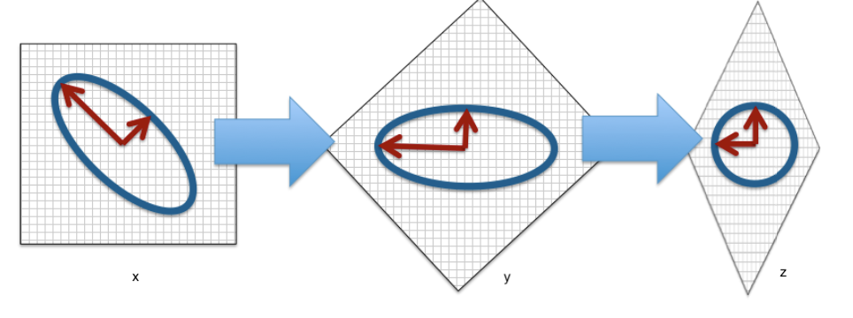
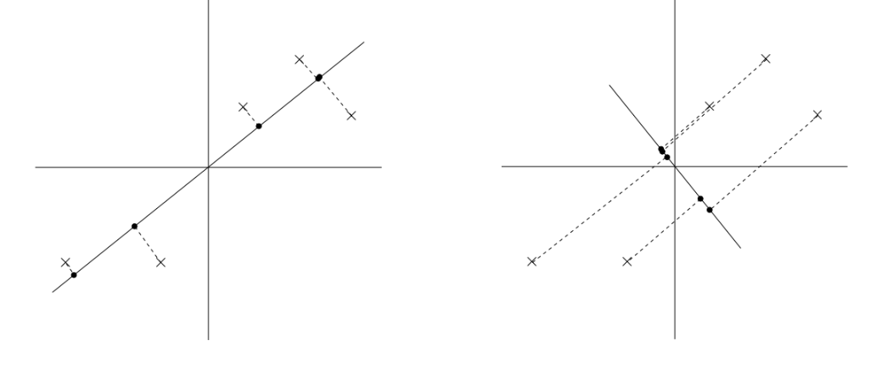
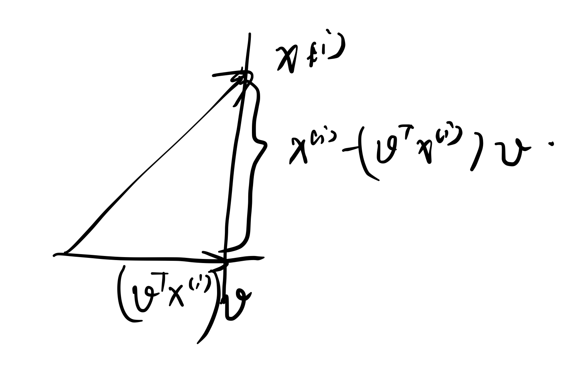
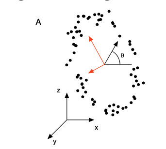
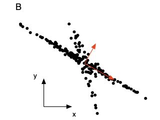

## Lecture 09 Linear Dimensionality Reduction

### Dimensionality Reduction

* Definition of dimensionality reduction task:

  * Given a collection of feature vectors $\{\textbf x^{(i)} \in \R^n \}$, map the feature vectors into a lower dimensional space $\{\textbf z^{(i)} \in \R^l\}$, where $l<n​$, while preserving certain “properties” of the data

    

* Example

  * Representing Time Series

    

  * Representing Natural Image Patches

    

* Application

  * Can be used as a **pre-processing step** to enable more accurate classification and regression on manifold data
  * Very low dimensional embeddings (i.e., $l=2,3$) can be used to **visualize complex manifold-structured data** as in the previous example
  * Can be used to **“de-noise”** data by **projecting to lower-dimensional space** and then **projecting back to the feature space** 

* Dimensionality Reduction vs. Feature Selection

  * The goal of feature selection is to **remove features that are not informative** with respect to the class label. This obviously reduces the dimensionality of the feature space 
  * Dimensionality reduction can be used to find a **meaningful lower dimensional feature space** for manifold-structured data even when there is information in each of the feature dimensions so that none can be discarded (Linear independent)
  * Another important property of dimensionality reduction is that it is **unsupervised**. It will attempt to **preserve(保留) structure in the data that could be useful for a range of supervised problems** 
  * Unlike feature selection, which is a supervised task, dimensionality reduction can sometimes **discard structure useful to a particular supervised task** thereby increasing error 

* Dimensionality Reduction vs. Data Compression

  * While dimensionality reduction can be seen as a simplistic form of data compression, it is not equivalent to it, as the goal of data compression is to reduce the ***entropy*** of the representation **not only** the dimensionality
  * For example, in lossless data compression, *arithmetic coding* encodes the entire data into a single number, an arbitrary-precision fraction $q$ where $0.0 ≤ q < 1.0$. In some science fiction books, this is paraphrased as a pinpoint representing all information of the whole universe 

### Linear Dimensionality Reduction

* Linear Dimensionality Reduction: 

  * The simplest dimensionality reduction methods assumes that the observed high dimensional data vectors $\textbf x^{(i)} \in \R^n$ lie on an $l$-dimensional linear subspace with $\R^n$ (Project the data vectors to a lower dimensional space)

    

* Assumption: Firstly, assume all the data points are already on a lower dimensional space

  * Mathematically, the linear subspace assumption can be written as follows:
    $$
    \textbf x^{(i)} = \sum_{k=1}^l z^{(i)}_k \textbf b_k
    $$

  * Where $\textbf b_k = [b_{k_1},b_{k_2},...,b_{k_n}]^T$ for $b_{k_i}\ where\ i=1,...,l$ are a set of basis vectors describing an $l$-dimensional linear sub-space of $\R^n$ and $z^{(i)}_k$'s are real-valued weights on those basis vectors (reduced data vectors)

* Connection to linear regression

  * This expression is exactly linear regression where $x^{(i)}_j$ is the target, $z^{(i)}_k$‘’s are the weights, and $b_{kj}$ for each $k$ are the features
    $$
    x^{(i)}_j=\sum^l_{k=1}z^{(i)}_kb_{kj}
    $$

  * This observation is also true if we swap the roles of the weights and the features

  * However, unlike linear regression, we only know what corresponds to the targets. We must learn both the features and the weights

* Matrix Form

  * If we let $\textbf X$ be the data matrix $X_{ij}=x^{(i)}_j$, $\textbf Z$ be a matrix where $Z_{ik}=z^{(i)}_k$, and $\textbf B$ be a matrix where $B_{kj}=b_{kj}$, we can express $\textbf X$ as follows:
    $$
    \textbf X = \textbf Z \times \textbf B
    $$

  * $\textbf Z \in \R^{m\times l}$ is often referred to as the **factor loading matrix** while $\textbf B \in \R^{l\times n}$ are refered to as the **latent factors** 

  * Most real world data will be subject to noise. If we assume that $\epsilon \in \R^{m \times n}$ is a matrix of noise values from some probability distribution, we have: 
    $$
    \textbf X = \textbf Z \times \textbf B +  \epsilon
    $$

* Learning

  * The learning problem for linear dimensionality reduction is to estimate values for both $Z$ and $B$ given only the noisy observations $X$ 

  * One possible learning criteria is to minimize the sum of squared errors when reconstructing $\textbf X$ from $\textbf Z$ and $\textbf B$. This leads to:
    $$
    argmin_{\textbf Z, \textbf B}||\textbf X-\textbf Z\textbf B||^2_F
    $$

  * where $||\textbf A||_F​$ is the Frobenius norm of matrix $\textbf A​$ ((the square root of the sum of the squares of all matrix entries => Least Square)

* Some properties of **trace** in a matrix and the Frobenius norm:

  

  

  

  

  

  

* Learning Algorithm

  * Not surprisingly, we can obtain a solution to this learning problem by leveraging the OLS solution to linear regression. The algorithm is often referred to as Alternating Least Squares (ALS)

  * Starting from a random initialization, ALS iterates between **assuming $Z$ are known features and optimizing $B$ as the unknown weights**, and **assuming that $B$ are the known features and optimizing $Z$ as the unknown weights** (is it coordinate descent ?)

    

* **Lack of Uniqueness** of Optimal Parameters

  - Suppose we run the ALS algorithm to convergence and obtain estimates for $\textbf Z^*$ and $\textbf B^*$ s.t.:
    $$
    l^* = ||\textbf X-\textbf Z^*\textbf B^*||^2_F
    $$

  - Note that if we let $\textbf R \in \R^{l\times l}$ be an arbitrary $l \times l$ invertible matrix, then we obtain exactly the same value $l*$ of the objective function for the alternate parameters $Z^{'}=Z^*R$ and $B^{'}=R^{-1}B^*$ 
    $$
    l^* = ||\textbf X - \textbf Z^*(\textbf I)\textbf B^*||^2_F \\
    = ||\textbf X - \textbf Z^*(\textbf R \textbf R^{-1})\textbf B^*||^2_F \\
    = ||\textbf X - \textbf Z^{'} \textbf B^{'}||^2_F \\
    $$

### Singular Value Decomposition

* SVD: ([resource](<http://gregorygundersen.com/blog/2018/12/20/svd-proof/#1-gram-matrices-as-positive-semi-definite>))

  * Let $\textbf X$ be an $m \times n$ matrix, with $m \geq n$. It can be factorized
    $$
    \textbf X = \textbf U \binom{\textbf Σ}{0} \textbf V^T \\
    $$

  * where $\textbf U \in \R^{m \times m}$ and $\textbf V \in \R^{n \times n}$ are orthogonal, i.e., 
    $$
    \textbf U^T\textbf U = \textbf U\textbf U^T = \textbf I_m \\
    \textbf V^T\textbf V = \textbf V\textbf V^T = \textbf I_n \\
    $$

  *  and $\textbf Σ \in \R^{n \times n}$ is diagonal (This matrix rescale the vectors in $V$)
  $$
    \textbf Σ = diag(\sigma_1, \sigma_2, ... , \sigma_n), \sigma_1 \geq \sigma_2 \geq...\geq \sigma_n \geq 0
  $$

  * The quantities $\sigma_i$‘s are called *singular(eigen) values* of $\textbf X$ and the columns of $\textbf U$ and $\textbf V$ are called the left and right  *singular(eigen) vectors* of $\textbf X$, respectively 

    

    

* Properties of each matrix

  * Matrix $\textbf U$ 

    * Columns of $\textbf U​$ consist of eigenvectors of $\textbf X\textbf X^T​$

      ​	
      $$
      \textbf X\textbf X^T = (\textbf U \textbf Σ \textbf V^T)(\textbf U \textbf Σ \textbf V^T)^T \\
      = (\textbf U \textbf Σ \textbf V^T)(\textbf V \textbf Σ^T\textbf U^T) \\
      = \textbf U \textbf Σ \textbf Σ^T \textbf U^T = \textbf U (\textbf Σ)^2 \textbf U^T 
      $$

    * Orthogonal and has unit norm, $i.e.$, $\textbf U\textbf U^T = \textbf U^T\textbf U=\textbf I​$

  * Matrix $\textbf Σ​$

    * Diagonal
    * Square roots of the eigenvalues of both $\textbf X^T \textbf X$ and $\textbf X \textbf X^T$
    * Shows importance of each eigenvector

  * Matrix $\textbf V$

    * Columns of $\textbf V$ consist of eigenvectors of $\textbf X^T\textbf X$ 
      $$
      \textbf X^T\textbf X = (\textbf U \textbf Σ \textbf V^T)^T(\textbf U \textbf Σ \textbf V^T) \\
      = (\textbf V \textbf Σ^T\textbf U^T)(\textbf U \textbf Σ \textbf V^T) \\
      = \textbf V \textbf Σ^T \textbf Σ \textbf V^T = \textbf V (\textbf Σ)^2 \textbf V^T 
      $$

    * Orthogonal and has unit form. $i.e.$, $\textbf V\textbf V^T=\textbf V^T\textbf V=\textbf I$ 

* Reduced-Form Singular Value Decomposition (SVD)

  * If only $l < min\{m,n\}$ singular values are non-zeros, the SVD of $\textbf X \in \R^{m \times n}$ can be represented in *reduced form* as follows:
    $$
    \textbf X = \textbf U \textbf Σ_l \textbf V^T = \sum^l_{j=1} \sigma_j \textbf u_j\textbf v_j^T
    $$

  * where $\textbf U=[\textbf u_1,\textbf u_2,...,\textbf u_l]$ and $\textbf V=[\textbf v_1,\textbf v_2,...,\textbf v_l]$, satisfying 
    $$
    \textbf U^T \textbf U = \textbf I_l,\ \textbf V^T \textbf V = \textbf I_l
    $$

  * and $\textbf Σ_l=diag(\sigma_1, \sigma_2, ... , \sigma_l),\sigma_1 \geq \sigma_2 \geq ... \geq \sigma_l \geq 0​$ 

  * $\textbf u_j \textbf v_j^T \in \R^{m \times n}$ is the product of a column vector $\textbf u_j$ and the transpose of a column vector $\textbf v_j$. It has rank 1. That is, $\textbf X$ is a weighted summation of $l$ rank-1 matrices in $\R^{m \times n}$ 

    * $\textbf Σ_l​$ stores a combination of $l​$ rows in $\textbf V​$ (it **scales** each vectors in $\textbf V​$)

    *   When $m > n​$, it works like:

      * $\textbf U$ is a matrice in $\R^{m \times m}$, and the $l$ column vectors $\textbf u^{(j)}$ corresponds to the $\sigma_i $ are moved to the corresponding places
      * $\textbf V$ is a matrice in $\R^{n \times n}$, and the $l$ row vectors $\textbf v^{(i)}$ corresponds to the $\sigma_i ​$ are moved to the corresponding places
      * $\textbf Σ_l​$ and $\textbf V^{'}​$ are matrices in $\R^{l \times l}​$
      * $\binom{\textbf V^{'}\ 0}{0\ \ \ 0}$ and $\binom{\textbf Σ_l\ 0}{0\ \ \ 0}$ are matrices in $\R^{m \times n}$

      $$
      \textbf U\binom{\textbf (V^{'})^T\ 0}{\ \ \ 0\ \ \ \ \ \ 0} = \textbf U \binom{\textbf Σ_l\ 0}{0\ \ \ 0} \textbf V^T
      $$

      * When $l = n$ 
        $$
        \textbf U\binom{\textbf (V^{'})^T}{0} = \textbf U\binom{\textbf Σ}{0} \textbf V^T
        $$

### Eckart-Young-Mirsky Theorem

* Given an $m \times n$ matrix $\textbf X$ of rank $r \leq min \{m, n\}$ ([resource1](<https://math.stackexchange.com/questions/211337/example-of-two-matrices-a-b-where-rankab-minranka-rankb>) [resource2](<https://yutsumura.com/rank-of-the-product-of-matrices-ab-is-less-than-or-equal-to-the-rank-of-a/>))and its singular value decomposition $\textbf X = \textbf U \textbf Σ_r \textbf V^T$, with singular values $\sigma_1 \geq \sigma_2 \geq … \geq \sigma_r$, then among all $m \times n$ matrices of lower rank $l < r$, the best approximation is $\textbf Y^*=\textbf U\textbf Σ_l\textbf V^T$, **where $Σ_l$ is the ==diagonal matrix== with singular values $σ_1, σ_2, . . . , σ_l$ in the sense that**
  $$
  ||\textbf X - \textbf Y^*||^2_F = min\{||\textbf X - \textbf Y||^2_F;\textbf Y \in \R^{m \times n}, rank \textbf Y \leq l\}
  $$

* This is not a convex optimization problem since the condition function $rank$ is **neither convex nor concave**:
  $$
  X_1 = \begin{bmatrix}
  1 & 0 \\
  0 & 0
  \end{bmatrix},\ 
  X_2 = \begin{bmatrix}
  0 & 0 \\
  0 & 1
  \end{bmatrix} \\
  rank(X_1) = rank(X_2) =1 \\
  Y = \theta X_1+(1-\theta) X_2=
  \begin{bmatrix}
  \theta & 0 \\
  0 & (1-\theta)
  \end{bmatrix},where\ \theta \in [0,1] \\
  rank(Y) = 2, when\ \theta \in (0,1) \\
  2=rank(\theta X_1+(1-\theta) X_2)>\theta\ rank(X_1) + (1-\theta)\ rank(X_2)=1\\
  X_1 = \begin{bmatrix}
  1 & 0 \\
  0 & 1
  \end{bmatrix}, 
  X_2 = \begin{bmatrix}
  0 & 0 \\
  0 & -1
  \end{bmatrix} \\
  rank(X_1) = 2,\ rank(X_2) =1 \\
  Y = \theta X_1+(1-\theta) X_2=
  \begin{bmatrix}
  \theta & 0 \\
  0 & 2\theta-1
  \end{bmatrix},where\ \theta \in [0,1] \\
  rank(\textbf Y) = 1, when\ \theta = {1 \over 2} \\
  1=rank(\theta X_1+(1-\theta) X_2)<\theta\ rank(X_1) + (1-\theta)\ rank(X_2)={3 \over 2}\\
  $$

* Proof: Since the Frobenius norm is preserved under unitary transformations, we have
  $$
  ||\textbf X - \textbf Y||^2_F = ||\textbf U \textbf Σ \textbf V^T - \textbf Y||^2_F=|| \textbf Σ  - \textbf U^T\textbf Y\textbf V||^2_F \\
  (for\ orthoganal\ matrix\ \textbf U)\\
  ||\textbf U\textbf X||^2_F = tr((\textbf U\textbf X)^T(\textbf U\textbf X))=tr(\textbf X^T\textbf U^T \textbf U \textbf X) \\
  = tr(\textbf X^T \textbf X) = ||\textbf X||^2_F \\
  ||\textbf X\textbf U||^2_F = tr((\textbf X\textbf U)^T(\textbf X\textbf U))=tr(\textbf U^T \textbf X^T  \textbf X \textbf U) \\
  = tr(\textbf X^T  \textbf X \textbf U \textbf U^T) = tr(\textbf X^T \textbf X) = ||\textbf X||^2_F \\
  \text{Denoting}\ \textbf Z = \textbf U^T\textbf Y\textbf V, \text{an}\ m \times n\ \text{matrix of rank }l, \text{a direct caculation gives} \\
  ||\textbf Σ-\textbf Z||^2_F = \sum_{ij} |Σ_{ij}-Z_{ij}|^2 = \sum_{i=1}^r|\sigma_i - Z_{ij}|^2 + \sum_{i>r}|Z_{ii}|^2(=0) + \sum_{i\neq j}|Z_{ij}|^2 \\
  $$

  * If $\textbf Z$ is not diagonal, set $Z_{ij}=0(i \neq j)$ will have a better result
  * if we don’t use exactly the largest (mean value) $σ_1, σ_2, . . . , σ_l$ to match the larger $l$ $\sigma$ in $\sigma_1 \geq \sigma_2 \geq … \geq \sigma_r$ , there will also be some better result
  * Therefore, $\textbf Z^* = diag(σ_1, σ_2, . . . , σ_l)=\textbf Σ_l; \textbf Y^* = \textbf U \textbf Σ_l \textbf V^T​$   

* Trade-Offs

  * Minimum Frobenius norm linear dimensionality reduction is nice because it will find the globally optimal linear sub-space
  * The basic ALS(Alternating Least Square) algorithm scales as $O(l^3 + ml^2+nl^2+mnl)$ per pair of iterations. The full SVD algorithm scales as $O(min(mn^2, nm^2))$ . Fast approximations exist for both problems
  * A significant limitation of linear dimensionality reduction is that it can fail to achieve a useful compact(dense) representation of the data if the underlying manifold is not actually linear (non-unique)
  *  As with clustering, the rank $l​$ of the latent sub-space is a free parameter

### Principal Component Analysis

* Eigenvectors

  * Assume $\textbf A \in \R^{n \times n}, \textbf v \in \C^{n \times 1}, and\ \lambda \in \C$ 
  * If $\textbf A\textbf v = \lambda \textbf v$ the $\textbf v$ is a right eigenvector of $\textbf A$ with eigenvalue $\lambda$  
  * If $\textbf A^T\textbf v = \lambda \textbf v(\textbf v^T\textbf A = \lambda \textbf v^T)$ the $\textbf v$ is a right eigenvector of $\textbf A$ with eigenvalue $\lambda$ 
  * If $\textbf A$ is symmetric so that $\textbf A = \textbf A^T$, then the left and right eigenvectors of $\textbf A$ are the same with the same eigenvectors ($\textbf A\textbf v = \textbf A^T\textbf v=\lambda \textbf v$) 
  * ==Why there is complex eigenvalue => because for rotation matrix, only times a real number, the direction of each vector are not changed== 

* Eigendecomposition

  * Let $\textbf V \in \R^{n \times n}$ be a matrix whose column $\textbf v_i$ are $n$ linearly independent eigenvectors of $\textbf A$ with $\textbf Λ$ the corresponding diagonal matrix of eigenvalues such that $\textbf Λ_{ii} = \lambda_i$. Then: 
    $$
    \textbf A \textbf V = \sum_{j=0}^n\textbf A \textbf v^{(j)}= \sum_{j=0}^n\lambda_j \textbf v^{(j)}=\textbf V  \textbfΛ  \\
    \textbf A = \textbf V  \textbfΛ \textbf V ^{-1} \\
    \textbf V^{-1}  \textbf A \textbf V  = \textbfΛ
    $$

  * Only *diagnalizable matrices* have **eigendecomposition** and ==eigenvalues== (!!!eigenvalue is different from singular value)

  * If $\textbf A$ is symmetric, we can choose $n$ orthonormal eigenvectors so that $||\textbf v_i||_2=1$, $\textbf v_i^T \textbf v_j=0$ and $n$ real eignevalues $\lambda_n \in \R$. As a result, we have:
    $$
    \textbf A = \textbf U \textbfΛ \textbf V ^T = \textbf A^T = \textbf V \textbfΛ^T \textbf U^T =  \textbf V \textbfΛ \textbf U^T (m=n) \\
    \textbf U = \textbf V \\
    \textbf A = \textbf V \textbfΛ \textbf V^{-1} = \sum_{i=1}^n \lambda_i \textbf v_i \textbf v_i^T\\
    $$

  * eigenvalues and singularvalues are the same for symmetric matrices

  * If symmetric it is diagnalizable, if diagnalizable it may not be symmetric

* Representation of a vector in the Eigen Basis

  * Similarly, if $\textbf a$ is an arbitrary vector, then we can also represent $\textbf a$ using the basis provided by the eigenvectors $\textbf V$ of a real symmetric matrix $\textbf A(\textbf a\textbf a^T)$. We obtain:
    $$
    \textbf a = \sum^n_{i=1}\alpha_i\textbf v_i \\
    \textbf a^T\textbf v_i=\sum^n_{j\neq i}\alpha_j\textbf v_j^T\textbf v_i+\alpha_i\textbf v_i^T\textbf v_i=\alpha_i
    $$

* Geometry: If $A​$ is a **real symmetric matrix** with *positive* eigenvalues, then the quadratic equation $\textbf x^T\textbf A\textbf x​$ = 1 defines an ellipsoid in an $n​$-dimensional space, which provides a different way of thinking about these operations:
  $$
  \textbf x^T\textbf A\textbf x=1, \textbf A = \textbf V \textbfΛ \textbf V^T \\
  \textbf x^T\textbf V \textbfΛ \textbf V^T\textbf x=1, denotes\ \textbf y=\textbf V^T\textbf x \\
  \textbf y^T \textbfΛ \textbf y = 1 => \textbf y^T \textbfΛ^{1\over 2}\textbfΛ^{1\over 2} \textbf y = 1 , denotes\ \textbf z=\textbfΛ^{1\over 2} \textbf y \\
  \textbf z^T\textbf z=1
  $$
  

* Principal Component Analysis (PCA) ([resource](<https://zhuanlan.zhihu.com/p/67475508>))

  * Given a data matrix $\textbf X \in \R^{m \times n}​$, the goal of PCA is to identify the directions of maximum variance contained in the data (first one is better):

    * Project all the points to the direction s.t. the result data are well seperated
    * Ignore the dimension where the data are similar (low variance), which means that this dimension is less useful 

    

* Sample Variance in a Given Direction

  * Let $\textbf v \in \R^n$ s.t. $||\textbf v||_2=\sqrt{\textbf v^T\textbf v}=1$ (unit vector)

  * The sample estimate of the variance in the direction $\textbf v​$ is given by the expression:
    $$
    {1 \over m} \sum^m_{i=1}(\textbf v^T\textbf x^{(i)}-\textbf μ)^2, where\ \textbf μ = {1\over m}\sum^m_{i=1}\textbf v^T\textbf x^{(i)}
    $$

  * $\textbf v^T \textbf x^{(i)}$ represents the length of projection when project $\textbf x^{(i)}$ on $\textbf v$   

* Pre-centering: Under the assumption that the data are pre-centered so that ${1\over m}\sum^m_{i=1}\textbf v^T\textbf x^{(i)}={1\over m}\sum^m_{i=1}\textbf x^{(i)}=0$, (向量和为零则每个方向上分量为零) this expression simplifieds to: 
  $$
  {1\over m}\sum^m_{i=1}(\textbf v^T\textbf x^{(i)})^2 ={1 \over m}(\textbf X\textbf v)^T(\textbf X\textbf v)={1 \over m}\textbf v^T\textbf X^T\textbf X\textbf v
  $$

* The Direction of the Maximum Variance

  * Suppose we want to identify the direction $\textbf v_1$ of maximum variance given the data matrix $\textbf X​$. We can formulate this optimization problem as follows (this is not a convex optimization => weak duality):
    $$
    max_v {1 \over m} \textbf v^T \textbf X^T \textbf X \textbf v \\
    subject\ to\ ||\textbf v||_2^2=1
    $$

  * Letting $\textbf Σ = {1 \over m} \textbf X^T\textbf X $ which is a symmectric matrix, we form the Lagrangian
    $$
    L(\textbf v, \lambda) = \textbf v^T \textbf Σ \textbf v + \lambda (1-||\textbf v||_2^2)
    $$

  * It can be proved that the eigenvalue of $\sum$ is non-negative by using SVD

  * Taking the derivative of $L\ w.r.t\ v$ and setting it to zero, we have:
    $$
    {\delta L(\textbf v, \lambda) \over \delta \textbf v} = 2 \textbf Σ \textbf v - 2 \lambda \textbf v=0 \\
    \textbf Σ \textbf v = \lambda \textbf v \\
    $$

    * It means the optimal $\textbf v$ appears when $\textbf v$ is an eigenvector of $\textbf Σ$ 

  * As $\textbf v \neq 0$, $\textbf v$ must be an eigenvector of $\textbf Σ$ with eigenvalue $\lambda$. Assuming $\{\textbf v_1, …, \textbf v_n\}$ are the eigenvectors of $\textbf Σ$, corresponding to eigenvalues $\sigma_1 \geq … \geq \sigma_b \geq 0$, respectively, too choose the best $\textbf v$ while fixing $\textbf X$ we have (i.e. the largest mean value of $\lambda_i$ where $\lambda_i$ is the **singular values** of $\textbf X​$ )
    $$
    \textbf v^* = \textbf v_1, \\
    p^* = \textbf v_1^T \textbf Σ \textbf v_1 = \lambda = \sigma_1
    $$

* $l$ largest Directions of Variance

  * Suppose instead of just the direction of maximum variance, we want the $l$ largest directions of variance that are all mutually $orthogonal$

  * Finding the second-largest direction of variance corresponds to solving the problem: 
    $$
    max_{\textbf v} \textbf v^T \textbf Σ \textbf v \\
    subject\ to\ ||\textbf v||^2_2=1 \\
    \textbf v^T \textbf v_1 = 0 \\
    $$

  * We form the Lagrangian
    $$
    L(\textbf v, \lambda, v) = \textbf v^T \textbf Σ \textbf v + \lambda(1-||\textbf v||^2_2) + v\textbf v^T \textbf v_1 \\
    {\delta L \over \delta \textbf v} = 2\textbf Σ \textbf v - 2 \lambda\textbf v + v \textbf v_1 = 0 \\
    2\textbf v_1^T \textbf Σ \textbf v - 2 \lambda \textbf v_1^T \textbf v + v \textbf v_1^T \textbf v_1 = 0 \\
    2(\textbf Σ (\textbf Σ =\textbf Σ^T) \textbf v_1)^T \textbf v - 2 \lambda \textbf v_1^T \textbf v + v \textbf v_1^T \textbf v_1 = 0 \\
    2\sigma_1\textbf v_1^T\textbf v-0=v=0
    $$

  * In general, the top $l$ directions of variance $\textbf v_1, … ,\textbf v_l$ are given by the $l$ eigenvectors corresponding to the $l$ largest eigenvalues of ${1 \over m} \textbf X^T \textbf X$

* Minimize the Projection error:

  * PCA can also be derived by picking the principal vectors that minimize the approximation error arising from projecting the data onto the $l$-dimensional subspace spanned by them
    $$
    min_{\textbf v} {1 \over m} \sum^{m}_{i=1} ||\textbf x^{(i)} - (\textbf v^T\textbf x^{(i)})\textbf v||^2_2
    $$
    

  * Proof: Without loss of generality, we assume $l = 1$. The approximation error, i.e., the mean squared error, between $\{x(i)\}$ and their projections are
    $$
    {1 \over m} \sum^{m}_{i=1} ||\textbf x^{(i)} - (\textbf v^T\textbf x^{(i)})\textbf v||^2_2 \\
    = {1 \over m} \sum^{m}_{i=1} 
    (||\textbf x^{(i)}||^2_2+(\textbf v^T\textbf x^{(i)})^2||\textbf v||^2_2-2(\textbf v^T\textbf x^{(i)})\textbf v^T\textbf x^{(i)})\\
    ={1 \over m} \sum^{m}_{i=1} 
    (||\textbf x^{(i)}||^2_2-(\textbf v^T\textbf x^{(i)})^2)
    $$

  * Since $\textbf x_i$ is fixed for each $i$, minimizing the approximation error is equivalent to minimizing the variance of the projections:
    $$
    min_{\textbf v}{1 \over m} \sum^{m}_{i=1} 
    (-(\textbf v^T\textbf x^{(i)})^2)\\
    =max_{\textbf v}{1 \over m} \sum^{m}_{i=1} 
    ((\textbf v^T\textbf x^{(i)})^2) \\
    =max_{\textbf v}\textbf v^T \textbf Σ \textbf v
    $$
    

* Dimensionality Reductino with PCA

  * Data preprocessing: Compute $\textbf μ={1 \over m} \sum_i\textbf x^{(i)}$ and replace each $\textbf x^{(i)}$ with $\textbf x^{(i)}-\textbf μ$; compute $\sigma_j^2 = {1 \over m} \sum_i(x^{(i)}_j)^2$ and replace each $\textbf x^{(i)}_j$ with $\textbf x^{(i)}_j \over \sigma_j$ (normalize the data) 
  * Given pre-processed data matrix $\textbf X \in \R^{m\times n}​$, compute the sample covariance matrix $Σ = {1 \over m} X^T X​$ 
  * Compute the $l$ leading eigenvectors $\textbf v_1, \textbf v_2, … ,\textbf v_l$ of $\textbf Σ$ where $\textbf v_i \in \R^n$
  * Stack the eigenvectors together into an $n \times l$ matrix $\textbf V$ where each column $i$ of $\textbf V$ corresponds to $\textbf v_i$  
  * Project $\textbf X​$ into the subspace spanned by the set of eigenvectors $\textbf Z = \textbf X \textbf V​$
  * To reconstruct $\textbf X$ given $\textbf Z$ and $\textbf V$, we use $\hat {\textbf X} = \textbf Z\textbf V^T​$ 

### Connection between PCA and SVD

* We have saw that the minimum Frobenius norm linear dimensionality reduction problem could be solved using the rank-$l$ SVD of X:
  $$
  argmin_{\textbf U,\textbf S,\textbf V}|| \textbf X - \textbf U \textbf S \textbf V^T ||^2_F
  $$

  * Where $\textbf U \in \R^{m \times l}, \textbf S \in \R^{l \times l}, \textbf V \in \R^{n \times l}​$. The matrix product $\textbf Z = \textbf U\textbf S​$ gives the optimal rank-$l​$ representation of $\textbf X​$ with respect to Frobenius norm minimization
  * Let ==$l=n$== then $\textbf X=\textbf U\textbf S \textbf V^T$ and $\textbf X^T\textbf X=\textbf V\textbf S \textbf U^T\textbf U\textbf S \textbf V^T = \textbf V\textbf S^2 \textbf V^T$
  * This means
    * right singular vectors of $\textbf X​$ is the same as all the singular vectors of $\textbf X^T\textbf X​$
    * eigenvalues of $\textbf X^T\textbf X$ are the diagnal elements of $\textbf S$ 
    * The $l$ largest singular values for SVD and $l$ largest eigenvalues for PCA correspond to the same $l$ basis vectors

* According to PCA, the projection operation is $\textbf Z = \textbf X \textbf V​$, therefore
  $$
  \textbf Z = \textbf X \textbf V = (\textbf U \textbf S \textbf V^T)  \textbf V = \textbf U \textbf S
  $$

  * Finally, note that if the decompositions are based only on the $l$ leading principal vectors, which are identical under both PCA and SVD, the projection $\textbf Z = \textbf X\textbf V$ and $\textbf Z = \textbf U \textbf S$ will still be identical
  * These manipulations show that PCA on $X^TX$ and SVD on $X$ identify exactly the same sub space and result in exactly the same projection of the data into that sub-space
  * As a result, generic linear dimensionality reduction simultaneously minimizes the Frobenius norm of the reconstruction error of $\textbf X$ and maximizes the retained variance in the learned sub-space
  * Both SVD and PCA provide the same description of generic linear dimensionality reduction: an orthogonal basis for exactly the same optimal linear subspace

* Issues:

  * The computational complexity of PCA is $O(n^2m + n^3)$ if the full eigendecomposition is obtained and then truncated, compared to $O(min(nm^2, mn^2))$ for SVD
  * The basic SVD and PCA algorithm are not suitable for large-scale data. Instead, randomized algorithms are often used
  * The value of $l$ can sometimes be chosen based on looking for eigenvalue gaps in the eigenspectrum of the covariance matrix

* When does PCA fail

  * The primary motivation behind PCA is to decorrelate the dataset, i.e., remove second-order dependencies. If higher-order dependencies exist between the features in the data, PCA may be insufficient at revealing all structure in the data (for example, the data distributed on a circle)

    

  * PCA requires that each component must be perpendicular to the previous ones, but clearly this requirement is overly stringent and the data might be arranged along non-orthogonal axies

    

### Questions about Lagrange Multiplier

* When using weak duality, why it is ok to optimize L and f at the same time
* Why g is concave for lambda and v
* Why 

## Lecture 10: Kernel Principal Component Analysis

* Limitation of PCA is it can only find the optimal linear subspace that retain maximum variances

### Basis Expansion

* One way to move beyond linear dimensionality reduction is to first apply a non-linear basis expansion to the data vectors, and then apply linear dimensionality reduction
* Any basis expansion can be applied (e.g. polynomials), just as in the case of classification and regression
* 

