## Lecture 09 Linear Dimensionality Reduction

### Dimensionality Reduction

* Definition of dimensionality reduction task:

  * Given a collection of feature vectors $\{\textbf x^{(i)} \in \R^n \}$, map the feature vectors into a lower dimensional space $\{\textbf z^{(i)} \in \R^l\}$, where $l<n​$, while preserving certain “properties” of the data

    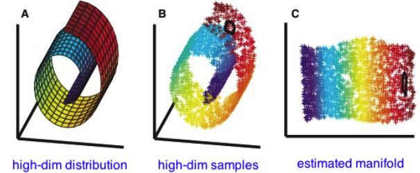

* Example

  * Representing Time Series

    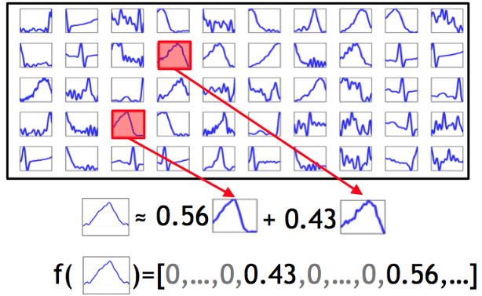

  * Representing Natural Image Patches

    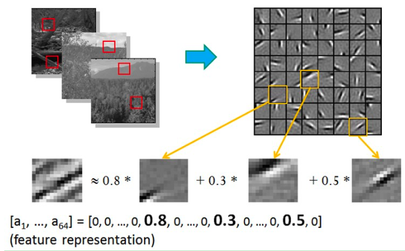

* Application

  * Can be used as a **pre-processing step** to enable more accurate classification and regression on manifold data
  * Very low dimensional embeddings (i.e., $l=2,3$) can be used to **visualize complex manifold-structured data** as in the previous example
  * Can be used to **“de-noise”** data by **projecting to lower-dimensional space** and then **projecting back to the feature space** 

* Dimensionality Reduction vs. Feature Selection

  * The goal of feature selection is to **remove features that are not informative** with respect to the class label. This obviously reduces the dimensionality of the feature space 
  * Dimensionality reduction can be used to find a **meaningful lower dimensional feature space** for manifold-structured data even when there is information in each of the feature dimensions so that none can be discarded (Linear independent)
  * Another important property of dimensionality reduction is that it is **unsupervised**. It will attempt to **preserve(保留) structure in the data that could be useful for a range of supervised problems** 
  * Unlike feature selection, which is a supervised task, dimensionality reduction can sometimes **discard structure useful to a particular supervised task** thereby increasing error 

* Dimensionality Reduction vs. Data Compression

  * While dimensionality reduction can be seen as a simplistic form of data compression, it is not equivalent to it, as the goal of data compression is to reduce the ***entropy*** of the representation **not only** the dimensionality
  * For example, in lossless data compression, *arithmetic coding* encodes the entire data into a single number, an arbitrary-precision fraction $q$ where $0.0 ≤ q < 1.0$. In some science fiction books, this is paraphrased as a pinpoint representing all information of the whole universe 

### Linear Dimensionality Reduction

* Linear Dimensionality Reduction: 

  * The simplest dimensionality reduction methods assumes that the observed high dimensional data vectors $\textbf x^{(i)} \in \R^n$ lie on an $l$-dimensional linear subspace with $\R^n$ (Project the data vectors to a lower dimensional space)

    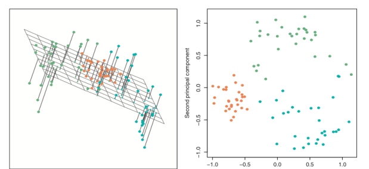

* Assumption: Firstly, assume all the data points are already on a lower dimensional space

  * Mathematically, the linear subspace assumption can be written as follows:
    $$
    \textbf x^{(i)} = \sum_{k=1}^l z^{(i)}_k \textbf b_k
    $$

  * Where $\textbf b_k = [b_{k_1},b_{k_2},...,b_{k_n}]^T$ for $b_{k_i}\ where\ i=1,...,l$ are a set of basis vectors describing an $l$-dimensional linear sub-space of $\R^n$ and $z^{(i)}_k$'s are real-valued weights on those basis vectors (reduced data vectors)

* Connection to linear regression

  * This expression is exactly linear regression where $x^{(i)}_j$ is the target, $z^{(i)}_k$‘’s are the weights, and $b_{kj}$ for each $k$ are the features
    $$
    x^{(i)}_j=\sum^l_{k=1}z^{(i)}_kb_{kj}
    $$

  * This observation is also true if we swap the roles of the weights and the features

  * However, unlike linear regression, we only know what corresponds to the targets. We must learn both the features and the weights

* Matrix Form

  * If we let $\textbf X$ be the data matrix $X_{ij}=x^{(i)}_j$, $\textbf Z$ be a matrix where $Z_{ik}=z^{(i)}_k$, and $\textbf B$ be a matrix where $B_{kj}=b_{kj}$, we can express $\textbf X$ as follows:
    $$
    \textbf X = \textbf Z \times \textbf B
    $$

  * $\textbf Z \in \R^{m\times l}$ is often referred to as the **factor loading matrix** while $\textbf B \in \R^{l\times n}$ are refered to as the **latent factors** 

  * Most real world data will be subject to noise. If we assume that $\epsilon \in \R^{m \times n}$ is a matrix of noise values from some probability distribution, we have: 
    $$
    \textbf X = \textbf Z \times \textbf B +  \epsilon
    $$

* Learning

  * The learning problem for linear dimensionality reduction is to estimate values for both $Z$ and $B$ given only the noisy observations $X$ 

  * One possible learning criteria is to minimize the sum of squared errors when reconstructing $\textbf X$ from $\textbf Z$ and $\textbf B$. This leads to:
    $$
    argmin_{\textbf Z, \textbf B}||\textbf X-\textbf Z\textbf B||^2_F
    $$

  * where $||\textbf A||_F$ is the Frobenius norm of matrix $\textbf A$ ((the square root of the sum of the squares of all matrix entries => Least Square)

* Some properties of **trace** in a matrix and the Frobenius norm:

  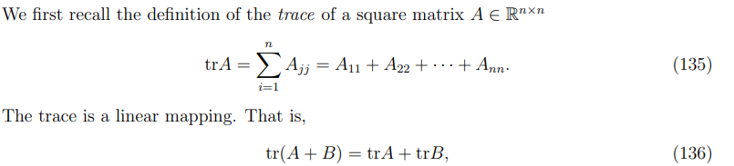

  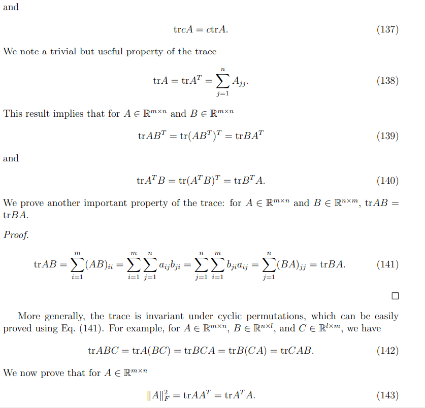

  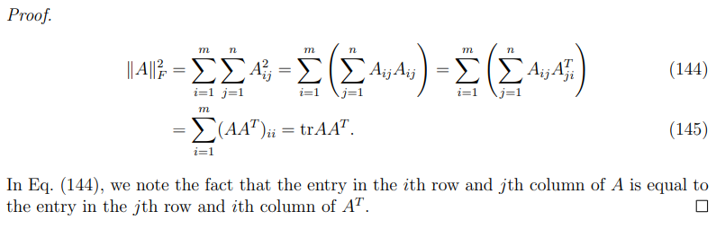

  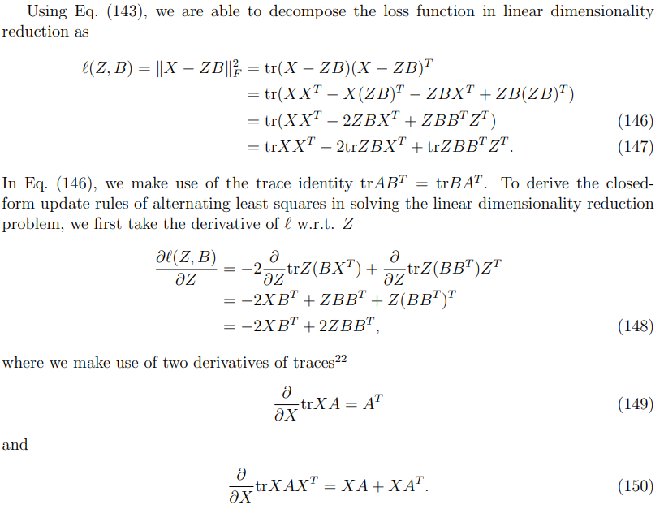

  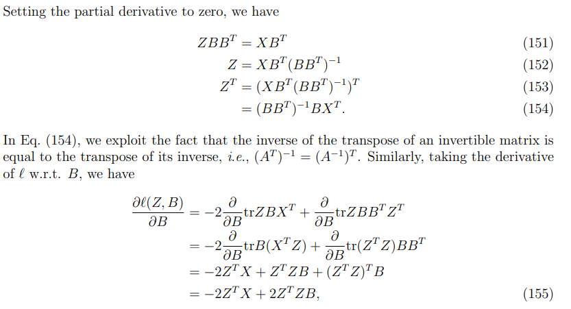

  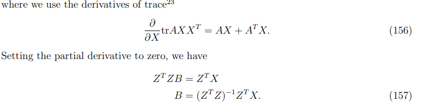

* Learning Algorithm

  * Not surprisingly, we can obtain a solution to this learning problem by leveraging the OLS solution to linear regression. The algorithm is often referred to as Alternating Least Squares (ALS)

  * Starting from a random initialization, ALS iterates between **assuming $Z$ are known features and optimizing $B$ as the unknown weights**, and **assuming that $B$ are the known features and optimizing $Z$ as the unknown weights** (is it coordinate descent ?)

    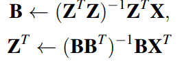

*  **Lack of Uniqueness** of Optimal Parameters

  - Suppose we run the ALS algorithm to convergence and obtain estimates for $\textbf Z^*$ and $\textbf B^*$ s.t.:
    $$
    l^* = ||\textbf X-\textbf Z^*\textbf B^*||^2_F
    $$

  - Note that if we let $\textbf R \in \R^{l\times l}$ be an arbitrary $l \times l$ invertible matrix, then we obtain exactly the same value $l*$ of the objective function for the alternate parameters $Z^{'}=Z^*R$ and $B^{'}=R^{-1}B^*$ 
    $$
    
    l^* = ||\textbf X - \textbf Z^*(\textbf I)\textbf B^*||^2_F \\
    = ||\textbf X - \textbf Z^*(\textbf R \textbf R^{-1})\textbf B^*||^2_F \\
    = ||\textbf X - \textbf Z^{'} \textbf B^{'}||^2_F \\
    $$

### Singular Value Decomposition

* SVD:

  * Let $\textbf X$ be an $m \times n$ matrix, with $m \geq n$. It can be factorized
    $$
    \textbf X = \textbf U \binom{\textbf Σ}{0} \textbf V^T \\
    $$

  * where $\textbf U \in \R^{m \times m}$ and $\textbf V \in \R^{n \times n}$ are orthogonal, i.e., 
    $$
    \textbf U^T\textbf U = \textbf U\textbf U^T = \textbf I_m \\
    \textbf V^T\textbf V = \textbf V\textbf V^T = \textbf I_n \\
    $$

  *  and $\textbf Σ \in \R^{n \times n}$ is diagonal (This matrix rescale the vectors in $V$)
  $$
    \textbf Σ = diag(\sigma_1, \sigma_2, ... , \sigma_n), \sigma_1 \geq \sigma_2 \geq...\geq \sigma_n \geq 0
  $$

  * The quantities $\sigma_i$‘s are called *singular(eigen) values* of $\textbf X$ and the columns of $\textbf U$ and $\textbf V$ are called the left and right  *singular(eigen) vectors* of $\textbf X$, respectively 

    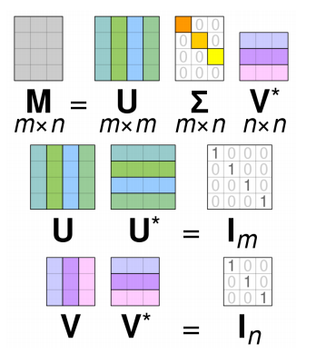

    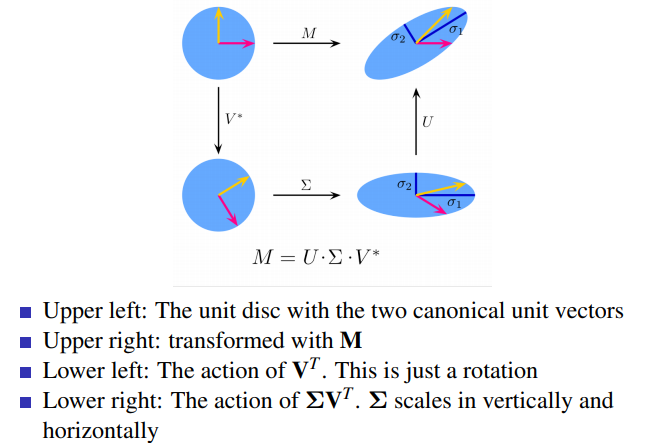

* Properties of each matrix

  * Matrix $\textbf U$ 

    * Columns of $\textbf U​$ consist of eigenvectors of $\textbf X\textbf X^T​$

      ​	
      $$
      \textbf X\textbf X^T = (\textbf U \textbf Σ \textbf V^T)(\textbf U \textbf Σ \textbf V^T)^T \\
      = (\textbf U \textbf Σ \textbf V^T)(\textbf V \textbf Σ^T\textbf U^T) \\
      = \textbf U \textbf Σ \textbf Σ^T \textbf U^T = \textbf U (\textbf Σ)^2 \textbf U^T 
      $$

    * Orthogonal and has unit norm, $i.e.$, $\textbf U\textbf U^T = \textbf U^T\textbf U=\textbf I​$

  * Matrix $\textbf Σ​$

    * Diagonal
    * Square roots of the eigenvalues of both $\textbf X^T \textbf X$ and $\textbf X \textbf X^T$
    * Shows importance of each eigenvector

  * Matrix $\textbf V$

    * Columns of $\textbf V$ consist of eigenvectors of $\textbf X^T\textbf X$ 
      $$
      \textbf X^T\textbf X = (\textbf U \textbf Σ \textbf V^T)^T(\textbf U \textbf Σ \textbf V^T) \\
      = (\textbf V \textbf Σ^T\textbf U^T)(\textbf U \textbf Σ \textbf V^T) \\
      = \textbf V \textbf Σ^T \textbf Σ \textbf V^T = \textbf V (\textbf Σ)^2 \textbf V^T 
      $$

    * Orthogonal and has unit form. $i.e.$, $\textbf V\textbf V^T=\textbf V^T\textbf V=\textbf I$ 

* Reduced-Form Singular Value Decomposition (SVD)

  * If only $l < min\{m,n\}$ singular values are non-zeros, the SVD of $\textbf X \in \R^{m \times n}$ can be represented in *reduced form* as follows:
    $$
    \textbf X = \textbf U \textbf Σ_l \textbf V^T = \sum^l_{j=1} \sigma_j \textbf u_j\textbf v_j^T
    $$

  * where $\textbf U=[\textbf u_1,\textbf u_2,...,\textbf u_l]$ and $\textbf V=[\textbf v_1,\textbf v_2,...,\textbf v_l]$, satisfying 
    $$
    \textbf U^T \textbf U = \textbf I_l,\ \textbf V^T \textbf V = \textbf I_l
    $$

  * and $\textbf Σ_l=diag(\sigma_1, \sigma_2, ... , \sigma_l),\sigma_1 \geq \sigma_2 \geq ... \geq \sigma_l \geq 0​$ 

### Principal Component Analysis

### Connection between PCA and SVD

