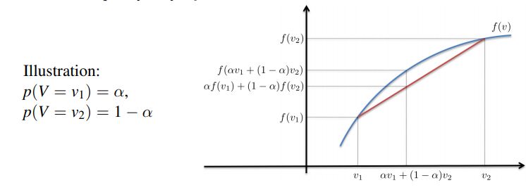
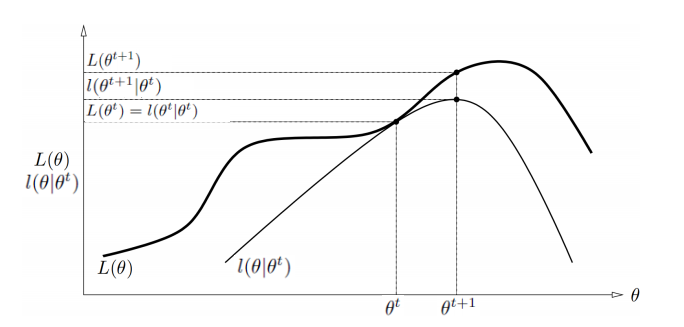
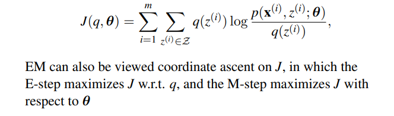

### Exhaustive Clustering

* Define a Clustering
  * Suppose we have $m$ data cases $D=\{\textbf x^{(i)}\}_{i=1,...,m}$ 
  * A clustering of the $m$ cases into $K$ clusters is a partitioning of $D$ into $K$ mutually disjoint subsets $C={C_1,...,C_k}$ such that $C_1\cup...\cup C_K=D$
  * Suppose we have a function $f(C)$ that takes a partitioning $C$ of the data set $D$ and returns a score with lower scores indicating better clustering
  * The optimal clustering according to $f$ is simply given by: $argmin_Cf(C)$
  * The complexity of exhaustive clustering depends on the total number of partitions
* Number of Clusterings
  * The total number of clusterings of a data set with $m$ elements is the Bell number $B_m$, where $B_0=B_1=1$ and $B_{m+1}=\sum^m_{k=0}{{m}\choose{k}}B_k$ 
  * Wrong: The recursive relation means that, for the first cluster we choose $m-k$ elements, and calculate how many ways of combination for $k$ elements left, and sum all the possibility of $k$‘s (It is wrong because for a partition, the order of choice doesn’t matter)
  * True proof: Let $x^{(1)}$ to be a fixed to the first cluster, we can choose $m-k$ elements in the same cluster with $x^{(1)}$ , then the order is fixed. Therefore, the equation is for $m+1$ instead of $m$
  * The complexity of exhaustive clustering scales with $B_m$ and is thus computationally totally intractable for general scoring functions
  * We will need either approximation algorithms or scoring functions with special properties

### K-Means Clustering

* The K-means algorithm is an iterative optimization algorithm for clustering that alternates between two steps

* The algorithm maintains a set of $K$ cluster centroids or prototypes $\{\textbf µ_k\}$ that represent the average (mean) feature vector of the data cases in each cluster 

* Algorithm: Suppose we let $z^{(i)}$ indicate which cluster $\textbf x^{(i)}$ belongs to and $\mu_k\in\R^n$ be the cluster centroid/prototype for cluster $k$. The two main steps of the algorithm can then be expressed as follows:

  * In the first step, the distance between each data case and each prototype is computed, and each data case is assigned to the nearest prototype 

    

  * In the second step, the prototypes are updated to the mean of the data cases assigned to them

    

* Example:

  

* The K-Means Objective

  * The $K$-means algorithm attempts to minimize the sum of the within-cluster variation over all clusters (also called the within-cluster sum of squares):

    

  * It can be shown that $K$-means is exactly coordinate descent on $l$. Specifically, the assignment step minimizes $l$ with respect to $z$ while holding $µ$ fixed, and the update step minimizes $l$ with respect to µ while holding $z$ fixed. Thus, must monotonically decrease, and the value of must converge

  * Note that $l$ has many local optimal in general, each corresponding to a different clustering of the data. Finding the global optimum is not computationally tractable => **highly sensitive to initialization**

* Initialization

  * It is common to perform multiple random re-starts of the algorithm and take the clustering with the minimal total variation
  * Common initializations include setting the initial centers to be randomly selected data cases, setting the initial partition to a random partition, and selecting centers using a “furthest first”-style heuristic (more formally known as K-means++)
  * It often helps to initially to run with $K log(K)$ clusters, then merge clusters to get down to $K$ and run the algorithm from that initialization

* Issues

  * Only works with Euclidean distance. An alternative based on Manhattan distance is called the K-medians algorithm 
  * Pre-processing like re-scaling/normalizing features can completely change the results 
  * We need some way to determine the “right” number of clusters to focus on. We want to cluster on salient differences between data cases, not noise 
  * The number of iterations to convergence is often small (like 20), but examples can be constructed that require an exponential number of steps to converge 
  * Results in a hard assignment of data cases to clusters, which may be a problem if there are outliers

### Expectation Maximization

* EM solves a maximum likelihood problem of the form:
  $$
  L(\textbf θ) = \sum^m_{i=1}log\ p(\textbf x^{(i)}; \textbf θ) = \sum^m_{i=1}log\ \sum _{z^{(i)}\in Z}p(\textbf x^{(i)},z^{(i)}; \textbf θ)
  $$

  * $\textbf θ$ : Parameters of the probabilistic model we try to find
  * $\{\textbf x^{(i)}\}_{i=1,...,m}$ : Observed training examples
  * $\{z^{(i)}\}_{i=1,...,m}$ : Unobserved latent variables
  * $Z$: Finite set of categorical values that $z^{(i)}$ can take on

* EM Derivation
  $$
  \sum^m_{i=1}log\ \sum _{z^{(i)}\in Z} p(\textbf x^{(i)},z^{(i)}; \textbf θ)\\
  =\sum^m_{i=1}log\ \sum _{z^{(i)}\in Z}q(z^{(i)}){p(\textbf x^{(i)},z^{(i)}; \textbf θ) \over q(z^{(i)})} , (where\ q\ is \ an\ arbitrary\ distribution\ on\ z\ )\\
  =\sum^m_{i=1}log\ \mathbb E_{z^{(i)}\sim q}[{p(\textbf x^{(i)},z^{(i)}; \textbf θ) \over q(z^{(i)})}] \geq 
  \sum^m_{i=1}E_{z^{(i)}\sim q}[log\ \mathbb {p(\textbf x^{(i)},z^{(i)}; \textbf θ) \over q(z^{(i)})}] \\
  = \sum^m_{i=1} \sum _{z^{(i)}\in Z} q(z^{(i)}) log\ p(\textbf x^{(i)},z^{(i)}; \textbf θ) - \sum^m_{i=1} \sum _{z^{(i)}\in Z} q(z^{(i)}) log\ q(z^{(i)})
  $$

  * Jensen’s inequality:

    * Suppose $f: \R \mapsto \R$ is concave, then for all probability distributions $p$ and all probability distributions $p$ and all functions $g: \R \mapsto \R$, we have:
      $$
      f(\mathbb E_{v \sim p}[g(v)]) \geq E_{v \sim p}[f(\mathbb g(v))]
      $$
      with equality iff **$f$ is an affine function or $g(v)$ is a constant** 

      

  * Lower bound:
    $$
    L(\textbf θ)=\sum^m_{i=1}log\ \sum _{z^{(i)}\in Z} p(\textbf x^{(i)},z^{(i)}; \textbf θ)\\
    \geq \sum^m_{i=1} \sum _{z^{(i)}\in Z} q(z^{(i)}) log\ p(\textbf x^{(i)},z^{(i)}; \textbf θ) - \sum^m_{i=1} \sum _{z^{(i)}\in Z} q(z^{(i)}) log\ q(z^{(i)}) \\
    =l(\textbf θ)
    $$

    * Since $f(x)=log(x)$, $f$ is impossible to be an affine, the equality holds iff $g(q)={p(\textbf x^{(i)},z^{(i)};\textbf θ)\over q(z^{(i)})}$ is a constant, which can be achieved when $q(z^{(i)})=p( z^{(i)}|\textbf x^{(i)};\textbf θ)\propto p(\textbf x^{(i)},z^{(i)};\textbf θ)$ 

  * The EM algorithm repeatedly carries out the following two steps until convergence:

    * E-step: For each $i$, compute $q(z^{(i)})=p( z^{(i)}|\textbf x^{(i)};\textbf θ)$ 
      * We do not fill in the unobserved $z^{(i)}$ with hard values, but find a posterior distribution $q(z^{(i)})$, given $x^{(i)}$ and $\theta$ 
    * M-step: $\textbf θ = arg\ max_{\textbf θ}l(\textbf θ)= arg\ max_{\textbf θ}\sum^m_{i=1} \sum _{z^{(i)}\in Z} q(z^{(i)}) log\ p(\textbf x^{(i)},z^{(i)}; \textbf θ)$ (the second part can be ignored)  
      * M-step objective is upper bounded by true objective, and is equal to true objective at current parameter estimate. M-step optimization can be done efficiently in most cases

  * A example:

    

    * $L=l$ at $\theta_t$ because of the E-step

* EM Convergence

  * Assuming $\textbf θ^{(t)}$ and $\textbf θ^{(t+1)}$ are the parameters from two successive iterations of EM, we have
    $$
    L(\textbf θ^{(t+1)})\\
    =l(\textbf θ^{(t)})=\sum^m_{i=1}\sum _{z^{(i)}\in Z}q(z^{(i)}; \textbf θ^{(t)})log\ {p(\textbf x^{(i)},z^{(i)}; \textbf θ^{(t)}) \over q(z^{(i)}; \textbf θ^{(t)})} \\
    \leq \sum^m_{i=1}\sum _{z^{(i)}\in Z}q(z^{(i)}; \textbf θ^{(t)})log\ {p(\textbf x^{(i)},z^{(i)}; \textbf θ^{(t+1)}) \over q(z^{(i)}; \textbf θ^{(t)})} \\
    \leq l(\textbf θ^{(t+1)})\\
    =\sum^m_{i=1}\sum _{z^{(i)}\in Z}q(z^{(i)}; \textbf θ^{(t+1)})log\ {p(\textbf x^{(i)},z^{(i)}; \textbf θ^{(t+1)}) \over q(z^{(i)}; \textbf θ^{(t+1)})} \\
    =L(\textbf θ^{(t+1)})
    $$

  * Hence, EM causes the likelihood to increase monotonically, and if bounded above, converges to some $L^*$ 

* Remark: If we define:

  

  * Proof:

### Gaussian Mixture Models

* Mixture Models

  * A mixture model is a probabilistic clustering model that is the unsupervised analogue(模拟，近似) of the Bayes optimal classifier where the **unknown assignment of data cases** to clusters take the place of the known class labels
  * We let $\textbf x^{(i)}$ be a data case and $z^{(i)} \in \{1,…,K\}$ be the index of the cluster $\textbf x^{(i)}$ belongs to. $z^{(i)}$ is often called the mixture indicator variable or the latent class (i.e. ubobserved)
  * Each cluster $k​$ specifies it’s ==own distribution over the feature vectors==$p(\textbf x^{(i)}|z^{(i)}=k)​$
  * We also have a discrete distribution $p(z^{(i)}=k)=\theta_k​$, which describes the prior probability that $\textbf x^{(i)}​$ belongs to cluster $k​$ 

* Data Distribution

  * The joint distribution of the feature($\textbf x^{(i)}$) and the mixture indicator variable($z^{(i)}$) is :
    $$
    p(\textbf x^{(i)}, z^{(i)}=k) = p(\textbf x^{(i)}|z^{(i)}=k)p(z^{(i)}=k)
    $$

  * In clustering, ==we don’t know that the right value of the mixture indicator variable is a priori,== but we can marginalize it away to obtain a probability distribution on the feature vector only
    $$
    p(\textbf x^{(i)}) = \sum^K_{k=1}p(\textbf x^{(i)}|z^{(i)}=k)p(z^{(i)}=k)
    $$

* Mixture Component Distributions: Common model choices for $p(\textbf x|z=k)$ are:

  * Categorical: $\Pi^n_{j=1}\Pi_{x\in X_j}\theta^{\mathbb I[x_j=x]}_{x,j|k}$ , where $X_j$ contains all possibilities of $j_{th}$ feature of $\textbf x$ 
  * Independent Gaussian: $\Pi^n_{j=1}N(x_j;\mu_{j|k}, \sigma^2_{j|k})$ 
  * Multivariate Gaussian: $N(\textbf x, \textbf μ_k, \textbf Σ_k)$ 

* Learning:

  * Given data set $D=\{\textbf x^{(i)}\}_{i=1,…,m}$, we can learn the mixture model parameters by maximizing the log probability of the data give the parameters:
    $$
    l=\sum^m_{i=1}log(\sum^K_{k=1}p(\textbf x^{(i)}|z^{(i)}=k)p(z^{(i)}=k))
    $$

  * While we can do this directly using gradient-based optimization, it’s often faster to use a special algorithm called *Expectation Maximization*

* Expectation Maximization for Gaussian Mixture Models

  * E-Step: In the first step of the algorithm, we compute the posterior probability that each data case belongs to each cluster using the Bayes rule:
    $$
    w^{(i)}_k = p(z^{(i)}=k|\textbf x^{(i)}) = {\theta_kN(\textbf x^{(i)};\textbf μ_k, \textbf Σ_k) \over \sum^K_{k'=1}\theta_{k'}N(\textbf x^{(i)};\textbf μ_{k'}, \textbf Σ_{k'})}
    $$

  * M-Step: In the second step, we update the parameters using the weighted averages:

    

* A Special Case

  * Suppose we ==fix $\theta_k={1 \over K}$ and $\sum_k = I$==. In this case we have:
    $$
    N(\textbf x; \textbf μ_k,\textbf Σ_k)={1 \over \sqrt{|(2\pi)^nI|}}exp(-{1\over 2}||\textbf x^{(i)}-\textbf μ_k||^2_2)
    $$

  * and we obtain the following special case of the EM algorithm for multivariate Gaussians:

    

* Trade-Offs

  * We can see that the original *K*-means algorithm performs **hard assignments during clustering**, and implicitly assumes all clusters will have an equal number of points assigned as well as a unit covariance matrix 
  * EM for Gaussian mixture models relaxes all of these assumptions. The objective still has multiple local optima, but **EM also produces a guaranteed non-decreasing sequence of objective function values** 
  * EM can also be used with any component densities/distributions to customize the model to a given data set 
  * As with *K*-means, initialization is important, but the same heuristics can be applied 
