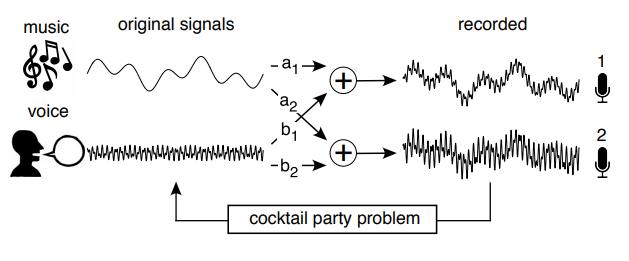
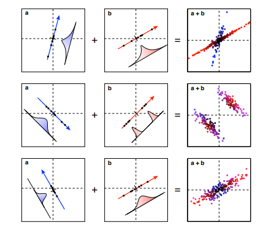
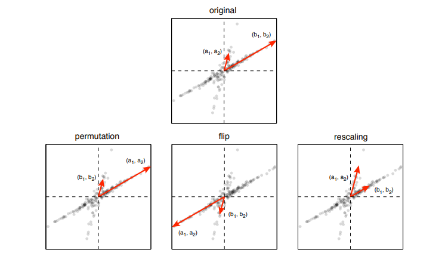
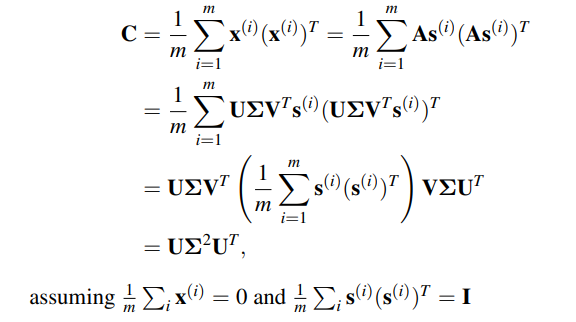
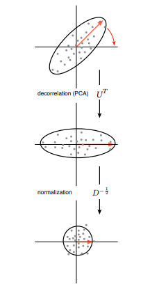
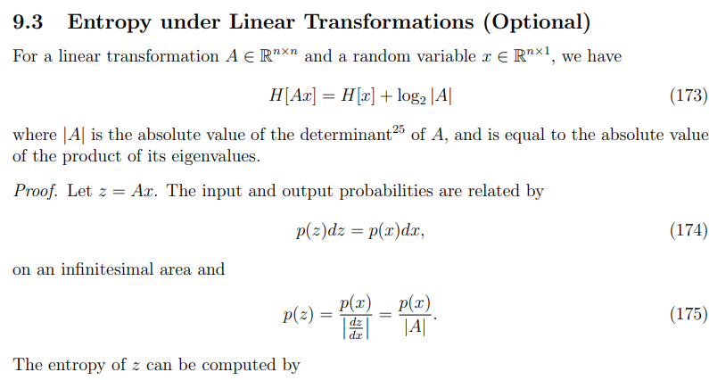
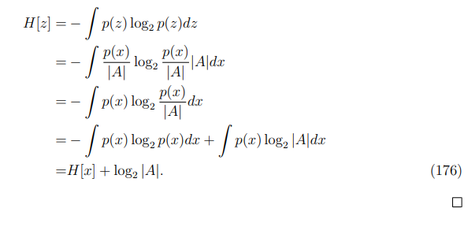
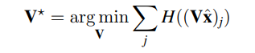
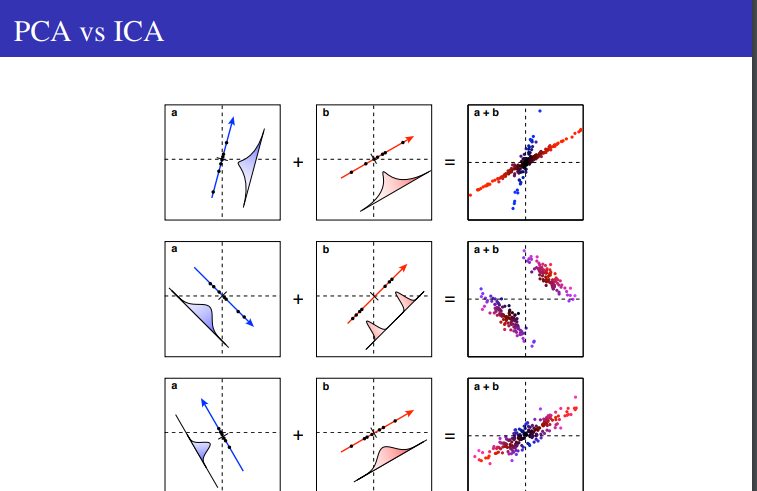
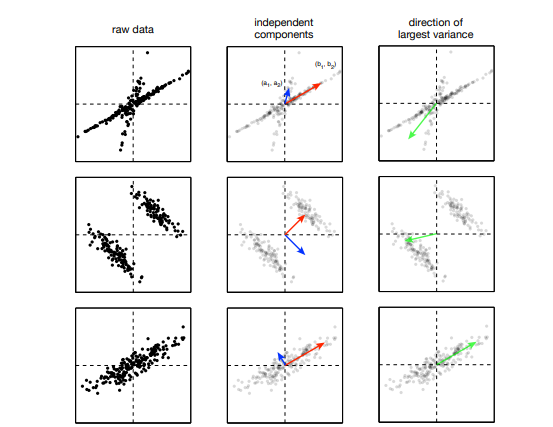

## Lecture 11: Independent Component Analysis

 ### Independent Component Analysis Motivation

* Measurements in the real world are corrupted by random noise - but that is only one piece of the story. Often, measurements cannot be made in isolation, but reflect the combination of many distinct sources
* Linear mixing of independent sources is exactly what occurs then you listen to multiple audio sources at the same time
* Humans are able to de-mix multiple sources of audio (multiple people speaking) into distinct sources very accurately
* Independent component analysis (ICA) is designed to solve exactly this problem (called blind source separation) and can do so very reliably when the number of observed linearly mixed channels is equal to the number of sources
* [Demo](https://cnl.salk.edu/~tewon/Blind/blind_audio.html) 

### ICA Illustration

* An example

  

  

  * Where the $x$-axis and the $y$-axis represents the signal of music recorded for microphone 1 and 2 respectively (the loud of the sound times the corresponding weight for two microphones)
  * Since the voice has positive correlation to the distance between the source and the microphone, the proportion of voices recorded by different microphone is a constant because of the fixed distance => if each data point represents the record of a specific time, the points for the same source are distributed on a line throw the origin with the slope equals to the proportion of distances between source and two different microphones
  * We assume that the points for each microphone has a normal distribution on time (the signal is time independent)
  * In this case, it is useless to find a maximum variance direction

### ICA Formulation

* To formalize this problem, assume the data $\textbf s \in \R^{n \times 1}$ is generated via $n$ independent sources (at a specific time). What we observe is 
  $$
  \textbf x = \textbf A \textbf s
  $$

  * where $\textbf A \in \R^{n \times n}$ is an unknown *mixing* matrix
  * ==**Each row of $\textbf A$ represents a microphone==**

* Repeated observations (get the sample different time) gives us a dataset $D:\{\textbf x^{(i)}, i=1,...,m \}$, and our goal is to find $\textbf A$, so that given the observation $\textbf x^{(i)}$, we can recover the sources $\textbf s^{(i)}$ by computing $\textbf s^{(i)}=\textbf W \textbf x^{(i)}$ , where $\textbf W = \textbf A^{-1}$ is the *unmixing* matrix

* In our cocktail party problem, $s_j^{(i)}$ is the sound that speaker $j$ was uttering at time $i$. Similarly, $\textbf x^{(i)}_j$ is acoustic reading recorded by microphone $j$ at time $i$  

* Notice that here the $i$ is the index of **==each column==**

### ICA Ambiguities (歧義, 等价)

* To what degree can $\textbf W^{-1}=\textbf A$ be recovered

* Permutation ambiguity: The labels of each independent component can be arbitrarily permuted. That is, given only the $\textbf x^{(i)}$‘s, there will be no way to distinguish between $\textbf A$ and $\textbf A \textbf P$, where $\textbf P\in \R^{n \times n}$ is a permutation matrix (the order of independent components can be changed)

* Sign ambiguity: Any independent component can be flipped across the origin. That is, $\textbf A$and $−\textbf A $ are treated identical in practical applications (the direction of independent components can be changed)

* Scale ambiguity: Any independent component can be rescaled with arbitrary length. For example, given $\alpha \neq 0$, we have (the length of independent components can be changed, and absorbed to the matrix $\textbf A$)
  $$
  \textbf x^{(i)} = \textbf A\textbf s^{(i)} = \alpha \textbf A\textbf ({s^{(i)} \over \alpha}) = \hat{\textbf A}\hat{\textbf s}^{(i)}
  $$
  

### A Strategy for Solving ICA

* Divide-and-conquer provides a strategy to solve this problem. Rather than trying to solve for $\textbf s$ and $\textbf A$ simultaneously, we focus on finding $\textbf A$. Furthermore, rather than trying to solve for $\textbf A$ all at once, we solve for $\textbf A$ in a piece-meal fashion by cutting up $\textbf A$ into simpler and more manageable parts

* SVD of $\textbf A$ is given by $\textbf A = \textbf U \textbf Σ \textbf V^T$ (unknown)

* We estimate $\textbf A$ and its inverse $\textbf W$ by recovering each piece of the decomposition individually
  $$
  \textbf W = \textbf A^{-1} = \textbf V\textbf Σ^{-1}\textbf U^T
  $$

* To compute $\textbf U$ and $\textbf Σ$, we first estimate the covariance of the observed mixed data in terms of the underlying sources (PCA)

  

  * The first assumption get the equation and the second one is from the three ambiguities
    $$
    {1 \over m} \sum_i\textbf s^{(i)}{\textbf s^{(i)}}^T=E(\textbf s^{(i)}{\textbf s^{(i)}}^T) =  \\
    \begin{bmatrix}
    E(\textbf s_1{\textbf s_1}) & E(\textbf s_1{\textbf s_2}) & ... & E(\textbf s_1{\textbf s_n})\\
    ... &...&...&... \\
    ... &...&...& E(\textbf s_n{\textbf s_n}) \\
    \end{bmatrix} = \textbf I = {1 \over m}\textbf s\textbf s^T
    $$

    * Each row is orthogonal to other rows

    * Because we assume $\textbf s$ is normalized and different features(**==speakers==**) of $\textbf s$ are independent 

      * $E(s_is_j)=0$ when $i \neq j$ 

      $$
      E(S_iS_j) = \sum _{s_i\in S_i, s_j\in S_j}p(S_i = s_i, S_j = s_j) s_i s_j \\
      =\sum _{s_i\in S_i, s_j\in S_j}p(S_i = s_i)p(S_j = s_j) s_i s_j \\
      =\sum _{s_i\in S_i}p(S_i = s_i)s_i\sum _{s_j\in S_j}p(S_j = s_j)s_j \\
      =E(S_i)E(S_j) = 0*0 = 0 \\
      $$

      * $E(s_is_j)=1$ when $i = j$ 
        $$
        Var(S_i) = {\sum_{s_i \in S_i}(s_i-\mu)^2p(s_i)}\\
        = \sum_{s_i \in S_i}(s_i^2+\mu^2-2s_i\mu)p(s_i) \\
        =\sum_{s_i \in S_i}s_i^2p(s_i) +  \sum_{s_i \in S_i}\mu^2p(s_i) -2\sum_{s_i \in S_i}s_i\mu\ p(s_i)\\
        = \sum_{s_i \in S_i}s_i^2p(s_i) +  \mu^2\sum_{s_i \in S_i}p(s_i) -2\mu\sum_{s_i \in S_i}s_i\ p(s_i)\\
        = \sum_{s_i \in S_i}s_i^2p(s_i) + \mu^2 - 2\mu^2\\
        = E(S_i^2)  - E(S_i)^2 \\
        Var(S_i)=1, E(S_i)=0 \\
        E(S_i^2) = 1
        $$

* Transform the problem 

  * By out shrewd(精明) choice of assumption, the covariance of the data $\textbf C = \textbf U \textbf Σ^2 \textbf U^T$ is independent of sources $\textbf s^{(i)}$‘s as well as $\textbf V$, which can be solved using eigendecomposition
  * Therefore, if our assumptions behind ICA are correct, then we have identified a partial solution to $\textbf A$: $\textbf U$ is a matrix of the **stacked eigenvectors of the covariance of the data ($\textbf x$)** and $\textbf Σ$ is a diagonal matrix with the square root of the associated eigenvalue in the diagonal
  * Interestingly, the eigenvectors of the covariance are essentially the principal components of the data in PCA

* Defining $\hat{\textbf x}^{(i)} = (\textbf Σ^{-1} \textbf U^T)\textbf x^{(i)}=\textbf V^T \textbf s^{(i)}$ , we have:
  $$
  \hat{\textbf C} = {1 \over m} \sum^m_{i=1} \hat{\textbf x}^{(i)} (\hat{\textbf x}^{(i)})^T = {1 \over m} \sum^m_{i=1} \textbf V^T \textbf s^{(i)} (\textbf V^T \textbf s^{(i)})^T =\textbf I
  $$

  * where $\textbf x^{(i)}$ is first projected on the principal components, $\textbf U^T \textbf x^{(i)}$, to remove linear correlations, and then scaled so that every direction has unit variance $\textbf Σ^{-1} \textbf U^T \textbf x^{(i)}$. In signal processing, this is termed as *whitening*

    

  * Plugging $\hat{\textbf x}^{(i)}$ into $s^{(i)} = \textbf W \textbf x^{(i)}$, we simplify ICA down to solving $\textbf s^{(i)} = \textbf V \hat{\textbf x}^{(i)}$, i.e. finding a rotation matrix $\textbf V$

  * We now need to **exploit the statistics of independence** to identify $V$. Whitening the data removed all second-order correlations, hence discerning the last rotation matrix $V$ requires examining other measures of dependency  

  * Statistical independence is the strongest measure of dependency between random variables. In particular, if two random variables $a$ and $b$ are independent, then $p(a, b) = p(a)p(b)$ - the joint
    probability factorizes. In the context of ICA, we assume that all sources are statistically independent, thus $p(\textbf s) = \Pi_jp(\textbf s_j)$  

* Mutual Information

  * We resort to *multi-information*, a generalization of mutual information from information theory, to **judge how close a distribution is to statistical independence for multiple variables**
    $$
    I(\textbf s) = \sum_{s \in S} p(\textbf s)log {p(\textbf s) \over \Pi_jp(s_j)}
    $$

    * It is a non-negative quantity that reaches a minimum of zero if and only if all variables are statistically independent. For example, if $p(\textbf s) = \Pi_jp(\textbf s_j)$ , $I(\textbf s) = 0$ 

  * Minimizing the multi-information is difficult in practice but can be simplified

  * The multi-information is a function of the entropy, which is defined as $H(\textbf s) = - \sum_{s \in S}p(\textbf s)logp(\textbf s)$, measuring the amount of uncertainty about a distribution $p(\textbf s)$ 

  * The multi-information is the difference between the sum of entropies of the marginal distributions and the entropy of the joint distribution

    * $|\textbf V| = 1$, since $\textbf V$ is orthogonal 

    $$
    I(\textbf s) = \sum_jH(s_j)-H(\textbf s) = \sum_jH((\textbf V \hat{\textbf x})_j)-H(\textbf V \hat{\textbf x})  \\
    =\sum_jH((\textbf V \hat{\textbf x})_j)-(H(\hat{\textbf x})+log_2|\textbf V|) = \sum_j H((\textbf V \hat{\textbf x})_j) - H(\hat{\textbf x})
    $$

    

    

*   Optimization

  * The optimization is simplified further by recognizing that the term $H(\hat{\textbf x})$ is a constant, independent of $V$, and can be dropped:

    

  * Calculating the entropy from a finite data set is difficult and should be approached with abundant caution. **Many ICA variants focus on approximations to the above equation**

  * It is equivalent to finding the rotation that maximizes the expected log-likelihood of the observed data under the assumption that the data are statistically independent

  * Likewise, a solution to the equation finds the rotation that maximizes the “non-Gaussianity” of the transformed data

* The ICA Algorithm

  * Subtract off the mean of the data in each dimension

  * Whiten the data by calculating the **eigenvectors of the covariance**
    **of the data**

  * Identify final rotation matrix that optimizes statistical independence

    

    

* Discussion

  * By assumption ICA expects the data to arise from an **(invertible) linear transformation** applied to a **factorial distribution.** Hence, ICA expects and will work optimally on data arising from linearly transformed factorial distributions - applying ICA to any other type of data is a gamble with no guarantees
  * ICA is equivalent to PCA for Gaussian data because a whitening filter based on PCA already achieves a factorial distribution and no need exists for computing $V$
  * If higher-order correlations are small or insignificant, then PCA is sufficient to recover the independent sources of the data
  * Empirically measuring $I(s)$ provides a useful check on how independent the recovered sources are. In practice, $I(s)$ rarely achieves 0 either because of sampling issues or because of local minima in the optimization 

### Questions

* What is the second order correlation
* Why PCA and ICA are equivalents for Gaussian data

