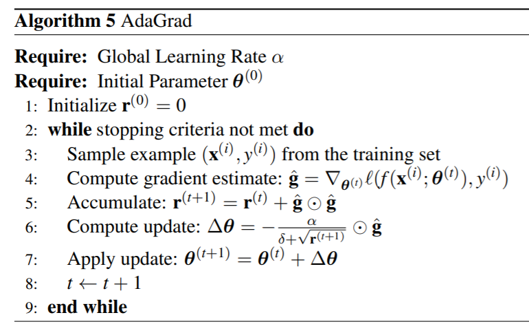
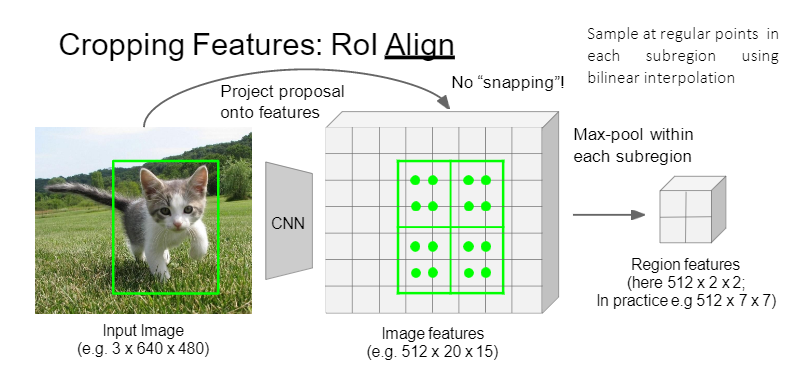

## Lecture 12: Neural Networks and Deep Learning

### Overview

* Feature Learning

  

* Grand Challenge: Why/how deep learning works

  * Gap between engineering (or art) and science: Lack of theoretical understandings guarantees, and analytical tools
  * Training is computationally expensive and difficult, relying on many “magics”
    * Structure design
    * Network initialization
    * Hyper-parameter tuning
  * No principled way to incorporate(包括) domain expertise(专长)
  * No principled way to interpret the model behaviors

### Neural Networks

* Mcculloch and Pitts Neuron (1943)

  

* The Perceptron (感受器) (for **binary** classification problems)
  * The Perceptron is a simple online algorithm for adapting the weights in a McCulloch/Pitts neuron. It was developed in the1950s by Rosenblatt at Cornell
    * Start with all-zero weight vector $\textbf w^{(0)}$, and initialize $t$ to $0$ 
    
    * For all $ (\textbf x^{(i)}, y^{(i)}) \in D$, compute the activation $\textbf a^{(i)} = (x^{(i)})^T\textbf w^{(t)}$
    
    * If $\textbf y^{(i)} \textbf a^{(i)} < 0$, then $\textbf w^{(t+1)} = \textbf w^{(t)}+y^{(i)}\textbf x^{(i)}$ and $t\leftarrow t+ 1$ 
      $$
      \textbf a^{(i)}_{t+1} = (x^{(i)})^Tw^{(t+1)} \\
      =(x^{(i)})^T(w^{(t)}+y^{(i)}\textbf x^{(i)}) \\
      =a^{(i)}_t + y^{(i)}(x^{(i)})^Tx^{(i)}
      $$
      
    
    
    
    
    
  * If $y^{(i)} = 1$ and $\hat {y}^{(i)} = -1$, the activation ($\hat{y}^{(i)}$) is initially negative and will be increased (see the equation)

  * If $y^{(i)} = -1$ and $\hat {y}^{(i)} = 1$, the activation is initially positive and will be decreased

* The Perceptron Theorem

  * Let the training set be $\textbf D = \{(\textbf x^{(i)}, y^{(i)}),i=1,...,m\}$. Assume that $||\textbf x^{(i)}||_2 \leq \alpha$ for all $i$ and further that there exists a unit-length vector $\textbf u$ ($||\textbf u||_2=1$) such that $y^{(i)}(\textbf u^T\textbf x^{(i)}) \geq \beta$ (weighted average of dimensions $\textbf x^{(i)}$ times $y^{(i)}$) for all examples in $D$. Then the total number of mistakes that the perceptron algorithm makes on this sequence is at most $(\alpha / \beta)^2$  

  * Proof:

    * The perceptron updates its weights only for following case:
      $$
      (x^{(i)})^Tw^{(t)}y^{(i)}\leq 0
      $$

  * According the rule of perceptron learning
      $$
      u^Tw^{(t+1)} = u^T(w^{(t)}+y^{(i)}x^{(i)}) \geq u^Tw^{(t)}+\beta
      $$

    * The weight matrix is initialized as $0$ :
  $$
      u^Tw^{(t+1)} \geq u^Tw^{(1)} + t\beta \geq t \beta
  $$

    * Therefore:
  $$
      ||w^{(t+1)}||^2_2 = ||w^{(t)} +y^{(i)}x^{(i)} ||^2_2 \\
      =||w^{(t)}||^2_2 + ||y^{(i)}x^{(i)}||^2_2 + 2y^{(i)}(x^{(i)})^Tw^{(t)} \\
      =||w^{(t)}||^2_2 + ||x^{(i)}||^2_2 + 2y^{(i)}(x^{(i)})^Tw^{(t)} \\
      \leq ||w^{(t)}||^2_2 + ||x^{(i)}||^2_2 \\
      \leq ||w^{(t)}||^2_2 + \alpha^2 \leq ||w^{(1)}||^2_2 + t\alpha^2 = t\alpha^2
  $$

    * Therefore:
      $$
    \sqrt{t}\alpha = ||w^{(t+1)}||_2 \\
      = ||w^{(t+1)}||_2 ||u||_2 \geq ||w^{(t+1)}||_2 ||u||_2 cos\ \theta \\
      = u^T w^{(t+1)} \geq t\beta
      $$
    
    * Which implies that: 
      $$
      t \leq ({\alpha \over \beta})^2
      $$
    
    * Hence, if the perceptron made  a $t$-th mistake, $t$ must be less than or equal to $({\alpha \over \beta})^2$. That is, the perceptron always converges as long as the data set $D$ is linearly separable (i.e. there exists a unit-length vector $u$ s.t. $y^{(i)}(\textbf u^T\textbf x^{(i)}) \geq \beta$ for $\forall\ x^{(i)} \in D$)
    
  * Limitations of Single Layer Perceptrons

    * The representational power of the single-layer perceptron was not well understood at first in the AI community
    * In 1969, Minsky and Papert at MIT popularized a set of arguments showing that the single-layer perceptron could not learn certain classes of functions (including XOR)
    * They also showed that more complex functions could be represented using a multi-layer perceptron or MLP, but no one knew how to learn them from examples
    * This led to a shift away from mathematical/statistical models in AI toward logical/symbolic models

* Multi-Layer Perceptron

  

  * The solution to MLP learning turned out to be: 

    * Make the hidden layer non-linearities smooth (sigmoid/logistic) functions: 
      $$
      h^{(1)}_j = {1 \over {1 + exp(-(\sum_kw^{(1)}_{jk}x_k + b^{(1)}_j ))}} \\
      h^{(t)}_j = {1 \over {1 + exp(-(\sum_kw^{(t)}_{jk}h_j^{(t-1)} + b^{(t)}_j ))}} \\
      $$

* Make the output layer non-linearity a smooth function

* Use standard numerical optimization methods (gradient descent) to learn the parameters. The algorithm is known as back propagation and was popularized by Rumelhart, Hinton and Willianms in the 1980s

* Activation Functions

  

  * Sigmoid or Logistic Activation Function

      * Sigmoid function translates the input ranged in $[-\infin;+\infin]$ to the range in $(0,1)$ 
      * A more generalized sigmoid function that is used for **multiclass classification** called softmax  function
      * Problems with sigmoid function
        * The $exp(.)$ function is computationally expensive
        * It has the problem of vanishing gradients

    * Tanh Activation Function

      * The tanh function is defined as
        $$
        tanh(x) = {e^{2x}-1 \over e^{2x}+1}
        $$

      * It is bound to range $(-1, 1)$

      * The gradient is stronger (i.e., steeper (陡)) for tanh than sigmoid

      * Like sigmoid, tanh also has a vanishing gradient problem

      * In practice, optimization is easier for tanh hence in practice it is
        always preferred over sigmoid function

    * ReLU Activation Function

      * The ReLU (Rectified (矫正) Linear Units) function is defined as
        $$
        ReLU(x) =
        \begin{equation}
        \begin{cases}
        x,\ if\ x\geq0\\
        0,\ if\ x < 0
        \end{cases}
        \end{equation}
        $$

      * ReLU is identity for positive values, and zero for negative values

      * Benefits of ReLU

        * Cheap to compute and easy to optimize
        * It converges faster
        * No vanishing gradient problem
        * Can output a true zero value, leading to representational sparsity

      * Problems with ReLU: If one neuron gets negative it is unlikely for it to recover (since the gradient is zero). This is called "**dying ReLU**" problem

    * Variants of ReLU

      * LReLU

        * Leaky ReLU is defined as: 
          $$
          LReLU(x) =
          \begin{equation}
          \begin{cases}
          x,\ if\ x\geq0\\
          ax,\ if\ x < 0
          \end{cases}
          \end{equation}
          $$
    
  * Leaky ReLU attpempts to fix the "dying ReLU" problem. Instead of the function being zero when $x < 0$, a leaky ReLU gives a small negative slope
    
  * $a$ is a parameter constrained to be postive. It can either be pre-determined or learned from data. 
    
  * ELU (Exponential Linear Unit)
    
    * The ELU is defined as: 
      ​    $$
      ​    ELU(x) =
      ​    \begin{equation}
      ​    \begin{cases}
      ​    x,\ if\ x\geq0\\
      ​    a(e^x-1),\ if\ x < 0
      ​    \end{cases}
      ​    \end{equation}
      ​    $$
      
    * It follows the same rule for $x\geq0$ as ReLU, and increases exponentially for $x < 0$. 
      
    * ELU tries to make the mean activations closer to zero which speeds up training (by adjusting $a$)
      
    * Empirically, ELU leads to higher classification results
    
  * Maxout Activation
    
    * The maxout activation function is defined as
        $$
        Maxout(\textbf x; \textbf w_1, \textbf w_2) = max\{\textbf w_1^T\textbf x, \textbf w_2^T\textbf x\}
        $$
    
    * It is piecewise linear that returns the maximum of the inputs
    
    * The maxout activation is a generalization of ReLU and leaky ReLU. It is a learnable activation function
    
    * The maxout neuron, therefore, enjoys all the benefits of ReLU (linear regime of operation, no saturation) and does not have its drawbacks (dying ReLU)
    
    * However, it doubles the total number of parameters for each neuron and hence, a higher total number of parameters need to be trained
    
  * Universal Approximation Theorem
    
    * It can be shown that a sigmoid network with one hidden layer (of infinite nodes) is a universal function approximator
      * In terms of classification, this means neural networks with one hidden layer (of unbounded size) can represent any decision boundary and thus have infinite capacity
      * It was also shown that deep networks can be more efficient at representing certain types of functions than shallow networks
      * It is not the specific choice of the activation function, but rather the multi-layer feedforward architecture itself which gives neural networks the potential of being universal approximators
      * It does not touch upon the algorithmic learnability of those parameters
      
    * More Failures
    
      * Through the 1990s, it became clear that while these models could represent arbitrarily complex functions and that deep networks should work better than shallow networks, no one could effectively train deep networks
      * This led to a shift away from neural networks towards statistical models and SVMs through the late 1990s and 2000s
      * Only a few groups continued to work on neural networks during this time period (Schmidhuber, Hinton, LeCun, Bengio, Ng)
      * Highly recommended reading: “Deep Learning: Our Miraculous Year 1990-1991” by Jürgen Schmidhuber

### Deep Learning

* Solution to the deep learning problem (as of right now) appears to be:

  * Have access to lots of labeled data (i.e., millions of examples)

  * Make the non-linearities non-smooth again (rectified linear units, ReLU): 
    $$
    h_j^{(1)} = max(0, \sum_kw^{(1)}_{jk}x_k + b^{(1)}_j) \\
    h_j^{(t)} = max(0, \sum_kw^{(t)}_{jk}h_k^{(t-1)} + b^{(t)}_j) \\
    $$

  * Use improved optimization methods to learn the parameters

  * Use new regularization schemes to constrain the large number of model parameters in the network

  * Use GPUs for parallel computing with a massive 20-30 times speedup. Model training takes less than ten days for large vision problems instead of one year

* Main Idea

  * Learn a *feature hierarchy* all the way from raw data (i.e. image pixels for vision problems) to classifier

  * Each layer extracts features from the output of the previous layer

  * Train all layers jointly

    

### Backpropagation

* Backpropagation is a optimizing method to train deep neural network

* An example (non-vectorized)

  

* Another example: 

  

* General Case

  

* Patterns

  

### Convolutional Networks

* Fully Connected Layer

  

* Convolution Layer

  

  

  

  

  * ConvNet is a sequence of Convolution Layers, interspersed with activation function

    

* Origin of convolution idea

  - Convolution arises from the field of signal processing, which describes the output (in terms of the input) of an important class of operations (or systems) known as linear time-invariant(LTI)

    

  - A discrete-time signal such as $x[n]$ or $y[n]$ is described by an infinite sequence of values, $i.e.$, the time index $n$ takes values in $-\infty$ to $\infty$. The above picture is a snapshot at a particular time $n$

  - The sequence of output values $y[.]$ is the response of system $S$ to the input sequence $x[.]$

* Time Invariant Systems

  - Let $y[n]$ be the response of $S$ to input $x[n]$

  - If for all possible sequences $x[n]$ and integers $N$

    

  - Then system $S$ is said to be time invariant ($TI$). A time shift in the input sequence to $S$ results in an identical time shift of the output sequence

* Linear Systems

  - Let $y_1[n]$ be the response of $S$ to an arbitrary input $x_1[n]$ and $y_2[n]$ be the response to an arbitrary $x_2[n]$ 

  - If, for arbitrary scalar coefficients $a$ and $b$, we have

    

  - Then system $S$ is said to be linear. If the input is the weighted sum of several signals, the response is the superposition ($i.e.$, the same weighted sum) of the response to those signals

  - One key consequence: If the input is identically 0 for a linear system, the output must also be identically 0

* Unit Sample Responses

  

  - The unit sample response of a system $S$ is the response of the system to the unit sample input. We will always denote the unit sample response as $h[n]$. 

* Unit Sample Decomposition

  - A discrete-time signal can be decomposed into a sum of time-shifted, scaled unit samples

  - Example: 

    
    $$
    x[n] = x[-2]\delta[n+2] + x[-1]\delta[x+1] + x[0]\delta[n] + x[1]\delta[n-1] + x[2]\delta[n-2]
    $$

  - In general, for any particular index, only one term of this sum is non-zero
    $$
    x[n] = \sum^{\infty}_{k=-\infty}x[k]\delta[n-k]
    $$

* Modeling LTI Systems

  - If system $S$ is both linear and time-invariant, then we can use the unit sample response to predict the response to any input waveform $x[n]$

    

  - Indeed, the unit sample response $h[n]$ completely characterizes the LTI  system $S$, so you often see

    

* Discrete Convolution: Discrete Convolution typically contains the following steps:

  1. List the index ‘$k$’ covering a sufficient range
  2. List the input $x[k]$
  3. Obtain the reversed sequence $h[-k]$, and align the rightmost element of $h[n-k]$ to the leftmost element of $x[k]$
  4. Cross-multiply and sum ($i.e.$, dot product) the nonzero overlap terms to produce $y[n]$
  5. Slide $h[n-k]$ to the right by one position
  6. Repeat Steps 4 and 5; stop if all the output values are zero or if required

* Example

  

  

* Representative CNNs

  - LeNet-5

    

    - Average pooling (sub-sampling)
    - Sigmoid or tanh nonlinearity
    - Fully connected layers at the end
    - Trained on MNIST digit dataset with 60K training examples
    - Ref: Y. LeCun, L. Bottou, Y. Bengio, and P. Haffner, “Gradient-based learning applied to document recognition,”Proc. IEEE, 1998.

  - AlexNet, 2012

    

    - The **first** winner deep model in computer vision
    - 5 convolutional layers + 3 fully-connected layers + softmax classifier
    - Key technical features: ReLU, dropout, data augmentation
    - Ref: A. Krizhevsky, I. Sutskever, and G. Hinton, “Imagenet classification with deep convolutional neural networks.” inNIPS, 2012.

  - VGG-Net, 2014

    

    - Key technical features: Increased depth (up to 19) and smaller filter size (3)
    - Configurations D and E are widely used for various tasks, called VGG-16 and VGG-19
    - Ref: K. Simonyan and A. Zisserman, “Very deep convolutional networks for large-scale image recognition,” inICLR, 2015.

  - Deep Residual Network (ResNet), 2015

    

    - Key technical features: Skip connections for residual mapping up to $>1000$ layers
    - Ref: K. He, X. Zhang, S. Ren, and J. Sun, “Deep residual learning for image recognition,” inCVPR, 2016.

  - Wide ResNet, 2016

    

    - Widening of ResNet blocks (if done properly) provides a more effective way of improving performance of residual networks compared to increasing their depth
    - A wide 16-layer deep network has the same accuracy as a 1000-layer thin deep network and a comparable number of parameters, although being several times faster to train
    - Ref: S. Zagoruyko and N. Komodakis, “Wide residual networks,” inBMVC, 2016.

  - Densely Connected Networks (DenseNet), 2017

    

    

    - Key technical features: Finer combination of multi-scale features
    - Ref: G. Huang, Z. Liu, L. van der Maaten, and K. Q. Weinberger, “Densely connected convolutional networks,” inCVPR, 2017.

* More Art of Convolutions: 

  - Fully Convolutional Networks (FCN), 2014

    

    - Key technical features: No fully-connected layer => No fixed requirement on input size
    - Widely adopted in pixel-to-pixel prediction tasks, $e.g.$, image segmentation
    - Ref: J. Long, E. Shelhamer, and T. Darrell, “Fully convolutional networks for semantic segmentation,” inCVPR, 2015.

  - U-Net, 2015

    - The architecture consists of a contracting path to capture context
    - and a symmetric expanding path to enable precise localization
    - Very popular backbone for dense prediction (image segmentation, restoration, etc.)
    - Ref: O. Ronneberger, P. Fischer, and T. Brox, “U-Net: Convolutional networks for biomedical image segmentation,” inMICAI, 2015.

  - Dilated Convolution, 2015

    

    - Aggregates multi-scale contextual information without losing resolution or analyzing rescaled images
    - Has layer receptive fields with the same computation and memory cost
    - Improves the performance on dense prediction tasks,e.g.,semantic segmentation
    - Ref: F. Yu, and K. Vladlen, “Multi-scale context aggregation by dilated convolutions,” in ICLR, 2016.

---------------------------

## Lecture 13: Deep Learning -- Optimization

### Optimization and Implementation

- Gradient Descent (GD)

  

  - Pros: Gradient estimates are stable
  - Cons: Need to compute gradients over the entire training set for one update

- Stochastic Gradient Descent (SGD)

  

  - Pros: Computation time per update does not depend on $m$, allowing convergence on extremely large datasets
  - Cons: Gradient estimates can be noisy. Use mini batches

- Problems with GD and SGD

  - What if loss changes quickly in one direction and slowly in another ($i.e.$, error surface has high curvature)

    

  - What does gradient descent do: Very slow progress along shallow dimension, jittering along steep direction

- Momentum

  - How do we try and solve this problem

  - Introduce a new variable $\textbf v$, the velocity

  - We think of $\textbf v$ as the direction and speed by which the parameters move as the learning dynamics progress

  - The velocity is an exponentially decaying moving average of the negative gradients
    $$
    \textbf v^{t+1} = \rho\textbf v^{t} - \alpha^{(t)} \nabla_{\textbf θ^{(t)}}l(f(\textbf x^{(i)}; \textbf θ^{(t)}),y^{(i)}) \\
    \alpha \in[0,1) \\
    \textbf θ^{(t+1)} = \textbf θ^{(t)} + \textbf v^{(t+1)}
    $$
    

  - The velocity accumulates the previous gradients

  - The role of $\rho$

    - If $\rho$ is larger than $\alpha^{(t)}$, the current update is more affected by the previous gradients
    - Usually values for $\rho$ are set high $\approx 0.9$ 

  - Performance

    

  - Pseudo code

    

- Nesterov Momentum

  - Another approach: 

    - First take a step in the direction of the accumulated gradient
    - Then calculate the gradient and make a correction

    

  - Equation
    $$
    \hat{\textbf θ} = \textbf θ^{(t)} + \rho \textbf v^{(t)} \\
    \textbf v^{(t+1)} =  \rho\textbf v^{t} - \alpha^{(t)} \nabla_{\textbf
    θ^{(t)}}l(f(\textbf x^{(i)}; \hat{\textbf θ}),y^{(i)}) \\
    \textbf θ^{(t+1)} = \textbf θ^{(t)} + \textbf v^{(t+1)}
    $$

  - Pseudo code

    

- Adaptive Learning Rate Methods

  - Till now we assign the same learning rate to all parameters $\theta_j$‘s

  - If $\theta_j$‘s vary in importance and frequency, why is this a good idea?

  - It’s probably not

    

- AdaGrad

  

  - $\delta$ is used to make sure not dividing zero
  - Idea: Scale the gradient of a model parameter by square root of sum of squares of all its historical values
  - Progress along “steep” directions (with large partial derivatives) is damped
  - Progress along “flat” directions (with small partial derivatives) is accelerated
  - What happens to the step size over long time? Decays to zero

- RMSProp: “Leaky AdaGrad”

  - AdaGrad is good when the objective is convex

  - AdaGrad might shrink the learning rate too aggressively, we want to keep the history in mind

  - We can adapt it to perform better in non-convex settings by accumulating an exponentially decaying average of gradient

  - This is an idea that we use again and again in deep learning

  - Has about 2,500 citations on Google Scholar (As of Aug. 2019), but was proposed in a slide Geoffrey Hinton’s Cousera course

    

- Adam: ADAptive Moments

  - Adam is currently THE default optimization algorithm for training deep neural networks

  - Introduced by Kingma and Ba in 2015 and quickly accumulated more than 25,000 Google Scholar Citations as of Aug. 2019

  - Adam is like RMSProp with Momentum but with bias correction terms for the first and second moments

    

### Regularizations

- Data Augmentation

  - Adding noise to the input: a special kind of augmentation
  - Be careful about the transformation applied => label preserving
    - Example: classifying ‘b’ and ‘d’; ‘6’ and ‘9’

- Early Stopping

  

  - Idea: Don’t train the network to t small training error

  - Recall overfitting: With a larger hypothesis class, it is easier to find a hypothesis that fits training samples

  - Prevent overfitting: Use validation error to decide when to stop

    

  - In practice, when training, also output validation error

  - Every time validation error improves, store a copy of the network weights

  - When validation error plateaus for some time, stop

  - Return the copy of the weights stored

  - The number of training steps (i.e., iterations) is also a hyperparameter

- Dropout

  

  - In each update step, randomly sample a different binary mask to all the input and hidden units
  - Multiple the mask with the units and do the update as usual
  - Typical dropout probability: 0.8 for input and 0.5 for hidden units
  - Very useful for fully connected layers, less for convolutional layers
  - How can this possibly be a good idea?
    - Forces the network to have a redundant representation; prevents co-adaptation of features
    - Trains a large ensemble of models (that share parameters); Each binary mask corresponds to one model
  - How to vote to make a final prediction
    - Mask sampling: Randomly sample some (typically, 10 ~20) masks
    - For each mask, apply it to the trained model to get a prediction
    - Average the prediction
    - Ref: N. Srivastava, G. Hinton, A. Krizhevsky, I. Sutskever, and R. Salakhutdinov, “Dropout: A simple way to prevent neural networks from overfitting,” JMLR, 2014.

- Batch Normalization

  - Idea: Adjusts activations to lie within a desired operating range, while maintaining their relative values

  - Given a mini-batch $\Beta=\{(\textbf x^{(i)}, y^{(i)}), i= 1, ... , m\}$ 

  - Compute per-channel ($i.e.$ feature) mean: $\mu_j={1\over m} \sum^m_{i=1}x^{(i)}_j$

  - Compute per-channel variance: $\sigma^2_j = {1 \over m} \sum^m_{i=1}(x^{(i)}_j-\mu_j)^2$

  - Normalize $\textbf x^{(i)}$ across channel: $\hat{x}_j^{(i)} = {x^{(i)}-\mu_j\over\sqrt{\sigma^2_j+\epsilon}}$ 

  - Issue: What if zero-mean, unit variance is too hard of a constraint

  - Incorporate learnable scale and shift parameters $\gamma$ and $\beta$
    $$
    z^{(i)}_j = \gamma_j\hat{x}_j^{(i)} + \beta_j
    $$

  - Test time

    - Mean and variance estimates depend on mini-batch; can’t do this at test-time
    - Solution: Keep exponentially decaying moving average of values seen during training and use them for testing
    - During testing, batch normalization becomes a linear operator; can be fused with the previous convolutional layer
    - Learning $\gamma_j = \sigma_j$ and $\beta_j = \mu_j$ will recover the identity function
    - Usually inserted after convolutional layers and before nonlinearity
    - Behaves differently during training and testing: this is a very common source of bugs

### Practical Tricks

- Data pre-processing

  - Simplest: Zero-center the data, and then normalize them
    - Makes sense only when data attributes have approximately equal importance but different scales
  - PCA whitening: The data is first centered, and then projected into the eigenbasis, followed by dividing every dimension by the corresponding eigenvalue
  - Never forget to shuffle your data each epoch for SGD input

- Weight Initialization

  - All zero initialization: Terribly Wrong!

    - If every neuron in the network computes the same output, then all of them will also compute the same gradients during backpropagation and undergo the exact same parameter updates

  - Small random initialization

    - Works okay for small networks, but not for deeper networks

  - Current recommendation for initializing CNNs with ReLU:

    ```
    w = np.random.randn(n) *sqrt(2.0/n)
    ```

    ‘randn’: Gaussian; ‘n’: the number of inputs for the current layer

  - Proper initialization is an active area of research

- Learning Rate Decay

  

  - SGD, Adagrad, RMSProp, Adam all have learning rate as a hyperparameter. Which one of these learning rates is best to use?
  - Answer: All of them! Start with large learning rates and decay over time
  - Reduce learning rate at a few fixed points. E.g. for ResNets, multiply α by 0.1 after epochs 30, 60, and 90.
  - Cosine: $\alpha_t = {1 \over 2}\alpha_0(1+cos(t\pi/T))$
  - Linear: $\alpha_t = \alpha_0(1-t/T)$

- Transfer Learning

  

  - Deep features are fairly transferable, and open-source pre-trained models are now everywhere.

    

---------------

## Lecture 14: Deep Learning -- Applications in Low-Level Computer Vision

### Low Level Vision

* Recover the unseen pixels -- image inpainting (修补)
  $$
  \textbf y = \textbf A\textbf x + \textbf e
  $$

  * $\textbf x$: Signal to be recovered

  * $\textbf e$: Measurement errors

  * $\textbf A$: Sensing matrix

  * $\textbf y$: Measurements

    

  * What kind of prior knowledge we can have for this ill-condition task

* Deep Learning for Image Restoration and Enhancement

  * Current trend: end-to-end + image-level

  * Future promise: end-to-end + domain-expertise + self-similarity

  * Three examples

    * Image denoising
    * Image deblurring
    * Image super-resolution

  * More "wild" image restoration examples: compression artifact removal, haze/rain/snow removal, underwater/low-light enhancement etc.

    

### Image Denoising

* Image Denoising

  * Simplest low-level vision problem

  * Noisy measurement: $\textbf y = \textbf x + \textbf e$

    

  * Estimate the clean image: $\hat{\textbf x} = f(\textbf y)$

    

* Conventional(常规) Methods

  * Collaborative (协同) Filtering
    * Non-local means, BM3D, etc.
    * Refs: 
      * A. Buades, B. Coll and J. M. Morel, “A non-local algorithm for image denoising,” in CVPR, 2005.
      * K. Dabov, A. Foi, V, Katkovnik, and K. Egiazarian, “Image denoising by sparse 3-D transform-domain collaborative filtering,” IEEE TIP, 2007.

  * [Piece-wise smoothing](https://en.wikipedia.org/wiki/Total_variation_denoising)

    * Total variation, Tikhonov regularization, etc.

      

  * Sparsity

    * Discrete cosine transform (DCT), Wavelets, etc.
    * Dictionary learning: OMP, Lasso, K-SVD, etc
    * Refs: 
      * J. Portilla, V. Strela, M. J. Wainwright, and E. P. Simoncelli, “Image denoising using scale mixtures of Gaussians in the wavelet domain,”IEEE TIP, 2003.
      * M. Aharon, M. Elad, and A. Bruckstein, “K-SVD: An algorithm for designing overcomplete dictionaries for sparse representation,”IEEE TSP, 2006.

* Image Denoising by Deep Learning

  * Natural idea: train a (convolutional) denoising autoencoder, that regresses clean images from noisy ones
  * It is not easy for deep networks to outperform classical methods such as BM3D
    * BM3D is shown to be better at dealing with self-repeating regular structures
  * How to outperform(在...方面优于...) BM3D using a deep network denoiser?
    * The model capacity is chosen large enough, i.e., enough hidden layers with sufficiently many hidden units
    * The patch (grid) size is chosen large enough, i.e., a patch contains enough information to fit a complicated denoising function that covers the long tail
    * The chosen training set is large enough

* Conventional vs. Deep Learning Methods

  |                 | Convenrional                                                 | Deep Learning                                                |
  | --------------- | ------------------------------------------------------------ | ------------------------------------------------------------ |
  | Model           | Shallow model (Equivalently one free layer)                  | Deep model (Multiple free layers)                            |
  | Supervise       | Unsupervised (1. No training corpus (语料库) needed 2. Data efficient) | Supervised (1. Training corpus needed 2. Data inefficient)   |
  | Inverse problem | 1. Assumption & understanding of the data 2. Regularizers  & structures of the model 3. Flexible | 1. Little assumption 2. Almost free model 3. Few work until recently |

  * [Recent work](https://github.com/wenbihan/reproducible-image-denoising-state-of-the-art)

* Residual Learning (learn the noisy image)

  

  * MSE is the perfect loss in this setting
  * Much easier to optimize
  * Ref: K. Zhang, W. Zuo, Y. Chen, D. Meng, and L. Zhang, “Beyond a Gaussian denoiser: Residual learning of deep CNN for imagedenoising,”IEEE TIP, 2017.

* DnCNN with all bias terms removed

  

  * Interpretable (可解释的)
  * Robust (强大的)
  * Ref: S. Mohan, Z. Kadkhodaie, E. P. Simoncelli, and C. Fernandez-Granda, “Robust and interpretable blind image denoising viabias-free convolutional neural networks,”arXiv.org e-prints, Technical Report 1906.05478, 2019.

* Why are people interested of denoising

  * Simplest inverse problem with  $\textbf A =\textbf I$
  * Ideal test bed to verify the effectiveness of the proposed regularizer

### Image Deblurring

* Image Deblurring

  * Blurred Measurement: $\textbf y = \textbf M * \textbf x$ 

    

    * Where $\textbf M$ is the convolution kernel

  * Estimate the stable image: $\hat{\textbf x} = f(\textbf y)$

    

  * Non-blind image debluring

    - Suppose the blurring kernel $\textbf M$ is known
    - $\hat{\textbf x} = f(\textbf y)$ 
    - All training data need to have consistent $\textbf M$ as the test data
    - Also difficult because of the compression loss

  * Blind image deblurring - a much more challenging problem

    - Estimate both the image, and the blurring kernel
    - $\{\hat{\textbf x}, \hat{\textbf M}\} = f(\textbf y)$

* Image Deblurring by Deep Learning

  * Key technical features:

    * Treat deblurring as a deconvolution task, which can be approximated by a convolution network with larger filter sizes

    * Concatenation of deconvolution CNN module with another denoising CNN module to suppress artifacts and reject outliers (压制伪影并拒绝异常值)

      

    * Ref: L. Xu, J. Ren, C. Liu, and J. Jia, “Deep convolutional neural network for image deconvolution,” inNIPS, 2014.

* Blind Image Deblurring

  

  * Key technical features: 
    * Iteratively estimate both the blurring kernel and the underlying image
    * Separate networks to capture the image property and the kernel information, respectively
  * Ref: C. J. Schuler, M. Hirsch, S. Harmeling, and B. Scholköpf, “Learning to deblur,”IEEE TPAMI, 2016.

### Image Super-Resolution

* Image Super-Resolution

  * Low-resolution measurement: $\textbf y = \textbf D \odot (\textbf M * \textbf x)$

    

    

  * Estimate the high-resolution image: $\hat{\textbf x} = f(\textbf y)$

    

* Image Super-Resolution by Deep Learning

  

  * Key technical features: 
    * Learn an end-to-end mapping from low to high-resolution images as a deep CNN
    * Closely mimic the traditional SR pipeline: LR feature extraction => coupled LR-HR feature space mapping => HR image reconstruction
  * Ref: C. Dong, C. C. Loy, K. He, and X. Tang, “Image super-resolution using deep convolutional networks,”IEEE TPAMI, 2015.

### New Trends

* New topic: dehazing, deraining, low-light enhancement, etc.
* New goal: Human perception v.s. machine perception (知觉)
* New setting: From supervised to unsupervised training (no“GT”) or relying on “synthetic pairs”
* New domain: Medical images, infrared images, remote sensing images, etc.
* New concern: “All-in-one” adaptivity, efficient implementation, etc.

-----------

## Lecture 15: Deep Learning -- Applications in High-Level Computer Vision

### Tasks


### Semantic Segmentation

* Task: 

  * Label each pixel in the image with a category label
  * Don't differentiate instances, only care about pixels

* Sliding Window

  

* Fully Convolution

  

  * Problem: Convolutins at orignal image resolution will be very expensive

* Fully Convolution with downsampling and upsampling

  

  * $CNN + CNN^{-1}$
  * Downsampling: Pooling, strided convolution
  * Upsampling: **Unpooling or striped transpose convolution**
  * Refs: Long, Shelhamer, and Darrell, “Fully Convolutional Networks for Semantic Segmentation”, CVPR2015Noh et al, “Learning Deconvolution Network for Semantic Segmentation”, ICCV2015

* Upsampling

  * Unpooling

    

  * Max Unpooling

    * Remember the position of copying the value in the max pooling layer, and just copy back to the position and fill zero

    

### Object Detection


* Single Object Detection => Classification + Localization

  * Use multitask loss

  

* Multiple Objects Detection => Expensive calculation

  

  * Apply a CNN to many different crops of the image, CNN classifies each crop as object or background

    

    * Problem: Need to apply CNN to huge number of locations, scales, and aspect ratios, very computationally expensive!

      

* Region Proposals: Selective Search

  

  - Find "blobby" that are likely to contain objects
  - Relatively fast to run; e.g. Selective Search gives 2000 region proposals in a few seconds on CPU
  - Ref: Alexe et al, “Measuring the objectness of image windows”, TPAMI 2012  Uijlings et al, “Selective Search for Object Recognition”, IJCV2013Cheng et al, “BING: Binarized normed gradients for objectness estimation at 300fps”, CVPR 2014  Zitnick and Dollar, “Edge boxes: Locating object proposals from edges”, ECCV2014

* R-CNN

  * "Slow" R-CNN

    

    * Ref: Girshick et al, “Rich feature hierarchies for accurate object detection and  semantic segmentation”, CVPR2014.Figure copyright Ross Girshick, 2015; source. Reproduced with permission.

  * Fast R-CNN

    

    * Feature cropping methods

      * Rol Pool 

        

        

        

        

        * Problem: Region features slightly misaligned (due to snapping)

      * Rol Align

        

        * If the two-axis-distance is less than 1, add the weighted score

        

    * Ref: Girshick, “Fast R-CNN”, ICCV 2015. Figure copyright Ross Girshick, 2015; source. Reproduced w ithpermission.

  * R-CNN vs. Fast R-CNN

    

  * Faster R-CNN

    * Idea: Make CNN do proposals

    * Method: Insert Region Proposal Network (RPN) to predict proposals from features. Otherwise same as Fast R-CNN: Crop features for each proposal, classify each one. Jointly train 4 losses: 

      * RPN classify object / not object
      * RPN regress box coordinates
      * Final classification score (object classes)
      * Final box coordinates

      

    * RPN

      

      

      

    * Performance

      

    * Glossing over many details

      * Ignore overlapping  proposals with non-max suppression

      * How to determine whether a proposal is positive or negative?

      * How many positives/negatives to send to second stage?

        

        * Do we really need second stage?

          

          * Ref: Redmon et al, “You Only Look Once: Unified, Real-Time Object Detection”, CVPR2016 Liu et al, “SSD: Single-Shot MultiBox Detector”, ECCV 2016  Lin et al, “Focal Loss for Dense Object Detection”, ICCV201

      * How to parameterize bounding  box regression?

    * Ref: Ren et al, “Faster R-CNN: Towards Real-Time Object Detection with Region Proposal Networks”, NIPS  2015  Figure copyright 2015, Ross Girshick; reproduced with permission

* Comparation

  

### Instance Segmentation

* Mask R-CNN

  

  


