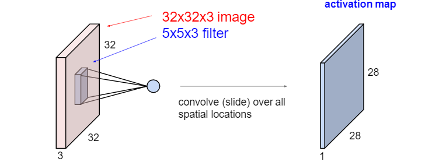

## Lecture 12: Neural Networks and Deep Learning

### Overview

* Feature Learning

  

* Grand Challenge: Why/how deep learning works

  * Gap between engineering (or art) and science: Lack of theoretical understandings guarantees, and analytical tools
  * Training is computationally expensive and difficult, relying on many “magics”
    * Structure design
    * Network initialization
    * Hyper-parameter tuning
  * No principled way to incorporate(包括) domain expertise(专长)
  * No principled way to interpret the model behaviors

### Neural Networks

* Mcculloch and Pitts Neuron (1943)

  

* The Perceptron (感受器) (for **binary** classification problems)
  * The Perceptron is a simple online algorithm for adapting the weights in a McCulloch/Pitts neuron. It was developed in the1950s by Rosenblatt at Cornell
    * Start with all-zero weight vector $\textbf w^{(0)}$, and initialize $t$ to $0$ 
    
    * For all $ (\textbf x^{(i)}, y^{(i)}) \in D$, compute the activation $\textbf a^{(i)} = (x^{(i)})^T\textbf w^{(t)}$
    
    * If $\textbf y^{(i)} \textbf a^{(i)} < 0$, then $\textbf w^{(t+1)} = \textbf w^{(t)}+y^{(i)}\textbf x^{(i)}$ and $t\leftarrow t+ 1$ 
      $$
      \textbf a^{(i)}_{t+1} = (x^{(i)})^Tw^{(t+1)} \\
      =(x^{(i)})^T(w^{(t)}+y^{(i)}\textbf x^{(i)}) \\
      =a^{(i)}_t + y^{(i)}(x^{(i)})^Tx^{(i)}
      $$
      
    
    
    
    
    
  * If $y^{(i)} = 1$ and $\hat {y}^{(i)} = -1$, the activation ($\hat{y}^{(i)}$) is initially negative and will be increased (see the equation)
  
  * If $y^{(i)} = -1$ and $\hat {y}^{(i)} = 1$, the activation is initially positive and will be decreased
  
* The Perceptron Theorem
  
  * Let the training set be $\textbf D = \{(\textbf x^{(i)}, y^{(i)}),i=1,...,m\}$. Assume that $||\textbf x^{(i)}||_2 \leq \alpha$ for all $i$ and further that there exists a unit-length vector $\textbf u$ ($||\textbf u||_2=1$) such that $y^{(i)}(\textbf u^T\textbf x^{(i)}) \geq \beta$ (weighted average of dimensions $\textbf x^{(i)}$ times $y^{(i)}$) for all examples in $D$. Then the total number of mistakes that the perceptron algorithm makes on this sequence is at most $(\alpha / \beta)^2$ 
  
  * Proof:
  
    * The perceptron updates its weights only for following case:
      $$
      (x^{(i)})^Tw^{(t)}y^{(i)}\leq 0
      $$
    
  * According the rule of perceptron learning
      $$
      u^Tw^{(t+1)} = u^T(w^{(t)}+y^{(i)}x^{(i)}) \geq u^Tw^{(t)}+\beta
      $$
      
    * The weight matrix is initialized as $0$ :
    $$
      u^Tw^{(t+1)} \geq u^Tw^{(1)} + t\beta \geq t \beta
    $$
    
    * Therefore:
    $$
      ||w^{(t+1)}||^2_2 = ||w^{(t)} +y^{(i)}x^{(i)} ||^2_2 \\
      =||w^{(t)}||^2_2 + ||y^{(i)}x^{(i)}||^2_2 + 2y^{(i)}(x^{(i)})^Tw^{(t)} \\
      =||w^{(t)}||^2_2 + ||x^{(i)}||^2_2 + 2y^{(i)}(x^{(i)})^Tw^{(t)} \\
      \leq ||w^{(t)}||^2_2 + ||x^{(i)}||^2_2 \\
      \leq ||w^{(t)}||^2_2 + \alpha^2 \leq ||w^{(1)}||^2_2 + t\alpha^2 = t\alpha^2
    $$
    
    * Therefore:
      $$
    \sqrt{t}\alpha = ||w^{(t+1)}||_2 \\
      = ||w^{(t+1)}||_2 ||u||_2 \geq ||w^{(t+1)}||_2 ||u||_2 cos\ \theta \\
      = u^T w^{(t+1)} \geq t\beta
      $$
    
    * Which implies that: 
      $$
    t \leq ({\alpha \over \beta})^2
      $$
    
    * Hence, if the perceptron made  a $t$-th mistake, $t$ must be less than or equal to $({\alpha \over \beta})^2$. That is, the perceptron always converges as long as the data set $D$ is linearly separable (i.e. there exists a unit-length vector $u$ s.t. $y^{(i)}(\textbf u^T\textbf x^{(i)}) \geq \beta$ for $\forall\ x^{(i)} \in D$)
    
  * Limitations of Single Layer Perceptrons
  
    * The representational power of the single-layer perceptron was not well understood at first in the AI community
    * In 1969, Minsky and Papert at MIT popularized a set of arguments showing that the single-layer perceptron could not learn certain classes of functions (including XOR)
    * They also showed that more complex functions could be represented using a multi-layer perceptron or MLP, but no one knew how to learn them from examples
    * This led to a shift away from mathematical/statistical models in AI toward logical/symbolic models
  
* Multi-Layer Perceptron

  

  * The solution to MLP learning turned out to be: 

    * Make the hidden layer non-linearities smooth (sigmoid/logistic) functions: 
      $$
      h^{(1)}_j = {1 \over {1 + exp(-(\sum_kw^{(1)}_{jk}x_k + b^{(1)}_j ))}} \\
      h^{(t)}_j = {1 \over {1 + exp(-(\sum_kw^{(t)}_{jk}h_j^{(t-1)} + b^{(t)}_j ))}} \\
      $$
  
* Make the output layer non-linearity a smooth function
  
* Use standard numerical optimization methods (gradient descent) to learn the parameters. The algorithm is known as back propagation and was popularized by Rumelhart, Hinton and Willianms in the 1980s
  
* Activation Functions
  
  
  
  * Sigmoid or Logistic Activation Function
  
      * Sigmoid function translates the input ranged in $[-\infin;+\infin]$ to the range in $(0,1)$ 
      * A more generalized sigmoid function that is used for **multiclass classification** called softmax  function
      * Problems with sigmoid function
        * The $exp(.)$ function is computationally expensive
        * It has the problem of vanishing gradients
  
    * Tanh Activation Function
  
      * The tanh function is defined as
        $$
        tanh(x) = {e^{2x}-1 \over e^{2x}+1}
        $$
  
      * It is bound to range $(-1, 1)$
  
      * The gradient is stronger (i.e., steeper (陡)) for tanh than sigmoid
  
      * Like sigmoid, tanh also has a vanishing gradient problem
  
      * In practice, optimization is easier for tanh hence in practice it is
        always preferred over sigmoid function
  
    * ReLU Activation Function
  
      * The ReLU (Rectified (矫正) Linear Units) function is defined as
        $$
        ReLU(x) =
        \begin{equation}
        \begin{cases}
        x,\ if\ x\geq0\\
        0,\ if\ x < 0
        \end{cases}
        \end{equation}
        $$
  
      * ReLU is identity for positive values, and zero for negative values
  
      * Benefits of ReLU
  
        * Cheap to compute and easy to optimize
        * It converges faster
        * No vanishing gradient problem
        * Can output a true zero value, leading to representational sparsity
  
      * Problems with ReLU: If one neuron gets negative it is unlikely for it to recover (since the gradient is zero). This is called "**dying ReLU**" problem
  
    * Variants of ReLU
  
      * LReLU
  
        * Leaky ReLU is defined as: 
          $$
          LReLU(x) =
          \begin{equation}
          \begin{cases}
          x,\ if\ x\geq0\\
          ax,\ if\ x < 0
          \end{cases}
          \end{equation}
          $$
          
  * Leaky ReLU attpempts to fix the "dying ReLU" problem. Instead of the function being zero when $x < 0$, a leaky ReLU gives a small negative slope
        
  * $a$ is a parameter constrained to be postive. It can either be pre-determined or learned from data. 
        
  * ELU (Exponential Linear Unit)
      
    * The ELU is defined as: 
          $$
          ELU(x) =
          \begin{equation}
          \begin{cases}
          x,\ if\ x\geq0\\
          a(e^x-1),\ if\ x < 0
          \end{cases}
          \end{equation}
          $$
      
    * It follows the same rule for $x\geq0$ as ReLU, and increases exponentially for $x < 0$. 
      
    * ELU tries to make the mean activations closer to zero which speeds up training (by adjusting $a$)
      
    * Empirically, ELU leads to higher classification results
      
  * Maxout Activation
    
    * The maxout activation function is defined as
        $$
        Maxout(\textbf x; \textbf w_1, \textbf w_2) = max\{\textbf w_1^T\textbf x, \textbf w_2^T\textbf x\}
        $$
    
    * It is piecewise linear that returns the maximum of the inputs
    
    * The maxout activation is a generalization of ReLU and leaky ReLU. It is a learnable activation function
    
    * The maxout neuron, therefore, enjoys all the benefits of ReLU (linear regime of operation, no saturation) and does not have its drawbacks (dying ReLU)
    
    * However, it doubles the total number of parameters for each neuron and hence, a higher total number of parameters need to be trained
    
  * Universal Approximation Theorem
    
    * It can be shown that a sigmoid network with one hidden layer (of infinite nodes) is a universal function approximator
      * In terms of classification, this means neural networks with one hidden layer (of unbounded size) can represent any decision boundary and thus have infinite capacity
      * It was also shown that deep networks can be more efficient at representing certain types of functions than shallow networks
      * It is not the specific choice of the activation function, but rather the multi-layer feedforward architecture itself which gives neural networks the potential of being universal approximators
      * It does not touch upon the algorithmic learnability of those parameters
      
    * More Failures
    
      * Through the 1990s, it became clear that while these models could represent arbitrarily complex functions and that deep networks should work better than shallow networks, no one could effectively train deep networks
      * This led to a shift away from neural networks towards statistical models and SVMs through the late 1990s and 2000s
      * Only a few groups continued to work on neural networks during this time period (Schmidhuber, Hinton, LeCun, Bengio, Ng)
      * Highly recommended reading: “Deep Learning: Our Miraculous Year 1990-1991” by Jürgen Schmidhuber

### Deep Learning

* Solution to the deep learning problem (as of right now) appears to be:

  * Have access to lots of labeled data (i.e., millions of examples)

  * Make the non-linearities non-smooth again (rectified linear units, ReLU): 
    $$
    h_j^{(1)} = max(0, \sum_kw^{(1)}_{jk}x_k + b^{(1)}_j) \\
    h_j^{(t)} = max(0, \sum_kw^{(t)}_{jk}h_k^{(t-1)} + b^{(t)}_j) \\
    $$

  * Use improved optimization methods to learn the parameters

  * Use new regularization schemes to constrain the large number of model parameters in the network

  * Use GPUs for parallel computing with a massive 20-30 times speedup. Model training takes less than ten days for large vision problems instead of one year

* Main Idea

  * Learn a *feature hierarchy* all the way from raw data (i.e. image pixels for vision problems) to classifier

  * Each layer extracts features from the output of the previous layer

  * Train all layers jointly

    

### Backpropagation

* Backpropagation is a optimizing method to train deep neural network

* An example (non-vectorized)

  

* Another example: 

  

* General Case

  

* Patterns

  

### Convolutional Networks

* Fully Connected Layer

  

* Convolution Layer

  

  

  

  

  * ConvNet is a sequence of Convolution Layers, interspersed with activation function

    

* Convolution

  * Convolution arises from the field of signal processing, which describes the output (in terms of the input) of an important class of operations (or systems) known as *linear time-invariant* (LTI)
  * 

---------------------------

