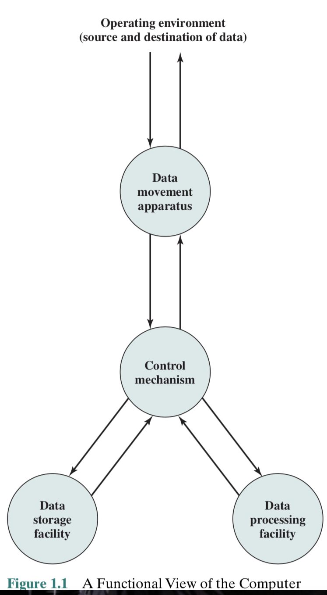

# CS 2115

#### Project (group - 4 person)

- report & presentation
- 5 bonus (up to 30%)

------

## Lecture 1

------

### 1. History:

- Analytical Engine
  - Charles Babbage
  - Made by mechanical
  - Started in 1833; never finished
- Turing machine (1937) => basis of modern computing
  - Theoretically, as poweful as other computers
  - Conceptually, a finite set of states, a finite alphabet and a finite set of instructions
  - Physically, it has a head (read&write), and move along an infinitely long tape that is divided into cells storing a letter
- Stored-program concept (1944 by John von Neumann and Alan Turing)
  - Store program and data in memory
  - A computer can read them form memory
  - Program can be altered
- Structure of von Neumann machine
  - Main Memory $\iff$ (CPU (CA and ALU))$\iff$ I/O
- Transistor
  - solid state device made from Silicon (sand)
  - Act as a variable value
- Integrated Circuit (1964)
- Moore's Law
  - The number of transistors that could be put on a single chip will be doubling every year (slows to 18 months in 70s(1970))
- The Gap between IC Capacity/ Design Productivity and Memory
  - Use wide data buses so we can retrieve more bits at the smae time when we read or write to memory
  - Include a cache or hierarchical buffering scheme to make memory chip work more efficiently
    - Reduce miss match
  - Put cache into processors (increasingly, processor design dedicates over 50% transistors for cache)
  - Use high-speed buses to interconnect processor and memory

------

### 2. Turing Machine

- Alan Turing : Father of Computer
  - Turing Machine
  - Cracking Nazi Enigma
  - Turing test
  - Turing Award
- Hierarchy of Machines : Combinational Logic $\in$ Finite-state machine $\in$ Push down automation $\in$ Turing machine
- A Thinking Machine
  - basic ideas
    - Compute anyting that a human can compute
    - Studied one of Hilbert's 10th mathematical conjecture on "Entscheidung problem"
    - Turing's machine is a thought experiement. Any algorithm can be carried

------

## Chapter 1

------

### 1.1 Organization And Architecture

- **Computer Architecture** : Refers to those attributes of a system visible to a programmer or, put another way, those attributes that have a direct impact on the logical execution of a program
- **Computer Organization** : Refers to the *operational units* and their *interconnections* that realize the architectural specifications (Same architecture may have different organizations)
- Organization attributes : Hardware details transparent to the programmer
  - Control signals
  - Interfaces between computers and peripherals
  - Memory technology used

------

### 1.2 Sturcture And Function

- Key of clearly describe millions of elementary electronic components : Recognize the hierarchical nature of most complex systems (Divide the system into different levels to implement)

- At each Level, the designer is concerned with structure and function

  - Structure : The way in which the components are interrelated
  - Function : The operation of each individual component as part of the structure

- Two choice to understand the Organization

  - Start at the bottom and building up a complete description
  - Beginning with a top view (Clearest and most effective)

- Function

  - Data processing
    - The data may take a wide variety of forms => range of processing requirements is broad
  - Data storage
    - Even if the computer is processing the data on fly (in and out immediately) the computer must temporarily sotre at least those
  - Data movement
  - Control

  

- 

