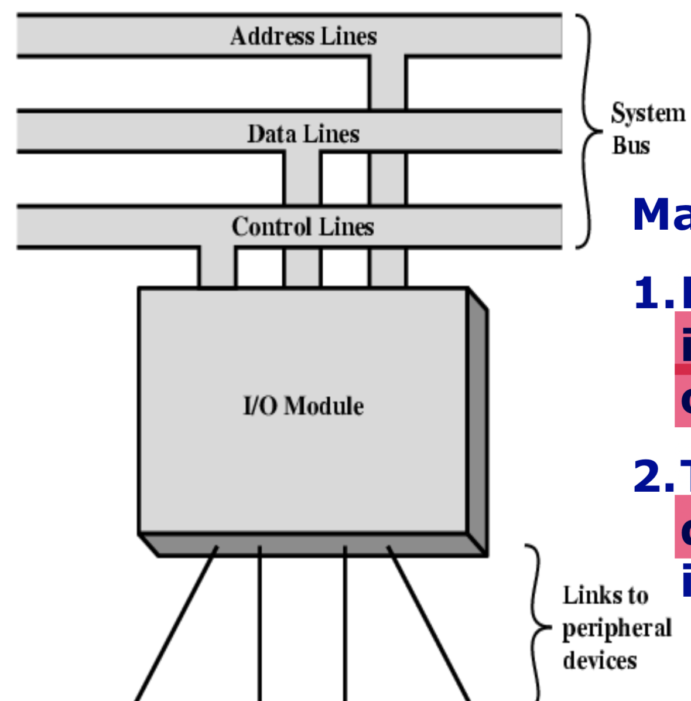

## Review of CS2115(some important points)

---------

### Lecture 2&3&4

* **Drawback** of **using sign magnitude numbers**:

  * Addition and subtraction need to consider sign and magnitude
  * 2 representations of 0
  * Complicate circuit and more computation time

* Range of number by using two's complement

  * $-2^{n-1}\leq N\leq 2^{n-1}-1$
  * start with 0(natural numbers) : 0~$2^{n-1}-1$ 
  * start with 1 (negative numbers) : $-2^{n-1}$~$-1$  
  * way to check overflow : $whether\ overflow=c_{n-1}\oplus c_n$ 

* The Range of **32-bit Binary Floating Point number** (8 exponent bits)

  - Biggest positive number : $(1+1*2^{-1}+1*2^{-2}+...+1*2^{-23})*2^{128}$
  - Smallest positive number : $(1)*2^{-127}$
  - Smallest negative number : $-(1+1*2^{-1}+1*2^{-2}+...+1*2^{-23})*2^{128}$
  - Biggest negative number : $-(1)*2^{-127}$

* Gray code

  - each two neighbor number different(hamming distance) is 1
  - Distance between two binary codewords is equal to the number of bits that these two codewords are different. 

  $$
  N_{Gray}={(N)_2}\ XOR \  {(N>>1)}_2
  $$

* Given n boolean inputs, there are $2^{2^n}$ functions : 

  * $2^n$ combinations => define how many rows
  * 2 represents the output may has 2 values (True or False) => consider each row => $2^{2^{n}}$ 

* SOP <-> minterm, POS <-> maxterm

  * can be expressed by a number (2=0010=A'B'CD')

* K-map: contructed by **boolean statement of truth table** 

  * overlap of simplification is allowed
  * right most - left most are permitted to connect
  * Top and bottom are permitted to connect

* Shannon's expansion

  * F(x1,x2,...,xn)=x1\*F(1,x2,...,xn)+x1'\*F(0,x2,...,xn)

* Binary decision diagram(BDD)

  * Root: variable
  * Leaf: truth value
  * Level: input order

* **Design Ideas of Digital Circuits at Different Scale**

  * Level of integration in an integrated circuit(IC):
    * SSI, MSI, LSI, VLSI
  * programmable logic array(PLA)
    * gates visible(first programmable device)
    * 2-level and-or sturcture
    * one time programmable
  * Field Programmable Gate Array(FPGA)
    * programmable logic blocks
    * programmable I/O blocks
    * programmable interconnect(clocks)

  

* Sequential Circuits : Every digital system is likely to have combinational circuits, most systems encountered in practice also include *storage elements*, which require that the system be described in term of *sequential logic* (The output of last operation will be the next input of the next operation). 

  

* SR-latch by using NAND

  

  * with control

    

* D Latch => One way to eliminate the undesirable condition (0,0) , S and R cannot equal to 1 at the same time

  

  - reduce the indetermined states, and ==Store D as Q==

  - Graphic Symbol

    

* Edge-Triggered D Flip-Flop

  

  * Representation

    - **positive** edge means **Q will only change at the point CLK turns to 1**
    - **negative** edge means **Q will only change at the point CLK turns to 0**

    

  * function table

    

* State Diagram => use the table to draw the diagram (state in the circle, event is consist of input/output, event changes state)

  

* Counting 0,1,2,3 

  

  

### Lecture 5&6 archietecture overview and ISA

* Turing machine : Mathmatical model of a device that can perform any computation （Turing's thesis : Every computation can be performed by some turing machine）

  * Tape => store a finite set of alphabets
  * Head => read and write from/to the tape, move left or right one cell at a time
  * state register => with a start state (and often accept state)
  * Finite table of instructions : given current state and the symbol read pointed by the head
    * Write/erase symbol
    * move head
    * state transition
  * ability to read/write symbols on an infinite "tape"
  * State transitions, based on current state
  * universal Turing machine: extends to Turing machine, implement all Turing machine, treat instructions as part of data

* Key points of von Neumann Architecture

  * CA,CC,M,I,O
  * use binary
  * single storage structure holds both instruction and datas
  * computer can fetch instructions and execute them automatically

* CPU Registers

  - MAR(memory address register) : Store the address to access memory

  - MBR(memory buffer register) : Store information that is being sent to, or received from, the memory along the bidirectional data bus

  - AC :  **Accumulator**(Y) used to store data that is being worked on by the ALU and is the key register in the data section of the CPU  (store some intermediate value of calculation) (memory cannot directly access, but can go through MBR)

  - PC : The **Program Counter** holds the address in memory of the next program ==instruction== (doesn't connect directly to memory but via MAR)(both a register and a counter(计数器))(send to memory, only store one address of memory, as an index)

  - IR (get from and send to memory): When memory is read, the data first goes to the MBR. If the data is an **instruction** it gets moved to the **Instruction Register** , has 2 parts

    - IR (opcode) : Store the most significant bits of instruction, tells CPU what to do (instruction here gets decoded and executed by the CU) => instruction part
    - IR (address) : Store the least significant bits  As the name suggests they usually form all or part of an address for later use in MAR => **address of data**

  - SP : **Stack Pointer** connected to the internal address bus used to hold address of **special chunk of main memory** used for temp storage during program execution

    

* Instruction Set Architecture : 

  - what it is
    - interface between hardware and software
    - A complete collection of instructions to control the CPU
      - operations to CPU 
      - standard set of instructions
    - registers addressing mode
  - Compose
    - Operation Code
    - Source Operands reference / Destination Operands reference / Next Instruction Reference
  - **Advantage: allows different implementation of the same architecture**
  - **Disadvantage: sometimes prevents adding new innovations**
  - tips to design it
    - Completeness, orthogonality, regularity and simplicity, compactness(简单紧凑) 
    - portability, compatibility (lives long)
    - Provides convenient functionality to higher levels 
    - Permits an efficient implementation at lower levels 
  - **Issues**:
    - Operation: add, sub, mul
    - Type&size of operands are supported : byte, int, float, double, string
    - operands stored: registers, memory, stack, accumulator
    - How many explicit operands are there: 0,1,2,3
    - Operand location specified(addressing mode): register, immediate, indirect

* CISC&RISC(complex instruction set computer&reduced....)

  * CISC: X86

  * RISC: MIPS

    

* Pipeline: set of data processing elements connected in series

  * more number of stages faster speed

  * Suppose one clock cycle lasts $τ$ seconds, there are $K$ stages for each instruction and there are $n$ instructions in total

    - Computer with pipeline : 
      $$
      T_{pipeline} = Kτ + (n-1) τ
      $$

    - Comupter without pipeline : 
      $$
      T_{non-pipeline} = Knτ
      $$

    - Speed Ratio : 
      $$
      {T_{non-pipeline} \over T_{pipeline} } = {Kn \over K+n-1}  = {K\over{K-1\over n }+1}
      $$

      - As n goes to infinity, the value goes to K

    - Instruction Throughput of a computer with pipeline(average number of instructions per unit time): 
      $$
      {n\over (K+n-1)τ}  = {1\over ({K-1\over n }+1)τ}
      $$

      - as n goes to infinity, the value goes to $1\overτ$ 

  * pipeline hazard:

    * control hazard: before condition judege of loop cannot pipeline next step after the loop
    * Data hazard: data used without initialized
    * **solve** : insert no-operation(nop) instruction => speedup ratio is not as high as calculated

* Classifying ISAs

  

  * **Most of new architectures use GPR(advantage of register):**
    * registers are much faster and no misses
    * reduce memory traffic
    * registers are convenient for variable storage
    * multiple read ports
    * short identifier
  * **disadvantage of register** 
    * need to save and restore on procedure calls and context switch
    * cannot take address of registers(for pointers)
    * fixed size and limit number
    * Compiler must manage

* 3 basic types of instructions

  * **arithemetic and logic**: AND, ADD
  * **data transfer**: MOVE, LOAD, STORE
  * **program control**: BRANCH, JUMP,CALL 

* Addressing mode: Define how machine language instructions identify the operands of each instruction(M is memory)

  * ISA instruction: 

    

  * **immediate mode**: ACC<-NBR(ADRS=NBR, depends on the addressing mode they has different meaning)

  * **Direct addressing mode**: ACC<-M[ADRS]

  * **indirect mode**: ACC <-M[M[ADRS]]

  * **register mode** : ACC<-R1

  * **register-indirect mode** : ACC <- M[R1]

  * **relative addressing mode**: ACC <- M[ADRS+PC(offset)]

  * **indexed addressing mode**: ACC <- M[ADRS+R1(offset)]

### lecture 8&9&10 CPU&memory&I/O

* Components of processor

  * ALU: made up of circuits that perform the arithemetic and logical execution within the processor(no internal storage)
  * CU: circuits direct and coordinate proper sequence, inerpret each instruction and apply proper signal to ALU and registers
  * Registers: high speed tmp data storage, **both instruction and data** can be stored in registers(IR and accumulator)
  * **data path**: registers, ALU, interconnecting bus

* Fetch and execute cycle

  * instructions stored in memory
  * fetch by the address pointed by PC, increment PC
  * IR to load the instruction, and decoding
  * CU send signal and perform the operation

* **function of CPU**

  * Transfer a word from one register to another or to the ALU
  * perform an arithmetic or logic operation and store the result in a register
  * Fetch(or store) data in(or to) memory(address stored in R1) and load into(or write from) the register(R2). Suppose $MAR_{out}$ is enabled all the time (WMFC=>wait for memory function complete)

* **Adder in ALU**

  

  * Carry-Lookahead Adder

    $C_{i+1} = A_iB_i+(A_i\oplus B_i)C_i=G_i+P_iC_i$ 

  * Original : Calculate c => 3 gate delay for each => 3*digits

  * Now: calculate G, P (without knowing C, i.e. pipeline)=> 1 gate delay for all => calculate c (3 gates delay in total to calculate all carry bits,4 to calculate the answer)

  * Disadvantage: need to many gates to calculate when there are many bits

    * combine carry-lookahead and ripple carry
      * 2*k+1 gates delay in total(k is the number of ripple-head adder)

* **multiplier in ALU**

  

* Main memory: part of computer where program and data are stored during execution

  * Consists of a number of cells, each of which can store a piece of information (data, instruction, character or number)
  * The size of the cell can be single byte or several successibe bytes(world)
    - Byte-addressable computer
    - Word-addressable computer
  * **Memory Access Time** : The time that elapses between the initiation and the completion of a memory access operation => How fast the memory responds to a read/write request
  * **Memory Cycle Time** : The minimum time delay required between the initiation of 2 successibe memory operations (Usually slightly longer than the access time)

* Address : Reference number of each cell, refered by which program can refer to it

  - k-bits address => $2^k$ cells directyly addressable
  - maximum size of address references available in main memory => **address space**
  - MAR : k-bit address bus to memory
  - MDR : n-bit data bus to memory

* Type of memory

  

  

* Hierarchy of memory

  

* **Cache(use SRAM)**

  * Hit: data matched, miss: data not in cache

  $hit\ ratio={number\ of\ hits \over total\ number\ of\ memory\ references}$ 

* transfer between CPU and cache: word transfer

  - transfer betweebn cache and memory: block transfer
  - mapping to map block in cache to memory

* Principle: locality

  - Temporal: recently executed instruction is likely to be executed again
  - Spatial: instruction in close proximity to a recently executed instruction are also likely to be executed again

* Ways of **write access for systems with cache memory**

  * **write-through** : cache and main memory locations are updated simultaneously
  * **write-back** : write to main memory when the block removed from cache

* mapping

  * associative mapping

    - main memory block can (randomly) be placed into any cache position => efficient cache memory using
    - Division of the memory address is same as division in memory into 2 parts
      - 12 bits for blocks 
      - 4 bits for selecting 1 word in 16 words
    - Cost is high because when searching, need to traverse 128 tags => thus for performance, it must be done in parallel

  * direct mapping(division according to size of cache

    - For main memory block j, assign a number j%128. Then for each block i in cache , it only stores j%128 = i

    - division of 16 bits address

      - 7 bits block field to determine block position in the cache ($2^7=128$)
      - 5 bits for tag, determine which super block in the 32 blocks it belongs to (there are 64/2 = 32 super blocks)
      - An example of 4-block cache

      

    - Drawbacks

      - More than one memory block is mapped onto a given cache block => contention may arise for that position even when the cache is not full
      - easy to implement but not flexible

  * Set-associative mapping

    - Blocks of the cache are grouped into sets, and each time store a main memory block in any block of a specific set

    - A cache that has *k* blocks per set is referred to as a *k-way* set-associative cache

    - Division of main memory address

      - 6-bit for set field to determine set in cache blocks
      - 6-bit for tag field corresponding to which block in the cache set
      - 4-bit word field

    - 4-block cache example

      

  * Replacement algorithm

    - Cache contoller should decide to remove which block to create space for new block kwhen the cache is full
    - Least recently used (LRU) replacement algorithm 
      - The block that has gone the longest time without being referenced is chosen to be overwritten. 

* Peripheral Device:

  * Output peripherals
    * Display peripherals: video display
    * hardcopy peripherals: Dot Matrix and Laser Printers
  * Input peripherals : keyboard, mouse,tracker ball, joystick
  * each device has a **device controller** to control device and receive/send data from/to CPU

* I/O module

  

  * major functions:
    * provide a standard interface for I/O operations
    * **tailored to specific I/O devices** and its interface requirements

* I/O Operations

  * programmed I/O
    * CPU directly controls I/O
      * Read/write commands, transferring data
      * Peridically poll I/O modules to check their status
    * Disadvantage: memory wait for for I/O module, waste CPU time
    * Advantage: simple and easy hardware/software
  * I/O addressing(for CPU)
    - Isolated: separate address space and special commands for I/O
    - Memory mapped: devices and memory share same address space, I/O looks like memory  read/write, no special command
  * Interrupt driven I/O
    * Reduce CPU spends on I/O operations
    * CPU issue command and continue for other tasks
    * when I/O finished IP module signals CPU
    * CPU responds to the interrupt(at the end of instruction execution cycle)
  * Direct Memory Access(DMA)
    * Does not need CPU except for initialization of I/O operations
    * **large amout of data can be transferred between memory and the peripheral without severely impacting CPU performance**
